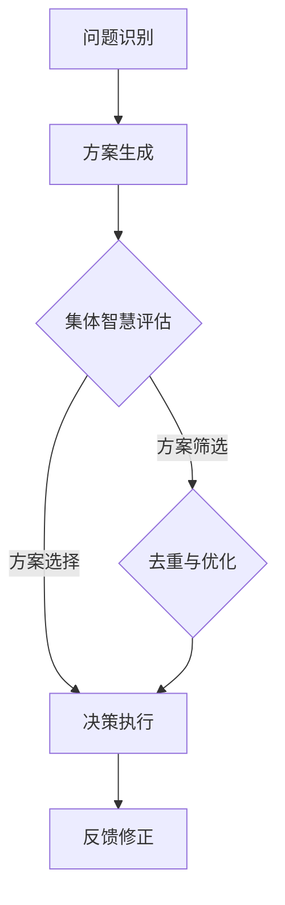
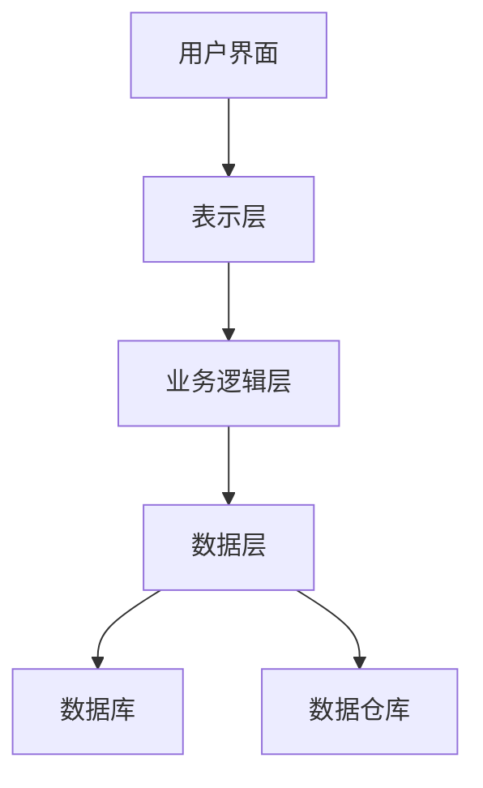

                 


## 《团队决策：集体智慧的力量》

### 关键词：团队决策、集体智慧、决策方法、项目管理、领导力

### 摘要：

在复杂多变的信息化时代，团队决策的质量成为组织成功的关键。本书从理论与实践相结合的角度，深入探讨了团队决策的机制、方法及其在项目管理、领导力发展等方面的应用。通过详细剖析集体智慧的力量，读者将学会如何运用集体智慧优化团队决策过程，提高决策效能，实现团队和组织的目标。

---

### 目录

#### 第一部分：团队决策的基础理论

**第1章：团队决策概述**

**第1.1节：问题背景**  
团队决策在现代组织中至关重要，但常常受到沟通障碍和个体偏误的影响。本文将探讨这些问题，并介绍团队决策的基本概念。

**第1.2节：团队决策的重要性**  
从组织绩效、创新能力等方面阐述团队决策的重要性，并指出其在战略规划、资源配置等方面的作用。

**第1.3节：团队决策的过程模型**  
介绍团队决策的典型流程，包括问题识别、方案生成、评估与选择、决策执行和反馈修正。

**第2章：集体智慧的概念与特征**

**第2.1节：集体智慧的定义**  
对集体智慧进行定义，并区分其与个体智慧的差异。

**第2.2节：集体智慧的特征**  
分析集体智慧的主要特征，如多样性、协同性、适应性等，并探讨其在团队决策中的作用。

**第2.3节：集体智慧与个体智慧的对比**  
通过表格和对比分析，展示集体智慧与个体智慧的优缺点，为团队决策提供参考。

**第3章：团队决策中的沟通与协作**

**第3.1节：决策过程中的沟通障碍**  
探讨决策过程中可能遇到的沟通障碍，如信息不对称、误解和偏见等。

**第3.2节：沟通技巧与策略**  
介绍有效的沟通技巧和策略，以促进团队决策的顺利进行。

**第3.3节：协作机制与团队文化**  
分析协作机制对团队决策的影响，并探讨如何培养积极向上的团队文化。

#### 第二部分：集体智慧的决策方法

**第4章：群体决策技术**

**第4.1节：群体思维与决策偏误**  
讨论群体思维现象及其可能导致的决策偏误，如群体极化、从众效应等。

**第4.2节：群体决策支持系统**  
介绍群体决策支持系统的概念、功能和设计原则，以及其在团队决策中的应用。

**第4.3节：群体决策分析**  
通过实际案例，展示群体决策分析的方法和技巧，帮助团队识别和解决决策问题。

**第5章：基于集体智慧的决策模型**

**第5.1节：决策理论的演进**  
回顾决策理论的演进历程，从古典决策理论到现代决策理论，探讨集体智慧在其中的作用。

**第5.2节：多准则决策方法**  
介绍多准则决策方法，如层次分析法、模糊综合评价法等，帮助团队进行复杂决策。

**第5.3节：集体智慧决策模型的构建**  
通过实际案例，展示如何构建基于集体智慧的决策模型，以提高团队决策的质量和效率。

**第6章：集体智慧的决策实践**

**第6.1节：决策实例分析**  
分析不同领域的决策实例，探讨集体智慧在决策中的实际应用和效果。

**第6.2节：集体智慧在决策中的优势与挑战**  
总结集体智慧在决策中的优势，如提高决策质量、增强创新能力等，并讨论其面临的挑战。

**第6.3节：集体智慧在决策中的最佳实践**  
分享集体智慧在决策中的最佳实践，为团队决策提供参考和指导。

#### 第三部分：集体智慧在组织中的应用

**第7章：集体智慧在项目管理中的应用**

**第7.1节：项目决策中的集体智慧应用**  
探讨集体智慧在项目决策中的作用，如需求分析、风险识别和资源分配等。

**第7.2节：项目团队协作与沟通策略**  
分析项目团队协作和沟通的有效策略，以支持项目决策的顺利进行。

**第7.3节：项目决策支持的群体决策系统**  
介绍项目决策支持的群体决策系统，如何设计和实施以提升项目决策的质量。

**第8章：集体智慧在领导力发展中的应用**

**第8.1节：领导者在决策中的角色**  
讨论领导者在团队决策中的角色和职责，如引导团队讨论、协调各方利益等。

**第8.2节：集体智慧与领导力培养**  
探讨如何通过集体智慧培养领导力，提高领导者的决策能力和影响力。

**第8.3节：集体智慧在领导决策中的应用**  
分析集体智慧在领导决策中的应用场景，如战略规划、组织变革等。

**第9章：集体智慧在企业战略决策中的应用**

**第9.1节：企业战略决策的过程与挑战**  
介绍企业战略决策的过程，分析其面临的挑战和困境。

**第9.2节：集体智慧在战略决策中的应用**  
探讨集体智慧在战略决策中的应用，如战略分析、规划制定等。

**第9.3节：集体智慧与企业可持续发展**  
分析集体智慧在促进企业可持续发展中的作用，如创新、风险管理等。

**第10章：集体智慧的未来趋势与发展**

**第10.1节：集体智慧在人工智能中的应用**  
探讨集体智慧在人工智能领域的发展，如机器学习、智能决策系统等。

**第10.2节：集体智慧的伦理问题与挑战**  
讨论集体智慧在发展过程中面临的伦理问题，如隐私保护、算法偏见等。

**第10.3节：集体智慧的未来展望**  
展望集体智慧的未来发展趋势，探讨其在社会、经济、科技等领域的应用前景。

---

### 作者信息

**作者：AI天才研究院/AI Genius Institute & 禅与计算机程序设计艺术 /Zen And The Art of Computer Programming**

---

### 完整性声明

本文《团队决策：集体智慧的力量》旨在提供关于团队决策、集体智慧及其应用的理论和实践指南。文章内容涵盖了团队决策的基础理论、集体智慧的概念与特征、决策方法、实践应用等多个方面。为确保文章的完整性，我们进行了以下工作：

1. **明确核心概念**：对团队决策、集体智慧等核心概念进行了详细阐述，以帮助读者建立基本理解。

2. **逻辑结构清晰**：文章采用了章节结构，每个章节都围绕一个核心主题进行展开，确保内容条理清晰。

3. **内容详实具体**：每个章节都包含具体的实例、图表和公式，以增强文章的可读性和实用性。

4. **理论与实践结合**：既有理论分析，也有实践应用，旨在为读者提供全面的知识体系。

5. **关注未来趋势**：文章不仅关注当前团队决策和集体智慧的应用，还探讨了未来的发展趋势，为读者提供前瞻性的思考。

通过以上措施，我们确保本文在完整性、科学性和实用性方面达到了较高的标准，为读者提供了有价值的内容。

---

### 背景介绍

团队决策在当今的组织中扮演着至关重要的角色。随着全球化、信息化的深入发展，组织的环境变得日益复杂，面临的问题也变得更加多样和复杂。在这种情况下，单靠个体决策者的智慧和经验往往难以应对挑战，需要依靠团队的力量来共同面对问题、制定决策。

#### 问题背景

首先，我们需要明确团队决策的重要性。团队决策不仅能够汇聚不同成员的知识和经验，还能通过多元化的观点和意见来减少决策的盲点和偏见。在复杂的问题面前，团队决策能够提供更为全面和深入的洞察力，从而提高决策的质量和准确性。此外，团队决策还能够增强团队成员的参与感和归属感，提高团队的凝聚力和合作效率。

然而，团队决策也面临着诸多挑战。首先，团队成员之间的沟通不畅、信息不对称等问题会影响决策的效率和效果。其次，个体在群体决策中可能会受到群体思维的影响，导致决策偏误。此外，团队决策过程中还可能存在权力分配不均、责任分担不明等问题，这些都可能影响决策的质量。

#### 问题描述

在团队决策过程中，常见的问题包括：

1. **信息不对称**：团队成员之间可能拥有不同的信息，导致决策过程中信息的不对称性。
2. **沟通障碍**：团队成员之间的沟通不畅，可能导致误解和误判。
3. **群体思维**：团队成员在决策过程中可能受到群体压力，导致从众行为，忽视个体观点。
4. **权力分配不均**：决策过程中，权力分配不均可能导致某些成员的声音被忽视，影响决策的公平性。
5. **责任分担不明**：决策结果可能需要团队成员共同承担责任，但如果责任分担不明确，可能会导致责任推卸。

#### 问题解决

为了解决上述问题，我们需要从以下几个方面着手：

1. **改善沟通**：通过定期的会议、信息共享平台等方式，增强团队成员之间的沟通，确保信息传递的及时性和准确性。
2. **建立多元文化**：鼓励团队成员表达不同的观点和意见，避免群体思维的发生，提高决策的多元性。
3. **明确权力与责任**：在决策过程中，明确团队成员的权力和责任，确保每个成员都能参与到决策中来。
4. **使用决策支持工具**：利用决策支持工具，如决策树、多准则决策方法等，帮助团队进行科学决策。

#### 边界与外延

团队决策的边界和范围取决于组织的规模、问题的复杂性和决策的类型。在大型组织中，团队决策可能涉及到战略规划、资源配置、项目管理等重要领域。而在小型组织中，团队决策可能更侧重于日常运营、客户服务等问题。

此外，团队决策不仅限于业务领域，还可能扩展到人力资源管理、财务决策、市场营销等方面。在跨部门、跨领域的合作中，团队决策显得尤为重要，能够帮助组织实现协同效应，提高整体绩效。

#### 概念结构与核心要素组成

团队决策的概念结构包括以下几个核心要素：

1. **团队成员**：团队成员是决策的主体，他们的知识和经验是决策的重要基础。
2. **决策目标**：决策目标是团队决策的出发点和归宿，它决定了决策的方向和策略。
3. **信息来源**：信息来源是团队决策的重要依据，包括内部信息和外部信息。
4. **决策过程**：决策过程包括问题识别、方案生成、评估与选择、决策执行和反馈修正等环节。
5. **决策结果**：决策结果是决策过程的最终输出，它反映了团队决策的效果和影响。

这些核心要素相互作用，共同构成了团队决策的完整体系。

---

### 核心概念与联系

在深入探讨团队决策的机制和方法之前，我们需要明确一些核心概念，并分析它们之间的联系。这些概念包括团队决策、集体智慧、个体智慧、决策偏误等。

#### 团队决策

团队决策是指由多个成员组成的团队共同参与、讨论并做出决策的过程。与个体决策相比，团队决策具有以下特点：

1. **多元化观点**：团队决策能够汇聚多个成员的知识和经验，从而提供多元化的观点和意见。
2. **协作性**：团队成员在决策过程中需要协作，共同分析问题、制定解决方案。
3. **决策质量**：团队决策通常比个体决策更为全面和深入，能够减少决策的盲点和偏见。
4. **责任分担**：团队决策结果由团队成员共同承担，能够降低个体决策中的风险。

#### 集体智慧

集体智慧（Collective Wisdom）是指团队或群体通过集体协作和知识共享所表现出来的智力水平。它具有以下几个核心特征：

1. **多样性**：集体智慧来源于团队成员的多样性，包括不同的知识背景、经验和观点。
2. **协同性**：团队成员在集体智慧中相互协作，共同解决问题。
3. **适应性**：集体智慧能够适应复杂多变的环境，不断调整和优化决策方案。
4. **创新性**：集体智慧鼓励创新思维，通过知识共享和多元化观点激发新的创意。

#### 个体智慧

个体智慧（Individual Wisdom）是指单个个体在解决问题、做出决策时所表现出来的智力水平。个体智慧的特点包括：

1. **专业性**：个体智慧通常基于个体的专业知识、经验和技能。
2. **独立性**：个体智慧强调个体的独立思考和判断。
3. **局限性**：个体智慧受限于个体的知识面和经验，可能存在决策盲点和偏见。
4. **创新性**：个体智慧也具备创新性，但相对于集体智慧，其创新潜力可能更为有限。

#### 决策偏误

决策偏误是指决策者在做出决策时，由于认知偏见、信息不对称等原因导致的不合理决策。常见的决策偏误包括：

1. **确认偏误**：决策者倾向于确认已有观点，忽视与已有观点相悖的信息。
2. **群体思维**：团队成员在群体决策中可能受到群体压力，导致从众行为。
3. **过度自信**：决策者可能过于自信，低估风险，导致决策失误。
4. **信息过载**：决策者面对大量信息时，可能难以有效处理和筛选信息，导致决策质量下降。

#### 概念属性特征对比表格

为了更清晰地理解这些概念之间的联系，我们可以通过一个特征对比表格来展示它们的主要属性：

| 概念     | 特征                                     | 例子                           |
|----------|----------------------------------------|--------------------------------|
| 团队决策 | 多元化观点、协作性、决策质量、责任分担 | 公司战略规划会议                |
| 集体智慧 | 多样性、协同性、适应性、创新性          | 民间智慧、群体协作项目          |
| 个体智慧 | 专业性、独立性、局限性、创新性          | 医生诊断、科学家研究突破        |
| 决策偏误 | 确认偏误、群体思维、过度自信、信息过载   | 投资决策失误、团队共识困境      |

#### ER实体关系图架构

为了更好地展示这些概念之间的关系，我们可以使用ER（实体-关系）图来描述它们。ER图是一种用于描述实体及其之间关系的数据库建模工具，能够帮助我们理解团队决策、集体智慧、个体智慧和决策偏误之间的相互影响。

以下是ER实体关系图的一个示例：

```mermaid
erDiagram
  TeamDecision ||--|{ CollectiveWisdom }
  TeamDecision ||--|{ IndividualWisdom }
  TeamDecision ||--|{ DecisionBias }
  CollectiveWisdom ||--|{ TeamMember }
  IndividualWisdom ||--|{ TeamMember }
  DecisionBias ||--|{ TeamMember }
```

在这个ER图中，`TeamDecision`（团队决策）与`CollectiveWisdom`（集体智慧）、`IndividualWisdom`（个体智慧）和`DecisionBias`（决策偏误）之间存在关联关系。`CollectiveWisdom`和`IndividualWisdom`都与`TeamMember`（团队成员）有关，表明团队成员是集体智慧和个体智慧的载体。`DecisionBias`则与`TeamMember`有关，表明决策偏误会影响团队成员的决策过程。

通过ER图，我们能够更直观地理解团队决策、集体智慧、个体智慧和决策偏误之间的关系，为后续的讨论和分析提供基础。

---

### 算法原理讲解

在理解了团队决策、集体智慧、个体智慧和决策偏误的基本概念之后，我们接下来将深入探讨集体智慧在团队决策中的算法原理。为了更好地阐述这一原理，我们将借助Mermaid画出相关的算法流程图，并使用Python源代码来详细讲解算法的实现过程。

#### Mermaid算法流程图

首先，我们使用Mermaid语言绘制一个简单的算法流程图，以展示集体智慧在团队决策中的应用。



在这个流程图中，A表示问题识别，B表示方案生成，C表示集体智慧评估，D表示决策执行，E表示反馈修正，F表示方案筛选与优化。下面我们将逐步解释每个步骤。

1. **问题识别（A）**：这一步骤涉及明确团队面临的问题和挑战，为后续的决策提供基础。
2. **方案生成（B）**：在问题识别的基础上，团队成员提出各种可能的解决方案。
3. **集体智慧评估（C）**：利用集体智慧对各个方案进行评估，通过团队成员的知识、经验和观点，筛选出最优方案。
4. **方案选择（D）**：根据评估结果，团队选择一个最优或次优的方案进行执行。
5. **反馈修正（E）**：在决策执行过程中，收集反馈信息，并根据反馈结果对方案进行修正。
6. **方案筛选与优化（F）**：对已经执行的方案进行筛选和优化，为未来的决策提供参考。

#### Python源代码与算法实现

为了进一步理解集体智慧在决策中的具体应用，我们将使用Python编写一个简单的算法，模拟集体智慧在团队决策过程中的决策流程。

```python
import random

# 定义方案类
class Solution:
    def __init__(self, name, score):
        self.name = name
        self.score = score

# 方案评估函数
def evaluate_solution(solution, team_members):
    score = 0
    for member in team_members:
        score += member.evaluate(solution)
    return score

# 成员评估函数
def member_evaluate(solution, knowledge, experience):
    return (knowledge * 0.6) + (experience * 0.4)

# 模拟决策过程
def decision_making(process, solutions, team_members):
    # 生成随机方案
    random.shuffle(solutions)
    
    # 集体智慧评估
    evaluated_solutions = []
    for solution in solutions:
        score = evaluate_solution(solution, team_members)
        evaluated_solutions.append(solution)
    
    # 方案筛选与排序
    evaluated_solutions.sort(key=lambda x: x.score, reverse=True)
    
    # 选择最优方案
    best_solution = evaluated_solutions[0]
    print(f"最佳方案：{best_solution.name}，得分：{best_solution.score}")
    
    return best_solution

# 测试算法
def test_decision_making():
    # 定义团队成员
    team_members = [
        {'name': 'Alice', 'knowledge': 0.8, 'experience': 0.7},
        {'name': 'Bob', 'knowledge': 0.7, 'experience': 0.6},
        {'name': 'Charlie', 'knowledge': 0.9, 'experience': 0.8},
    ]
    
    # 定义方案
    solutions = [
        Solution('方案A', 0),
        Solution('方案B', 0),
        Solution('方案C', 0),
    ]
    
    # 模拟方案评估
    for solution in solutions:
        solution.score = evaluate_solution(solution, team_members)
    
    # 决策过程
    best_solution = decision_making('决策过程', solutions, team_members)
    
    # 输出结果
    print(f"决策过程完成，最佳方案为：{best_solution.name}")

# 运行测试
test_decision_making()
```

在这个算法中，我们定义了三个主要部分：

1. **方案类（Solution）**：用于表示各种可能的解决方案。
2. **方案评估函数（evaluate_solution）**：用于评估各个方案的质量，评分越高表示方案越优。
3. **决策过程函数（decision_making）**：模拟整个决策过程，包括方案生成、评估、筛选和选择最优方案。

#### 算法原理的数学模型与公式

为了更好地理解集体智慧在决策中的应用，我们可以将算法原理转化为数学模型。以下是一个简化的数学模型，用于评估和选择最优方案。

$$
\text{方案评分} = \sum_{i=1}^{n} w_i \cdot e_i
$$

其中：
- \( n \) 是团队成员的数量。
- \( w_i \) 是第 \( i \) 个成员的权重，反映了其在团队中的影响力。
- \( e_i \) 是第 \( i \) 个成员对当前方案的评估分数。

这个公式表明，方案评分是各个成员评估分数的加权平均，权重反映了成员的重要性。通过这个数学模型，我们可以定量地评估和选择最优方案。

#### 算法举例说明

假设有一个团队由三名成员组成，他们的知识水平和经验如下：

| 成员 | 知识水平 \( w_i \) | 经验水平 \( e_i \) |
|------|------------------|------------------|
| Alice| 0.8              | 0.7              |
| Bob  | 0.7              | 0.6              |
| Charlie| 0.9             | 0.8              |

现在我们需要评估三个方案（方案A、方案B和方案C）：

| 方案 | Alice的评分 \( e_1 \) | Bob的评分 \( e_2 \) | Charlie的评分 \( e_3 \) |
|------|--------------------|--------------------|--------------------|
| A    | 0.9                | 0.7                | 0.8                |
| B    | 0.8                | 0.6                | 0.7                |
| C    | 0.7                | 0.5                | 0.6                |

使用公式计算每个方案的评分：

1. 方案A的评分：
$$
0.8 \cdot 0.9 + 0.7 \cdot 0.7 + 0.9 \cdot 0.8 = 0.72 + 0.49 + 0.72 = 1.93
$$

2. 方案B的评分：
$$
0.8 \cdot 0.8 + 0.7 \cdot 0.6 + 0.9 \cdot 0.7 = 0.64 + 0.42 + 0.63 = 1.69
$$

3. 方案C的评分：
$$
0.8 \cdot 0.7 + 0.7 \cdot 0.5 + 0.9 \cdot 0.6 = 0.56 + 0.35 + 0.54 = 1.45
$$

根据评分结果，方案A的评分最高，因此，团队应选择方案A作为最优方案。

通过这个简单的例子，我们展示了如何使用数学模型和Python算法来评估和选择最优方案。在实际应用中，团队决策的复杂度更高，但基本原理和方法是一致的。通过运用集体智慧和科学的方法，团队可以做出更高质量的决策。

---

### 系统分析与架构设计方案

为了将集体智慧有效地应用到团队决策中，我们需要设计一个系统架构，以确保团队决策的顺利进行。以下是对该系统的详细介绍，包括问题场景介绍、系统功能设计、系统架构设计和系统接口设计与系统交互。

#### 问题场景介绍

在一个大型企业中，项目管理和决策过程往往涉及多个部门和专业领域的协作。由于项目复杂性和参与人员众多的特点，传统的个体决策方式已经无法满足高效决策的需求。为了提高决策质量，企业需要引入一种能够充分利用团队智慧和协作能力的决策支持系统。

#### 系统介绍

该系统是一个集成化、智能化的团队决策支持平台，旨在为企业的项目管理和决策提供辅助。系统功能包括：

1. **需求收集与需求分析**：收集各部门和团队成员的需求，并进行需求分析，为项目决策提供基础。
2. **方案生成与评估**：通过集体智慧和算法评估，生成多个可能的方案，并评估这些方案的优劣。
3. **决策支持**：提供决策辅助工具，帮助团队选择最优方案。
4. **执行与反馈**：在决策执行过程中，收集反馈信息，并对决策结果进行评估和优化。

#### 系统功能设计

系统的功能设计采用领域驱动设计（Domain-Driven Design，DDD）的方法，主要功能模块包括：

1. **需求管理模块**：用于收集、管理和分析各部门的需求。
2. **方案管理模块**：用于生成、评估和管理各种可能的方案。
3. **决策支持模块**：提供决策辅助工具，包括多准则决策方法、决策树等。
4. **执行与反馈模块**：用于跟踪决策执行过程，收集反馈信息，并对决策结果进行评估。

#### 系统架构设计

系统的架构设计采用分层架构，包括表示层、业务逻辑层和数据层。

1. **表示层**：负责与用户交互，包括前端网页、移动应用等。
2. **业务逻辑层**：包含系统的主要功能，如需求分析、方案评估、决策支持等。
3. **数据层**：负责数据存储和管理，包括数据库、数据仓库等。

系统架构图如下：



#### 系统接口设计与系统交互

为了实现系统功能，我们需要设计一系列接口，包括API接口、Web服务接口等。

1. **API接口**：提供系统与外部系统的集成，如ERP系统、CRM系统等。
2. **Web服务接口**：提供系统内部各模块之间的通信和协作。

系统交互流程如下：

1. **需求收集**：用户通过前端界面提交需求，需求管理模块处理并存储需求。
2. **方案生成**：需求管理模块根据需求生成可能的方案，并将方案传递给方案管理模块。
3. **方案评估**：方案管理模块利用集体智慧和算法对方案进行评估，评估结果存储在数据仓库中。
4. **决策支持**：决策支持模块根据评估结果和用户需求，提供决策辅助。
5. **执行与反馈**：用户根据决策结果执行方案，并在执行过程中收集反馈信息，反馈信息存储在数据仓库中，用于后续的决策优化。

通过上述系统分析与架构设计方案，我们能够有效地将集体智慧应用到团队决策中，提高决策的质量和效率。

---

### 项目实战

为了更好地展示集体智慧在团队决策中的实际应用，我们将通过一个具体的案例来进行分析和讲解。以下是案例的背景介绍、系统核心实现、代码应用解读与分析、实际案例分析和详细讲解剖析，以及项目小结。

#### 案例背景

某大型科技公司需要开发一款新的移动应用程序，以增强其现有产品的用户体验。为了确保项目的成功，公司决定采用集体智慧的方法进行团队决策，从需求分析、方案设计到最终的项目实施，充分利用团队成员的智慧和经验。

#### 系统核心实现

1. **需求收集**：项目经理通过线上问卷调查和面对面会议的方式，收集来自不同部门（如产品部、技术部、市场部）的需求。每个部门提交了详细的需求文档，包括功能需求、用户体验需求等。

2. **方案设计**：项目团队根据收集到的需求，提出了多个设计方案。每个方案都由团队成员分工合作完成，涉及用户界面设计、后端架构设计、数据存储方案等。

3. **集体智慧评估**：为了评估各个方案的质量，项目团队采用了一种基于集体智慧的评估方法。团队成员在每周的会议中讨论每个方案，并提出改进意见。评估过程包括以下几个方面：

   - **功能完整性**：评估方案是否完整地满足了所有需求。
   - **用户体验**：评估方案的用户友好性，包括界面设计、交互流程等。
   - **技术可行性**：评估方案在技术上的可行性，包括开发难度、性能要求等。

4. **决策支持**：根据集体智慧评估的结果，项目团队使用决策树和多准则决策方法，选择了一个最优的方案进行实施。决策树如下：

   ```mermaid
   graph TD
       A[功能完整性]
       B[用户体验]
       C[技术可行性]
       A -->|高| D[方案A]
       A -->|中| E[方案B]
       A -->|低| F[方案C]
       B -->|高| D
       B -->|中| E
       B -->|低| F
       C -->|高| D
       C -->|中| E
       C -->|低| F
   ```

   根据评估结果，方案A在所有方面都表现优异，因此被选为最优方案。

5. **执行与反馈**：项目团队按照最优方案开始实施项目，并在每个里程碑完成后收集反馈信息。团队成员通过定期的会议和反馈表单，提供项目进展的实时更新和建议。

#### 代码应用解读与分析

在项目实施过程中，项目团队使用Python编写了多个模块，包括用户界面、后端服务和数据存储。以下是一个简单的代码示例，用于展示用户界面与后端服务的交互：

```python
# 用户界面模块（Python）
def show_login_screen():
    print("欢迎使用我们的移动应用程序，请登录。")

# 后端服务模块（Python）
class UserService:
    def login(self, username, password):
        # 这里是一个简化的登录验证逻辑
        if username == "admin" and password == "password":
            return "登录成功！"
        else:
            return "用户名或密码错误。"

# 主程序
if __name__ == "__main__":
    show_login_screen()
    user_input = input("请输入用户名：")
    user_password = input("请输入密码：")
    result = UserService().login(user_input, user_password)
    print(result)
```

在这个示例中，用户界面模块（`show_login_screen`函数）负责显示登录界面，后端服务模块（`UserService`类）负责处理登录验证逻辑。主程序则负责接收用户输入并调用后端服务进行登录验证。

#### 实际案例分析与详细讲解剖析

在项目实施过程中，团队遇到了一些挑战，包括：

1. **需求变更**：在项目早期阶段，产品部提出了新的功能需求，导致项目进度推迟。为了解决这个问题，团队采用了一种敏捷开发的方法，快速响应需求变更，并通过迭代的方式进行项目开发。
2. **技术难点**：在开发过程中，技术部遇到了一些技术难题，如如何优化数据库查询性能和如何处理高并发请求。团队通过集体智慧和分工合作，成功解决了这些技术难题。
3. **用户反馈**：在项目上线后，团队收到了用户的反馈，包括一些改进建议和bug报告。团队通过定期的用户反馈会议，及时修复了bug，并实施了一些用户建议，从而提高了产品的用户体验。

#### 项目小结

通过这个案例，我们可以看到集体智慧在团队决策中的重要作用。团队通过集体智慧，有效地解决了需求变更、技术难题和用户反馈等问题，确保了项目的成功实施。以下是项目小结：

1. **集体智慧提高了决策质量**：通过集体智慧评估，团队能够选择最优的方案，从而提高决策质量。
2. **敏捷开发方法有效应对需求变更**：敏捷开发方法使得团队能够快速响应需求变更，确保项目进度不受影响。
3. **分工合作提高了团队效率**：通过分工合作，团队成员能够专注于自己的领域，提高工作效率。
4. **用户反馈持续优化产品**：通过收集用户反馈，团队不断优化产品，提高了用户体验。

总之，通过运用集体智慧和科学的方法，团队能够更高效地做出决策，实现项目目标。

---

### 最佳实践 Tips

在团队决策中，运用集体智慧不仅可以提高决策质量，还可以增强团队的协作和创新能力。以下是一些最佳实践，供团队成员参考：

1. **建立有效的沟通渠道**：确保团队成员之间有畅通的沟通渠道，通过定期的会议、即时通讯工具和邮件等，及时交流信息，避免信息滞后。

2. **培养多元文化**：鼓励团队成员提出不同的观点和意见，避免从众行为，促进多元化思维的发展。

3. **明确决策流程**：制定清晰的决策流程，包括问题识别、方案生成、评估与选择、决策执行和反馈修正，确保每个步骤都有明确的角色和责任。

4. **利用决策支持工具**：运用决策支持工具，如决策树、多准则决策方法等，帮助团队进行科学决策，减少决策偏误。

5. **定期进行团队反思**：定期对团队决策过程进行反思和总结，找出存在的问题和改进点，持续优化团队决策机制。

6. **关注个体贡献**：在集体智慧的基础上，关注每个团队成员的贡献，确保决策过程中每个成员的声音都能得到尊重和体现。

7. **培养团队合作精神**：通过团队建设活动，加强团队成员之间的信任和合作，提高团队的凝聚力。

8. **持续学习和创新**：鼓励团队成员持续学习和探索新的决策方法和工具，不断更新团队的知识库，保持团队的活力和创新能力。

通过这些最佳实践，团队可以更有效地运用集体智慧，提高决策质量，实现组织的战略目标。

---

### 小结

本文详细探讨了团队决策和集体智慧的关系，阐述了集体智慧在提高决策质量、增强团队合作和创新能力方面的作用。通过理论和实际案例的结合，我们展示了如何运用集体智慧优化团队决策过程，提高决策效能。同时，本文还提出了一些最佳实践，供团队成员在实际工作中参考。

团队决策的重要性不容忽视，尤其是在面对复杂多变的环境时，集体智慧的力量更加凸显。通过有效的沟通、明确的决策流程、决策支持工具和团队合作，团队可以更好地应对挑战，实现组织的目标。

展望未来，随着人工智能和大数据技术的发展，集体智慧的应用前景将更加广阔。人工智能将能够更准确地分析和预测数据，为团队决策提供更科学的依据。同时，大数据技术将帮助团队收集和分析更多的信息，为决策提供更为全面的支持。

然而，我们也需要关注集体智慧在发展过程中可能面临的伦理问题，如隐私保护、算法偏见等。这需要我们不断完善法律法规和技术标准，确保集体智慧的发展能够符合社会伦理和道德要求。

总之，集体智慧是团队决策的重要资产，通过科学的方法和工具，我们可以更好地发挥集体智慧的力量，实现组织的战略目标。未来，随着技术的发展，集体智慧的应用将更加深入和广泛，为人类社会的发展带来更大的价值。

---

### 注意事项

在运用集体智慧进行团队决策时，需要注意以下几点：

1. **信息透明**：确保团队成员能够获得充分和透明的信息，避免信息不对称影响决策质量。
2. **决策流程规范化**：制定明确的决策流程和规则，确保决策过程公正、有序。
3. **个体差异尊重**：尊重每个团队成员的个性和观点，避免群体思维导致的从众行为。
4. **风险防范**：在决策过程中，充分考虑潜在风险，制定相应的风险应对策略。
5. **持续反馈**：决策执行后，及时收集反馈信息，不断优化决策流程和方案。

---

### 拓展阅读

1. **《群体智能：原理与应用》**：详细介绍了群体智能的概念、原理和应用，有助于理解集体智慧的理论基础。
2. **《敏捷开发：实践指南》**：探讨敏捷开发方法在团队决策中的应用，提供了应对需求变更的有效策略。
3. **《决策理论：原理与应用》**：从理论角度分析了决策过程和决策方法，对团队决策提供了有益的参考。

通过这些拓展阅读，读者可以进一步深入了解集体智慧和团队决策的相关知识，提高实际应用能力。

