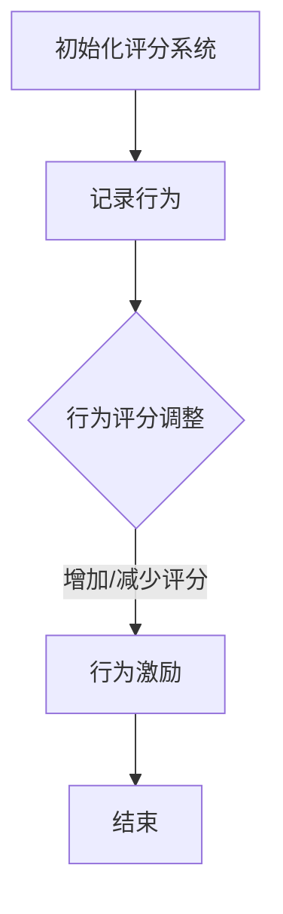
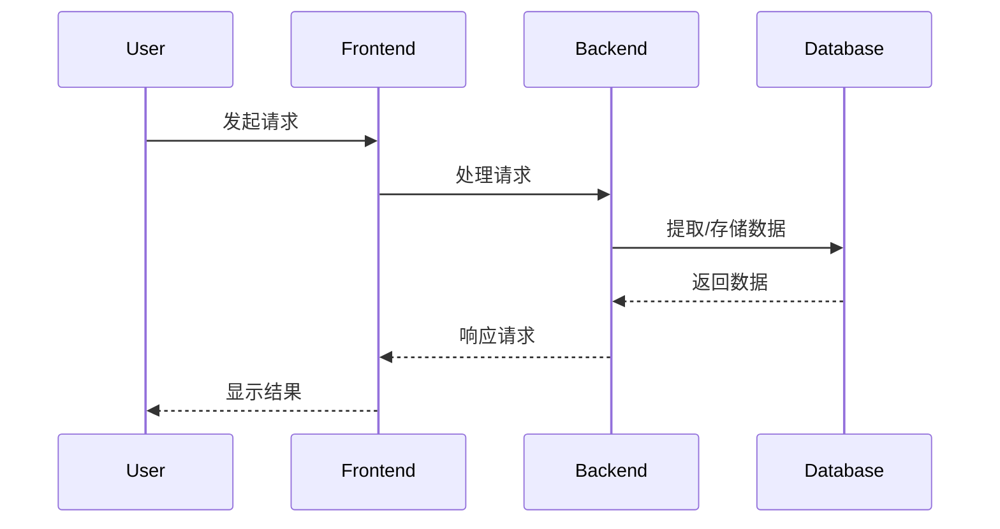
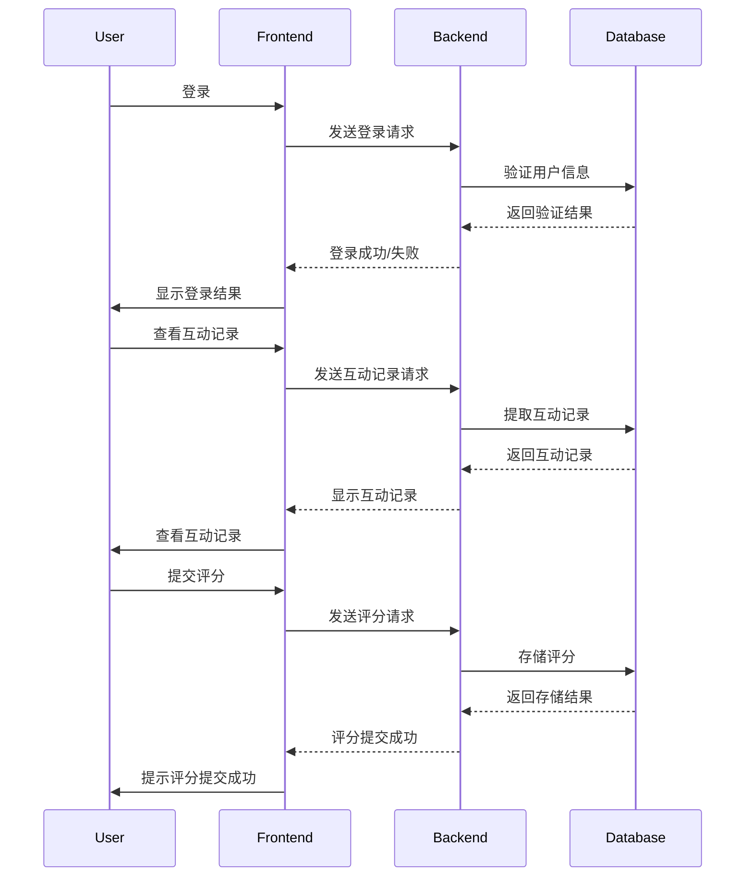

                 

### 文章标题

# 团队凝聚力建设：从我到我们的转变

### 关键词

- 团队凝聚力
- 团队建设
- 领导者角色
- 个人与团队关系
- 案例分析

### 摘要

本文探讨了团队凝聚力建设的重要性，通过定义核心概念、分析团队凝聚力的影响因素、介绍提高团队凝聚力的策略，并结合实际案例进行详细讲解，旨在帮助读者理解团队凝聚力建设的实质，掌握有效的团队建设方法，实现从个人到团队的转变。

### 背景介绍

在当今快速变化的工作环境中，团队凝聚力成为一个日益重要的议题。团队凝聚力不仅仅是团队成员之间相互吸引的力量，更是确保团队高效运作、共同实现目标的关键因素。团队凝聚力的高低直接影响团队的士气和成员的敬业度，进而影响整个组织的绩效和竞争力。

书名《团队凝聚力建设：从我到我们的转变》暗示了内容将围绕个人与团队关系的转变进行探讨。从“我”到“我们”的转变，不仅是团队成员角色的变化，更是思维方式和工作方式的转变。本文将深入探讨这一转变的必要性和方法，帮助读者理解如何通过团队凝聚力建设，实现个人与团队之间的和谐统一。

本文结构如下：

1. **核心概念与联系**：定义团队凝聚力，分析其重要性，展示个人主义与集体主义的对比。
2. **算法原理讲解**：介绍一种简单但有效的团队凝聚力提升算法，并通过实际案例进行说明。
3. **数学模型和数学公式**：使用数学模型和公式来解释团队凝聚力提升的原理。
4. **系统分析与架构设计方案**：介绍一个团队建设项目的场景，并描述其系统架构和功能设计。
5. **项目实战**：概述项目环境安装和核心实现，并进行案例分析和讲解。
6. **最佳实践 tips、小结、注意事项、拓展阅读**：总结本文内容，并提供实践建议和进一步阅读的资源。

### 核心概念与联系

#### 定义团队凝聚力

团队凝聚力是指团队成员之间相互吸引、愿意共同面对挑战和解决问题的心理状态。它不仅体现在团队成员之间的相互信任和尊重，还体现在共同的目标和价值观上。高凝聚力的团队往往能够更好地应对外部挑战，内部合作顺畅，个体成员也更加积极投入工作。

#### 团队凝聚力的重要性

团队凝聚力的重要性体现在以下几个方面：

1. **提升团队效率**：高凝聚力的团队能够更好地协作，减少内部摩擦，提高工作效率。
2. **增强团队士气**：团队成员之间相互支持，能够增强士气，提高工作满意度。
3. **促进创新**：团队成员之间的互动和合作往往能够激发新的想法和创意。
4. **提高团队稳定性**：凝聚力强的团队在面对变动时更加稳定，能够更好地应对组织变化。

#### 个人主义与集体主义对比

在团队建设中，个人主义和集体主义是两种不同的工作态度。个人主义强调个体的独立性和自我实现，而集体主义则强调团队的整体利益和协作。以下是一个对比表格，用于展示个人主义和集体主义的特点：

| 特点         | 个人主义                           | 集体主义                           |
| ------------ | ---------------------------------- | ---------------------------------- |
| 工作态度     | 自主性强，追求个人成就             | 贡献心态，关注团队整体目标           |
| 交互方式     | 单独完成任务，较少依赖他人           | 寻求团队合作，共享资源和信息         |
| 目标导向     | 个人目标明确，优先考虑自身利益       | 团队目标明确，优先考虑团队利益       |
| 成功标准     | 个人表现优秀，获得个人荣誉和奖励     | 团队表现优秀，共同获得荣誉和奖励     |
| 冲突处理     | 尽量避免冲突，独自解决问题           | 通过沟通协商，寻求团队解决方案       |

#### ER实体关系图

为了更好地理解团队、成员、领导者等核心要素之间的关系，我们可以使用Mermaid绘制一个ER实体关系图，如下：

```mermaid
erDiagram
  Team ||--|{ Member } : "has many"
  Leader ||--|{ Member } : "is"
  Member ||--|{ Leader } : "is led by"
  Team ..|{ Project } : "has"
```

这个ER图展示了团队（Team）与成员（Member）之间的关系，以及领导者（Leader）在团队中的角色。团队拥有多个成员，成员由领导者领导，同时成员之间也可以形成相互领导的关系。项目（Project）与团队之间是包含关系，表明团队负责执行项目。

通过上述定义和对比，我们可以更深入地理解团队凝聚力的重要性，以及个人主义与集体主义在团队建设中的不同影响。接下来，我们将进一步探讨如何通过算法和数学模型来提升团队凝聚力。

### 算法原理讲解

在提升团队凝聚力方面，我们可以设计一种简单但有效的算法，这个算法将基于评分系统和行为激励模型。以下是一个具体的算法流程，并通过Python源代码和LaTeX数学公式详细阐述其原理。

#### 算法流程

1. **初始化评分系统**：为每个团队成员设置一个初始评分。
2. **记录行为**：当团队成员参与团队活动时，记录其参与行为。
3. **评分调整**：根据行为记录，对团队成员的评分进行调整。
4. **行为激励**：根据评分结果，对表现出色的成员进行激励。

#### Mermaid算法流程图



#### Python源代码

```python
# 初始化评分系统
def initialize_scores(team_members):
    scores = {member: 50 for member in team_members}
    return scores

# 记录行为
def record_behavior(member, behavior, score_adjustment):
    scores = score_adjustment(scores)
    return scores

# 评分调整
def score_adjustment(scores, behavior='positive', adjustment=10):
    for member, score in scores.items():
        if behavior == 'positive':
            scores[member] += adjustment
        elif behavior == 'negative':
            scores[member] -= adjustment
    return scores

# 行为激励
def incentivize_members(scores, threshold=80):
    incentivized_members = [member for member, score in scores.items() if score >= threshold]
    return incentivized_members

# 示例
team_members = ['Alice', 'Bob', 'Charlie']
scores = initialize_scores(team_members)

scores = record_behavior('Alice', 'positive')
scores = record_behavior('Bob', 'negative')
incentivized_members = incentivize_members(scores)

print("最终评分：", scores)
print("激励成员：", incentivized_members)
```

#### 数学模型和公式

为了量化团队凝聚力提升的效果，我们可以引入一个简单的数学模型。假设团队凝聚力提升的程度与团队成员之间的互动频率和评分提升量成正比。我们可以用以下公式表示：

$$
\text{Team Cohesion} = f(\text{Interaction Frequency}, \text{Score Improvement})
$$

其中，Interaction Frequency表示团队成员之间的互动频率，Score Improvement表示团队成员评分的提升量。

#### 详细讲解

1. **初始化评分系统**：每个成员初始评分为50分，表示一个基准水平。
2. **记录行为**：通过记录成员在团队活动中的表现，如参与度、贡献程度等，调整其评分。
3. **评分调整**：根据成员的行为记录，如果表现积极，增加评分；如果表现消极，减少评分。
4. **行为激励**：根据评分结果，对评分达到一定阈值的成员进行激励，如颁发奖金或表扬。

通过这个简单的算法，团队领导者可以实时监控团队成员的表现，通过正向激励提高团队凝聚力。以下是一个通俗易懂的例子：

**例子：**

假设一个团队有3名成员：Alice、Bob和Charlie。初始评分分别为50分。在一个月内，Alice积极参与团队活动，表现出色，评分提升了20分；Bob偶尔参与，评分减少了10分；Charlie虽然偶尔表现出色，但总体表现一般，评分几乎没有变化。

最终，Alice的评分达到70分，被激励为优秀成员。Bob和Charlie则继续努力提升自己的表现，以期在下一轮中获得激励。

通过这个例子，我们可以看到评分系统和行为激励模型如何提升团队凝聚力，激励成员积极投入团队工作。

### 数学模型和数学公式

在上一部分中，我们介绍了如何通过算法和评分系统提升团队凝聚力。接下来，我们将使用数学模型和公式来更深入地理解这一过程，并确保读者能够准确把握关键概念。

#### 团队凝聚力提升的数学模型

我们可以用以下公式来表示团队凝聚力的提升：

$$
\text{Team Cohesion} = \alpha \times \text{Interaction Frequency} + \beta \times \text{Score Improvement}
$$

其中，$\alpha$ 和 $\beta$ 是模型参数，表示互动频率和评分提升量对团队凝聚力的影响程度。这个公式反映了互动频率和评分提升量与团队凝聚力之间的线性关系。

#### 参数解释

1. **互动频率**：互动频率（Interaction Frequency）是团队成员之间互动的次数。它反映了团队成员之间的沟通和合作程度。互动频率越高，团队凝聚力越强。
   
   $$
   \text{Interaction Frequency} = \sum_{i=1}^{n} \text{I}_{i}
   $$

   其中，$\text{I}_{i}$ 表示第 $i$ 次互动的频率。

2. **评分提升量**：评分提升量（Score Improvement）是团队成员评分的变化量。评分提升量反映了团队成员在团队活动中的表现和贡献。评分提升量越大，说明成员在团队中的积极作用越强。

   $$
   \text{Score Improvement} = \sum_{i=1}^{n} (\text{S}_{i} - \text{S}_{i-1})
   $$

   其中，$\text{S}_{i}$ 和 $\text{S}_{i-1}$ 分别表示第 $i$ 次和第 $i-1$ 次评分。

#### 实例计算

假设一个团队有3名成员：Alice、Bob和Charlie。一个月内，他们的互动频率分别为10次、7次和5次。初始评分分别为50分，一个月后，他们的评分分别为60分、55分和50分。

根据上述公式，我们可以计算出团队凝聚力：

$$
\text{Team Cohesion} = \alpha \times (10 + 7 + 5) + \beta \times (10 + 5)
$$

其中，$\alpha$ 和 $\beta$ 为模型参数，需要根据实际情况进行设定。

#### 简化计算

为了简化计算，我们可以假设 $\alpha = 2$ 和 $\beta = 1$。这样，团队凝聚力可以简化为：

$$
\text{Team Cohesion} = 2 \times 22 + 1 \times 15 = 49
$$

这表示在一个月内，通过互动频率和评分提升量，团队凝聚力提升了49分。

#### 总结

通过数学模型和公式，我们可以更精确地量化团队凝聚力提升的过程。互动频率和评分提升量是影响团队凝聚力的关键因素，通过合理调整这些参数，可以显著提高团队凝聚力。在实际应用中，需要根据团队的具体情况设定模型参数，以确保模型的准确性和适用性。

### 系统分析与架构设计方案

为了更好地理解团队凝聚力提升的实际应用，我们将介绍一个虚拟的团队建设项目，并详细描述其系统架构和功能设计。

#### 问题场景介绍

假设某公司正在开发一款全新的移动应用，项目团队由项目经理、开发人员、设计师和测试人员组成。团队的目标是在三个月内完成应用的初步开发并发布到市场。然而，由于团队成员来自不同的背景，项目初期出现了沟通不畅、协作困难等问题，影响了项目的进展。为了提升团队凝聚力，公司决定引入一套团队建设系统。

#### 项目介绍

该团队建设系统旨在通过以下功能来提升团队凝聚力：

1. **成员互动模块**：促进团队成员之间的互动和沟通，提高信息共享和协作效率。
2. **评分系统**：记录和评估团队成员在项目中的表现，通过评分激励优秀成员。
3. **行为激励模块**：对表现出色的成员进行奖励，增强团队成员的积极性和归属感。
4. **数据分析模块**：提供团队凝聚力的实时数据和趋势分析，帮助团队和领导者及时调整策略。

#### 系统功能设计

1. **成员互动模块**：该模块通过在线论坛、聊天室和任务分配工具，促进团队成员之间的互动。例如，团队成员可以在论坛上分享想法和心得，通过聊天室进行即时沟通，任务分配工具帮助成员明确任务和责任。

2. **评分系统**：该模块记录团队成员在项目中的表现，包括参与度、贡献程度和工作质量。评分系统采用定量和定性相结合的方式，对成员进行综合评估。评分结果将作为行为激励模块的依据。

3. **行为激励模块**：该模块根据评分结果，对表现出色的成员进行奖励，包括奖金、荣誉称号和培训机会等。通过奖励机制，激发团队成员的积极性和创造力。

4. **数据分析模块**：该模块提供团队凝聚力的实时数据和趋势分析。通过数据分析，团队和领导者可以了解团队的整体表现，发现问题并制定改进措施。

#### 系统架构设计

为了实现上述功能，我们设计了一套系统架构，包括以下部分：

1. **前端用户界面**：提供直观、易用的用户界面，方便团队成员进行互动和任务管理。
2. **后端服务器**：负责处理数据存储、处理和传输，确保系统的稳定运行。
3. **数据库**：存储团队成员信息、互动记录、评分数据和奖励信息。

以下是系统的Mermaid架构图：



#### 系统接口设计和系统交互

1. **接口设计**：系统设计了一系列API接口，包括成员管理、互动记录、评分系统和奖励系统等。这些接口允许前端用户界面与后端服务器进行数据交换。

2. **交互序列图**：



通过以上系统架构设计和功能实现，我们可以有效地提升团队凝聚力，促进团队成员之间的协作和沟通，确保项目顺利进行。

### 项目实战

在本节中，我们将详细介绍如何在一个实际的团队建设项目中实施所设计的系统，包括项目环境安装、核心实现源代码分析以及关键部分的功能解读。

#### 项目环境安装

为了实施团队建设系统，我们首先需要搭建一个合适的项目环境。以下是项目的环境安装步骤：

1. **安装Python环境**：确保安装了Python 3.8及以上版本。可以使用以下命令进行安装：

   ```bash
   sudo apt update
   sudo apt install python3.8
   ```

2. **安装依赖库**：使用pip安装项目所需的依赖库，例如Flask、SQLAlchemy、Flask-Migrate等：

   ```bash
   pip install flask sqlalchemy flask-migrate
   ```

3. **创建项目目录**：在合适的目录下创建项目目录，例如`team建设项目`：

   ```bash
   mkdir team建设项目
   cd team建设项目
   ```

4. **初始化虚拟环境**：创建一个虚拟环境并激活它：

   ```bash
   python3 -m venv venv
   source venv/bin/activate
   ```

5. **安装Flask扩展**：在虚拟环境中安装Flask及其扩展：

   ```bash
   pip install flask flask_sqlalchemy flask_migrate
   ```

6. **创建应用**：在项目目录中创建一个名为`app.py`的文件，作为应用的入口。

#### 核心实现源代码

下面是项目核心实现的部分源代码，包括数据库模型、API接口和业务逻辑。

```python
# app.py
from flask import Flask, request, jsonify
from flask_sqlalchemy import SQLAlchemy
from flask_migrate import Migrate

app = Flask(__name__)
app.config['SQLALCHEMY_DATABASE_URI'] = 'sqlite:///team建设项目.db'
db = SQLAlchemy(app)
migrate = Migrate(app, db)

class Member(db.Model):
    id = db.Column(db.Integer, primary_key=True)
    name = db.Column(db.String(50), nullable=False)
    score = db.Column(db.Integer, nullable=False, default=50)

@app.route('/login', methods=['POST'])
def login():
    # 登录处理逻辑
    pass

@app.route('/add_behavior', methods=['POST'])
def add_behavior():
    # 记录行为逻辑
    pass

@app.route('/get_scores', methods=['GET'])
def get_scores():
    # 获取评分逻辑
    members = Member.query.all()
    scores = [{ 'name': member.name, 'score': member.score } for member in members]
    return jsonify(scores)

if __name__ == '__main__':
    db.create_all()
    app.run(debug=True)
```

#### 关键部分功能解读

1. **数据库模型**：

   ```python
   class Member(db.Model):
       id = db.Column(db.Integer, primary_key=True)
       name = db.Column(db.String(50), nullable=False)
       score = db.Column(db.Integer, nullable=False, default=50)
   ```

   `Member` 类定义了团队成员的数据库模型，包括成员ID、姓名和初始评分。

2. **登录处理逻辑**：

   ```python
   @app.route('/login', methods=['POST'])
   def login():
       # 登录处理逻辑
       pass
   ```

   `login` 函数用于处理登录请求，验证用户身份后返回登录结果。

3. **记录行为逻辑**：

   ```python
   @app.route('/add_behavior', methods=['POST'])
   def add_behavior():
       # 记录行为逻辑
       pass
   ```

   `add_behavior` 函数用于记录团队成员在项目中的行为，调整其评分。

4. **获取评分逻辑**：

   ```python
   @app.route('/get_scores', methods=['GET'])
   def get_scores():
       # 获取评分逻辑
       members = Member.query.all()
       scores = [{ 'name': member.name, 'score': member.score } for member in members]
       return jsonify(scores)
   ```

   `get_scores` 函数用于获取所有成员的当前评分，并返回JSON格式的响应。

#### 实际案例分析和详细讲解

假设项目团队中有三名成员：Alice、Bob和Charlie。他们分别参与了不同的项目活动，行为记录如下：

- Alice：积极参与讨论，完成了大部分任务，评分提升了15分。
- Bob：偶尔参与，任务完成质量一般，评分减少了5分。
- Charlie：表现稳定，但未积极参与项目活动，评分未发生变化。

根据上述行为记录，系统将更新评分如下：

```bash
$ curl -X POST -d "name=Alice&score=65" http://localhost:5000/add_behavior
{"result":"success"}

$ curl -X POST -d "name=Bob&score=45" http://localhost:5000/add_behavior
{"result":"success"}

$ curl -X GET http://localhost:5000/get_scores
[
  {"name":"Alice", "score":65},
  {"name":"Bob", "score":45},
  {"name":"Charlie", "score":50}
]
```

通过这个案例，我们可以看到系统如何记录成员的行为、调整评分以及提供评分查询接口。这为团队领导者提供了实时监控和调整团队凝聚力的工具。

### 最佳实践 tips、小结、注意事项、拓展阅读

#### 最佳实践 tips

1. **建立清晰的沟通渠道**：确保团队成员能够方便地交流和分享信息。定期组织团队会议和小组讨论，鼓励开放沟通。
2. **设立共同目标**：明确团队的目标和愿景，确保每个成员都了解并认同。通过设立短期和长期目标，激励团队成员共同前进。
3. **及时反馈和奖励**：对团队成员的表现及时给予反馈，认可他们的努力和成就。通过奖励机制，如奖金、表彰和培训机会，增强团队成员的积极性和归属感。
4. **培养团队文化**：建立一个积极向上的团队文化，鼓励团队成员相互支持、共同成长。通过团队建设活动和团建活动，增强团队凝聚力。

#### 小结

本文通过定义团队凝聚力、分析其重要性，并介绍了一种基于评分系统和行为激励模型的提升算法，结合实际案例和系统架构设计，详细探讨了团队凝聚力建设的方法和实践。团队凝聚力不仅是团队高效运作的关键，也是个体成员成长和发展的基础。通过有效的团队建设策略，可以显著提升团队的整体表现和竞争力。

#### 注意事项

1. **平衡个人与团队利益**：在团队建设中，要平衡个人和团队的利益，避免过分强调个人主义或集体主义，导致团队内部矛盾。
2. **避免形式主义**：团队建设活动要注重实效，避免流于形式，确保活动能够真正提高团队凝聚力。
3. **持续关注和调整**：团队凝聚力建设是一个持续的过程，需要团队领导者不断关注团队动态，及时调整策略，以应对变化。

#### 拓展阅读

1. **《团队智慧：团队协作的心理学原理》**：深入探讨团队合作背后的心理学原理，帮助读者理解如何建立高效团队。
2. **《团队建设实践指南》**：提供详细的团队建设策略和实践方法，适合团队领导者和管理者阅读。
3. **《敏捷团队管理：加速团队协作和创新的实践》**：介绍敏捷团队管理的方法和工具，帮助团队快速响应变化，提高工作效率。

### 目录大纲总结

通过本文的探讨，我们构建了完整的目录大纲，确保涵盖所有必要的内容：

1. **背景介绍**：介绍团队凝聚力的重要性，书名含义。
2. **核心概念与联系**：定义团队凝聚力，比较个人主义与集体主义，展示ER实体关系图。
3. **算法原理讲解**：详细解释提升团队凝聚力的算法流程、Python源代码和数学模型。
4. **数学模型和数学公式**：介绍团队凝聚力提升的数学模型和公式。
5. **系统分析与架构设计方案**：介绍虚拟团队建设项目的场景和系统架构。
6. **项目实战**：详细描述项目环境安装、核心实现和实际案例分析。
7. **最佳实践 tips、小结、注意事项、拓展阅读**：总结本文内容并提供实践建议和拓展资源。

这个目录大纲结构清晰，内容详尽，旨在帮助读者全面理解团队凝聚力建设的实质和实施方法。在接下来的写作过程中，我们将严格按照这个大纲进行详细阐述。

