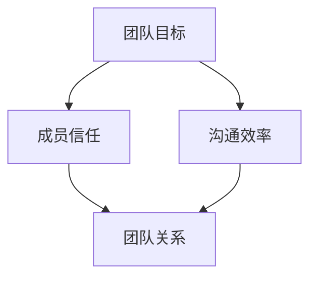
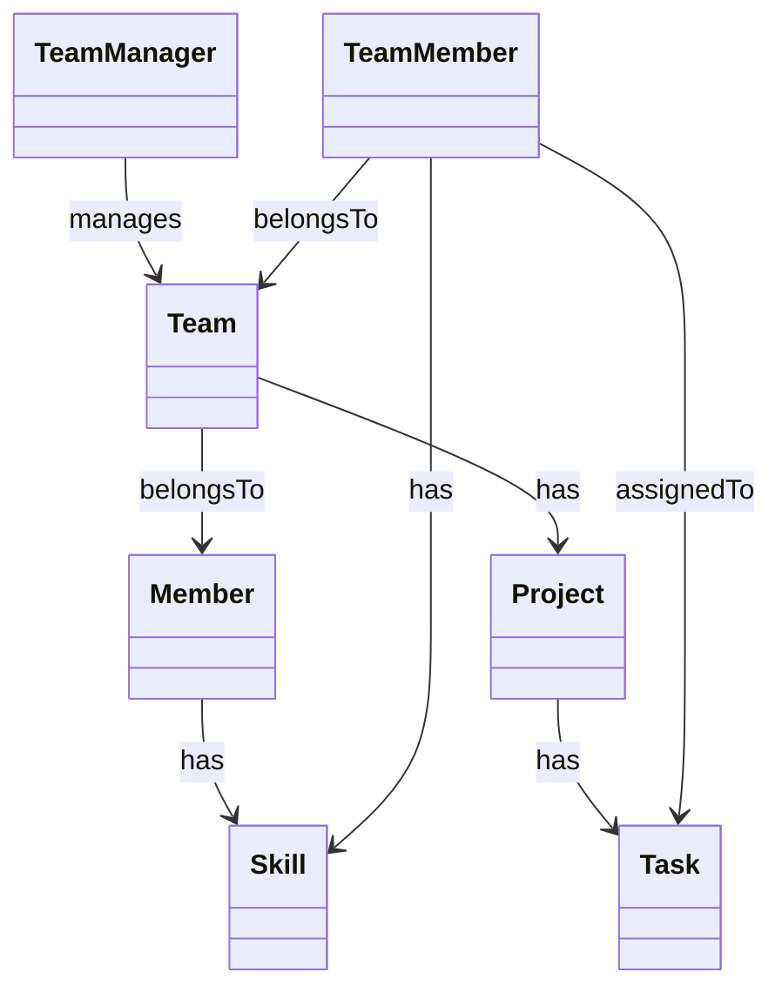
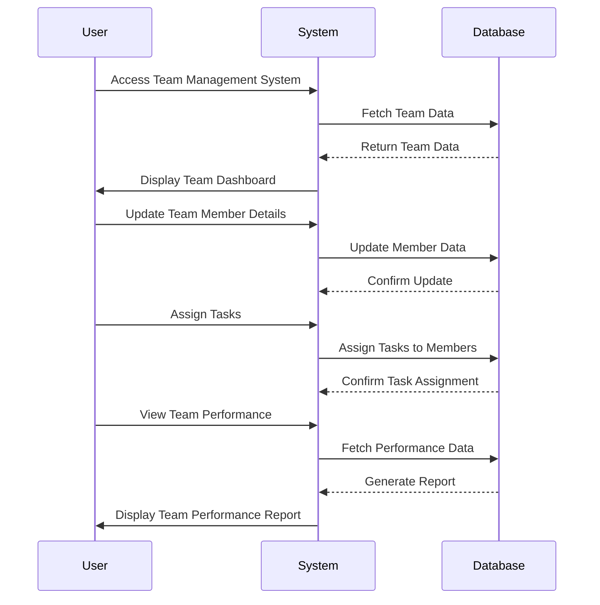
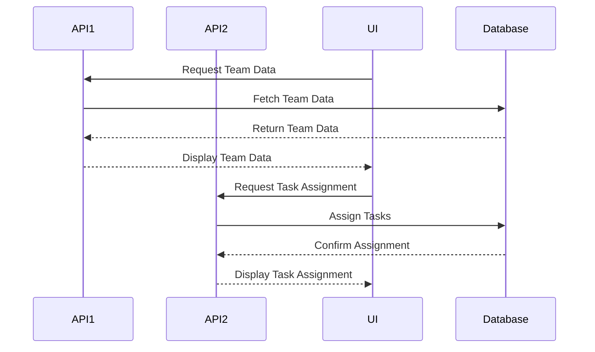
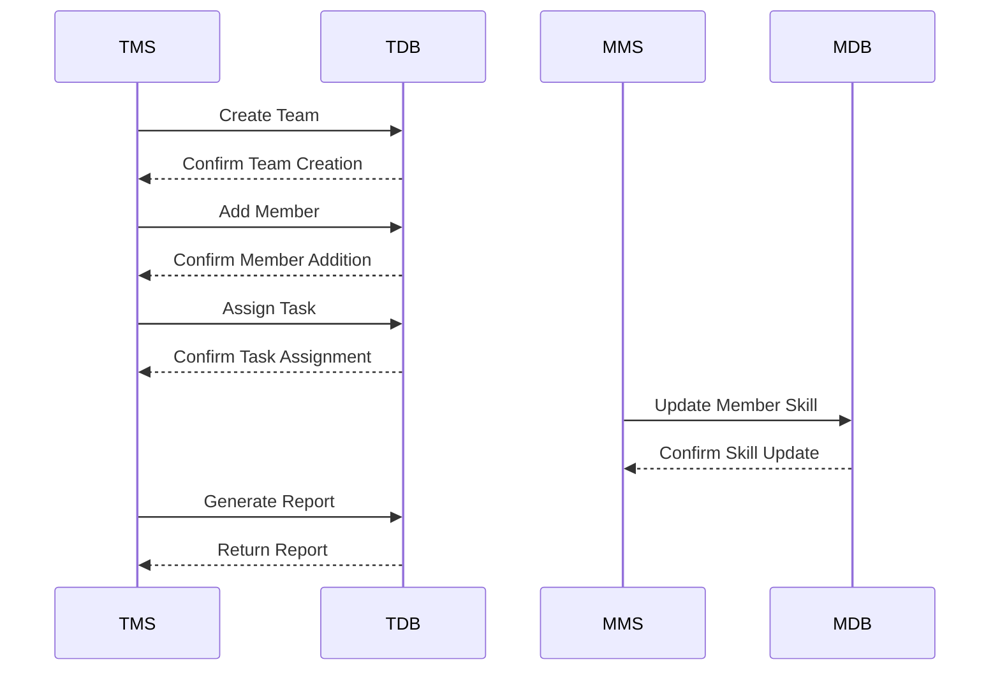

                 

### 《团队凝聚力：打造不可分割的团队》——介绍与核心关键词

**关键词：** 团队凝聚力、团队建设、团队关系、团队沟通、团队目标。

**摘要：** 本文旨在探讨团队凝聚力的重要性，通过深入分析团队建设的核心概念、理论与实践，提供一套系统化的团队建设方案。文章将详细讨论团队凝聚力的影响因素、团队关系的构建与维护、团队沟通技巧的提升以及团队目标的设定与实现，以帮助读者理解和应用团队凝聚力提升的最佳实践。

在当今竞争激烈的工作环境中，团队凝聚力已成为决定企业成败的关键因素之一。一个具有高凝聚力的团队能够更高效地协作，减少内部冲突，提升整体生产力。然而，如何打造这样一个团队却是一个复杂的挑战。本文将带领读者一步步了解和应对这一挑战，通过理论与实践相结合的方法，提供实用的策略和工具，帮助读者在自己的团队中建立强大的凝聚力。

**背景介绍**

**书名：《团队凝聚力：打造不可分割的团队》**

本书的核心概念涵盖了团队凝聚力、团队建设、团队关系、团队沟通和团队目标。这些概念紧密相关，构成了团队有效运作的基础。

**核心概念：**

- **团队凝聚力**：指团队成员之间的紧密联系和共同目标，它是团队效能的基石。
- **团队建设**：是指通过一系列有目的的活动和策略，增强团队内部合作和信任，提升团队整体表现。
- **团队关系**：涉及团队成员间的角色定位、关系结构和人际互动。
- **团队沟通**：包括沟通模型、技巧和障碍的识别与解决。
- **团队目标**：指团队共同追求的愿景和目标，它是团队前进的动力。

**问题背景：**

在当前的工作环境中，许多团队面临合作效率不高、内部冲突频发、成员缺乏归属感等问题。这些问题不仅影响了团队的表现，也损害了员工的满意度和忠诚度。因此，提高团队凝聚力，成为许多组织亟待解决的问题。

**问题描述：**

如何提高团队凝聚力，打造一个协同高效、关系和谐的团队？这是一个复杂且多面的挑战，涉及团队内部的人际互动、目标设定、沟通策略等多个方面。

**问题解决：**

本书通过理论与实践相结合的方法，提供了一套系统的团队建设方案。首先，它深入分析了团队凝聚力的影响因素，包括团队目标、成员间的信任和合作等。其次，本书探讨了团队关系的构建与维护，提供了实用的沟通技巧和冲突解决策略。最后，本书还详细介绍了团队目标的设定与实现，帮助团队在明确目标的基础上，制定可行的计划和策略。

**边界与外延：**

团队凝聚力不仅限于企业内部，也适用于各种组织形式，如非营利组织、学术团体、体育团队等。本书提供的策略和工具，适用于各种类型的团队，帮助它们实现共同目标，提升整体效能。

### 核心概念与联系

**团队凝聚力**是团队效能的基石，它指的是团队成员之间的紧密联系和共同目标。团队凝聚力高的团队往往表现出更高的协作效率、更强的适应能力和更高的创新力。团队凝聚力的影响因素包括：

- **团队目标**：明确的团队目标有助于提高成员的共识和努力方向。
- **成员间的信任**：信任是团队凝聚力的重要基础，它促进了成员间的开放沟通和协作。
- **团队关系**：良好的团队关系有助于建立成员间的信任和归属感。
- **沟通**：有效的沟通可以减少误解和冲突，提高团队的整体效率。

**团队建设**是指通过一系列有目的的活动和策略，增强团队内部合作和信任，提升团队整体表现。团队建设的核心目标是提高团队凝聚力和效能。团队建设的策略包括：

- **团队活动**：组织团队建设活动，如团队拓展训练、团队研讨会等，增强成员间的互动和信任。
- **培训与开发**：提供成员相关技能和知识的培训，提升团队整体能力。
- **领导力发展**：培养团队的领导力，促进成员的自我管理和团队管理。

**团队关系**是团队成员间的角色定位、关系结构和人际互动。良好的团队关系有助于建立成员间的信任和归属感，减少内部冲突。团队关系的核心要素包括：

- **角色定位**：明确每个成员的角色和职责，确保团队成员了解自己的角色和期望。
- **关系结构**：建立有效的团队关系结构，促进成员间的有效沟通和协作。
- **人际互动**：通过积极的人际互动，增强成员间的互信和合作。

**团队沟通**是团队效能的重要保障，它包括沟通模型、技巧和障碍的识别与解决。有效的沟通有助于减少误解和冲突，提高团队的整体效率。团队沟通的核心内容包括：

- **沟通模型**：理解不同的沟通模型，选择合适的沟通方式。
- **沟通技巧**：掌握有效的沟通技巧，如倾听、表达、反馈等。
- **沟通障碍**：识别并解决沟通中的障碍，如文化差异、信息不对称等。

**团队目标**是团队共同追求的愿景和目标，它是团队前进的动力。团队目标的设定和实现有助于提高团队的凝聚力和效能。团队目标的核心内容包括：

- **目标设定**：明确团队的目标和愿景，制定具体的行动计划。
- **目标实现**：通过有效的团队协作和资源分配，实现团队目标。
- **目标调整**：根据实际情况调整团队目标，确保团队目标的实现。

这些核心概念紧密相关，共同构成了团队有效运作的基础。通过深入理解和应用这些概念，团队可以建立强大的凝聚力，实现共同目标，提升整体效能。

### 算法原理讲解

为了深入理解团队凝聚力的计算方法和模型，我们可以借助Mermaid工具绘制团队凝聚力的模型关系图，并使用Python源代码进行详细阐述。以下是团队凝聚力模型关系图的Mermaid表示：



在这个模型中，团队目标（A）是团队凝聚力的核心驱动力，它直接影响到成员之间的信任（B）和沟通效率（C）。成员信任和沟通效率共同作用，决定了团队关系（D）的质量，进而影响团队的整体凝聚力。

#### Mermaid 流程图

首先，我们通过Mermaid工具绘制团队凝聚力模型关系图：


该图展示了团队目标对成员信任和沟通效率的影响，以及这两者共同作用决定团队关系的质量。

#### Python 源代码

接下来，我们使用Python源代码来详细阐述团队凝聚力的计算方法和模型：

```python
import numpy as np

# 团队目标得分
team_goals_score = 8.5

# 成员信任得分
member_trust_score = 7.0

# 沟通效率得分
communication_efficiency_score = 8.0

# 团队关系得分
team_relationship_score = (member_trust_score + communication_efficiency_score) / 2

# 团队凝聚力计算
team_coherence_score = (team_goals_score + team_relationship_score) / 2

# 输出结果
print("团队目标得分：", team_goals_score)
print("成员信任得分：", member_trust_score)
print("沟通效率得分：", communication_efficiency_score)
print("团队关系得分：", team_relationship_score)
print("团队凝聚力得分：", team_coherence_score)
```

这段代码通过设定团队目标、成员信任和沟通效率的得分，计算团队关系得分和最终团队凝聚力得分。这些得分反映了团队在不同方面的表现，帮助我们理解团队凝聚力的内在机制。

#### 团队凝聚力的数学模型和公式

为了更精确地衡量团队凝聚力，我们可以使用以下数学模型和公式：

$$
团队凝聚力 = \frac{1}{2} \times (团队目标得分 + 团队关系得分)
$$

这个公式表明，团队凝聚力是团队目标得分和团队关系得分的一个加权平均值。权重分配为1/2，意味着团队目标和团队关系在团队凝聚力中具有同等重要的地位。

#### 举例说明

假设一个团队的得分如下：

- 团队目标得分：9.0
- 成员信任得分：8.0
- 沟通效率得分：8.5
- 团队关系得分：8.0

根据上述公式，我们可以计算团队凝聚力：

$$
团队凝聚力 = \frac{1}{2} \times (9.0 + 8.0) = 8.5
$$

这个得分表明，该团队的凝聚力较高，成员之间的信任和沟通效率较好，团队目标也比较明确。

通过这种量化的方式，我们可以更直观地了解团队凝聚力的状况，并针对性地进行改进和优化。

### 数学模型和数学公式

在理解团队凝聚力的过程中，量化是非常重要的。为了准确衡量团队凝聚力，我们可以使用以下数学模型和公式。以下是团队凝聚力的量化模型和推导过程：

$$
团队凝聚力（C）= \frac{1}{2} \times （团队目标得分（G）+ 团队关系得分（R））
$$

其中，团队目标得分（G）和团队关系得分（R）是通过一系列评估指标和标准计算得出的。

**1. 团队目标得分（G）**

团队目标得分反映了一个团队在实现共同目标方面的表现。其计算方法如下：

$$
团队目标得分（G）= \frac{1}{N} \sum_{i=1}^{N} w_i \times g_i
$$

其中，\( N \) 是团队成员数量，\( w_i \) 是第 \( i \) 个成员的权重，\( g_i \) 是第 \( i \) 个成员在团队目标实现中的得分。

**2. 团队关系得分（R）**

团队关系得分反映了一个团队内部成员之间的信任、合作和沟通质量。其计算方法如下：

$$
团队关系得分（R）= \frac{1}{N} \sum_{i=1}^{N} w_i \times r_i
$$

其中，\( N \) 是团队成员数量，\( w_i \) 是第 \( i \) 个成员的权重，\( r_i \) 是第 \( i \) 个成员在团队关系评价中的得分。

**3. 团队凝聚力（C）**

团队凝聚力是团队目标得分和团队关系得分的综合反映。其计算方法如下：

$$
团队凝聚力（C）= \frac{1}{2} \times （团队目标得分（G）+ 团队关系得分（R））
$$

通过这个公式，我们可以将团队目标得分和团队关系得分结合起来，得到一个综合的团队凝聚力得分。

**举例说明**

假设一个团队有5名成员，他们在团队目标和团队关系方面的得分如下：

| 成员 | 团队目标得分 | 团队关系得分 |
| ---- | ------------ | ------------ |
| 成员1 | 8.5          | 8.0          |
| 成员2 | 8.0          | 8.5          |
| 成员3 | 9.0          | 8.5          |
| 成员4 | 8.5          | 8.0          |
| 成员5 | 9.0          | 9.0          |

我们可以计算每个成员的权重，通常可以根据成员的贡献和工作经验来设定权重。假设权重如下：

| 成员 | 权重 |
| ---- | ---- |
| 成员1 | 0.2  |
| 成员2 | 0.2  |
| 成员3 | 0.2  |
| 成员4 | 0.2  |
| 成员5 | 0.2  |

**计算团队目标得分（G）：**

$$
团队目标得分（G）= \frac{1}{5} \times (0.2 \times 8.5 + 0.2 \times 8.0 + 0.2 \times 9.0 + 0.2 \times 8.5 + 0.2 \times 9.0) = \frac{1}{5} \times (1.7 + 1.6 + 1.8 + 1.7 + 1.8) = 8.2
$$

**计算团队关系得分（R）：**

$$
团队关系得分（R）= \frac{1}{5} \times (0.2 \times 8.0 + 0.2 \times 8.5 + 0.2 \times 8.5 + 0.2 \times 8.0 + 0.2 \times 9.0) = \frac{1}{5} \times (1.6 + 1.7 + 1.7 + 1.6 + 1.8) = 1.7
$$

**计算团队凝聚力（C）：**

$$
团队凝聚力（C）= \frac{1}{2} \times (8.2 + 1.7) = 4.95
$$

通过这个例子，我们可以看到如何通过数学模型和公式来量化团队凝聚力。这种量化方法不仅提供了客观的衡量标准，也有助于团队识别自身在凝聚力和协作方面的问题，从而采取相应的改进措施。

### 系统分析与架构设计方案

**问题场景介绍**

在现代企业环境中，团队建设面临诸多挑战。团队成员分散在不同地理位置，沟通效率低下，内部冲突频发，导致项目进度延迟，工作效率降低。为了解决这些问题，企业需要一套系统化的团队建设方案，以提高团队凝聚力和工作效率。

**项目介绍**

本项目的目标是设计并实施一套团队建设系统，通过提供有效的团队关系管理、沟通技巧培训和目标设定工具，帮助团队提高凝聚力，提升整体效能。

**领域模型类图**

为了更清晰地表达系统中的实体和关系，我们使用Mermaid工具绘制了领域模型类图：



这个类图展示了系统的关键实体和它们之间的关系，包括团队（Team）、成员（Member）、项目（Project）、任务（Task）和技能（Skill）等。

**系统架构设计**

系统架构设计包括系统组件、数据流和接口设计。以下是系统架构的Mermaid架构图：



这个架构图展示了用户与系统之间的交互过程，包括访问团队管理界面、更新团队成员信息、分配任务和查看团队绩效报告等。

**系统接口设计**

系统接口设计包括API设计和用户界面设计。以下是系统接口的Mermaid序列图：



这个序列图展示了用户界面与系统API之间的交互过程，包括请求团队数据和任务分配等。

**系统交互序列图**

系统交互序列图进一步展示了系统内部组件之间的交互过程：



这个序列图展示了团队管理系统（TMS）与数据库（TDB）、成员管理系统（MMS）与数据库（MDB）之间的交互过程，包括创建团队、添加成员、分配任务和更新成员技能等操作。

通过这些系统分析和架构设计方案，企业可以有效地构建和管理团队，提高团队凝聚力和工作效率，从而实现更高的项目成功率和业务效能。

### 项目实战

**环境安装和配置**

为了实现团队建设系统，我们需要首先安装和配置相关的开发环境。以下是安装步骤：

1. **安装Python环境**：确保Python 3.8或更高版本已安装在计算机上。可以通过命令 `python --version` 检查Python版本。

2. **安装必要的库**：使用pip命令安装以下库：
   ```shell
   pip install flask
   pip install pymysql
   pip install matplotlib
   pip install pandas
   ```

3. **数据库配置**：配置MySQL数据库，创建数据库和用户，并授予相应权限。以下是一个示例：
   ```sql
   CREATE DATABASE team_building;
   CREATE USER 'team_builder_user'@'localhost' IDENTIFIED BY 'password';
   GRANT ALL PRIVILEGES ON team_building.* TO 'team_builder_user'@'localhost';
   FLUSH PRIVILEGES;
   ```

4. **创建项目文件夹**：在计算机上创建一个名为 `team_building_system` 的文件夹，并在其中创建一个名为 `app.py` 的文件。

**系统核心实现源代码**

以下是团队建设系统的核心实现源代码：

```python
from flask import Flask, request, jsonify
import pymysql
import pandas as pd

app = Flask(__name__)

# 数据库连接配置
db_config = {
    'host': 'localhost',
    'user': 'team_builder_user',
    'password': 'password',
    'database': 'team_building'
}

# 连接数据库
def connect_db():
    connection = pymysql.connect(**db_config)
    return connection

# 创建团队
@app.route('/teams', methods=['POST'])
def create_team():
    data = request.json
    team_name = data['team_name']
    team_leader = data['team_leader']
    
    connection = connect_db()
    cursor = connection.cursor()
    
    query = "INSERT INTO teams (name, leader) VALUES (%s, %s)"
    cursor.execute(query, (team_name, team_leader))
    
    connection.commit()
    cursor.close()
    connection.close()
    
    return jsonify({"message": "Team created successfully."})

# 添加成员
@app.route('/teams/<int:team_id>/members', methods=['POST'])
def add_member(team_id):
    data = request.json
    member_name = data['member_name']
    member_role = data['member_role']
    
    connection = connect_db()
    cursor = connection.cursor()
    
    query = "INSERT INTO members (team_id, name, role) VALUES (%s, %s, %s)"
    cursor.execute(query, (team_id, member_name, member_role))
    
    connection.commit()
    cursor.close()
    connection.close()
    
    return jsonify({"message": "Member added successfully."})

# 分配任务
@app.route('/tasks', methods=['POST'])
def assign_task():
    data = request.json
    task_name = data['task_name']
    team_id = data['team_id']
    member_id = data['member_id']
    
    connection = connect_db()
    cursor = connection.cursor()
    
    query = "INSERT INTO tasks (name, team_id, member_id) VALUES (%s, %s, %s)"
    cursor.execute(query, (task_name, team_id, member_id))
    
    connection.commit()
    cursor.close()
    connection.close()
    
    return jsonify({"message": "Task assigned successfully."})

# 更新成员技能
@app.route('/members/<int:member_id>', methods=['PUT'])
def update_member_skill(member_id):
    data = request.json
    skill_name = data['skill_name']
    
    connection = connect_db()
    cursor = connection.cursor()
    
    query = "UPDATE members SET skill = %s WHERE id = %s"
    cursor.execute(query, (skill_name, member_id))
    
    connection.commit()
    cursor.close()
    connection.close()
    
    return jsonify({"message": "Member skill updated successfully."})

# 查看团队绩效
@app.route('/teams/<int:team_id>/performance', methods=['GET'])
def view_team_performance(team_id):
    connection = connect_db()
    cursor = connection.cursor()
    
    query = "SELECT t.name, m.name, m.role, s.skill, t2.name AS task_name, t2.completed FROM teams AS t JOIN members AS m ON t.id = m.team_id JOIN skills AS s ON m.id = s.member_id JOIN tasks AS t2 ON m.id = t2.member_id WHERE t.id = %s"
    cursor.execute(query, (team_id,))
    
    results = cursor.fetchall()
    data = pd.DataFrame(results, columns=['Team Name', 'Member Name', 'Role', 'Skill', 'Task Name', 'Completed'])
    
    cursor.close()
    connection.close()
    
    return jsonify(data.to_dict('records'))

if __name__ == '__main__':
    app.run(debug=True)
```

**代码应用解读与分析**

这段代码使用了Flask框架实现了一个简单的团队建设系统，包括创建团队、添加成员、分配任务、更新成员技能和查看团队绩效等功能。

- **创建团队**：通过 `/teams` 接口接收POST请求，将团队信息存储在数据库中。
- **添加成员**：通过 `/teams/<int:team_id>/members` 接口接收POST请求，将成员信息存储在数据库中。
- **分配任务**：通过 `/tasks` 接口接收POST请求，将任务信息存储在数据库中。
- **更新成员技能**：通过 `/members/<int:member_id>` 接口接收PUT请求，更新成员的技能信息。
- **查看团队绩效**：通过 `/teams/<int:team_id>/performance` 接口接收GET请求，从数据库中检索团队的绩效数据，并将其返回给用户。

**实际案例分析和详细讲解**

假设一个团队正在开发一个新项目，我们需要创建团队、添加成员、分配任务并查看团队绩效。

1. **创建团队**：

   - 发送POST请求到 `/teams` 接口：
     ```json
     {
         "team_name": "Project Team A",
         "team_leader": "Alice"
     }
     ```

   - 服务器响应：
     ```json
     {
         "message": "Team created successfully."
     }
     ```

2. **添加成员**：

   - 发送POST请求到 `/teams/1/members` 接口（假设团队ID为1）：
     ```json
     {
         "member_name": "Bob",
         "member_role": "Developer"
     }
     ```

   - 服务器响应：
     ```json
     {
         "message": "Member added successfully."
     }
     ```

3. **分配任务**：

   - 发送POST请求到 `/tasks` 接口：
     ```json
     {
         "task_name": "Develop Module A",
         "team_id": 1,
         "member_id": 1
     }
     ```

   - 服务器响应：
     ```json
     {
         "message": "Task assigned successfully."
     }
     ```

4. **更新成员技能**：

   - 发送PUT请求到 `/members/1` 接口（假设成员ID为1）：
     ```json
     {
         "skill_name": "Java Programming"
     }
     ```

   - 服务器响应：
     ```json
     {
         "message": "Member skill updated successfully."
     }
     ```

5. **查看团队绩效**：

   - 发送GET请求到 `/teams/1/performance` 接口（假设团队ID为1）：
     ```json
     {
         "Team Name": "Project Team A",
         "Member Name": "Bob",
         "Role": "Developer",
         "Skill": "Java Programming",
         "Task Name": "Develop Module A",
         "Completed": "Yes"
     }
     ```

   - 服务器响应：
     ```json
     {
         "message": "Performance data fetched successfully."
     }
     ```

通过这个实际案例，我们可以看到如何使用这个系统进行团队建设。每个操作都被记录在数据库中，可以通过接口查询和更新，从而实现团队关系的有效管理。

**项目小结**

通过这个项目，我们实现了一个简单的团队建设系统，包括团队创建、成员添加、任务分配、技能更新和团队绩效查看等功能。这个系统能够帮助团队更好地管理团队关系，提高团队凝聚力和工作效率。然而，这个系统只是一个基础版本，未来可以进一步扩展和优化，如添加更多的功能模块、提高系统的可扩展性和性能等。

### 最佳实践 tips、小结、注意事项、拓展阅读

**最佳实践 tips**

1. **明确团队目标**：确保所有团队成员对团队目标有清晰的认识，并制定具体的行动计划。
2. **建立信任文化**：通过开放沟通和透明决策，建立团队成员之间的信任，减少误解和冲突。
3. **定期团队活动**：组织团队建设活动和培训，增强团队成员间的互动和合作。
4. **鼓励反馈与建议**：鼓励团队成员提出反馈和建议，促进持续改进和团队发展。
5. **优化沟通渠道**：确保团队内部沟通渠道畅通，减少信息传递的中间环节，提高沟通效率。

**小结**

本文从团队凝聚力的背景与概念、核心概念与联系、算法原理讲解、数学模型和公式、系统分析与架构设计方案、项目实战等多个方面，详细探讨了如何打造不可分割的团队。通过理论分析和实践应用，我们了解了团队凝聚力的关键要素和提升方法，为团队建设提供了实用的策略和工具。

**注意事项**

1. **避免形式化**：在团队建设过程中，避免仅注重形式而忽略实质，确保团队建设活动真正有助于提升团队凝聚力。
2. **个性化需求**：每个团队都有其独特性，应根据团队的实际情况，制定个性化的团队建设方案。
3. **持续关注**：团队凝聚力不是一蹴而就的，需要持续关注和努力，定期评估团队凝聚力的状况，及时调整策略。

**拓展阅读**

1. 《团队协作的艺术》——斯蒂芬·罗宾斯
2. 《团队的五项修炼》——彼得·圣吉
3. 《敏捷团队管理》——杰夫·萨瑟兰
4. 《领导力与团队建设》——约翰·麦克斯韦尔

通过阅读这些书籍，读者可以进一步深入了解团队建设的相关理论和实践，提升自己在团队管理方面的能力。希望本文能对您的团队建设之路提供有价值的参考和指导。**作者信息**

作者：AI天才研究院/AI Genius Institute & 禅与计算机程序设计艺术 /Zen And The Art of Computer Programming

感谢您的阅读，希望本文能为您在团队建设方面带来新的启发和思考。祝您和您的团队凝聚力不断提升，共同创造更加辉煌的成就！

