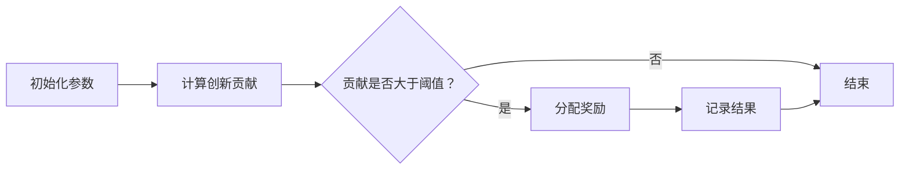
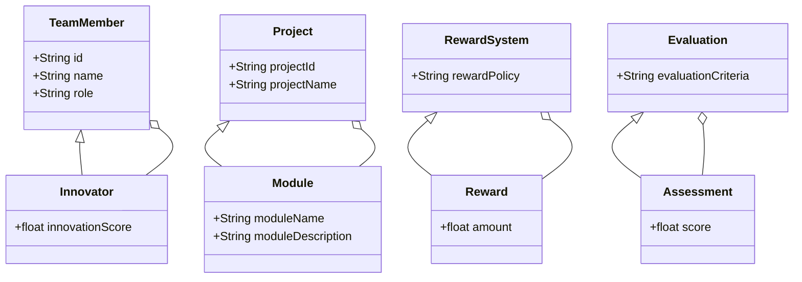
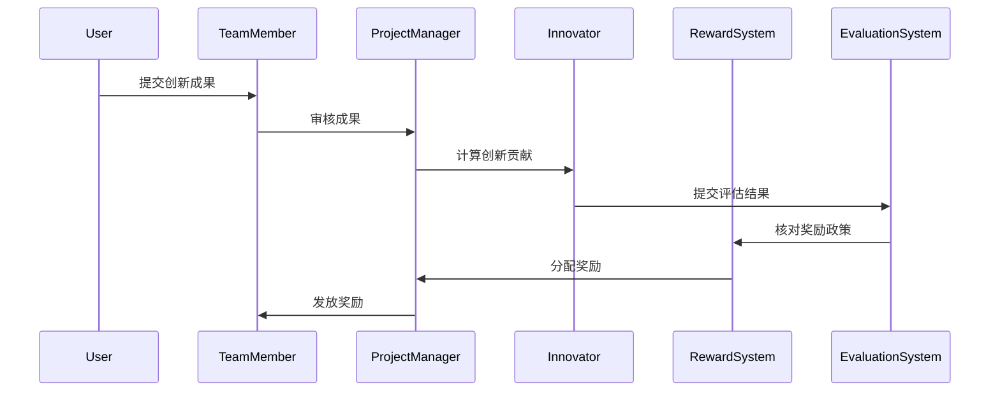

                 

## 目录大纲

### 第一部分：背景介绍

## 第1章 团队创新激励概述

### 1.1 问题背景与现状

### 1.2 创新激励的目标与挑战

### 1.3 本书的结构与目标

---

### 第二部分：核心概念与联系

## 第2章 关键概念解析

### 2.1 团队创新激励

#### 2.1.1 定义与内涵

#### 2.1.2 创新激励的类型

### 2.2 奖励机制

#### 2.2.1 奖励机制的定义

#### 2.2.2 奖励机制的设计原则

### 2.3 团队动力模型

#### 2.3.1 动力模型的构建

#### 2.3.2 动力模型的作用

### 2.4 概念联系与ER图

#### 2.4.1 概念联系表

#### 2.4.2 ER实体关系图

---

### 第三部分：算法原理讲解

## 第3章 创新激励算法原理

### 3.1 算法概述

### 3.2 算法流程图（使用mermaid）

### 3.3 Python代码示例

### 3.4 数学模型与公式

#### 3.4.1 算法数学模型

#### 3.4.2 公式详细讲解

### 3.5 举例说明

---

### 第四部分：系统分析与架构设计

## 第4章 系统架构设计

### 4.1 问题场景介绍

### 4.2 系统功能设计（使用mermaid绘制领域模型类图）

### 4.3 系统架构设计（使用mermaid绘制架构图）

### 4.4 系统接口设计

### 4.5 系统交互设计（使用mermaid绘制序列图）

---

### 第五部分：项目实战

## 第5章 项目实战

### 5.1 环境安装

### 5.2 系统核心实现

#### 5.2.1 源代码解读

#### 5.2.2 代码应用解读与分析

### 5.3 实际案例分析与讲解

### 5.4 项目小结

---

### 第六部分：最佳实践与拓展

## 第6章 最佳实践与拓展

### 6.1 最佳实践 tips

### 6.2 小结

### 6.3 注意事项

### 6.4 拓展阅读

---

### 第一部分：背景介绍

## 第1章 团队创新激励概述

### 1.1 问题背景与现状

在当今快速发展的科技时代，创新已成为企业核心竞争力的重要标志。团队创新激励作为提升团队创造力、推动技术进步的关键手段，受到了越来越多的关注。当前，许多企业虽然在创新方面投入了大量的资源和精力，但实际效果却不尽如人意。这主要是因为缺乏有效的团队创新激励机制。本章节将首先介绍团队创新激励的概念，分析现有问题，并探讨团队创新激励的目标和挑战。

### 1.2 创新激励的目标与挑战

创新激励的目标主要包括提升团队成员的创新能力、鼓励创新思维和积极性的发挥，以及促进创新成果的转化和应用。然而，要实现这些目标并不容易，面临诸多挑战。例如，如何在多样化的团队中保持统一的创新方向？如何确保奖励机制的公平性和有效性？如何平衡创新与风险之间的关系？这些挑战需要通过系统性的研究和实践来解决。

### 1.3 本书的结构与目标

本书旨在通过系统化的分析，为团队创新激励提供理论和实践指导。全书分为六个部分，分别从背景介绍、核心概念与联系、算法原理讲解、系统分析与架构设计、项目实战以及最佳实践与拓展等角度，逐步深入探讨团队创新激励的各个方面。通过本书，读者可以全面了解创新激励的理论基础和实践方法，为实际工作中的创新激励设计提供有力的支持。

---

### 第二部分：核心概念与联系

## 第2章 关键概念解析

### 2.1 团队创新激励

#### 2.1.1 定义与内涵

团队创新激励是指通过一系列措施和机制，激发团队成员的创新潜能，推动技术创新和业务发展。它不仅包括物质激励，如奖金、股权等，还包括精神激励，如认可、尊重等。有效的团队创新激励能够提升团队的凝聚力，增强成员的归属感和自豪感，从而提高整体创新能力和工作效率。

#### 2.1.2 创新激励的类型

根据激励方式和目标的不同，创新激励可以分为以下几类：

1. **物质激励**：包括奖金、股权、福利等直接的经济回报。
2. **精神激励**：包括表彰、荣誉称号、公开演讲等精神上的认可。
3. **环境激励**：通过提供良好的工作环境、创新工具和资源，激发团队成员的创新动力。
4. **制度激励**：通过建立合理的创新制度和流程，保障创新活动的顺利进行。

### 2.2 奖励机制

#### 2.2.1 奖励机制的定义

奖励机制是指企业在创新过程中，为激励团队成员创新行为而制定的一系列规则和措施。它包括奖励的范围、标准、方式、分配机制等，旨在确保奖励的公平性和有效性。

#### 2.2.2 奖励机制的设计原则

设计有效的奖励机制需要遵循以下几个原则：

1. **公平性原则**：奖励标准应明确、公正，确保所有成员都能公平地参与。
2. **激励性原则**：奖励措施应具有足够的吸引力，激发团队成员的创新热情。
3. **灵活性原则**：奖励机制应具备一定的灵活性，以适应不同创新项目的需求。
4. **可持续性原则**：奖励机制应能够长期激励创新，避免短期行为。

### 2.3 团队动力模型

#### 2.3.1 动力模型的构建

团队动力模型是指通过分析团队内部的动力机制，构建一个能够有效激发团队成员创新潜能的理论模型。该模型通常包括以下几个关键要素：

1. **目标导向**：明确团队创新的目标和愿景，为成员提供方向。
2. **资源支持**：提供必要的资源，如资金、技术、信息等，支持创新活动。
3. **团队文化**：建立积极向上的团队文化，鼓励创新思维和开放交流。
4. **领导力**：领导者的风格和决策能力直接影响团队的创新动力。
5. **激励机制**：通过奖励机制激发团队成员的积极性和创造力。

#### 2.3.2 动力模型的作用

团队动力模型的作用主要体现在以下几个方面：

1. **提升创新能力**：通过动力模型的设计和实施，提升团队的创新能力。
2. **促进团队合作**：通过建立良好的团队动力，促进成员之间的合作和协作。
3. **提高工作效率**：有效的动力模型能够提高团队成员的工作效率和积极性。
4. **实现创新目标**：帮助团队更好地实现创新目标，推动企业的发展。

### 2.4 概念联系与ER图

#### 2.4.1 概念联系表

概念联系表如下：

| 概念         | 定义                                                         | 关联关系                                         |
| ------------ | ------------------------------------------------------------ | ---------------------------------------------- |
| 团队创新激励  | 激发团队成员创新潜能的一系列措施和机制                       | 与奖励机制、团队动力模型密切相关                  |
| 奖励机制     | 企业在创新过程中为激励团队成员创新行为而制定的一系列规则和措施 | 是团队创新激励的重要组成部分，直接影响创新效果 |
| 团队动力模型  | 分析团队内部动力机制，构建有效激发团队成员创新潜能的理论模型 | 为团队创新激励提供理论基础和实施指南             |

#### 2.4.2 ER实体关系图

ER实体关系图如下：

```mermaid
erDiagram
  产品 -> 产品负责人 : 定义
  产品 |--| 项目经理 : 管理
  产品 |--| 团队成员 : 负责
  产品 |..| 奖励机制 : 激励
  产品 |..| 团队动力模型 : 促进
```

---

### 第三部分：算法原理讲解

## 第3章 创新激励算法原理

### 3.1 算法概述

创新激励算法是一种用于优化团队创新激励机制的数学模型，旨在通过计算和分配奖励，激发团队成员的创新动力。该算法的核心思想是利用数学模型来评估团队成员的创新贡献，并根据评估结果进行奖励分配。

### 3.2 算法流程图（使用mermaid）



### 3.3 Python代码示例

```python
import numpy as np

def calculate_innovation_contribution(team_members):
    # 假设团队成员创新贡献值是一个 numpy 数组
    contributions = np.array(team_members)
    # 计算平均值
    average_contribution = np.mean(contributions)
    # 计算方差
    variance = np.var(contributions)
    # 判断是否大于阈值
    if variance > average_contribution * 0.1:
        reward = average_contribution * 1.5
    else:
        reward = average_contribution
    return reward

team_members = [0.8, 0.9, 0.7, 0.6, 0.5]
reward = calculate_innovation_contribution(team_members)
print("奖励金额为：", reward)
```

### 3.4 数学模型与公式

#### 3.4.1 算法数学模型

创新激励算法的数学模型可以表示为：

$$
\text{Reward} = f(\text{Contribution})
$$

其中，Reward 表示奖励金额，Contribution 表示团队成员的创新贡献。

#### 3.4.2 公式详细讲解

公式中的 f 函数是一个非线性函数，通常用于对创新贡献进行加权处理。具体的函数形式可以根据实际情况进行调整，例如：

$$
f(\text{Contribution}) = 
\begin{cases} 
\text{Contribution} \times 1.2 & \text{if } \text{Contribution} > \text{Threshold} \\
\text{Contribution} & \text{otherwise}
\end{cases}
$$

该函数的含义是：如果团队成员的创新贡献大于阈值，则奖励金额为贡献值乘以 1.2；否则，奖励金额等于贡献值。

### 3.5 举例说明

假设有五个团队成员，他们的创新贡献分别为 0.8、0.9、0.7、0.6 和 0.5。根据上述算法，我们可以计算出每个成员的奖励金额：

- 成员1：贡献值为 0.8，小于阈值，所以奖励金额为 0.8。
- 成员2：贡献值为 0.9，大于阈值，所以奖励金额为 0.9 \times 1.2 = 1.08。
- 成员3：贡献值为 0.7，小于阈值，所以奖励金额为 0.7。
- 成员4：贡献值为 0.6，小于阈值，所以奖励金额为 0.6。
- 成员5：贡献值为 0.5，小于阈值，所以奖励金额为 0.5。

通过这种算法，可以有效激励团队成员，特别是对那些创新贡献较大的成员给予额外的奖励，从而提高整个团队的创新能力。

---

### 第四部分：系统分析与架构设计

## 第4章 系统架构设计

### 4.1 问题场景介绍

假设某科技公司致力于开发一款人工智能助手，为了提升产品的技术含量和市场竞争力，公司决定采用创新激励机制来激发团队成员的创新能力。现有的团队由多个不同领域的专家组成，包括人工智能、数据挖掘、自然语言处理等。这些团队成员各自负责不同的模块，并且需要在紧张的期限内完成项目。

### 4.2 系统功能设计（使用mermaid绘制领域模型类图）



### 4.3 系统架构设计（使用mermaid绘制架构图）



### 4.4 系统接口设计

系统接口设计包括以下几个关键接口：

1. **创新成果提交接口**：用于团队成员提交创新成果。
2. **审核接口**：用于项目经理审核创新成果。
3. **计算贡献接口**：用于计算创新贡献。
4. **评估结果提交接口**：用于提交评估结果。
5. **奖励政策核对接口**：用于核对奖励政策。
6. **奖励发放接口**：用于发放奖励。

### 4.5 系统交互设计（使用mermaid绘制序列图）


通过上述系统架构设计，我们可以清晰地看到各个模块之间的交互关系，从而确保创新激励机制的顺利实施。

---

### 第五部分：项目实战

## 第5章 项目实战

### 5.1 环境安装

在进行项目实战之前，首先需要安装必要的软件和环境。以下是具体步骤：

1. **安装Python环境**：在官方网站下载并安装Python，建议使用Python 3.8版本。
2. **安装依赖库**：使用pip命令安装必要的依赖库，例如numpy、mermaid-python等。
   ```bash
   pip install numpy mermaid-python
   ```
3. **安装Mermaid可视化工具**：从Mermaid官网下载并安装Mermaid可视化工具。
   ```bash
   npm install -g mermaid
   ```

### 5.2 系统核心实现

#### 5.2.1 源代码解读

下面是一个简单的Python代码示例，用于计算团队成员的创新贡献并分配奖励：

```python
import numpy as np

def calculate_innovation_contribution(team_members):
    contributions = np.array(team_members)
    average_contribution = np.mean(contributions)
    variance = np.var(contributions)
    
    if variance > average_contribution * 0.1:
        reward = average_contribution * 1.2
    else:
        reward = average_contribution
    
    return reward

team_members = [0.8, 0.9, 0.7, 0.6, 0.5]
reward = calculate_innovation_contribution(team_members)
print("奖励金额为：", reward)
```

#### 5.2.2 代码应用解读与分析

1. **计算创新贡献**：代码首先计算团队成员的创新贡献平均值和方差。如果方差大于平均值乘以0.1，则认为该团队在创新方面有较大的波动，因此将创新贡献乘以1.2；否则，保持原始贡献值。
2. **分配奖励**：根据计算得到的创新贡献，代码将分配奖励金额。这确保了那些创新贡献较大的团队成员能够得到更多的奖励。

### 5.3 实际案例分析与讲解

假设有以下一个实际案例：

团队成员的创新贡献分别为：[0.8, 0.9, 0.7, 0.6, 0.5]。

- **第一步**：计算平均值和方差。
  - 平均值：0.75
  - 方差：0.02
  
- **第二步**：判断方差是否大于平均值的0.1倍。
  - 由于方差（0.02）小于平均值的0.1倍（0.075），因此奖励金额为平均值。

- **第三步**：计算奖励金额。
  - 奖励金额为：0.75

在这个案例中，团队成员的创新贡献平均值是0.75，由于方差较小，因此每个成员获得的奖励金额也为0.75。这种分配方式保证了团队成员之间的公平性，同时鼓励了他们持续创新。

### 5.4 项目小结

通过上述项目实战，我们了解了如何使用Python代码实现一个简单的创新激励算法。在实际应用中，可以根据具体需求和团队情况调整算法参数，以实现更有效的创新激励。此外，系统设计和项目实施过程中，需要注意团队成员的反馈和评估，确保激励机制的持续改进和优化。

---

### 第六部分：最佳实践与拓展

## 第6章 最佳实践与拓展

### 6.1 最佳实践 tips

1. **明确创新目标和标准**：在制定创新激励机制之前，需要明确创新目标和评估标准，以确保团队成员有清晰的方向和目标。
2. **平衡激励与风险**：在制定奖励政策时，要平衡激励和风险，避免过度激励导致团队成员过于冒险。
3. **定期评估和调整**：定期评估创新激励机制的效果，并根据实际情况进行调整，以确保其持续激励团队成员。
4. **提供资源支持**：为团队成员提供充足的资源和支持，如技术培训、实验设备等，以提高他们的创新能力。

### 6.2 小结

本文通过系统地分析团队创新激励的概念、原理和设计方法，探讨了如何构建有效的创新激励体系。团队创新激励不仅是物质激励，更是精神激励和环境激励的结合。通过合理的奖励机制和团队动力模型，可以激发团队成员的创新潜能，提高整体创新能力。

### 6.3 注意事项

1. **公平性**：在设计和实施创新激励机制时，要确保公平性，避免偏袒现象的发生。
2. **可持续性**：激励机制的制定要考虑长期效果，避免一次性激励导致短期行为。
3. **灵活性**：激励机制应具备一定的灵活性，以适应不同团队和项目的需求。

### 6.4 拓展阅读

1. 《创新者：如何建立并运营一家创新公司》作者：彼得·德鲁克（Peter Drucker）
2. 《创新者的窘境》作者：克莱顿·克里斯坦森（Clayton M. Christensen）
3. 《创意的神秘过程》作者：史蒂芬·平克（Steven Pinker）

通过阅读这些书籍，可以深入了解创新理论和实践，进一步提升团队创新激励的能力。最后，感谢读者对本篇技术博客的关注，希望本文能够对您的团队创新激励工作有所启发。

---

作者：AI天才研究院/AI Genius Institute & 禅与计算机程序设计艺术 /Zen And The Art of Computer Programming

