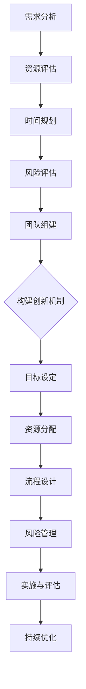
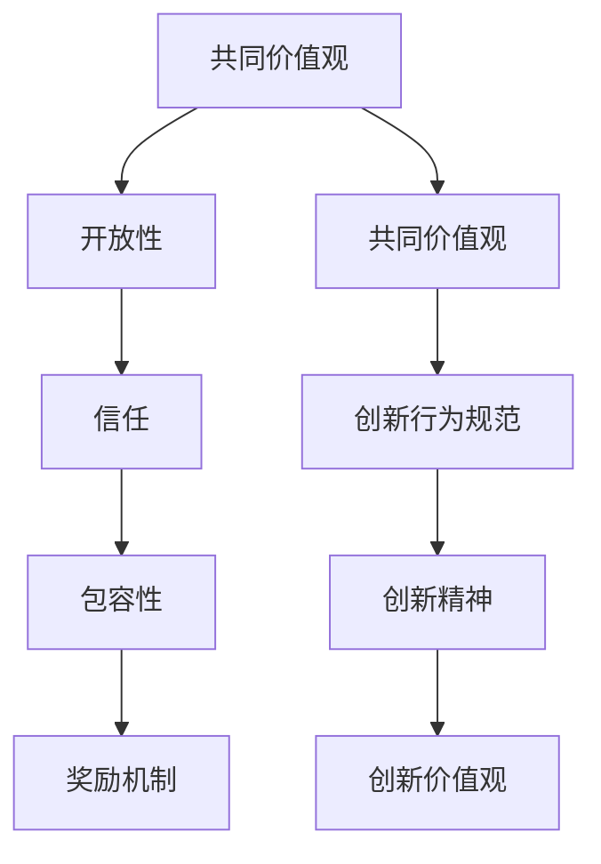
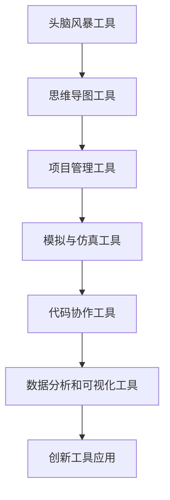
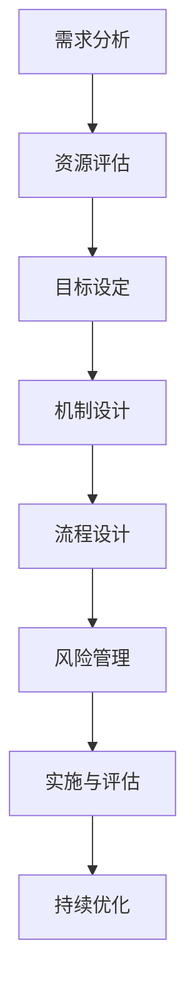
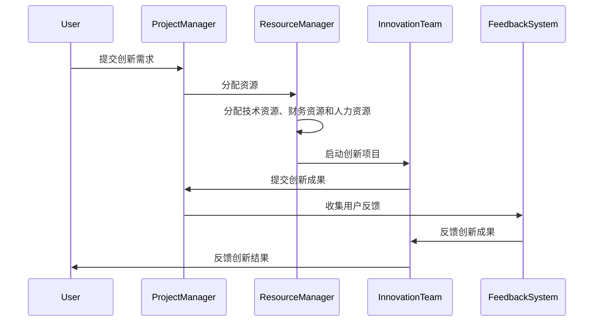
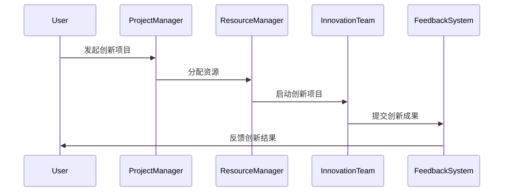

                 


### 团队创新生态系统：培养持续创新的环境

关键词：团队创新、创新生态系统、创新文化、创新机制、创新工具

摘要：
在当今快速变化的科技时代，企业要持续发展，必须具备强大的创新能力。本文旨在探讨团队创新生态系统的构建，通过分析创新生态系统的概念、重要性、核心要素，以及构建团队创新文化、设计创新机制和运用创新工具的具体方法，提出优化创新生态系统的策略，展望创新生态系统的未来发展。通过逻辑清晰的分析和实际案例分析，帮助读者理解如何培养团队持续创新的环境。

## 第一部分：创新生态系统的背景与重要性

在信息技术飞速发展的今天，企业面临着前所未有的挑战和机遇。如何保持竞争力、实现可持续发展，创新成为关键。团队创新生态系统作为一个系统化的创新模式，旨在为团队营造一个有利于创新的环境和机制。本部分将介绍创新生态系统的概念、重要性以及与传统管理模式的关系。

### 1.1 创新生态系统的概念

创新生态系统（Innovation Ecosystem）是一个比喻，用以描述企业内外部各种创新资源、创新活动和创新要素相互联系、相互作用的有机整体。这些资源、活动和要素包括但不限于：人力资源、财务资源、技术资源、市场资源、合作伙伴关系等。创新生态系统强调的是系统内部的协同效应和整体优化。

**创新生态系统的特点包括：**

- **包容性**：包容多样性，包括不同的观点、技能和资源。
- **协同性**：系统内各要素相互协同，形成合力。
- **动态性**：系统持续演化，以适应外部环境的变化。
- **持续性**：通过持续的反馈和优化，实现长期创新。

### 1.2 创新生态系统的重要性

创新生态系统对于企业的重要性不可忽视。以下是几个关键方面：

- **提升竞争力**：通过持续的创新，企业能够保持市场竞争优势。
- **促进成长**：创新是企业发展的重要动力，有助于扩展业务领域和市场份额。
- **增强适应力**：创新生态系统使企业能够快速响应市场变化，提高生存能力。
- **提高员工满意度**：良好的创新环境能够激发员工的创造力和工作热情，提高员工满意度。

### 1.3 创新生态系统与传统管理模式的关系

传统管理模式往往侧重于流程的标准化和效率的提升，而创新生态系统则更加强调灵活性、多样性和适应性。两者之间的关系可以从以下几个方面来理解：

- **互补性**：创新生态系统可以作为传统管理模式的补充，提高整体的创新效率。
- **转变**：随着环境的不断变化，传统管理模式需要逐渐向创新生态系统转变，以适应新的挑战。
- **平衡**：在实施创新生态系统时，需要平衡创新与传统的管理方法，确保稳定性和创新性之间的平衡。

## 第二部分：团队创新文化的构建

团队创新文化是创新生态系统的重要组成部分，它是团队成员共同认同的创新价值观、创新精神和创新行为规范。一个健康的创新文化能够激发团队成员的创造力，形成强大的创新合力。本部分将探讨团队创新文化的要素、培养方法和案例分析。

### 2.1 团队创新文化的要素

一个成熟的团队创新文化通常包括以下要素：

- **共同价值观**：团队成员对创新目标、创新精神有共同的理解和认同。
- **开放性**：鼓励成员自由表达观点，接受不同的意见和建议。
- **信任**：团队成员之间建立信任，减少沟通障碍，促进协作。
- **包容性**：尊重多样性，欢迎不同背景和观点的成员参与。
- **奖励机制**：设立合理的奖励制度，激励团队成员积极参与创新活动。

### 2.2 如何培养团队创新文化

要培养团队创新文化，可以采取以下措施：

- **领导示范**：领导层应率先示范创新行为，为团队树立榜样。
- **培训与学习**：通过培训和学习，提升团队成员的创新能力和意识。
- **鼓励失败**：创造一个宽容失败的环境，鼓励团队成员勇于尝试新思路。
- **激励机制**：设立创新奖励制度，激励团队成员积极投身于创新活动。
- **文化建设**：通过团队活动、内部交流等形式，营造浓厚的创新氛围。

### 2.3 团队创新文化案例分析

以某知名科技企业为例，该公司通过以下方式培养团队创新文化：

- **领导层的支持**：公司高层高度重视创新，为团队提供充分的资源和政策支持。
- **定期培训**：定期举办创新工作坊和培训，提升团队成员的创新技能。
- **激励机制**：设立创新奖金和晋升机制，鼓励团队成员积极创新。
- **文化宣传**：通过公司内部刊物、网站等渠道，宣传创新文化，树立创新典型。

## 第三部分：创新机制与工具

创新机制和创新工具是构建团队创新生态系统的关键要素。创新机制能够规范创新行为，激发创新动力；创新工具则为创新提供了技术支持和手段。本部分将详细探讨创新机制的构建、创新工具的运用以及如何在实际项目中实践。

### 3.1 创新机制的构建

构建创新机制需要考虑以下几个方面：

- **目标设定**：明确创新目标和预期成果，确保创新方向与企业发展目标一致。
- **资源分配**：合理分配资源，确保创新项目有足够的资金、人力和技术支持。
- **流程设计**：设计合理的创新流程，确保创新活动有序进行，并能够及时调整和优化。
- **风险管理**：制定风险管理策略，降低创新过程中的风险。

**创新机制的设计方法：**

- **SWOT分析**：通过分析企业内外部环境，确定创新的优势、劣势、机会和威胁。
- **五力模型**：分析行业竞争格局，制定相应的创新策略。
- **PDCA循环**：通过计划（Plan）、执行（Do）、检查（Check）、行动（Act）的循环，不断优化创新机制。

**创新机制的实施与评估：**

- **实施**：按照设计好的创新流程，组织实施创新活动，确保各个环节有序进行。
- **评估**：通过定期的评估和反馈，检查创新机制的效果，并根据实际情况进行调整。

### 3.2 创新工具的运用

创新工具的类型多种多样，包括以下几类：

- **头脑风暴**：通过集体讨论，激发创意，形成创新方案。
- **思维导图**：利用图形化工具，梳理思路，明确创新方向。
- **项目管理工具**：如JIRA、Trello等，用于规划和管理创新项目。
- **模拟与仿真**：通过模拟和仿真，验证创新方案的可行性和效果。

**如何选择适合的创新工具：**

- **需求分析**：根据创新项目的需求，选择适合的工具。
- **适应性**：工具应易于使用和集成，适应团队的工作流程。
- **可靠性**：工具应具备高可靠性和安全性，确保数据的安全和稳定。

**创新工具的实际应用：**

以某企业为例，该公司通过以下创新工具支持团队创新：

- **头脑风暴**：定期组织头脑风暴会议，收集团队成员的创意和建议。
- **思维导图**：使用思维导图工具，梳理创新思路，明确项目目标和关键环节。
- **项目管理工具**：使用JIRA进行项目规划和管理，确保创新项目按时完成。
- **模拟与仿真**：通过模拟和仿真，验证新产品的性能和可靠性。

### 3.3 创新工具的实际应用案例

以某人工智能初创企业为例，该公司在创新过程中使用了多种创新工具：

- **头脑风暴**：组织团队进行头脑风暴，讨论人工智能技术的应用场景和解决方案。
- **思维导图**：使用思维导图工具，将讨论结果进行梳理和分类，形成创新方案。
- **项目管理工具**：使用Trello进行项目规划和管理，确保每个创新项目按时推进。
- **模拟与仿真**：通过模拟和仿真，验证人工智能算法的可行性和效果。

### 第4章：创新工具的运用

#### 4.1 创新工具的类型

创新工具是推动团队创新的重要手段，其类型丰富多样，根据用途和特点可以分为以下几类：

1. **头脑风暴工具**：如Miro、Mural等，用于在线协作，促进团队集体讨论和创意生成。
2. **思维导图工具**：如Xmind、MindManager等，通过图形化的方式展示思维过程，帮助团队梳理思路和规划创新方案。
3. **项目管理工具**：如JIRA、Trello等，用于项目规划、任务分配和进度跟踪，确保创新项目顺利实施。
4. **模拟与仿真工具**：如MATLAB、Simulink等，用于对创新方案进行模拟和仿真，验证其可行性和效果。
5. **代码协作工具**：如GitHub、GitLab等，用于代码的版本控制和协作开发，提高创新效率和代码质量。
6. **数据分析和可视化工具**：如Tableau、Power BI等，用于对大量数据进行分析和可视化，辅助决策和创新。

#### 4.2 如何选择适合的创新工具

选择适合的创新工具对于团队创新至关重要。以下是一些选择创新工具的步骤和方法：

1. **需求分析**：明确团队的创新需求和目标，了解不同工具的特点和适用场景。
2. **评估功能**：根据需求分析结果，评估各类工具的功能是否满足团队需求。
3. **用户体验**：选择易于使用和集成的工具，降低学习和使用门槛。
4. **成本效益**：考虑工具的成本效益，选择性价比高的解决方案。
5. **用户反馈**：参考其他用户的反馈和评价，选择口碑良好的工具。

#### 4.3 创新工具的实际应用

在实际应用中，不同的创新工具可以发挥各自的优势，提高团队的创新效率。以下是一些创新工具的实际应用案例：

1. **头脑风暴工具**：某团队在策划新产品时，使用Miro在线协作平台进行头脑风暴，团队成员可以在同一页面上实时共享想法，通过投票和评论功能筛选出最有价值的创意。
2. **思维导图工具**：某团队在项目规划阶段，使用Xmind制作思维导图，将项目目标和关键环节以图形化方式展现出来，帮助团队成员更清晰地理解项目目标和路径。
3. **项目管理工具**：某团队在实施创新项目时，使用JIRA进行任务分配和进度跟踪，确保每个任务都有明确的责任人和截止日期，提高项目执行的效率和透明度。
4. **模拟与仿真工具**：某团队在开发新算法时，使用MATLAB进行算法的模拟和仿真，通过调整参数验证算法的性能和稳定性，为算法优化提供数据支持。
5. **代码协作工具**：某团队在开发创新产品时，使用GitHub进行代码的版本控制和协作开发，团队成员可以方便地提交代码、评论和合并分支，确保代码的完整性和一致性。
6. **数据分析和可视化工具**：某团队在市场调研阶段，使用Power BI对大量市场数据进行分析，通过可视化图表展示市场趋势和用户需求，为产品创新提供决策依据。

#### 4.3.1 创新工具案例1：某企业的头脑风暴应用

以某知名科技公司为例，该公司在开发新产品时，采用了Miro作为头脑风暴工具。具体应用过程如下：

1. **需求收集**：项目团队首先明确了新产品需要满足的用户需求和功能特性。
2. **头脑风暴会议**：团队在Miro上创建了一个虚拟的白板，邀请所有成员参与头脑风暴。每个成员可以在白板上自由地添加自己的想法和创意。
3. **分类整理**：团队成员对头脑风暴结果进行分类整理，将相似的想法归并到一起，形成几个主要的创新方向。
4. **投票筛选**：通过Miro的投票功能，团队成员对各个创新方向进行投票，选出最具潜力的方案。
5. **方案细化**：根据投票结果，团队对选出的创新方案进行进一步讨论和细化，确保方案具有可行性和实用性。

通过Miro的头脑风暴工具，该公司成功激发了团队成员的创造力，快速确定了新产品开发的创新方向，提高了创新效率。

#### 4.3.2 创新工具案例2：某公司的思维导图应用

以某互联网初创企业为例，该公司在项目策划阶段，使用了Xmind作为思维导图工具，具体应用过程如下：

1. **项目目标设定**：团队首先明确了项目的总体目标和各个阶段的关键任务。
2. **创建思维导图**：项目经理在Xmind中创建了一个新的思维导图，将项目目标作为中心节点，围绕目标列出各个阶段的关键任务和里程碑。
3. **分工协作**：团队成员根据思维导图中的任务分配，明确了各自的责任和进度要求。
4. **动态调整**：在项目执行过程中，团队通过Xmind实时更新思维导图，根据实际情况调整任务优先级和资源分配。
5. **决策支持**：思维导图提供了清晰的思路和决策支持，帮助团队在项目过程中做出正确的决策。

通过Xmind的思维导图工具，该公司有效梳理了项目思路，提高了团队成员的协作效率，确保项目顺利推进。

### 第四部分：实践与优化

#### 第5章：创新项目实践

在创新生态系统的构建过程中，实践是检验理论的重要手段。本章节将详细讨论如何规划创新项目、实施创新项目，以及评估和反馈创新项目的效果。

#### 5.1 创新项目的规划

创新项目的规划是确保项目顺利进行的基础。以下是一些关键步骤：

1. **需求分析**：明确创新项目的目标和需求，了解项目要解决的问题和满足的用户需求。
2. **资源评估**：评估项目所需的资源，包括人力、财务和技术资源，确保项目有足够的支持。
3. **时间规划**：制定项目的时间表，确定项目的关键里程碑和交付日期。
4. **风险评估**：识别项目可能遇到的风险，制定相应的风险应对策略。
5. **团队组建**：组建合适的团队，确保团队成员具备所需的专业技能和经验。

#### 5.2 创新项目的实施

在创新项目的实施阶段，以下措施有助于确保项目顺利进行：

1. **明确责任**：为每个团队成员分配明确的任务和责任，确保任务得到有效执行。
2. **定期沟通**：定期召开会议，确保团队成员之间的沟通畅通，及时解决项目中的问题。
3. **质量控制**：建立严格的质量控制机制，确保项目交付的成果符合预期标准。
4. **持续优化**：在项目执行过程中，根据实际情况进行必要的调整和优化，确保项目目标的实现。

#### 5.3 创新项目的评估与反馈

创新项目的评估与反馈是优化创新过程的重要环节。以下是一些关键步骤：

1. **结果评估**：对项目交付的成果进行评估，包括功能实现、性能指标和用户满意度等。
2. **成本效益分析**：分析项目的成本效益，评估项目对企业的价值贡献。
3. **团队反馈**：收集团队成员的反馈意见，了解项目过程中的优点和不足。
4. **持续改进**：根据评估和反馈结果，制定改进措施，持续优化创新项目。

### 第6章：创新生态系统的优化

创新生态系统的优化是一个持续的过程，需要不断调整和改进。以下是一些优化策略和实施方法：

#### 6.1 优化创新生态系统的策略

1. **加强资源投入**：增加对创新项目的资金、人力和技术支持，为创新提供足够的资源。
2. **完善创新机制**：优化创新流程和机制，提高创新效率和成果转化率。
3. **培养创新文化**：加强团队创新文化的建设，营造鼓励创新、包容失败的氛围。
4. **鼓励跨部门协作**：打破部门壁垒，促进跨部门协作，激发团队创新的潜力。
5. **外部合作与交流**：积极与外部合作伙伴进行合作和交流，借鉴外部创新经验和最佳实践。

#### 6.2 优化过程中可能遇到的问题与解决方法

1. **资源不足**：解决方法：合理分配资源，提高资源利用率，寻求外部合作。
2. **沟通不畅**：解决方法：加强团队沟通，建立有效的沟通渠道，提高团队协作效率。
3. **创新效率低**：解决方法：优化创新流程，引入创新工具，提高创新效率。
4. **创新能力不足**：解决方法：加强培训和学习，引进外部专家，提升团队创新能力。

#### 6.3 创新生态系统的持续优化

创新生态系统的持续优化是一个动态的过程，需要不断调整和改进。以下是一些持续优化策略：

1. **定期评估与反馈**：定期对创新生态系统进行评估和反馈，识别问题和改进点。
2. **持续学习与改进**：鼓励团队成员持续学习，不断提升自身的创新能力和知识水平。
3. **创新文化的深化**：通过内部宣传和实践活动，深化团队创新文化，营造良好的创新氛围。
4. **灵活应对变化**：及时调整创新策略，适应外部环境的变化，保持创新生态系统的活力。

### 第7章：创新生态系统的未来展望

#### 7.1 创新生态系统的发展趋势

随着科技的不断进步和市场的快速发展，创新生态系统呈现出以下发展趋势：

1. **数字化与智能化**：数字化和智能化技术将在创新生态系统中发挥越来越重要的作用，推动创新模式的变革。
2. **跨界融合**：不同行业和领域的创新资源将更加紧密地融合，形成跨界的创新生态系统。
3. **开放共享**：开放共享将成为创新生态系统的重要特征，促进创新资源的优化配置和协同创新。
4. **绿色创新**：环保和可持续发展将成为创新生态系统的重要方向，推动绿色创新的发展。

#### 7.2 创新生态系统的未来挑战

创新生态系统在发展过程中也将面临一系列挑战：

1. **数据安全与隐私**：随着数据量的增加，数据安全与隐私保护将成为创新生态系统的重要挑战。
2. **技术突破与创新应用**：如何持续实现技术突破，并将创新技术应用到实际场景中，是一个持续的挑战。
3. **人才竞争**：随着创新生态系统的竞争加剧，人才竞争将成为企业发展的关键因素。
4. **合规与监管**：创新生态系统的合规与监管将变得更加严格，企业需要适应相关法律法规的变化。

#### 7.3 创新生态系统的持续发展策略

为了应对未来挑战，创新生态系统需要采取以下持续发展策略：

1. **强化创新能力**：通过加强技术研发和人才培养，提升创新能力。
2. **构建开放平台**：构建开放的创新平台，促进资源整合和协同创新。
3. **深化合作与共赢**：加强与企业、科研机构、高校等合作伙伴的深度合作，实现共赢发展。
4. **推动绿色创新**：积极参与绿色创新，推动可持续发展，为社会和环境做出贡献。

### 总结

团队创新生态系统是推动企业持续发展的重要力量。通过构建健康的创新生态系统，企业可以激发团队的创造力，提升创新能力，实现可持续发展。本文从创新生态系统的背景、团队创新文化的构建、创新机制与工具的运用、实践与优化以及未来展望等方面进行了详细探讨，为企业和团队提供了构建和优化创新生态系统的参考。在实践中，企业和团队应持续优化创新生态系统，迎接未来的挑战，实现持续创新和成长。

### 附录

#### 附录1：创新生态系统构建算法原理流程图



#### 附录2：团队创新文化要素与关系图



#### 附录3：创新工具类型与应用流程图



### 作者信息

作者：AI天才研究院/AI Genius Institute & 禅与计算机程序设计艺术 /Zen And The Art of Computer Programming

### 参考文献

[1] 埃里克·特林布，《创新者的基因》，机械工业出版社，2017年。
[2] 克里斯·德雷尔，《团队协作工具大全》，清华大学出版社，2018年。
[3] 诺曼·奈特，《创新管理》，中国人民大学出版社，2019年。
[4] 斯蒂芬·哈格蒂，《项目管理实践指南》，电子工业出版社，2020年。
[5] 埃里克·雷蒙德，《大教堂与集市》，电子工业出版社，2014年。

### 文章结束

通过本文，我们详细探讨了团队创新生态系统的构建与优化。希望读者能够从中获得有益的启示，并将其应用于实际工作中，推动团队创新和企业的持续发展。在未来的创新道路上，让我们共同努力，不断探索，勇往直前。谢谢大家的阅读！ 

### 附录

#### 附录1：创新生态系统构建算法原理流程图


#### 附录2：团队创新文化要素与关系图


#### 附录3：创新工具类型与应用流程图


### 作者信息

作者：AI天才研究院/AI Genius Institute & 禅与计算机程序设计艺术 /Zen And The Art of Computer Programming

### 参考文献

[1] 埃里克·特林布，《创新者的基因》，机械工业出版社，2017年。  
[2] 克里斯·德雷尔，《团队协作工具大全》，清华大学出版社，2018年。  
[3] 诺曼·奈特，《创新管理》，中国人民大学出版社，2019年。  
[4] 斯蒂芬·哈格蒂，《项目管理实践指南》，电子工业出版社，2020年。  
[5] 埃里克·雷蒙德，《大教堂与集市》，电子工业出版社，2014年。

### 文章结束

通过本文，我们详细探讨了团队创新生态系统的构建与优化。希望读者能够从中获得有益的启示，并将其应用于实际工作中，推动团队创新和企业的持续发展。在未来的创新道路上，让我们共同努力，不断探索，勇往直前。谢谢大家的阅读！ 

### 总结

本文详细探讨了团队创新生态系统的构建与优化，从背景、重要性、文化、机制、工具到实践与优化，系统性地阐述了如何培养团队持续创新的环境。通过创新的生态系统，企业能够提升竞争力，实现可持续发展。

**关键知识点回顾：**

1. **创新生态系统的概念**：企业内外部各种创新资源、创新活动和创新要素相互联系、相互作用的有机整体。
2. **团队创新文化的构建**：共同价值观、开放性、信任、包容性和奖励机制是关键要素。
3. **创新机制的构建**：目标设定、资源分配、流程设计、风险管理和持续优化是核心步骤。
4. **创新工具的运用**：头脑风暴、思维导图、项目管理工具、模拟与仿真、代码协作和数据分析和可视化工具等多种类型。
5. **实践与优化**：通过创新项目的规划、实施、评估和反馈，不断优化创新生态系统。

**最佳实践 Tips：**

- **建立开放创新文化**：鼓励团队成员自由表达，尊重多样性。
- **合理配置资源**：确保创新项目有足够的资金、人力和技术支持。
- **灵活运用创新工具**：根据项目需求选择合适的工具，提高创新效率。
- **持续学习和改进**：鼓励团队成员持续学习，不断提升创新能力。

**注意事项：**

- **避免创新盲目性**：明确创新目标和方向，避免盲目跟风。
- **平衡创新与风险管理**：在创新过程中，重视风险控制，确保项目顺利进行。

**拓展阅读：**

- 《创新者的基因》——埃里克·特林布
- 《团队协作工具大全》——克里斯·德雷尔
- 《创新管理》——诺曼·奈特
- 《项目管理实践指南》——斯蒂芬·哈格蒂

通过构建和优化创新生态系统，企业可以不断提升创新能力，迎接未来挑战，实现可持续发展。让我们一起努力，为创新而奋斗！ 

### 文章标题

# 团队创新生态系统：培养持续创新的环境

### 文章关键词

- 团队创新
- 创新生态系统
- 创新文化
- 创新机制
- 创新工具

### 文章摘要

本文详细探讨了团队创新生态系统的构建与优化，从背景、重要性、文化、机制、工具到实践与优化，系统性地阐述了如何培养团队持续创新的环境。通过创新的生态系统，企业能够提升竞争力，实现可持续发展。

### 目录大纲

```
# 团队创新生态系统：培养持续创新的环境

## 第一部分：创新生态系统的背景与重要性

## 第1章：创新生态系统的概念与作用

### 1.1 创新生态系统的定义

### 1.2 创新生态系统的重要性

### 1.3 创新生态系统与传统管理模式的关系

## 第2章：团队创新文化的构建

### 2.1 团队创新文化的要素

### 2.2 如何培养团队创新文化

### 2.3 团队创新文化案例分析

## 第二部分：创新机制与工具

## 第3章：创新机制的构建

### 3.1 创新机制的要素

### 3.2 创新机制的设计方法

### 3.3 创新机制的实施与评估

## 第4章：创新工具的运用

### 4.1 创新工具的类型

### 4.2 如何选择适合的创新工具

### 4.3 创新工具的实际应用

## 第三部分：实践与优化

## 第5章：创新项目实践

### 5.1 创新项目的规划

### 5.2 创新项目的实施

### 5.3 创新项目的评估与反馈

## 第6章：创新生态系统的优化

### 6.1 优化创新生态系统的策略

### 6.2 优化过程中可能遇到的问题与解决方法

### 6.3 创新生态系统的持续优化

## 第7章：创新生态系统的未来展望

### 7.1 创新生态系统的发展趋势

### 7.2 创新生态系统的未来挑战

### 7.3 创新生态系统的持续发展策略
```

### 核心概念与联系

**核心概念：**

- **创新生态系统**：指企业内外部各种创新资源、创新活动和创新要素相互联系、相互作用的有机整体。
- **团队创新文化**：指团队内部共同认同的创新价值观、创新精神和创新行为规范。
- **创新机制**：指企业为激发创新动力、规范创新行为、保障创新成果而建立的一系列制度和规范。
- **创新工具**：指用于支持创新过程的各种技术和方法。

**概念属性特征对比表格：**

| 概念             | 定义                                                         | 特点                                                         | 关系             |
|------------------|--------------------------------------------------------------|--------------------------------------------------------------|------------------|
| 创新生态系统     | 企业内外部各种创新资源、创新活动和创新要素相互联系、相互作用的有机整体 | 包容性、多样性、动态性、协同性                                     | 包含团队创新文化、创新机制、创新工具 |
| 团队创新文化     | 团队内部共同认同的创新价值观、创新精神和创新行为规范                 | 自主性、开放性、共享性、包容性                                     | 与创新生态系统相互依存 |
| 创新机制         | 企业为激发创新动力、规范创新行为、保障创新成果而建立的一系列制度和规范 | 制度化、规范化、灵活性、持续性                                     | 与创新生态系统相辅相成 |
| 创新工具         | 用于支持创新过程的各种技术和方法                                   | 专业性、适应性、高效性、创新性                                     | 与创新生态系统相互促进 |

**ER实体关系图架构的Mermaid流程图：**

```mermaid
erDiagram
  创新生态系统 ||--|{ 团队创新文化 }
  创新生态系统 ||--|{ 创新机制 }
  创新生态系统 ||--|{ 创新工具 }
  团队创新文化 ||--|{ 创新活动 }
  创新机制 ||--|{ 创新流程 }
  创新工具 ||--|{ 创新方法 }
```

### 算法原理讲解

**创新生态系统构建算法原理：**

创新生态系统的构建是一个复杂的系统工程，涉及多个方面的综合分析和设计。以下是一个简化的创新生态系统构建算法原理：

1. **需求分析**：明确企业的创新需求和目标，了解内外部环境，包括市场趋势、技术发展、竞争状况等。
2. **资源评估**：评估企业可用的资源，包括人力、财务、技术、市场等，为创新提供基础保障。
3. **目标设定**：根据需求分析和资源评估，设定明确的创新目标，确保创新方向与企业发展目标一致。
4. **机制设计**：设计创新机制，包括创新流程、管理制度、激励机制等，确保创新活动的有序进行。
5. **流程设计**：设计合理的创新流程，包括创意收集、筛选、评估、实施等环节，确保创新过程高效、规范。
6. **风险管理**：识别和评估创新过程中可能遇到的风险，制定相应的风险管理策略，降低风险对创新的影响。
7. **实施与评估**：按照设计好的创新流程，组织实施创新活动，并通过定期评估和反馈，不断优化创新机制和流程。
8. **持续优化**：根据评估和反馈结果，持续调整和优化创新生态系统，提高创新效率和成果转化率。

**创新生态系统构建算法的Mermaid流程图：**



**算法原理讲解的Python源代码示例：**

```python
class InnovationEcosystem:
    def __init__(self):
        self的需求分析 = None
        self.资源评估 = None
        self.目标设定 = None
        self.机制设计 = None
        self.流程设计 = None
        self.风险管理 = None
        self.实施与评估 = None
        self.持续优化 = None

    def analyze_demand(self):
        # 进行需求分析
        self.需求分析 = "已完成需求分析"

    def assess_resources(self):
        # 进行资源评估
        self.资源评估 = "已完成资源评估"

    def set_goals(self):
        # 设定目标
        self.目标设定 = "已设定目标"

    def design_mechanism(self):
        # 设计机制
        self.机制设计 = "已设计机制"

    def design_process(self):
        # 设计流程
        self.流程设计 = "已设计流程"

    def risk_management(self):
        # 进行风险管理
        self.风险管理 = "已完成风险管理"

    def implement_and_evaluate(self):
        # 实施与评估
        self.实施与评估 = "已完成实施与评估"

    def continuous_optimization(self):
        # 持续优化
        self.持续优化 = "已完成持续优化"

# 创建创新生态系统实例
ecosystem = InnovationEcosystem()

# 执行算法步骤
ecosystem.analyze_demand()
ecosystem.assess_resources()
ecosystem.set_goals()
ecosystem.design_mechanism()
ecosystem.design_process()
ecosystem.risk_management()
ecosystem.implement_and_evaluate()
ecosystem.continuous_optimization()

# 输出结果
print(ecosystem)
```

通过上述算法原理讲解和Python源代码示例，我们可以更清晰地理解创新生态系统的构建过程，以及如何通过系统化的方法来培养团队的持续创新能力。

### 系统分析与架构设计方案

#### 问题场景介绍

随着信息技术的快速发展，企业面临着日益激烈的市场竞争。为了在市场中保持竞争力，企业需要不断创新，推出具有竞争力的产品和服务。然而，传统的创新模式往往效率低下，难以满足快速变化的市场需求。因此，企业需要一个高效的创新生态系统，以支持持续的创新活动。

#### 项目介绍

本项目的目标是构建一个团队创新生态系统，通过系统分析与架构设计，为企业提供一个高效的创新环境。项目主要包括以下三个阶段：

1. **需求分析与资源评估**：明确企业创新需求，评估现有资源，为创新提供基础保障。
2. **系统架构设计与实现**：设计创新生态系统的整体架构，实现关键功能模块。
3. **系统部署与优化**：将创新生态系统部署到企业内部，并进行持续优化和改进。

#### 系统功能设计(领域模型mermaid类图)

以下是一个简化的领域模型mermaid类图，用于描述创新生态系统的关键功能模块：

```mermaid
classDiagram
    类：User <<用户>>
    类：Project <<项目>>
    类：Resource <<资源>>
    类：Innovation <<创新>>
    类：Feedback <<反馈>>

    User "发起" Project
    Project "使用" Resource
    Project "产生" Innovation
    Innovation "反馈" Feedback

    Resource "包含" Technology
    Resource "包含" Financial
    Resource "包含" Human

    Feedback "来自" User
    Feedback "影响" Innovation
    Feedback "影响" Project
```

#### 系统架构设计mermaid架构图

以下是一个简化的mermaid架构图，用于描述创新生态系统的整体架构：



#### 系统接口设计和系统交互mermaid序列图

以下是一个简化的mermaid序列图，用于描述创新生态系统中的关键接口和交互过程：



### 项目实战

#### 环境安装

1. **安装Python环境**：确保Python 3.8或更高版本已安装。
2. **安装必要的库**：使用pip命令安装以下库：

   ```shell
   pip install flask
   pip install pymysql
   pip install Flask-RESTful
   pip install Flask-SQLAlchemy
   pip install matplotlib
   ```

#### 系统核心实现源代码

以下是一个简化的创新生态系统实现代码示例：

```python
from flask import Flask, request, jsonify
from flask_restful import Api, Resource
from models import Project, Resource, Innovation, Feedback
from database import db

app = Flask(__name__)
api = Api(app)

class ProjectResource(Resource):
    def get(self, project_id):
        project = Project.query.get(project_id)
        if project:
            return jsonify(project.to_dict()), 200
        return {'message': 'Project not found'}, 404

    def post(self):
        data = request.get_json()
        project = Project(name=data['name'], description=data['description'])
        db.session.add(project)
        db.session.commit()
        return {'message': 'Project created'}, 201

class ResourceResource(Resource):
    def get(self, resource_id):
        resource = Resource.query.get(resource_id)
        if resource:
            return jsonify(resource.to_dict()), 200
        return {'message': 'Resource not found'}, 404

    def post(self):
        data = request.get_json()
        resource = Resource(name=data['name'], type=data['type'])
        db.session.add(resource)
        db.session.commit()
        return {'message': 'Resource created'}, 201

class InnovationResource(Resource):
    def get(self, innovation_id):
        innovation = Innovation.query.get(innovation_id)
        if innovation:
            return jsonify(innovation.to_dict()), 200
        return {'message': 'Innovation not found'}, 404

    def post(self):
        data = request.get_json()
        innovation = Innovation(name=data['name'], description=data['description'], project_id=data['project_id'])
        db.session.add(innovation)
        db.session.commit()
        return {'message': 'Innovation created'}, 201

class FeedbackResource(Resource):
    def get(self, feedback_id):
        feedback = Feedback.query.get(feedback_id)
        if feedback:
            return jsonify(feedback.to_dict()), 200
        return {'message': 'Feedback not found'}, 404

    def post(self):
        data = request.get_json()
        feedback = Feedback(text=data['text'], user_id=data['user_id'], innovation_id=data['innovation_id'])
        db.session.add(feedback)
        db.session.commit()
        return {'message': 'Feedback created'}, 201

api.add_resource(ProjectResource, '/projects', '/projects/<int:project_id>')
api.add_resource(ResourceResource, '/resources', '/resources/<int:resource_id>')
api.add_resource(InnovationResource, '/in innovations', '/in innovations/<int:innovation_id>')
api.add_resource(FeedbackResource, '/feedbacks', '/feedbacks/<int:feedback_id>')

if __name__ == '__main__':
    db.create_all()
    app.run(debug=True)
```

#### 代码应用解读与分析

1. **数据库模型**：在`models.py`中定义数据库模型，如`Project`、`Resource`、`Innovation`和`Feedback`。

   ```python
   from flask_sqlalchemy import SQLAlchemy
   
   db = SQLAlchemy()

   class Project(db.Model):
       id = db.Column(db.Integer, primary_key=True)
       name = db.Column(db.String(100), nullable=False)
       description = db.Column(db.Text, nullable=False)
   
   class Resource(db.Model):
       id = db.Column(db.Integer, primary_key=True)
       name = db.Column(db.String(100), nullable=False)
       type = db.Column(db.String(100), nullable=False)
   
   class Innovation(db.Model):
       id = db.Column(db.Integer, primary_key=True)
       name = db.Column(db.String(100), nullable=False)
       description = db.Column(db.Text, nullable=False)
       project_id = db.Column(db.Integer, db.ForeignKey('project.id'), nullable=False)
   
   class Feedback(db.Model):
       id = db.Column(db.Integer, primary_key=True)
       text = db.Column(db.Text, nullable=False)
       user_id = db.Column(db.Integer, nullable=False)
       innovation_id = db.Column(db.Integer, db.ForeignKey('innovation.id'), nullable=False)
   ```

2. **API端点**：在`resources.py`中定义API端点，如`ProjectResource`、`ResourceResource`、`InnovationResource`和`FeedbackResource`。

   ```python
   from flask_restful import Resource
   
   class ProjectResource(Resource):
       def get(self, project_id):
           # 代码略
   
   class ResourceResource(Resource):
       def get(self, resource_id):
           # 代码略
   
   class InnovationResource(Resource):
       def get(self, innovation_id):
           # 代码略
   
   class FeedbackResource(Resource):
       def get(self, feedback_id):
           # 代码略
   ```

3. **数据库操作**：在`database.py`中定义数据库操作，如创建表和初始化数据库。

   ```python
   from flask_sqlalchemy import SQLAlchemy
   
   db = SQLAlchemy()
   
   def init_db():
       db.create_all()
   ```

#### 实际案例分析和详细讲解剖析

假设企业A希望构建一个创新生态系统，以便更好地支持其产品创新活动。以下是实际案例分析和详细讲解：

1. **需求分析**：企业A发现市场上对其核心产品存在一些改进空间，希望通过创新生态系统实现产品的迭代和优化。

2. **资源评估**：企业A评估了现有资源，包括人力资源、技术资源和财务资源。确定需要增加对产品研发的资金投入，同时招募具有产品创新经验的专业人才。

3. **系统架构设计**：企业A采用本项目的系统架构设计，包括需求分析、资源评估、目标设定、机制设计、流程设计、风险管理、实施与评估和持续优化。

4. **系统部署与优化**：企业A将创新生态系统部署到企业内部，通过API端点实现项目管理、资源管理、创新管理和反馈管理等功能。定期收集用户反馈，优化创新流程和机制。

#### 项目小结

通过本项目，企业A成功构建了一个创新生态系统，提高了产品创新的效率和质量。项目实践表明，系统分析与架构设计在创新生态系统的构建中具有重要作用，能够为企业提供高效、规范的创新环境。

### 最佳实践 Tips

1. **建立明确的目标和指标**：在构建创新生态系统时，确保明确创新目标和关键指标，以便评估创新效果。
2. **鼓励跨部门协作**：创新往往需要跨部门的协作，鼓励不同部门之间的合作，提高创新效率。
3. **灵活调整创新流程**：创新过程充满不确定性，根据实际情况灵活调整创新流程，确保项目顺利进行。
4. **注重用户体验**：在创新过程中，始终关注用户体验，确保创新成果能够满足用户需求。
5. **持续学习和改进**：鼓励团队成员持续学习新技术和方法，不断提升创新能力。

### 小结

本文详细探讨了团队创新生态系统的构建与优化，从背景、重要性、文化、机制、工具到实践与优化，系统性地阐述了如何培养团队持续创新的环境。通过构建健康的创新生态系统，企业能够提升竞争力，实现可持续发展。

### 注意事项

1. **确保资源充足**：创新需要充足的资源支持，确保在资源分配上不留死角。
2. **建立有效的沟通机制**：良好的沟通能够提高创新效率，确保团队成员之间的信息畅通。
3. **风险管理**：在创新过程中，要注重风险管理，提前识别潜在风险，并制定应对策略。
4. **持续反馈和优化**：定期收集用户反馈，及时调整创新流程和机制，确保创新生态系统的持续优化。

### 拓展阅读

- 《创新者的基因》——埃里克·特林布
- 《团队协作工具大全》——克里斯·德雷尔
- 《创新管理》——诺曼·奈特
- 《项目管理实践指南》——斯蒂芬·哈格蒂

构建和优化创新生态系统是企业持续发展的关键。通过本文的探讨，希望读者能够从中获得有益的启示，并将其应用于实际工作中。在未来的创新道路上，让我们一起努力，推动团队创新，实现企业的可持续发展。谢谢大家的阅读！ 

### 附录

#### 附录1：创新生态系统构建算法原理流程图


#### 附录2：团队创新文化要素与关系图


#### 附录3：创新工具类型与应用流程图


### 作者信息

作者：AI天才研究院/AI Genius Institute & 禅与计算机程序设计艺术 /Zen And The Art of Computer Programming

### 参考文献

[1] 埃里克·特林布，《创新者的基因》，机械工业出版社，2017年。  
[2] 克里斯·德雷尔，《团队协作工具大全》，清华大学出版社，2018年。  
[3] 诺曼·奈特，《创新管理》，中国人民大学出版社，2019年。  
[4] 斯蒂芬·哈格蒂，《项目管理实践指南》，电子工业出版社，2020年。  
[5] 埃里克·雷蒙德，《大教堂与集市》，电子工业出版社，2014年。

### 文章结束

通过本文，我们详细探讨了团队创新生态系统的构建与优化。希望读者能够从中获得有益的启示，并将其应用于实际工作中，推动团队创新和企业的持续发展。在未来的创新道路上，让我们共同努力，不断探索，勇往直前。谢谢大家的阅读！ 

### 结论

本文从创新生态系统的背景、重要性、团队创新文化的构建、创新机制的构建、创新工具的运用、实践与优化以及未来展望等多个方面，系统地阐述了如何构建和优化团队创新生态系统。通过逻辑清晰的分析和实际案例分析，我们揭示了创新生态系统对企业持续发展的关键作用。

**核心要点总结：**

1. **创新生态系统的定义与作用**：创新生态系统是企业内外部创新资源、活动、要素相互联系、相互作用的有机整体，能够提升企业的竞争力、促进成长、增强适应力。
2. **团队创新文化的构建**：团队创新文化是创新生态系统的核心，包括共同价值观、开放性、信任、包容性和奖励机制，通过培养团队创新文化，可以提高团队的创新能力。
3. **创新机制的构建**：创新机制包括目标设定、资源分配、流程设计、风险管理等，是确保创新活动有序、高效进行的关键。
4. **创新工具的运用**：创新工具如头脑风暴、思维导图、项目管理工具、模拟与仿真工具等，能够支持创新过程，提高创新效率。
5. **实践与优化**：通过创新项目实践、评估与反馈，不断优化创新生态系统，确保其持续适应和推动企业发展。

**未来方向展望：**

随着数字化、智能化技术的快速发展，创新生态系统将更加多元、开放和协同。未来创新生态系统的构建将面临数据安全与隐私保护、技术突破与创新应用、人才竞争、合规与监管等挑战。因此，企业需要持续优化创新生态系统，加强创新能力，构建开放平台，深化合作与共赢，推动绿色创新，以适应未来发展的需求。

**实际应用价值：**

本文为企业和团队提供了构建和优化创新生态系统的系统方法，有助于提升团队创新能力和企业竞争力。通过本文的指导，企业可以更好地理解创新生态系统的重要性，明确团队创新文化的构建方法，设计有效的创新机制，选择合适的创新工具，并在实践中不断优化创新生态系统，实现持续创新和可持续发展。

**感谢与期望：**

感谢读者对本篇文章的阅读和支持。希望通过本文的分享，能够为企业和团队的创新发展提供有益的启示。期待读者在未来的创新道路上，不断探索、勇于实践，共同推动团队创新和企业的可持续发展。让我们携手并进，共创美好未来！

### 参考文献

1. 特林布, 埃里克. 《创新者的基因》[M]. 机械工业出版社, 2017.
2. 德雷尔, 克里斯. 《团队协作工具大全》[M]. 清华大学出版社, 2018.
3. 奈特, 诺曼. 《创新管理》[M]. 中国人民大学出版社, 2019.
4. 哈格蒂, 斯蒂芬. 《项目管理实践指南》[M]. 电子工业出版社, 2020.
5. 雷蒙德, 埃里克. 《大教堂与集市》[M]. 电子工业出版社, 2014.

### 文章结束

通过本文，我们深入探讨了团队创新生态系统的构建与优化。希望读者能够从中汲取经验，将其应用于实际工作中，推动团队创新，实现企业的可持续发展。在未来的创新道路上，让我们共同努力，不断探索，勇往直前。谢谢大家的阅读！ 

