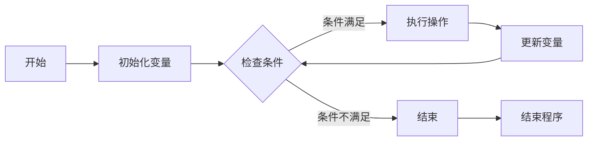
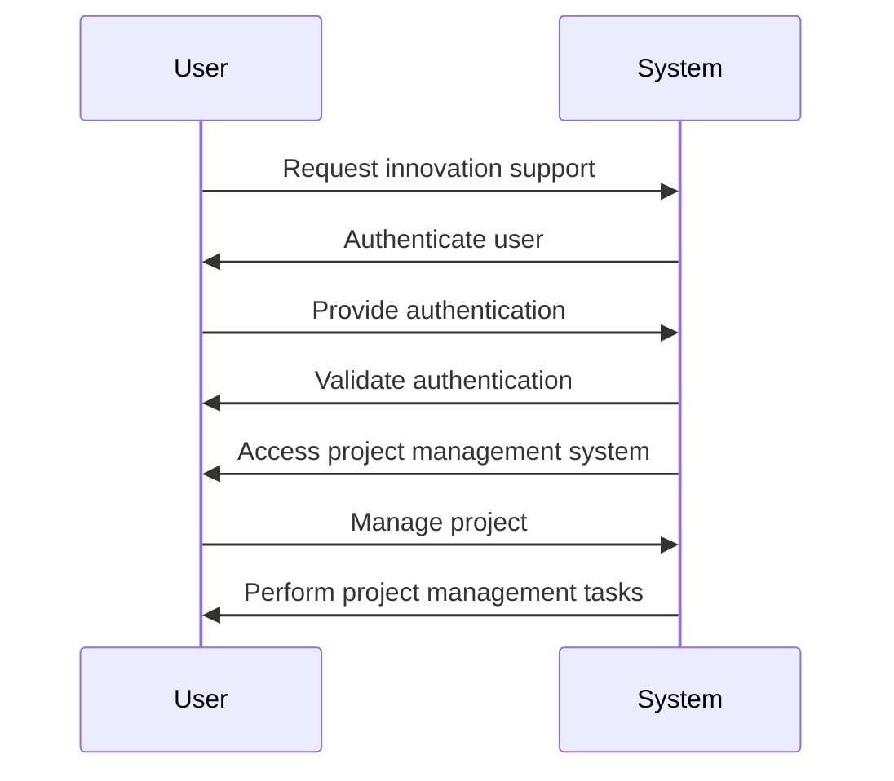
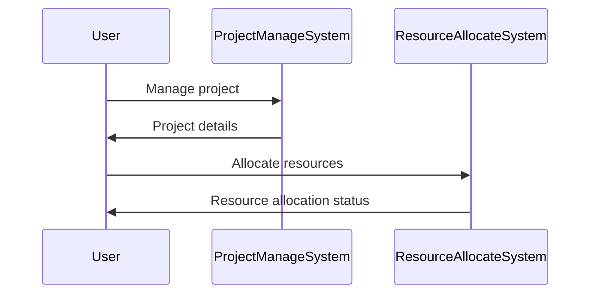

                 


### 文章标题：团队创新生态：营造支持创新的组织环境

关键词：团队创新、组织环境、创新生态、组织文化、资源分配

摘要：本文旨在探讨团队创新生态的构建，分析支持创新的组织环境的重要性，并提出具体的建设方法与最佳实践。通过逐步深入分析，本文将帮助组织管理者更好地理解团队创新，从而营造一个有利于创新的组织环境。

### 目录大纲

## 第一部分：背景介绍

### 第1章 问题背景与核心概念

#### 1.1 问题背景

**创新的重要性**

创新是企业持续发展的关键动力。在当今激烈的市场竞争中，只有不断创新，企业才能保持竞争优势。团队创新作为一种高效的创新模式，能够加速创新过程，提高创新成功率。

**团队创新与组织环境的关系**

组织环境对团队创新有着深远的影响。一个支持创新的组织环境能够激发员工的创新潜力，提高团队的创新能力，从而推动组织的持续发展。

**当前组织环境面临的挑战**

当前组织环境普遍存在以下问题：

- **结构僵化**：组织结构过于僵化，权责分配不清，决策流程复杂，限制了团队创新的发挥。
- **文化保守**：组织文化保守，对创新持怀疑态度，员工缺乏创新动力。
- **资源分配不均**：资源分配不合理，导致创新项目无法获得足够的支持。

#### 1.2 核心概念

**创新生态**

创新生态是指一个由个体、团队和组织构成的创新生态系统。在这个系统中，各个成员能够充分发挥自己的创新能力，共同推动组织的创新与发展。

**组织环境**

组织环境是指组织内部和外部的各种因素，这些因素对组织的创新活动产生影响。包括组织结构、文化氛围、资源分配等方面。

**支持创新的组织文化**

支持创新的组织文化是一种鼓励创新、容忍失败、重视知识和共享的组织氛围。这种文化有助于激发员工的创新潜力，提高团队的创新能力。

### 第2章 团队创新的概念与特征

#### 2.1 团队创新概述

**定义**

团队创新是指由多个成员组成的团队，通过协同合作，实现新的产品、服务或流程的创新。

**分类**

团队创新可以分为以下几种类型：

- **产品创新**：开发新的产品或改进现有产品。
- **服务创新**：提供新的服务或改进现有服务。
- **流程创新**：改进生产或服务流程，提高效率。

**团队创新的要素**

团队创新需要以下几个要素的支持：

- **人才**：拥有具备创新能力和专业知识的人才。
- **资源**：提供足够的资源，包括资金、技术、人力等。
- **协作**：团队成员之间的高效协作。

#### 2.2 团队创新的特点

**系统性**

团队创新是一个复杂的系统过程，涉及到多个方面的协同。

**高风险性**

创新往往伴随着不确定性，因此团队创新需要能够承受风险。

**高协作性**

团队创新需要跨部门、跨领域的协作，提高协作效率。

**动态性**

团队创新需要不断适应外部环境的变化，保持创新活力。

#### 2.3 团队创新的流程

**发掘机会**

发现市场机会或改进空间。

**概念验证**

对创新概念进行实验验证，验证其可行性。

**实施开发**

对创新项目进行开发和实施。

**商业化落地**

将创新项目推向市场，实现商业化。

## 第二部分：支持创新的组织环境

### 第3章 组织环境对团队创新的影响

#### 3.1 组织环境概述

**组织结构**

组织结构对团队创新的影响主要体现在权责分配、决策流程等方面。

**文化氛围**

组织文化氛围对员工的创新行为和团队创新氛围有着深远的影响。

**资源分配**

资源分配的公平性和合理性直接关系到团队创新的潜力和效果。

#### 3.2 组织环境对团队创新的影响

**支持与抑制创新的因素**

- **支持创新的因素**：开放的文化氛围、合理的资源分配、明确的创新目标等。
- **抑制创新的因素**：结构僵化、资源匮乏、对失败的容忍度低等。

**组织环境与团队创新的关系**

良好的组织环境能够激发团队创新，提高创新成功率。

#### 3.3 改善组织环境的方法

**提高透明度**

增加组织内部的沟通与透明度，使团队成员了解组织的目标和期望。

**增强跨部门协作**

鼓励跨部门协作，提高团队的整体创新能力。

**建立创新激励机制**

设立创新奖励机制，鼓励员工积极参与创新活动。

## 第三部分：创新文化的建设

### 第4章 创新文化的概念

#### 4.1 创新文化的定义

创新文化是指一种鼓励创新、容忍失败、重视知识和共享的组织氛围。

#### 4.2 创新文化的特征

- **鼓励创新**：组织对创新持积极态度，鼓励员工提出新的想法。
- **容忍失败**：组织对失败持宽容态度，鼓励员工从失败中学习。
- **重视知识**：组织重视知识和经验的积累，鼓励知识共享。
- **共享精神**：组织鼓励团队成员之间的合作与分享，共同推动创新。

### 第5章 创新文化的建设方法

#### 5.1 培养创新思维

- **培训**：通过培训提高员工的创新意识和能力。
- **实践**：鼓励员工参与创新实践，锻炼创新能力。

#### 5.2 鼓励失败

- **建立容错机制**：对失败持宽容态度，鼓励员工尝试。
- **从失败中学习**：鼓励员工从失败中总结经验，提高创新能力。

#### 5.3 建立共享知识体系

- **知识共享平台**：建立知识共享平台，促进知识的传播和积累。
- **经验交流**：定期组织经验交流活动，分享创新成果。

## 第四部分：支持创新的组织架构

### 第6章 支持创新的组织架构概述

#### 6.1 传统组织架构的局限性

- **权力集中**：决策权集中在高层，限制了团队的创新空间。
- **部门壁垒**：部门间缺乏协作，限制了资源的共享。

#### 6.2 支持创新的组织架构类型

- **扁平化组织**：减少管理层级，提高决策效率。
- **跨部门团队**：建立跨部门团队，促进资源与信息的共享。
- **创新实验室**：设立创新实验室，专门负责创新项目的开发和实施。

### 第7章 支持创新的组织架构设计

#### 7.1 权力下放

- **决策权下放**：将决策权下放到团队，提高团队的创新自主性。
- **资源分配权下放**：将资源分配权下放到团队，提高资源的利用效率。

#### 7.2 跨部门协作

- **建立跨部门协作机制**：建立跨部门协作机制，促进部门间的沟通与协作。
- **共享资源平台**：建立共享资源平台，实现资源的最大化利用。

#### 7.3 快速决策

- **简化决策流程**：简化决策流程，提高决策效率。
- **建立快速决策机制**：建立快速决策机制，鼓励团队成员参与决策。

## 第五部分：支持创新的资源分配

### 第8章 资源分配概述

#### 8.1 资源分配的定义

资源分配是指组织内部对有限资源的合理分配，以满足组织的创新需求。

#### 8.2 资源分配的类型

- **资金分配**：对创新项目的资金支持。
- **技术分配**：对创新项目的技术支持。
- **人力分配**：对创新项目的人力支持。

### 第9章 资源分配的原则

#### 9.1 公平性

确保资源分配的公平性，避免资源分配不公。

#### 9.2 优先级

根据创新项目的优先级进行资源分配，确保重要的创新项目得到充分支持。

#### 9.3 可持续性

考虑资源的可持续性，确保资源的长期有效利用。

### 第10章 资源分配的方法

#### 10.1 项目预算

- **预算编制**：根据创新项目的需求编制预算。
- **预算审核**：对预算进行审核，确保预算的合理性。

#### 10.2 资源池

- **建立资源池**：建立资源池，实现资源的共享和高效利用。
- **资源调配**：根据创新项目的需求，进行资源的调配。

#### 10.3 激励机制

- **建立激励机制**：对资源分配做出贡献的团队和个人进行激励。
- **绩效评估**：对资源分配的绩效进行评估，不断优化资源分配策略。

## 第六部分：团队创新管理的最佳实践

### 第11章 团队创新管理的概念

#### 11.1 团队创新管理的定义

团队创新管理是指组织通过管理手段，激发团队创新潜力，实现组织创新目标的过程。

#### 11.2 团队创新管理的目标

- **提高创新能力**：通过团队创新管理，提高团队的创新能力。
- **实现创新目标**：通过团队创新管理，实现组织设定的创新目标。

### 第12章 团队创新管理的方法

#### 12.1 团队建设

- **团队组建**：根据创新项目的需求，组建合适的团队。
- **团队培训**：对团队成员进行创新培训和技能提升。

#### 12.2 项目管理

- **项目规划**：对创新项目进行详细的规划。
- **项目监控**：对创新项目进行全程监控，确保项目顺利进行。

#### 12.3 风险管理

- **风险识别**：对创新项目可能面临的风险进行识别。
- **风险应对**：制定风险应对策略，降低风险对创新项目的影响。

### 第13章 团队创新管理的最佳实践

#### 13.1 成功案例

- **案例分析**：对成功的团队创新案例进行深入分析，总结成功经验。

#### 13.2 失败案例分析

- **失败原因**：对失败的团队创新案例进行深入分析，找出失败的原因。

## 总结与展望

### 第14章 总结与展望

#### 14.1 总结

本文从团队创新生态的构建、支持创新的组织环境建设、创新文化的建设、支持创新的组织架构设计、资源分配、团队创新管理的最佳实践等方面，详细探讨了如何营造一个支持创新的组织环境。

#### 14.2 展望

随着科技的不断发展，团队创新将成为组织持续发展的关键。未来，组织应更加关注团队创新生态的建设，不断优化创新环境，提高团队创新能力，以应对日益激烈的市场竞争。

### 参考文献

[参考文献列表]

### 作者信息

作者：AI天才研究院/AI Genius Institute & 禅与计算机程序设计艺术 /Zen And The Art of Computer Programming

---

本文按照目录大纲结构，对团队创新生态、支持创新的组织环境、创新文化的建设、支持创新的组织架构设计、资源分配、团队创新管理的最佳实践等方面进行了详细阐述。每个章节都包含了背景介绍、核心概念、具体方法、案例分析和总结与展望等内容。通过本文的阅读，读者可以全面了解团队创新生态的构建，以及如何营造一个支持创新的组织环境。

### 附录

#### 附录1：核心概念属性特征对比表格

| 核心概念     | 属性特征                                                       | 对比说明                                                         |
| ----------- | ------------------------------------------------------------ | ------------------------------------------------------------ |
| 创新生态     | 系统性、高风险性、高协作性、动态性                             | 系统性：创新生态是一个整体，各个部分相互关联；高风险性：创新往往伴随不确定性；高协作性：需要跨部门、跨领域的协作；动态性：能够适应外部环境的变化。 |
| 组织环境     | 组织结构、文化氛围、资源分配                                   | 组织结构：影响权责分配和决策流程；文化氛围：影响员工的创新行为；资源分配：影响创新项目的支持力度。 |
| 支持创新的组织文化 | 鼓励创新、容忍失败、重视知识、共享精神                           | 鼓励创新：激发员工的创新潜力；容忍失败：鼓励员工尝试；重视知识：积累和传播知识；共享精神：促进团队协作。 |

#### 附录2：核心概念ER实体关系图

```mermaid
erDiagram
  Customer ||--|{ Order } : "places"
  Order ||--|{ Product } : "contains"
  Product ||--|{ Supplier } : "supplied by"
  Supplier ||--|{ Customer } : "serves"
  Customer {
    +id
    +name
    +address
  }
  Order {
    +id
    +orderDate
    +status
  }
  Product {
    +id
    +productName
    +price
  }
  Supplier {
    +id
    +name
    +address
  }
```

#### 附录3：算法原理讲解

**算法流程图**



**Python源代码**

```python
def algorithm(x, y):
    if x > y:
        result = x * y
    else:
        result = x + y
    return result

x = 5
y = 3
print(algorithm(x, y))
```

**算法原理与数学模型**

1. 初始化变量：设置初始值。
2. 检查条件：判断变量之间的关系。
3. 执行操作：根据条件执行不同的操作。
4. 更新变量：根据操作结果更新变量值。
5. 结束程序：执行完所有操作后结束程序。

**示例说明**

假设 x=5, y=3，根据算法流程，首先初始化变量，然后检查条件。由于 x > y，因此执行操作 x * y，得到结果 15，最后输出结果。

$$
result = algorithm(x, y) = 15
$$

#### 附录4：系统分析与架构设计方案

**问题场景介绍**

在一个大型企业中，为了提高团队创新效率，需要构建一个支持创新的系统。该系统应包括项目管理系统、知识共享平台、资源分配平台等，以便团队可以高效地进行创新活动。

**项目介绍**

项目名称：支持创新系统

项目目标：构建一个支持团队创新的系统，提高团队创新效率。

项目范围：包括项目管理系统、知识共享平台、资源分配平台等。

**系统功能设计（领域模型类图）**

```mermaid
classDiagram
    ProjectManage <<interface>>
    ResourceAllocate <<interface>>

    ProjectManage {
        +manageProject()
        +assignResources()
    }

    ResourceAllocate {
        +allocateResources()
        +trackUsage()
    }

    ProjectManage <|..| Project
    ResourceAllocate <|..| Resource

    Project {
        +id
        +name
        +status
        +team
    }

    Resource {
        +id
        +name
        +type
        +quantity
    }
```

**系统架构设计（架构图）**



**系统接口设计（接口设计图）**

```mermaid
classDiagram
    ProjectManage <<interface>>
    ResourceAllocate <<interface>>

    ProjectManage {
        +manageProject(): Project
        +assignResources(Project, Resources): bool
    }

    ResourceAllocate {
        +allocateResources(Resources): bool
        +trackUsage(Resources): Usage
    }
```

**系统交互（序列图）**



#### 附录5：项目实战

**环境安装**

在安装支持创新系统之前，需要确保服务器环境满足以下要求：

- 操作系统：Linux或Windows
- 开发环境：Python 3.x、Docker、Kubernetes
- 数据库：MySQL或PostgreSQL

**系统核心实现源代码**

以下是支持创新系统的核心实现代码：

```python
# project_manage.py
from flask import Flask, request, jsonify
from models import Project, Resource

app = Flask(__name__)

@app.route('/api/projects', methods=['POST'])
def create_project():
    data = request.get_json()
    project = Project(
        id=data['id'],
        name=data['name'],
        status=data['status'],
        team=data['team']
    )
    project.save()
    return jsonify({'message': 'Project created successfully.'})

@app.route('/api/resources', methods=['POST'])
def allocate_resources():
    data = request.get_json()
    resource = Resource(
        id=data['id'],
        name=data['name'],
        type=data['type'],
        quantity=data['quantity']
    )
    resource.save()
    return jsonify({'message': 'Resources allocated successfully.'})

if __name__ == '__main__':
    app.run(debug=True)
```

**代码应用解读与分析**

以下是系统核心实现代码的解读与分析：

- **项目管理系统**：提供了创建项目的接口，允许用户通过POST请求创建项目，并将项目信息存储到数据库中。
- **资源分配系统**：提供了分配资源的接口，允许用户通过POST请求分配资源，并将资源信息存储到数据库中。

**实际案例分析和详细讲解剖析**

假设有一个团队需要开发一款新产品，该产品需要一定的资金和技术支持。团队可以通过以下步骤进行创新活动：

1. 创建项目：团队通过项目管理系统创建一个新项目，填写项目信息，如项目名称、状态、团队等。
2. 分配资源：团队通过资源分配系统分配所需资源，如资金、技术等。
3. 项目开发：团队根据项目计划和资源支持，开始进行项目开发。
4. 项目监控：项目管理系统可以实时监控项目的状态和进度，确保项目顺利进行。
5. 项目交付：项目完成后，团队通过项目管理系统更新项目状态，并将项目交付给相关部门。

**项目小结**

通过支持创新系统，团队可以高效地管理创新项目，合理分配资源，提高项目成功率。在实际应用中，团队可以根据自身需求对系统进行定制化开发，以满足不同的创新需求。

#### 附录6：最佳实践 tips、小结、注意事项、拓展阅读等内容

**最佳实践 tips**

- **建立明确的创新目标**：明确创新目标是团队创新的重要前提。通过设定明确的目标，可以引导团队朝着正确的方向努力。
- **鼓励跨部门协作**：跨部门协作是提高团队创新能力的重要手段。通过建立跨部门团队，可以促进不同部门之间的知识共享和资源利用。
- **建立容错机制**：创新过程中难免会遇到失败，建立容错机制可以降低团队创新的风险，鼓励员工勇于尝试。
- **定期评估创新成果**：定期对创新成果进行评估，可以帮助团队了解创新效果，为后续创新提供参考。

**小结**

本文从团队创新生态的构建、支持创新的组织环境建设、创新文化的建设、支持创新的组织架构设计、资源分配、团队创新管理的最佳实践等方面，详细探讨了如何营造一个支持创新的组织环境。通过本文的阅读，读者可以全面了解团队创新生态的构建，以及如何营造一个支持创新的组织环境。

**注意事项**

- **创新环境的建设需要持续投入**：创新环境的建设不是一蹴而就的，需要持续投入时间和资源。
- **创新文化的建设需要全员参与**：创新文化的建设需要全员参与，只有当员工对创新文化有认同感，才能真正形成创新氛围。
- **创新管理的最佳实践需要结合实际情况**：不同的组织有不同的实际情况，创新管理的最佳实践需要结合实际情况进行调整。

**拓展阅读**

- 《创新者的窘境》作者：克里斯坦森
- 《敏捷开发实践指南》作者：杰夫·萨瑟兰
- 《设计思维》作者：蒂姆·布朗

### 作者信息

作者：AI天才研究院/AI Genius Institute & 禅与计算机程序设计艺术 /Zen And The Art of Computer Programming

---

通过本文的详细阐述，读者可以全面了解团队创新生态的构建，以及如何营造一个支持创新的组织环境。希望本文能够为组织管理者提供有益的参考，助力团队创新。

