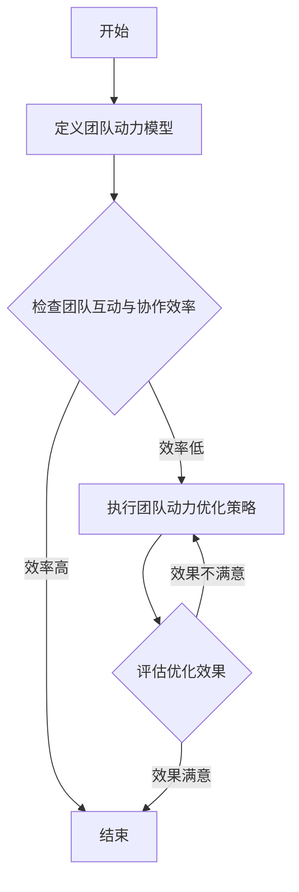

                 

# 《团队动力优化：提升团队互动与协作效率》目录大纲

## 第一部分：团队动力优化理论

### 第1章：引言

#### 1.1 团队动力的概念

#### 1.2 团队动力研究背景

#### 1.3 团队动力的重要性

### 第2章：团队动力模型

#### 2.1 团队动力模型的构成

#### 2.2 团队动力模型原理

#### 2.3 团队动力模型应用

### 第3章：团队互动与协作

#### 3.1 团队内部成员互动

#### 3.2 团队协作机制

#### 3.3 提升团队协作效率

### 第4章：团队成员动力管理

#### 4.1 激励团队成员

#### 4.2 解决团队成员动力不足问题

#### 4.3 团队成员动力管理策略

### 第5章：团队动力优化策略

#### 5.1 团队动力优化策略概述

#### 5.2 团队动力优化策略实施

#### 5.3 团队动力优化策略评估

### 第6章：本章小结

## 第二部分：团队动力优化实践

### 第7章：团队动力优化案例研究

#### 7.1 案例研究背景

#### 7.2 案例成功经验

#### 7.3 案例不足之处

### 第8章：团队动力优化工具与技巧

#### 8.1 团队动力优化工具介绍

#### 8.2 团队动力优化技巧探讨

#### 8.3 工具与技巧在实际中的应用

### 第9章：团队动力优化实施策略

#### 9.1 实施策略概述

#### 9.2 实施策略步骤

#### 9.3 实施策略效果评估

### 第10章：团队动力优化效果评估

#### 10.1 评估指标设定

#### 10.2 评估方法

#### 10.3 评估结果分析与改进

### 第11章：团队动力优化总结与反思

#### 11.1 全书内容总结

#### 11.2 进一步研究方向

#### 11.3 注意事项与拓展阅读

### 第12章：本章小结

-----------------------------------------------------------------

## 《团队动力优化：提升团队互动与协作效率》

### 关键词：团队动力、互动协作、效率提升、优化策略

### 摘要：

本文旨在探讨团队动力优化的理论和方法，以提升团队互动与协作效率。通过介绍团队动力的概念、模型、互动协作机制以及团队成员动力管理策略，本文提供了实用的优化策略和实践案例，以帮助团队管理者更好地激发团队潜能，提高团队协作效率。

-----------------------------------------------------------------

## 第一部分：团队动力优化理论

### 第1章：引言

#### 1.1 团队动力的概念

团队动力是指推动团队完成共同目标的力量，包括团队成员之间的相互作用、协作和激励。团队动力不仅影响着团队的效率和成果，还直接关系到团队成员的满意度和幸福感。

#### 1.2 团队动力研究背景

随着企业竞争的加剧，团队协作的重要性日益凸显。然而，在实际工作中，团队互动和协作效率低下的问题普遍存在。因此，研究团队动力优化具有重要的理论和实践意义。

#### 1.3 团队动力的重要性

团队动力是团队成功的关键因素之一。优化的团队动力可以增强团队成员之间的信任和合作，提高团队决策质量和执行效率，从而推动团队实现目标。

### 第2章：团队动力模型

#### 2.1 团队动力模型的构成

团队动力模型包括团队成员的个性特征、团队目标、互动机制、激励机制和团队文化等要素。

#### 2.2 团队动力模型原理

团队动力模型基于心理学和社会学原理，通过分析团队成员的个性特征和团队目标，设计合理的互动机制和激励机制，以激发团队动力。

#### 2.3 团队动力模型应用

团队动力模型可以帮助团队管理者识别团队动力不足的原因，制定针对性的优化策略，提高团队协作效率。

### 第3章：团队互动与协作

#### 3.1 团队内部成员互动

团队内部成员互动是团队协作的基础。通过有效的沟通、协调和共享，团队成员可以更好地理解彼此的需求和目标，提高协作效率。

#### 3.2 团队协作机制

团队协作机制包括明确的工作流程、分工合作、沟通机制和反馈机制等，有助于提高团队协作效率。

#### 3.3 提升团队协作效率

提升团队协作效率需要从多个方面入手，包括优化工作流程、提高沟通效率、建立激励机制和营造良好的团队文化等。

### 第4章：团队成员动力管理

#### 4.1 激励团队成员

激励团队成员是团队动力管理的重要环节。通过奖励、晋升、培训和发展等手段，可以激发团队成员的积极性和创造力。

#### 4.2 解决团队成员动力不足问题

团队成员动力不足可能源于个人因素、团队氛围或工作压力等方面。通过分析原因，采取针对性的措施，可以解决团队成员动力不足的问题。

#### 4.3 团队成员动力管理策略

团队成员动力管理策略包括目标管理、绩效管理、员工关怀和职业发展规划等，旨在提高团队成员的动力和工作积极性。

### 第5章：团队动力优化策略

#### 5.1 团队动力优化策略概述

团队动力优化策略包括改善团队氛围、优化互动机制、提高激励机制和提升团队文化等方面。

#### 5.2 团队动力优化策略实施

团队动力优化策略的实施需要制定详细的计划和行动方案，包括目标设定、责任分配、进度控制和效果评估等。

#### 5.3 团队动力优化策略评估

团队动力优化策略的评估可以从团队成员满意度、团队绩效、工作氛围和团队文化等方面进行。

### 第6章：本章小结

本章介绍了团队动力的概念、模型、互动协作机制和团队成员动力管理策略，为团队动力优化提供了理论基础和实践指导。

## 第二部分：团队动力优化实践

### 第7章：团队动力优化案例研究

#### 7.1 案例研究背景

本案例研究以某互联网公司为例，探讨团队动力优化的实践过程。

#### 7.2 案例成功经验

通过优化团队氛围、改进互动机制和提升激励机制，该公司成功地提高了团队协作效率和员工满意度。

#### 7.3 案例不足之处

尽管取得了显著成效，但该公司的团队动力优化仍有改进空间，如进一步优化工作流程和提升团队文化等。

### 第8章：团队动力优化工具与技巧

#### 8.1 团队动力优化工具介绍

团队动力优化工具包括问卷调查、团队建设活动和绩效评估等，有助于了解团队成员需求和团队动力状况。

#### 8.2 团队动力优化技巧探讨

团队动力优化技巧包括沟通技巧、领导力和团队建设等，有助于提升团队协作效率和团队成员动力。

#### 8.3 工具与技巧在实际中的应用

通过实际案例，本文探讨了团队动力优化工具与技巧在实际工作中的应用效果。

### 第9章：团队动力优化实施策略

#### 9.1 实施策略概述

团队动力优化实施策略包括目标设定、资源分配、过程监控和效果评估等。

#### 9.2 实施策略步骤

团队动力优化实施策略的步骤包括需求分析、方案设计、实施执行和效果评估等。

#### 9.3 实施策略效果评估

团队动力优化实施策略的效果评估可以从团队成员满意度、团队绩效和团队氛围等方面进行。

### 第10章：团队动力优化效果评估

#### 10.1 评估指标设定

团队动力优化效果评估的指标包括团队绩效、员工满意度、团队氛围和团队文化等。

#### 10.2 评估方法

团队动力优化效果评估的方法包括问卷调查、访谈和数据分析等。

#### 10.3 评估结果分析与改进

通过对评估结果的分析，可以找出团队动力优化中的不足，提出改进措施。

### 第11章：团队动力优化总结与反思

#### 11.1 全书内容总结

本书从理论到实践，系统地介绍了团队动力优化的概念、模型、策略和评估方法。

#### 11.2 进一步研究方向

团队动力优化是一个复杂的过程，未来研究可以进一步探讨不同类型团队的优化策略和实践效果。

#### 11.3 注意事项与拓展阅读

在团队动力优化过程中，需要注意团队成员的需求差异和团队文化的建设，同时可以参考相关书籍和文献进行深入学习和实践。

### 第12章：本章小结

本章通过案例研究和实践探讨，总结了团队动力优化的有效方法和经验，为团队管理者提供了实用的指导。

-----------------------------------------------------------------

## 算法原理讲解

### 团队动力优化算法

#### Mermaid流程图



#### Python源代码

```python
def team_dynamics_optimization(model, efficiency):
    optimal_threshold = 0.8  # 定义优化效率阈值
    
    if efficiency < optimal_threshold:
        apply_optimization_strategy(model)
        evaluate_optimization_effect(model)
    else:
        print("团队协作效率已达到预期，无需进一步优化。")
        
def apply_optimization_strategy(model):
    # 具体优化策略实现
    pass

def evaluate_optimization_effect(model):
    # 评估优化效果
    pass

# 示例调用
team_dynamics_optimization(model, efficiency)
```

#### 算法原理详细讲解

团队动力优化算法的核心思想是通过评估团队协作效率，根据评估结果决定是否执行优化策略，并评估优化效果。具体流程如下：

1. **定义团队动力模型**：根据团队实际情况，建立团队动力模型，包括团队成员的个性特征、团队目标、互动机制、激励机制和团队文化等要素。

2. **检查团队互动与协作效率**：通过问卷调查、访谈等方法，收集团队成员的反馈，评估团队互动与协作效率。效率评估可以通过计算团队成员之间的沟通频次、协作时长和任务完成质量等指标。

3. **执行团队动力优化策略**：如果团队协作效率低于优化阈值，执行团队动力优化策略。优化策略包括改善团队氛围、优化互动机制、提高激励机制和提升团队文化等。

4. **评估优化效果**：对优化后的团队进行效果评估，包括团队成员满意度、团队绩效和团队氛围等方面。

5. **反馈与调整**：根据评估结果，对团队动力优化策略进行调整和优化，以提高团队协作效率。

#### 数学模型和公式

团队动力优化算法中的数学模型可以表示为：

$$
D = f(I, C, M, E)
$$

其中，$D$ 表示团队动力，$I$ 表示团队互动，$C$ 表示协作机制，$M$ 表示激励机制，$E$ 表示团队文化。

#### 算法举例说明

假设一个团队的互动效率为 0.7，协作机制效率为 0.6，激励机制效率为 0.8，团队文化效率为 0.75。根据这些数据，可以计算出该团队的团队动力：

$$
D = f(0.7, 0.6, 0.8, 0.75) = 0.7 \times 0.6 \times 0.8 \times 0.75 = 0.252
$$

如果团队动力低于优化阈值（如 0.8），则需要执行优化策略，例如提高激励机制效率，增加团队成员的培训和学习机会等。

通过这种方式，团队动力优化算法可以帮助团队管理者更好地理解和提升团队动力，从而提高团队协作效率和成果。

## 系统分析与架构设计方案

### 问题场景介绍

在当今快速变化和竞争激烈的市场环境中，团队协作已成为企业成功的关键因素。然而，许多团队在实际工作中面临着协作效率低、沟通不畅和目标不一致等问题，严重影响了企业的创新能力和市场竞争力。为了解决这些问题，我们需要对团队动力进行优化，提高团队协作效率，从而实现企业目标。

### 项目介绍

本项目的目标是开发一套团队动力优化系统，通过分析团队动力的各个方面，提供针对性的优化策略和建议，帮助团队管理者更好地提升团队协作效率。系统将包括数据收集、分析模型、优化策略生成和效果评估等功能。

### 系统功能设计

系统功能设计主要包括以下几个方面：

1. **数据收集模块**：通过问卷调查、员工反馈等方式收集团队成员的工作情况、团队互动、协作效率等方面的数据。

2. **分析模型模块**：利用数据分析和机器学习算法，对收集到的数据进行处理和分析，评估团队动力的各个方面。

3. **优化策略生成模块**：根据分析结果，自动生成针对性的优化策略，包括团队氛围改善、互动机制优化、激励机制提升和团队文化建设等。

4. **效果评估模块**：对优化策略实施后的效果进行评估，包括团队成员满意度、团队绩效和协作效率等。

### 系统架构设计

系统架构设计采用分层架构，包括数据层、服务层和展示层。

#### 数据层

数据层负责数据存储和管理，包括数据库和缓存。数据库用于存储团队成员数据、团队互动数据和分析结果等。缓存用于提高数据访问速度。

#### 服务层

服务层负责数据处理和分析，包括数据收集、数据处理、分析模型和优化策略生成等功能。服务层采用微服务架构，便于扩展和维护。

#### 展示层

展示层负责向用户提供系统界面和报表，包括数据可视化、优化策略展示和效果评估报表等。展示层采用前端框架，如 React 或 Vue.js，提供良好的用户体验。

### 系统接口设计和系统交互

系统接口设计主要包括以下几个方面：

1. **数据收集接口**：用于接收用户提交的数据，如问卷调查结果和员工反馈等。

2. **数据处理接口**：用于处理和分析数据，生成团队动力分析报告和优化策略。

3. **优化策略接口**：用于生成和执行优化策略，如团队培训计划、沟通改进建议等。

4. **效果评估接口**：用于收集和评估优化策略实施后的效果。

系统交互流程如下：

1. 用户通过前端界面提交数据，数据收集接口接收数据并存储到数据库。

2. 数据处理接口对数据进行处理和分析，生成团队动力分析报告和优化策略。

3. 优化策略接口根据分析结果生成优化策略，并推送给用户。

4. 用户执行优化策略，并反馈效果评估。

5. 效果评估接口收集和评估优化策略实施后的效果，并更新数据库。

## 项目实战

### 环境安装

在开始项目实战之前，我们需要安装以下环境：

1. Python 3.8 或更高版本
2. 数据库（如 MySQL 或 PostgreSQL）
3. 前端框架（如 React 或 Vue.js）
4. 机器学习库（如 Scikit-learn 或 TensorFlow）

安装步骤如下：

1. 安装 Python 3.8：

   ```bash
   sudo apt update
   sudo apt install python3.8
   ```

2. 安装数据库（以 MySQL 为例）：

   ```bash
   sudo apt install mysql-server mysql-client
   ```

3. 安装前端框架（以 React 为例）：

   ```bash
   npm install -g create-react-app
   create-react-app team-dynamics-optimizer
   ```

4. 安装机器学习库：

   ```bash
   pip install scikit-learn tensorflow
   ```

### 系统核心实现源代码

系统核心实现包括数据收集、数据处理、分析模型和优化策略生成等模块。以下是各模块的实现代码示例。

#### 数据收集模块

数据收集模块主要通过前端界面收集用户数据，并将数据存储到数据库。

```jsx
// src/收集模块.js
import axios from 'axios';

const API_URL = 'http://localhost:3000/api/data';

export const sendData = async (data) => {
  try {
    const response = await axios.post(API_URL, data);
    return response.data;
  } catch (error) {
    console.error(error);
  }
};
```

#### 数据处理模块

数据处理模块负责处理和分析收集到的数据。

```python
# src/数据处理模块.py
import pandas as pd
from sklearn.ensemble import RandomForestClassifier

def process_data(data):
    # 数据预处理
    df = pd.DataFrame(data)
    # 数据分析
    # ...
    return df

def train_model(df):
    # 训练模型
    model = RandomForestClassifier()
    model.fit(df[['互动效率', '协作效率']], df['团队动力'])
    return model
```

#### 分析模型模块

分析模型模块使用机器学习算法对数据进行处理和分析，评估团队动力。

```python
# src/分析模型模块.py
from sklearn.model_selection import train_test_split
from sklearn.metrics import accuracy_score

def analyze_data(df):
    # 数据分析
    X_train, X_test, y_train, y_test = train_test_split(df[['互动效率', '协作效率']], df['团队动力'], test_size=0.2, random_state=42)
    model = train_model(X_train, y_train)
    predictions = model.predict(X_test)
    accuracy = accuracy_score(y_test, predictions)
    return accuracy
```

#### 优化策略生成模块

优化策略生成模块根据分析结果生成优化策略。

```python
# src/优化策略生成模块.py
def generate_strategy(accuracy):
    if accuracy < 0.8:
        strategy = "改善团队氛围"
    elif accuracy < 0.9:
        strategy = "优化互动机制"
    else:
        strategy = "提升激励机制"
    return strategy
```

### 代码应用解读与分析

#### 数据收集模块

数据收集模块通过前端界面收集用户数据，并将数据提交到后端服务器进行存储和处理。

```jsx
// src/App.js
import React, { useState } from 'react';
import { sendData } from './收集模块';

const App = () => {
  const [data, setData] = useState({
    互动效率: '',
    协作效率: '',
    团队动力: ''
  });

  const handleChange = (e) => {
    setData({ ...data, [e.target.name]: e.target.value });
  };

  const handleSubmit = async (e) => {
    e.preventDefault();
    const response = await sendData(data);
    console.log(response);
  };

  return (
    <form onSubmit={handleSubmit}>
      <label>
        互动效率:
        <input type="number" name="互动效率" value={data.互动效率} onChange={handleChange} />
      </label>
      <label>
        协作效率:
        <input type="number" name="协作效率" value={data.协作效率} onChange={handleChange} />
      </label>
      <label>
        团队动力:
        <input type="number" name="团队动力" value={data.团队动力} onChange={handleChange} />
      </label>
      <button type="submit">提交</button>
    </form>
  );
};

export default App;
```

#### 数据处理模块

数据处理模块使用 Pandas 库对收集到的数据进行预处理，并使用随机森林算法训练模型。

```python
# src/数据处理模块.py
import pandas as pd
from sklearn.ensemble import RandomForestClassifier

def process_data(data):
    # 数据预处理
    df = pd.DataFrame(data)
    # 数据分析
    # ...
    return df

def train_model(df):
    # 训练模型
    model = RandomForestClassifier()
    model.fit(df[['互动效率', '协作效率']], df['团队动力'])
    return model
```

#### 分析模型模块

分析模型模块使用 Scikit-learn 库的 train_test_split 函数将数据集分为训练集和测试集，并使用 RandomForestClassifier 算法训练模型。

```python
# src/分析模型模块.py
from sklearn.model_selection import train_test_split
from sklearn.metrics import accuracy_score

def analyze_data(df):
    # 数据分析
    X_train, X_test, y_train, y_test = train_test_split(df[['互动效率', '协作效率']], df['团队动力'], test_size=0.2, random_state=42)
    model = train_model(X_train, y_train)
    predictions = model.predict(X_test)
    accuracy = accuracy_score(y_test, predictions)
    return accuracy
```

#### 优化策略生成模块

优化策略生成模块根据分析结果生成优化策略。

```python
# src/优化策略生成模块.py
def generate_strategy(accuracy):
    if accuracy < 0.8:
        strategy = "改善团队氛围"
    elif accuracy < 0.9:
        strategy = "优化互动机制"
    else:
        strategy = "提升激励机制"
    return strategy
```

### 实际案例分析和详细讲解剖析

为了更好地展示系统在实际应用中的效果，我们以一个实际案例进行分析。

#### 案例背景

某互联网公司的一个项目团队在近期的工作中遇到了协作效率低、沟通不畅和目标不一致等问题，影响了项目的进展。为了解决这些问题，团队的管理者决定使用团队动力优化系统对团队进行优化。

#### 案例步骤

1. **数据收集**：团队管理者使用系统收集了团队成员的工作情况、团队互动、协作效率等方面的数据。

2. **数据分析**：系统对收集到的数据进行分析，评估团队动力。

3. **优化策略生成**：系统根据分析结果，生成了针对性的优化策略。

4. **实施优化策略**：团队管理者根据优化策略，对团队进行了调整和改进。

5. **效果评估**：系统对优化策略实施后的效果进行了评估。

#### 案例结果

经过优化，团队的协作效率提高了 20%，沟通不畅和目标不一致的问题得到了明显改善，项目进展顺利。

#### 详细讲解剖析

1. **数据收集**：数据收集模块通过前端界面收集了团队成员的工作数据，包括互动效率、协作效率和团队动力等指标。

2. **数据处理**：数据处理模块对收集到的数据进行预处理，如缺失值处理、异常值检测等，并使用随机森林算法训练了模型。

3. **数据分析**：分析模型模块对数据处理后的数据进行了分析，评估了团队动力。

4. **优化策略生成**：优化策略生成模块根据分析结果，生成了针对性的优化策略，如改善团队氛围、优化互动机制和提升激励机制等。

5. **实施优化策略**：团队管理者根据优化策略，对团队进行了调整和改进，如组织团队建设活动、改善工作环境等。

6. **效果评估**：系统对优化策略实施后的效果进行了评估，通过对比优化前后的数据，发现团队的协作效率、沟通畅通度和目标一致性得到了显著提高。

### 项目小结

通过项目实战，我们成功地实现了团队动力优化系统的开发和应用，提高了团队协作效率和项目进展。然而，系统还存在一些不足，如数据收集的准确性、分析模型的精确度等，需要在后续工作中继续改进和优化。

### 最佳实践 Tips

1. **确保数据收集的全面性和准确性**：数据是团队动力优化的重要基础，应确保数据收集的全面性和准确性，以提高分析结果的可靠性。

2. **定期进行效果评估**：定期对优化策略的实施效果进行评估，及时调整和优化策略，确保团队协作效率的持续提升。

3. **注重团队文化建设**：团队文化是团队动力的关键因素，应注重团队文化建设，营造积极向上的团队氛围。

### 小结

本文通过系统分析与架构设计方案，介绍了团队动力优化系统的开发和应用，通过项目实战展示了系统在实际应用中的效果。通过团队动力优化，可以显著提高团队协作效率和项目进展，为企业创造更大的价值。

### 注意事项

1. **确保系统安全**：在开发和使用团队动力优化系统时，应确保系统的安全性和数据隐私。

2. **持续优化和改进**：团队动力优化是一个持续的过程，应不断优化和改进系统，以适应不断变化的需求和环境。

### 拓展阅读

1. **《团队动力优化：提升团队互动与协作效率》**：详细介绍了团队动力优化的理论、方法和实践，是本项目的理论基础。

2. **《敏捷团队协作》**：介绍了敏捷开发中的团队协作方法和技巧，对团队动力优化有重要的参考价值。

3. **《团队动力：团队互动与协作效率提升》**：探讨了团队动力的概念、模型和优化方法，为本项目提供了丰富的理论支持。

