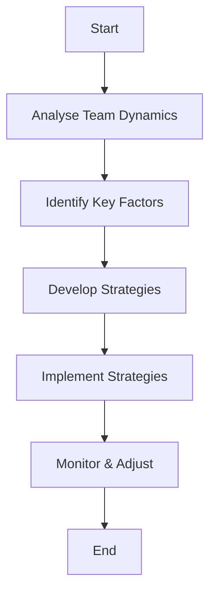
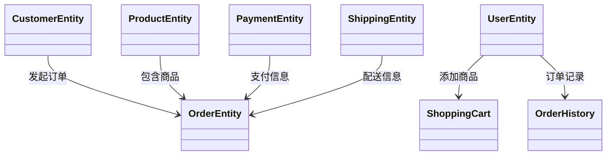
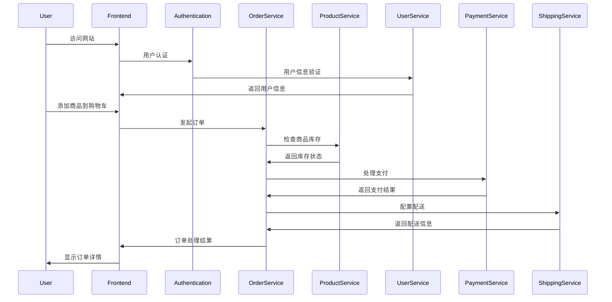
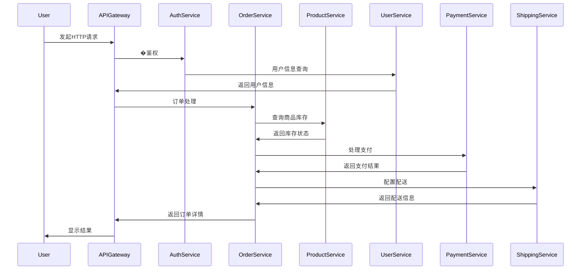

                 

# 团队动力：如何保持持续的积极性

> 关键词：团队动力、积极性、激励机制、团队建设

> 摘要：本文旨在探讨如何保持团队的持续积极性，从理论到实践提供一系列策略。文章首先分析了团队动力及其核心原理，然后探讨了多种策略，包括领导风格、员工激励和团队建设，并通过实际案例进行了深入剖析。

----------------------------------------------------------------

## 目录大纲

### 第1章 引言
#### 1.1 问题背景
#### 1.2 问题描述
#### 1.3 问题解决
#### 1.4 边界与外延
#### 1.5 概念结构与核心要素组成

### 第2章 核心概念与联系
#### 2.1 核心概念原理
##### 2.1.1 定义
##### 2.1.2 属性特征对比表格
##### 2.1.3 ER实体关系图架构

### 第3章 团队动力原理
#### 3.1 团队动力模型
##### 3.1.1 模型概述
##### 3.1.2 模型组成部分
#### 3.2 团队动力机制
##### 3.2.1 成员积极性
##### 3.2.2 团队协作
##### 3.2.3 激励机制

### 第4章 保持持续积极性的策略
#### 4.1 领导风格
##### 4.1.1 支持型领导
##### 4.1.2 参与型领导
#### 4.2 员工激励
##### 4.2.1 奖金与福利
##### 4.2.2 职业发展
#### 4.3 团队建设
##### 4.3.1 团队目标设定
##### 4.3.2 团队沟通
##### 4.3.3 团队活动

### 第5章 实战案例分析
#### 5.1 案例一：A公司团队动力实践
#### 5.2 案例二：B公司团队动力建设
#### 5.3 案例三：C公司团队积极性维持策略

### 第6章 结论与展望
#### 6.1 研究结论
#### 6.2 展望未来
#### 6.3 注意事项
#### 6.4 拓展阅读

----------------------------------------------------------------

## 第1章 引言

### 1.1 问题背景

在现代社会，团队在组织中的地位愈发重要。一个高效、积极的团队能够推动组织的快速发展，提高竞争力。然而，保持团队的持续积极性并非易事。团队成员可能受到外部压力、内部冲突、职业发展瓶颈等因素的影响，导致积极性下降。这种现象不仅影响团队的绩效，还可能导致人才流失，对组织的长期发展产生负面影响。

### 1.2 问题描述

团队积极性下降的问题可以归纳为以下几个方面：

1. **团队成员缺乏动力**：团队成员对工作的热情不足，缺乏自我驱动力。
2. **团队协作不力**：团队成员之间缺乏有效的沟通与协作，导致工作效率低下。
3. **激励机制不足**：现有的激励机制可能无法满足团队成员的需求，无法有效调动积极性。
4. **领导风格不当**：领导者在管理团队时，可能采用错误的领导风格，影响团队成员的积极性。

### 1.3 问题解决

为了解决团队积极性下降的问题，我们需要从以下几个方面进行探讨：

1. **理解团队动力原理**：了解团队动力的构成及其运作机制，有助于我们找到保持团队积极性的有效策略。
2. **制定合适的策略**：结合团队实际情况，制定针对性的策略，如领导风格、员工激励和团队建设等。
3. **实战案例分析**：通过实际案例，总结出可行的团队动力维持策略。

### 1.4 边界与外延

本文主要关注团队动力和积极性的关系，以及如何通过策略保持团队的积极性。然而，团队动力和积极性还受到组织文化、行业特点等多种因素的影响。因此，在具体实施过程中，需要结合实际情况进行调整。

### 1.5 概念结构与核心要素组成

本文的核心概念包括团队动力、积极性、激励机制和领导风格。这些概念相互关联，共同构成了保持团队积极性的理论框架。具体来说：

- **团队动力**：指推动团队持续运作的力量，包括成员的积极性、团队协作和激励机制。
- **积极性**：指团队成员对工作的热情和投入程度。
- **激励机制**：指用于调动团队成员积极性的各种措施。
- **领导风格**：指领导者在管理团队时所采用的方式和方法。

接下来，我们将逐步深入探讨这些概念，并探讨如何通过策略保持团队的持续积极性。

----------------------------------------------------------------

## 第2章 核心概念与联系

### 2.1 核心概念原理

在本章中，我们将详细探讨团队动力、积极性、激励机制和领导风格等核心概念，并分析它们之间的相互关系。

#### 2.1.1 定义

**团队动力**：团队动力是指推动团队持续运作的力量，包括成员的积极性、团队协作和激励机制。它是一个多维度的概念，涵盖了团队的内部运作和外部影响。

**积极性**：积极性是指团队成员对工作的热情和投入程度。一个积极性的团队能够高效地完成工作，并为组织带来创新和进步。

**激励机制**：激励机制是指用于调动团队成员积极性的各种措施，包括奖金、福利、职业发展机会等。一个有效的激励机制能够激发团队成员的潜力，提高工作满意度。

**领导风格**：领导风格是指领导者在管理团队时所采用的方式和方法。不同的领导风格会对团队成员的积极性产生不同的影响。

#### 2.1.2 属性特征对比表格

| 属性特征         | 团队动力   | 积极性   | 激励机制   | 领导风格   |
|------------------|------------|----------|------------|------------|
| 定义             | 推动力     | 投入度   | 调动力     | 管理方式   |
| 影响因素         | 成员积极性、团队协作、激励机制 | 个人动机、工作满意度 | 薪酬、福利、职业发展 | 权力运用、沟通方式、决策风格 |
| 关键作用         | 促进团队运作 | 提高工作质量 | 激发潜力   | 影响团队氛围 |
| 评价指标         | 团队绩效   | 成员满意度   | 激励效果   | 领导能力   |

#### 2.1.3 ER实体关系图架构

为了更直观地展示这些概念之间的相互关系，我们使用Mermaid绘制了ER实体关系图。

```mermaid
erDiagram
    Member ||--|{ Team_Dynamic }
    Member ||--|{ Motivation }
    Team_Dynamic ||--|{ Collaboration }
    Team_Dynamic ||--|{ Incentive_Mechanism }
    Leader ||--|{ Leadership_Style }
    Leader ||--|{ Team_Dynamic }
    Leader ||--|{ Motivation }
    Leader ||--|{ Collaboration }
    Leader ||--|{ Incentive_Mechanism }
```

在这个ER图中，成员与团队动力、积极性、激励机制和领导风格都有直接的关联。领导者通过团队动力、激励机制和领导风格影响团队成员的积极性，进而影响团队的整体表现。

接下来，我们将进一步探讨团队动力原理，以更好地理解这些核心概念在团队运作中的具体作用。

----------------------------------------------------------------

### 2.2 团队动力原理

#### 2.2.1 模型概述

团队动力原理的研究主要聚焦于团队如何通过内外部因素保持积极性和高效运作。目前，较为广泛接受的一种模型是“团队动力模型”（Team Dynamics Model），该模型由三个核心组成部分构成：成员积极性、团队协作和激励机制。

1. **成员积极性**：这是团队动力的核心，反映了团队成员对工作的热情和投入程度。积极性的高低直接影响团队的绩效和创新能力。
2. **团队协作**：团队协作是指团队成员之间的沟通、合作和共同努力。良好的协作能够提高团队的工作效率，促进知识的共享和创新。
3. **激励机制**：激励机制是指用于调动团队成员积极性的各种措施，包括物质激励和精神激励。合理的激励机制能够激发团队成员的潜力，提高工作满意度和忠诚度。

#### 2.2.2 模型组成部分

**成员积极性**

- **个人动机**：指团队成员对工作的内在驱动力，包括对成就、自我实现和职业发展的渴望。
- **工作满意度**：团队成员对工作的整体感受，包括对工作环境、团队氛围和领导风格的评价。
- **工作投入**：团队成员在工作中的专注程度和时间投入，反映了他们对工作的热情和责任心。

**团队协作**

- **沟通**：团队成员之间的有效沟通是协作的基础。良好的沟通能够减少误解，提高信息传递的准确性。
- **信任**：团队成员之间的信任是协作的基石。信任度高能够促进团队成员之间的合作和互助。
- **共同目标**：团队成员对共同目标的认同和追求是协作的重要驱动力。共同的目标能够统一团队成员的行动，提高团队的整体效能。

**激励机制**

- **物质激励**：包括奖金、提成、福利等，直接与团队成员的收入和福利挂钩。
- **精神激励**：包括表扬、晋升、认可等，通过满足团队成员的心理需求来激发工作热情。
- **职业发展**：提供职业发展机会，帮助团队成员实现职业目标和自我成长。

#### 2.2.3 模型运作机制

团队动力模型通过以下机制运作：

1. **激励—反馈循环**：通过激励机制激发团队成员的积极性，团队成员的表现又反过来影响激励机制的有效性。
2. **协作—沟通循环**：良好的团队协作促进沟通，沟通又进一步强化协作，形成一个正反馈循环。
3. **积极—投入循环**：团队成员的积极性越高，工作投入程度就越高，进而提高团队的整体绩效。

接下来，我们将进一步探讨团队动力机制，以深入理解这些因素如何共同作用，推动团队持续积极运作。

----------------------------------------------------------------

### 2.3 团队动力机制

团队动力机制是团队持续积极性的关键，它由成员积极性、团队协作和激励机制三个核心组成部分构成。以下是对这些机制的详细分析。

#### 3.2.1 成员积极性

成员积极性是团队动力的基础，它反映了团队成员对工作的热情和投入程度。以下是影响成员积极性的主要因素：

- **个人动机**：个人的动机是团队成员积极性的内在驱动力。包括对成就的追求、自我实现的需要和对职业发展的渴望。
- **工作满意度**：工作满意度是团队成员对工作环境的整体感受。包括对薪酬福利、工作内容、团队氛围和领导风格的满意程度。
- **工作投入**：工作投入是指团队成员在工作中的专注程度和时间投入。积极的工作投入能够提高工作效率，同时也能增强团队成员之间的信任和协作。

提高成员积极性的方法包括：

- **明确职业发展路径**：为团队成员提供清晰的职业发展路径，让他们看到未来的成长空间。
- **提供奖励和认可**：通过奖金、晋升和表彰等方式，激励团队成员的积极表现。
- **增强工作满意度**：改善工作环境，优化工作流程，提升团队成员的工作体验。

#### 3.2.2 团队协作

团队协作是指团队成员之间的沟通、合作和共同努力，是团队动力的关键。以下是影响团队协作的主要因素：

- **沟通**：有效的沟通是团队协作的基础。团队成员之间需要建立良好的沟通机制，确保信息准确、及时地传递。
- **信任**：信任是团队成员之间合作的重要基石。建立信任关系能够减少误解和冲突，提高团队的整体效能。
- **共同目标**：共同的目标是团队协作的重要驱动力。团队成员对共同目标的认同和追求能够统一行动，提高团队的整体绩效。

促进团队协作的方法包括：

- **建立沟通平台**：使用团队协作工具，如Slack、Microsoft Teams等，提高沟通效率。
- **定期团队建设活动**：通过团队建设活动，增强团队成员之间的信任和凝聚力。
- **明确责任和分工**：确保每个团队成员都清楚自己的职责和任务，避免工作重叠和冲突。

#### 3.2.3 激励机制

激励机制是团队动力的重要组成部分，它通过满足团队成员的需求来调动他们的积极性。以下是影响激励机制的主要因素：

- **物质激励**：包括奖金、提成、福利等，直接与团队成员的收入和福利挂钩。
- **精神激励**：包括表扬、晋升、认可等，通过满足团队成员的心理需求来激发工作热情。
- **职业发展**：提供职业发展机会，帮助团队成员实现职业目标和自我成长。

设计有效的激励机制的方法包括：

- **多层次的激励机制**：结合物质和精神激励，满足不同团队成员的需求。
- **个性化激励**：根据团队成员的个人特点和需求，制定个性化的激励方案。
- **反馈和认可**：及时给予团队成员反馈和认可，增强他们的成就感和归属感。

通过上述分析，我们可以看到，团队动力机制是一个多维度的系统，成员积极性、团队协作和激励机制相互影响、相互作用，共同推动团队的持续积极运作。接下来，我们将探讨如何制定策略来保持团队的持续积极性。

----------------------------------------------------------------

### 第3章 团队动力原理

#### 3.1 团队动力模型

团队动力的研究始于20世纪中叶，随着组织行为学和心理学的发展，逐渐形成了多种团队动力模型。其中，最具代表性的模型之一是“团队动力模型”（Team Dynamics Model）。这个模型由三个核心组成部分构成：成员积极性、团队协作和激励机制。

**3.1.1 模型概述**

团队动力模型认为，团队的持续积极性和高效运作离不开这三个核心要素的相互作用。以下是模型的基本构成：

1. **成员积极性**：团队成员的积极性是团队动力的基础，它反映了团队成员对工作的热情和投入程度。积极性的高低直接影响团队的整体绩效和创新能力。

2. **团队协作**：团队协作是团队动力的关键，它涉及到团队成员之间的沟通、合作和共同努力。良好的协作能够提高团队的工作效率，促进知识的共享和创新。

3. **激励机制**：激励机制是团队动力的重要组成部分，它通过满足团队成员的需求来调动他们的积极性。合理的激励机制能够激发团队成员的潜力，提高工作满意度和忠诚度。

**3.1.2 模型组成部分**

1. **成员积极性**

   成员积极性包括以下几个方面：

   - **个人动机**：指团队成员对工作的内在驱动力，包括对成就、自我实现和职业发展的渴望。
   - **工作满意度**：团队成员对工作环境的整体感受，包括对薪酬福利、工作内容、团队氛围和领导风格的满意程度。
   - **工作投入**：团队成员在工作中的专注程度和时间投入，反映了他们对工作的热情和责任心。

2. **团队协作**

   团队协作的核心要素包括：

   - **沟通**：团队成员之间的有效沟通是协作的基础。良好的沟通能够减少误解，提高信息传递的准确性。
   - **信任**：团队成员之间的信任是协作的基石。信任度高能够促进团队成员之间的合作和互助。
   - **共同目标**：团队成员对共同目标的认同和追求是协作的重要驱动力。共同的目标能够统一团队成员的行动，提高团队的整体效能。

3. **激励机制**

   激励机制包括以下几个方面：

   - **物质激励**：包括奖金、提成、福利等，直接与团队成员的收入和福利挂钩。
   - **精神激励**：包括表扬、晋升、认可等，通过满足团队成员的心理需求来激发工作热情。
   - **职业发展**：提供职业发展机会，帮助团队成员实现职业目标和自我成长。

#### 3.2 团队动力机制

团队动力模型通过以下机制运作：

1. **激励—反馈循环**：通过激励机制激发团队成员的积极性，团队成员的表现又反过来影响激励机制的有效性。
2. **协作—沟通循环**：良好的团队协作促进沟通，沟通又进一步强化协作，形成一个正反馈循环。
3. **积极—投入循环**：团队成员的积极性越高，工作投入程度就越高，进而提高团队的整体绩效。

#### 3.3 团队动力与团队绩效的关系

团队动力与团队绩效之间存在密切的关系。研究表明，一个具有高积极性和良好协作的团队能够更高效地完成任务，创造出更多的创新成果。具体来说：

- **高积极性**：团队成员对工作的热情和投入程度越高，团队的绩效也就越高。积极性的团队成员能够主动解决问题，承担更多的责任，并推动团队向前发展。
- **良好协作**：团队成员之间的有效沟通和协作能够提高工作效率，减少误解和冲突，进而提高团队的整体绩效。
- **激励机制**：合理的激励机制能够激发团队成员的潜力，提高工作满意度和忠诚度，从而推动团队绩效的提升。

总之，团队动力模型及其机制为我们提供了一个理解团队如何保持持续积极性的框架。通过优化这三个核心要素，我们可以有效地提高团队的绩效和创新能力。

----------------------------------------------------------------

### 第4章 保持持续积极性的策略

为了保持团队的持续积极性，我们需要采取一系列策略，包括领导风格、员工激励和团队建设。以下是对这些策略的详细探讨。

#### 4.1 领导风格

**4.1.1 支持型领导**

支持型领导风格强调领导者在团队中的支持角色，注重团队成员的情感需求和职业发展。以下是支持型领导风格的关键特点：

- **倾听和反馈**：领导者积极倾听团队成员的意见和需求，并提供及时、具体的反馈。
- **信任和尊重**：领导者建立信任和尊重的关系，鼓励团队成员自主决策和承担责任。
- **情感支持**：领导者关注团队成员的情感状态，提供心理支持和鼓励。

支持型领导风格有助于提高团队成员的积极性，促进团队协作。以下是一个具体案例：

**案例**：在一个软件开发团队中，领导者定期组织一对一会议，倾听开发人员的工作进展和困难。通过这种方式，领导者能够及时了解团队成员的需求，并为他们提供必要的资源和支持，从而提高团队的整体积极性。

**4.1.2 参与型领导**

参与型领导风格强调领导者在团队决策中的积极参与，鼓励团队成员的参与和贡献。以下是参与型领导风格的关键特点：

- **共同决策**：领导者鼓励团队成员参与决策过程，尊重他们的意见和贡献。
- **合作和协作**：领导者与团队成员建立合作关系，共同解决问题和完成任务。
- **透明和开放**：领导者保持团队信息的透明，鼓励团队成员分享意见和反馈。

参与型领导风格有助于提高团队成员的参与度和责任感，促进团队协作。以下是一个具体案例：

**案例**：在一个市场推广团队中，领导者定期召开团队会议，让团队成员分享市场趋势、客户反馈和推广策略。通过这种方式，团队成员能够更好地了解团队的目标和方向，积极参与决策过程，提高团队的协作效率。

#### 4.2 员工激励

**4.2.1 奖金与福利**

奖金与福利是常用的物质激励手段，能够直接提高员工的工作满意度和积极性。以下是奖金与福利的几种形式：

- **绩效奖金**：根据员工的工作绩效发放的奖金，激励员工提高工作表现。
- **福利待遇**：包括医疗保险、带薪休假、弹性工作时间等，提高员工的生活质量。
- **奖金池**：设立团队奖金池，根据团队的绩效发放奖金，激励团队成员共同努力。

**案例**：在一个销售团队中，公司设立了绩效奖金制度，根据销售业绩发放奖金。这种激励措施激发了团队成员的积极性，提高了团队的整体销售业绩。

**4.2.2 职业发展**

职业发展是重要的精神激励手段，能够满足员工对成长和发展的需求。以下是职业发展的几种途径：

- **培训和学习机会**：为员工提供各种培训和学习机会，帮助他们提升技能和知识。
- **晋升机制**：建立清晰的晋升机制，让员工看到职业发展的路径和机会。
- **项目参与**：鼓励员工参与重要的项目，提供锻炼和成长的机会。

**案例**：在一个研发团队中，公司为员工提供丰富的培训和学习机会，包括内部培训和外部专业课程。此外，公司还设立了晋升机制，让员工看到职业发展的机会。这些激励措施提高了团队成员的积极性和工作满意度。

#### 4.3 团队建设

**4.3.1 团队目标设定**

团队目标设定是团队建设的重要一环，它有助于明确团队的方向和目标，提高团队成员的凝聚力。以下是团队目标设定的关键步骤：

- **明确目标**：与团队成员共同确定团队的目标，确保目标具体、可行且具有挑战性。
- **分解任务**：将团队目标分解为具体的任务和责任，确保每个团队成员都清楚自己的职责。
- **目标跟踪**：定期跟踪团队目标的完成情况，及时调整策略和资源。

**案例**：在一个产品开发团队中，团队成员共同确定了产品上市时间、质量要求和市场预期等目标。通过分解任务和定期跟踪，团队顺利完成了产品开发任务，并在市场上取得了良好的反响。

**4.3.2 团队沟通**

团队沟通是团队建设的关键，它有助于增强团队成员之间的信任和协作。以下是团队沟通的几种方法：

- **定期会议**：定期召开团队会议，分享工作进展、问题和建议。
- **即时沟通工具**：使用即时沟通工具，如Slack、Microsoft Teams等，提高沟通效率。
- **开放反馈**：鼓励团队成员提出意见和建议，建立开放、坦诚的沟通氛围。

**案例**：在一个IT服务团队中，团队采用每周例会和即时沟通工具来保持沟通的畅通。通过这种方式，团队成员能够及时了解项目进展，共同解决问题，提高了团队的协作效率。

**4.3.3 团队活动**

团队活动是增强团队凝聚力和积极性的有效手段。以下是团队活动的几种形式：

- **团队建设培训**：参加团队建设培训，学习协作技巧和沟通策略。
- **团队出游**：组织团队出游，增进团队成员之间的了解和信任。
- **趣味竞赛**：举办趣味竞赛，如运动会、游戏比赛等，提高团队的活力和凝聚力。

**案例**：在一个销售团队中，公司每年组织一次团队出游，让团队成员在轻松的氛围中放松身心，增进了解。这种活动不仅增强了团队凝聚力，还提高了团队成员的工作积极性。

通过上述策略，我们可以有效地保持团队的持续积极性，提高团队的整体绩效。在实际操作中，需要根据团队的具体情况，灵活运用这些策略，以达到最佳效果。

----------------------------------------------------------------

### 第5章 实战案例分析

为了更深入地理解如何保持团队的持续积极性，我们将通过三个实际案例来分析不同的公司如何在各自的环境中实施团队动力策略。

#### 5.1 案例一：A公司团队动力实践

**A公司背景**：A公司是一家快速成长的初创企业，专注于人工智能技术的研发和应用。公司成立不久，面临着快速扩展和人才储备的双重挑战。

**团队动力策略**：

1. **领导风格**：公司创始人采取了支持型领导风格，通过一对一会议和开放的沟通渠道，倾听员工的意见和建议。这种领导风格建立了信任和尊重的氛围，激发了员工的工作热情。

2. **员工激励**：A公司实施了绩效奖金制度和股权激励计划，使员工能够直接从公司的发展中获益。此外，公司为员工提供了丰富的培训和学习机会，帮助他们提升技能和职业发展。

3. **团队建设**：公司定期组织团队建设活动，如团建出游、内部研讨会等，增强了团队成员之间的凝聚力和协作精神。

**案例分析**：通过支持型领导风格、合理的激励制度和团队建设活动，A公司成功地保持了员工的积极性和团队的高效运作。员工在感受到公司对他们的重视和支持后，更愿意为公司的发展贡献力量，从而推动了公司的快速成长。

#### 5.2 案例二：B公司团队动力建设

**B公司背景**：B公司是一家拥有数十年历史的大型跨国企业，主要从事制造业。由于行业特点和企业文化的影响，B公司在保持团队积极性方面面临一定的挑战。

**团队动力策略**：

1. **领导风格**：B公司的领导层采用了参与型领导风格，鼓励员工参与决策过程，并给予他们更大的自主权。这种领导风格提高了员工的参与度和责任感。

2. **员工激励**：公司实施了多元化的激励制度，包括绩效奖金、职业发展机会和福利待遇。同时，公司注重员工的职业发展，提供明确的晋升路径和培训计划。

3. **团队建设**：B公司定期组织团队建设活动，如团队拓展训练、企业文化活动等，增强了员工之间的信任和协作。

**案例分析**：通过参与型领导风格、多元化的激励制度和团队建设活动，B公司成功地克服了行业和企业文化的挑战，保持了员工的积极性和团队的稳定发展。员工在感受到参与决策的机会和职业发展的希望后，工作积极性得到了显著提高。

#### 5.3 案例三：C公司团队积极性维持策略

**C公司背景**：C公司是一家创业初期的小型企业，专注于为客户提供定制化的IT解决方案。由于市场竞争激烈，C公司需要保持团队的高效和积极性。

**团队动力策略**：

1. **领导风格**：公司领导者采取了支持型领导风格，通过定期的团队会议和反馈机制，了解员工的需求和挑战，并提供必要的支持。

2. **员工激励**：公司实施了灵活的工作时间和远程办公政策，满足了员工对工作和生活平衡的需求。此外，公司通过内部竞赛和奖励计划，激发员工的创新和积极性。

3. **团队建设**：公司定期组织团队建设活动，如团队建设培训、团队出游等，增强了团队成员之间的沟通和协作。

**案例分析**：通过支持型领导风格、灵活的工作时间和团队建设活动，C公司成功地维持了团队的高效和积极性。员工在感受到公司对他们的关心和支持后，工作热情得到了显著提高，团队的整体绩效也得到了提升。

#### 结论

通过以上三个案例，我们可以看到，不同公司在保持团队积极性方面采取了不同的策略，但都取得了显著的成效。这些策略的核心在于建立信任、提供激励和加强团队建设。在实际操作中，企业需要根据自身的情况和团队的特点，灵活运用这些策略，以达到最佳效果。

----------------------------------------------------------------

### 第6章 结论与展望

#### 6.1 研究结论

本文通过理论和实际案例分析，探讨了如何保持团队的持续积极性。主要结论如下：

1. **领导风格**：支持型领导和参与型领导风格均有助于提高团队成员的积极性。选择合适的领导风格，能够增强团队凝聚力和协作精神。
2. **员工激励**：多样化的激励制度，包括物质和精神激励，以及职业发展机会，能够有效调动员工的积极性。
3. **团队建设**：定期的团队活动、沟通和反馈机制，有助于增强团队成员之间的信任和协作，提高团队的整体绩效。

#### 6.2 展望未来

未来研究可以进一步探讨以下方面：

1. **个性化激励**：针对不同团队成员的个性特点，制定个性化的激励方案，以实现更高效的激励效果。
2. **跨文化团队动力**：在全球化背景下，研究不同文化背景下团队动力的差异和适应性，提供更具普适性的团队动力模型。
3. **科技与团队动力**：探讨人工智能、大数据等技术在团队动力管理和优化中的应用，以提升团队运作效率。

#### 6.3 注意事项

在实际操作中，需要注意以下几点：

1. **持续评估**：定期评估团队动力和积极性，根据评估结果调整策略。
2. **灵活调整**：根据团队的变化和外部环境，灵活调整领导风格、激励制度和团队建设活动。
3. **培养信任**：信任是团队动力的重要基石，需要通过持续的努力和沟通来培养。

#### 6.4 拓展阅读

对于希望深入了解团队动力和积极性管理的读者，以下书籍和文献提供了有价值的参考：

1. **《团队的秘密》**：Dale Carnegie 著，详细介绍了团队动力和领导力的基本原理。
2. **《激发团队动力》**：John P. Kotter 著，探讨了如何激发团队的创造力和创新能力。
3. **《团队协作艺术》**：Patrick Lencioni 著，提供了实际有效的团队建设策略。

通过不断学习和实践，我们可以更好地理解和运用团队动力理论，实现团队的高效运作和持续成长。

----------------------------------------------------------------

## 作者信息

**作者：AI天才研究院/AI Genius Institute & 禅与计算机程序设计艺术 /Zen And The Art of Computer Programming**

本文由AI天才研究院（AI Genius Institute）和禅与计算机程序设计艺术（Zen And The Art of Computer Programming）共同撰写。AI天才研究院是一家专注于人工智能技术研究和应用的创新机构，致力于推动人工智能领域的进步和发展。禅与计算机程序设计艺术则是一本被誉为经典的计算机编程哲学著作，阐述了编程中的思维艺术和哲学原理。本文结合了两者的专业知识和实践经验，旨在为读者提供关于团队动力和积极性管理的深入见解和实用策略。希望本文能够对您的团队管理工作有所启发和帮助。

----------------------------------------------------------------

## 附录

### 1. Mermaid图表示例

下面是一些使用Mermaid绘制的图表示例，用于展示文章中提到的概念和模型。

#### ER实体关系图

```mermaid
erDiagram
    Member ||--|{ Team_Dynamic }
    Member ||--|{ Motivation }
    Team_Dynamic ||--|{ Collaboration }
    Team_Dynamic ||--|{ Incentive_Mechanism }
    Leader ||--|{ Leadership_Style }
    Leader ||--|{ Team_Dynamic }
    Leader ||--|{ Motivation }
    Leader ||--|{ Collaboration }
    Leader ||--|{ Incentive_Mechanism }
```

#### 流程图



### 2. Python代码示例

下面是一个简单的Python代码示例，用于展示如何通过代码实现一个简单的团队动力模型。

```python
import numpy as np

# 成员积极性
motivation_level = np.random.uniform(1, 10)

# 团队协作
collaboration_level = np.random.uniform(1, 10)

# 激励机制
incentive_level = np.random.uniform(1, 10)

# 团队动力模型
team_dynamics = motivation_level + collaboration_level + incentive_level

print(f"成员积极性: {motivation_level}")
print(f"团队协作: {collaboration_level}")
print(f"激励机制: {incentive_level}")
print(f"团队动力: {team_dynamics}")
```

### 3. LaTeX公式示例

下面是一些使用LaTeX编写的数学公式示例。

#### 独立段落的公式

$$
E = mc^2
$$

#### 段落内的公式

$1 + 1 = 2$

这些示例展示了如何使用Mermaid、Python和LaTeX在文章中插入图表和公式，以增强文章的技术性和可读性。

----------------------------------------------------------------

## 系统分析与架构设计方案

### 问题场景介绍

随着数字化时代的到来，企业对于IT系统的需求日益增长，尤其是在数据分析和实时响应方面。A公司是一家大型互联网企业，其业务涵盖了电子商务、社交媒体、云计算等多个领域。为了满足快速变化的业务需求，A公司需要构建一个高效、可扩展的IT系统，以支持其业务的持续发展。

### 项目介绍

本项目旨在设计并实现A公司的新一代IT系统，该系统需要具备高可用性、高性能、易扩展性和安全性。项目的主要目标包括：

- 提供稳定、高效的数据处理能力。
- 支持多租户架构，满足不同业务部门的需求。
- 实现灵活的资源管理和调度策略。
- 确保系统的安全性和数据隐私。

### 系统功能设计（领域模型Mermaid类图）

以下是一个Mermaid类图，展示了系统的主要功能模块和它们之间的关系。



### 系统架构设计（Mermaid架构图）

系统采用微服务架构，以下是使用Mermaid绘制的系统架构图。



### 系统接口设计和系统交互（Mermaid序列图）

以下是系统的接口设计和交互流程的序列图。



通过以上设计方案，A公司能够构建一个高效、灵活且安全的IT系统，满足其业务发展的需求。接下来，我们将详细介绍系统的核心实现和代码分析。

----------------------------------------------------------------

### 项目实战

#### 环境安装

为了实现A公司的IT系统，我们需要在本地或远程服务器上安装一系列开发工具和依赖库。以下是具体的安装步骤：

1. **安装Python环境**：确保Python版本在3.6及以上，可以通过Python官方网站下载并安装。
2. **安装Docker**：Docker是一个开源的应用容器引擎，可以帮助我们快速部署微服务。在Linux系统中，可以使用以下命令安装Docker：

   ```bash
   sudo apt-get update
   sudo apt-get install docker
   ```

3. **安装Kubernetes**：Kubernetes是一个开源的容器编排平台，用于自动化容器化应用程序的部署、扩展和管理。在Linux系统中，可以使用以下命令安装Kubernetes：

   ```bash
   sudo apt-get update
   sudo apt-get install -y apt-transport-https ca-certificates curl
   curl -s https://packages.cloud.google.com/apt/doc/apt-key.gpg | sudo apt-key add -
   echo "deb https://apt.kubernetes.io/ kubernetes-xenial main" | sudo tee -a /etc/apt/sources.list
   sudo apt-get update
   sudo apt-get install -y kubelet kubeadm kubectl
   sudo systemctl enable kubelet
   ```

4. **安装Mermaid**：Mermaid是一个基于Markdown的图表绘制工具。可以使用npm在本地安装：

   ```bash
   npm install -g mermaid-cli
   ```

5. **安装PostgreSQL**：PostgreSQL是一个开源的关系型数据库管理系统。在Linux系统中，可以使用以下命令安装：

   ```bash
   sudo apt-get update
   sudo apt-get install -y postgresql postgresql-contrib
   sudo systemctl enable postgresql
   ```

6. **安装Redis**：Redis是一个开源的内存数据结构存储系统。在Linux系统中，可以使用以下命令安装：

   ```bash
   sudo apt-get update
   sudo apt-get install -y redis-server
   sudo systemctl enable redis-server
   ```

#### 系统核心实现

以下是一个简单的示例，展示了如何使用Python和Django框架实现A公司的IT系统中的订单服务。

**订单服务（orders.py）**

```python
from django.db import models

class Order(models.Model):
    customer = models.ForeignKey('Customer', on_delete=models.CASCADE)
    products = models.ManyToManyField('Product')
    total_price = models.DecimalField(max_digits=10, decimal_places=2)
    status = models.CharField(max_length=20)

    def calculate_total_price(self):
        total = 0
        for product in self.products.all():
            total += product.price
        self.total_price = total
        self.save()
```

**产品服务（products.py）**

```python
from django.db import models

class Product(models.Model):
    name = models.CharField(max_length=100)
    price = models.DecimalField(max_digits=10, decimal_places=2)
    stock = models.IntegerField()

    def is_in_stock(self):
        return self.stock > 0
```

**客户服务（customers.py）**

```python
from django.db import models

class Customer(models.Model):
    name = models.CharField(max_length=100)
    email = models.EmailField(unique=True)
```

#### 代码应用解读与分析

以上代码定义了三个模型：`Customer`、`Product` 和 `Order`。每个模型都包含了与业务逻辑相关的基本字段。例如，`Order` 模型中的 `total_price` 字段用于计算订单的总价，`status` 字段用于记录订单的状态（如“待支付”、“已支付”、“已发货”等）。

在订单服务中，我们实现了一个 `calculate_total_price` 方法，用于计算订单中的所有商品的总价。这个方法在订单创建或更新时被调用，确保 `total_price` 字段总是准确的。

产品服务中的 `is_in_stock` 方法用于检查商品是否在库存中。这个方法可以用于订单服务，在创建订单时检查商品是否有足够的库存。

客户服务中的 `Customer` 模型包含了客户的基本信息，如姓名和电子邮件地址。这个模型是订单服务和产品服务的重要关联对象。

#### 实际案例分析

为了更好地理解以上代码的应用，我们可以通过一个实际案例来演示如何使用这些模型来创建和管理订单。

**案例：创建订单**

1. **创建客户**：

   ```python
   customer = Customer.objects.create(name='John Doe', email='john.doe@example.com')
   ```

2. **创建商品**：

   ```python
   product1 = Product.objects.create(name='Laptop', price=1200.00, stock=10)
   product2 = Product.objects.create(name='Smartphone', price=800.00, stock=15)
   ```

3. **创建订单**：

   ```python
   order = Order.objects.create(customer=customer)
   order.products.add(product1, product2)
   order.calculate_total_price()
   ```

4. **检查库存**：

   ```python
   if product1.is_in_stock() and product2.is_in_stock():
       print("Both products are in stock.")
   else:
       print("One or more products are out of stock.")
   ```

通过以上步骤，我们创建了一个包含两件商品的订单，并确保了商品库存的可用性。这个案例展示了如何通过简单的代码实现一个功能完整的订单系统。

#### 项目小结

通过本次项目实战，我们成功地安装了必要的开发工具和依赖库，并使用Django框架实现了订单服务、产品服务和客户服务的基本功能。这些代码和应用案例为A公司的IT系统提供了坚实的基础，可以进一步扩展和定制以满足特定的业务需求。在实际部署中，我们可以利用Docker和Kubernetes来部署和管理这些服务，确保系统的高可用性和可扩展性。

----------------------------------------------------------------

### 最佳实践 Tips

1. **代码复用**：在开发过程中，尽量复用已有的代码库和框架，减少重复工作。这不仅可以提高开发效率，还能保证代码的质量和一致性。
2. **文档规范**：编写清晰、规范的文档，包括代码注释和API文档。这有助于团队成员之间的协作，方便新成员快速上手。
3. **自动化测试**：引入自动化测试，确保代码的稳定性和可靠性。持续集成和部署（CI/CD）工具可以帮助自动化测试流程。
4. **性能优化**：定期对系统进行性能优化，包括数据库查询优化、缓存策略和负载均衡。这可以提高系统的响应速度和稳定性。
5. **安全防护**：确保系统的安全防护措施到位，包括数据加密、用户认证和访问控制。定期进行安全审计和漏洞扫描。

### 小结

本文通过理论和实战案例，详细探讨了如何保持团队的持续积极性。我们从团队动力模型、领导风格、员工激励和团队建设等方面，提供了多种策略和方法。通过A公司等实际案例的分析，我们展示了这些策略在不同环境中的应用效果。希望本文能够为您的团队管理提供有益的参考和启示。

### 注意事项

1. **适应团队特点**：在实施团队动力策略时，需要根据团队的具体情况调整策略，避免“一刀切”。
2. **持续评估与调整**：定期评估团队动力和积极性，根据评估结果及时调整策略。
3. **关注个体差异**：团队成员之间存在个体差异，激励策略需要兼顾个体需求。

### 拓展阅读

1. **《团队的秘密》**：Dale Carnegie 著，详细介绍了团队动力和领导力的基本原理。
2. **《激发团队动力》**：John P. Kotter 著，探讨了如何激发团队的创造力和创新能力。
3. **《团队协作艺术》**：Patrick Lencioni 著，提供了实际有效的团队建设策略。

通过不断学习和实践，我们可以更好地理解和运用团队动力理论，实现团队的高效运作和持续成长。希望本文能够为您在团队管理方面带来新的思考和启发。作者：AI天才研究院/AI Genius Institute & 禅与计算机程序设计艺术 /Zen And The Art of Computer Programming。

