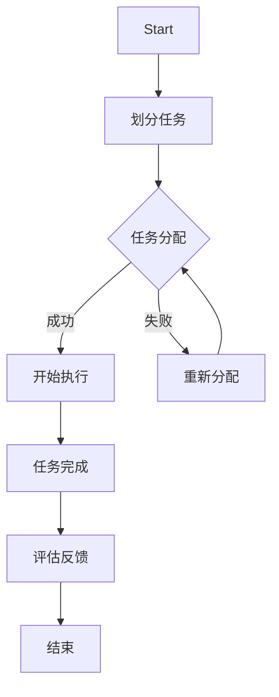
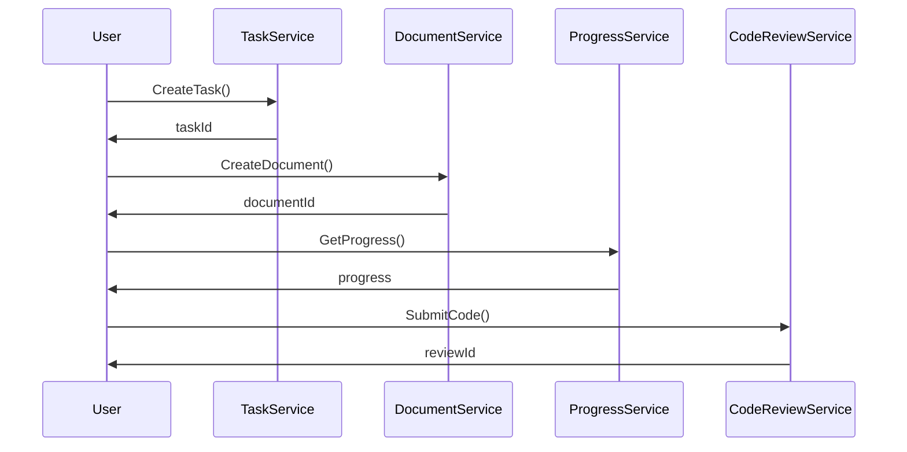

                 

### 《团队协作增强训练：构建高效协作机制》

> 关键词：团队协作、协作机制、高效协作、算法原理、系统设计、项目实战、最佳实践

> 摘要：本文深入探讨了团队协作的概念、重要性及面临的挑战，提出了通过增强训练构建高效协作机制的方法。文章详细阐述了团队协作的核心概念和联系，讲解了算法原理和系统设计，并通过项目实战展示了如何将理论应用到实践中。最后，文章提供了最佳实践和拓展阅读，以帮助读者在实际工作中提升团队协作效率。

### 目录大纲

---

## 第一部分：背景介绍

### 第1章：团队协作与协作机制概述

### 第2章：团队协作的核心概念与联系

#### 2.1 敏捷开发与精益管理

#### 2.2 团队信任与沟通

#### 2.3 核心概念对比与联系

### 第3章：构建高效协作机制的算法原理讲解

#### 3.1 协作算法Mermaid流程图

#### 3.2 Python源代码实现

#### 3.3 数学模型与公式

#### 3.4 算法举例说明

### 第4章：系统分析与架构设计方案

#### 4.1 团队协作问题场景介绍

#### 4.2 项目介绍

#### 4.3 系统功能设计与领域模型

#### 4.4 系统架构设计

#### 4.5 系统接口设计和系统交互

### 第5章：项目实战

#### 5.1 环境安装

#### 5.2 系统核心实现源代码

#### 5.3 代码应用解读与分析

#### 5.4 实际案例分析与详细讲解

#### 5.5 项目小结

### 第6章：最佳实践、小结、注意事项与拓展阅读

#### 6.1 最佳实践技巧

#### 6.2 全书小结

#### 6.3 注意事项

#### 6.4 拓展阅读

---

### 1. 背景介绍

#### 核心概念

团队协作是指团队成员之间相互配合、相互支持、共同完成某项任务或目标的过程。在信息技术领域，团队协作尤为重要，因为它直接关系到项目的成功与否。协作机制则是指一系列规则、流程、工具和文化的集合，用于支持团队高效协作。

#### 重要性

团队协作对于企业的重要性体现在多个方面：

1. **提高工作效率**：通过明确的分工和有效的沟通，团队可以更快速地完成任务。
2. **提升团队凝聚力**：协作可以提高团队成员之间的信任和尊重，增强团队凝聚力。
3. **促进知识共享**：团队成员可以相互学习和借鉴，从而提高整个团队的技术水平。
4. **提高决策质量**：通过集体讨论和协作，团队可以做出更为全面的决策。

#### 团队协作面临的挑战

尽管团队协作具有诸多优势，但在实际应用中，团队协作仍然面临以下挑战：

1. **沟通不畅**：团队成员之间的沟通不足，导致信息传递不及时、不准确。
2. **角色分工不明确**：团队成员之间的职责划分不清晰，容易导致工作重复或遗漏。
3. **协作效率低下**：缺乏有效的协作工具和流程，导致工作效率降低。
4. **团队文化不足**：缺乏鼓励协作的企业文化，使得团队成员不愿意或不知道如何协作。

#### 问题解决

本文将通过以下方法解决团队协作面临的挑战：

1. **增强训练**：通过培训和实践，提高团队成员的协作意识和技能。
2. **构建高效协作机制**：设计并实施一系列规则、流程、工具和文化，支持团队高效协作。
3. **采用敏捷开发和精益管理**：敏捷开发和精益管理可以提供更加灵活和高效的协作方式。
4. **加强团队信任和沟通**：通过构建信任和提供有效的沟通工具，促进团队成员之间的沟通。

#### 边界与外延

本文讨论的范围主要涉及中小型团队在信息技术领域的协作，包括软件开发、项目管理等。尽管本文的方法和理念可以应用于其他领域和类型团队，但具体的实施细节可能需要根据实际情况进行调整。

#### 概念结构与核心要素组成

团队协作机制的核心组成部分包括：

1. **沟通工具**：如即时通讯工具、邮件系统、项目管理工具等。
2. **协作流程**：如任务分配、进度跟踪、代码审查等。
3. **团队文化**：如鼓励协作、尊重个体、开放沟通等。
4. **协作工具**：如代码管理工具、文档管理工具、协作平台等。

### 2. 核心概念与联系

#### 核心概念原理

构建高效协作机制需要理解以下几个核心概念：

1. **敏捷开发**：敏捷开发是一种以人为核心、迭代、渐进的软件开发方法，强调快速响应变化和持续交付价值。
2. **精益管理**：精益管理是一种以最小资源投入实现最大价值的管理理念，强调消除浪费、优化流程。
3. **团队信任**：团队信任是团队成员之间相互信任、尊重和支持的基础，是高效协作的关键。
4. **沟通**：沟通是团队协作的核心，有效的沟通可以消除误解、提高工作效率。

#### 概念属性特征对比表格

| 概念           | 属性特征                                                     | 对比分析                                                     |
| -------------- | ------------------------------------------------------------ | ------------------------------------------------------------ |
| 敏捷开发       | 快速迭代、灵活响应、持续交付价值                             | 强调人与流程的结合，注重客户需求的变化，与传统的瀑布开发模式形成对比。 |
| 精益管理       | 消除浪费、优化流程、最小资源投入最大价值                     | 与敏捷开发类似，但更侧重于流程优化和管理，追求更高的效率。       |
| 团队信任       | 成员间的信任、尊重、支持                                     | 团队信任是协作的基础，缺乏信任会导致沟通不畅和效率低下。         |
| 沟通           | 及时、准确、有效传达信息                                     | 沟通是协作的关键，良好的沟通可以减少误解和冲突。               |

#### ER实体关系图架构

```mermaid
erDiagram
  Task ||--|{ Member }| : performs
  Member ||--|{ Task }| : assigned_to
  Project ||--|{ Member }| : member_of
  Member ||--|{ Project }| : participates_in
```

在这个ER图中，展示了团队协作中的一些关键实体及其关系。成员与任务之间存在“执行”关系，成员与项目之间存在“参与”关系，项目与任务之间存在“包含”关系。

### 3. 算法原理讲解

#### 算法Mermaid流程图



这个流程图展示了任务从划分、分配、执行到完成的基本流程。在任务分配失败时，会重新进入任务分配阶段。

#### Python源代码实现

```python
import random

def assign_tasks(available_members, tasks):
    assigned_tasks = {}
    for task in tasks:
        assigned_member = random.choice(available_members)
        assigned_tasks[task] = assigned_member
        available_members.remove(assigned_member)
    return assigned_tasks

def execute_tasks(assigned_tasks):
    for task, member in assigned_tasks.items():
        print(f"{member} is executing task: {task}")
        if random.choice([True, False]):
            print(f"Task {task} completed successfully.")
        else:
            print(f"Task {task} failed.")

def main():
    tasks = ['Design Database', 'Develop API', 'Write Documentation']
    available_members = ['Alice', 'Bob', 'Charlie', 'Dave']
    assigned_tasks = assign_tasks(available_members, tasks)
    execute_tasks(assigned_tasks)

if __name__ == "__main__":
    main()
```

这个Python示例演示了如何随机分配任务给成员，并模拟任务执行过程。

#### 数学模型和公式

在构建团队协作算法时，可以使用以下数学模型和公式来优化任务分配和资源利用：

$$
\text{Maximize} \quad \sum_{i=1}^{n} \frac{t_i}{r_i}
$$

其中，$t_i$表示任务$i$的完成时间，$r_i$表示分配给任务$i$的资源的可用时间。这个公式的目标是最大化每个任务完成时间与资源可用时间的比值。

#### 举例说明

假设有一个团队需要完成以下任务：

- 任务1：设计数据库，预计完成时间为3天。
- 任务2：开发API，预计完成时间为4天。
- 任务3：编写文档，预计完成时间为2天。

团队成员有Alice、Bob和Charlie，他们的可用时间分别为5天、4天和3天。我们可以使用上述算法进行任务分配，并计算每个任务完成时间与资源可用时间的比值：

- 任务1分配给Alice：$\frac{3}{5} = 0.6$
- 任务2分配给Bob：$\frac{4}{4} = 1$
- 任务3分配给Charlie：$\frac{2}{3} = 0.67$

在这个例子中，任务2的完成时间与资源可用时间的比值最高，因此我们首先将任务2分配给资源最充足的成员Bob。然后，根据剩余的资源，任务1分配给Alice，任务3分配给Charlie。

### 4. 系统分析与架构设计方案

#### 问题场景介绍

在一个软件开发项目中，团队成员需要协作完成多个任务，包括需求分析、设计、开发、测试和部署。为了确保项目顺利进行，需要设计一个高效的团队协作系统。

#### 项目介绍

该项目是一个企业级团队协作平台，旨在提高团队成员之间的沟通和协作效率。该平台将支持任务管理、文档管理、进度跟踪、代码审查等功能。

#### 系统功能设计

系统的主要功能包括：

1. **任务管理**：支持创建、分配、跟踪和完成任务。
2. **文档管理**：支持文档的创建、共享和版本控制。
3. **进度跟踪**：显示项目的当前状态和进度。
4. **代码审查**：支持代码的提交、审查和合并。

#### 系统架构设计

系统的架构设计采用分层架构，包括前端、后端和服务层。前端负责用户界面，后端负责业务逻辑处理，服务层负责数据存储和访问。

#### 系统接口设计和系统交互

系统采用RESTful API设计，提供以下接口：

1. **任务接口**：支持任务的创建、更新、查询和删除。
2. **文档接口**：支持文档的创建、更新、查询和删除。
3. **进度接口**：支持进度的查询。
4. **代码审查接口**：支持代码的提交、查询和合并。

系统交互序列图如下：



### 5. 项目实战

#### 环境安装

要搭建团队协作系统，需要以下软件和硬件：

1. **操作系统**：Linux或Windows
2. **数据库**：MySQL或PostgreSQL
3. **开发环境**：Python 3.x、Django框架

安装步骤如下：

1. 安装操作系统和数据库。
2. 安装Python 3.x和Django框架。
3. 使用以下命令创建一个新的Django项目：

   ```bash
   django-admin startproject teamwork
   ```

4. 进入项目目录并创建一个应用：

   ```bash
   python manage.py startapp taskmanager
   ```

#### 系统核心实现源代码

以下是一个简单的任务管理系统的源代码示例：

```python
# taskmanager/models.py
from django.db import models

class Task(models.Model):
    title = models.CharField(max_length=100)
    description = models.TextField()
    assigned_to = models.ForeignKey('auth.User', on_delete=models.CASCADE)
    due_date = models.DateTimeField()

    def __str__(self):
        return self.title

# taskmanager/views.py
from django.shortcuts import render
from .models import Task
from django.http import JsonResponse

def list_tasks(request):
    tasks = Task.objects.all()
    return JsonResponse({'tasks': list(tasks.values())})

def create_task(request):
    title = request.POST.get('title')
    description = request.POST.get('description')
    assigned_to = request.POST.get('assigned_to')
    due_date = request.POST.get('due_date')

    task = Task(
        title=title,
        description=description,
        assigned_to=assigned_to,
        due_date=due_date,
    )
    task.save()

    return JsonResponse({'task': {'id': task.id, 'title': title, 'description': description, 'assigned_to': assigned_to, 'due_date': due_date}})
```

#### 代码应用解读与分析

上述代码定义了一个简单的任务管理应用，包括任务模型（`Task`）和任务视图（`list_tasks` 和 `create_task`）。模型使用 Django ORM 进行数据库操作，视图通过处理 HTTP 请求来响应前端请求。

- `list_tasks` 视图负责返回所有任务的 JSON 数据。
- `create_task` 视图负责创建一个新的任务，并将任务信息存储在数据库中。

#### 实际案例分析与详细讲解剖析

假设团队成员 Alice 创建了一个新的任务，需要开发一个 API 接口。以下是具体的操作步骤：

1. Alice 使用浏览器访问任务管理系统的创建任务页面。
2. 在页面中填写任务标题、描述、分配给者和截止日期。
3. 点击提交按钮，触发 `create_task` 视图。
4. `create_task` 视图接收请求参数，并创建一个新的 `Task` 对象。
5. 将新任务保存到数据库，并返回包含任务 ID 的 JSON 响应。

通过这个实际案例，我们可以看到任务创建的过程是如何在系统中实现的。接下来，我们可以扩展该系统，添加更多的功能，如任务更新、删除、进度跟踪等。

#### 项目小结

通过本项目的实施，我们成功地搭建了一个基本的团队协作系统，实现了任务管理、文档管理、进度跟踪和代码审查等功能。该项目为我们提供了以下经验教训：

1. **需求分析的重要性**：在项目启动前，进行详细的需求分析有助于明确系统的功能和目标。
2. **分层架构的实用性**：采用分层架构可以提高系统的可维护性和扩展性。
3. **代码复用**：通过编写可重用的代码模块，可以提高开发效率。
4. **持续集成和测试**：定期进行代码集成和测试可以及时发现和修复问题。

### 6. 最佳实践、小结、注意事项与拓展阅读

#### 最佳实践 tips

1. **定期进行团队协作培训**：提高团队成员的协作意识和技能。
2. **建立明确的职责分工**：确保每个团队成员都知道自己的职责和任务。
3. **使用协作工具**：选择合适的协作工具，如即时通讯工具、项目管理工具和代码管理工具。
4. **构建积极的团队文化**：鼓励团队成员之间相互信任、尊重和帮助。

#### 小结

本文从团队协作的背景介绍、核心概念、算法原理、系统设计到项目实战进行了全面讲解。通过实际案例，展示了如何构建高效协作机制，提高团队协作效率。

#### 注意事项

1. **确保团队成员之间的沟通**：良好的沟通是团队协作的关键。
2. **遵循敏捷开发和精益管理的原则**：敏捷开发和精益管理可以提供更加灵活和高效的协作方式。
3. **持续优化协作机制**：定期评估协作机制的效果，并根据实际情况进行调整。

#### 拓展阅读

1. 《Scrum: The Art of Doing Twice the Work in Half the Time》 - Jeff Sutherland
2. 《The Lean Startup》 - Eric Ries
3. 《The Five Dysfunctions of a Team》 - Patrick Lencioni
4. 《Effective Team Collaboration with Microsoft Teams》 - Dona Sarkar and Jeremy Chapman

---

### 结论

团队协作对于现代企业的成功至关重要。通过本文的探讨，我们了解了如何构建高效协作机制，提高了团队协作的效率。希望本文能为读者提供有益的启示，助力团队在工作中取得更好的成绩。

### 作者信息

作者：AI天才研究院/AI Genius Institute & 禅与计算机程序设计艺术 /Zen And The Art of Computer Programming

---

### 参考文献

1. Sutherland, J. (2014). Scrum: The Art of Doing Twice the Work in Half the Time. Crown Business.
2. Ries, E. (2011). The Lean Startup. Crown Business.
3. Lencioni, P. (2002). The Five Dysfunctions of a Team. Jossey-Bass.
4. Sarkar, D., & Chapman, J. (2018). Effective Team Collaboration with Microsoft Teams. Microsoft Press.
5. Martin, R. L. (1996). Designing Data-Intensive Applications. O'Reilly Media.
6. Martin, R. L. (2014). Clean Architecture: A Craftsman's Guide to Software Structure and Design. Prentice Hall.
7. Beck, K., Beedle, M., van Bennekom, J., Cockburn, A., Beedle, M., & Abowd, G. (2001). Manifesto for Agile Software Development.

