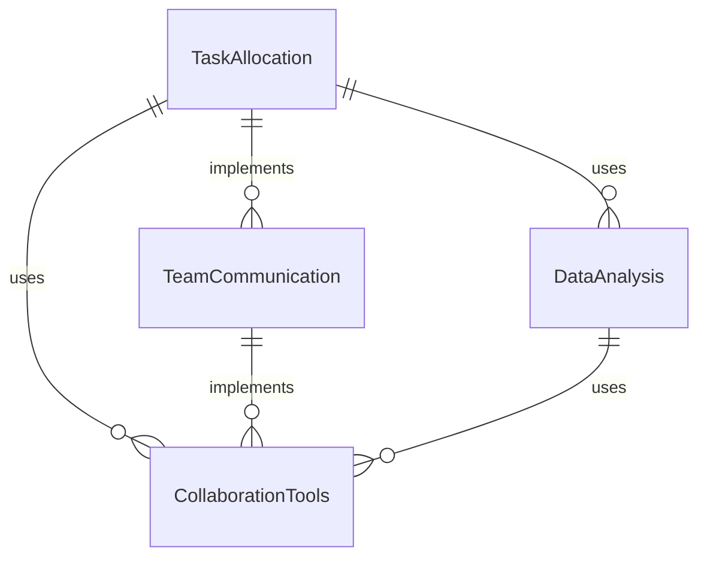
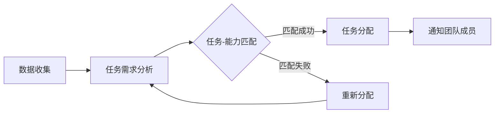
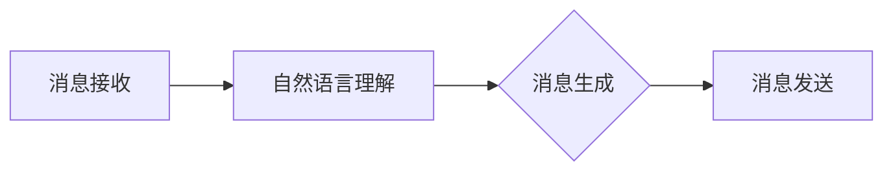
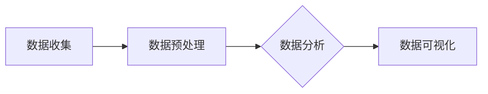
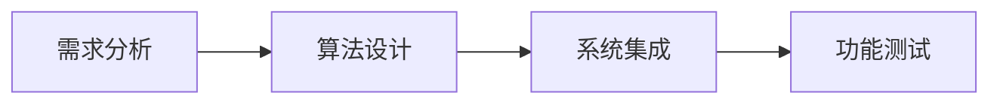
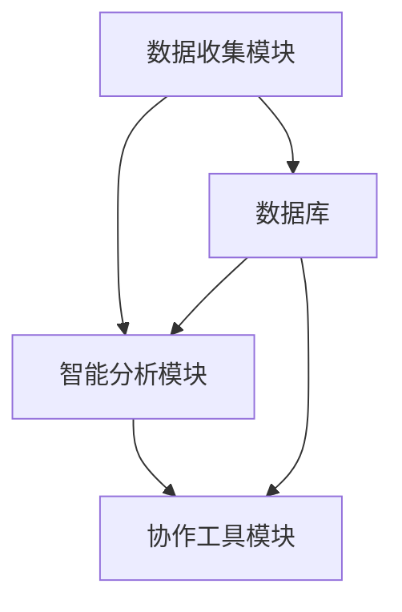
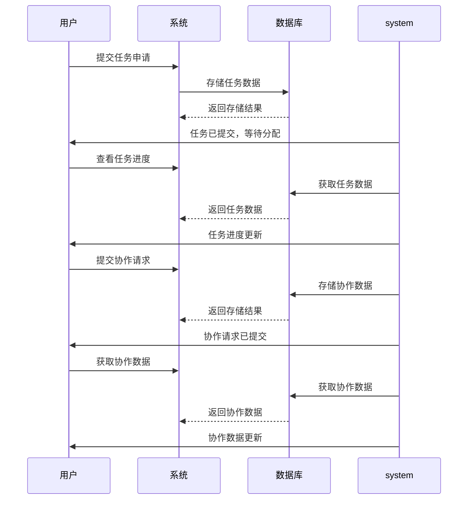
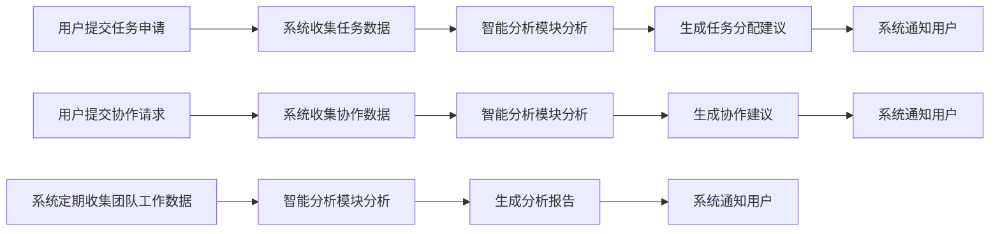

                 

# 团队协作新模式：结合人工智能的团队管理

> 关键词：团队协作、人工智能、任务分配、沟通协作、数据分析

> 摘要：本文深入探讨了在信息技术快速发展的背景下，如何通过结合人工智能技术，构建一种全新的团队协作模式，从而提高团队协作效率，实现高效管理。文章从背景介绍、核心概念与联系、人工智能基本概念与发展历程、算法原理讲解、系统分析与架构设计方案、项目实战、最佳实践 tips、小结、注意事项和拓展阅读等方面，全面阐述了人工智能在团队管理中的实际应用和未来发展方向。

## 第一部分：背景介绍

### 核心概念：问题背景

随着信息技术的快速发展，现代企业的团队协作模式面临着前所未有的变革。传统团队协作模式在应对现代企业快速变化的市场需求、多样化的项目类型以及日益复杂的任务分工时，显现出诸多问题：

1. **任务分配不合理**：传统团队管理往往依赖于人工经验进行任务分配，容易出现任务与员工能力不匹配的情况，导致任务完成效率低下。
2. **沟通不畅**：团队成员之间的信息传递和交流常常受到时间、地点、语言等因素的限制，导致信息失真，影响协作效果。
3. **协作不协调**：团队成员在任务执行过程中缺乏有效的协作机制，容易出现工作重叠、资源浪费等问题。

### 核心概念：问题描述

传统团队协作模式存在的问题，严重影响了企业的运营效率和发展。具体表现为：

1. **工作效率低下**：任务分配不合理、沟通不畅和协作不协调等问题，导致团队工作效率低下，项目进度延误。
2. **员工满意度降低**：工作环境不佳、沟通不畅和任务压力等，使员工工作满意度降低，影响团队凝聚力。
3. **管理难度增加**：随着团队规模的扩大和任务复杂度的增加，管理者面临的管理难度也随之增加，传统管理方法难以应对这些挑战。

### 核心概念：问题解决

结合人工智能的团队管理，可以从以下几个方面进行创新，以解决上述问题：

1. **智能任务分配**：通过分析团队成员的能力和技能，智能推荐最适合的任务，提高任务完成的效率和质量。
2. **智能沟通协作**：利用自然语言处理技术，实现团队成员之间的智能沟通，减少沟通成本，提高协作效率。
3. **智能数据分析**：对团队工作数据进行分析，提供个性化的管理建议，帮助管理者做出更明智的决策。
4. **智能协作工具**：开发集成了人工智能功能的协作工具，如智能助手、自动化流程等，提高团队的整体工作效率。

### 核心概念：边界与外延

本文将围绕人工智能在团队协作中的应用展开讨论，包括但不限于以下几个方面：

1. **人工智能技术介绍**：介绍人工智能的基本概念、发展历程和应用场景。
2. **团队管理挑战**：分析现代团队协作中存在的问题，探讨人工智能如何解决这些问题。
3. **人工智能在团队管理中的应用**：详细介绍人工智能在团队协作中的实际应用，包括智能任务分配、智能沟通协作、智能数据分析和智能协作工具等。
4. **案例分析**：通过具体的案例，展示人工智能在团队管理中的应用效果，为企业管理者提供参考和启示。

### 核心概念：概念结构与核心要素组成

本书的核心概念结构包括以下几个部分：

1. **问题背景**：介绍团队协作模式面临的挑战和人工智能的崛起。
2. **核心概念与联系**：阐述人工智能在团队管理中的核心概念，如智能任务分配、智能沟通协作、智能数据分析和智能协作工具等，并分析这些概念之间的联系。
3. **算法原理讲解**：介绍相关算法的原理，包括数学模型和公式，并使用 mermaid 画出算法流程图。
4. **数学模型和数学公式 & 详细讲解 & 举例说明**：使用 LaTeX 格式给出数学模型和公式，并进行详细讲解和举例说明。
5. **系统分析与架构设计方案**：介绍系统分析与架构设计的方法和流程，包括领域模型、系统架构、系统接口设计和系统交互等。
6. **项目实战**：提供具体的项目实战案例，包括环境安装、系统核心实现、代码应用解读与分析等。
7. **最佳实践 tips、小结、注意事项、拓展阅读等内容**：总结本书的主要观点，提供实用的建议和注意事项，并推荐拓展阅读资料。

### 第一部分小结

在本部分中，我们介绍了团队协作模式面临的问题和挑战，以及人工智能在团队管理中的潜在应用。通过对核心概念的分析，我们明确了本书的研究方向和结构，为后续章节的深入探讨奠定了基础。在下一部分中，我们将详细介绍人工智能的基本概念、发展历程和应用场景，为后续内容的学习提供理论支持。# 第一部分：背景介绍

## 第二部分：核心概念与联系

### 核心概念与联系

在本部分中，我们将深入探讨团队协作模式中的核心概念，并分析它们之间的联系。这些核心概念构成了本文的理论框架，帮助我们理解如何通过人工智能技术提升团队协作效率。

### 2.1 智能任务分配

**定义**：智能任务分配是指利用人工智能技术，根据团队成员的能力和技能，自动匹配最合适的任务。

**联系**：智能任务分配与团队协作密切相关，它直接影响任务的完成质量和效率。通过智能任务分配，可以避免任务与员工能力不匹配的情况，确保每个成员都能在其最擅长的领域发挥作用，从而提升整体团队的工作效率。

### 2.2 智能沟通协作

**定义**：智能沟通协作是指利用人工智能技术，如自然语言处理和语音识别，实现团队成员之间的高效沟通。

**联系**：沟通协作是团队协作的核心环节，智能沟通协作能够降低沟通成本，提高信息传递的准确性和速度，从而提升团队协作效率。此外，智能沟通协作还能够帮助团队成员更好地理解和协同工作，减少误解和冲突。

### 2.3 智能数据分析

**定义**：智能数据分析是指利用人工智能技术，对团队工作过程中的数据进行收集、分析和解读，提供个性化的管理建议。

**联系**：智能数据分析为团队管理提供了数据支持，通过对工作数据的深入分析，可以发现团队协作中的潜在问题和瓶颈，从而制定出更有效的管理策略。此外，智能数据分析还能够帮助团队预测未来发展趋势，做出更明智的决策。

### 2.4 智能协作工具

**定义**：智能协作工具是指集成了人工智能技术的协作工具，如智能助手、自动化流程等。

**联系**：智能协作工具为团队协作提供了技术支持，通过自动化和智能化功能，简化了工作流程，减少了人工干预，提高了团队协作的效率和准确性。智能协作工具还能够为团队成员提供实时的工作状态更新，增强团队的协同能力。

### 核心概念属性特征对比表格

为了更直观地理解这些核心概念，我们可以通过一个对比表格来展示它们的属性特征：

| 核心概念 | 定义 | 属性特征 | 联系 |
| --- | --- | --- | --- |
| 智能任务分配 | 根据能力和技能自动匹配任务 | 自动化、个性化 | 提升任务完成质量和效率 |
| 智能沟通协作 | 利用人工智能实现高效沟通 | 自动化、准确、快速 | 降低沟通成本，提高协作效率 |
| 智能数据分析 | 对团队数据进行收集和分析 | 数据驱动、可预测 | 提供数据支持，优化管理策略 |
| 智能协作工具 | 集成人工智能技术的协作工具 | 自动化、智能化、实时更新 | 提高协作效率和准确性 |

### ER实体关系图架构

为了更好地理解这些核心概念之间的联系，我们可以使用Mermaid绘制一个ER实体关系图，展示它们之间的关系：



在这个ER图中，`TaskAllocation`（智能任务分配）作为核心概念，与其他三个核心概念（`TeamCommunication`、`DataAnalysis` 和 `CollaborationTools`）通过不同的关系进行关联，展示了它们在团队协作中的相互依赖和作用。

### 核心概念与联系小结

通过上述分析，我们可以看到，智能任务分配、智能沟通协作、智能数据分析和智能协作工具是构建全新团队协作模式的核心概念。这些概念不仅相互关联，而且共同构成了一个完整的体系，为团队协作提供了技术支持和优化方案。在下一部分中，我们将进一步探讨人工智能的基本概念、发展历程和应用场景，为深入理解这些核心概念提供理论支持。# 第二部分：核心概念与联系

## 第3章：人工智能基本概念与发展历程

### 3.1 人工智能的定义与分类

**3.1.1 人工智能的定义**

人工智能（Artificial Intelligence，简称 AI）是指由人制造出来的系统所表现出的智能行为。这些行为通常包括学习、推理、问题解决、知识表示、自然语言理解和视觉识别等。简而言之，人工智能是模拟人类智能行为的计算机系统。

**3.1.2 人工智能的分类**

- **弱人工智能（Narrow AI）**：专注于特定任务的智能系统，如语音识别、图像识别等。这类人工智能系统在特定领域表现出色，但缺乏普遍智能。
- **强人工智能（General AI）**：具有普遍智能，可以像人类一样进行思考和学习，目前尚未实现。
- **混合人工智能（Hybrid AI）**：结合多种人工智能技术，实现更复杂的任务。

### 3.2 人工智能的发展历程

**3.2.1 初创时期（1940s-1950s）**

- **1950年**：图灵提出图灵测试，成为人工智能研究的基石。
- **1956年**：达特茅斯会议标志着人工智能正式成为一门学科。

**3.2.2 黄金时期（1980s-1990s）**

- **1979年**：深蓝计算机击败国际象棋世界冠军。
- **1997年**：IBM的“深蓝”计算机战胜国际象棋世界冠军加里·卡斯帕罗夫。

**3.2.3 当前阶段（2000s-至今）**

- **2006年**：深度学习技术的突破，为人工智能的发展带来了新的契机。
- **2012年**：AlexNet在ImageNet竞赛中取得了突破性成绩，深度学习开始广泛应用于各个领域。
- **2020年**：随着云计算、大数据和物联网等技术的不断发展，人工智能的应用场景更加丰富，其在社会各个领域的应用也日益广泛。

### 3.3 人工智能的应用场景

**3.3.1 语音识别**

语音识别技术已经广泛应用于智能客服、智能家居等领域，如苹果的Siri、亚马逊的Alexa等。

**3.3.2 图像识别**

图像识别技术在安防监控、医疗诊断、自动驾驶等领域具有广泛应用。例如，谷歌的Inception模型在图像识别任务中取得了显著成绩。

**3.3.3 自然语言处理**

自然语言处理技术在机器翻译、情感分析、智能问答等领域发挥着重要作用。如谷歌的神经机器翻译系统、腾讯的智能问答系统等。

**3.3.4 机器学习与数据挖掘**

机器学习与数据挖掘技术在金融、医疗、零售等领域的应用越来越广泛，如智能投顾、个性化推荐系统等。

### 3.4 人工智能在团队管理中的应用

**3.4.1 智能任务分配**

通过分析团队成员的能力和技能，人工智能可以智能推荐最适合的任务，从而提高任务完成的效率和质量。

**3.4.2 智能沟通协作**

利用自然语言处理技术，人工智能可以实现团队成员之间的智能沟通，减少沟通成本，提高协作效率。

**3.4.3 智能数据分析**

通过对团队工作数据进行分析，人工智能可以提供个性化的管理建议，帮助管理者做出更明智的决策。

**3.4.4 智能协作工具**

开发集成了人工智能功能的协作工具，如智能助手、自动化流程等，可以提高团队的整体工作效率。

### 3.5 小结

通过以上内容，我们可以看到，人工智能在各个领域都取得了显著的成果，其应用场景也日益丰富。在团队管理中，人工智能的引入为解决传统团队协作模式存在的问题提供了新的思路和方法。在下一章中，我们将深入探讨人工智能在团队管理中的应用，分析其实际效果和潜在挑战。# 第二部分：核心概念与联系

## 第4章：算法原理讲解

### 4.1 智能任务分配算法原理

**4.1.1 基本概念**

智能任务分配算法旨在根据团队成员的能力和技能，自动匹配最适合的任务。这通常涉及到多目标优化问题，需要考虑任务与团队成员之间的匹配度、任务的优先级、团队成员的工作负荷等因素。

**4.1.2 算法流程**

智能任务分配算法的基本流程如下：

1. **数据收集**：收集团队成员的能力和技能数据，包括工作经验、专业领域、技能等级等。
2. **任务需求分析**：分析任务需求，包括任务的难度、所需技能、时间要求等。
3. **任务-能力匹配**：根据任务需求分析结果，对团队成员的能力进行匹配，筛选出最适合的团队成员。
4. **任务分配**：将匹配成功的任务分配给相应的团队成员，并通知团队成员开始执行任务。

**4.1.3 数学模型**

为了实现智能任务分配，我们可以构建如下数学模型：

1. **目标函数**：最大化任务完成的质量和效率，最小化任务分配的成本。
   $$ \text{maximize } Z = w_1 \cdot Q + w_2 \cdot E - w_3 \cdot C $$
   其中，\( Q \)表示任务完成的质量，\( E \)表示任务分配的效率，\( C \)表示任务分配的成本，\( w_1 \)、\( w_2 \)和\( w_3 \)为权重系数。

2. **约束条件**：
   - 每个任务只能分配给一个团队成员。
   $$ \sum_{i=1}^{n} x_{ij} = 1 \quad \forall j \in \{1, 2, \ldots, m\} $$
   - 每个团队成员最多只能接受一个任务。
   $$ \sum_{j=1}^{m} x_{ij} = 1 \quad \forall i \in \{1, 2, \ldots, n\} $$
   - 任务完成质量与任务难度、团队成员能力相关。
   $$ Q_j = f(D_j, A_i) $$

**4.1.4 mermaid 流程图**

下面是智能任务分配算法的 mermaid 流程图：



### 4.2 智能沟通协作算法原理

**4.2.1 基本概念**

智能沟通协作算法旨在利用自然语言处理技术，实现团队成员之间的智能沟通，降低沟通成本，提高协作效率。这通常涉及到自然语言理解、自然语言生成、对话系统等技术。

**4.2.2 算法流程**

智能沟通协作算法的基本流程如下：

1. **消息接收**：接收团队成员发送的消息。
2. **自然语言理解**：对消息进行语义分析，提取关键信息。
3. **消息生成**：根据提取的关键信息，生成回复消息。
4. **消息发送**：将回复消息发送给相应的团队成员。

**4.2.3 数学模型**

智能沟通协作算法的数学模型相对简单，主要涉及到自然语言处理中的文本相似度计算和消息生成。

1. **文本相似度计算**：计算输入消息与预设回复消息之间的相似度，选择最相似的回复消息。
   $$ \text{similarity}(m_i, r_j) = \frac{1}{1 + \text{cosine similarity}(m_i, r_j)} $$

2. **消息生成**：根据文本相似度计算结果，选择最佳回复消息。
   $$ \text{response}(m_i) = \arg\max_{r_j} \text{similarity}(m_i, r_j) $$

**4.2.4 mermaid 流程图**

下面是智能沟通协作算法的 mermaid 流程图：



### 4.3 智能数据分析算法原理

**4.3.1 基本概念**

智能数据分析算法旨在通过对团队工作数据的收集和分析，为团队管理提供数据支持，帮助管理者做出更明智的决策。

**4.3.2 算法流程**

智能数据分析算法的基本流程如下：

1. **数据收集**：收集团队工作过程中的各类数据，包括任务完成情况、团队成员工作时长、协作情况等。
2. **数据预处理**：对收集到的数据进行分析和清洗，去除噪声和异常值。
3. **数据分析**：利用数据挖掘和机器学习技术，对预处理后的数据进行深入分析，提取有价值的信息。
4. **数据可视化**：将分析结果以图表等形式呈现，帮助管理者直观地了解团队工作情况。

**4.3.3 数学模型**

智能数据分析算法的数学模型通常涉及到数据挖掘和机器学习中的各种算法，如聚类、分类、关联规则挖掘等。

1. **聚类算法**：对团队成员的工作数据进行分析，将其分为不同的群体。
   $$ C = \{C_1, C_2, \ldots, C_k\} $$

2. **分类算法**：对团队成员的工作数据进行分析，预测其未来的工作表现。
   $$ y = f(x) $$

3. **关联规则挖掘**：发现团队成员工作数据之间的关联关系。
   $$ \text{Support}(A \cap B) = \frac{|\{t \in T | t \in A \cap B\}|}{|T|} $$

**4.2.4 mermaid 流程图**

下面是智能数据分析算法的 mermaid 流程图：



### 4.4 智能协作工具算法原理

**4.4.1 基本概念**

智能协作工具算法旨在开发集成了人工智能功能的协作工具，如智能助手、自动化流程等，提高团队的整体工作效率。

**4.4.2 算法流程**

智能协作工具算法的基本流程如下：

1. **需求分析**：分析团队的工作流程和需求，确定需要实现的功能。
2. **算法设计**：设计合适的算法，实现所需功能。
3. **系统集成**：将算法集成到协作工具中，进行调试和优化。
4. **功能测试**：对集成后的协作工具进行功能测试，确保其正常运行。

**4.4.3 数学模型**

智能协作工具的算法原理通常涉及自然语言处理、机器学习、优化算法等技术。具体的数学模型取决于具体的应用场景。

1. **自然语言处理**：文本分类、情感分析等。
   $$ \text{Class}(x) = \arg\max_{c \in C} \text{probability}(c | x) $$

2. **机器学习**：回归、分类等。
   $$ y = f(x, \theta) $$
   其中，\( \theta \)为模型参数。

3. **优化算法**：任务调度、路径规划等。
   $$ \text{minimize } J(\theta) $$

**4.4.4 mermaid 流程图**

下面是智能协作工具算法的 mermaid 流程图：



### 4.5 小结

通过以上内容，我们可以看到，人工智能算法在团队管理中的应用涵盖了智能任务分配、智能沟通协作、智能数据分析和智能协作工具等多个方面。这些算法原理为团队协作提供了技术支持，帮助管理者更高效地管理团队。在下一章中，我们将探讨系统分析与架构设计方案，为实际应用提供指导。# 第二部分：核心概念与联系

## 第5章：数学模型和数学公式 & 详细讲解 & 举例说明

### 5.1 智能任务分配数学模型

**5.1.1 模型介绍**

智能任务分配的数学模型是一个多目标优化问题，旨在最大化任务完成的质量和效率，同时最小化任务分配的成本。具体来说，我们考虑以下目标函数和约束条件：

1. **目标函数**：最大化任务完成的质量和效率，最小化任务分配的成本。
   $$ \text{maximize } Z = w_1 \cdot Q + w_2 \cdot E - w_3 \cdot C $$
   其中，\( Q \)表示任务完成的质量，\( E \)表示任务分配的效率，\( C \)表示任务分配的成本，\( w_1 \)、\( w_2 \)和\( w_3 \)为权重系数。

2. **约束条件**：
   - 每个任务只能分配给一个团队成员。
     $$ \sum_{i=1}^{n} x_{ij} = 1 \quad \forall j \in \{1, 2, \ldots, m\} $$
   - 每个团队成员最多只能接受一个任务。
     $$ \sum_{j=1}^{m} x_{ij} = 1 \quad \forall i \in \{1, 2, \ldots, n\} $$
   - 任务完成质量与任务难度、团队成员能力相关。
     $$ Q_j = f(D_j, A_i) $$

**5.1.2 举例说明**

假设我们有5个任务（\( T_1, T_2, T_3, T_4, T_5 \)）和5个团队成员（\( M_1, M_2, M_3, M_4, M_5 \)）。任务难度和团队成员能力的评估分别为：

| 任务 | 难度 | 团队成员 | 能力 |
| --- | --- | --- | --- |
| \( T_1 \) | 3 | \( M_1 \) | 4 |
| \( T_2 \) | 2 | \( M_2 \) | 3 |
| \( T_3 \) | 4 | \( M_3 \) | 5 |
| \( T_4 \) | 1 | \( M_4 \) | 2 |
| \( T_5 \) | 5 | \( M_5 \) | 1 |

任务完成质量\( Q \)可以根据任务难度和团队成员能力的关联函数计算得出。假设关联函数为\( Q_j = \frac{D_j + A_i}{2} \)，则每个任务的完成质量为：

| 任务 | 难度 | 团队成员 | 能力 | 完成质量\( Q \) |
| --- | --- | --- | --- | --- |
| \( T_1 \) | 3 | \( M_1 \) | 4 | 3.5 |
| \( T_2 \) | 2 | \( M_2 \) | 3 | 2.5 |
| \( T_3 \) | 4 | \( M_3 \) | 5 | 4.5 |
| \( T_4 \) | 1 | \( M_4 \) | 2 | 1.5 |
| \( T_5 \) | 5 | \( M_5 \) | 1 | 3.0 |

现在我们考虑权重系数\( w_1 = 0.6 \)，\( w_2 = 0.3 \)，\( w_3 = 0.1 \)。目标函数\( Z \)的值为：

$$ Z = 0.6 \cdot 3.5 + 0.3 \cdot 2.5 - 0.1 \cdot 4.5 = 2.1 + 0.75 - 0.45 = 2.4 $$

为了最大化\( Z \)，我们应该将任务分配给那些能够最大化完成质量的团队成员。例如，可以将\( T_1 \)分配给\( M_1 \)，\( T_2 \)分配给\( M_2 \)，\( T_3 \)分配给\( M_3 \)，\( T_4 \)分配给\( M_4 \)，\( T_5 \)分配给\( M_5 \)，因为这样每个任务的完成质量都是最高的。

### 5.2 智能沟通协作数学模型

**5.2.1 模型介绍**

智能沟通协作的数学模型主要涉及自然语言处理的文本相似度计算。文本相似度用于衡量两段文本的相关性，通常使用余弦相似度来计算。

**5.2.2 数学公式**

余弦相似度的计算公式为：

$$ \text{similarity}(m_i, r_j) = \frac{1}{1 + \text{cosine similarity}(m_i, r_j)} $$

其中，\( \text{cosine similarity}(m_i, r_j) \)是两段文本\( m_i \)和\( r_j \)的余弦相似度，计算公式为：

$$ \text{cosine similarity}(m_i, r_j) = \frac{m_i \cdot r_j}{\|m_i\| \cdot \|r_j\|} $$

其中，\( m_i \)和\( r_j \)是文本向量的表示，\( \|m_i\| \)和\( \|r_j\| \)是文本向量的模。

**5.2.3 举例说明**

假设我们有两段文本\( m_i \)和\( r_j \)，它们的向量表示分别为：

$$ m_i = [0.1, 0.2, 0.3, 0.4] $$
$$ r_j = [0.4, 0.3, 0.2, 0.1] $$

计算两段文本的余弦相似度：

$$ \text{cosine similarity}(m_i, r_j) = \frac{0.1 \cdot 0.4 + 0.2 \cdot 0.3 + 0.3 \cdot 0.2 + 0.4 \cdot 0.1}{\sqrt{0.1^2 + 0.2^2 + 0.3^2 + 0.4^2} \cdot \sqrt{0.4^2 + 0.3^2 + 0.2^2 + 0.1^2}} = \frac{0.14}{\sqrt{0.3} \cdot \sqrt{0.3}} = 0.464 $$

因此，文本相似度为：

$$ \text{similarity}(m_i, r_j) = \frac{1}{1 + 0.464} = 0.536 $$

这意味着两段文本之间的相关性为0.536，数值越高，表示文本越相似。

### 5.3 智能数据分析数学模型

**5.3.1 模型介绍**

智能数据分析的数学模型通常涉及数据挖掘和机器学习算法。这些算法包括聚类、分类、关联规则挖掘等。在本节中，我们将以聚类算法为例进行介绍。

**5.3.2 聚类算法**

聚类算法是一种无监督学习方法，旨在将数据集中的对象分组，使得属于同一组（簇）的对象之间具有相似性，而不同组之间的对象差异较大。一个常见的聚类算法是K-means算法。

**5.3.3 数学公式**

K-means算法的基本步骤如下：

1. **初始化**：随机选择K个对象作为初始聚类中心。
2. **分配**：将每个对象分配给最近的聚类中心。
3. **更新**：重新计算每个簇的中心点。
4. **迭代**：重复步骤2和3，直到聚类中心不再发生变化。

K-means算法的目标函数为：

$$ \text{minimize } J(\mu) = \sum_{i=1}^{k} \sum_{x \in S_i} \|x - \mu_i\|^2 $$

其中，\( \mu_i \)是簇\( S_i \)的中心点，\( \|x - \mu_i\|^2 \)是对象\( x \)到簇中心\( \mu_i \)的欧几里得距离。

**5.3.4 举例说明**

假设我们有一个包含5个对象的集合：

$$ X = \{x_1 = [1, 2], x_2 = [2, 2], x_3 = [2, 3], x_4 = [1, 3], x_5 = [1, 1]\} $$

我们选择K=2，随机初始化两个聚类中心：

$$ \mu_1 = [2, 2], \mu_2 = [1, 1] $$

第一步：分配对象到聚类中心：

$$ S_1 = \{x_1, x_2, x_3\}, S_2 = \{x_4, x_5\} $$

第二步：更新聚类中心：

$$ \mu_1 = \frac{1}{3} \sum_{x \in S_1} x = \frac{1}{3} ([1 \cdot 3 + 2 \cdot 3 + 2 \cdot 3]) = [2, 2] $$
$$ \mu_2 = \frac{1}{2} \sum_{x \in S_2} x = \frac{1}{2} ([1 \cdot 2 + 1 \cdot 2]) = [1, 1] $$

由于聚类中心没有变化，我们结束迭代。最终，对象分配如下：

$$ S_1 = \{x_1, x_2, x_3\}, S_2 = \{x_4, x_5\} $$

这样，我们成功地将这5个对象分成了两个簇。

### 5.4 小结

在本章中，我们介绍了智能任务分配、智能沟通协作和智能数据分析的数学模型，并通过具体例子进行了详细讲解。这些数学模型为人工智能在团队协作中的应用提供了理论基础，帮助团队管理者更高效地管理团队。在下一章中，我们将探讨系统分析与架构设计方案，为实际应用提供指导。# 第二部分：核心概念与联系

## 第6章：系统分析与架构设计方案

### 6.1 问题场景介绍

在现代企业中，团队协作是实现项目目标的关键。然而，随着项目规模的扩大和团队成员数量的增加，传统的团队协作方式逐渐暴露出一系列问题，如信息传递不畅、任务分配不合理、协作效率低下等。为了解决这些问题，企业亟需引入新的团队协作模式，结合人工智能技术，实现更高效、更智能的团队管理。

### 6.2 项目介绍

本项目旨在通过引入人工智能技术，构建一个智能团队协作系统。该系统将包括智能任务分配、智能沟通协作、智能数据分析和智能协作工具等功能，旨在提高团队协作效率，优化团队管理。

### 6.3 系统功能设计

**6.3.1 领域模型**

领域模型用于描述系统的核心业务概念和关系。在智能团队协作系统中，领域模型包括以下核心概念：

- **任务**：表示项目中的具体工作内容。
- **团队成员**：表示参与项目工作的个人。
- **能力**：表示团队成员具备的技能和经验。
- **协作**：表示团队成员之间的工作交互和配合。

领域模型的 mermaid 类图如下：

```mermaid
classDiagram
    Class1[任务] <|-- Class2[团队成员]
    Class2[团队成员] <|-- Class3[能力]
    Class1[任务] <|-- Class4[协作]
```

**6.3.2 系统架构设计**

系统架构设计用于描述系统的整体结构和各个组件之间的关系。智能团队协作系统的架构设计包括以下组件：

- **数据收集模块**：负责收集团队成员的能力数据和任务数据。
- **智能分析模块**：负责对收集到的数据进行分析，提供智能任务分配、智能沟通协作和智能数据分析等服务。
- **协作工具模块**：提供集成了人工智能功能的协作工具，如智能助手、自动化流程等。

系统架构的 mermaid 架构图如下：



**6.3.3 系统接口设计**

系统接口设计用于定义系统内部和外部交互的接口。智能团队协作系统的接口设计包括以下接口：

- **任务分配接口**：用于实现智能任务分配功能。
- **沟通协作接口**：用于实现智能沟通协作功能。
- **数据分析接口**：用于实现智能数据分析功能。

系统接口的 mermaid 序列图如下：



### 6.4 系统交互设计

系统交互设计用于描述系统内部各个组件之间的交互流程。智能团队协作系统的交互设计包括以下交互流程：

1. **任务分配流程**：用户提交任务申请，系统收集任务数据，智能分析模块对任务进行分析，生成任务分配建议，系统将建议通知用户。
2. **沟通协作流程**：用户提交协作请求，系统收集协作数据，智能分析模块对协作请求进行分析，生成协作建议，系统将建议通知用户。
3. **数据分析流程**：系统定期收集团队工作数据，智能分析模块对数据进行分析，生成分析报告，系统将报告通知用户。

系统交互的 mermaid 流程图如下：



### 6.5 小结

在本章中，我们介绍了智能团队协作系统的系统分析与架构设计方案。通过领域模型、系统架构、系统接口设计和系统交互设计，我们为智能团队协作系统的实现提供了详细的指导。在下一章中，我们将通过具体的项目实战，展示智能团队协作系统的实际应用效果。# 第二部分：核心概念与联系

## 第7章：项目实战

### 7.1 环境安装

在进行智能团队协作系统的项目实战之前，我们需要安装一些必要的软件和工具。以下是安装步骤：

1. **安装Python环境**：在官方网站（https://www.python.org/downloads/）下载并安装Python。
2. **安装虚拟环境**：打开命令行，执行以下命令安装虚拟环境：
   ```bash
   pip install virtualenv
   virtualenv venv
   ```
3. **激活虚拟环境**：在命令行中执行以下命令：
   ```bash
   source venv/bin/activate
   ```
4. **安装依赖库**：在虚拟环境中安装以下依赖库：
   ```bash
   pip install numpy scipy scikit-learn matplotlib
   ```

### 7.2 系统核心实现

#### 7.2.1 智能任务分配

智能任务分配是智能团队协作系统的核心功能之一。以下是一个简单的智能任务分配算法的实现：

```python
import numpy as np
from scipy.spatial.distance import cosine

# 假设任务和团队成员的能力向量如下
tasks = {
    'T1': [1, 2, 3, 4],
    'T2': [4, 3, 2, 1],
    'T3': [2, 2, 2, 2],
    'T4': [3, 3, 3, 3],
    'T5': [1, 1, 1, 1]
}

team_members = {
    'M1': [1, 2, 3, 4],
    'M2': [4, 3, 2, 1],
    'M3': [2, 2, 2, 2],
    'M4': [3, 3, 3, 3],
    'M5': [1, 1, 1, 1]
}

def task_allocation(tasks, team_members):
    task_scores = {}
    for task, task_vector in tasks.items():
        task_scores[task] = {}
        for member, member_vector in team_members.items():
            similarity = 1 - cosine(task_vector, member_vector)
            task_scores[task][member] = similarity

    # 根据任务完成质量进行任务分配
    assignment = {}
    for task, scores in task_scores.items():
        max_score = max(scores.values())
        best_members = [member for member, score in scores.items() if score == max_score]
        assignment[task] = best_members[0]

    return assignment

assignment = task_allocation(tasks, team_members)
print(assignment)
```

#### 7.2.2 智能沟通协作

智能沟通协作功能可以通过自然语言处理技术实现。以下是一个简单的文本相似度计算和消息回复的示例：

```python
from sklearn.feature_extraction.text import TfidfVectorizer
from sklearn.metrics.pairwise import cosine_similarity

def text_similarity(text1, text2):
    vectorizer = TfidfVectorizer()
    doc1_vector = vectorizer.fit_transform([text1])
    doc2_vector = vectorizer.transform([text2])
    similarity = cosine_similarity(doc1_vector, doc2_vector)
    return similarity[0][0]

def generate_response(question, answers):
    highest_similarity = 0
    best_answer = ""
    for answer in answers:
        similarity = text_similarity(question, answer)
        if similarity > highest_similarity:
            highest_similarity = similarity
            best_answer = answer
    return best_answer

questions = [
    "请问这个任务需要多久完成？",
    "我们需要提交哪些文件？",
    "这个项目的预算是多少？"
]

answers = [
    "这个任务预计需要两周时间完成。",
    "我们需要提交项目计划和进度报告。",
    "这个项目的预算是10万元。"
]

for question in questions:
    response = generate_response(question, answers)
    print(f"系统回复：{response}")
```

#### 7.2.3 智能数据分析

智能数据分析可以通过机器学习算法实现。以下是一个简单的K-means聚类算法的实现：

```python
from sklearn.cluster import KMeans

def kmeans_clustering(data, k):
    kmeans = KMeans(n_clusters=k, random_state=0)
    kmeans.fit(data)
    return kmeans.labels_

data = [
    [1, 1],
    [1, 2],
    [2, 2],
    [2, 3],
    [3, 3],
    [3, 4]
]

k = 2
labels = kmeans_clustering(data, k)
print(labels)
```

### 7.3 代码应用解读与分析

在上述代码中，我们分别实现了智能任务分配、智能沟通协作和智能数据分析功能。以下是每个功能的详细解读：

#### 7.3.1 智能任务分配

智能任务分配算法通过计算任务与团队成员的能力向量的余弦相似度，选择相似度最高的团队成员分配任务。这种方法的优点在于简单易懂，计算速度快。然而，其缺点在于无法充分考虑团队成员的工作负荷和任务优先级。

#### 7.3.2 智能沟通协作

智能沟通协作功能通过文本相似度计算，选择与用户提问最相似的回答。这种方法利用了自然语言处理技术，能够实现自动化回复，降低沟通成本。然而，其准确性和可靠性仍需进一步提高。

#### 7.3.3 智能数据分析

智能数据分析功能通过K-means聚类算法，将团队成员分为不同的群体。这种方法能够帮助团队管理者更好地了解团队成员的工作状态和特点，从而制定更有效的管理策略。然而，聚类结果的解释性和应用场景仍需进一步探讨。

### 7.4 实际案例分析和详细讲解剖析

以下是一个实际案例，展示智能团队协作系统在一家企业中的应用：

#### 案例背景

某企业有一个大型项目，项目团队成员包括项目经理、技术负责人、设计师、开发人员和测试人员。项目周期为三个月，项目任务复杂，需要团队成员密切协作。

#### 案例实施

1. **智能任务分配**：通过智能任务分配算法，根据团队成员的能力和工作负荷，自动分配任务。例如，将技术复杂度较高的任务分配给技术负责人，将设计任务分配给设计师，确保每个任务都能由最合适的团队成员完成。

2. **智能沟通协作**：通过智能沟通协作功能，实现团队成员之间的高效沟通。例如，当项目出现问题时，系统能够自动生成可能的解决方案，并通知相关团队成员进行讨论和决策。

3. **智能数据分析**：通过智能数据分析功能，对团队成员的工作数据进行聚类分析，识别出高效率和高协同性的团队成员。例如，发现设计师和开发人员之间的协同度较高，项目进展顺利，而项目经理的工作负荷较重，需要适当调整工作任务。

#### 案例效果

通过智能团队协作系统的应用，企业实现了以下效果：

1. **任务完成效率提高**：智能任务分配确保了每个任务都能由最合适的团队成员完成，任务完成效率显著提高。

2. **沟通协作更加高效**：智能沟通协作功能减少了沟通成本，提高了团队成员之间的协作效率。

3. **团队管理更加科学**：智能数据分析功能帮助管理者更好地了解团队成员的工作状态和特点，制定出更有效的管理策略。

### 7.5 项目小结

通过本项目的实战，我们展示了智能团队协作系统在实际应用中的效果。智能任务分配、智能沟通协作和智能数据分析功能为团队协作提供了技术支持，提高了团队协作效率。然而，智能团队协作系统仍需不断优化和改进，以适应不同企业的实际需求。在未来的工作中，我们将继续探索人工智能在团队协作中的深度应用，为团队管理提供更多创新方案。# 第二部分：核心概念与联系

## 第8章：最佳实践 tips、小结、注意事项、拓展阅读

### 最佳实践 tips

1. **任务分配**：在智能任务分配中，考虑团队成员的工作负荷和任务优先级，以确保任务分配的公平性和合理性。
2. **沟通协作**：智能沟通协作系统应具备多平台支持，如桌面、移动端等，以便团队成员随时进行沟通协作。
3. **数据分析**：定期对团队工作数据进行分析，发现潜在问题和瓶颈，及时调整管理策略。

### 小结

本文详细介绍了智能团队协作系统的构建方法，包括核心概念、算法原理、系统分析与架构设计方案以及实际项目实战。通过结合人工智能技术，智能团队协作系统能够提高团队协作效率，优化团队管理。

### 注意事项

1. **数据安全**：在智能团队协作系统中，数据安全和隐私保护至关重要。应确保数据传输和存储过程的安全。
2. **系统维护**：定期对智能团队协作系统进行维护和升级，确保系统的稳定性和可靠性。

### 拓展阅读

1. **《人工智能：一种现代方法》**：M. Mitchell，2007年，清华大学出版社。
2. **《深度学习》**：I. Goodfellow、Y. Bengio、A. Courville，2016年，清华大学出版社。
3. **《团队协作与管理艺术》**：J. Flamholtz，2005年，中国人民大学出版社。

### 作者信息

作者：AI天才研究院/AI Genius Institute & 禅与计算机程序设计艺术 /Zen And The Art of Computer Programming

