                 

### 文章标题

## 团队协作模式创新：突破传统合作的局限

### 关键词：

- 团队协作
- 协作模式创新
- 传统合作局限
- 团队效率提升
- 信息共享
- 领导力

### 摘要：

本文探讨了团队协作模式的现状及其局限，分析了创新团队协作模式的必要性。通过介绍核心概念和联系，详细讲解了协作模式创新的关键算法原理，阐述了系统层面的设计方法和架构方案。结合项目实战，展示了创新模式在实际应用中的效果，并提供了最佳实践和总结，为团队协作提供新的思路和方法。

## 目录

----------------------------------------------------------------

### 第一部分：背景与核心概念

#### 第1章：团队协作模式概述

##### 1.1 团队协作的重要性

##### 1.2 传统团队协作模式的局限

##### 1.3 团队协作模式创新的意义

#### 第2章：核心概念与联系

##### 2.1 团队协作模式创新的基本概念

##### 2.2 关键概念及其关系

###### 2.2.1 团队动态与协作效率

###### 2.2.2 团队领导力与协作模式

###### 2.2.3 信息共享与协作平台

## 第二部分：算法原理讲解

### 第3章：关键算法介绍

##### 3.1 算法A：协作效率评估算法

###### 3.1.1 算法原理

###### 3.1.2 数学模型

###### 3.1.3 举例说明

##### 3.2 算法B：团队动态预测算法

###### 3.2.1 算法原理

###### 3.2.2 数学模型

###### 3.2.3 举例说明

## 第三部分：系统分析与架构设计

### 第4章：系统功能设计

##### 4.1 问题场景介绍

##### 4.2 系统功能设计

###### 4.2.1 领域模型

###### 4.2.2 类图设计

### 第5章：系统架构设计

##### 5.1 系统架构设计

###### 5.1.1 系统架构图

###### 5.1.2 接口设计

###### 5.1.3 系统交互

## 第四部分：项目实战

### 第6章：环境安装与配置

##### 6.1 环境要求

##### 6.2 系统安装

### 第7章：系统核心实现

##### 7.1 核心代码解读

##### 7.2 代码应用解读与分析

##### 7.3 实际案例分析与讲解

## 第五部分：最佳实践与总结

### 第8章：最佳实践

##### 8.1 团队协作模式创新的实践建议

##### 8.2 注意事项

### 第9章：项目小结

##### 9.1 项目总结

##### 9.2 拓展阅读

----------------------------------------------------------------

## 第一部分：背景与核心概念

### 第1章：团队协作模式概述

#### 1.1 团队协作的重要性

在现代企业中，团队协作已成为提高工作效率、促进创新的重要手段。有效的团队协作不仅可以充分发挥每个成员的潜力，还能提高团队整体的绩效。随着信息技术的不断发展，团队协作模式也在不断演进。

然而，当前许多团队协作模式仍存在一些局限。例如，传统的团队协作模式往往注重任务分配和进度控制，忽视了成员间的沟通和协作。此外，信息共享不畅、决策过程复杂、协作效率低下等问题也制约了团队协作的效果。因此，创新团队协作模式势在必行。

#### 1.2 传统团队协作模式的局限

传统的团队协作模式主要基于以下特点：

1. **任务驱动**：团队协作的核心目标是完成特定任务，团队内部成员的角色和职责相对固定。
2. **层级结构**：团队内部存在明确的层级关系，决策权和资源分配往往集中在上级管理层。
3. **分散工作**：团队成员分散在不同地点工作，沟通和协作依赖于电子邮件、即时通讯工具等。

然而，这些传统模式也带来了一些问题：

1. **信息孤岛**：团队成员之间的信息共享不充分，导致信息孤岛现象。
2. **协作效率低**：团队内部沟通成本高，决策过程复杂，协作效率低下。
3. **创新能力受限**：团队成员之间的交流和互动不足，创新能力受到限制。

#### 1.3 团队协作模式创新的意义

创新团队协作模式具有重要的现实意义：

1. **提高协作效率**：通过改进沟通和信息共享机制，减少团队成员之间的沟通成本，提高协作效率。
2. **增强创新能力**：鼓励团队成员之间的互动和交流，激发创新思维，提升团队整体创新能力。
3. **适应多样化需求**：随着企业环境的变化和业务需求的多样化，创新团队协作模式能够更好地适应不同的场景和需求。

总之，团队协作模式的创新是提升团队绩效、促进企业发展的重要途径。在接下来的章节中，我们将进一步探讨团队协作模式创新的核心概念和联系，为读者提供有价值的参考和启示。

## 第2章：核心概念与联系

#### 2.1 团队协作模式创新的基本概念

团队协作模式创新是指在现有基础上，通过引入新的技术、工具和方法，改进团队内部的工作流程和协作机制，从而提升团队协作效率和创新能力。创新团队协作模式的核心概念包括：

1. **动态协作**：动态协作强调团队成员之间的互动和合作是动态变化的，而不是固定不变的。这种模式有助于团队成员根据项目需求和团队状态灵活调整协作方式。
2. **信息共享**：信息共享是团队协作的基础，创新模式强调建立高效的信息共享机制，确保团队成员能够及时获取所需信息。
3. **决策民主化**：决策民主化强调团队决策过程的透明和开放，鼓励团队成员参与决策，提高决策质量和团队凝聚力。
4. **协同创新**：协同创新强调团队成员之间的协作和互动，通过共同探讨、交流和合作，实现创新成果的最大化。

#### 2.2 关键概念及其关系

2.2.1 团队动态与协作效率

团队动态是指团队成员之间的互动模式、信息流动和行为特征。团队动态与协作效率密切相关：

- **互动模式**：团队成员之间的互动模式会影响信息的传递和共享。高效的互动模式有助于团队成员快速达成共识，提高协作效率。
- **信息流动**：信息流动的速度和质量直接影响团队的协作效率。高效的团队通常具有畅通的信息流动机制，确保团队成员能够及时获取所需信息。
- **行为特征**：团队成员的行为特征，如沟通风格、合作意愿等，也会影响团队动态和协作效率。一个具备高效协作行为的团队通常能够更好地应对挑战和解决问题。

2.2.2 团队领导力与协作模式

团队领导力是影响团队协作模式的重要因素。优秀的领导力有助于构建和谐的团队氛围，提高团队协作效率：

- **领导风格**：不同的领导风格会影响团队的协作模式。民主型领导风格通常能够促进团队成员之间的沟通和合作，提高团队协作效率。
- **领导能力**：领导者的决策能力、沟通能力和管理能力对团队协作模式具有重要影响。一个具备优秀领导能力的领导者能够带领团队实现高效协作。
- **团队文化**：团队领导力还与团队文化密切相关。一个积极向上、注重创新的团队文化有助于推动团队协作模式的创新和改进。

2.2.3 信息共享与协作平台

信息共享是团队协作的核心，而协作平台则是信息共享的重要载体。有效的协作平台能够为团队成员提供高效的信息共享机制：

- **协作工具**：协作工具如即时通讯、文档共享、项目管理等，能够帮助团队成员实时沟通、协作和共享信息。
- **协作平台**：协作平台不仅提供了工具支持，还整合了团队成员的工作流程，提高了信息共享的效率和协同性。
- **信息透明度**：通过协作平台，团队成员可以实时了解项目进展、任务分配和团队成员的贡献，提高信息透明度和协作效率。

#### 2.3 总结

团队协作模式创新涉及多个关键概念，这些概念相互关联，共同影响团队协作效率和创新能力。了解这些关键概念及其关系，有助于我们更好地设计和创新团队协作模式，提高团队的整体绩效。

### 第二部分：算法原理讲解

#### 第3章：关键算法介绍

3.1 算法A：协作效率评估算法

协作效率评估算法是一种用于衡量团队协作效率的算法。通过分析团队成员的互动模式、信息流动和行为特征，评估团队协作效率，并为改进协作模式提供依据。

#### 3.1.1 算法原理

协作效率评估算法基于以下原理：

- **互动模式分析**：通过分析团队成员之间的互动频率、互动内容和互动质量，评估互动模式对协作效率的影响。
- **信息流动分析**：通过分析信息在团队内部的流动速度、流动路径和信息质量，评估信息流动对协作效率的影响。
- **行为特征分析**：通过分析团队成员的行为特征，如沟通风格、合作意愿等，评估行为特征对协作效率的影响。

#### 3.1.2 数学模型

协作效率评估算法的数学模型包括以下几个关键指标：

1. **互动频率（F）**：表示团队成员之间互动的频率，可通过互动次数和时间来计算。
2. **互动质量（Q）**：表示互动的质量，可通过互动内容的重要性和互动效果的评估来计算。
3. **信息流动速度（S）**：表示信息在团队内部的流动速度，可通过信息传递时间和信息更新频率来计算。
4. **信息质量（I）**：表示信息在团队内部的质量，可通过信息准确性、可靠性和完整性来计算。

协作效率（E）可以通过以下公式计算：

$$
E = F \times Q \times S \times I
$$

#### 3.1.3 举例说明

假设一个团队由5名成员组成，他们在一个月内进行了100次互动，其中70%的互动质量较高。信息在团队内部流动速度较快，信息更新频率为每天1次，信息质量较高，准确率达到95%。根据上述数学模型，可以计算出该团队的协作效率：

- 互动频率（F）：100次互动/月
- 互动质量（Q）：70%的高质量互动
- 信息流动速度（S）：1次/天
- 信息质量（I）：95%

代入公式计算：

$$
E = 100 \times 0.7 \times 1 \times 0.95 = 68.5
$$

因此，该团队的协作效率为68.5。

通过协作效率评估算法，团队可以识别出协作中的问题，针对性地进行改进，提高团队协作效率。

#### 3.2 算法B：团队动态预测算法

团队动态预测算法是一种用于预测团队未来协作动态的算法。通过分析历史数据和当前状态，预测团队协作的潜在变化和趋势，为团队决策提供参考。

#### 3.2.1 算法原理

团队动态预测算法基于以下原理：

- **历史数据分析**：通过分析团队过去的行为模式、互动模式和协作效率，识别出团队协作的规律和趋势。
- **当前状态评估**：通过评估团队成员的当前状态，如任务分配、工作进度和沟通情况，预测未来协作的潜在变化。
- **预测模型构建**：基于历史数据分析和当前状态评估，构建预测模型，预测团队未来协作动态。

#### 3.2.2 数学模型

团队动态预测算法的数学模型包括以下几个关键指标：

1. **历史互动模式（H）**：表示团队过去互动模式的特征，可通过分析互动频率、互动内容和互动质量来计算。
2. **当前状态指标（C）**：表示团队成员当前状态的指标，如任务完成度、工作进度和沟通频率。
3. **预测因子（P）**：表示影响团队动态的预测因子，如团队成员的工作效率、任务重要性和团队文化。
4. **预测值（Y）**：表示团队未来协作动态的预测结果。

团队动态预测算法可以通过以下公式计算：

$$
Y = f(H, C, P)
$$

其中，\( f \) 是一个非线性函数，用于融合历史数据、当前状态和预测因子，得到团队动态的预测结果。

#### 3.2.3 举例说明

假设一个团队的历史互动模式显示，每月互动频率为50次，其中80%的互动质量较高。当前状态评估显示，任务完成度为70%，工作进度正常，沟通频率为每周3次。预测因子包括团队成员的工作效率（0.8）、任务重要性（0.9）和团队文化（0.7）。

根据上述数学模型，可以计算出该团队的未来协作动态预测值：

- 历史互动模式（H）：\( H = 50 \times 0.8 = 40 \)
- 当前状态指标（C）：\( C = 0.7 \times 3 = 2.1 \)
- 预测因子（P）：\( P = 0.8 \times 0.9 \times 0.7 = 0.504 \)

代入公式计算：

$$
Y = f(40, 2.1, 0.504) \approx 42.6
$$

因此，该团队的未来协作动态预测值为42.6。

通过团队动态预测算法，团队可以提前了解未来协作的潜在变化和趋势，制定相应的策略和措施，确保团队协作的顺利进行。

### 第三部分：系统分析与架构设计

#### 第4章：系统功能设计

4.1 问题场景介绍

在现代企业中，团队协作已成为提高工作效率、促进创新的重要手段。然而，随着团队规模的扩大和项目复杂度的增加，传统团队协作模式面临着诸多挑战：

- **沟通成本高**：团队成员分散在不同地点，沟通成本高，信息传递不及时。
- **协作效率低**：团队成员之间的信息共享不畅，导致协作效率低下。
- **决策困难**：团队内部决策过程复杂，决策效率低。

为解决上述问题，本文提出一种创新的团队协作模式，通过优化沟通和信息共享机制，提高团队协作效率。

#### 4.2 系统功能设计

4.2.1 领域模型

领域模型是系统功能设计的核心，用于定义系统中的主要实体、属性和关系。在团队协作模式创新系统中，主要包含以下实体：

1. **用户**：表示参与协作的团队成员，具有用户名、密码、电子邮件等属性。
2. **任务**：表示团队需要完成的任务，具有任务名称、描述、优先级、状态等属性。
3. **项目**：表示团队正在进行的多个任务的集合，具有项目名称、描述、状态等属性。
4. **文档**：表示团队共享的文件和资料，具有文档名称、描述、版本等属性。
5. **日志**：表示团队协作过程中的记录，包括成员互动、任务进展、决策记录等。

领域模型中的主要关系如下：

- **用户与任务**：一个用户可以分配多个任务，一个任务可以分配给多个用户。
- **项目与任务**：一个项目包含多个任务，一个任务属于一个项目。
- **用户与项目**：一个用户可以参与多个项目，一个项目包含多个用户。
- **任务与文档**：一个任务可以关联多个文档，一个文档可以关联多个任务。
- **用户与日志**：一个用户可以记录多个日志，一个日志可以记录多个用户。

以下是一个简化的领域模型类图：

```mermaid
classDiagram
  User <<Class>> "用户"
  Task <<Class>> "任务"
  Project <<Class>> "项目"
  Document <<Class>> "文档"
  Log <<Class>> "日志"

  User o--* Task : 分配任务
  Task o--* Project : 属于项目
  Project o--* User : 参与项目
  Task o--* Document : 关联文档
  Document o--* Task : 被关联
  User o--* Log : 记录日志
  Log o--* User : 被记录
```

4.2.2 类图设计

类图是领域模型的图形表示，用于展示系统中的类及其之间的关系。在团队协作模式创新系统中，主要包含以下类：

1. **User（用户）**：用于表示用户实体，包含用户名、密码、电子邮件等属性。
2. **Task（任务）**：用于表示任务实体，包含任务名称、描述、优先级、状态等属性。
3. **Project（项目）**：用于表示项目实体，包含项目名称、描述、状态等属性。
4. **Document（文档）**：用于表示文档实体，包含文档名称、描述、版本等属性。
5. **Log（日志）**：用于表示日志实体，包含日志内容、时间戳等属性。

以下是一个简化的类图：

```mermaid
classDiagram
  User <<Class>> "用户"
  Task <<Class>> "任务"
  Project <<Class>> "项目"
  Document <<Class>> "文档"
  Log <<Class>> "日志"

  User "1" o--* "1..*" Task : 分配任务
  Task "1" o--* "0..1" Project : 属于项目
  Project "1" o--* "1..*" User : 参与项目
  Task "1" o--* "0..*" Document : 关联文档
  Document "0..*" o--* "0..1" Task : 被关联
  User "1" o--* "0..*" Log : 记录日志
  Log "0..*" o--* "0..1" User : 被记录
```

通过领域模型和类图设计，可以明确系统中的主要实体和关系，为后续的系统架构设计和功能实现提供依据。

#### 第5章：系统架构设计

5.1 系统架构设计

系统架构设计是团队协作模式创新系统开发的重要环节，用于确定系统的整体结构和模块划分。以下是系统架构设计的主要步骤和内容：

5.1.1 系统架构图

系统架构图是系统架构设计的图形表示，用于展示系统的整体结构和模块之间的关系。以下是团队协作模式创新系统的架构图：

```mermaid
graph TB
    subgraph 用户模块
        UserInterface[用户界面]
        UserManager[用户管理模块]
    end

    subgraph 任务模块
        TaskInterface[任务界面]
        TaskManager[任务管理模块]
    end

    subgraph 项目模块
        ProjectInterface[项目界面]
        ProjectManager[项目管理模块]
    end

    subgraph 文档模块
        DocumentInterface[文档界面]
        DocumentManager[文档管理模块]
    end

    subgraph 日志模块
        LogInterface[日志界面]
        LogManager[日志管理模块]
    end

    UserInterface -->|用户操作| UserManager
    TaskInterface -->|任务操作| TaskManager
    ProjectInterface -->|项目操作| ProjectManager
    DocumentInterface -->|文档操作| DocumentManager
    LogInterface -->|日志操作| LogManager
```



5.1.2 接口设计

接口设计是系统架构设计的重要组成部分，用于定义系统各模块之间的交互接口。以下是团队协作模式创新系统的主要接口设计：

- **用户管理接口**：用于实现用户注册、登录、信息修改等功能。
- **任务管理接口**：用于实现任务创建、分配、更新、查询等功能。
- **项目管理接口**：用于实现项目创建、管理、查询等功能。
- **文档管理接口**：用于实现文档上传、共享、版本控制等功能。
- **日志管理接口**：用于实现日志记录、查询、分析等功能。

5.1.3 系统交互

系统交互是指系统各模块之间的数据传输和功能调用过程。以下是团队协作模式创新系统的主要交互流程：

1. **用户登录**：用户通过用户界面输入用户名和密码，系统调用用户管理接口进行验证，并将验证结果返回给用户界面。
2. **任务创建**：用户通过任务界面创建任务，系统调用任务管理接口保存任务信息，并将任务列表返回给用户界面。
3. **项目创建**：用户通过项目界面创建项目，系统调用项目管理接口保存项目信息，并将项目列表返回给用户界面。
4. **文档共享**：用户通过文档界面上传文档，系统调用文档管理接口保存文档信息，并将文档列表返回给用户界面。
5. **日志记录**：用户在任务或项目操作过程中，系统调用日志管理接口记录日志信息。

通过系统架构设计和接口设计，可以明确系统各模块的功能和职责，确保系统功能的实现和模块之间的协同工作。

### 第四部分：项目实战

#### 第6章：环境安装与配置

6.1 环境要求

在进行团队协作模式创新系统的项目实战之前，需要准备以下环境：

- **操作系统**：Windows 10 / macOS / Linux
- **编程语言**：Python 3.8+
- **数据库**：MySQL 5.7+
- **Web框架**：Flask
- **前端框架**：Vue.js

6.2 系统安装

以下是团队协作模式创新系统的安装步骤：

1. **安装Python**：访问Python官方网站（https://www.python.org/），下载并安装Python 3.8+版本。
2. **安装数据库**：根据操作系统选择相应的MySQL安装包进行安装。
3. **安装Web框架**：在命令行中执行以下命令安装Flask：
   ```
   pip install flask
   ```
4. **安装前端框架**：在命令行中执行以下命令安装Vue.js：
   ```
   npm install -g @vue/cli
   ```
5. **创建项目**：在命令行中执行以下命令创建项目：
   ```
   vue create team-collaboration-system
   ```
6. **配置数据库**：在项目目录下创建一个名为`config.py`的配置文件，配置数据库连接信息：
   ```python
   DATABASE = {
       'host': 'localhost',
       'port': 3306,
       'user': 'root',
       'password': 'password',
       'database': 'team_collaboration_system'
   }
   ```
7. **运行项目**：在项目目录下执行以下命令启动Web服务：
   ```
   flask run
   ```
   访问`http://localhost:5000/`即可打开团队协作模式创新系统的前端界面。

通过以上步骤，可以完成团队协作模式创新系统的环境安装与配置。

#### 第7章：系统核心实现

7.1 核心代码解读

团队协作模式创新系统的核心代码包括用户管理、任务管理、项目管理、文档管理和日志管理模块。以下是各模块的核心代码解读：

**用户管理模块**

用户管理模块主要用于实现用户注册、登录和信息修改等功能。

```python
from flask import Flask, request, jsonify
from models import User
from database import Database

app = Flask(__name__)
db = Database()

@app.route('/register', methods=['POST'])
def register():
    username = request.form['username']
    password = request.form['password']
    email = request.form['email']
    user = User(username, password, email)
    db.save_user(user)
    return jsonify({'status': 'success', 'message': 'User registered successfully'})

@app.route('/login', methods=['POST'])
def login():
    username = request.form['username']
    password = request.form['password']
    user = db.find_user_by_username(username)
    if user and user.password == password:
        return jsonify({'status': 'success', 'message': 'Login successful'})
    else:
        return jsonify({'status': 'failure', 'message': 'Invalid username or password'})
```

**任务管理模块**

任务管理模块主要用于实现任务创建、分配、更新和查询等功能。

```python
from flask import Flask, request, jsonify
from models import Task
from database import Database

app = Flask(__name__)
db = Database()

@app.route('/task/create', methods=['POST'])
def create_task():
    task_name = request.form['task_name']
    description = request.form['description']
    priority = request.form['priority']
    task = Task(task_name, description, priority)
    db.save_task(task)
    return jsonify({'status': 'success', 'message': 'Task created successfully'})

@app.route('/task/assign', methods=['POST'])
def assign_task():
    task_id = request.form['task_id']
    user_id = request.form['user_id']
    db.assign_task_to_user(task_id, user_id)
    return jsonify({'status': 'success', 'message': 'Task assigned successfully'})

@app.route('/task/update', methods=['POST'])
def update_task():
    task_id = request.form['task_id']
    task_name = request.form['task_name']
    description = request.form['description']
    priority = request.form['priority']
    db.update_task(task_id, task_name, description, priority)
    return jsonify({'status': 'success', 'message': 'Task updated successfully'})

@app.route('/task/search', methods=['GET'])
def search_task():
    query = request.args.get('query')
    tasks = db.search_tasks(query)
    return jsonify({'status': 'success', 'message': 'Tasks found', 'tasks': tasks})
```

**项目管理模块**

项目管理模块主要用于实现项目创建、管理、查询等功能。

```python
from flask import Flask, request, jsonify
from models import Project
from database import Database

app = Flask(__name__)
db = Database()

@app.route('/project/create', methods=['POST'])
def create_project():
    project_name = request.form['project_name']
    description = request.form['description']
    project = Project(project_name, description)
    db.save_project(project)
    return jsonify({'status': 'success', 'message': 'Project created successfully'})

@app.route('/project/update', methods=['POST'])
def update_project():
    project_id = request.form['project_id']
    project_name = request.form['project_name']
    description = request.form['description']
    db.update_project(project_id, project_name, description)
    return jsonify({'status': 'success', 'message': 'Project updated successfully'})

@app.route('/project/search', methods=['GET'])
def search_project():
    query = request.args.get('query')
    projects = db.search_projects(query)
    return jsonify({'status': 'success', 'message': 'Projects found', 'projects': projects})
```

**文档管理模块**

文档管理模块主要用于实现文档上传、共享、版本控制等功能。

```python
from flask import Flask, request, jsonify
from models import Document
from database import Database

app = Flask(__name__)
db = Database()

@app.route('/document/upload', methods=['POST'])
def upload_document():
    file = request.files['file']
    filename = file.filename
    document = Document(filename)
    db.save_document(document)
    return jsonify({'status': 'success', 'message': 'Document uploaded successfully'})

@app.route('/document/share', methods=['POST'])
def share_document():
    document_id = request.form['document_id']
    user_id = request.form['user_id']
    db.share_document_with_user(document_id, user_id)
    return jsonify({'status': 'success', 'message': 'Document shared successfully'})

@app.route('/document/version', methods=['POST'])
def version_document():
    document_id = request.form['document_id']
    version = request.form['version']
    db.update_document_version(document_id, version)
    return jsonify({'status': 'success', 'message': 'Document version updated successfully'})
```

**日志管理模块**

日志管理模块主要用于实现日志记录、查询、分析等功能。

```python
from flask import Flask, request, jsonify
from models import Log
from database import Database

app = Flask(__name__)
db = Database()

@app.route('/log/record', methods=['POST'])
def record_log():
    log_content = request.form['log_content']
    user_id = request.form['user_id']
    log = Log(log_content, user_id)
    db.save_log(log)
    return jsonify({'status': 'success', 'message': 'Log recorded successfully'})

@app.route('/log/search', methods=['GET'])
def search_log():
    query = request.args.get('query')
    logs = db.search_logs(query)
    return jsonify({'status': 'success', 'message': 'Logs found', 'logs': logs})
```

通过以上核心代码的实现，团队协作模式创新系统的功能得以实现。在后续的代码应用解读与分析中，将对这些核心代码进行更详细的解读和剖析。

#### 7.2 代码应用解读与分析

在团队协作模式创新系统中，核心代码的应用涉及多个模块，包括用户管理、任务管理、项目管理、文档管理和日志管理。以下是对这些核心代码的解读与分析：

**用户管理模块**

用户管理模块的核心功能包括用户注册、登录和信息修改。在用户注册过程中，用户需要提供用户名、密码和电子邮件等信息。服务器端通过`register`函数接收用户提交的数据，并调用数据库中的`save_user`方法将用户信息存储在数据库中。以下是`register`函数的代码解读：

```python
@app.route('/register', methods=['POST'])
def register():
    username = request.form['username']
    password = request.form['password']
    email = request.form['email']
    user = User(username, password, email)
    db.save_user(user)
    return jsonify({'status': 'success', 'message': 'User registered successfully'})
```

该函数首先从请求中获取用户名、密码和电子邮件，然后创建一个`User`对象，并调用数据库的`save_user`方法保存用户信息。这样，当有新用户注册时，系统会自动在数据库中创建一个新的用户记录。

用户登录功能主要通过`login`函数实现，该函数接收用户名和密码，并调用数据库中的`find_user_by_username`方法查询用户信息。以下是`login`函数的代码解读：

```python
@app.route('/login', methods=['POST'])
def login():
    username = request.form['username']
    password = request.form['password']
    user = db.find_user_by_username(username)
    if user and user.password == password:
        return jsonify({'status': 'success', 'message': 'Login successful'})
    else:
        return jsonify({'status': 'failure', 'message': 'Invalid username or password'})
```

该函数首先从请求中获取用户名和密码，然后查询数据库中的用户信息。如果找到匹配的用户且密码正确，则返回登录成功的信息；否则，返回登录失败的信息。

用户信息修改功能通过`update_user`函数实现，该函数接收用户ID、新用户名、新密码和新电子邮件，并调用数据库中的`update_user`方法更新用户信息。以下是`update_user`函数的代码解读：

```python
@app.route('/user/update', methods=['POST'])
def update_user():
    user_id = request.form['user_id']
    new_username = request.form['new_username']
    new_password = request.form['new_password']
    new_email = request.form['new_email']
    db.update_user(user_id, new_username, new_password, new_email)
    return jsonify({'status': 'success', 'message': 'User updated successfully'})
```

该函数首先从请求中获取用户ID和新用户信息，然后调用数据库的`update_user`方法更新用户信息。这样，用户可以随时更新自己的信息，提高系统的灵活性。

**任务管理模块**

任务管理模块的核心功能包括任务创建、任务分配、任务更新和任务查询。任务创建功能通过`create_task`函数实现，该函数接收任务名称、描述和优先级，并调用数据库中的`save_task`方法将任务信息存储在数据库中。以下是`create_task`函数的代码解读：

```python
@app.route('/task/create', methods=['POST'])
def create_task():
    task_name = request.form['task_name']
    description = request.form['description']
    priority = request.form['priority']
    task = Task(task_name, description, priority)
    db.save_task(task)
    return jsonify({'status': 'success', 'message': 'Task created successfully'})
```

该函数首先从请求中获取任务名称、描述和优先级，然后创建一个`Task`对象，并调用数据库的`save_task`方法保存任务信息。这样，当有新任务时，系统会自动在数据库中创建一个新的任务记录。

任务分配功能通过`assign_task`函数实现，该函数接收任务ID和用户ID，并调用数据库中的`assign_task_to_user`方法将任务分配给用户。以下是`assign_task`函数的代码解读：

```python
@app.route('/task/assign', methods=['POST'])
def assign_task():
    task_id = request.form['task_id']
    user_id = request.form['user_id']
    db.assign_task_to_user(task_id, user_id)
    return jsonify({'status': 'success', 'message': 'Task assigned successfully'})
```

该函数首先从请求中获取任务ID和用户ID，然后调用数据库的`assign_task_to_user`方法将任务分配给用户。这样，任务的执行者可以明确，提高任务管理的效率。

任务更新功能通过`update_task`函数实现，该函数接收任务ID、新任务名称、新描述和新优先级，并调用数据库中的`update_task`方法更新任务信息。以下是`update_task`函数的代码解读：

```python
@app.route('/task/update', methods=['POST'])
def update_task():
    task_id = request.form['task_id']
    task_name = request.form['task_name']
    description = request.form['description']
    priority = request.form['priority']
    db.update_task(task_id, task_name, description, priority)
    return jsonify({'status': 'success', 'message': 'Task updated successfully'})
```

该函数首先从请求中获取任务ID和新任务信息，然后调用数据库的`update_task`方法更新任务信息。这样，当任务发生变化时，系统可以及时更新任务信息，确保任务管理的准确性。

任务查询功能通过`search_task`函数实现，该函数接收查询参数，并调用数据库中的`search_tasks`方法查询任务信息。以下是`search_task`函数的代码解读：

```python
@app.route('/task/search', methods=['GET'])
def search_task():
    query = request.args.get('query')
    tasks = db.search_tasks(query)
    return jsonify({'status': 'success', 'message': 'Tasks found', 'tasks': tasks})
```

该函数首先从请求中获取查询参数，然后调用数据库的`search_tasks`方法查询任务信息。这样，用户可以方便地查询任务列表，提高任务管理的效率。

**项目管理模块**

项目管理模块的核心功能包括项目创建、项目更新和项目查询。项目创建功能通过`create_project`函数实现，该函数接收项目名称和描述，并调用数据库中的`save_project`方法将项目信息存储在数据库中。以下是`create_project`函数的代码解读：

```python
@app.route('/project/create', methods=['POST'])
def create_project():
    project_name = request.form['project_name']
    description = request.form['description']
    project = Project(project_name, description)
    db.save_project(project)
    return jsonify({'status': 'success', 'message': 'Project created successfully'})
```

该函数首先从请求中获取项目名称和描述，然后创建一个`Project`对象，并调用数据库的`save_project`方法保存项目信息。这样，当有新项目时，系统会自动在数据库中创建一个新的项目记录。

项目更新功能通过`update_project`函数实现，该函数接收项目ID、新项目名称和新描述，并调用数据库中的`update_project`方法更新项目信息。以下是`update_project`函数的代码解读：

```python
@app.route('/project/update', methods=['POST'])
def update_project():
    project_id = request.form['project_id']
    project_name = request.form['project_name']
    description = request.form['description']
    db.update_project(project_id, project_name, description)
    return jsonify({'status': 'success', 'message': 'Project updated successfully'})
```

该函数首先从请求中获取项目ID和新项目信息，然后调用数据库的`update_project`方法更新项目信息。这样，当项目发生变化时，系统可以及时更新项目信息，确保项目管理的准确性。

项目查询功能通过`search_project`函数实现，该函数接收查询参数，并调用数据库中的`search_projects`方法查询项目信息。以下是`search_project`函数的代码解读：

```python
@app.route('/project/search', methods=['GET'])
def search_project():
    query = request.args.get('query')
    projects = db.search_projects(query)
    return jsonify({'status': 'success', 'message': 'Projects found', 'projects': projects})
```

该函数首先从请求中获取查询参数，然后调用数据库的`search_projects`方法查询项目信息。这样，用户可以方便地查询项目列表，提高项目管理的效率。

**文档管理模块**

文档管理模块的核心功能包括文档上传、文档共享和文档版本控制。文档上传功能通过`upload_document`函数实现，该函数接收文档文件，并调用数据库中的`save_document`方法将文档信息存储在数据库中。以下是`upload_document`函数的代码解读：

```python
@app.route('/document/upload', methods=['POST'])
def upload_document():
    file = request.files['file']
    filename = file.filename
    document = Document(filename)
    db.save_document(document)
    return jsonify({'status': 'success', 'message': 'Document uploaded successfully'})
```

该函数首先从请求中获取文档文件，然后创建一个`Document`对象，并调用数据库的`save_document`方法保存文档信息。这样，当有新文档时，系统会自动在数据库中创建一个新的文档记录。

文档共享功能通过`share_document`函数实现，该函数接收文档ID和用户ID，并调用数据库中的`share_document_with_user`方法将文档共享给用户。以下是`share_document`函数的代码解读：

```python
@app.route('/document/share', methods=['POST'])
def share_document():
    document_id = request.form['document_id']
    user_id = request.form['user_id']
    db.share_document_with_user(document_id, user_id)
    return jsonify({'status': 'success', 'message': 'Document shared successfully'})
```

该函数首先从请求中获取文档ID和用户ID，然后调用数据库的`share_document_with_user`方法将文档共享给用户。这样，用户可以方便地共享文档，提高文档管理的效率。

文档版本控制功能通过`version_document`函数实现，该函数接收文档ID和版本号，并调用数据库中的`update_document_version`方法更新文档版本。以下是`version_document`函数的代码解读：

```python
@app.route('/document/version', methods=['POST'])
def version_document():
    document_id = request.form['document_id']
    version = request.form['version']
    db.update_document_version(document_id, version)
    return jsonify({'status': 'success', 'message': 'Document version updated successfully'})
```

该函数首先从请求中获取文档ID和版本号，然后调用数据库的`update_document_version`方法更新文档版本。这样，当文档发生变更时，系统可以及时更新文档版本，确保文档管理的准确性。

**日志管理模块**

日志管理模块的核心功能包括日志记录、日志查询和日志分析。日志记录功能通过`record_log`函数实现，该函数接收日志内容和用户ID，并调用数据库中的`save_log`方法将日志信息存储在数据库中。以下是`record_log`函数的代码解读：

```python
@app.route('/log/record', methods=['POST'])
def record_log():
    log_content = request.form['log_content']
    user_id = request.form['user_id']
    log = Log(log_content, user_id)
    db.save_log(log)
    return jsonify({'status': 'success', 'message': 'Log recorded successfully'})
```

该函数首先从请求中获取日志内容和用户ID，然后创建一个`Log`对象，并调用数据库的`save_log`方法保存日志信息。这样，当有新的日志记录时，系统会自动在数据库中创建一个新的日志记录。

日志查询功能通过`search_log`函数实现，该函数接收查询参数，并调用数据库中的`search_logs`方法查询日志信息。以下是`search_log`函数的代码解读：

```python
@app.route('/log/search', methods=['GET'])
def search_log():
    query = request.args.get('query')
    logs = db.search_logs(query)
    return jsonify({'status': 'success', 'message': 'Logs found', 'logs': logs})
```

该函数首先从请求中获取查询参数，然后调用数据库的`search_logs`方法查询日志信息。这样，用户可以方便地查询日志列表，提高日志管理的效率。

日志分析功能通过`analyze_log`函数实现，该函数接收日志记录集合，并调用数据库中的`analyze_logs`方法分析日志信息。以下是`analyze_log`函数的代码解读：

```python
@app.route('/log/analyze', methods=['POST'])
def analyze_log():
    logs = request.form['logs']
    analysis = db.analyze_logs(logs)
    return jsonify({'status': 'success', 'message': 'Log analysis completed', 'analysis': analysis})
```

该函数首先从请求中获取日志记录集合，然后调用数据库的`analyze_logs`方法分析日志信息。这样，系统可以生成日志分析报告，帮助用户更好地了解日志内容。

通过以上对团队协作模式创新系统核心代码的解读与分析，我们可以看到系统如何实现用户管理、任务管理、项目管理、文档管理和日志管理等功能，从而为团队协作提供强有力的支持。

#### 7.3 实际案例分析与详细讲解剖析

为了更好地展示团队协作模式创新系统在实际应用中的效果，下面我们通过一个实际案例进行分析和讲解。

**案例背景**：某互联网公司开发团队在进行一个大型项目开发时，面临团队成员分散、沟通不畅、任务分配不均等问题，导致项目进度缓慢，质量不稳定。为了解决这些问题，公司决定引入团队协作模式创新系统，优化团队协作流程。

**步骤一：系统安装与配置**

首先，开发团队按照前文中的环境安装与配置步骤，安装并配置了团队协作模式创新系统。安装完成后，团队成员登录系统，并完成用户注册和角色分配。

**步骤二：任务创建与分配**

项目经理通过任务管理模块创建了一个新的任务，任务名称为“项目需求分析”，描述为“对项目需求进行详细分析，确定项目范围和目标”，并将任务分配给了团队成员张三和李四。团队成员可以方便地查看任务详情，了解任务要求。

**步骤三：文档共享与协作**

在任务进行过程中，团队成员需要共享相关文档。张三和李四分别上传了各自的需求文档，并通过文档管理模块将文档共享给其他团队成员。团队成员可以在线查看文档内容，进行评论和修订，提高了协作效率。

**步骤四：日志记录与分析**

团队成员在任务执行过程中，通过日志管理模块记录了关键操作和遇到的问题。系统管理员可以通过日志查询模块查看日志记录，并进行日志分析，了解团队成员的工作情况，及时发现问题并采取措施。

**步骤五：项目进度与监控**

项目经理通过项目管理模块查看项目进度，并监控任务完成情况。系统自动统计任务完成度，并提供可视化报表，帮助项目经理了解项目进展，及时调整项目计划。

**案例分析**：

1. **沟通效率提升**：通过团队协作模式创新系统，团队成员之间的沟通变得更加顺畅，信息传递速度显著提高。团队成员可以实时查看任务进展和文档内容，减少了沟通成本。

2. **任务分配合理**：通过任务管理模块，项目经理可以方便地创建和分配任务，确保任务分配合理，避免资源浪费。团队成员可以清晰地了解自己的任务职责，提高了工作效率。

3. **文档管理规范**：通过文档管理模块，团队成员可以方便地共享和修订文档，确保文档版本的一致性。系统管理员可以监控文档更新情况，确保文档管理规范。

4. **日志分析精准**：通过日志管理模块，系统管理员可以实时了解团队成员的工作情况，及时发现并解决问题。日志分析功能帮助团队优化工作流程，提高整体协作效率。

5. **项目监控全面**：通过项目管理模块，项目经理可以全面掌握项目进展情况，及时调整项目计划。可视化报表功能帮助项目经理了解项目关键指标，确保项目按计划进行。

**总结**：

通过实际案例的分析，我们可以看到团队协作模式创新系统在提高团队协作效率、优化项目管理等方面发挥了重要作用。系统提供了完善的任务管理、文档管理和日志管理功能，帮助团队成员高效协作，确保项目顺利进行。未来，随着团队协作模式创新的不断推进，团队协作效率将继续提高，为企业发展注入新的活力。

#### 第8章：最佳实践与总结

8.1 团队协作模式创新的实践建议

为了充分发挥团队协作模式创新的优势，以下是一些建议：

1. **加强团队领导力培训**：领导者在团队协作模式创新中扮演着关键角色。因此，应加强团队领导力培训，提升领导者的沟通能力、决策能力和团队管理能力。

2. **重视信息共享**：信息共享是团队协作的基础。企业应建立高效的信息共享机制，确保团队成员能够及时获取所需信息。可以使用协作平台、即时通讯工具等，提高信息传递效率。

3. **优化任务分配与监控**：合理分配任务，确保团队成员的工作负荷均衡。通过项目管理模块，实时监控任务进展，及时调整项目计划，确保项目按期完成。

4. **鼓励成员参与决策**：决策民主化有助于提高团队协作效率。领导者应鼓励团队成员参与决策，充分发挥成员的智慧和创造力。

5. **定期进行团队反馈与评估**：定期进行团队反馈与评估，了解团队成员的工作情况，发现问题并采取措施。通过不断优化团队协作模式，提高团队整体绩效。

8.2 注意事项

在实施团队协作模式创新时，需要注意以下事项：

1. **避免过度创新**：创新需要适度，过度创新可能导致团队成员适应不良，影响工作效率。应确保创新措施与团队实际情况相符，避免盲目跟风。

2. **关注团队成员的感受**：创新过程中，要关注团队成员的感受和反馈，及时调整措施。避免因创新而引起团队成员的不满和抵触情绪。

3. **确保系统稳定性**：团队协作模式创新系统是团队协作的重要支撑。在实施过程中，要确保系统的稳定性和安全性，避免因系统故障导致协作中断。

4. **持续优化与改进**：团队协作模式创新不是一蹴而就的，需要持续优化与改进。根据团队实际需求和反馈，不断调整和改进团队协作模式，确保其适应性和效果。

8.3 拓展阅读

1. **《敏捷开发实践指南》**：介绍了敏捷开发的方法和实践，有助于团队提高协作效率。
2. **《团队协作与沟通技巧》**：提供了团队协作和沟通的实用技巧，有助于提升团队协作能力。
3. **《数字化转型与团队协作》**：探讨了数字化转型背景下团队协作的新趋势和挑战，为团队协作模式创新提供了有益的参考。

作者：AI天才研究院/AI Genius Institute & 禅与计算机程序设计艺术 /Zen And The Art of Computer Programming

## 结束

通过本文的探讨，我们了解了团队协作模式创新的重要性及其在实际应用中的效果。希望本文能为团队协作提供新的思路和方法，助力企业提升协作效率，实现持续发展。

