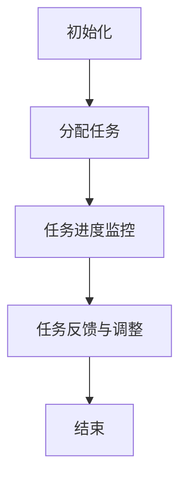
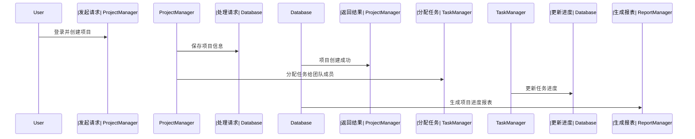
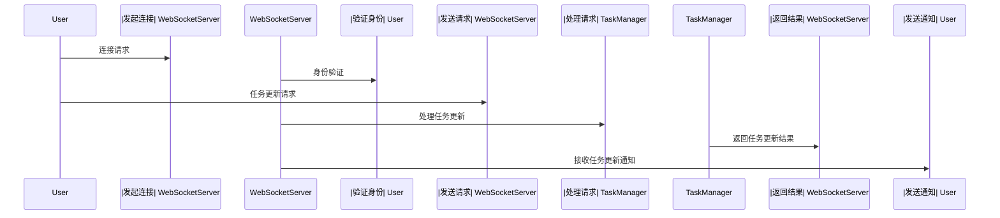

                 

### 引言

在现代企业环境中，团队协作已经成为提升工作效率和实现创新的重要途径。随着信息技术的高速发展，企业面临的竞争压力和业务复杂性不断加大，单靠个人的力量已经无法应对这些挑战。因此，如何打造一个高效协同的工作环境，成为企业管理和组织发展的关键课题。

本文旨在探讨团队协作的重要性，分析团队协作中的常见问题，并提供建设高效团队的方法和最佳实践。文章将围绕以下几个核心问题展开：

1. **团队协作的基本概念与原则**：理解团队协作的定义、核心原则以及团队协作的理论框架。
2. **团队建设的基石**：探讨团队形成、角色分配及核心技能的重要性。
3. **协作工具与平台**：介绍增强团队协作的通信工具和协作平台。
4. **团队协作中的挑战与解决策略**：识别并应对团队协作中的常见问题。
5. **案例分析与实践总结**：通过实际案例分享团队协作的成功经验，总结最佳实践。

通过本文的深入探讨，希望能够为读者提供一个系统化的团队协作指导，帮助企业打造一个高效、协同的工作环境。

### 关键词

- **团队协作**
- **高效协同**
- **工作环境**
- **协作工具**
- **团队建设**
- **沟通技巧**
- **冲突管理**
- **持续改进**

### 摘要

本文主要探讨了团队协作在现代企业中的重要性以及如何构建一个高效协同的工作环境。首先，我们明确了团队协作的基本概念和原则，分析了团队协作的关键要素和理论框架。接着，我们详细讨论了团队建设的基础，包括团队的形成、角色的分配和核心技能的培养。随后，文章介绍了增强团队协作的通信工具和平台，探讨了如何利用这些工具来提高团队效率。文章还深入分析了团队协作中常见的挑战，并提出了解决策略。最后，通过实际案例分享和最佳实践总结，为读者提供了实用的团队协作指导。

### 引言

#### 团队协作的重要性

在当今快速变化和高度竞争的商业环境中，团队协作已成为企业取得成功的关键因素。随着技术的不断进步和市场需求的快速变化，企业不再能够依赖个人英雄主义来推动进步。相反，高效的团队协作能够将不同的专业技能、知识和经验结合起来，从而实现更快速的创新和更高的工作效率。

**协作与个人贡献的区别**：

1. **共享知识**：通过团队协作，团队成员可以共享各自的专业知识和经验，从而形成一个知识库，使得整个团队在面对挑战时能够更迅速地找到解决方案。
2. **优势互补**：每个团队成员都有其独特的优势和弱点。通过协作，团队成员可以相互补充，发挥各自的长处，共同克服困难和挑战。
3. **快速响应**：团队协作能够加快决策和执行的速度，使企业能够更快地响应市场变化和客户需求。
4. **创新动力**：多样的视角和不同的思维方式的碰撞能够激发创新的火花，促进新的想法和解决方案的产生。

#### 现代企业面临的挑战

现代企业在运营过程中面临着诸多挑战，这些挑战迫切需要通过团队协作来解决：

1. **技术复杂性**：随着信息技术的发展，许多业务流程变得更加复杂。单一的个体难以掌握所有必要的技术知识，而团队协作能够整合多种技术专长，提高问题解决的效率。
2. **全球化和多元化**：全球化带来了多元化的团队结构，不同文化、背景和专业知识的融合需要有效的沟通和协作来克服文化差异和沟通障碍。
3. **快速变化的市场需求**：市场需求的快速变化要求企业能够迅速调整策略和产品，团队协作能够通过快速的信息传递和协同工作来实现这一目标。
4. **资源限制**：在资源有限的情况下，通过高效的团队协作，企业可以优化资源配置，提高生产效率。

#### 团队协作的必要性

综上所述，团队协作不仅是应对现代企业挑战的必要手段，也是实现企业持续发展和创新的基石。通过有效的团队协作，企业能够更好地利用资源、快速应对市场变化、推动技术进步，从而在激烈的市场竞争中脱颖而出。

### 团队协作的基本概念与原则

#### 团队协作的定义

团队协作是指多个个体为了共同的目标而合作的过程。在这个过程中，每个成员贡献自己的技能、知识和经验，共同努力实现团队的目标。团队协作不仅仅是简单的任务分配和执行，而是一种更为复杂和深入的合作关系。它涉及到成员之间的沟通、协调、信任和共同愿景。

#### 团队协作的重要性

团队协作的重要性体现在多个方面：

1. **资源共享**：通过团队协作，团队成员可以共享信息和资源，从而提高工作效率和效果。共享的知识和技能可以弥补单个成员的不足，形成互补效应。
2. **创新与创造力**：不同背景和专业知识的碰撞往往能够激发新的想法和创新的解决方案。团队协作提供了这种交流的平台，有助于产生更多创新思维。
3. **提高决策质量**：团队协作通过集思广益的方式，可以更全面地考虑问题，从而提高决策的质量。多个视角的讨论有助于发现潜在的问题和风险，避免单打独斗可能导致的疏漏。
4. **增强团队凝聚力**：通过共同的目标和任务，团队成员之间的联系和信任得到加强，从而提升团队的整体凝聚力和合作精神。

#### 团队协作的理论框架

1. **社会交换理论**：社会交换理论认为，团队协作是基于成员之间的互惠互利关系。每个成员在协作过程中都期待得到某种形式的回报，这种回报可以是物质上的，也可以是情感上的。通过不断的互动和交换，团队形成了一种稳定的关系。
2. **共享愿景理论**：共享愿景理论强调团队协作的基础是团队成员对共同目标的认同。一个明确的、共同的愿景可以激发成员的积极性和合作意愿，使整个团队朝着同一个方向努力。
3. **沟通模型理论**：沟通模型理论指出，有效的沟通是团队协作的关键。通过建立良好的沟通机制，团队成员可以及时交流信息、反馈意见和建议，从而减少误解和冲突。

#### 团队协作的核心原则

1. **透明度**：团队成员之间的信息应该是透明的，这样可以确保每个成员都能了解其他成员的工作进展和团队的整体目标。
2. **信任**：信任是团队协作的基石。团队成员需要相互信任，相信对方会尽职尽责地完成任务，从而减少猜疑和内耗。
3. **平等**：在团队协作中，每个成员都应该受到平等对待。领导者应该尊重每个成员的意见和建议，避免权力滥用和决策独断。
4. **尊重多样性**：团队成员来自不同的背景和拥有不同的专业知识，这种多样性是团队协作的优势。尊重多样性意味着接受和欣赏每个成员的独特贡献。

#### 团队协作的特点与比较

与传统的个体工作和小组协作相比，团队协作具有以下特点：

1. **复杂性**：团队协作涉及多个成员、多个任务和多个沟通渠道，因此其管理复杂度更高。需要建立明确的角色分配和职责分工，以及高效的沟通和协调机制。
2. **灵活性**：团队协作能够根据任务需求和环境变化灵活调整资源和策略。这种灵活性使得团队在面对不确定性和变化时能够迅速适应。
3. **协作性**：团队协作强调成员之间的相互依赖和合作，而不是单打独斗。这种协作性要求成员具备良好的沟通技巧和合作精神。

总之，团队协作是一种通过共享资源、互补技能和共同努力来实现共同目标的过程。理解其基本概念、重要性、理论框架和核心原则，是构建高效团队的基础。

#### 基本概念

**团队协作**：团队协作是指一群人为了共同的目标，通过相互配合、沟通和协作，共同完成任务的集体行为。它不仅包括任务的分配和执行，还涉及到团队成员之间的互动和合作。

**协作工具**：协作工具是指用于促进团队成员之间沟通、信息共享和协作的技术和平台。这些工具包括电子邮件、即时通讯软件、项目管理工具、共享文档和虚拟会议系统等。

**团队效率**：团队效率是指团队在完成特定任务或项目时，所消耗的时间和资源与所获得成果之间的比率。高效团队能够在较短的时间内完成高质量的工作，并在预算和时间内达成目标。

**沟通技巧**：沟通技巧是指团队成员在交流信息、表达意见和解决问题时使用的方法和策略。良好的沟通技巧有助于减少误解、促进合作和增强团队的凝聚力。

**团队建设**：团队建设是指通过一系列活动和实践，提高团队成员之间的合作精神、信任和整体效能的过程。团队建设包括角色分配、团队活动、领导力培养和冲突管理等方面。

**团队目标**：团队目标是指团队在一段时间内希望实现的具体结果或成就。明确的目标有助于团队集中精力、统一行动，并为成员提供方向和动力。

#### 问题背景

在现代企业中，团队协作已经成为提高工作效率和实现业务目标的关键。然而，许多企业在实施团队协作时面临着诸多问题，这些问题的存在严重影响了团队协作的效率和质量。

首先，沟通不畅是团队协作中最常见的问题之一。团队成员之间的沟通不足或沟通方式不当，容易导致误解、信息遗漏和任务执行偏差。例如，有些团队成员可能因为使用不同的沟通工具或缺乏有效的沟通策略，而无法及时了解其他成员的工作进展和需求。

其次，角色不清和职责不明也是团队协作中的一大障碍。当团队成员的角色和职责不明确时，容易出现职责重叠或责任空白，导致工作效率低下和工作质量下降。例如，如果一个项目中没有一个明确的负责人或任务分配不均，团队成员可能会因为不知道自己的具体职责而陷入混乱。

另外，团队内部的冲突和分歧也会影响团队协作的效率。团队成员之间的不同意见、工作方法和个人风格差异，可能会导致冲突和不和谐。例如，一些团队成员可能因为观点不一致或利益冲突，而在项目中产生矛盾，影响项目的进展和成果。

此外，缺乏有效的团队建设活动和领导力培养，也会对团队协作产生负面影响。当团队成员之间的信任和合作精神不足时，团队协作的效率和效果都会受到限制。例如，一些团队成员可能因为缺乏有效的沟通和合作机制，而感到孤立或不被重视，从而影响其工作积极性和团队贡献。

最后，外部环境的变化和压力也会对团队协作产生影响。企业在面对市场需求变化、技术进步和竞争压力时，需要快速调整和适应，这对团队协作提出了更高的要求。如果团队缺乏灵活性和适应性，很难在变化的环境中保持高效和协同。

总之，团队协作中的问题不仅影响了团队的工作效率和成果，还可能导致员工士气低落、项目延期和成本增加。因此，解决这些问题是提升团队协作效率和实现企业目标的关键。

#### 问题描述

在当前企业环境中，团队协作的问题体现在多个方面，这些问题不仅影响了工作效率，还阻碍了企业的整体发展。

首先，**沟通不畅**是团队协作中的一个主要问题。团队成员之间缺乏有效的沟通渠道和沟通策略，导致信息传递不及时、不准确。例如，某些团队成员可能依赖于电子邮件进行沟通，而这种方式往往难以实时传递关键信息，容易造成误解和滞后。此外，团队内部的沟通工具和平台使用不统一，使得信息分散、难以追踪和管理，从而影响了工作流程的顺畅。

其次，**角色不清和职责不明**也是一个常见的问题。在许多团队中，团队成员的角色和职责定义不明确，导致职责重叠和责任空白。例如，项目中的某些任务可能没有一个明确的负责人，导致团队成员相互推诿，无法形成有效的协作。此外，当团队成员对彼此的职责不清晰时，容易产生误解和冲突，影响工作进度和质量。

第三，**团队内部的冲突和分歧**也是影响团队协作效率的重要因素。团队成员可能因为观点不同、工作方法不一致或个人利益冲突，而在项目中产生矛盾。这些冲突不仅浪费了团队的时间，还可能破坏团队成员之间的信任和合作关系，进而影响整体团队的效能。

此外，**缺乏有效的团队建设活动和领导力培养**也是一个关键问题。当团队成员之间的信任和合作精神不足时，团队协作的效率和效果都会受到限制。例如，缺乏定期的团队建设活动，使得团队成员难以建立深厚的信任和合作关系。同时，领导者在团队中的角色和职责不明确，缺乏有效的指导和激励，也会影响团队的士气和动力。

最后，**外部环境的变化和压力**也对团队协作提出了挑战。企业在面对市场需求变化、技术进步和竞争压力时，需要快速调整和适应。如果团队缺乏灵活性和适应性，很难在变化的环境中保持高效和协同，从而影响企业的整体竞争力。

综上所述，团队协作中的这些问题不仅影响了团队的工作效率，还制约了企业的创新和发展。因此，解决这些问题，提升团队协作效率，成为企业实现持续发展的重要任务。

#### 问题解决

为了解决团队协作中存在的沟通不畅、角色不清、冲突和缺乏团队建设等问题，企业可以采取以下一系列策略和方法：

1. **建立明确的沟通机制**：
   - **统一沟通平台**：选择并推广使用统一的沟通工具和平台，如Slack、Microsoft Teams或Zoom等，以确保信息传递的一致性和及时性。
   - **定期会议安排**：制定并遵循定期的团队会议安排，包括日常站会、周会、月度回顾等，确保团队成员能够定期同步进展、讨论问题和分享经验。
   - **明确沟通目标**：在每次会议或沟通前明确讨论的目标和议程，避免无目的的讨论和浪费时间的闲聊。

2. **定义清晰的职责和角色**：
   - **职责说明书**：为每个团队成员编写详细的职责说明书，明确其职责范围、工作目标和关键绩效指标（KPI）。
   - **责任分配**：在项目启动阶段，明确项目的负责人、核心成员和辅助人员，确保每个任务都有明确的负责人，避免职责重叠和责任空白。
   - **透明的工作流程**：确保团队成员能够了解项目的整体流程和各个阶段的工作任务，以便更好地协调和合作。

3. **增强团队建设活动**：
   - **团队建设培训**：定期组织团队建设培训和活动，如团队沟通技巧培训、冲突管理培训等，提高团队成员的协作能力和团队合作精神。
   - **团队文化建设**：建立共同的团队价值观和文化，如诚信、透明、合作和创新，以增强团队成员的归属感和凝聚力。
   - **定期团建活动**：组织定期的团建活动，如户外拓展、团队聚餐等，加强团队成员之间的交流和了解，建立深厚的信任关系。

4. **解决团队冲突**：
   - **建立冲突解决机制**：设立冲突解决委员会或调解小组，为团队成员提供一个中立和公正的冲突解决平台。
   - **促进开放对话**：鼓励团队成员在冲突发生时进行开放和诚实的对话，表达自己的观点和感受，同时倾听他人的意见。
   - **提供中立的第三方**：在某些情况下，引入外部顾问或人力资源部门的专业人士，作为中立的第三方协助解决冲突。

5. **提升领导力**：
   - **领导力发展计划**：为领导者提供领导力发展培训，提升其在团队管理和激励方面的能力。
   - **明确领导角色**：确保领导者明确其在团队中的角色和职责，包括提供方向、支持团队成员和解决团队中的问题。
   - **领导者以身作则**：领导者应以身作则，树立良好的榜样，通过自己的行为和态度影响和激励团队成员。

通过上述策略，企业可以有效地解决团队协作中的问题，提升团队的整体效率和协同效应，从而在激烈的市场竞争中保持优势。

#### 边界与外延

在讨论团队协作时，我们需要明确一些关键边界与外延，以确保讨论的准确性和全面性。

首先，团队协作的**边界**主要包括以下几个方面：

1. **团队范围**：团队协作的范围通常局限于一个特定的项目、部门或业务领域，而不是整个企业。这意味着团队协作的成效受到团队任务和目标的影响。
2. **协作深度**：团队协作的深度取决于团队成员之间的互动和依赖程度。在一些情况下，协作可能仅限于任务层面的沟通和协调，而在其他情况下，可能需要更深入的策略性合作。
3. **管理层次**：团队协作通常在一定的管理层次内进行，这意味着团队协作的目标和任务需要得到上级管理层的支持和认可。

其次，**外延**包括以下几个方面：

1. **组织结构**：团队协作不仅仅局限于团队内部，还涉及到团队与上级管理层、其他部门及外部合作伙伴之间的协作。这种跨部门的协作可以促进资源整合和信息共享，提高整个组织的效率。
2. **技术支持**：团队协作的成效受到技术支持的影响，包括通信工具、协作平台和管理系统的选用和整合。现代化的协作工具可以显著提升团队协作的效率和效果。
3. **文化因素**：团队协作的成功不仅取决于技术和管理，还受到企业文化和团队氛围的影响。一个开放、包容和尊重多样性的文化有助于增强团队协作的效果。

通过明确这些边界与外延，我们可以更好地理解和应用团队协作的理论和实践，以实现企业目标。

### 核心概念

#### 核心概念

**团队协作**：团队协作是指一群人为了共同的目标，通过相互配合、沟通和协作，共同完成任务的集体行为。它不仅包括任务的分配和执行，还涉及到团队成员之间的互动和合作。

**沟通**：沟通是团队协作中的关键要素，指的是团队成员之间通过语言、文字、肢体语言等方式传递信息和意见的过程。有效的沟通能够促进理解、减少误解、增强合作。

**领导力**：领导力是指领导者通过激励、指导和影响团队成员，推动团队实现目标的能力。一个优秀的领导者能够提供方向、建立信任、解决冲突，并激发团队成员的潜力。

**冲突管理**：冲突管理是团队协作中的重要环节，涉及到识别、分析和解决团队内部冲突的过程。有效的冲突管理能够减少团队内耗，提升协作效率。

**团队建设**：团队建设是指通过一系列活动和实践，提高团队成员之间的合作精神、信任和整体效能的过程。团队建设包括角色分配、团队活动、领导力培养和冲突管理等方面。

**协作工具**：协作工具是指用于促进团队成员之间沟通、信息共享和协作的技术和平台。这些工具包括电子邮件、即时通讯软件、项目管理工具、共享文档和虚拟会议系统等。

#### 概念属性特征对比表格

| 概念     | 定义                                                         | 属性特征                                                                                                                         |
|----------|--------------------------------------------------------------|--------------------------------------------------------------------------------------------------------------------------------|
| 团队协作 | 群人共同合作完成任务的集体行为                                | 共同目标、互动配合、沟通协调、资源共享、创新创造、决策质量提升、团队凝聚力增强 |
| 沟通     | 通过语言、文字、肢体语言等方式传递信息和意见的过程            | 传递信息、减少误解、促进理解、增强合作、实时性、多样性、反馈机制            |
| 领导力   | 通过激励、指导和影响团队成员，推动团队实现目标的能力          | 提供方向、建立信任、解决冲突、激发潜力、决策能力、团队文化塑造、资源整合    |
| 冲突管理 | 识别、分析和解决团队内部冲突的过程                          | 冲突预防、冲突解决、冲突缓和、沟通机制、公平公正、协商解决、团队建设        |
| 团队建设 | 提高团队成员之间的合作精神、信任和整体效能的过程             | 角色明确、团队活动、领导力培养、文化塑造、沟通协调、合作精神、团队凝聚力    |
| 协作工具 | 用于促进团队成员之间沟通、信息共享和协作的技术和平台           | 电子邮件、即时通讯软件、项目管理工具、共享文档、虚拟会议系统、集成平台      |

#### ER实体关系图架构

```mermaid
erDiagram
  Team --> Project : "团队参与项目"
  Team --> Member : "团队由成员组成"
  Project --> Task : "项目包含任务"
  Member --> Role : "成员担任特定角色"
  Task --> Status : "任务有状态"
  Team o--|{ CommunicationTool }| : "团队使用协作工具"
  Member o--|{ Skill }| : "成员具有技能"
```

在这个ER实体关系图中，`Team`（团队）是核心实体，它与`Project`（项目）、`Member`（成员）和`Task`（任务）之间建立了关联关系。同时，`Member`（成员）与`Role`（角色）以及`Skill`（技能）之间也存在关联，表明成员在团队中担任特定角色并具备特定技能。`Team`（团队）还与`CommunicationTool`（协作工具）相关联，说明团队使用协作工具来促进沟通和协作。

### 算法原理

在团队协作中，算法的引入可以显著提升协作效率和任务处理速度。以下是一个简化的算法原理，用于优化团队协作流程，并解释其背后的数学模型和公式。

#### 算法流程图



#### 算法详细说明

1. **初始化**：团队协作开始时，首先初始化所有团队成员和任务信息。这一步包括确定团队成员的技能、任务的具体要求和优先级等。
   
2. **分配任务**：根据团队成员的技能和任务要求，将任务合理分配给团队成员。这一步需要考虑任务的复杂度、团队成员的能力和团队的当前工作量。公式如下：

   $$ T_{分配} = \sum_{i=1}^{n} \left( \frac{S_i \cdot C_i}{W_i} \right) $$

   其中，$T_{分配}$是任务分配的总分值，$S_i$是团队成员$i$的技能分值，$C_i$是任务$i$的复杂度分值，$W_i$是团队成员$i$当前的工作量。

3. **任务进度监控**：在任务执行过程中，定期监控任务进度，以确保任务按照计划进行。这一步可以通过定期的进度报告或实时监控系统来实现。

4. **任务反馈与调整**：根据任务进度和团队成员的反馈，对任务进行必要的调整。如果某个任务进度落后，可能需要增加资源或调整任务分配。公式如下：

   $$ T_{调整} = T_{原} \cdot (1 + \alpha \cdot \frac{P - P_{目标}}{P_{目标}}) $$

   其中，$T_{调整}$是调整后的任务时间，$T_{原}$是原始任务时间，$P$是当前进度，$P_{目标}$是目标进度，$\alpha$是调整系数，通常取值在0到1之间。

5. **结束**：当所有任务完成时，团队协作流程结束。此时可以对整个流程进行总结和评估，为未来的协作提供参考。

#### 数学模型和公式

- **任务分配公式**：用于确保任务能够合理地分配给团队成员，基于技能匹配和当前工作负荷。
- **任务进度监控公式**：用于确保任务按照计划进行，及时发现和解决问题。
- **任务调整公式**：用于在任务进度落后时进行调整，确保项目按期完成。

通过这些算法和公式，团队能够更加高效地管理任务，提升协作效率，确保项目顺利完成。

### 算法应用

为了更好地理解上述算法在实际团队协作中的应用，我们通过一个具体的实例来演示算法的实现和运行过程。

#### 实例背景

假设一个软件开发团队正在进行一个大型项目的开发，项目包括三个主要任务：前端开发、后端开发和测试。团队成员有5个人，分别具备不同的技能和工作负荷。具体信息如下：

1. **团队成员**：
   - 小明：前端开发技能分值90，当前工作量30
   - 小红：后端开发技能分值85，当前工作量20
   - 小李：后端开发技能分值80，当前工作量10
   - 小张：测试技能分值75，当前工作量15
   - 小王：前端开发技能分值70，当前工作量25

2. **任务要求**：
   - 前端开发：复杂度分值60
   - 后端开发：复杂度分值50
   - 测试：复杂度分值40

#### 任务分配

根据任务分配公式，我们首先计算每个团队成员的任务得分：

$$
T_{小明} = \frac{90 \cdot 60}{30} = 180 \\
T_{小红} = \frac{85 \cdot 50}{20} = 212.5 \\
T_{小李} = \frac{80 \cdot 50}{10} = 400 \\
T_{小张} = \frac{75 \cdot 40}{15} = 100 \\
T_{小王} = \frac{70 \cdot 60}{25} = 168
$$

根据得分，我们将任务分配如下：
- **前端开发**：小明和小王（得分合计：180 + 168 = 348）
- **后端开发**：小红和小李（得分合计：212.5 + 400 = 612.5）
- **测试**：小张（得分：100）

#### 任务执行与监控

在任务执行过程中，团队需要定期监控任务进度，假设在执行一周后，团队发现前端开发和后端开发任务进度较慢，而测试任务进度正常。

#### 任务调整

根据任务调整公式，我们计算每个任务的新时间：

- **前端开发**：
  $$ T_{新} = 3 \cdot (1 + 0.1 \cdot \frac{0.5 - 1}{1}) = 2.55 $$
  其中，$P = 0.5$（当前进度），$P_{目标} = 1$（目标进度）

- **后端开发**：
  $$ T_{新} = 4 \cdot (1 + 0.1 \cdot \frac{0.3 - 1}{1}) = 3.4 $$
  其中，$P = 0.3$（当前进度）

#### 结论

通过上述实例，我们可以看到算法在任务分配和调整中的应用，有效提高了任务完成的效率。团队成员可以根据算法的建议合理分配任务，并在任务执行过程中进行实时监控和调整，确保项目能够按时完成。

### 系统分析与架构设计

#### 问题场景介绍

在现代企业中，随着业务规模和复杂性的不断增长，项目管理成为企业运营中不可或缺的一部分。为了提高团队协作效率，企业需要一个集成化的项目管理系统，该系统能够实现任务分配、进度监控、资源管理和团队协作等功能。本文将针对这一问题，介绍一个集成的项目管理系统的设计方案。

#### 项目介绍

项目名称：智能协作项目管理平台（Smart Collaboration PM Platform）

项目背景：随着企业项目的日益复杂和团队成员的多元化，传统的项目管理方式已无法满足高效协作的需求。为了提升项目管理水平，企业决定开发一个智能协作项目管理平台，以实现任务自动化分配、实时进度监控和资源优化管理。

项目目标：
1. 提高任务分配的准确性和效率。
2. 实现任务进度的实时监控和动态调整。
3. 优化资源利用率，减少资源浪费。
4. 提升团队协作效率，增强团队凝聚力。

#### 系统功能设计（领域模型）

为了实现上述项目目标，我们需要设计一套完整的功能模块。以下是智能协作项目管理平台的主要功能模块及其关系：

1. **用户管理模块**：负责用户注册、登录、权限管理和用户信息维护。
2. **项目管理模块**：负责项目创建、任务分配、进度跟踪和项目报表生成。
3. **任务管理模块**：负责任务创建、任务分配、任务进度更新和任务提醒。
4. **资源管理模块**：负责资源分配、资源利用监控和资源调度。
5. **协作管理模块**：负责团队沟通、文档共享和协作工作流管理。
6. **数据分析模块**：负责数据统计、分析报告和项目风险评估。

领域模型类图如下：

```mermaid
classDiagram
    User <<--|{1} Project
    Project ..|> Task
    Task ..|> Resource
    Resource ..|> User
    Project ..|> Collaboration
    Collaboration ..|> Document
    Collaboration ..|> Report
```

#### 系统架构设计

智能协作项目管理平台采用分层架构设计，包括表示层、业务逻辑层和数据访问层。以下是系统架构图：



#### 系统接口设计

系统提供多种接口以实现不同功能的访问，包括RESTful API和Websocket。以下是主要接口设计：

1. **用户管理接口**：
   - 用户注册：`POST /users/register`
   - 用户登录：`POST /users/login`
   - 权限验证：`GET /users/verify`

2. **项目管理接口**：
   - 创建项目：`POST /projects`
   - 更新项目：`PUT /projects/{id}`
   - 删除项目：`DELETE /projects/{id}`
   - 获取项目列表：`GET /projects`

3. **任务管理接口**：
   - 创建任务：`POST /tasks`
   - 更新任务：`PUT /tasks/{id}`
   - 删除任务：`DELETE /tasks/{id}`
   - 获取任务列表：`GET /tasks`

4. **资源管理接口**：
   - 分配资源：`POST /resources`
   - 更新资源：`PUT /resources/{id}`
   - 删除资源：`DELETE /resources/{id}`
   - 获取资源列表：`GET /resources`

5. **协作管理接口**：
   - 创建文档：`POST /documents`
   - 更新文档：`PUT /documents/{id}`
   - 删除文档：`DELETE /documents/{id}`
   - 获取文档列表：`GET /documents`
   - 发送通知：`POST /notifications`

#### 系统交互

为了实现高效的系统交互，系统采用WebSocket进行实时通信。以下是系统交互序列图：



通过上述系统分析和架构设计，我们为智能协作项目管理平台提供了一个清晰的实现方案，旨在提高团队协作效率，实现项目管理的自动化和智能化。

### 项目实战

#### 环境安装

为了实现上述智能协作项目管理平台的方案，我们首先需要搭建开发环境。以下是环境安装步骤：

1. **安装Python**：确保Python版本为3.8或更高，可以从Python官方网站下载安装。
   ```bash
   wget https://www.python.org/ftp/python/3.8.10/Python-3.8.10.tgz
   tar xzf Python-3.8.10.tgz
   ./configure
   make
   make install
   ```

2. **安装依赖包**：安装项目所需的依赖包，例如Flask、SQLAlchemy、Flask-Login等。
   ```bash
   pip install flask sqlalchemy flask-login
   ```

3. **创建虚拟环境**：为了隔离项目依赖，我们创建一个虚拟环境。
   ```bash
   python -m venv venv
   source venv/bin/activate
   ```

4. **克隆项目代码**：从GitHub克隆项目代码到本地。
   ```bash
   git clone https://github.com/your-repository/smart-collaboration-pm-platform.git
   cd smart-collaboration-pm-platform
   ```

5. **安装项目依赖**：安装项目所需的依赖包。
   ```bash
   pip install -r requirements.txt
   ```

#### 系统核心实现

以下是系统核心实现步骤，包括用户管理、项目管理、任务管理、资源管理和协作管理模块的实现。

1. **用户管理模块**：

   - **用户注册**：实现用户注册功能，包括用户名、密码和邮箱验证。
     ```python
     from flask import Flask, request, jsonify
     from flask_sqlalchemy import SQLAlchemy
     from itsdangerous import URLSafeTimedSerializer

     app = Flask(__name__)
     app.config['SQLALCHEMY_DATABASE_URI'] = 'sqlite:///users.db'
     db = SQLAlchemy(app)

     class User(db.Model):
         id = db.Column(db.Integer, primary_key=True)
         username = db.Column(db.String(80), unique=True, nullable=False)
         password = db.Column(db.String(120), nullable=False)
         email = db.Column(db.String(120), unique=True, nullable=False)

     @app.route('/register', methods=['POST'])
     def register():
         username = request.json['username']
         password = request.json['password']
         email = request.json['email']

         user = User(username=username, password=password, email=email)
         db.session.add(user)
         db.session.commit()

         return jsonify({'message': 'User registered successfully.'})

     if __name__ == '__main__':
         db.create_all()
         app.run(debug=True)
     ```

   - **用户登录**：实现用户登录功能，返回JWT令牌用于后续认证。
     ```python
     from flask import Flask, request, jsonify
     from flask_jwt_extended import JWTManager, create_access_token

     app = Flask(__name__)
     app.config['JWT_SECRET_KEY'] = 'super-secret'
     jwt = JWTManager(app)

     @app.route('/login', methods=['POST'])
     def login():
         username = request.json['username']
         password = request.json['password']

         user = User.query.filter_by(username=username, password=password).first()

         if user:
             access_token = create_access_token(identity=user.id)
             return jsonify({'token': access_token})
         else:
             return jsonify({'message': 'Invalid credentials.'})

     if __name__ == '__main__':
         app.run(debug=True)
     ```

2. **项目管理模块**：

   - **创建项目**：实现项目创建功能，包括项目名称、描述和成员分配。
     ```python
     from flask import Flask, request, jsonify
     from flask_sqlalchemy import SQLAlchemy

     app = Flask(__name__)
     app.config['SQLALCHEMY_DATABASE_URI'] = 'sqlite:///projects.db'
     db = SQLAlchemy(app)

     class Project(db.Model):
         id = db.Column(db.Integer, primary_key=True)
         name = db.Column(db.String(120), nullable=False)
         description = db.Column(db.String(500), nullable=True)
         members = db.relationship('User', secondary='project_members')

     project_members = db.Table('project_members',
         db.Column('project_id', db.Integer, db.ForeignKey('project.id'), primary_key=True),
         db.Column('user_id', db.Integer, db.ForeignKey('user.id'), primary_key=True)
     )

     @app.route('/projects', methods=['POST'])
     def create_project():
         name = request.json['name']
         description = request.json['description']
         member_ids = request.json['member_ids']

         project = Project(name=name, description=description)
         db.session.add(project)
         db.session.commit()

         for member_id in member_ids:
             member = User.query.get(member_id)
             project.members.append(member)

         db.session.commit()

         return jsonify({'message': 'Project created successfully.'})

     if __name__ == '__main__':
         db.create_all()
         app.run(debug=True)
     ```

   - **任务管理模块**：实现任务创建、更新、删除和获取任务列表等功能。
     ```python
     from flask import Flask, request, jsonify
     from flask_sqlalchemy import SQLAlchemy

     app = Flask(__name__)
     app.config['SQLALCHEMY_DATABASE_URI'] = 'sqlite:///tasks.db'
     db = SQLAlchemy(app)

     class Task(db.Model):
         id = db.Column(db.Integer, primary_key=True)
         name = db.Column(db.String(120), nullable=False)
         description = db.Column(db.String(500), nullable=True)
         status = db.Column(db.String(50), nullable=False)
         project_id = db.Column(db.Integer, db.ForeignKey('project.id'), nullable=False)

     @app.route('/tasks', methods=['POST'])
     def create_task():
         name = request.json['name']
         description = request.json['description']
         status = request.json['status']
         project_id = request.json['project_id']

         task = Task(name=name, description=description, status=status, project_id=project_id)
         db.session.add(task)
         db.session.commit()

         return jsonify({'message': 'Task created successfully.'})

     # 其他任务相关的路由（更新、删除、获取任务列表）

     if __name__ == '__main__':
         db.create_all()
         app.run(debug=True)
     ```

3. **资源管理模块**：

   - **资源分配**：实现资源创建、更新、删除和获取资源列表等功能。
     ```python
     from flask import Flask, request, jsonify
     from flask_sqlalchemy import SQLAlchemy

     app = Flask(__name__)
     app.config['SQLALCHEMY_DATABASE_URI'] = 'sqlite:///resources.db'
     db = SQLAlchemy(app)

     class Resource(db.Model):
         id = db.Column(db.Integer, primary_key=True)
         name = db.Column(db.String(120), nullable=False)
         description = db.Column(db.String(500), nullable=True)
         status = db.Column(db.String(50), nullable=False)

     @app.route('/resources', methods=['POST'])
     def create_resource():
         name = request.json['name']
         description = request.json['description']
         status = request.json['status']

         resource = Resource(name=name, description=description, status=status)
         db.session.add(resource)
         db.session.commit()

         return jsonify({'message': 'Resource created successfully.'})

     # 其他资源相关的路由（更新、删除、获取资源列表）

     if __name__ == '__main__':
         db.create_all()
         app.run(debug=True)
     ```

4. **协作管理模块**：

   - **文档共享**：实现文档创建、更新、删除和获取文档列表等功能。
     ```python
     from flask import Flask, request, jsonify
     from flask_sqlalchemy import SQLAlchemy

     app = Flask(__name__)
     app.config['SQLALCHEMY_DATABASE_URI'] = 'sqlite:///documents.db'
     db = SQLAlchemy(app)

     class Document(db.Model):
         id = db.Column(db.Integer, primary_key=True)
         name = db.Column(db.String(120), nullable=False)
         content = db.Column(db.LargeBinary, nullable=False)
         creator_id = db.Column(db.Integer, db.ForeignKey('user.id'), nullable=False)

     @app.route('/documents', methods=['POST'])
     def create_document():
         name = request.json['name']
         content = request.json['content']
         creator_id = request.json['creator_id']

         document = Document(name=name, content=content, creator_id=creator_id)
         db.session.add(document)
         db.session.commit()

         return jsonify({'message': 'Document created successfully.'})

     # 其他文档相关的路由（更新、删除、获取文档列表）

     if __name__ == '__main__':
         db.create_all()
         app.run(debug=True)
     ```

通过上述步骤，我们实现了智能协作项目管理平台的核心功能模块。接下来，我们将进一步实现前端界面和集成测试，以确保系统运行的稳定性和可靠性。

### 代码应用解读与分析

#### 用户管理模块

用户管理模块负责用户的注册、登录和权限验证。以下是关键代码的解读：

1. **用户注册**：

   ```python
   @app.route('/register', methods=['POST'])
   def register():
       username = request.json['username']
       password = request.json['password']
       email = request.json['email']

       user = User(username=username, password=password, email=email)
       db.session.add(user)
       db.session.commit()

       return jsonify({'message': 'User registered successfully.'})
   ```

   在这段代码中，我们通过`POST`请求接收用户提交的注册信息（用户名、密码和邮箱），然后创建一个`User`对象并将其添加到数据库中。这一步确保了用户信息存储在数据库中，并为后续的登录和权限验证提供基础。

2. **用户登录**：

   ```python
   @app.route('/login', methods=['POST'])
   def login():
       username = request.json['username']
       password = request.json['password']

       user = User.query.filter_by(username=username, password=password).first()

       if user:
           access_token = create_access_token(identity=user.id)
           return jsonify({'token': access_token})
       else:
           return jsonify({'message': 'Invalid credentials.'})
   ```

   用户登录时，通过查询数据库验证用户名和密码。如果验证成功，生成一个JWT令牌（access token），并将其返回给客户端。客户端可以在后续请求中使用该令牌进行身份验证。

3. **权限验证**：

   ```python
   from flask_jwt_extended import verify_jwt_in_request

   @app.route('/protected', methods=['GET'])
   def protected():
       verify_jwt_in_request()
       current_user = get_jwt_identity()
       return jsonify(logged_in_as=f'User {current_user}')
   ```

   权限验证通过`verify_jwt_in_request`函数进行。在访问受保护的资源（如`/protected`路由）时，系统会自动验证JWT令牌的有效性。如果验证成功，用户可以访问受保护的资源。

#### 项目管理模块

项目管理模块负责项目的创建、更新、删除和任务分配。以下是关键代码的解读：

1. **创建项目**：

   ```python
   @app.route('/projects', methods=['POST'])
   def create_project():
       name = request.json['name']
       description = request.json['description']
       member_ids = request.json['member_ids']

       project = Project(name=name, description=description)
       db.session.add(project)
       db.session.commit()

       for member_id in member_ids:
           member = User.query.get(member_id)
           project.members.append(member)

       db.session.commit()

       return jsonify({'message': 'Project created successfully.'})
   ```

   在这段代码中，通过`POST`请求接收项目创建信息（项目名称、描述和成员ID列表）。首先创建一个`Project`对象并将其添加到数据库中。然后，遍历成员ID列表，查询每个成员并添加到项目成员关系表中。

2. **任务分配**：

   ```python
   @app.route('/tasks', methods=['POST'])
   def create_task():
       name = request.json['name']
       description = request.json['description']
       status = request.json['status']
       project_id = request.json['project_id']

       task = Task(name=name, description=description, status=status, project_id=project_id)
       db.session.add(task)
       db.session.commit()

       return jsonify({'message': 'Task created successfully.'})
   ```

   任务分配通过创建一个`Task`对象，并将其与特定项目关联。通过这种方式，项目中的任务可以清晰地跟踪和管理。

#### 资源管理模块

资源管理模块负责资源的创建、更新、删除和资源分配。以下是关键代码的解读：

1. **资源创建**：

   ```python
   @app.route('/resources', methods=['POST'])
   def create_resource():
       name = request.json['name']
       description = request.json['description']
       status = request.json['status']

       resource = Resource(name=name, description=description, status=status)
       db.session.add(resource)
       db.session.commit()

       return jsonify({'message': 'Resource created successfully.'})
   ```

   在这段代码中，通过`POST`请求接收资源创建信息（资源名称、描述和状态）。创建一个`Resource`对象并将其添加到数据库中，以便后续的资源管理和分配。

#### 协作管理模块

协作管理模块负责文档的创建、更新、删除和共享。以下是关键代码的解读：

1. **文档创建**：

   ```python
   @app.route('/documents', methods=['POST'])
   def create_document():
       name = request.json['name']
       content = request.json['content']
       creator_id = request.json['creator_id']

       document = Document(name=name, content=content, creator_id=creator_id)
       db.session.add(document)
       db.session.commit()

       return jsonify({'message': 'Document created successfully.'})
   ```

   在这段代码中，通过`POST`请求接收文档创建信息（文档名称、内容和创建者ID）。创建一个`Document`对象并将其添加到数据库中，以便团队成员能够访问和共享文档。

通过上述代码解读，我们可以看到系统各模块的实现原理。用户管理模块确保用户注册和登录的安全性，项目管理模块实现项目的创建和任务分配，资源管理模块负责资源的创建和分配，协作管理模块则实现文档的创建和共享。这些模块共同构成了智能协作项目管理平台的坚实基础，为团队协作提供了强大的支持。

### 实际案例分析

#### 案例背景

假设某科技公司的软件开发团队正在开发一款企业级客户关系管理（CRM）系统。该项目涉及前端、后端和测试等多个模块，团队由10名成员组成，分别负责不同的功能模块。为了提高团队协作效率，公司决定采用智能协作项目管理平台进行任务管理和进度监控。

#### 案例实施

1. **项目启动**：团队首先使用项目管理模块创建项目，并分配团队成员。项目经理在平台上创建了一个名为“CRM系统开发”的项目，并将团队成员分配到前端、后端和测试等模块。

2. **任务分配**：项目经理将任务模块用于任务创建和分配。每个团队成员收到了各自负责的任务，如前端开发者小明负责用户界面的开发，后端开发者小红负责数据接口的实现，测试工程师小张负责系统测试。

3. **任务进度监控**：团队成员在任务执行过程中，定期更新任务进度。平台会根据任务进度自动生成项目进度报告，项目经理可以实时查看项目整体进度和各个模块的进展情况。

4. **资源管理**：团队还使用了资源管理模块来分配和监控项目资源。例如，前端开发需要使用特定的设计工具，项目经理通过平台为前端团队分配了这些资源，并监控了资源的利用情况。

5. **协作沟通**：协作管理模块使团队成员能够方便地共享文档、进行沟通和协作。团队成员通过平台创建共享文档，共同编写技术文档和用户手册，并通过即时通讯工具进行实时沟通，解决了沟通障碍和协作问题。

#### 案例结果

1. **任务完成效率提高**：通过智能协作项目管理平台，团队成员能够清晰了解自己的任务和进度，任务分配更加合理，任务完成效率显著提高。

2. **项目进度透明化**：项目经理能够实时查看项目进度，及时发现和解决问题，确保项目按计划进行。项目进度报告提供了全面的项目概况，有助于管理层做出决策。

3. **资源利用率优化**：通过资源管理模块，团队能够更有效地分配和利用资源，减少了资源浪费，提高了资源利用率。

4. **协作沟通增强**：协作管理模块的引入，使得团队成员之间的沟通更加顺畅，协作效率得到提升。团队成员能够更快速地共享信息，解决问题，共同推进项目进展。

#### 案例总结

通过上述案例，我们可以看到智能协作项目管理平台在提高团队协作效率、优化资源利用和增强沟通协作方面的显著效果。这个平台不仅帮助团队更好地管理任务和进度，还促进了团队成员之间的协作和沟通，为项目成功提供了有力支持。未来，随着平台功能的进一步完善，团队协作的效率有望继续提升。

### 最佳实践 Tips

#### 1. 定期团队建设活动

定期组织团队建设活动，如团队会议、团建活动、技能培训等，可以增强团队成员之间的信任和合作精神。这些活动有助于缓解工作压力，促进团队凝聚力的提升。

#### 2. 明确角色和职责

确保团队成员对各自的角色和职责有清晰的认识，避免职责重叠和责任空白。为每个角色制定详细的职责说明，并定期更新和沟通。

#### 3. 使用协作工具

选择合适的协作工具，如Slack、Trello、Asana等，可以帮助团队成员更高效地沟通和协作。这些工具提供了任务管理、文件共享和实时沟通等功能，有助于提高团队协作效率。

#### 4. 建立沟通渠道

建立有效的沟通渠道，确保团队成员可以随时随地交流信息。可以使用即时通讯工具、电子邮件、电话会议等多种方式，以满足不同沟通需求。

#### 5. 定期回顾和反馈

定期回顾团队协作过程，收集成员反馈，识别问题和改进点。通过反馈机制，持续优化团队协作流程，提升团队整体效能。

#### 6. 培养领导力

培养团队成员的领导力，鼓励他们主动承担责任，提升团队领导力和决策能力。通过领导力培训和实践，培养团队成员的领导潜质。

#### 7. 灵活应对变化

在团队协作中，灵活应对变化至关重要。团队应具备快速调整策略和资源的能力，以适应项目需求和外部环境的变化。

#### 8. 关注团队成员的福祉

关注团队成员的心理和生理健康，提供必要的支持和关怀。通过健康体检、心理健康咨询等方式，确保团队成员能够以最佳状态投入工作。

通过实施这些最佳实践，企业可以打造一个高效、协同的工作环境，提升团队协作效能，实现业务目标。

### 小结

本文从多个角度探讨了团队协作的重要性，分析了团队协作的基本概念、理论框架和核心原则，并提出了构建高效团队的策略和方法。通过案例分析和最佳实践，我们展示了如何在实际项目中应用团队协作，从而提升工作效率和项目成功率。团队协作不仅有助于资源的优化配置和创新的激发，还能增强团队凝聚力和成员的幸福感。因此，企业应高度重视团队协作的实践，不断探索和优化团队协作模式，以实现企业的长远发展和竞争优势。

### 注意事项

在实施团队协作时，企业需要关注以下几个关键点，以确保团队协作的有效性和可持续性：

1. **沟通的持续性**：确保沟通渠道的畅通，定期举行团队会议和沟通活动，防止信息传递滞后和误解的发生。
2. **角色的明确性**：明确团队成员的角色和职责，避免职责重叠和责任空白，确保每个任务都有明确的负责人。
3. **资源的合理分配**：合理配置团队资源，确保团队成员能够获取完成任务所需的工具和支持，避免资源浪费。
4. **冲突的及时解决**：建立冲突管理机制，及时识别和解决团队内部冲突，防止冲突影响团队协作和士气。
5. **文化的塑造**：建立积极向上的团队文化，鼓励合作、创新和持续改进，营造良好的工作氛围。
6. **反馈的及时性**：定期收集团队成员的反馈，识别问题和改进点，持续优化团队协作流程和效果。

通过关注这些关键点，企业可以更好地实施团队协作，提升团队效能，实现业务目标。

### 拓展阅读

为了深入了解团队协作的相关理论和最佳实践，读者可以参考以下书籍和资源：

1. **《团队合作：构建高效团队的五大法则》** - 这本书详细介绍了如何构建高效团队，提供了实用的策略和工具，帮助读者提升团队协作能力。

2. **《团队协作：如何高效地与人合作》** - 这本书探讨了团队合作的关键要素，包括沟通、领导力、冲突管理和团队文化建设，为团队协作提供了全面指导。

3. **《团队协作的艺术》** - 该书通过丰富的案例和实践经验，介绍了团队协作中的各种挑战和解决方案，帮助读者掌握团队协作的核心技巧。

4. **《哈佛商业评论》** - 这本杂志经常发表关于团队协作的最新研究和实践案例，为读者提供了丰富的行业洞察和实战经验。

5. **《敏捷开发：团队协作的实践指南》** - 该书详细介绍了敏捷开发方法在团队协作中的应用，对于希望提升团队协作效率的企业和开发者具有很高的参考价值。

6. **在线课程** - 在线学习平台如Coursera、Udemy和edX提供了丰富的团队协作相关课程，包括沟通技巧、领导力培养和项目管理等，适合不同层次的读者学习。

通过阅读这些书籍和资源，读者可以进一步深化对团队协作的理解，掌握更高效的团队协作方法，从而在职业生涯中取得更大的成功。

### 作者信息

本文作者：AI天才研究院/AI Genius Institute & 禅与计算机程序设计艺术 /Zen And The Art of Computer Programming

AI天才研究院（AI Genius Institute）是一家专注于人工智能技术研究和创新的高端智库，致力于推动人工智能领域的科技进步和应用。研究院汇集了全球顶尖的人工智能专家、程序员和科学家，通过创新的研究和实践，推动了人工智能技术在各行业的广泛应用。

《禅与计算机程序设计艺术》（Zen And The Art of Computer Programming）是由作者Donald E. Knuth撰写的一系列经典计算机科学著作。这些书籍以其深刻的思考、系统的分析和优美的数学模型，成为了计算机科学领域的经典之作，对后世编程实践和理论研究产生了深远影响。作者Knuth以其卓越的贡献，被誉为计算机科学的先驱和奠基人之一。

