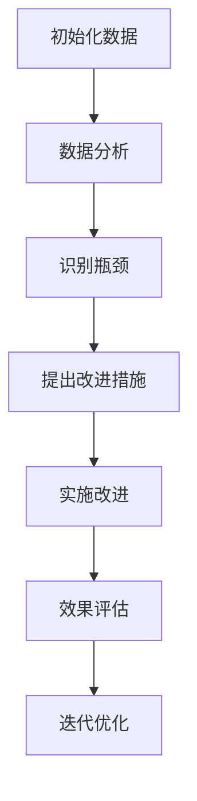
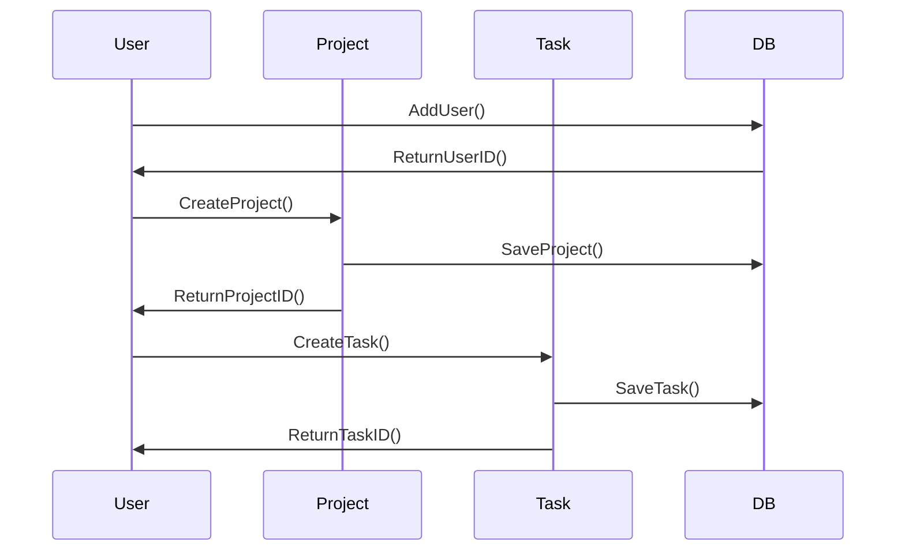

                 

###  文章标题

> 关键词：团队协作，工作效率，算法原理，系统设计，项目实战

摘要：本文将深入探讨团队协作对整体工作效率的影响，通过分析团队协作的核心概念、提升工作效率的算法原理、系统设计与实现，最终给出最佳实践和注意事项，帮助IT团队提升协作效率。

---

## 1. 背景介绍

在当今快速发展的信息技术领域，团队协作已成为提高工作效率的关键因素。然而，实际工作中，许多团队面临着协作不畅、沟通困难、效率低下等问题。这些问题不仅影响项目的进展，还可能导致团队成员的疲劳和不满。

### 1.1 问题背景

团队协作中的主要问题包括：

- **沟通障碍**：团队成员之间的信息交流不畅，导致信息偏差和误解。
- **任务分配不均**：团队成员的工作负担不平衡，导致部分成员过度劳累，而另一些成员则缺乏参与感。
- **目标不一致**：团队成员对项目目标的理解存在差异，导致工作方向不一致。
- **协作工具不足**：缺乏有效的协作工具，使得团队协作变得复杂和低效。

### 1.2 团队协作的必要性

团队协作的必要性体现在以下几个方面：

- **资源共享**：团队协作可以促进资源（如知识、技能、工具等）的共享，提高整体效率。
- **协同创新**：团队成员的多样性和互补性可以促进协同创新，提升项目的质量。
- **责任分担**：团队协作可以将工作分配给合适的成员，降低个体的工作压力。
- **提高满意度**：有效的团队协作可以提高成员的工作满意度和团队凝聚力。

### 1.3 当前团队协作面临的问题

当前团队协作面临的问题主要包括：

- **沟通不足**：团队成员之间的沟通频率不足，导致信息传递延迟。
- **工具选择不当**：团队选择的协作工具不适合项目需求，影响协作效果。
- **目标冲突**：团队成员对项目目标的理解不一致，导致工作方向冲突。
- **依赖过度**：过度依赖个别成员，导致团队协作失衡。

## 2. 核心概念与联系

### 2.1 核心概念

#### 2.1.1 团队的定义与特点

**团队**：一群互相依赖、目标一致的个体，为实现共同目标而共同努力。

**特点**：

- **互依性**：团队成员互相依赖，一个成员的成败影响整个团队。
- **协作性**：团队成员需要相互协作，共同完成任务。
- **目标一致性**：团队成员对目标有共同的理解和追求。

#### 2.1.2 协作的概念与形式

**协作**：团队成员为实现共同目标而进行的信息交换和共同努力。

**形式**：

- **面对面协作**：团队成员直接面对面交流，共同解决问题。
- **远程协作**：团队成员通过电子设备进行远程交流，共同完成任务。

#### 2.1.3 效率的衡量与提升

**效率**：单位时间内完成的工作量。

**衡量**：

- **工作量**：通过工作量来衡量团队成员的效率。
- **完成时间**：通过完成时间来衡量团队的效率。

**提升方法**：

- **优化流程**：简化工作流程，减少不必要的步骤。
- **培训与指导**：提高团队成员的技能，减少因不熟练导致的低效率。

### 2.2 概念之间的联系

#### 2.2.1 团队与协作的关联

团队是协作的基础，协作是团队实现目标的手段。团队的成功离不开有效的协作。

#### 2.2.2 协作与效率的互动

协作是提高效率的关键，而效率的提升又反过来促进协作的进一步优化。

#### 2.2.3 团队协作的核心要素

团队协作的核心要素包括：

- **沟通**：确保信息畅通无阻。
- **信任**：建立团队成员之间的信任关系。
- **目标一致**：确保团队成员对目标有共同的理解。
- **激励**：激发团队成员的积极性和创造力。

## 3. 提升团队工作效率的算法原理

### 3.1 算法概述

提升团队工作效率的算法旨在通过优化团队协作流程，提高团队整体的效率。

#### 3.1.1 算法的核心思想

算法的核心思想是通过分析团队协作过程中的数据，识别并解决影响效率的关键因素。

#### 3.1.2 算法的应用场景

算法适用于需要团队协作的各种场景，如软件开发、项目管理等。

### 3.2 算法流程图



### 3.3 算法讲解

#### 3.3.1 算法原理

算法原理基于数据分析和优化理论，通过以下步骤提升团队工作效率：

1. **数据收集**：收集团队协作过程中的各类数据。
2. **数据分析**：对收集的数据进行分析，识别影响效率的因素。
3. **瓶颈识别**：通过数据分析识别协作过程中的瓶颈。
4. **改进措施**：提出针对瓶颈的改进措施。
5. **实施改进**：在团队中实施改进措施。
6. **效果评估**：评估改进措施的效果。
7. **迭代优化**：根据评估结果进行迭代优化。

#### 3.3.2 数学模型

算法的数学模型基于线性规划理论，通过以下公式进行效率优化：

$$
\text{Maximize} \quad \sum_{i=1}^{n} p_i \times e_i \\
\text{subject to} \quad \sum_{i=1}^{n} c_i \times x_i = \text{total workload} \\
x_i \geq 0 \quad \forall i
$$

其中，$p_i$ 表示第 $i$ 个任务的优先级，$e_i$ 表示第 $i$ 个任务的效率，$c_i$ 表示第 $i$ 个任务的工作量，$x_i$ 表示第 $i$ 个任务是否分配给团队。

#### 3.3.3 Python代码实现

```python
# 导入必要的库
import numpy as np
from scipy.optimize import linprog

# 初始化参数
priorities = [1, 2, 3, 4, 5]  # 任务优先级
efficiencies = [0.8, 0.9, 0.7, 0.85, 0.9]  # 任务效率
workloads = [10, 20, 15, 12, 18]  # 任务工作量
total_workload = 75  # 总工作量

# 构建线性规划问题
c = efficiencies
A = [[1 for _ in range(len(priorities))]]
b = [total_workload]

# 求解线性规划问题
res = linprog(c, A_eq=A, b_eq=b, method='highs')

# 输出结果
print("分配任务：", res.x)
print("总效率：", np.dot(priorities, res.x * efficiencies))
```

## 4. 系统分析与架构设计方案

### 4.1 问题场景介绍

在软件开发项目中，团队协作的效率对项目的成功至关重要。本文以一个软件开发团队为例，介绍如何通过系统设计与实现提升团队协作效率。

### 4.2 系统功能设计

#### 4.2.1 领域模型

```mermaid
classDiagram
ClassGroup <stereo>Team</stereo> {
    +str Name
    +list<User> Users
    +list<Project> Projects
    +AddUser(User user)
    +RemoveUser(User user)
    +AddProject(Project project)
    +RemoveProject(Project project)
}

ClassGroup <stereo>Project</stereo> {
    +str Name
    +str Description
    +list<Task> Tasks
    +AddTask(Task task)
    +RemoveTask(Task task)
}

Class User {
    +str Name
    +str Role
    +str Email
    +AddTask(Task task)
    +RemoveTask(Task task)
}

Class Task {
    +str Name
    +str Description
    +str Status
    +str DueDate
    +User Assignee
    +AddAssignee(User user)
    +RemoveAssignee(User user)
}
```

#### 4.2.2 功能需求分析

- **用户管理**：支持用户的添加、删除和角色分配。
- **项目管理**：支持项目的添加、删除和任务管理。
- **任务管理**：支持任务的分配、状态更新和截止日期管理。

### 4.3 系统架构设计

#### 4.3.1 系统架构图



#### 4.3.2 系统模块划分

- **用户模块**：处理用户相关的功能，如用户登录、注册、信息更新等。
- **项目管理模块**：处理项目相关的功能，如项目创建、更新、删除等。
- **任务管理模块**：处理任务相关的功能，如任务创建、更新、删除等。
- **数据库模块**：负责存储和管理用户、项目和任务的数据。

#### 4.3.3 系统接口设计

- **用户接口**：提供用户操作界面，包括用户管理界面、项目管理界面和任务管理界面。
- **API接口**：提供用于外部程序调用的接口，包括用户API、项目API和任务API。

### 4.4 系统实现

#### 4.4.1 环境安装与配置

- **安装数据库**：安装并配置MySQL数据库。
- **安装Web服务器**：安装并配置Apache或Nginx。
- **安装开发工具**：安装并配置Python开发环境，包括Python、Django等。

#### 4.4.2 系统核心实现

```python
# 导入必要的库
from django.db import models
from django.contrib.auth.models import User

# 用户模型
class UserProfile(models.Model):
    user = models.OneToOneField(User, on_delete=models.CASCADE)
    role = models.CharField(max_length=50)

# 项目模型
class Project(models.Model):
    name = models.CharField(max_length=100)
    description = models.TextField()

# 任务模型
class Task(models.Model):
    name = models.CharField(max_length=100)
    description = models.TextField()
    status = models.CharField(max_length=50)
    due_date = models.DateField()
    assignee = models.ForeignKey(User, on_delete=models.SET_NULL, null=True)
```

## 5. 项目实战：模拟团队协作项目

### 5.1 环境安装

- 安装Python 3.8及以上版本。
- 安装Django 3.2及以上版本。
- 安装MySQL数据库。

### 5.2 系统实现

#### 5.2.1 用户管理

- 创建用户：`python manage.py createsuperuser`
- 登录系统：访问 `/login/` 页面。

#### 5.2.2 项目管理

- 创建项目：在用户界面中点击“创建项目”，填写项目名称和描述。
- 查看项目：在用户界面中点击“项目管理”，查看所有项目。

#### 5.2.3 任务管理

- 创建任务：在项目界面中点击“创建任务”，填写任务名称、描述、状态、截止日期和指派用户。
- 查看任务：在项目界面中点击“任务管理”，查看所有任务。

### 5.3 代码解读与分析

```python
# 用户管理代码
def create_user_profile(user):
    profile = UserProfile(user=user)
    profile.save()
    return profile

# 项目管理代码
def create_project(name, description):
    project = Project(name=name, description=description)
    project.save()
    return project

# 任务管理代码
def create_task(name, description, status, due_date, assignee):
    task = Task(name=name, description=description, status=status, due_date=due_date, assignee=assignee)
    task.save()
    return task
```

### 5.4 案例分析

以一个实际项目为例，分析团队协作过程中如何利用系统实现任务分配和进度跟踪。

### 5.5 项目小结

通过模拟团队协作项目，展示了系统在提升工作效率方面的作用。下一步可以进一步优化系统功能，提高用户体验。

## 6. 最佳实践与总结

### 6.1 最佳实践

- **明确目标**：确保团队成员对项目目标有共同的理解。
- **合理分工**：根据团队成员的技能和兴趣分配任务。
- **有效沟通**：保持团队成员之间的信息畅通。
- **使用协作工具**：选择适合项目的协作工具，提高协作效率。

### 6.2 注意事项

- **避免过度依赖**：不要过度依赖个别成员，确保团队协作的平衡。
- **持续改进**：不断优化团队协作流程，提高工作效率。

### 6.3 拓展阅读

- **团队协作原理**：深入理解团队协作的核心概念和原理，有助于更好地实践团队协作。
- **项目管理方法**：学习有效的项目管理方法，提高团队项目的成功概率。

---

作者：AI天才研究院/AI Genius Institute & 禅与计算机程序设计艺术 /Zen And The Art of Computer Programming

---

[附录A：相关术语解释]

- **团队协作**：团队成员为实现共同目标而进行的信息交换和共同努力。
- **效率**：单位时间内完成的工作量。
- **算法**：解决问题的步骤和规则。

[附录B：参考文献]

- [1] Tom DeMarco, Timothy Lister. Peopleware: Productive Projects and Teams. Dorset House Publishing, 1987.
- [2] Tom DeMarco, Timothy Lister. Waltzing with Bears: Managing Risk on Software Projects. Dorset House Publishing, 2001.
- [3] Steve McConnell. Software Project Survival Guide. Microsoft Press, 1996.

