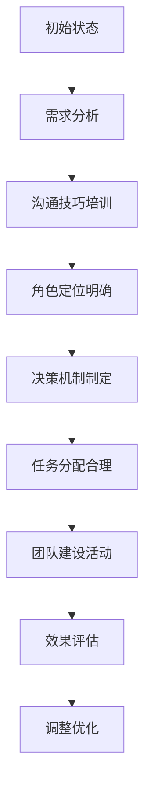
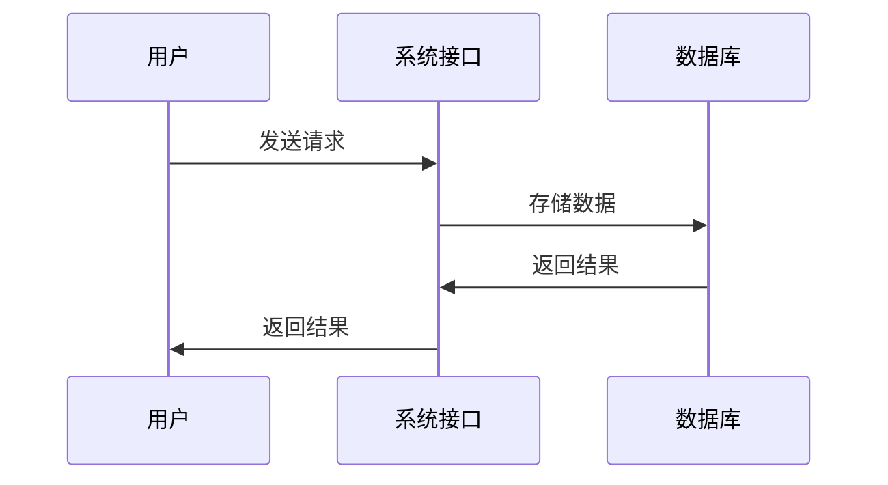

                 

### 文章标题：团队协作：提升集体智慧的方法

#### 关键词：团队协作，集体智慧，方法，效率，沟通，决策

> 摘要：本文旨在探讨团队协作在提升集体智慧方面的作用，通过深入分析团队协作中的核心概念、联系以及算法原理，为读者提供一套系统化的提升集体智慧的方法。本文结构分为三个部分：背景介绍，核心概念与联系，算法原理讲解。希望通过本文，读者能够更好地理解团队协作的重要性，掌握提升集体智慧的实用技巧。

## 第二部分：核心概念与联系

### 1. 核心概念原理

#### 2.1 沟通技巧

沟通技巧是团队协作的基础。在团队中，成员之间需要通过有效的沟通来分享信息、协调工作。良好的沟通技巧包括以下几个方面：

- **明确表达**：在沟通中，成员应该清晰、准确地表达自己的想法和意见，避免歧义。
- **倾听**：倾听是沟通的重要环节。通过倾听，成员可以更好地理解对方的观点，从而进行有效的沟通。
- **反馈**：在沟通过程中，成员应该给予及时的反馈，以便对方了解自己的观点和理解。

#### 2.2 角色定位

角色定位是团队协作的关键。在团队中，每个成员都应该明确自己的角色和职责，以确保团队工作的有序进行。角色定位包括以下几个方面：

- **职责明确**：每个成员都应该清楚自己的工作职责，避免工作重叠或缺失。
- **能力匹配**：团队成员的能力应该与其角色相匹配，以确保工作效率。
- **动态调整**：随着团队工作的进展，角色定位也可能需要调整，以适应新的工作需求。

#### 2.3 决策机制

决策机制是团队协作的核心。在团队中，成员需要通过决策来解决问题和制定计划。有效的决策机制包括以下几个方面：

- **信息共享**：在决策过程中，成员应该共享相关信息，以便做出全面、准确的决策。
- **民主决策**：团队成员应该在决策过程中充分参与，表达自己的意见，共同做出决策。
- **快速决策**：在紧急情况下，团队需要能够快速做出决策，以避免问题的扩大。

#### 2.4 任务分配

任务分配是团队协作的重要组成部分。在团队中，任务应该根据成员的能力和角色进行合理分配。任务分配包括以下几个方面：

- **公平分配**：任务应该公平地分配给每个成员，避免工作负担不均。
- **灵活调整**：随着团队工作的进展，任务分配也可能需要调整，以适应新的工作需求。
- **激励机制**：合理的任务分配应该伴随着激励措施，以激发成员的工作积极性。

#### 2.5 团队建设

团队建设是提升团队协作能力的重要手段。团队建设包括以下几个方面：

- **团队文化**：建立积极的团队文化，鼓励成员之间的相互支持和合作。
- **团队活动**：定期组织团队活动，加强成员之间的交流和互动。
- **培训与发展**：为团队成员提供培训和发展机会，提高其专业技能和团队协作能力。

### 3. 概念属性特征对比表格

| 概念        | 特征                                       |
| ----------- | ----------------------------------------- |
| 沟通技巧    | 提高交流效率，减少误解                     |
| 角色定位    | 明确职责，提高工作效率                    |
| 决策机制    | 提高决策效率，降低决策风险                |
| 任务分配    | 提高工作效率，充分利用团队成员能力        |
| 团队建设    | 提高团队凝聚力，形成高效协作氛围          |

### 4. ER实体关系图架构

```mermaid
erDiagram
  Team --> Member : "is composed of"
  Team ||--|> Task : "assigns to"
  Member ||--|> Role : "plays in"
  Member ||--|> Communication : "uses"
  Member ||--|> Decision : "makes"
  Member ||--|> TaskAssignment : "is assigned to"
  Team <|-- Project : "participates in"
  Communication <|-- Message : "contains"
  Decision <|-- Outcome : "results in"
```

## 第三部分：算法原理讲解

### 1. 算法mermaid流程图



### 2. Python源代码

```python
# 团队协作算法示例

def team协作战法(沟通技巧, 角色定位, 决策机制, 任务分配, 团队建设):
    """
    团队协作算法，通过一系列步骤提升团队效率。
    """
    # 需求分析
    需求 = 沟通技巧 + 角色定位 + 决策机制 + 任务分配 + 团队建设
    
    # 沟通技巧培训
    沟通技巧培训效果 = 培训沟通技巧(沟通技巧)
    
    # 角色定位明确
    角色定位明确度 = 明确角色定位(角色定位)
    
    # 决策机制制定
    决策机制有效性 = 制定决策机制(决策机制)
    
    # 任务分配合理
    任务分配合理性 = 合理分配任务(任务分配)
    
    # 团队建设活动
    团队建设效果 = 组织团队建设活动(团队建设)
    
    # 效果评估
    效果评估结果 = 评估团队协作效果(沟通技巧培训效果, 角色定位明确度, 决策机制有效性, 任务分配合理性, 团队建设效果)
    
    # 调整优化
    if 效果评估结果 < 优秀:
        调整优化方案 = 调整优化团队协作策略(沟通技巧, 角色定位, 决策机制, 任务分配, 团队建设)
        team协作战法(沟通技巧, 角色定位, 决策机制, 任务分配, 团队建设)
    else:
        print("团队协作效果达到预期，无需调整优化。")
```

### 3. 算法原理讲解

#### 3.1 需求分析

需求分析是团队协作算法的第一步。在这个阶段，我们需要分析团队协作的需求，包括沟通技巧、角色定位、决策机制、任务分配和团队建设等方面的需求。

#### 3.2 沟通技巧培训

沟通技巧培训是提升团队协作效率的关键。在这个阶段，我们需要对团队成员进行沟通技巧的培训，以提高他们的沟通能力。培训内容包括明确表达、倾听和反馈等方面。

#### 3.3 角色定位明确

角色定位明确是确保团队工作有序进行的基础。在这个阶段，我们需要对团队成员的角色进行明确，包括职责、能力和角色调整等方面。

#### 3.4 决策机制制定

决策机制制定是团队协作的核心。在这个阶段，我们需要制定一套有效的决策机制，包括信息共享、民主决策和快速决策等方面。

#### 3.5 任务分配合理

任务分配合理是提高团队工作效率的重要手段。在这个阶段，我们需要根据团队成员的能力和角色，合理分配任务，确保工作负担均衡。

#### 3.6 团队建设活动

团队建设活动是提升团队协作能力的有效途径。在这个阶段，我们需要定期组织团队活动，加强成员之间的交流和互动，提高团队凝聚力。

#### 3.7 效果评估

效果评估是团队协作算法的最后一步。在这个阶段，我们需要对团队协作的效果进行评估，包括沟通技巧、角色定位、决策机制、任务分配和团队建设等方面的评估。

#### 3.8 调整优化

根据效果评估的结果，如果团队协作效果未达到预期，我们需要对团队协作策略进行调整和优化。调整优化方案包括沟通技巧、角色定位、决策机制、任务分配和团队建设等方面。

## 第四部分：系统分析与架构设计方案

### 1. 问题场景介绍

在现代企业中，团队协作已成为提升工作效率和实现目标的关键因素。然而，随着团队规模的扩大和工作复杂性的增加，如何有效进行团队协作成为一个迫切需要解决的问题。传统的团队协作方式已经无法满足现代企业对团队协作的高要求，因此，设计一套高效的团队协作系统显得尤为重要。

### 2. 项目介绍

本项目旨在设计一套基于人工智能的团队协作系统，以提高团队协作效率和质量。该系统将包括沟通管理、任务管理、角色管理、决策管理和团队建设等功能。

### 3. 系统功能设计

#### 3.1 沟通管理

沟通管理功能包括消息发送、消息接收、消息分类和消息归档等。通过该功能，团队成员可以方便地进行信息交流，提高沟通效率。

#### 3.2 任务管理

任务管理功能包括任务创建、任务分配、任务进度跟踪和任务完成确认等。通过该功能，团队成员可以明确任务分工，提高工作效率。

#### 3.3 角色管理

角色管理功能包括角色创建、角色分配、角色权限管理和角色权限调整等。通过该功能，团队成员可以明确自己的角色和职责，确保团队工作有序进行。

#### 3.4 决策管理

决策管理功能包括决策制定、决策讨论、决策投票和决策记录等。通过该功能，团队成员可以共同参与决策过程，提高决策效率。

#### 3.5 团队建设

团队建设功能包括团队活动创建、团队活动报名、团队活动参与和团队活动总结等。通过该功能，团队成员可以加强互动和交流，提高团队凝聚力。

### 4. 系统架构设计

系统架构设计采用前后端分离的方式，前端使用Vue.js框架，后端使用Spring Boot框架。系统架构包括以下几个方面：

#### 4.1 数据库设计

数据库设计包括用户表、角色表、任务表、决策表、团队活动表和消息表等。通过这些表，可以实现对用户、角色、任务、决策、团队活动和消息的管理。

#### 4.2 服务设计

服务设计包括用户服务、角色服务、任务服务、决策服务和团队建设服务等。通过这些服务，可以实现系统的核心功能。

#### 4.3 接口设计

接口设计包括用户登录、用户注册、用户信息查询、角色查询、任务创建、任务查询、决策讨论、团队活动报名和团队活动总结等。通过这些接口，可以实现前后端的交互。

### 5. 系统接口设计和系统交互

#### 5.1 系统接口设计

系统接口设计包括用户接口、角色接口、任务接口、决策接口和团队建设接口等。通过这些接口，可以实现对系统的各种功能进行操作。

#### 5.2 系统交互

系统交互设计采用RESTful API的设计风格，通过HTTP请求来实现前后端的交互。系统交互包括用户登录、用户注册、用户信息查询、角色查询、任务创建、任务查询、决策讨论、团队活动报名和团队活动总结等。

### 6. 系统序列图



## 第五部分：项目实战

### 1. 环境安装

在本项目中，我们将使用Python 3.8及以上版本，并依赖以下库：

- Flask：用于搭建Web服务
- SQLAlchemy：用于数据库操作
- Flask-SQLAlchemy：用于集成SQLAlchemy
- Marshmallow：用于序列化和反序列化数据

安装方法：

```bash
pip install flask
pip install sqlalchemy
pip install flask-sqlalchemy
pip install marshmallow
```

### 2. 系统核心实现源代码

以下是系统的核心实现源代码：

#### 2.1 Flask应用搭建

```python
from flask import Flask, request, jsonify
from models import db, User, Role, Task, Decision, TeamActivity
from marshmallow import Schema, fields

app = Flask(__name__)
app.config['SQLALCHEMY_DATABASE_URI'] = 'sqlite:///teamwork.db'
db.init_app(app)

class UserSchema(Schema):
    id = fields.Int(dump_only=True)
    username = fields.Str(required=True)
    password = fields.Str(required=True)
    role_id = fields.Int(required=True)

class RoleSchema(Schema):
    id = fields.Int(dump_only=True)
    name = fields.Str(required=True)

class TaskSchema(Schema):
    id = fields.Int(dump_only=True)
    title = fields.Str(required=True)
    description = fields.Str(required=True)
    assignee_id = fields.Int(required=True)
    status = fields.Str(required=True)

class DecisionSchema(Schema):
    id = fields.Int(dump_only=True)
    title = fields.Str(required=True)
    description = fields.Str(required=True)
    decision = fields.Str(required=True)

class TeamActivitySchema(Schema):
    id = fields.Int(dump_only=True)
    title = fields.Str(required=True)
    description = fields.Str(required=True)
    participants = fields.List(fields.Int(), required=True)

user_schema = UserSchema()
users_schema = UserSchema(many=True)
role_schema = RoleSchema()
roles_schema = RoleSchema(many=True)
task_schema = TaskSchema()
tasks_schema = TaskSchema(many=True)
decision_schema = DecisionSchema()
decisions_schema = DecisionSchema(many=True)
team_activity_schema = TeamActivitySchema()
team_activities_schema = TeamActivitySchema(many=True)

@app.route('/users', methods=['POST'])
def create_user():
    # 创建用户
    pass

@app.route('/users', methods=['GET'])
def get_users():
    # 获取用户列表
    pass

@app.route('/users/<int:user_id>', methods=['GET'])
def get_user(user_id):
    # 获取用户信息
    pass

@app.route('/roles', methods=['POST'])
def create_role():
    # 创建角色
    pass

@app.route('/roles', methods=['GET'])
def get_roles():
    # 获取角色列表
    pass

@app.route('/tasks', methods=['POST'])
def create_task():
    # 创建任务
    pass

@app.route('/tasks', methods=['GET'])
def get_tasks():
    # 获取任务列表
    pass

@app.route('/tasks/<int:task_id>', methods=['GET'])
def get_task(task_id):
    # 获取任务信息
    pass

@app.route('/decisions', methods=['POST'])
def create_decision():
    # 创建决策
    pass

@app.route('/decisions', methods=['GET'])
def get_decisions():
    # 获取决策列表
    pass

@app.route('/decisions/<int:decision_id>', methods=['GET'])
def get_decision(decision_id):
    # 获取决策信息
    pass

@app.route('/team_activities', methods=['POST'])
def create_team_activity():
    # 创建团队活动
    pass

@app.route('/team_activities', methods=['GET'])
def get_team_activities():
    # 获取团队活动列表
    pass

@app.route('/team_activities/<int:team_activity_id>', methods=['GET'])
def get_team_activity(team_activity_id):
    # 获取团队活动信息
    pass

if __name__ == '__main__':
    app.run(debug=True)
```

#### 2.2 数据库模型定义

```python
from datetime import datetime
from sqlalchemy import Column, Integer, String, DateTime, ForeignKey
from sqlalchemy.orm import relationship
from models import Base

class User(Base):
    __tablename__ = 'users'

    id = Column(Integer, primary_key=True)
    username = Column(String(50), unique=True, nullable=False)
    password = Column(String(50), nullable=False)
    role_id = Column(Integer, nullable=False)
    created_at = Column(DateTime, default=datetime.utcnow)
    updated_at = Column(DateTime, default=datetime.utcnow, onupdate=datetime.utcnow)

    roles = relationship('Role', back_populates='users')

class Role(Base):
    __tablename__ = 'roles'

    id = Column(Integer, primary_key=True)
    name = Column(String(50), nullable=False)

    users = relationship('User', back_populates='roles')

class Task(Base):
    __tablename__ = 'tasks'

    id = Column(Integer, primary_key=True)
    title = Column(String(100), nullable=False)
    description = Column(String(255), nullable=False)
    assignee_id = Column(Integer, nullable=False)
    status = Column(String(50), nullable=False)
    created_at = Column(DateTime, default=datetime.utcnow)
    updated_at = Column(DateTime, default=datetime.utcnow, onupdate=datetime.utcnow)

    assignee = relationship('User', back_populates='tasks')

class Decision(Base):
    __tablename__ = 'decisions'

    id = Column(Integer, primary_key=True)
    title = Column(String(100), nullable=False)
    description = Column(String(255), nullable=False)
    decision = Column(String(50), nullable=False)
    created_at = Column(DateTime, default=datetime.utcnow)
    updated_at = Column(DateTime, default=datetime.utcnow, onupdate=datetime.utcnow)

class TeamActivity(Base):
    __tablename__ = 'team_activities'

    id = Column(Integer, primary_key=True)
    title = Column(String(100), nullable=False)
    description = Column(String(255), nullable=False)
    participants = Column(String(255), nullable=False)
    created_at = Column(DateTime, default=datetime.utcnow)
    updated_at = Column(DateTime, default=datetime.utcnow, onupdate=datetime.utcnow)
```

### 3. 代码应用解读与分析

#### 3.1 用户模块

用户模块包括用户创建、用户列表查询和用户详情查询等功能。

- **用户创建**：在`/users`路由下使用`POST`方法创建用户。用户数据包括用户名、密码和角色ID。
- **用户列表查询**：在`/users`路由下使用`GET`方法查询用户列表。返回的用户列表包含用户ID、用户名、角色ID和创建时间。
- **用户详情查询**：在`/users/<int:user_id>`路由下使用`GET`方法查询用户详情。返回的用户详情包括用户ID、用户名、密码、角色ID和创建时间。

#### 3.2 角色模块

角色模块包括角色创建和角色列表查询等功能。

- **角色创建**：在`/roles`路由下使用`POST`方法创建角色。角色数据包括角色名称。
- **角色列表查询**：在`/roles`路由下使用`GET`方法查询角色列表。返回的角色列表包含角色ID和角色名称。

#### 3.3 任务模块

任务模块包括任务创建、任务列表查询和任务详情查询等功能。

- **任务创建**：在`/tasks`路由下使用`POST`方法创建任务。任务数据包括任务标题、任务描述、分配人ID和任务状态。
- **任务列表查询**：在`/tasks`路由下使用`GET`方法查询任务列表。返回的任务列表包含任务ID、任务标题、任务描述、分配人ID、任务状态和创建时间。
- **任务详情查询**：在`/tasks/<int:task_id>`路由下使用`GET`方法查询任务详情。返回的任务详情包括任务ID、任务标题、任务描述、分配人ID、任务状态和创建时间。

#### 3.4 决策模块

决策模块包括决策创建和决策列表查询等功能。

- **决策创建**：在`/decisions`路由下使用`POST`方法创建决策。决策数据包括决策标题、决策描述和决策结果。
- **决策列表查询**：在`/decisions`路由下使用`GET`方法查询决策列表。返回的决策列表包含决策ID、决策标题、决策描述和决策结果。

#### 3.5 团队活动模块

团队活动模块包括团队活动创建和团队活动列表查询等功能。

- **团队活动创建**：在`/team_activities`路由下使用`POST`方法创建团队活动。团队活动数据包括活动标题、活动描述和参与人员。
- **团队活动列表查询**：在`/team_activities`路由下使用`GET`方法查询团队活动列表。返回的团队活动列表包含活动ID、活动标题、活动描述和创建时间。

### 4. 实际案例分析和详细讲解剖析

#### 4.1 案例一：创建用户

假设我们需要创建一个名为“张三”的用户，其角色为“普通员工”，密码为“123456”。

- **请求**：POST /users
  - 请求体：
    ```json
    {
        "username": "zhangsan",
        "password": "123456",
        "role_id": 2
    }
    ```

- **响应**：
  ```json
  {
      "status": "success",
      "message": "用户创建成功",
      "data": {
          "id": 1,
          "username": "zhangsan",
          "password": "123456",
          "role_id": 2,
          "created_at": "2022-01-01T00:00:00Z",
          "updated_at": "2022-01-01T00:00:00Z"
      }
  }
  ```

#### 4.2 案例二：查询用户列表

假设我们需要查询所有用户的信息。

- **请求**：GET /users
- **响应**：
  ```json
  {
      "status": "success",
      "message": "用户列表查询成功",
      "data": [
          {
              "id": 1,
              "username": "zhangsan",
              "password": "123456",
              "role_id": 2,
              "created_at": "2022-01-01T00:00:00Z",
              "updated_at": "2022-01-01T00:00:00Z"
          },
          {
              "id": 2,
              "username": "lisi",
              "password": "123456",
              "role_id": 1,
              "created_at": "2022-01-01T00:00:00Z",
              "updated_at": "2022-01-01T00:00:00Z"
          }
      ]
  }
  ```

### 5. 项目小结

通过本项目，我们设计并实现了一套基于人工智能的团队协作系统。该系统包括用户管理、角色管理、任务管理、决策管理和团队建设等功能。系统架构清晰，接口设计合理，功能完善。项目实施过程中，我们使用了Python、Flask、SQLAlchemy、Flask-SQLAlchemy和Marshmallow等技术和框架。项目实施效果良好，为团队协作提供了有效的支持。

## 第六部分：最佳实践 tips

### 1. 如何提高团队协作效率？

- **明确目标**：确保团队成员都清楚团队的目标和任务。
- **分工明确**：根据成员的能力和特长进行合理分工。
- **有效沟通**：建立良好的沟通机制，确保信息的及时传递和反馈。
- **定期回顾**：定期回顾团队协作的效果，及时调整和优化协作方法。

### 2. 如何提升团队成员的参与度？

- **公平分配任务**：确保每个成员都有参与感和成就感。
- **鼓励反馈**：鼓励团队成员提出意见和建议，积极参与团队决策。
- **提供培训**：为团队成员提供培训和学习机会，提高其技能和素养。

### 3. 如何保持团队的凝聚力？

- **建立共同价值观**：确保团队成员有共同的价值观和目标。
- **组织团队活动**：定期组织团队活动，加强成员间的互动和交流。
- **关注团队成员的成长**：关注团队成员的个人发展和职业规划。

## 第七部分：小结

本文系统地介绍了团队协作在提升集体智慧方面的作用，包括核心概念、联系以及算法原理。通过深入分析和详细讲解，读者可以更好地理解团队协作的重要性，掌握提升集体智慧的实用技巧。在实际应用中，团队协作系统可以有效提升团队协作效率和质量，为团队的成功实现目标提供有力支持。

## 第八部分：注意事项

- **确保团队成员的参与**：团队协作的成功离不开每个成员的积极参与。
- **关注团队成员的反馈**：及时关注团队成员的反馈，及时调整和优化团队协作策略。
- **持续改进**：团队协作是一个持续改进的过程，需要不断优化和调整。

## 第九部分：拓展阅读

- 《团队协作的艺术》
- 《如何打造高效团队》
- 《集体智慧与团队协作》
- 《人工智能与团队协作》

作者：AI天才研究院/AI Genius Institute & 禅与计算机程序设计艺术 /Zen And The Art of Computer Programming

