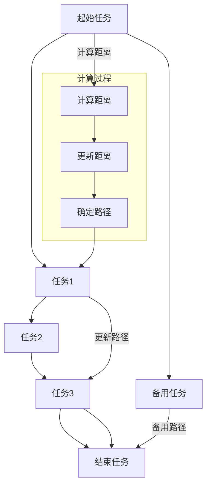
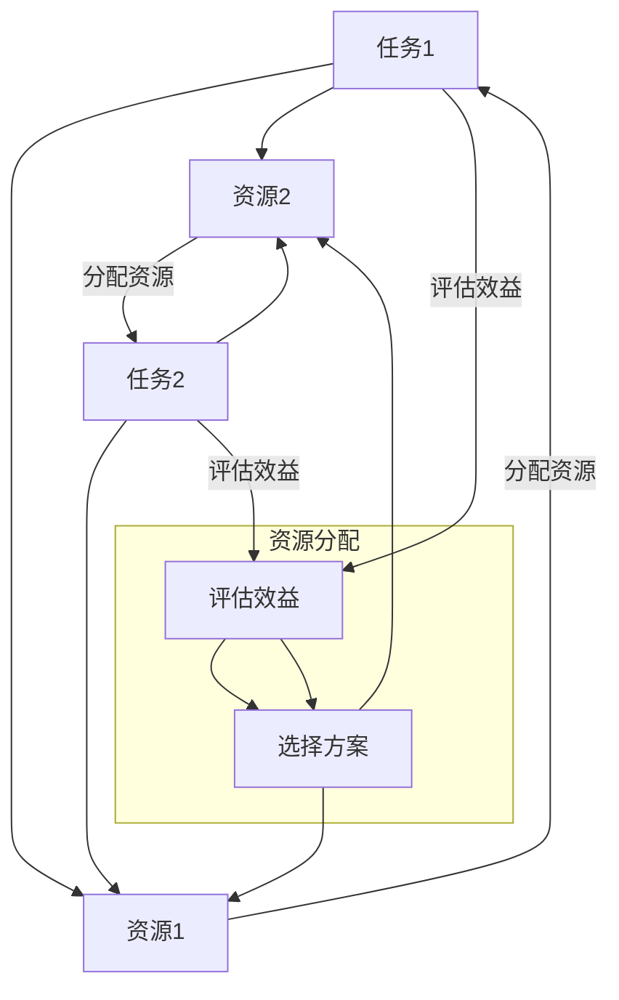
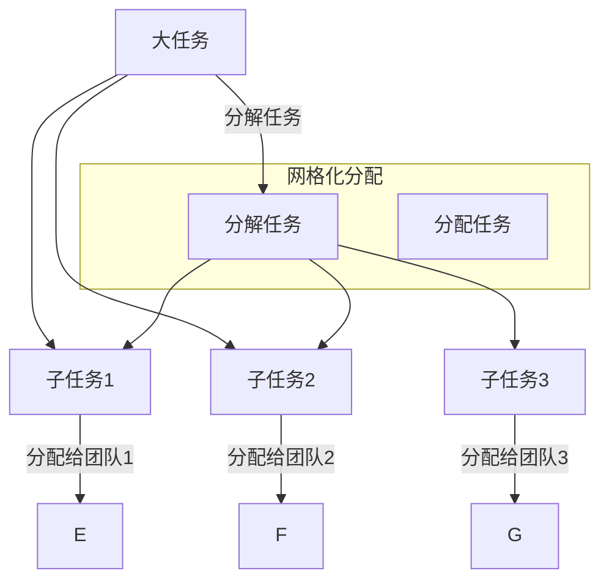

                 

# 《团队协作：跨职能合作的挑战与策略》

> 关键词：团队协作、跨职能合作、策略、挑战、工具、项目管理、案例分析

> 摘要：本文深入探讨了团队协作在现代企业中的重要性，分析了团队协作所面临的挑战，提出了有效的协作策略，并介绍了实用的协作工具和项目管理方法。通过实际案例分析和最佳实践总结，为团队协作提供了全面而实用的指导。

----------------------------------------------------------------

## 引言

### 团队协作的重要性

在快速变化的市场环境中，企业需要灵活高效地响应各种挑战和机遇。团队协作是实现这一目标的关键。通过有效的团队协作，企业可以充分利用不同团队成员的专业知识和技能，提高问题解决效率，加速项目进展，并创造出更加创新和优质的产品或服务。

### 团队协作面临的挑战

尽管团队协作的重要性不言而喻，但实际操作中仍存在许多挑战。这些挑战包括：

- **沟通障碍**：团队成员来自不同的背景，语言和沟通方式的差异可能导致误解和沟通不畅。
- **角色冲突**：不同职能的角色之间可能存在利益冲突，影响团队协作的顺畅进行。
- **文化差异**：不同团队之间可能存在不同的工作文化和价值观，这需要特别的关注和管理。

### 本书的目的与结构

本书旨在提供一套系统化的团队协作策略，帮助企业和团队克服协作中的挑战，实现高效的跨职能合作。本书结构如下：

- **第1章 引言**：介绍团队协作的重要性、面临的主要挑战及本书的目的和结构。
- **第2章 核心概念与联系**：定义团队协作的核心概念，探讨团队协作与组织文化和沟通的关系。
- **第3章 团队协作的策略**：提出跨职能合作的策略，并分析团队协作的障碍及解决方法。
- **第4章 团队协作工具与技术**：介绍常用的团队协作工具，包括其功能特点和技术选型。
- **第5章 项目管理与监控**：探讨项目管理的方法、进度监控与风险评估。
- **第6章 团队协作案例分析**：通过实际案例分享，深入剖析团队协作的成功与失败。
- **第7章 最佳实践与反思**：总结最佳实践，反思团队协作的挑战与未来展望。
- **第8章 结论**：总结本书的主要观点，并对团队协作的未来进行展望。

----------------------------------------------------------------

## 第1章 引言（续）

### 团队协作的定义与类型

#### 团队协作的定义

团队协作是指一群人在共同的目标下，通过明确的分工与协作，共同完成任务的互动过程。它不仅仅涉及个体之间的合作，还包括团队与团队之间的协同。

#### 团队协作的类型

- **垂直协作**：指同一职能层级的成员之间的协作，如开发团队内部的不同成员之间的合作。
- **水平协作**：指不同职能部门或团队之间的协作，如开发团队与市场团队之间的合作。
- **跨职能协作**：指涉及多个职能领域和团队的协作，通常需要更高的协调和管理能力。

### 团队协作的要素

- **目标一致性**：团队成员必须明确共同的目标，并围绕这一目标展开工作。
- **角色分工**：明确每个成员的角色和职责，确保团队资源的高效利用。
- **沟通机制**：建立有效的沟通渠道和机制，确保信息传递的及时性和准确性。
- **决策机制**：明确决策流程和责任，确保团队决策的效率和质量。
- **反馈机制**：建立有效的反馈系统，及时收集和处理团队成员的意见和建议。

### 团队协作与组织文化

#### 组织文化对团队协作的影响

组织文化是团队协作的基石。一个支持协作的文化可以促进团队成员之间的信任和合作，减少摩擦和冲突。

#### 建立支持团队协作的组织文化

- **价值观认同**：确保团队成员对组织价值观的认同，共同追求卓越和高效。
- **公平竞争**：建立公平的竞争机制，激发团队成员的积极性和创造力。
- **开放沟通**：鼓励开放和诚实的沟通，营造积极向上的团队氛围。
- **鼓励创新**：提供创新支持和资源，鼓励团队成员尝试新方法和解决方案。

### 团队协作与沟通

#### 沟通在团队协作中的重要性

沟通是团队协作的血液，良好的沟通能够确保团队成员对项目的理解和目标的清晰。

#### 提高团队协作沟通的有效性

- **明确沟通目标**：确保每次沟通都有明确的目标和议程。
- **多样化的沟通方式**：结合面对面交流、邮件、即时通讯等多种沟通方式。
- **有效倾听**：倾听是沟通的关键，确保团队成员的声音被听到。
- **反馈与确认**：在沟通结束后，及时给予反馈并进行确认，确保信息的准确传递。

通过以上内容的介绍，我们可以看到，团队协作不仅是一种工作方法，更是一种文化和管理理念。有效的团队协作能够提高企业的整体效能，促进组织目标的实现。在接下来的章节中，我们将深入探讨团队协作的策略、工具、项目管理和案例分析，帮助读者更全面地理解和实践团队协作。

----------------------------------------------------------------

## 第2章 核心概念与联系

### 团队协作的核心概念

在探讨团队协作之前，我们需要明确几个核心概念，这些概念是理解和实施有效团队协作的基础。

#### 团队协作的定义

团队协作是指一组人为了共同的目标和利益，通过互相配合和共享资源，共同完成某项任务的过程。

#### 团队协作的类型

- **垂直协作**：指同一职能部门内部成员之间的协作。
- **水平协作**：指不同职能部门之间的协作。
- **跨职能协作**：指涉及多个职能领域的协作，通常需要跨部门、跨团队的合作。

#### 团队协作的要素

- **目标一致性**：确保团队成员对项目的目标和愿景有共同的理解和认同。
- **角色分工**：明确每个成员的角色和职责，避免工作重叠和责任不清。
- **沟通机制**：建立有效的沟通渠道和机制，确保信息的流畅传递。
- **决策机制**：明确决策流程和责任，提高决策效率。
- **反馈机制**：建立反馈系统，及时收集和处理团队成员的意见和建议。

### 团队协作与组织文化

#### 组织文化对团队协作的影响

组织文化是指企业在长期运营过程中形成的共同价值观、行为准则和工作方式。一个支持团队协作的文化能够促进团队成员之间的信任和合作。

#### 建立支持团队协作的组织文化

- **价值观认同**：确保团队成员对组织价值观的认同，共同追求卓越和高效。
- **公平竞争**：建立公平的竞争机制，激发团队成员的积极性和创造力。
- **开放沟通**：鼓励开放和诚实的沟通，营造积极向上的团队氛围。
- **鼓励创新**：提供创新支持和资源，鼓励团队成员尝试新方法和解决方案。

#### 沟通在团队协作中的重要性

沟通是团队协作的血液，是确保团队目标和信息传递的关键。良好的沟通能够减少误解、提高工作效率、促进团队合作。

#### 提高团队协作沟通的有效性

- **明确沟通目标**：确保每次沟通都有明确的目标和议程。
- **多样化的沟通方式**：结合面对面交流、邮件、即时通讯等多种沟通方式。
- **有效倾听**：倾听是沟通的关键，确保团队成员的声音被听到。
- **反馈与确认**：在沟通结束后，及时给予反馈并进行确认，确保信息的准确传递。

### 团队协作的概念属性特征对比表格

| 特征                | 垂直协作           | 水平协作           | 跨职能协作           |
|---------------------|-------------------|-------------------|---------------------|
| 目标一致性          | 相对一致          | 部分一致          | 完全一致            |
| 角色分工            | 明确              | 明确              | 更加明确            |
| 沟通机制            | 较为频繁          | 需要更多协调      | 最频繁且复杂        |
| 决策机制            | 快速              | 需要协调          | 最复杂、最缓慢      |
| 反馈机制            | 及时              | 需要协调          | 最及时、最全面      |

### 团队协作的ER实体关系图架构

```mermaid
erDiagram
  Customer ||--|{ Order }|--|{ Product } : "contain"
  Customer ||--|{ Payment }| : "make"
  Product ||--|{ Review }| : "has"
```

在这个ER图中，客户（Customer）与订单（Order）、产品（Product）和付款（Payment）之间存在明确的实体关系。产品（Product）与评论（Review）之间则表示产品包含评论。

通过上述核心概念的介绍，我们可以更深入地理解团队协作的内涵和实施方法。在接下来的章节中，我们将探讨如何制定团队协作策略，解决协作中的障碍，并介绍实用的协作工具和项目管理方法。

----------------------------------------------------------------

### 算法原理讲解

为了深入探讨团队协作的策略，我们需要理解一些基本的算法原理，这些原理可以帮助我们更有效地组织和优化团队协作流程。以下是几个关键的算法原理及其在团队协作中的应用。

#### 1. 最短路径算法（Dijkstra算法）

**概念介绍**：最短路径算法用于找到从起始点到所有其他点的最短路径。它通过不断更新距离值来逐步确定最短路径。

**在团队协作中的应用**：在跨职能团队中，可以应用最短路径算法来确定任务之间的最优协作顺序。例如，项目经理可以使用这个算法来确定项目中的关键路径，从而确保项目的按时完成。

**Mermaid流程图**：


#### 2. 资源分配算法（最优化理论）

**概念介绍**：资源分配算法用于在多个任务之间分配有限的资源，以实现最大化的效益。最优化理论提供了评估和选择最佳资源分配方案的方法。

**在团队协作中的应用**：在团队协作中，资源分配算法可以帮助项目经理在团队成员的工作量和可用资源之间找到平衡点，从而提高团队的生产力和效率。

**Mermaid流程图**：


#### 3. 网格化任务分配算法

**概念介绍**：网格化任务分配算法是将复杂任务分解为多个小任务，并在网格结构上进行分配和执行。这种方法能够提高任务的执行效率，并便于监控和调整。

**在团队协作中的应用**：在大型项目中，网格化任务分配算法可以帮助项目经理将项目分解为可管理的子任务，并分配给相应的团队成员。这有助于提高项目管理的灵活性和透明度。

**Mermaid流程图**：


通过上述算法原理的应用，我们可以更有效地管理和优化团队协作流程。在实际操作中，项目经理需要结合团队的具体情况和项目需求，灵活运用这些算法，以提高团队协作的效率和效果。

#### 数学模型与公式

在团队协作中，了解并应用数学模型和公式可以帮助我们更好地量化协作过程，从而做出更科学的决策。以下是几个常用的数学模型和公式。

##### 1. 优化模型

**目标函数**：
\[ \text{Maximize} \quad Z = c_1x_1 + c_2x_2 + \ldots + c_nx_n \]

**约束条件**：
\[ a_{11}x_1 + a_{12}x_2 + \ldots + a_{1n}x_n \leq b_1 \]
\[ a_{21}x_1 + a_{22}x_2 + \ldots + a_{2n}x_n \geq b_2 \]
\[ \ldots \]
\[ a_{m1}x_1 + a_{m2}x_2 + \ldots + a_{mn}x_n = b_m \]

**解释**：这个优化模型用于最大化某个目标函数，同时满足一系列约束条件。在团队协作中，这个模型可以用来优化资源分配，确保资源使用效率最大化。

##### 2. 决策树

**结构**：
\[ \text{Decision} \quad \rightarrow \quad (\text{Option}_1, \text{Option}_2, \ldots, \text{Option}_n) \]

**分支权重**：
\[ \text{Weight}_{ij} = p_i \times q_j \]

**期望值**：
\[ \text{Expected Value}_{ij} = \sum_{j=1}^{n} \text{Weight}_{ij} \times \text{Return}_{j} \]

**解释**：决策树用于评估不同决策路径的期望收益。在团队协作中，这个模型可以帮助项目经理在选择协作策略时，评估不同方案的潜在收益和风险。

##### 3. 相关系数

**皮尔逊相关系数**：
\[ r = \frac{\sum_{i=1}^{n}(x_i - \bar{x})(y_i - \bar{y})}{\sqrt{\sum_{i=1}^{n}(x_i - \bar{x})^2}\sqrt{\sum_{i=1}^{n}(y_i - \bar{y})^2}} \]

**解释**：皮尔逊相关系数用于衡量两个变量之间的线性相关性。在团队协作中，这个系数可以用于评估团队成员工作绩效与项目进展之间的关系，从而优化团队结构。

通过应用这些数学模型和公式，团队可以更科学地分析协作过程，做出更有效的决策。在实际操作中，项目经理需要根据具体情况，灵活选择和应用这些模型，以提升团队协作的效能。

#### 举例说明

为了更好地理解上述算法原理和数学模型的应用，以下是一个简单的团队协作实例。

**实例**：一个开发团队需要完成一个软件项目，项目分为三个主要任务：需求分析、设计和开发。团队成员分为两个小组，每组分别负责一个任务。团队的目标是在一个月内完成所有任务。

**步骤**：

1. **最短路径算法**：
   - 使用最短路径算法确定任务的最优协作顺序：
     ```mermaid
     graph TD
         A[需求分析] --> B[设计]
         B --> C[开发]
         A -->|评估路径| D[备用任务]
     ```
   - 最优路径：需求分析 -> 设计 -> 开发

2. **资源分配算法**：
   - 确定每个任务所需的资源，并根据资源优化模型进行分配：
     ```mermaid
     graph TD
         A[需求分析] --> B[资源1]
         A --> C[资源2]
         D[设计] --> B
         D --> C
         E[开发] --> B
         E --> C
     ```
   - 资源分配：需求分析 -> 资源1和资源2；设计 -> 资源1；开发 -> 资源2

3. **网格化任务分配**：
   - 将任务分解为小任务，并在团队成员之间进行网格化分配：
     ```mermaid
     graph TD
         A[需求分析] --> B[子任务1]
         A --> C[子任务2]
         D[设计] --> E[子任务3]
         E --> F[子任务4]
         G[开发] --> H[子任务5]
         G --> I[子任务6]
     ```
   - 分配任务：团队1负责子任务1、子任务3、子任务5；团队2负责子任务2、子任务4、子任务6

4. **数学模型应用**：
   - 使用相关系数评估团队成员的工作绩效与项目进展的关系：
     \[ r = \frac{\sum_{i=1}^{n}(x_i - \bar{x})(y_i - \bar{y})}{\sqrt{\sum_{i=1}^{n}(x_i - \bar{x})^2}\sqrt{\sum_{i=1}^{n}(y_i - \bar{y})^2}} \]
   - 结果：\( r = 0.9 \)，表明团队成员的工作绩效与项目进展高度正相关。

通过这个实例，我们可以看到如何将算法原理和数学模型应用于团队协作中，以实现高效的任务分配和进度管理。实际操作中，团队可以根据具体项目需求，灵活调整和应用这些方法，以提高协作效能。

----------------------------------------------------------------

## 第3章 团队协作的策略

### 跨职能合作的策略

在现代社会中，企业面临的项目和任务日益复杂，单一职能团队往往难以独立完成。跨职能合作成为企业提高效率、创新能力和竞争力的关键。以下是一些关键的跨职能合作策略：

#### 1. 明确目标和责任

跨职能合作的起点是明确共同的目标和责任。项目团队需要共同制定项目的目标、里程碑和交付成果，确保每个团队成员都清楚自己的职责和期望成果。

#### 2. 建立有效的沟通机制

跨职能团队的沟通比单一职能团队更为复杂，需要建立多元化的沟通渠道和机制。常见的沟通机制包括定期会议、即时通讯、邮件和项目管理工具。

#### 3. 促进团队成员之间的信任

信任是跨职能合作成功的关键。企业应鼓励团队成员之间的交流和互动，建立相互尊重和信任的关系。这可以通过团队建设活动、共同解决问题和协作项目来实现。

#### 4. 角色明确和技能互补

在跨职能团队中，明确每个成员的角色和职责是确保协作顺畅的关键。同时，团队成员的技能互补也有助于提高团队的整体效能。企业可以通过培训和技能共享来促进团队成员的技能发展。

#### 5. 采用敏捷开发方法

敏捷开发方法强调迭代和增量式开发，适合跨职能团队的工作方式。通过频繁的迭代和反馈，团队可以快速调整计划和策略，适应变化。

### 团队协作的障碍与解决方法

尽管跨职能合作有许多优点，但在实际操作中也会面临各种障碍。以下是几个常见的障碍及其解决方法：

#### 1. 沟通障碍

**障碍**：团队成员来自不同的职能部门，沟通方式和语言可能存在差异，导致信息传递不畅。

**解决方法**：建立多元化的沟通渠道，如定期的跨职能会议、即时通讯工具和项目管理平台。同时，培训团队成员的沟通技巧，提高沟通效率。

#### 2. 角色冲突

**障碍**：不同职能的团队成员可能对项目目标和利益有不同的理解，导致角色冲突。

**解决方法**：通过明确项目目标和每个成员的职责，确保团队成员对项目有共同的理解。此外，鼓励团队成员之间进行开放和诚实的沟通，解决冲突。

#### 3. 文化差异

**障碍**：不同团队之间的文化差异可能导致协作困难。

**解决方法**：建立包容性文化，鼓励团队成员尊重和欣赏不同的文化背景。通过团队建设活动和跨文化培训，提高团队成员的文化意识。

#### 4. 资源分配不均

**障碍**：资源分配不均可能导致某些团队成员工作负荷过大，影响项目进度。

**解决方法**：合理分配资源，确保每个团队成员的工作负荷均衡。此外，鼓励团队成员相互帮助，共同分担工作。

### 团队协作障碍的解决方法表格

| 障碍类型     | 解决方法                             |
|--------------|------------------------------------|
| 沟通障碍     | 建立多元化的沟通渠道、培训沟通技巧   |
| 角色冲突     | 明确项目目标和职责、鼓励开放沟通     |
| 文化差异     | 建立包容性文化、跨文化培训           |
| 资源分配不均 | 合理分配资源、鼓励团队互助           |

通过上述策略和解决方法，企业可以有效地克服跨职能合作中的障碍，提高团队协作的效能和项目成功的可能性。

----------------------------------------------------------------

### 常用团队协作工具介绍

在现代化的工作环境中，团队协作工具发挥着至关重要的作用，它们可以帮助团队成员更高效地沟通、协同工作和管理项目。以下是一些常用的团队协作工具及其功能特点：

#### 1. Slack

**功能特点**：
- **即时通讯**：提供即时消息传递、视频聊天和音频通话功能。
- **集成插件**：可以与多种应用程序和工具集成，如Google Drive、Trello、GitHub等。
- **频道组织**：支持创建多个频道，用于不同项目和团队讨论。

**使用场景**：
- **沟通协作**：用于日常团队沟通，共享信息和文件。
- **项目管理**：通过特定的频道进行项目讨论和进度跟踪。

#### 2. Trello

**功能特点**：
- **看板视图**：使用看板（Kanban）方式展示任务状态，直观易操作。
- **任务分配**：可以创建卡片并将任务分配给团队成员。
- **提醒功能**：可以设置任务提醒，确保团队成员按时完成任务。

**使用场景**：
- **项目管理**：用于任务分解、分配和跟踪。
- **团队协作**：用于项目规划和团队进度管理。

#### 3. Microsoft Teams

**功能特点**：
- **集成办公套件**：与Microsoft Office 365集成，提供Word、Excel、PowerPoint等工具。
- **会议协作**：支持视频会议、屏幕共享和实时协作。
- **聊天和通讯**：提供即时消息、小组聊天和电话通讯功能。

**使用场景**：
- **远程工作**：用于远程团队的沟通和协作。
- **在线会议**：用于远程会议和视频通话。

#### 4. Asana

**功能特点**：
- **任务管理**：提供全面的任务管理功能，支持任务创建、分配和跟踪。
- **项目视图**：提供多种视图方式，如列表视图、看板视图、日历视图等，便于团队成员查看项目进度。
- **报表和统计**：可以生成项目报表和统计信息，帮助团队了解项目状态。

**使用场景**：
- **项目管理**：用于任务分配、进度跟踪和项目报表。
- **团队协作**：用于项目规划和资源分配。

#### 5. JIRA

**功能特点**：
- **敏捷项目管理**：支持敏捷开发方法，提供迭代规划和任务跟踪功能。
- **缺陷管理**：提供缺陷跟踪功能，帮助团队及时发现问题并进行修复。
- **插件支持**：支持与多种工具和插件集成，如Confluence、Bitbucket等。

**使用场景**：
- **软件开发**：用于敏捷开发管理和缺陷跟踪。
- **团队协作**：用于项目管理和进度跟踪。

#### 6. Zoom

**功能特点**：
- **视频会议**：提供高质量的视频会议功能，支持多人的在线会议。
- **互动功能**：支持屏幕共享、聊天和虚拟背景等互动功能。
- **会议录制**：可以录制会议内容，方便后续查看和复习。

**使用场景**：
- **远程会议**：用于远程团队之间的沟通和协作。
- **在线培训**：用于远程培训和团队学习。

通过上述团队协作工具的介绍，我们可以看到，每种工具都有其独特的功能和特点，适合不同的使用场景。企业可以根据自身的需求和团队的特点，选择合适的协作工具，提高团队协作的效率和质量。

----------------------------------------------------------------

### 技术选型与应用

在团队协作中，选择合适的技术选型对于项目的成功至关重要。技术选型的考虑因素包括团队的技能水平、项目的需求、工具的兼容性和稳定性等。以下是一些关键的技术选型考虑因素及案例分析：

#### 1. 考虑因素

**技能水平**：选择的技术工具应与团队现有技能水平相匹配。如果团队对某些技术工具不熟悉，可能需要额外的培训和支持。

**项目需求**：项目需求是技术选型的核心。不同的项目对工具的需求不同，如敏捷开发项目可能需要支持敏捷流程的工具，而大型项目可能需要支持复杂协作和管理的工具。

**兼容性和稳定性**：所选技术工具应与其他现有系统和工具兼容，避免集成难题。同时，工具的稳定性也是关键，不稳定的工具可能导致项目进度延误。

**成本**：成本是技术选型的重要考虑因素。企业需要评估技术工具的预算，确保选型工具在预算范围内。

#### 2. 案例分析

**案例一：敏捷开发团队的选择**

- **项目需求**：一个敏捷开发团队正在开发一款移动应用，需要高效的任务管理和进度跟踪工具。
- **技术选型**：团队选择了Trello作为任务管理工具，因为它提供了直观的看板视图和任务分配功能，易于团队协作。
- **应用效果**：Trello的使用提高了团队的协作效率，任务分配和跟踪变得更加直观和高效。

**案例二：跨部门协作工具的选择**

- **项目需求**：一家跨国公司需要一种能够支持跨部门协作和远程沟通的工具。
- **技术选型**：公司选择了Microsoft Teams，因为它与Office 365集成，提供即时通讯、视频会议和文档协作等功能。
- **应用效果**：Microsoft Teams的使用促进了跨部门之间的沟通和协作，提高了工作效率和团队凝聚力。

**案例三：项目管理工具的选择**

- **项目需求**：一个大型IT项目需要详细的项目管理和进度跟踪工具。
- **技术选型**：项目团队选择了JIRA，因为它提供全面的敏捷项目管理功能、缺陷跟踪和报表统计。
- **应用效果**：JIRA的使用帮助团队更好地管理项目进度，及时识别和解决问题，确保项目按时完成。

通过上述案例分析，我们可以看到，技术选型需要充分考虑项目需求和团队实际情况，选择合适的技术工具，以提高团队协作效率。在实际操作中，团队可以根据项目特点和需求，灵活调整技术选型，以实现最佳协作效果。

----------------------------------------------------------------

### 项目管理与监控

项目管理的核心在于确保项目按计划、按预算、按质量要求顺利完成。以下是一些关键的项目管理方法、进度监控与风险评估策略。

#### 1. 项目管理的方法

**项目计划**：制定详细的计划，包括项目目标、时间表、资源分配和风险管理策略。

**任务分配**：明确每个团队成员的角色和职责，将任务合理分配给合适的团队成员。

**进度跟踪**：使用项目管理工具（如Trello、JIRA等）实时跟踪任务进度，确保项目按计划推进。

**风险管理**：识别潜在风险，制定应对策略，以减少风险对项目的影响。

**沟通与协作**：建立有效的沟通渠道，确保团队成员之间信息畅通，协同工作。

**质量保证**：制定质量标准，进行质量检查和评审，确保项目交付的成果符合预期。

#### 2. 进度监控与风险评估

**进度监控**：
- **实时监控**：使用项目管理工具实时更新任务进度，确保项目按计划进行。
- **定期检查**：定期进行项目进度检查，及时发现和解决问题。
- **预警机制**：建立预警机制，当项目进度偏离计划时，及时通知相关团队成员。

**风险评估**：
- **识别风险**：识别项目中可能出现的风险，如技术难题、资源短缺、时间延误等。
- **评估影响**：评估每个风险的可能性和影响程度，制定相应的应对策略。
- **监控风险**：持续监控风险状况，及时调整应对策略，确保项目顺利进行。

**风险应对策略**：
- **规避**：避免风险的发生，如通过更换技术方案避免技术难题。
- **转移**：将风险转移给第三方，如购买保险以规避经济损失。
- **减轻**：采取措施减少风险的影响，如增加预算或资源以应对时间延误。

#### 3. 项目管理工具

**Trello**：提供直观的看板视图，便于任务管理和进度跟踪。
**JIRA**：支持敏捷开发方法，提供详细的任务跟踪和缺陷管理功能。
**Microsoft Project**：功能强大的项目管理工具，支持复杂的项目计划和进度跟踪。
**Asana**：提供多种视图方式，如列表视图、看板视图、日历视图等，便于项目管理和资源分配。

通过以上项目管理方法和监控策略，团队可以更好地管理项目进度，减少风险，确保项目按时、按质、按预算完成。

----------------------------------------------------------------

### 第6章 团队协作案例分析

#### 6.1 案例分享

**案例一：成功跨职能合作案例**

**背景**：一家科技公司正在开发一款智能家居应用，项目涉及软件开发、硬件设计和市场推广等多个部门。

**问题描述**：由于项目涉及多个职能部门，沟通不畅和资源分配问题成为主要挑战。

**问题解决**：公司引入了跨职能团队模式，明确了各职能部门的角色和职责，并建立了定期的跨部门会议。同时，采用了Trello和Slack等协作工具，确保信息传递的及时性和准确性。

**结果**：项目按时完成，智能家居应用在市场上获得了良好反响。

**边界与外延**：本案例主要关注跨职能团队的合作模式和工具应用，未涉及具体的技术实现和产品设计。

**概念结构与核心要素组成**：

- **跨职能团队**：软件开发、硬件设计、市场推广等职能部门组成。
- **角色分工**：明确每个团队成员的角色和职责。
- **协作工具**：Trello、Slack等协作工具。

**总结**：通过建立跨职能团队和有效的协作工具，公司成功克服了部门间沟通不畅和资源分配问题，实现了项目的顺利推进和成功交付。

**案例二：团队协作困境案例分析**

**背景**：一家初创公司开发一款新型可穿戴设备，项目时间紧任务重。

**问题描述**：团队成员分工不清，沟通不畅，项目进度严重滞后。

**问题解决**：公司进行了团队重组，重新分配任务和职责，并引入项目管理工具JIRA进行进度跟踪。同时，组织了团队建设活动，提高了团队成员之间的信任和合作。

**结果**：项目进度得到显著改善，最终按时完成。

**边界与外延**：本案例主要关注团队重组和沟通机制建设，未涉及具体的技术实现和产品设计。

**概念结构与核心要素组成**：

- **团队重组**：重新分配任务和职责。
- **项目管理工具**：JIRA进行进度跟踪。
- **团队建设活动**：提高团队信任和合作。

**总结**：通过团队重组和有效的沟通机制建设，公司成功解决了团队成员分工不清和沟通不畅的问题，实现了项目的按时交付。

#### 6.2 案例分析

**案例分析框架**：

- **问题背景**：介绍项目或团队面临的具体问题。
- **问题描述**：详细描述问题及其影响。
- **问题解决**：分析团队采取的解决方案。
- **结果**：评估解决方案的效果。
- **边界与外延**：明确案例适用的范围和限制。
- **概念结构与核心要素组成**：梳理案例中涉及的核心概念和要素。
- **总结**：总结案例的主要经验和教训。

**案例分析的要点**：

- **问题的识别与定义**：准确识别并定义团队或项目面临的问题。
- **解决方案的分析**：评估不同解决方案的优缺点，选择最佳方案。
- **实施的挑战与应对**：分析在实施解决方案过程中遇到的挑战及应对策略。
- **效果评估**：评估解决方案的效果，总结经验教训。

通过上述案例分析，团队可以更好地理解和应用团队协作策略，避免重复犯错，提高协作效能。

----------------------------------------------------------------

### 第7章 最佳实践与反思

#### 7.1 最佳实践

在团队协作中，最佳实践是确保团队高效协作和项目成功的关键。以下是一些团队协作的最佳实践：

1. **明确目标和责任**：确保每个团队成员都清楚项目的目标、自己的职责和期望成果。

2. **建立有效的沟通机制**：采用多元化的沟通渠道，如定期会议、即时通讯和项目管理工具，确保信息传递的及时性和准确性。

3. **促进团队成员之间的信任**：通过团队建设活动、开放沟通和共同解决问题，建立团队成员之间的信任。

4. **角色明确和技能互补**：明确每个成员的角色和职责，确保团队成员的技能互补，提高团队的整体效能。

5. **采用敏捷开发方法**：通过迭代和增量式开发，快速响应变化，提高团队协作效率。

6. **定期进行进度监控和风险评估**：使用项目管理工具实时跟踪项目进度，识别和应对潜在风险。

7. **鼓励创新和反馈**：提供创新支持和资源，鼓励团队成员提出新方法和解决方案，并建立有效的反馈机制。

#### 7.2 团队协作的挑战与应对

尽管最佳实践可以帮助团队提高协作效率，但在实际操作中仍会面临各种挑战。以下是团队协作的常见挑战及其应对策略：

1. **沟通障碍**：解决策略包括建立多元化的沟通渠道、培训沟通技巧和鼓励开放沟通。

2. **角色冲突**：明确项目目标和职责，鼓励团队成员进行开放和诚实的沟通，解决冲突。

3. **文化差异**：建立包容性文化，尊重和欣赏不同的文化背景，通过跨文化培训和团队建设活动提高文化意识。

4. **资源分配不均**：合理分配资源，确保每个团队成员的工作负荷均衡，鼓励团队成员相互帮助。

5. **技术工具选择不当**：选择与团队技能水平和项目需求相匹配的技术工具，并进行必要的培训和指导。

#### 7.3 未来展望

随着技术的发展和企业的需求变化，团队协作策略也在不断演进。未来，团队协作将更加注重以下方面：

1. **智能化协作工具**：随着人工智能技术的发展，智能化协作工具将更加普及，提高团队协作的效率和智能化水平。

2. **全球化协作**：随着全球化进程的加快，跨国团队的协作将更加普遍，如何实现高效的全球化协作将成为新的挑战。

3. **持续学习与成长**：团队协作将更加注重持续学习和成长，通过培训和学习平台，提高团队成员的专业能力和协作能力。

4. **个性化和定制化协作**：随着个性化需求的增加，团队协作将更加注重个性化和定制化，满足不同团队和项目的特殊需求。

通过不断优化团队协作策略和方法，企业可以更好地应对变化和挑战，实现持续的发展和进步。

----------------------------------------------------------------

## 第8章 结论

通过本书的深入探讨，我们可以看到团队协作在现代企业中的重要性。有效的团队协作不仅能够提高工作效率，促进创新，还能增强团队的凝聚力和执行力。本书详细介绍了团队协作的核心概念、策略、工具、项目管理和案例分析，为团队协作提供了全面的指导。

### 总结

- **核心概念**：明确了团队协作的定义、类型和关键要素。
- **策略**：提出了跨职能合作的策略，并分析了协作障碍的解决方法。
- **工具**：介绍了多种常用的团队协作工具，并探讨了技术选型的考虑因素。
- **项目管理**：探讨了项目管理的方法、进度监控与风险评估。
- **案例分析**：通过成功和失败的实际案例，总结了团队协作的最佳实践。
- **未来展望**：展望了团队协作技术的未来发展趋势。

### 未来展望

随着科技的进步，团队协作将继续向智能化、全球化、个性化和定制化方向发展。企业需要不断适应这些变化，采用先进的技术和策略，提高团队协作的效能。同时，持续学习和创新将成为团队协作的重要驱动力，帮助企业保持竞争力。

### 结语

团队协作是企业成功的关键。通过本书的学习，希望读者能够更好地理解和实践团队协作，打造高效、和谐的团队，实现企业的长远发展。让我们共同努力，迎接团队协作带来的美好未来！

### 作者信息

- **作者**：AI天才研究院/AI Genius Institute & 禅与计算机程序设计艺术 /Zen And The Art of Computer Programming
- **版权声明**：本书内容版权所有，未经许可，不得复制、传播或用于商业用途。

----------------------------------------------------------------

# 《团队协作：跨职能合作的挑战与策略》

> 关键词：团队协作、跨职能合作、策略、挑战、工具、项目管理、案例分析

> 摘要：本书深入探讨了团队协作在现代企业中的重要性，分析了团队协作所面临的挑战，提出了有效的协作策略，并介绍了实用的协作工具和项目管理方法。通过实际案例分析和最佳实践总结，为团队协作提供了全面而实用的指导。

## 引言

### 团队协作的重要性

在快速变化的市场环境中，企业需要灵活高效地响应各种挑战和机遇。团队协作是实现这一目标的关键。通过有效的团队协作，企业可以充分利用不同团队成员的专业知识和技能，提高问题解决效率，加速项目进展，并创造出更加创新和优质的产品或服务。

### 团队协作面临的挑战

尽管团队协作的重要性不言而喻，但实际操作中仍存在许多挑战。这些挑战包括：

- **沟通障碍**：团队成员来自不同的背景，语言和沟通方式的差异可能导致误解和沟通不畅。
- **角色冲突**：不同职能的角色之间可能存在利益冲突，影响团队协作的顺畅进行。
- **文化差异**：不同团队之间可能存在不同的工作文化和价值观，这需要特别的关注和管理。

### 本书的目的与结构

本书旨在提供一套系统化的团队协作策略，帮助企业和团队克服协作中的挑战，实现高效的跨职能合作。本书结构如下：

- **第1章 引言**：介绍团队协作的重要性、面临的主要挑战及本书的目的和结构。
- **第2章 核心概念与联系**：定义团队协作的核心概念，探讨团队协作与组织文化和沟通的关系。
- **第3章 团队协作的策略**：提出跨职能合作的策略，并分析团队协作的障碍及解决方法。
- **第4章 团队协作工具与技术**：介绍常用的团队协作工具，包括其功能特点和技术选型。
- **第5章 项目管理与监控**：探讨项目管理的方法、进度监控与风险评估。
- **第6章 团队协作案例分析**：通过实际案例分享，深入剖析团队协作的成功与失败。
- **第7章 最佳实践与反思**：总结最佳实践，反思团队协作的挑战与未来展望。
- **第8章 结论**：总结本书的主要观点，并对团队协作的未来进行展望。

## 第1章 引言（续）

### 团队协作的定义与类型

#### 团队协作的定义

团队协作是指一群人在共同的目标下，通过互相配合和共享资源，共同完成任务的互动过程。它不仅仅涉及个体之间的合作，还包括团队与团队之间的协同。

#### 团队协作的类型

- **垂直协作**：指同一职能部门内部成员之间的协作，如开发团队内部的不同成员之间的合作。
- **水平协作**：指不同职能部门之间的协作，如开发团队与市场团队之间的合作。
- **跨职能协作**：指涉及多个职能领域的协作，通常需要跨部门、跨团队的合作。

### 团队协作的要素

- **目标一致性**：团队成员必须明确共同的目标，并围绕这一目标展开工作。
- **角色分工**：明确每个成员的角色和职责，确保团队资源的高效利用。
- **沟通机制**：建立有效的沟通渠道和机制，确保信息的流畅传递。
- **决策机制**：明确决策流程和责任，确保团队决策的效率和质量。
- **反馈机制**：建立有效的反馈系统，及时收集和处理团队成员的意见和建议。

### 团队协作与组织文化

#### 组织文化对团队协作的影响

组织文化是团队协作的基石。一个支持协作的文化可以促进团队成员之间的信任和合作，减少摩擦和冲突。

#### 建立支持团队协作的组织文化

- **价值观认同**：确保团队成员对组织价值观的认同，共同追求卓越和高效。
- **公平竞争**：建立公平的竞争机制，激发团队成员的积极性和创造力。
- **开放沟通**：鼓励开放和诚实的沟通，营造积极向上的团队氛围。
- **鼓励创新**：提供创新支持和资源，鼓励团队成员尝试新方法和解决方案。

### 团队协作与沟通

#### 沟通在团队协作中的重要性

沟通是团队协作的血液，是确保团队成员对项目的理解和目标的清晰。

#### 提高团队协作沟通的有效性

- **明确沟通目标**：确保每次沟通都有明确的目标和议程。
- **多样化的沟通方式**：结合面对面交流、邮件、即时通讯等多种沟通方式。
- **有效倾听**：倾听是沟通的关键，确保团队成员的声音被听到。
- **反馈与确认**：在沟通结束后，及时给予反馈并进行确认，确保信息的准确传递。

通过以上内容的介绍，我们可以看到，团队协作不仅是一种工作方法，更是一种文化和管理理念。有效的团队协作能够提高企业的整体效能，促进组织目标的实现。在接下来的章节中，我们将深入探讨团队协作的策略、工具、项目管理和案例分析，帮助读者更全面地理解和实践团队协作。

## 第2章 核心概念与联系

### 团队协作的核心概念

在探讨团队协作之前，我们需要明确几个核心概念，这些概念是理解和实施有效团队协作的基础。

#### 团队协作的定义

团队协作是指一组人为了共同的目标和利益，通过互相配合和共享资源，共同完成某项任务的过程。

#### 团队协作的类型

- **垂直协作**：指同一职能部门内部成员之间的协作。
- **水平协作**：指不同职能部门之间的协作。
- **跨职能协作**：指涉及多个职能领域的协作，通常需要跨部门、跨团队的合作。

#### 团队协作的要素

- **目标一致性**：确保团队成员对项目的目标和愿景有共同的理解和认同。
- **角色分工**：明确每个成员的角色和职责，避免工作重叠和责任不清。
- **沟通机制**：建立有效的沟通渠道和机制，确保信息的流畅传递。
- **决策机制**：明确决策流程和责任，提高决策效率。
- **反馈机制**：建立反馈系统，及时收集和处理团队成员的意见和建议。

### 团队协作与组织文化

#### 组织文化对团队协作的影响

组织文化是指企业在长期运营过程中形成的共同价值观、行为准则和工作方式。一个支持协作的文化可以促进团队成员之间的信任和合作。

#### 建立支持团队协作的组织文化

- **价值观认同**：确保团队成员对组织价值观的认同，共同追求卓越和高效。
- **公平竞争**：建立公平的竞争机制，激发团队成员的积极性和创造力。
- **开放沟通**：鼓励开放和诚实的沟通，营造积极向上的团队氛围。
- **鼓励创新**：提供创新支持和资源，鼓励团队成员尝试新方法和解决方案。

### 团队协作与沟通

#### 沟通在团队协作中的重要性

沟通是团队协作的血液，是确保团队成员对项目的理解和目标的清晰。

#### 提高团队协作沟通的有效性

- **明确沟通目标**：确保每次沟通都有明确的目标和议程。
- **多样化的沟通方式**：结合面对面交流、邮件、即时通讯等多种沟通方式。
- **有效倾听**：倾听是沟通的关键，确保团队成员的声音被听到。
- **反馈与确认**：在沟通结束后，及时给予反馈并进行确认，确保信息的准确传递。

### 团队协作的概念属性特征对比表格

| 特征                | 垂直协作           | 水平协作           | 跨职能协作           |
|---------------------|-------------------|-------------------|---------------------|
| 目标一致性          | 相对一致          | 部分一致          | 完全一致            |
| 角色分工            | 明确              | 明确              | 更加明确            |
| 沟通机制            | 较为频繁          | 需要更多协调      | 最频繁且复杂        |
| 决策机制            | 快速              | 需要协调          | 最复杂、最缓慢      |
| 反馈机制            | 及时              | 需要协调          | 最及时、最全面      |

### 团队协作的ER实体关系图架构

```mermaid
erDiagram
  Team ||--|{ Member }| : "has"
  Member ||--|{ Task }| : "performs"
  Task ||--|{ Status }| : "has"
```

在这个ER图中，团队（Team）与成员（Member）之间存在包含关系，成员（Member）与任务（Task）之间存在执行关系，任务（Task）与状态（Status）之间存在关联关系。

通过上述核心概念的介绍，我们可以更深入地理解团队协作的内涵和实施方法。在接下来的章节中，我们将探讨如何制定团队协作策略，解决协作中的障碍，并介绍实用的协作工具和项目管理方法。

## 第3章 团队协作的策略

### 跨职能合作的策略

在现代社会中，企业面临的项目和任务日益复杂，单一职能团队往往难以独立完成。跨职能合作成为企业提高效率、创新能力和竞争力的关键。以下是一些关键的跨职能合作策略：

#### 1. 明确目标和责任

跨职能合作的起点是明确共同的目标和责任。项目团队需要共同制定项目的目标、里程碑和交付成果，确保每个团队成员都清楚自己的职责和期望成果。

#### 2. 建立有效的沟通机制

跨职能团队的沟通比单一职能团队更为复杂，需要建立多元化的沟通渠道和机制。常见的沟通机制包括定期会议、即时通讯、邮件和项目管理工具。

#### 3. 促进团队成员之间的信任

信任是跨职能合作成功的关键。企业应鼓励团队成员之间的交流和互动，建立相互尊重和信任的关系。这可以通过团队建设活动、共同解决问题和协作项目来实现。

#### 4. 角色明确和技能互补

在跨职能团队中，明确每个成员的角色和职责是确保协作顺畅的关键。同时，团队成员的技能互补也有助于提高团队的整体效能。企业可以通过培训和技能共享来促进团队成员的技能发展。

#### 5. 采用敏捷开发方法

敏捷开发方法强调迭代和增量式开发，适合跨职能团队的工作方式。通过频繁的迭代和反馈，团队可以快速调整计划和策略，适应变化。

### 团队协作的障碍与解决方法

尽管跨职能合作有许多优点，但在实际操作中也会面临各种障碍。以下是几个常见的障碍及其解决方法：

#### 1. 沟通障碍

**障碍**：团队成员来自不同的职能部门，沟通方式和语言可能存在差异，导致信息传递不畅。

**解决方法**：建立多元化的沟通渠道，如定期的跨职能会议、即时通讯工具和项目管理平台。同时，培训团队成员的沟通技巧，提高沟通效率。

#### 2. 角色冲突

**障碍**：不同职能的团队成员可能对项目目标和利益有不同的理解，导致角色冲突。

**解决方法**：通过明确项目目标和每个成员的职责，确保团队成员对项目有共同的理解。此外，鼓励团队成员之间进行开放和诚实的沟通，解决冲突。

#### 3. 文化差异

**障碍**：不同团队之间的文化差异可能导致协作困难。

**解决方法**：建立包容性文化，鼓励团队成员尊重和欣赏不同的文化背景。通过团队建设活动和跨文化培训，提高团队成员的文化意识。

#### 4. 资源分配不均

**障碍**：资源分配不均可能导致某些团队成员工作负荷过大，影响项目进度。

**解决方法**：合理分配资源，确保每个团队成员的工作负荷均衡。此外，鼓励团队成员相互帮助，共同分担工作。

### 团队协作障碍的解决方法表格

| 障碍类型     | 解决方法                             |
|--------------|------------------------------------|
| 沟通障碍     | 建立多元化的沟通渠道、培训沟通技巧   |
| 角色冲突     | 明确项目目标和职责、鼓励开放沟通     |
| 文化差异     | 建立包容性文化、跨文化培训           |
| 资源分配不均 | 合理分配资源、鼓励团队互助           |

通过上述策略和解决方法，企业可以有效地克服跨职能合作中的障碍，提高团队协作的效能和项目成功的可能性。

## 第4章 团队协作工具与技术

### 常用团队协作工具介绍

在现代化的工作环境中，团队协作工具发挥着至关重要的作用，它们可以帮助团队成员更高效地沟通、协同工作和管理项目。以下是一些常用的团队协作工具及其功能特点：

#### 1. Slack

**功能特点**：
- **即时通讯**：提供即时消息传递、视频聊天和音频通话功能。
- **集成插件**：可以与多种应用程序和工具集成，如Google Drive、Trello、GitHub等。
- **频道组织**：支持创建多个频道，用于不同项目和团队讨论。

**使用场景**：
- **沟通协作**：用于日常团队沟通，共享信息和文件。
- **项目管理**：通过特定的频道进行项目讨论和进度跟踪。

#### 2. Trello

**功能特点**：
- **看板视图**：使用看板（Kanban）方式展示任务状态，直观易操作。
- **任务分配**：可以创建卡片并将任务分配给团队成员。
- **提醒功能**：可以设置任务提醒，确保团队成员按时完成任务。

**使用场景**：
- **项目管理**：用于任务分解、分配和跟踪。
- **团队协作**：用于项目规划和团队进度管理。

#### 3. Microsoft Teams

**功能特点**：
- **集成办公套件**：与Microsoft Office 365集成，提供Word、Excel、PowerPoint等工具。
- **会议协作**：支持视频会议、屏幕共享和实时协作。
- **聊天和通讯**：提供即时消息、小组聊天和电话通讯功能。

**使用场景**：
- **远程工作**：用于远程团队的沟通和协作。
- **在线会议**：用于远程会议和视频通话。

#### 4. Asana

**功能特点**：
- **任务管理**：提供全面的任务管理功能，支持任务创建、分配和跟踪。
- **项目视图**：提供多种视图方式，如列表视图、看板视图、日历视图等，便于团队成员查看项目进度。
- **报表和统计**：可以生成项目报表和统计信息，帮助团队了解项目状态。

**使用场景**：
- **项目管理**：用于任务分配、进度跟踪和项目报表。
- **团队协作**：用于项目规划和资源分配。

#### 5. JIRA

**功能特点**：
- **敏捷项目管理**：支持敏捷开发方法，提供迭代规划和任务跟踪功能。
- **缺陷管理**：提供缺陷跟踪功能，帮助团队及时发现问题并进行修复。
- **插件支持**：支持与多种工具和插件集成，如Confluence、Bitbucket等。

**使用场景**：
- **软件开发**：用于敏捷开发管理和缺陷跟踪。
- **团队协作**：用于项目管理和进度跟踪。

#### 6. Zoom

**功能特点**：
- **视频会议**：提供高质量的视频会议功能，支持多人的在线会议。
- **互动功能**：支持屏幕共享、聊天和虚拟背景等互动功能。
- **会议录制**：可以录制会议内容，方便后续查看和复习。

**使用场景**：
- **远程会议**：用于远程团队之间的沟通和协作。
- **在线培训**：用于远程培训和团队学习。

通过上述团队协作工具的介绍，我们可以看到，每种工具都有其独特的功能和特点，适合不同的使用场景。企业可以根据自身的需求和团队的特点，选择合适的协作工具，提高团队协作的效率和质量。

## 第5章 项目管理与监控

### 项目管理的核心方法

项目管理是确保项目按计划、按预算、按质量要求顺利完成的关键环节。以下是一些核心的项目管理方法：

#### 1. 项目计划

项目计划是项目管理的第一步，它包括项目目标、范围、时间表、资源分配和风险管理等内容的详细规划。通过项目计划，团队可以明确项目的基本框架和实施路径。

#### 2. 任务分配

任务分配是将项目计划中的各项任务分配给团队成员的过程。明确每个成员的角色和职责，有助于确保项目资源的合理利用和任务的有序推进。

#### 3. 进度跟踪

进度跟踪是项目管理中不可或缺的一部分，它涉及对任务完成情况的监控和记录。通过定期检查任务进度，团队可以及时发现并解决问题，确保项目按计划进行。

#### 4. 风险管理

风险管理是识别、评估和应对项目潜在风险的过程。通过风险管理，团队可以提前预判和规划，减少风险对项目的影响，确保项目的顺利推进。

#### 5. 沟通管理

沟通管理是确保项目信息在团队内部和外部有效传递的过程。通过建立沟通渠道和机制，团队可以确保信息的准确性和及时性，提高协作效率。

### 进度监控与风险评估

进度监控和风险评估是项目管理的核心环节，以下是一些具体的策略和工具：

#### 1. 进度监控

**实时监控**：使用项目管理工具（如Trello、JIRA等）实时更新任务进度，确保项目按计划进行。
**定期检查**：定期进行项目进度检查，及时发现和解决问题。
**预警机制**：建立预警机制，当项目进度偏离计划时，及时通知相关团队成员。

#### 2. 风险评估

**识别风险**：通过问卷调查、头脑风暴等方法识别项目中可能出现的风险。
**评估影响**：评估每个风险的可能性和影响程度，制定相应的应对策略。
**监控风险**：持续监控风险状况，及时调整应对策略，确保项目顺利进行。

### 项目管理工具介绍

以下是几种常用的项目管理工具及其特点：

#### 1. Trello

**特点**：提供直观的看板视图，便于任务管理和进度跟踪。
**使用场景**：用于任务分解、分配和跟踪。

#### 2. JIRA

**特点**：支持敏捷开发方法，提供详细的任务跟踪和缺陷管理功能。
**使用场景**：用于敏捷开发管理和缺陷跟踪。

#### 3. Microsoft Project

**特点**：功能强大的项目管理工具，支持复杂的项目计划和进度跟踪。
**使用场景**：用于复杂项目的计划和进度管理。

#### 4. Asana

**特点**：提供多种视图方式，如列表视图、看板视图、日历视图等，便于项目管理和资源分配。
**使用场景**：用于项目规划和团队进度管理。

通过上述核心方法和工具的介绍，我们可以看到，有效的项目管理和监控对于确保项目成功至关重要。企业应根据项目特点和需求，灵活选择和运用这些方法和工具，以提高项目管理的效率和效果。

## 第6章 团队协作案例分析

### 6.1 案例分享

#### 案例一：成功跨职能合作案例

**背景**：一家大型软件公司正在开发一款全新的企业资源规划（ERP）系统，该项目涉及软件开发、市场推广、销售和客户服务等多个部门。

**问题描述**：由于项目规模庞大且涉及多个职能部门，项目初期阶段出现了沟通不畅、任务分工不明确的问题，导致项目进度缓慢。

**问题解决**：公司决定采用跨职能团队模式，将软件开发、市场推广、销售和客户服务等部门的人员组成一个跨职能团队。团队共同制定项目目标和里程碑，明确了每个成员的角色和职责。同时，引入了Trello和Slack等协作工具，建立了一套高效的沟通机制。定期召开跨职能会议，确保团队成员之间信息畅通。

**结果**：通过跨职能团队的协作，项目在预定时间内顺利完成，ERP系统得到了客户的高度评价，公司也在市场上取得了显著的成功。

**边界与外延**：本案例主要关注跨职能团队的合作模式和工具应用，未涉及具体的技术实现和产品设计。

**概念结构与核心要素组成**：

- **跨职能团队**：软件开发、市场推广、销售和客户服务等职能部门组成。
- **角色分工**：明确每个团队成员的角色和职责。
- **协作工具**：Trello、Slack等协作工具。
- **沟通机制**：定期召开跨职能会议。

#### 案例二：团队协作困境案例分析

**背景**：一家初创公司正在开发一款智能家居设备，团队成员包括软件工程师、硬件工程师和市场推广人员。

**问题描述**：由于团队成员之间缺乏有效的沟通和协作，项目进展缓慢，多次出现任务延误和质量问题。

**问题解决**：公司决定进行团队重组，重新分配任务和职责，并引入项目管理工具JIRA进行进度跟踪。同时，组织了一系列团队建设活动，提高了团队成员之间的信任和合作意识。通过定期的项目进度会议，及时识别和解决问题。

**结果**：通过团队重组和有效的沟通机制建设，项目进度得到了显著改善，智能家居设备最终按时上市，并获得了市场的认可。

**边界与外延**：本案例主要关注团队重组和沟通机制建设，未涉及具体的技术实现和产品设计。

**概念结构与核心要素组成**：

- **团队重组**：重新分配任务和职责。
- **项目管理工具**：JIRA进行进度跟踪。
- **团队建设活动**：提高团队信任和合作。

### 6.2 案例分析

#### 案例分析框架

**问题背景**：介绍项目或团队面临的具体问题。

**问题描述**：详细描述问题及其影响。

**问题解决**：分析团队采取的解决方案。

**结果**：评估解决方案的效果。

**边界与外延**：明确案例适用的范围和限制。

**概念结构与核心要素组成**：梳理案例中涉及的核心概念和要素。

**总结**：总结案例的主要经验和教训。

#### 案例分析的要点

**问题的识别与定义**：准确识别并定义团队或项目面临的问题。

**解决方案的分析**：评估不同解决方案的优缺点，选择最佳方案。

**实施的挑战与应对**：分析在实施解决方案过程中遇到的挑战及应对策略。

**效果评估**：评估解决方案的效果，总结经验教训。

通过上述案例分析，团队可以更好地理解和应用团队协作策略，避免重复犯错，提高协作效能。

## 第7章 最佳实践与反思

### 7.1 最佳实践

在团队协作中，最佳实践是确保团队高效协作和项目成功的关键。以下是一些团队协作的最佳实践：

1. **明确目标和责任**：确保每个团队成员都清楚项目的目标、自己的职责和期望成果。
2. **建立有效的沟通机制**：采用多元化的沟通渠道，如定期会议、即时通讯和项目管理工具，确保信息传递的及时性和准确性。
3. **促进团队成员之间的信任**：通过团队建设活动、开放沟通和共同解决问题，建立团队成员之间的信任。
4. **角色明确和技能互补**：明确每个成员的角色和职责，确保团队成员的技能互补，提高团队的整体效能。
5. **采用敏捷开发方法**：通过迭代和增量式开发，快速响应变化，提高团队协作效率。
6. **定期进行进度监控和风险评估**：使用项目管理工具实时跟踪项目进度，识别和应对潜在风险。
7. **鼓励创新和反馈**：提供创新支持和资源，鼓励团队成员提出新方法和解决方案，并建立有效的反馈机制。

### 7.2 团队协作的挑战与应对

尽管最佳实践可以帮助团队提高协作效率，但在实际操作中仍会面临各种挑战。以下是团队协作的常见挑战及其应对策略：

1. **沟通障碍**：解决策略包括建立多元化的沟通渠道、培训沟通技巧和鼓励开放沟通。
2. **角色冲突**：明确项目目标和职责，鼓励团队成员进行开放和诚实的沟通，解决冲突。
3. **文化差异**：建立包容性文化，鼓励团队成员尊重和欣赏不同的文化背景，通过跨文化培训和团队建设活动提高文化意识。
4. **资源分配不均**：合理分配资源，确保每个团队成员的工作负荷均衡，鼓励团队成员相互帮助。
5. **技术工具选择不当**：选择与团队技能水平和项目需求相匹配的技术工具，并进行必要的培训和指导。

### 7.3 未来展望

随着技术的发展和企业的需求变化，团队协作策略也在不断演进。未来，团队协作将更加注重以下几个方面：

1. **智能化协作工具**：随着人工智能技术的发展，智能化协作工具将更加普及，提高团队协作的效率和智能化水平。
2. **全球化协作**：随着全球化进程的加快，跨国团队的协作将更加普遍，如何实现高效的全球化协作将成为新的挑战。
3. **持续学习与成长**：团队协作将更加注重持续学习和成长，通过培训和学习平台，提高团队成员的专业能力和协作能力。
4. **个性化和定制化协作**：随着个性化需求的增加，团队协作将更加注重个性化和定制化，满足不同团队和项目的特殊需求。

通过不断优化团队协作策略和方法，企业可以更好地应对变化和挑战，提高团队协作效能，实现企业的长远发展。

## 结论

通过本书的深入探讨，我们可以看到团队协作在现代企业中的重要性。有效的团队协作不仅能够提高工作效率，促进创新，还能增强团队的凝聚力和执行力。本书详细介绍了团队协作的核心概念、策略、工具、项目管理和案例分析，为团队协作提供了全面的指导。

### 总结

- **核心概念**：明确了团队协作的定义、类型和关键要素。
- **策略**：提出了跨职能合作的策略，并分析了协作障碍的解决方法。
- **工具**：介绍了多种常用的团队协作工具，并探讨了技术选型的考虑因素。
- **项目管理**：探讨了项目管理的方法、进度监控与风险评估。
- **案例分析**：通过成功和失败的实际案例，总结了团队协作的最佳实践。
- **未来展望**：展望了团队协作技术的未来发展趋势。

### 未来展望

随着科技的进步，团队协作将继续向智能化、全球化、个性化和定制化方向发展。企业需要不断适应这些变化，采用先进的技术和策略，提高团队协作的效能。同时，持续学习和创新将成为团队协作的重要驱动力，帮助企业保持竞争力。

### 结语

团队协作是企业成功的关键。通过本书的学习，希望读者能够更好地理解和实践团队协作，打造高效、和谐的团队，实现企业的长远发展。让我们共同努力，迎接团队协作带来的美好未来！

### 作者信息

- **作者**：AI天才研究院/AI Genius Institute & 禅与计算机程序设计艺术 /Zen And The Art of Computer Programming
- **版权声明**：本书内容版权所有，未经许可，不得复制、传播或用于商业用途。

