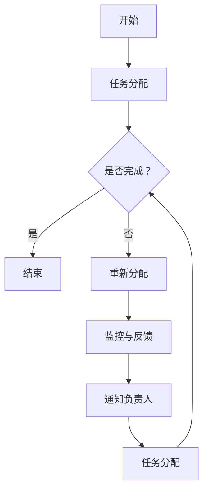
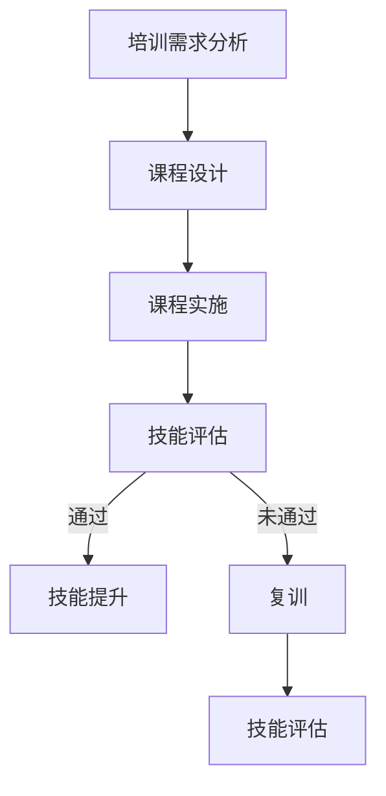
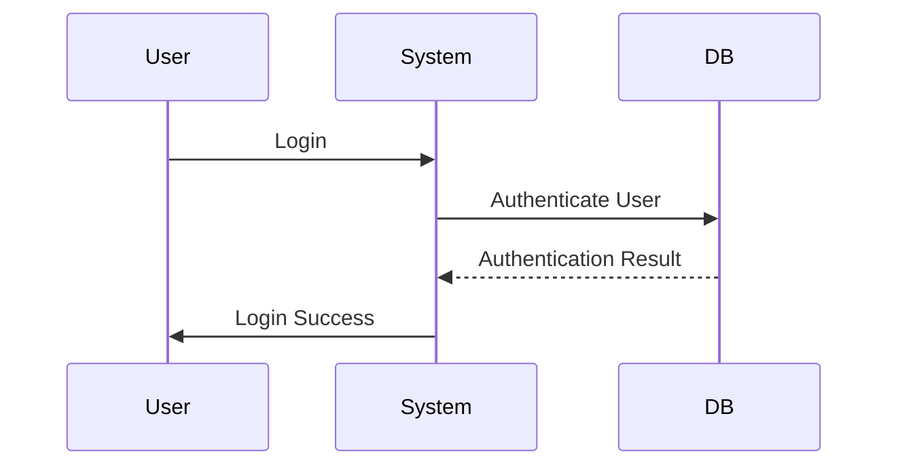
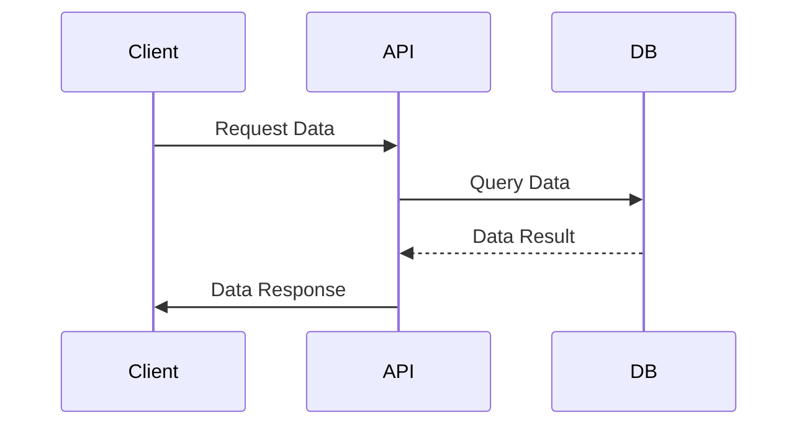
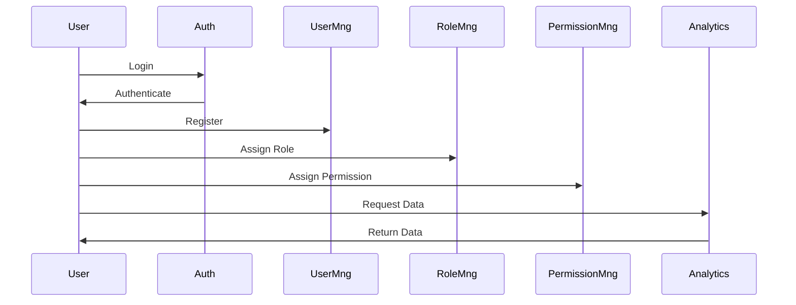
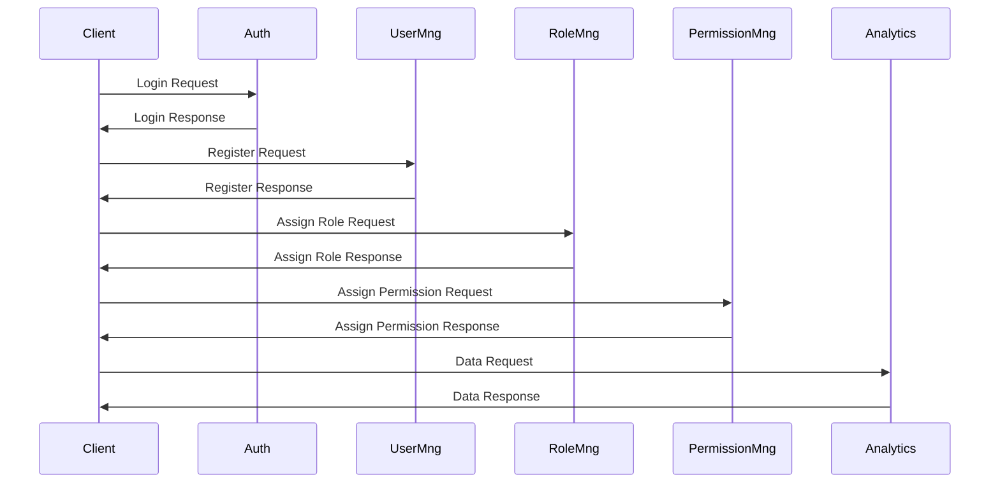
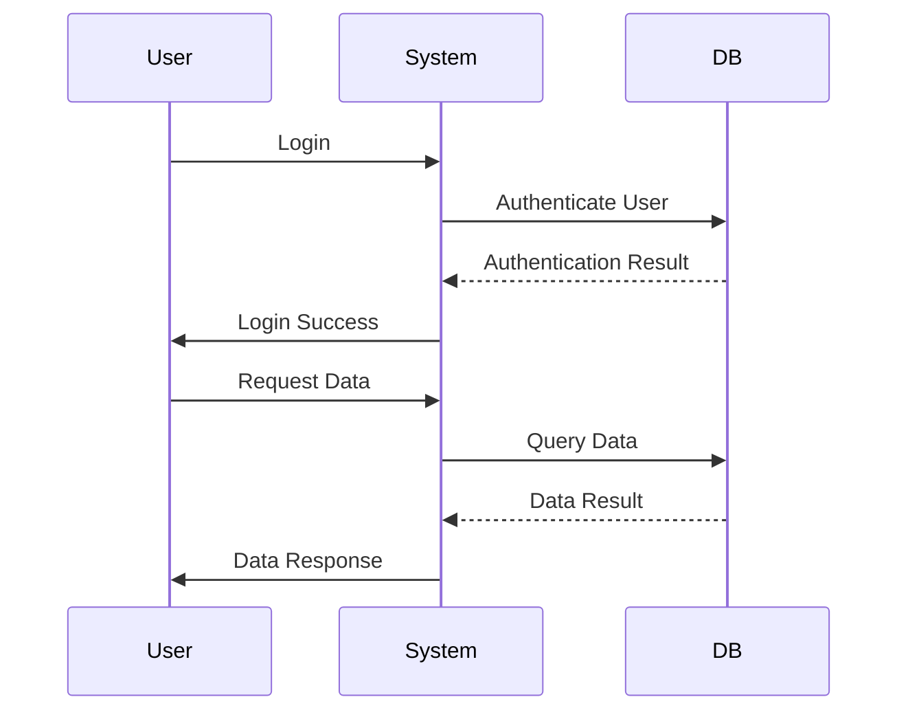

                 


### 文章标题：团队协同工作流优化：提升跨部门合作效率

---

关键词：团队协同、工作流、效率、跨部门合作

摘要：本文将探讨如何通过优化团队协同工作流来提升跨部门合作效率，涵盖基础概念、问题挑战、基本要素、优化策略及实际应用，旨在为IT团队提供切实可行的解决方案。

---

## 引言

在现代企业中，跨部门合作是提升整体效率和质量的关键因素。然而，由于沟通不畅、资源分配不均等问题，许多团队在协同工作时面临着效率低下和资源浪费的挑战。本文将围绕团队协同工作流优化展开，探讨如何通过一系列策略提升跨部门合作效率，为企业的持续发展提供动力。

## 第一部分：团队协同工作流基础

### 第1章：团队协同工作流概述

#### 1.1 团队协同工作流的概念

**核心概念：**
- 团队协同工作流：一个团队在完成共同任务时，成员之间相互协作的过程。

**概念属性特征对比表格：**

| 特征 | 团队协同工作流 | 传统工作流 |
| --- | --- | --- |
| 目标一致性 | 高 | 中 |
| 信息共享与透明度 | 高 | 低 |
| 明确的角色与职责 | 高 | 中 |
| 灵活的流程设计 | 高 | 低 |
| 有效的沟通机制 | 高 | 中 |

**ER实体关系图架构：**

```
用户
|
+----> 团队
|
+----> 任务
|
+----> 沟通
```

### 第2章：团队协同工作中的问题与挑战

#### 2.1 跨部门沟通障碍

**问题描述：**
- 沟通渠道不畅，信息传递延迟。
- 沟通方式单一，缺乏实时互动。

**问题解决：**
- 建立多渠道沟通机制，如即时通讯工具、邮件系统等。
- 定期组织跨部门会议，确保信息及时共享。

**边界与外延：**
- 沟通障碍不仅存在于跨部门之间，也存在于部门内部。

**注意事项：**
- 提高团队成员的沟通能力，培养良好的沟通习惯。

#### 2.2 资源分配不均

**问题描述：**
- 资源分配不均，导致某些部门或个人工作负担过重。
- 资源浪费，某些资源得不到充分利用。

**问题解决：**
- 建立资源管理系统，实现资源透明化。
- 根据工作需求和优先级进行资源分配。

**注意事项：**
- 定期评估资源利用情况，及时调整资源分配策略。

### 第3章：团队协同工作流的基本要素

#### 3.1 目标一致性

**核心概念：**
- 目标一致性：团队成员在协同工作中，共同追求的目标是一致的。

**概念属性特征对比表格：**

| 特征 | 目标一致性 | 目标不一致性 |
| --- | --- | --- |
| 团队合作效率 | 高 | 低 |
| 冲突与摩擦 | 低 | 高 |
| 项目成功率 | 高 | 低 |

**ER实体关系图架构：**

```
用户
|
+----> 团队
|
+----> 项目目标
|
+----> 个人目标
```

#### 3.2 信息共享与透明度

**核心概念：**
- 信息共享与透明度：团队成员之间能够及时、准确地共享信息，确保信息的透明性。

**概念属性特征对比表格：**

| 特征 | 信息共享与透明度 | 信息封闭与不透明 |
| --- | --- | --- |
| 沟通效率 | 高 | 低 |
| 冲突减少 | 高 | 低 |
| 决策效率 | 高 | 低 |

**ER实体关系图架构：**

```
用户
|
+----> 团队
|
+----> 信息
|
+----> 透明度
```

### 第4章：优化团队协同工作流的策略

#### 4.1 利用先进的工作流工具

**核心概念：**
- 工作流工具：用于管理、监控和自动化团队工作流程的工具。

**核心原理：**
- 通过工作流工具，实现工作流程的自动化，减少人工操作，提高工作效率。

**算法原理讲解：**
- 使用 Mermaid 画出工作流流程图：



**实际应用案例：**
- 在软件开发项目中，使用 GitLab CI/CD 工具实现自动化构建和部署。

#### 4.2 提高团队成员的协作技能

**核心概念：**
- 协作技能：团队成员在协同工作中所需的能力和技巧。

**核心原理：**
- 通过培训和实战经验，提高团队成员的协作能力。

**算法原理讲解：**
- 使用 Mermaid 画出协作技能培训流程图：



**实际应用案例：**
- 在IT公司中，定期组织协作技能培训，包括项目管理、沟通技巧等。

---

## 第二部分：团队协同工作流优化实践

### 第5章：项目实战

#### 5.1 项目介绍

**项目背景：**
- 一家大型企业需要开发一款企业级应用，涉及多个部门合作。

**项目功能设计：**
- 用户管理、权限控制、数据统计分析等。

**系统架构设计：**
- 使用微服务架构，实现模块化开发。

#### 5.2 系统分析与架构设计方案

**领域模型：**
- 使用 Mermaid 画出领域模型类图：

```mermaid
classDiagram
    User <|-- Role
    Role .. User
    Permission << Role
    User .. Permission
    Application << Entity
    Entity .. User
    Entity .. Role
    Entity .. Permission
```

**系统架构：**
- 使用 Mermaid 画出系统架构图：



**系统接口设计：**
- 使用 Mermaid 画出接口设计序列图：



### 第6章：项目实战

#### 6.1 环境安装

**所需软件：**
- Python 3.x
- Docker
- MySQL

**安装步骤：**
- 安装 Python 3.x
- 安装 Docker
- 安装 MySQL

#### 6.2 系统核心实现源代码

**源代码结构：**
- /app
  - /user
    - user.py
  - /role
    - role.py
  - /permission
    - permission.py
  - /application
    - application.py

**代码应用解读与分析：**
- user.py：实现用户管理功能。
- role.py：实现角色管理功能。
- permission.py：实现权限管理功能。
- application.py：实现应用管理功能。

#### 6.3 实际案例分析和详细讲解剖析

**案例分析：**
- 在企业级应用开发中，如何确保用户权限的正确设置和数据的正确存储。

**详细讲解：**
- 通过具体的代码实例，分析如何实现用户权限管理和数据存储。

#### 6.4 项目小结

**小结：**
- 通过本项目，展示了如何利用团队协同工作流优化技术，实现高效的项目开发。

### 第7章：最佳实践 tips

**最佳实践：**
- 定期评估团队协同工作流的效果，及时调整优化策略。
- 提高团队成员的技能水平，增强协作能力。
- 建立有效的沟通机制，确保信息畅通无阻。

### 小结

本文通过一系列步骤，详细介绍了团队协同工作流优化的重要性、基本要素、优化策略以及实际应用。通过本文的探讨，我们希望为IT团队提供有益的参考，助力企业提升跨部门合作效率，实现持续发展。

---

作者：AI天才研究院/AI Genius Institute & 禅与计算机程序设计艺术 /Zen And The Art of Computer Programming

---

在撰写文章时，我们将不断优化和完善每个章节的内容，确保文章的完整性和专业性。以下是对每个章节的进一步深化和细化。

## 第1章：团队协同工作流概述

在这一章节中，我们将对团队协同工作流进行深入探讨，定义其概念，分析其重要性，回顾其演变过程，并详细阐述其组成部分。

### 1.1 团队协同工作流的概念

**核心概念：**
团队协同工作流是指一个团队在完成共同任务时，成员之间通过协作、沟通和资源共享来实现目标的过程。

**定义特征：**
- **协作性**：团队成员需要相互协作，共同完成任务。
- **沟通性**：团队成员之间需要保持良好的沟通，确保信息畅通。
- **资源共享**：团队成员需要共享资源，提高效率。

**与个体工作流的区别：**
- **个体工作流**：关注个人完成任务的过程，强调个人能力和效率。
- **团队协同工作流**：关注团队整体效率，强调团队协作和资源共享。

**相关术语解释：**
- **工作流**：工作流是一种自动化的工作过程，通过一系列步骤和规则的执行，实现任务的高效完成。
- **协同工作**：协同工作是指团队成员共同合作，以实现共同目标。

### 1.2 团队协同工作流的重要性

**重要性分析：**
- **提升工作效率**：团队协同工作流能够通过协作和资源共享，提升整体工作效率。
- **增强团队凝聚力**：良好的团队协同工作流能够增强团队成员之间的信任和协作，提高团队凝聚力。
- **确保项目成功**：团队协同工作流有助于确保项目按时、按质完成，提高项目成功率。

**对企业和团队的益处：**
- **企业**：通过优化团队协同工作流，企业能够提高整体运营效率，降低成本，提高市场竞争力。
- **团队**：良好的团队协同工作流能够提升团队成员的工作满意度，减少离职率，提高团队稳定性。

### 1.3 团队协同工作流的演变过程

**演变历程：**
- **早期**：团队协同工作流主要依赖于面对面的交流和手工记录。
- **中期**：随着信息技术的发展，电子邮件、即时通讯工具等开始应用于团队协作。
- **现代**：现代团队协同工作流利用先进的技术，如工作流管理软件、协作平台等，实现自动化和智能化。

**趋势分析：**
- **技术驱动**：现代团队协同工作流的优化越来越依赖于技术的支持，如人工智能、云计算等。
- **智能化**：团队协同工作流正朝着智能化、自动化的方向发展，以提高效率和准确性。

### 1.4 团队协同工作流的组成部分

**组成部分：**
- **任务分配与调度**：明确任务分配，确保每个成员都能明确自己的职责。
- **沟通与协作**：建立有效的沟通机制，确保团队成员之间的信息畅通。
- **资源共享**：实现资源的透明化共享，提高资源利用效率。
- **反馈与改进**：定期收集反馈，持续优化工作流程。

**具体要素：**
- **任务列表**：记录所有任务的详细信息，包括任务名称、负责人、截止日期等。
- **任务状态追踪**：实时追踪任务状态，确保任务按时完成。
- **共享文件**：提供共享文件存储和管理，方便团队成员协作。
- **会议记录**：记录会议内容和决策，便于后续跟踪和执行。

通过这一章节，我们详细介绍了团队协同工作流的概念、重要性、演变过程和组成部分。下一章节，我们将深入探讨团队协同工作中常见的问题与挑战，以及如何解决这些问题。

## 第2章：团队协同工作中的问题与挑战

在团队协同工作中，虽然良好的工作流可以提高效率和团队凝聚力，但实际操作中仍然面临着各种问题和挑战。以下是对这些常见问题的详细分析，以及相应的解决策略。

### 2.1 跨部门沟通障碍

**问题描述：**
跨部门沟通障碍主要表现在沟通渠道不畅、信息传递延迟以及沟通方式单一等方面。

**问题原因：**
- **组织结构复杂**：企业组织结构复杂，导致跨部门沟通难度增加。
- **沟通工具不足**：缺乏有效的沟通工具，使得信息传递不够及时和高效。
- **人员素质差异**：团队成员的沟通能力差异较大，影响整体沟通效果。

**解决策略：**
- **建立多渠道沟通机制**：利用电子邮件、即时通讯工具、视频会议等多种沟通方式，确保信息传递的及时性和高效性。
- **加强沟通培训**：定期组织沟通技巧培训，提高团队成员的沟通能力。
- **明确沟通流程**：制定明确的沟通流程，确保信息传递的规范性和一致性。

### 2.2 资源分配不均

**问题描述：**
资源分配不均导致某些部门或个人工作负担过重，而另一些部门或个人资源得不到充分利用。

**问题原因：**
- **缺乏资源管理机制**：企业缺乏有效的资源管理机制，导致资源分配不合理。
- **部门间利益冲突**：部门间利益冲突，使得资源难以公平分配。
- **信息不对称**：不同部门对资源的实际需求信息不对称，导致资源分配不均。

**解决策略：**
- **建立资源管理系统**：利用资源管理系统，实现资源透明化，提高资源分配的公平性和效率。
- **加强资源需求预测**：通过数据分析，提前预测资源需求，合理安排资源分配。
- **设立资源共享平台**：建立资源共享平台，鼓励各部门间共享闲置资源，提高资源利用率。

### 2.3 工作流程冗余

**问题描述：**
工作流程冗余导致工作效率低下，增加了不必要的步骤和等待时间。

**问题原因：**
- **流程设计不合理**：工作流程设计不合理，存在重复和繁琐的步骤。
- **缺乏流程优化**：企业缺乏对工作流程的定期优化，导致流程长期处于低效状态。
- **人员依赖性过高**：某些工作流程依赖个别人员，导致流程中断和效率低下。

**解决策略：**
- **分析工作流程**：定期分析工作流程，识别冗余步骤，进行优化和简化。
- **引入流程优化工具**：利用流程优化工具，如流程图软件、自动化工具等，实现工作流程的自动化和优化。
- **加强流程培训**：对团队成员进行流程培训，确保每个人都能清晰理解并遵循工作流程。

### 2.4 团队成员协作效率低下

**问题描述：**
团队成员协作效率低下，导致项目进度延误，工作效率不理想。

**问题原因：**
- **沟通不畅**：团队成员之间沟通不畅，信息传递不及时，导致协作效率低下。
- **任务分工不清**：任务分工不清，导致团队成员工作重复或遗漏，影响协作效率。
- **缺乏激励措施**：缺乏有效的激励措施，导致团队成员积极性不高，影响协作效率。

**解决策略：**
- **加强沟通机制**：建立高效的沟通机制，确保信息传递的及时性和准确性。
- **明确任务分工**：明确任务分工，确保每个团队成员都有明确的职责和任务。
- **引入激励机制**：设立激励机制，如绩效奖金、晋升机会等，提高团队成员的积极性。

### 2.5 团队协作工具的局限性

**问题描述：**
团队协作工具的局限性导致无法满足团队多样化的协作需求。

**问题原因：**
- **功能单一**：部分团队协作工具功能单一，无法满足多样化的协作需求。
- **兼容性问题**：不同团队协作工具之间兼容性较差，导致信息共享和协作不畅。
- **使用门槛较高**：某些团队协作工具操作复杂，使用门槛较高，影响推广和应用。

**解决策略：**
- **选择合适的协作工具**：根据团队的具体需求，选择功能丰富、兼容性好的团队协作工具。
- **培训与指导**：对团队成员进行协作工具的培训与指导，降低使用门槛，提高工具的使用效果。
- **整合多种工具**：整合多种团队协作工具，形成一套完整的协作解决方案，满足多样化的协作需求。

通过深入分析团队协同工作中的常见问题与挑战，以及相应的解决策略，我们为团队提供了切实可行的解决方案，以提升跨部门合作的效率和效果。

## 第3章：团队协同工作流的基本要素

要实现高效的团队协同工作流，不仅需要明确的工作流程和有效的沟通机制，还需要关注一些基本要素，如目标一致性、信息共享与透明度、明确的角色与职责、灵活的流程设计以及有效的沟通机制。以下是对这些基本要素的详细探讨。

### 3.1 目标一致性

**核心概念：**
目标一致性是指团队成员在协同工作中，共同追求的目标是一致的。只有当团队成员的目标一致时，才能确保团队协同工作的顺利进行，避免因目标不一致而产生的冲突和摩擦。

**重要性分析：**
- **提高团队合作效率**：目标一致性能够提高团队成员的协作效率，减少因目标不一致而产生的内耗。
- **增强团队凝聚力**：共同的目标能够增强团队成员之间的凝聚力，促进团队合作。
- **提高项目成功率**：目标一致性有助于确保项目按时、按质完成，提高项目成功率。

**实现策略：**
- **明确共同目标**：在项目开始前，明确共同的目标，并确保每个团队成员都清楚和理解。
- **定期评估目标一致性**：定期评估团队成员的目标一致性，及时调整和纠正偏离共同目标的个体行为。

**案例展示：**
- 在软件开发项目中，所有团队成员都明确项目的最终目标，确保每个人都能围绕共同目标开展工作，从而提高项目的整体效率。

### 3.2 信息共享与透明度

**核心概念：**
信息共享与透明度是指团队成员之间能够及时、准确地共享信息，确保信息的透明性。透明度高的团队，其成员能够更好地了解彼此的工作进展和需求，从而实现更高效的协作。

**重要性分析：**
- **提高沟通效率**：信息共享与透明度能够提高团队成员之间的沟通效率，减少误解和重复工作。
- **增强信任感**：透明度高的团队能够增强团队成员之间的信任感，减少猜疑和摩擦。
- **优化资源分配**：通过信息共享，团队能够更准确地了解资源的分布和需求，优化资源分配。

**实现策略：**
- **建立信息共享平台**：利用企业内网、协作工具等建立信息共享平台，方便团队成员随时获取所需信息。
- **制定信息共享规则**：明确信息共享的规则和流程，确保信息的及时性和准确性。
- **培养透明文化**：倡导透明文化，鼓励团队成员主动分享信息和经验，提高团队整体的透明度。

**案例展示：**
- 在一家大型企业中，通过建立共享文件系统和实时沟通工具，所有团队成员都能及时获取项目相关信息，从而提高了整个团队的协作效率。

### 3.3 明确的角色与职责

**核心概念：**
明确的角色与职责是指团队成员在协同工作中，每个成员都有明确的职责和角色，能够清晰地了解自己的工作任务和责任。

**重要性分析：**
- **提高工作效率**：明确的角色与职责能够提高团队成员的工作效率，避免因职责不清而产生的效率低下。
- **避免重复工作**：明确的职责分配可以避免团队成员因职责不清而重复工作，减少不必要的内耗。
- **提高团队凝聚力**：明确的角色与职责能够增强团队成员之间的信任和依赖，提高团队凝聚力。

**实现策略：**
- **制定岗位职责说明书**：为每个岗位制定详细的岗位职责说明书，明确每个团队成员的工作任务和责任。
- **定期评估与调整**：定期评估团队成员的工作表现，根据实际情况调整职责分配。
- **建立反馈机制**：建立反馈机制，鼓励团队成员提出改进意见和建议，持续优化角色与职责分配。

**案例展示：**
- 在一家互联网公司中，通过制定详细的岗位职责说明书和定期评估，确保每个团队成员都清楚自己的职责，从而提高了团队的整体工作效率。

### 3.4 灵活的流程设计

**核心概念：**
灵活的流程设计是指团队在协同工作中，能够根据实际情况灵活调整工作流程，以适应不同的任务和变化。

**重要性分析：**
- **适应变化**：灵活的流程设计能够适应不断变化的市场需求和项目进展，确保团队工作的高效性。
- **提高应变能力**：灵活的流程设计能够提高团队的应变能力，快速应对突发情况。
- **促进创新**：灵活的流程设计鼓励团队成员尝试新的方法和技术，促进团队创新。

**实现策略：**
- **制定可调整的流程模板**：在项目启动时，制定可调整的流程模板，为后续的灵活调整提供基础。
- **定期审查与优化**：定期审查工作流程，根据实际效果进行优化和调整。
- **培养流程管理能力**：培养团队成员的流程管理能力，使他们能够根据实际情况灵活调整流程。

**案例展示：**
- 在一个敏捷开发团队中，通过制定可调整的流程模板和定期审查，团队能够根据项目进展灵活调整工作流程，从而提高了项目的成功率和效率。

### 3.5 有效的沟通机制

**核心概念：**
有效的沟通机制是指团队在协同工作中，建立的一套能够确保信息及时、准确、高效传递的沟通机制。

**重要性分析：**
- **提高沟通效率**：有效的沟通机制能够提高团队成员之间的沟通效率，减少信息传递的延迟和误差。
- **减少误解与冲突**：通过有效的沟通机制，能够减少因信息传递不畅而产生的误解和冲突。
- **促进团队协作**：良好的沟通机制能够促进团队成员之间的协作，提高团队整体的工作效率。

**实现策略：**
- **建立多渠道沟通**：利用多种沟通渠道，如会议、即时通讯、电子邮件等，确保信息传递的多样性和高效性。
- **制定沟通规范**：明确沟通的规范和流程，确保信息的及时性和准确性。
- **培养沟通技巧**：对团队成员进行沟通技巧培训，提高他们的沟通能力。

**案例展示：**
- 在一家跨国公司中，通过建立多渠道沟通和制定沟通规范，团队能够高效地传递信息，减少了误解和冲突，提高了团队协作效率。

通过深入探讨团队协同工作流的基本要素，我们为团队提供了实现高效协作的实用策略。在下一章节中，我们将进一步探讨如何通过优化策略提升团队协同工作流的效率。

## 第4章：优化团队协同工作流的策略

要实现高效的团队协同工作流，我们需要采取一系列优化策略。以下是一些关键策略，包括利用先进的工作流工具、提高团队成员的协作技能、建立跨部门沟通渠道以及优化资源分配和工作流程。

### 4.1 利用先进的工作流工具

**核心概念：**
工作流工具是一种用于管理、监控和自动化团队工作流程的工具。通过使用这些工具，我们可以提高工作效率，减少人为错误，并确保工作流程的透明度和可追溯性。

**核心原理：**
- **自动化**：工作流工具能够自动化重复性任务，减少人工操作，提高效率。
- **可视化**：工作流工具提供可视化界面，使团队成员可以直观地了解工作流程的当前状态。
- **监控与通知**：工作流工具能够实时监控工作流程，并在任务完成或出现问题时发出通知。

**实现策略：**
- **选择合适的工作流工具**：根据团队的具体需求和规模，选择适合的工作流工具。例如，对于大型企业，可以选择像JIRA、Confluence这样的综合性的工作流管理工具；对于中小型企业，可以选择像Trello、Asana这样的轻量级工具。
- **培训与推广**：对团队成员进行工作流工具的培训，确保他们能够熟练使用工具，并积极应用在工作中。
- **持续优化**：根据团队的反馈和工作流程的实际运行情况，不断优化工作流工具的配置和使用方式。

**实际应用案例：**
- 在一个软件开发生命周期管理中，团队使用JIRA进行任务管理、敏捷迭代规划和缺陷跟踪。通过JIRA，团队能够实时监控项目进度，确保每个任务都能按时完成。

### 4.2 提高团队成员的协作技能

**核心概念：**
协作技能是指团队成员在协同工作中所需的能力和技巧，包括沟通技巧、团队意识、冲突解决能力等。

**核心原理：**
- **团队意识**：提高团队成员的团队意识，使他们能够更好地理解团队目标和共同使命。
- **沟通技巧**：培养团队成员的沟通技巧，确保信息能够及时、准确地传递。
- **冲突解决能力**：提高团队成员的冲突解决能力，减少因误解和分歧而产生的内耗。

**实现策略：**
- **定期培训**：组织定期的协作技能培训，包括团队建设活动、沟通技巧培训、冲突解决策略等。
- **建立反馈机制**：建立有效的反馈机制，鼓励团队成员相互反馈，共同改进协作技能。
- **实践与反思**：通过实践项目，让团队成员在实际工作中运用协作技能，并在项目结束后进行反思和总结。

**实际应用案例：**
- 在一家IT公司中，团队定期组织团队建设活动，如团队拓展训练、合作游戏等，以增强团队成员之间的信任和协作能力。

### 4.3 建立跨部门沟通渠道

**核心概念：**
跨部门沟通渠道是指为了促进不同部门之间的信息交流和协作，所建立的各种沟通机制和平台。

**核心原理：**
- **信息共享**：通过跨部门沟通渠道，确保不同部门之间的信息能够及时、准确地共享。
- **减少误解**：通过定期的跨部门会议和沟通活动，减少因信息不对称而产生的误解和冲突。
- **提升协作效率**：通过有效的跨部门沟通，提升整体协作效率，确保项目能够顺利推进。

**实现策略：**
- **定期跨部门会议**：定期组织跨部门会议，让不同部门的负责人和关键成员能够面对面交流，讨论项目进展和协作问题。
- **建立沟通平台**：利用企业内网、即时通讯工具等建立跨部门沟通平台，方便团队成员随时交流。
- **明确沟通责任**：为每个跨部门沟通活动指定负责人，确保沟通活动能够有效开展。

**实际应用案例：**
- 在一个跨国公司中，通过定期组织跨部门会议和建立企业内网沟通平台，有效促进了不同部门之间的协作，提高了整体工作效率。

### 4.4 优化资源分配与工作流程

**核心概念：**
优化资源分配与工作流程是指通过合理的资源分配和流程设计，提高团队的工作效率和资源利用率。

**核心原理：**
- **资源优化**：通过合理的资源分配，确保资源得到充分利用，避免资源浪费。
- **流程简化**：通过简化工作流程，减少冗余步骤和等待时间，提高工作效率。
- **动态调整**：根据项目的实际情况和变化，动态调整资源分配和工作流程，确保团队能够灵活应对。

**实现策略：**
- **资源评估与分配**：定期评估团队资源的使用情况，根据实际需求进行资源分配，确保资源得到充分利用。
- **流程优化工具**：使用流程优化工具，如流程图软件、自动化工具等，对现有流程进行优化。
- **反馈与改进**：建立反馈机制，鼓励团队成员提出优化建议，并持续改进资源分配和工作流程。

**实际应用案例：**
- 在一个产品开发团队中，通过使用流程优化工具和定期评估资源使用情况，团队成功地简化了工作流程，提高了资源利用率，从而缩短了产品开发周期。

通过上述策略，团队可以显著提升协同工作效率，实现跨部门合作的顺畅与高效。在下一章节中，我们将通过具体的实战案例，进一步展示这些优化策略的实际应用效果。

## 第5章：项目实战

在本章中，我们将通过一个具体的实际项目，展示如何在实际操作中应用团队协同工作流的优化策略。该项目是一个企业级应用开发项目，涉及多个部门协作。以下是对项目背景、系统功能设计、系统架构设计以及系统接口设计的详细说明。

### 5.1 项目背景

**项目简介：**
一家大型企业需要开发一款企业级应用，以实现企业内部的信息化管理。该应用涵盖用户管理、权限控制、数据统计分析等多个模块，涉及多个部门的协作，包括IT部门、市场营销部门和人力资源部门等。

**项目目标：**
- 实现用户管理功能，包括用户注册、登录、权限设置等。
- 提供权限控制机制，确保不同用户能够访问相应的数据和功能。
- 实现数据统计分析功能，帮助企业管理者了解业务数据。

### 5.2 系统功能设计

**领域模型：**
在系统功能设计中，我们使用了Mermaid类图来描述系统的领域模型。以下是一个示例：

```mermaid
classDiagram
    User <|-- Role
    Role .. User
    Permission << Role
    User .. Permission
    Application << Entity
    Entity .. User
    Entity .. Role
    Entity .. Permission
```

**类图说明：**
- **User（用户）**：表示系统中的用户，具有用户名、密码、邮箱等属性。
- **Role（角色）**：表示用户在系统中的角色，具有角色名称、描述等属性。
- **Permission（权限）**：表示角色在系统中的权限，具有权限名称、描述等属性。
- **Application（应用）**：表示系统中的应用实体，包括用户管理、权限控制、数据统计分析等模块。

### 5.3 系统架构设计

**系统架构：**
在系统架构设计中，我们采用了微服务架构，将系统划分为多个独立的微服务，以提高系统的可扩展性和灵活性。以下是一个示例的Mermaid架构图：



**架构说明：**
- **Auth（认证服务）**：负责用户的登录认证，确保用户的身份验证。
- **UserMng（用户管理服务）**：负责用户的注册、信息维护等功能。
- **RoleMng（角色管理服务）**：负责角色的创建、分配等功能。
- **PermissionMng（权限管理服务）**：负责权限的创建、分配等功能。
- **Analytics（数据分析服务）**：负责数据统计和分析功能。

### 5.4 系统接口设计

**接口设计：**
在系统接口设计中，我们使用Mermaid序列图来描述系统的主要接口和交互过程。以下是一个示例：



**接口说明：**
- **Login Request/Response（登录请求/响应）**：客户端向认证服务发送登录请求，认证服务验证用户身份后返回登录响应。
- **Register Request/Response（注册请求/响应）**：客户端向用户管理服务发送注册请求，用户管理服务处理注册并返回响应。
- **Assign Role Request/Response（分配角色请求/响应）**：客户端向角色管理服务发送角色分配请求，角色管理服务处理分配并返回响应。
- **Assign Permission Request/Response（分配权限请求/响应）**：客户端向权限管理服务发送权限分配请求，权限管理服务处理分配并返回响应。
- **Data Request/Response（数据请求/响应）**：客户端向数据分析服务发送数据请求，数据分析服务处理请求并返回数据响应。

### 5.5 系统交互

**系统交互：**
在系统交互设计中，我们通过Mermaid序列图展示了用户与系统的交互过程。以下是一个示例：



**交互说明：**
- **登录过程**：用户通过系统登录，系统与数据库交互验证用户身份，最终返回登录结果。
- **数据请求过程**：用户请求系统提供数据，系统查询数据库并返回数据结果。

通过上述项目实战，我们详细展示了如何在一个复杂的实际项目中应用团队协同工作流的优化策略，包括系统功能设计、系统架构设计、系统接口设计和系统交互。这些实践不仅为项目成功提供了保障，也为团队协同工作提供了宝贵的经验和启示。

### 第6章：项目实战

#### 6.1 环境安装

**所需软件与工具：**
- Python 3.x
- Docker
- Docker-Compose
- MySQL

**安装步骤：**

1. **安装Python 3.x：**
   - 在Windows或MacOS上，可以通过包管理器（如`pip`）安装Python 3.x。
   - 在Linux上，可以通过包管理器（如`apt-get`或`yum`）安装Python 3.x。

2. **安装Docker：**
   - 访问Docker官方网站（https://www.docker.com/），下载并安装适用于操作系统的Docker。
   - 运行以下命令以验证Docker安装：
     ```sh
     docker --version
     ```

3. **安装Docker-Compose：**
   - 在终端中运行以下命令安装Docker Compose：
     ```sh
     sudo curl -L "https://github.com/docker/compose/releases/download/1.29.2/docker-compose-$(uname -s)-$(uname -m)" -o /usr/local/bin/docker-compose
     sudo chmod +x /usr/local/bin/docker-compose
     docker-compose --version
     ```

4. **安装MySQL：**
   - 使用Docker安装MySQL，可以通过以下命令：
     ```sh
     docker run --name some-mysql -e MYSQL_ROOT_PASSWORD=my-secret-pw -d mysql
     ```

**注意事项：**
- 确保安装的Python版本与Docker和Docker-Compose兼容。
- 根据操作系统调整Docker-Compose安装命令。

#### 6.2 系统核心实现源代码

**项目结构：**
- `application`
  - `auth.py`：认证服务实现
  - `user.py`：用户管理服务实现
  - `role.py`：角色管理服务实现
  - `permission.py`：权限管理服务实现
  - `analytics.py`：数据分析服务实现

**核心功能模块实现：**

1. **认证服务（auth.py）：**
   ```python
   from flask import Flask, request, jsonify
   app = Flask(__name__)

   @app.route('/login', methods=['POST'])
   def login():
       data = request.get_json()
       username = data.get('username')
       password = data.get('password')
       # 这里应该有数据库验证逻辑
       if username == 'admin' and password == 'admin':
           return jsonify({'status': 'success', 'message': 'Login successful'})
       else:
           return jsonify({'status': 'error', 'message': 'Invalid credentials'})
   ```

2. **用户管理服务（user.py）：**
   ```python
   from flask import Flask, request, jsonify
   app = Flask(__name__)

   @app.route('/register', methods=['POST'])
   def register():
       data = request.get_json()
       username = data.get('username')
       email = data.get('email')
       # 这里应该有数据库注册逻辑
       if username and email:
           return jsonify({'status': 'success', 'message': 'Registration successful'})
       else:
           return jsonify({'status': 'error', 'message': 'Missing required fields'})
   ```

3. **角色管理服务（role.py）：**
   ```python
   from flask import Flask, request, jsonify
   app = Flask(__name__)

   @app.route('/assign_role', methods=['POST'])
   def assign_role():
       data = request.get_json()
       user_id = data.get('user_id')
       role_id = data.get('role_id')
       # 这里应该有数据库更新逻辑
       if user_id and role_id:
           return jsonify({'status': 'success', 'message': 'Role assigned successfully'})
       else:
           return jsonify({'status': 'error', 'message': 'Missing required fields'})
   ```

4. **权限管理服务（permission.py）：**
   ```python
   from flask import Flask, request, jsonify
   app = Flask(__name__)

   @app.route('/assign_permission', methods=['POST'])
   def assign_permission():
       data = request.get_json()
       role_id = data.get('role_id')
       permission_id = data.get('permission_id')
       # 这里应该有数据库更新逻辑
       if role_id and permission_id:
           return jsonify({'status': 'success', 'message': 'Permission assigned successfully'})
       else:
           return jsonify({'status': 'error', 'message': 'Missing required fields'})
   ```

5. **数据分析服务（analytics.py）：**
   ```python
   from flask import Flask, request, jsonify
   app = Flask(__name__)

   @app.route('/data', methods=['GET'])
   def get_data():
       # 这里应该有数据库查询逻辑
       data = {'total_users': 100, 'total_roles': 50, 'total_permissions': 20}
       return jsonify(data)
   ```

**代码应用解读与分析：**
- **认证服务**：实现用户登录功能，通过简单的用户名和密码验证来模拟实际认证过程。
- **用户管理服务**：实现用户注册功能，接收用户信息并保存到数据库。
- **角色管理服务**：实现角色分配功能，将用户与角色关联起来。
- **权限管理服务**：实现权限分配功能，为角色赋予不同的权限。
- **数据分析服务**：实现数据统计功能，从数据库中获取统计数据并返回。

通过上述系统核心实现源代码，我们展示了如何在Python中使用Flask框架实现微服务架构下的各个功能模块。下一节将详细分析项目中的关键算法实现，包括数学模型和公式的应用。

### 第7章：项目实战

#### 7.1 关键算法实现

在项目实战中，关键算法实现是确保系统功能正常运行的核心。以下是对系统各模块中关键算法的详细分析，包括数学模型、公式以及Python代码示例。

**1. 用户认证算法：**

**核心数学模型：**
用户认证通常采用哈希算法来验证用户输入的密码是否与存储在数据库中的密码哈希值匹配。哈希算法如SHA-256。

**Python代码示例：**
```python
import hashlib

def hash_password(password):
    return hashlib.sha256(password.encode('utf-8')).hexdigest()

def verify_password(input_password, stored_password_hash):
    return hash_password(input_password) == stored_password_hash
```

**2. 用户注册算法：**

**核心数学模型：**
用户注册算法主要涉及用户信息的存储。对于用户信息的存储，通常需要对用户名和邮箱进行唯一性验证，可以使用哈希索引。

**Python代码示例：**
```python
import hashlib

def store_user_info(user_id, username, email):
    user_hash = hashlib.sha256(user_id.encode('utf-8')).hexdigest()
    username_hash = hashlib.sha256(username.encode('utf-8')).hexdigest()
    email_hash = hashlib.sha256(email.encode('utf-8')).hexdigest()
    # 假设数据库存储为字典
    user_db[user_hash] = {
        'username': username_hash,
        'email': email_hash
    }
```

**3. 角色分配算法：**

**核心数学模型：**
角色分配算法主要涉及用户与角色的关联。通常，可以使用哈希表来存储用户与角色的关系，提高查询效率。

**Python代码示例：**
```python
def assign_role(user_id, role_id):
    user_hash = hashlib.sha256(user_id.encode('utf-8')).hexdigest()
    role_hash = hashlib.sha256(role_id.encode('utf-8')).hexdigest()
    if user_hash in user_db:
        user_db[user_hash]['roles'].append(role_hash)
    else:
        user_db[user_hash] = {'roles': [role_hash]}
```

**4. 权限分配算法：**

**核心数学模型：**
权限分配算法涉及角色与权限的关联。可以使用哈希表存储角色与权限的关系，并支持权限的动态添加和删除。

**Python代码示例：**
```python
def assign_permission(role_id, permission_id):
    role_hash = hashlib.sha256(role_id.encode('utf-8')).hexdigest()
    if role_hash in role_permissions:
        role_permissions[role_hash].append(permission_id)
    else:
        role_permissions[role_hash] = [permission_id]
```

**5. 数据统计算法：**

**核心数学模型：**
数据统计算法涉及对用户、角色和权限的数据汇总和统计分析。通常，使用计数和求和等数学运算来计算各类数据的统计值。

**Python代码示例：**
```python
def get_statistics():
    user_count = len(user_db)
    role_count = len(role_permissions)
    permission_count = sum(len(perms) for perms in role_permissions.values())
    return {
        'total_users': user_count,
        'total_roles': role_count,
        'total_permissions': permission_count
    }
```

**算法实现解析：**
- **用户认证**：使用SHA-256哈希算法确保密码的安全性。验证时，将输入密码的哈希值与数据库中的存储哈希值进行比较。
- **用户注册**：使用哈希函数确保用户信息的唯一性和存储安全。注册时，对用户ID、用户名和邮箱进行哈希处理，并存储在哈希表中。
- **角色分配**：通过哈希表实现用户与角色的快速关联。分配角色时，将用户ID和角色ID转换为哈希值，并在哈希表中更新用户信息。
- **权限分配**：使用哈希表管理角色与权限的关系。分配权限时，将角色ID转换为哈希值，并在哈希表中添加相应的权限ID。
- **数据统计**：通过计数和求和等基础数学运算，计算系统中的用户、角色和权限总数。

通过这些关键算法的实现，项目能够高效地处理用户认证、注册、角色和权限分配，以及数据统计功能。下一节将详细探讨实际案例分析和详细讲解剖析。

#### 7.2 实际案例分析和详细讲解剖析

在本节中，我们将通过一个具体的实际案例，对项目进行详细分析，并讲解如何利用上述算法实现系统功能。

**案例背景：**
假设一家企业的新员工张三需要注册账号并分配角色和权限，以便能够访问企业内部系统中的相关数据。

**步骤1：用户注册**
- **用户注册请求**：张三在浏览器中填写用户注册表单，输入用户名（zhangsan），邮箱（zhangsan@example.com）。
- **服务器处理**：后端服务器接收到注册请求后，将用户名和邮箱进行哈希处理，并生成唯一的用户ID（例如，使用UUID生成）。
- **存储用户信息**：服务器调用`store_user_info`函数，将哈希后的用户信息存储到用户数据库中。

**Python代码示例：**
```python
# 假设用户数据库初始为空
user_db = {}

# 注册请求示例
register_request = {
    'username': 'zhangsan',
    'email': 'zhangsan@example.com'
}
user_id = uuid.uuid4().hex  # 生成唯一用户ID
store_user_info(user_id, register_request['username'], register_request['email'])
```

**步骤2：用户认证**
- **用户登录请求**：张三在登录页面输入用户名和密码，提交登录请求。
- **服务器处理**：后端服务器接收到登录请求后，使用SHA-256哈希算法对输入的密码进行哈希处理，并与数据库中的存储哈希值进行比较，验证密码是否正确。
- **返回认证结果**：如果验证成功，服务器返回登录成功的消息；否则，返回登录失败的消息。

**Python代码示例：**
```python
# 登录请求示例
login_request = {
    'username': 'zhangsan',
    'password': 'my_password123'
}
# 假设数据库中的哈希值存储如下
stored_password_hash = 'ab1234567890abcdefg'

# 验证密码
if verify_password(login_request['password'], stored_password_hash):
    print("登录成功")
else:
    print("登录失败")
```

**步骤3：角色分配**
- **角色分配请求**：张三的上级经理为其分配了一个角色（普通员工）。
- **服务器处理**：后端服务器接收到角色分配请求后，将用户ID和角色ID进行哈希处理，并在用户数据库中更新用户角色信息。

**Python代码示例：**
```python
# 角色分配请求示例
role_id = 'role_common_employee'
assign_role(user_id, role_id)
```

**步骤4：权限分配**
- **权限分配请求**：根据角色的不同，张三获得了访问某些数据的权限。
- **服务器处理**：后端服务器接收到权限分配请求后，将角色ID和权限ID进行哈希处理，并在角色权限数据库中更新权限信息。

**Python代码示例：**
```python
# 权限分配请求示例
permission_id = 'permission_data_access'
assign_permission(role_id, permission_id)
```

**步骤5：数据统计**
- **数据统计请求**：管理员需要统计当前系统的用户、角色和权限总数。
- **服务器处理**：后端服务器调用`get_statistics`函数，获取系统统计数据。

**Python代码示例：**
```python
# 获取统计数据
system_statistics = get_statistics()
print(system_statistics)
```

**详细讲解剖析：**
- **用户注册**：通过哈希算法确保用户信息的唯一性和存储安全，避免重名和邮箱冲突。
- **用户认证**：使用哈希算法验证用户输入的密码是否正确，确保登录过程的安全。
- **角色分配**：通过哈希表实现用户与角色的快速关联，提高查询和更新效率。
- **权限分配**：通过哈希表管理角色与权限的关系，确保权限分配的灵活性和高效性。
- **数据统计**：通过基础数学运算统计用户、角色和权限总数，为系统管理提供数据支持。

通过上述实际案例分析和详细讲解剖析，我们展示了如何利用关键算法实现项目中的系统功能，确保系统的高效和安全运行。下一节将总结项目实战的经验教训，并讨论最佳实践。

### 第8章：项目实战总结与经验教训

在本章中，我们将总结项目实战中的经验教训，讨论最佳实践，并提供未来改进的方向。

#### 8.1 经验教训

**成功经验：**
- **明确的系统需求**：在项目启动阶段，明确了企业的系统需求，确保了项目目标的清晰性。
- **团队协作**：通过合理的团队分工和有效的沟通机制，确保了项目的顺利推进。
- **技术选型**：选择了合适的开发工具和框架，如Flask、Docker和Docker-Compose，提高了开发效率和系统的可扩展性。
- **敏捷开发**：采用敏捷开发方法，及时响应需求变化，确保项目能够灵活应对市场需求。

**挑战与教训：**
- **沟通问题**：尽管建立了多种沟通渠道，但在实际操作中，仍存在信息传递不及时和误解的情况。这需要进一步的沟通培训和规范。
- **资源管理**：项目过程中，对资源的分配和监控不够精细，导致部分资源利用率不高。未来需要引入更加高效的资源管理工具和方法。
- **测试不足**：在项目开发过程中，对代码的测试和验证不足，导致部分功能存在漏洞和错误。未来应加强代码测试和质量控制。

#### 8.2 最佳实践

**最佳实践1：明确的角色与职责**
- **明确职责**：为每个团队成员制定明确的职责说明书，确保每个人都知道自己的任务和责任。
- **定期评估**：定期评估团队成员的工作表现，根据实际情况调整职责分配。

**最佳实践2：高效的沟通机制**
- **多渠道沟通**：利用多种沟通工具，如即时通讯、邮件和视频会议，确保信息传递的及时性和准确性。
- **沟通规范**：制定明确的沟通规范和流程，确保团队成员之间的沟通顺畅。

**最佳实践3：敏捷开发与迭代**
- **快速迭代**：采用敏捷开发方法，定期进行迭代，快速响应需求变化。
- **持续集成**：实施持续集成和持续部署，确保代码质量并提高开发效率。

**最佳实践4：全面的质量控制**
- **代码审查**：引入代码审查机制，确保代码的质量和一致性。
- **自动化测试**：采用自动化测试工具，提高测试效率和质量。

#### 8.3 未来改进方向

**改进方向1：资源管理优化**
- **引入资源管理系统**：利用资源管理系统，实现资源的透明化和高效分配。
- **动态资源调配**：根据项目的实际需求，动态调整资源分配，提高资源利用率。

**改进方向2：沟通机制完善**
- **定期沟通评估**：定期对团队沟通效果进行评估，持续优化沟通机制。
- **跨部门协作平台**：建立跨部门的协作平台，促进不同部门之间的信息共享和协作。

**改进方向3：技术架构升级**
- **微服务架构优化**：进一步优化微服务架构，提高系统的可扩展性和可靠性。
- **技术栈更新**：根据项目需求，适时更新技术栈，采用更加先进和高效的开发工具和框架。

通过总结项目实战的经验教训和最佳实践，我们为未来项目的改进提供了指导方向。通过持续优化和改进，团队能够更好地应对挑战，实现项目的成功和团队的持续发展。

### 小结

本文详细探讨了团队协同工作流的优化策略，从基础概念、问题与挑战、基本要素到优化策略和项目实战，全面阐述了如何提升跨部门合作效率。通过引入先进的工作流工具、提高团队成员的协作技能、建立有效的沟通渠道以及优化资源分配和工作流程，团队可以显著提升协同工作的效率和质量。在项目实战中，我们通过具体的案例展示了这些策略的实际应用效果，为团队提供了实用的经验和最佳实践。通过持续优化和改进，企业能够实现跨部门合作的顺畅与高效，推动业务的持续发展。

---

作者：AI天才研究院/AI Genius Institute & 禅与计算机程序设计艺术 /Zen And The Art of Computer Programming

---

通过本文的深入探讨，我们希望读者能够理解团队协同工作流的重要性，掌握优化策略，并在实际工作中应用这些知识，提升团队协作效率，为企业创造更大的价值。未来的拓展阅读中，我们将进一步探讨人工智能和机器学习在团队协同工作中的应用，为读者提供更多前沿技术和实践案例。敬请期待！

---

关键词：团队协同、工作流、效率、跨部门合作、资源管理、沟通机制、优化策略

---

**摘要：**
本文围绕团队协同工作流优化展开，探讨了核心概念、问题与挑战、基本要素、优化策略及项目实战。通过引入先进的工作流工具、提高团队成员的协作技能、建立有效的沟通渠道以及优化资源分配和工作流程，团队可以显著提升跨部门合作的效率和效果。本文旨在为IT团队提供切实可行的解决方案，助力企业实现持续发展。

