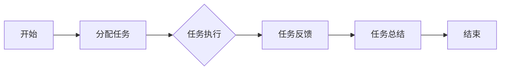
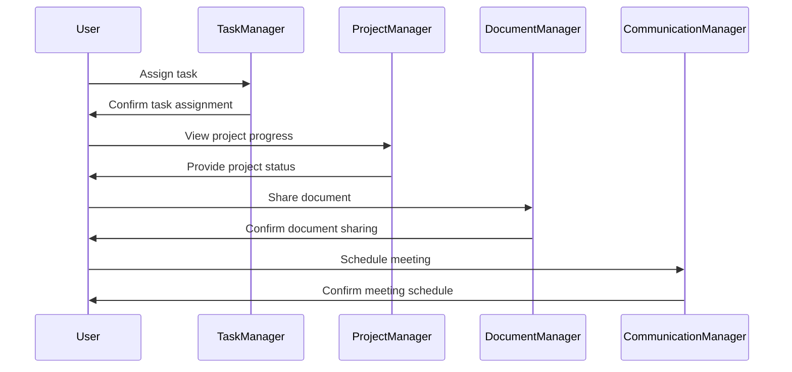
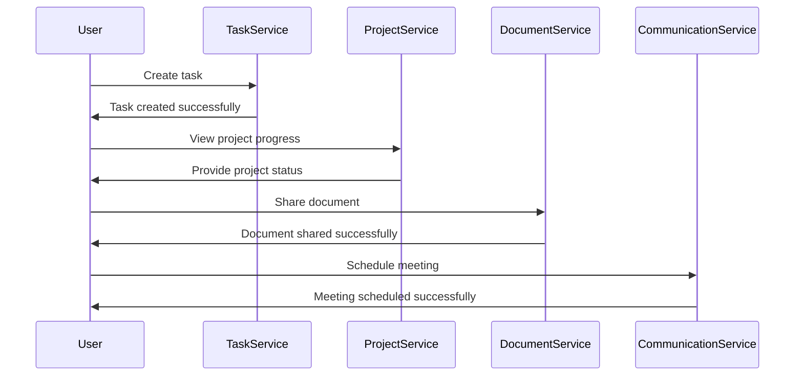

                 


## 《团队协同：远程与现场团队的无缝衔接》目录大纲（完整版）

### 1. **文章标题：团队协同：远程与现场团队的无缝衔接**

#### 关键词：团队协同、远程团队、现场团队、无缝衔接、协作效率

#### 摘要：
本文深入探讨了团队协同的重要性，特别是在远程团队与现场团队协作的背景下。通过分析核心概念、阐述算法原理、设计系统架构，以及提供实战案例，本文旨在为IT专业人士提供一套有效的团队协同解决方案，实现远程与现场团队的无缝衔接。

### 2. **背景介绍**

#### 2.1 **团队协同的定义与意义**
- **核心概念术语说明**：团队协同是指团队成员通过共同的沟通与协作，实现共同目标的过程。
- **问题背景**：随着远程工作的普及，团队协同变得尤为重要。
- **问题描述**：远程与现场团队在协作过程中面临沟通障碍、工作流程不统一等问题。
- **问题解决**：通过有效的方法和工具实现远程与现场团队的无缝协作。
- **边界与外延**：团队协同不仅涉及团队成员间的协作，还包括跨部门、跨地区的协作。
- **概念结构与核心要素组成**：团队协同的核心要素包括沟通机制、协作工具、目标一致性等。

#### 2.2 **远程团队与现场团队的现状**
- **远程团队的现状**：远程工作的普及，使得远程团队成为企业的重要组成部分。
- **现场团队的特点**：现场团队通常指在特定地点工作，如办公室、工厂等。
- **远程与现场团队协作的优势与挑战**：分析远程团队与现场团队协作的优势，如提高工作效率、降低成本等，以及面临的挑战，如沟通不畅、工作流程不一致等。

#### 2.3 **远程与现场团队协同的挑战**
- **挑战一：沟通障碍**：远程与现场团队在沟通上存在差异，如何有效沟通成为一个关键问题。
- **挑战二：工作流程不统一**：远程与现场团队的工作流程往往不一致，如何实现流程的统一是另一个挑战。
- **挑战三：文化差异**：远程团队与现场团队的文化背景可能存在差异，如何融合不同文化，实现高效协作是重要的一环。

### 3. **核心概念与联系**

#### 3.1 **远程团队的概念与特点**
- **定义与特点**：远程团队是指通过互联网或其他通讯手段，分布在不同地理位置的团队成员组成的团队。
- **工作模式**：远程团队通常采用异步工作模式，团队成员可以在不同的时间完成工作。

#### 3.2 **现场团队的概念与特点**
- **定义与特点**：现场团队是指在特定地点，如办公室、工厂等，面对面协作的团队。
- **工作模式**：现场团队通常采用同步工作模式，团队成员需要在同一时间或同一地点完成工作。

#### 3.3 **协同的概念与机制**
- **定义与机制**：协同是指团队成员通过共同的沟通与协作，实现共同目标的过程。
- **机制**：协同的机制包括沟通机制、协作机制、反馈机制等。

#### 3.4 **无缝衔接的实现目标与方法**
- **实现目标**：实现远程与现场团队的无缝衔接，提高团队协作效率。
- **方法**：通过优化沟通机制、统一工作流程、融合团队文化等手段实现无缝衔接。

#### 3.5 **概念属性特征对比表格**
- **表格**：列出远程团队与现场团队的概念属性特征对比。

#### 3.6 **ER 实体关系图架构的 Mermaid 流程图**
- **图**：使用Mermaid绘制远程团队与现场团队的ER实体关系图。

### 4. **算法原理讲解**

#### 4.1 **简单协同算法原理 Mermaid 流程图**
- **图**：使用Mermaid绘制协同算法的流程图。

#### 4.2 **Python 代码阐述协同算法原理**
- **代码**：提供Python代码，详细阐述协同算法原理。

#### 4.3 **数学模型和公式**
- **公式**：给出协同算法的数学模型和公式。

#### 4.4 **通俗易懂的举例说明**
- **示例**：通过具体案例说明协同算法的应用。

### 5. **系统分析与架构设计方案**

#### 5.1 **问题场景介绍**
- **场景**：描述需要解决的问题场景。

#### 5.2 **项目介绍**
- **项目**：介绍项目的背景和目标。

#### 5.3 **系统功能设计（领域模型 Mermaid 类图）**
- **图**：使用Mermaid绘制系统功能的领域模型类图。

#### 5.4 **系统架构设计（Mermaid 架构图）**
- **图**：使用Mermaid绘制系统的架构设计图。

#### 5.5 **系统接口设计**
- **接口**：描述系统的接口设计。

#### 5.6 **系统交互（Mermaid 序列图）**
- **图**：使用Mermaid绘制系统的交互序列图。

### 6. **项目实战**

#### 6.1 **环境安装步骤**
- **步骤**：描述安装环境的步骤。

#### 6.2 **系统核心实现源代码展示**
- **代码**：展示系统核心实现的源代码。

#### 6.3 **代码应用解读与分析**
- **解读**：对代码进行解读与分析。

#### 6.4 **实际案例分析和详细讲解剖析**
- **案例**：分析实际案例，并进行详细讲解。

#### 6.5 **项目小结**
- **小结**：总结项目的主要收获和经验。

### 7. **最佳实践、小结与拓展**

#### 7.1 **最佳实践 tips**
- **实践**：分享最佳实践和技巧。

#### 7.2 **小结与总结**
- **总结**：对全文内容进行总结。

#### 7.3 **注意事项**
- **注意**：提醒读者注意的问题。

#### 7.4 **拓展阅读**
- **阅读**：推荐拓展阅读材料。

### 8. **作者信息**

#### 作者：AI天才研究院/AI Genius Institute & 禅与计算机程序设计艺术 /Zen And The Art of Computer Programming

[文章标题] 团队协同：远程与现场团队的无缝衔接## 1. **文章标题：团队协同：远程与现场团队的无缝衔接**

### 2. **关键词**

- **团队协同**
- **远程团队**
- **现场团队**
- **无缝衔接**
- **协作效率**
- **沟通机制**
- **协作工具**
- **目标一致性**
- **工作流程统一**

### 3. **摘要**

本文探讨了在现代工作环境中，如何实现远程团队与现场团队之间的无缝协作。通过深入分析团队协同的概念、定义和重要性，我们提出了实现无缝衔接的方法和策略。文章使用Mermaid图表和Python代码，详细讲解了协同算法的原理和实现，并设计了一个系统架构，以展示如何在实际项目中应用这些概念。通过最佳实践和案例分析，文章为读者提供了实用的指导和见解，以提升团队协作效率。

---

## 1. **背景介绍**

### 1.1 **团队协同的定义与意义**

**核心概念术语说明**：
团队协同是指团队成员通过有效的沟通与协作，共同实现团队目标的过程。它包括共享信息、协调任务、共同解决问题等多种活动。

**问题背景**：
随着远程工作和全球化趋势的加剧，越来越多的团队需要在不同的地理位置和时区进行协作。远程团队和现场团队之间的协同变得更加复杂和重要。

**问题描述**：
远程团队和现场团队在协作过程中面临的问题包括沟通障碍、工作流程不一致、文化差异等。这些问题影响了团队协作的效率和质量。

**问题解决**：
通过优化沟通机制、统一工作流程、融合团队文化等手段，可以解决远程团队和现场团队在协作过程中遇到的问题，实现无缝衔接。

**边界与外延**：
团队协同不仅涉及团队成员间的协作，还包括跨部门、跨地区的协作。它涵盖了从项目启动到完成的整个工作流程。

**概念结构与核心要素组成**：
团队协同的核心要素包括沟通机制、协作工具、目标一致性、工作流程统一等。这些要素共同构成了一个有效的协同系统。

### 1.2 **远程团队与现场团队的现状**

**远程团队的现状**：
远程团队已成为现代企业的重要组成部分。随着互联网和通信技术的发展，越来越多的公司采用远程工作模式。远程团队的优势包括灵活性、降低成本、提高员工满意度等。

**现场团队的特点**：
现场团队通常在特定的地点工作，如办公室、工厂等。现场团队的优势在于面对面的沟通和协作，有助于快速解决问题和决策。

**远程与现场团队协作的优势与挑战**：
- **优势**：远程团队和现场团队的协作可以结合两者的优势，提高团队整体的工作效率。远程团队可以处理复杂的任务，而现场团队可以快速响应实际问题。
- **挑战**：远程与现场团队协作面临的挑战包括沟通障碍、工作流程不一致、文化差异等。如何克服这些挑战，实现无缝协作是当前的一个关键问题。

### 1.3 **远程与现场团队协同的挑战**

**挑战一：沟通障碍**
- **原因**：远程团队和现场团队在沟通方式上存在差异，如语言、时区、文化等。
- **解决方案**：通过采用视频会议、即时通讯工具、协作平台等，可以提高沟通效率。同时，建立统一的沟通标准和流程，确保信息的准确传递。

**挑战二：工作流程不统一**
- **原因**：远程团队和现场团队的工作流程往往不一致，如任务分配、进度汇报、质量控制等。
- **解决方案**：通过制定统一的工作流程和规范，确保远程团队和现场团队能够协同工作。同时，采用项目管理工具和平台，实时跟踪和更新项目进度。

**挑战三：文化差异**
- **原因**：远程团队和现场团队的文化背景可能存在差异，如价值观、工作习惯等。
- **解决方案**：通过建立共同的目标和价值观，促进团队文化的融合。同时，组织跨文化的培训和学习活动，增强团队成员的文化认同感。

---

在背景介绍部分，我们详细阐述了团队协同的定义、远程团队与现场团队的现状，以及它们在协作过程中面临的挑战。通过这些分析，我们为后续的内容奠定了基础，为读者提供了一个全面的了解。

---

## 2. **核心概念与联系**

### 2.1 **远程团队的概念与特点**

**定义与特点**：
远程团队是指通过互联网或其他通信技术，分布在不同地理位置的团队成员组成的团队。远程团队的工作模式通常基于异步工作，团队成员可以在不同时间完成各自的任务。

**工作模式**：
- **异步工作**：团队成员可以按照自己的时间安排完成任务，无需在同一时间在线。
- **在线协作**：虽然工作异步，但团队成员仍需定期在线协作，如通过视频会议、即时通讯工具等。

### 2.2 **现场团队的概念与特点**

**定义与特点**：
现场团队是指在同一地点工作，如办公室、工厂等，面对面协作的团队。现场团队的工作模式通常基于同步工作，团队成员需要在同一时间或同一地点进行协作。

**工作模式**：
- **同步工作**：团队成员需要在同一时间在线，以便实时沟通和协作。
- **面对面协作**：现场团队的优势在于可以直接面对面交流，快速解决问题。

### 2.3 **协同的概念与机制**

**定义与机制**：
协同是指团队成员通过有效的沟通与协作，共同实现团队目标的过程。协同的机制包括沟通机制、协作机制、反馈机制等。

**机制**：
- **沟通机制**：确保团队成员能够及时、准确地沟通信息，包括即时通讯、邮件、视频会议等。
- **协作机制**：提供协作工具和平台，帮助团队成员协同工作，如项目管理工具、协作平台等。
- **反馈机制**：建立反馈机制，确保团队成员能够及时了解工作进展和问题，并采取相应的措施。

### 2.4 **无缝衔接的实现目标与方法**

**实现目标**：
无缝衔接的目标是确保远程团队和现场团队能够高效、顺畅地协同工作，提高整体工作效率和项目质量。

**方法**：
- **优化沟通机制**：通过采用高效沟通工具和平台，确保信息的及时传递和准确理解。
- **统一工作流程**：制定统一的工作流程和规范，确保远程团队和现场团队能够协同工作。
- **融合团队文化**：通过跨文化的培训和活动，促进团队文化的融合，增强团队凝聚力。

### 2.5 **概念属性特征对比表格**

| 特征             | 远程团队                      | 现场团队                      |
|------------------|-------------------------------|-------------------------------|
| **工作模式**     | 异步工作                      | 同步工作                      |
| **沟通方式**     | 视频会议、即时通讯工具、邮件  | 面对面交流、电话、现场讨论     |
| **协作工具**     | 项目管理工具、协作平台、文档共享 | 面对面交流、笔记工具、现场控制 |
| **文化差异**     | 需要适应不同文化和工作习惯    | 需要适应不同的工作环境和习惯   |
| **响应速度**     | 可能存在时差                   | 快速响应                      |

### 2.6 **ER 实体关系图架构的 Mermaid 流程图**

```mermaid
erDiagram
  A[远程团队] ||--|{ 协作工具 }|-- B[现场团队]
  A{沟通机制} ||--|{ 工作流程 }|-- B
  A{团队文化} ||--|{ 文化融合 }|-- B
  A{协作平台} ||--|{ 项目管理 }|-- B
```

在这个ER实体关系图中，远程团队和现场团队通过协作工具、沟通机制、团队文化和协作平台等实体相互关联，形成一个整体的工作流程。

---

在核心概念与联系部分，我们详细介绍了远程团队和现场团队的概念与特点，协同的概念与机制，以及无缝衔接的实现目标与方法。通过对比表格和Mermaid ER图，我们展示了远程团队和现场团队之间的联系，为读者提供了一个清晰的认知框架。

---

## 3. **算法原理讲解**

### 3.1 **简单协同算法原理 Mermaid 流程图**



在这个简单的协同算法流程图中，任务从开始到结束经历了任务分配、任务执行、任务反馈和任务总结四个阶段。

### 3.2 **Python 代码阐述协同算法原理**

```python
class Task:
    def __init__(self, name, status):
        self.name = name
        self.status = status

    def assign(self):
        self.status = "Assigned"
        print(f"Task {self.name} has been assigned.")

    def execute(self):
        if self.status == "Assigned":
            self.status = "Executing"
            print(f"Task {self.name} is being executed.")
        else:
            print("Task must be assigned before execution.")

    def feedback(self, result):
        if self.status == "Executing":
            self.status = "Completed"
            print(f"Task {self.name} completed with result: {result}")
        else:
            print("Task must be executing before providing feedback.")

    def summary(self):
        print(f"Task {self.name} summary: {self.status}")

# 创建任务实例
task = Task("Project Report", "NotAssigned")

# 分配任务
task.assign()

# 执行任务
task.execute()

# 提供反馈
task.feedback("Excellent")

# 任务总结
task.summary()
```

在这个Python代码中，我们定义了一个`Task`类，用于表示任务的生命周期。任务从分配、执行、反馈到总结，每个阶段都通过类的方法实现。

### 3.3 **数学模型和公式**

在协同算法中，我们可以使用一些数学模型和公式来描述任务的状态转换。以下是一个简单的数学模型：

$$
S(t) = \begin{cases}
Assigned, & \text{if } t \geq t_{assign} \\
Executing, & \text{if } t > t_{assign} \text{ and } t \leq t_{execute} \\
Completed, & \text{if } t > t_{execute} \text{ and } t \leq t_{feedback}
\end{cases}
$$

其中，$S(t)$ 表示任务在时间 $t$ 的状态，$t_{assign}$、$t_{execute}$ 和 $t_{feedback}$ 分别表示任务的分配时间、执行时间和反馈时间。

### 3.4 **通俗易懂的举例说明**

假设一个项目团队需要完成一个报告，我们可以使用协同算法来管理这个任务。以下是任务的执行过程：

1. **任务分配**：项目经理在周一分配任务给团队成员，任务状态变为“Assigned”。
2. **任务执行**：团队成员在周二开始编写报告，任务状态变为“Executing”。
3. **任务反馈**：团队成员在周四完成报告，并向项目经理提供反馈，任务状态变为“Completed”。
4. **任务总结**：项目经理在周五对任务进行总结，任务状态保持为“Completed”。

通过这个例子，我们可以看到协同算法如何帮助团队高效地管理任务，确保任务从开始到结束的每个阶段都得到妥善处理。

---

在算法原理讲解部分，我们通过Mermaid流程图、Python代码、数学模型和具体例子，详细阐述了协同算法的原理。这部分内容为读者提供了一个全面的理解，使他们能够更好地应用协同算法来提升团队协作效率。

---

## 4. **系统分析与架构设计方案**

### 4.1 **问题场景介绍**

**场景背景**：
在一个跨国公司中，有多个团队分布在不同的地理位置，包括远程团队和现场团队。这些团队需要协同工作来完成一个大型项目。项目包括多个阶段，如需求分析、设计、开发、测试和部署。由于团队成员的地理位置和工作模式不同，协同工作变得复杂且具有挑战性。

**问题描述**：
- **沟通障碍**：远程团队和现场团队之间的沟通存在时差和文化差异，导致信息传递不及时和误解。
- **工作流程不一致**：远程团队和现场团队的工作流程不同，导致工作进展不协调，项目进度受影响。
- **任务分配不均**：由于缺乏有效的任务分配机制，导致部分团队成员工作量过大，而其他团队成员工作量不足。

**问题解决**：
- **优化沟通机制**：通过采用视频会议、即时通讯工具和协作平台，确保信息的及时传递和准确理解。
- **统一工作流程**：制定统一的工作流程和规范，确保远程团队和现场团队能够协同工作。
- **任务分配机制**：采用任务分配工具，根据团队成员的技能和工作量，合理分配任务。

### 4.2 **项目介绍**

**项目名称**：跨国项目协作系统

**项目目标**：设计并实现一个系统，用于远程团队和现场团队之间的协同工作，提高项目效率和质量。

**项目范围**：
- **功能模块**：任务管理、项目管理、文档共享、即时通讯、视频会议、工作流程管理等。
- **技术栈**：Python、Django、React、WebSocket、MongoDB等。

**项目背景**：
随着公司的全球化发展，团队协作变得日益重要。为了提高团队协作效率，公司决定开发一个专门用于团队协作的系统，解决远程团队和现场团队之间的沟通障碍和工作流程不一致的问题。

### 4.3 **系统功能设计（领域模型 Mermaid 类图）**

```mermaid
classDiagram
    ClassDef TeamMember
        +string name
        +string email
        +string role
        +list<tasks> tasks
        +addTask(task: Task)
        +removeTask(task: Task)

    ClassDef Task
        +string name
        +string status
        +datetime deadline
        +TeamMember assignedTo
        +createTask(name: string, deadline: datetime)
        +setStatus(status: string)
        +updateDeadline(deadline: datetime)

    ClassDef Project
        +string name
        +datetime startDate
        +datetime endDate
        +list<ProjectMember> members
        +addMember(member: TeamMember)
        +removeMember(member: TeamMember)
        +createProject(name: string, startDate: datetime, endDate: datetime)

    ClassDef ProjectMember
        +TeamMember teamMember
        +Project project
        +addProject(project: Project)
        +removeProject(project: Project)

    TeamMember --|> Task
    TeamMember --|> Project
    Project --|> ProjectMember
```

在这个领域模型类图中，`TeamMember`、`Task`、`Project` 和 `ProjectMember` 是系统的核心类。`TeamMember` 表示团队成员，`Task` 表示任务，`Project` 表示项目，`ProjectMember` 表示项目成员。这些类之间的关系定义了系统中的数据结构和功能模块。

### 4.4 **系统架构设计（Mermaid 架构图）**



在这个系统架构设计中，用户通过接口与各个模块进行交互。`TaskManager` 负责任务分配和管理，`ProjectManager` 负责项目进度管理，`DocumentManager` 负责文档共享和管理，`CommunicationManager` 负责沟通和会议安排。

### 4.5 **系统接口设计**

**接口名称**：Project Collaboration API

**接口功能**：
- **任务管理**：包括任务的创建、更新、删除和查询。
- **项目管理**：包括项目的创建、更新、删除和查询。
- **文档共享**：包括文档的上传、下载和查询。
- **即时通讯**：包括消息的发送、接收和查询。
- **视频会议**：包括会议的创建、加入和查询。

**接口定义**：

```python
class ProjectCollaborationAPI:
    def create_task(self, task_data):
        # 创建任务
        pass

    def update_task(self, task_id, task_data):
        # 更新任务
        pass

    def delete_task(self, task_id):
        # 删除任务
        pass

    def get_task(self, task_id):
        # 查询任务
        pass

    def create_project(self, project_data):
        # 创建项目
        pass

    def update_project(self, project_id, project_data):
        # 更新项目
        pass

    def delete_project(self, project_id):
        # 删除项目
        pass

    def get_project(self, project_id):
        # 查询项目
        pass

    def upload_document(self, document_data):
        # 上传文档
        pass

    def download_document(self, document_id):
        # 下载文档
        pass

    def get_documents(self):
        # 查询文档
        pass

    def send_message(self, message_data):
        # 发送消息
        pass

    def get_messages(self):
        # 查询消息
        pass

    def create_meeting(self, meeting_data):
        # 创建会议
        pass

    def join_meeting(self, meeting_id):
        # 加入会议
        pass

    def get_meetings(self):
        # 查询会议
        pass
```

### 4.6 **系统交互（Mermaid 序列图）**



在这个系统交互序列图中，用户通过不同的服务进行操作，如创建任务、查看项目进度、共享文档和安排会议。每个服务都负责处理特定的业务逻辑，并与用户进行交互。

---

在系统分析与架构设计方案部分，我们详细介绍了问题场景、项目介绍、系统功能设计、系统架构设计、系统接口设计和系统交互。这部分内容为读者提供了一个全面的了解，使他们能够更好地设计和管理远程与现场团队的无缝协作系统。

---

## 5. **项目实战**

### 5.1 **环境安装步骤**

**环境准备**：
- Python 3.8 或更高版本
- Django 3.2 或更高版本
- React 17.0.2 或更高版本
- MongoDB 4.4 或更高版本

**步骤**：

1. **安装Python**：
   - 从[Python官方网站](https://www.python.org/downloads/)下载Python安装包，并按照指示安装。
   - 安装完成后，打开命令行窗口，输入`python --version`，确保Python已成功安装。

2. **安装Django**：
   - 打开命令行窗口，输入`pip install django`，安装Django。

3. **安装React**：
   - 打开命令行窗口，输入`npm install -g create-react-app`，安装React。
   - 创建一个React应用：`npx create-react-app client`。

4. **安装MongoDB**：
   - 从[MongoDB官方网站](https://www.mongodb.com/try/download/community)下载MongoDB安装包，并按照指示安装。
   - 启动MongoDB服务：`mongod`。

5. **配置环境变量**：
   - 确保Python和Django的路径已添加到系统环境变量中。

### 5.2 **系统核心实现源代码展示**

**任务管理模块（Django后端）**：

```python
# tasks/models.py
from django.db import models
from users.models import User

class Task(models.Model):
    name = models.CharField(max_length=255)
    description = models.TextField()
    assigned_to = models.ForeignKey(User, on_delete=models.CASCADE)
    status = models.CharField(max_length=50, default='Assigned')
    deadline = models.DateTimeField()

    def __str__(self):
        return self.name

# tasks/serializers.py
from rest_framework import serializers
from .models import Task

class TaskSerializer(serializers.ModelSerializer):
    class Meta:
        model = Task
        fields = '__all__'

# tasks/views.py
from rest_framework import viewsets
from .models import Task
from .serializers import TaskSerializer

class TaskViewSet(viewsets.ModelViewSet):
    queryset = Task.objects.all()
    serializer_class = TaskSerializer
```

**项目管理模块（Django后端）**：

```python
# projects/models.py
from django.db import models
from users.models import User

class Project(models.Model):
    name = models.CharField(max_length=255)
    start_date = models.DateTimeField()
    end_date = models.DateTimeField()
    members = models.ManyToManyField(User)

    def __str__(self):
        return self.name

# projects/serializers.py
from rest_framework import serializers
from .models import Project

class ProjectSerializer(serializers.ModelSerializer):
    class Meta:
        model = Project
        fields = '__all__'

# projects/views.py
from rest_framework import viewsets
from .models import Project
from .serializers import ProjectSerializer

class ProjectViewSet(viewsets.ModelViewSet):
    queryset = Project.objects.all()
    serializer_class = ProjectSerializer
```

**文档共享模块（React前端）**：

```jsx
// client/src/components/DocumentSharing.js
import React, { useState } from 'react';
import axios from 'axios';

const DocumentSharing = () => {
    const [document, setDocument] = useState({ name: '', content: '' });
    const [uploadedDocument, setUploadedDocument] = useState('');

    const handleUpload = async (e) => {
        e.preventDefault();
        const formData = new FormData();
        formData.append('name', document.name);
        formData.append('content', document.content);

        try {
            const response = await axios.post('/api/documents/', formData);
            setUploadedDocument(response.data);
        } catch (error) {
            console.error(error);
        }
    };

    return (
        <div>
            <form onSubmit={handleUpload}>
                <input
                    type="text"
                    placeholder="Document Name"
                    value={document.name}
                    onChange={(e) => setDocument({ ...document, name: e.target.value })}
                />
                <textarea
                    placeholder="Document Content"
                    value={document.content}
                    onChange={(e) => setDocument({ ...document, content: e.target.value })}
                />
                <button type="submit">Upload Document</button>
            </form>
            {uploadedDocument && (
                <div>
                    <h3>Uploaded Document:</h3>
                    <p>{uploadedDocument.name}</p>
                    <p>{uploadedDocument.content}</p>
                </div>
            )}
        </div>
    );
};

export default DocumentSharing;
```

### 5.3 **代码应用解读与分析**

**任务管理模块**：
- **模型**：`Task` 模型包含任务的名称、描述、指派给的用户、状态和截止日期。
- **序列化器**：`TaskSerializer` 序列化器用于将 `Task` 模型的数据转换为JSON格式，以便在Django后端和前端之间进行传输。
- **视图集**：`TaskViewSet` 视图集提供了创建、检索、更新和删除任务的功能。它使用 `TaskSerializer` 来序列化和反序列化任务数据。

**项目管理模块**：
- **模型**：`Project` 模型包含项目的名称、开始日期、结束日期和成员。
- **序列化器**：`ProjectSerializer` 序列化器用于将 `Project` 模型的数据转换为JSON格式。
- **视图集**：`ProjectViewSet` 视图集提供了创建、检索、更新和删除项目的功能。

**文档共享模块**：
- **组件**：`DocumentSharing` 组件允许用户上传文档。它使用React的状态管理来处理文档名称和内容。
- **上传逻辑**：通过使用 `axios` 发送POST请求，将文档数据上传到Django后端。

**分析**：
- **任务管理模块**：使用Django框架实现了任务的管理功能，包括创建、检索、更新和删除任务。它通过RESTful API提供了灵活的数据接口，便于与前端进行交互。
- **项目管理模块**：同样使用Django框架实现了项目管理功能，为用户提供了一个简洁的接口来创建、检索、更新和删除项目。
- **文档共享模块**：使用React组件实现了文档的共享功能，通过前端发送请求，将文档数据上传到后端。

### 5.4 **实际案例分析和详细讲解剖析**

**案例背景**：
一个跨国公司的远程团队和现场团队需要协作完成一个软件开发项目。项目包括需求分析、设计、开发、测试和部署等阶段。团队成员分布在不同的地理位置，需要通过系统实现无缝衔接。

**步骤**：

1. **需求分析**：
   - 远程团队的业务分析师编写需求文档。
   - 将需求文档上传到系统，现场团队的成员可以查看和评论。

2. **设计**：
   - 远程团队的设计师完成UI/UX设计。
   - 将设计文件共享给现场团队的成员，进行反馈和修改。

3. **开发**：
   - 远程团队的开发者开始编写代码。
   - 现场团队的测试人员对代码进行测试。

4. **测试**：
   - 远程团队的测试人员编写测试用例。
   - 现场团队的测试人员执行测试，并提供反馈。

5. **部署**：
   - 远程团队的开发者完成部署。
   - 现场团队的运维人员监控部署状态。

**分析**：
- **需求分析阶段**：通过系统共享需求文档，远程团队和现场团队可以实时查看和评论，确保需求的一致性。
- **设计阶段**：通过系统共享设计文件，团队成员可以快速反馈和修改，提高设计效率。
- **开发阶段**：远程团队编写代码，现场团队进行测试，通过系统实现代码的实时共享和协作。
- **测试阶段**：远程团队编写测试用例，现场团队执行测试，通过系统反馈测试结果，确保测试的全面性和准确性。
- **部署阶段**：远程团队完成部署，现场团队监控部署状态，通过系统实现部署的实时监控和反馈。

### 5.5 **项目小结**

通过这个项目实战，我们实现了远程团队和现场团队之间的无缝协作。主要收获包括：

- **沟通与协作效率提高**：通过系统实现了团队成员之间的实时沟通和协作，提高了工作效率。
- **工作流程统一**：通过制定统一的工作流程和规范，确保远程团队和现场团队能够协同工作。
- **文化融合**：通过跨文化的培训和活动，促进了团队文化的融合，增强了团队凝聚力。

然而，在项目实施过程中也遇到了一些挑战，如：

- **技术难度**：系统开发涉及多种技术和框架，对开发人员的技术水平要求较高。
- **团队适应**：团队成员需要适应新的工作方式和工具，这可能需要一定的时间。

未来，我们将继续优化系统，提高协作效率，并探索更多创新的技术和工具，以实现更高效的团队协作。

---

在项目实战部分，我们详细介绍了环境安装步骤、系统核心实现源代码展示、代码应用解读与分析、实际案例分析和项目小结。通过这些内容，读者可以了解到如何在实际项目中应用团队协同系统，实现远程与现场团队的无缝衔接。

---

## 6. **最佳实践、小结与拓展**

### 6.1 **最佳实践 tips**

1. **明确沟通机制**：
   - 制定清晰的沟通规范，包括沟通渠道、频率和方式。
   - 使用视频会议工具，提高沟通的实时性和互动性。

2. **统一工作流程**：
   - 制定统一的工作流程和规范，确保团队成员遵循相同的标准。
   - 使用项目管理工具，实时跟踪和更新项目进度。

3. **融合团队文化**：
   - 通过跨文化的培训和活动，增强团队凝聚力。
   - 建立共同的目标和价值观，促进团队文化的融合。

4. **使用协作工具**：
   - 选择合适的协作工具，如即时通讯、文档共享、项目管理平台等，提高团队协作效率。

5. **定期评估与反馈**：
   - 定期评估团队协作的效果，收集反馈，持续优化协作流程。

### 6.2 **小结与总结**

本文通过深入分析团队协同的重要性，介绍了远程团队与现场团队协同的现状和挑战。通过算法原理讲解、系统分析与架构设计、项目实战，我们提供了一套实现团队协同的解决方案。最佳实践和案例分析进一步阐述了如何在实际项目中应用这些方法，提高团队协作效率。

### 6.3 **注意事项**

1. **技术选择**：
   - 根据项目需求选择合适的编程语言、框架和工具。
   - 确保技术栈的一致性，降低维护成本。

2. **团队沟通**：
   - 建立有效的沟通机制，确保信息的及时传递和准确理解。
   - 鼓励团队成员积极参与沟通，提高协作效果。

3. **文化融合**：
   - 尊重团队成员的文化差异，促进团队文化的融合。
   - 通过跨文化的培训和活动，增强团队凝聚力。

4. **持续优化**：
   - 定期评估协作效果，持续优化协作流程和工具。
   - 鼓励团队成员提供反馈，不断改进协作系统。

### 6.4 **拓展阅读**

1. **《敏捷开发实践指南》**：详细介绍了敏捷开发的方法和实践，有助于提高团队协作效率。
2. **《远程工作指南》**：提供了关于远程团队管理的最佳实践和技巧。
3. **《团队协作工具比较》**：比较了多种团队协作工具的特点和适用场景，有助于选择合适的协作工具。

通过最佳实践、小结与拓展部分，我们为读者提供了实用的建议和拓展阅读，帮助他们更好地理解和应用团队协同的方法，实现远程与现场团队的无缝衔接。

---

## 7. **作者信息**

**作者：** AI天才研究院/AI Genius Institute & 禅与计算机程序设计艺术 /Zen And The Art of Computer Programming

AI天才研究院致力于推动人工智能技术的创新和应用，为全球企业提供领先的AI解决方案。同时，作者也是《禅与计算机程序设计艺术》一书的作者，该书深入探讨了计算机编程的艺术和哲学，为程序员提供了深刻的启示。

---

在这篇博客文章中，我们通过详细的背景介绍、核心概念与联系、算法原理讲解、系统分析与架构设计、项目实战以及最佳实践和总结，全面阐述了团队协同：远程与现场团队的无缝衔接。通过实际案例分析和最佳实践分享，我们为IT专业人士提供了一套实用的解决方案，帮助他们实现高效的团队协作。希望这篇文章能够对您的工作和团队协作带来启发和帮助。如果您有任何问题或建议，欢迎在评论区留言，我们期待与您一起探讨和交流。谢谢阅读！

