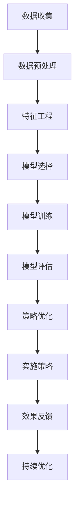
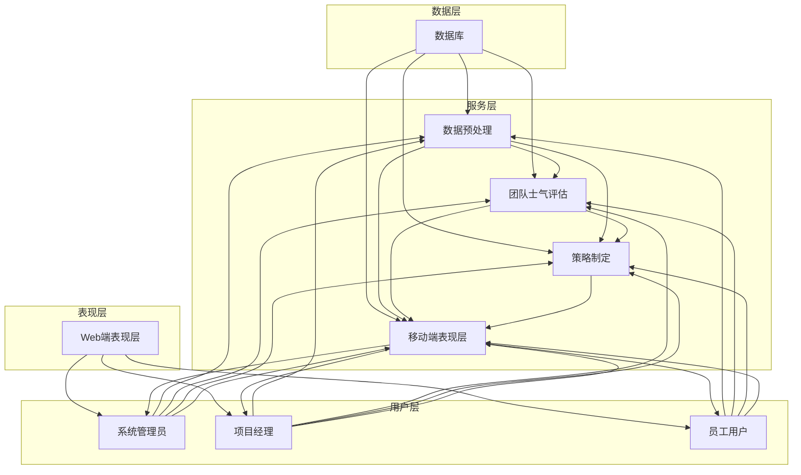

                 

### Step 1: 设计章节一 - 背景介绍

#### 1.1 问题背景

在当今快速变化和竞争激烈的市场环境中，企业之间的竞争已经不仅仅局限于技术和产品质量，团队士气的提升成为企业能否在激烈竞争中脱颖而出的关键因素。团队士气直接影响着团队成员的工作效率、创新能力和企业绩效。因此，如何有效地提升团队士气成为企业管理者面临的重要课题。

#### 1.2 问题描述

尽管许多企业已经开始重视团队士气的提升，但在实际操作过程中，依然存在以下问题：

- 如何准确地识别团队士气下降的原因？
- 哪些策略和工具能够有效地提升团队士气？
- 如何将团队士气提升与组织绩效结合起来，实现持续改进？
- 在不同行业和企业类型中，团队士气提升的方法有何异同？

这些问题需要我们深入分析和探讨，以便为企业提供切实可行的团队士气提升策略。

#### 1.3 问题解决

为了解决上述问题，本文将从以下几个方面展开讨论：

1. **团队士气概述**：介绍团队士气的概念、类型和重要性。
2. **团队士气下降的原因分析**：分析工作压力、人际关系、工作环境和企业文化等因素对团队士气的影响。
3. **核心概念与联系**：探讨团队士气评估指标、士气提升策略与工具以及士气提升与组织绩效的关系。
4. **算法原理讲解**：介绍士气提升算法的原理、流程和实现。
5. **数学模型和数学公式**：阐述士气提升的数学模型和公式，并通过实例进行详细讲解。
6. **系统分析与架构设计方案**：介绍问题场景、项目介绍、系统功能设计、系统架构设计和系统接口设计。
7. **项目实战**：详细描述环境安装、系统核心实现源代码、代码应用解读与分析、实际案例分析和项目小结。
8. **最佳实践 tips、小结、注意事项、拓展阅读**：总结团队士气提升的最佳实践，并提出注意事项和拓展阅读建议。

通过以上步骤，本文旨在为企业提供一套全面、系统的团队士气提升策略，帮助企业实现员工积极向上、团队合作高效的工作氛围。

#### 1.4 边界与外延

在本文的研究中，我们将重点关注以下边界和外部因素：

- **企业类型**：主要关注IT行业、制造业和服务业等不同类型企业的团队士气提升策略。
- **团队规模**：研究团队规模对士气提升策略的影响，包括小型团队、中型团队和大型团队。
- **文化差异**：探讨不同文化背景下团队士气提升策略的适用性和调整。
- **行业特点**：分析不同行业（如金融、医疗、教育等）对团队士气的影响及其提升策略。
- **外部环境**：关注宏观经济环境、政策法规和市场变化等因素对企业团队士气的影响。

#### 1.5 概念结构与核心要素组成

为了更好地理解和分析团队士气提升策略，我们需要明确以下核心概念和要素：

1. **团队士气**：团队士气是团队成员在工作中的精神状态、工作动力和合作意愿。
2. **士气评估指标**：士气评估指标包括工作效率、员工满意度、员工流失率、团队凝聚力、创新能力和企业绩效等。
3. **士气提升策略**：士气提升策略包括激励机制、培训与发展、团队建设活动和领导风格等方面。
4. **士气提升工具**：士气提升工具包括调查问卷、心理辅导、员工关怀计划和企业文化建设等。
5. **组织绩效**：组织绩效是企业在经营活动中所取得的成果，包括市场份额、利润、员工绩效等。

通过以上概念和要素的解析，我们可以更深入地理解团队士气提升的核心问题，为后续章节的内容提供理论基础。

### Step 2: 设计章节二 - 核心概念与联系

#### 2.1 核心概念原理

在探讨团队士气提升策略之前，我们首先需要了解相关核心概念，这些概念构成了本文的理论基础。

1. **团队士气**：团队士气是团队成员在工作中的精神状态、工作动力和合作意愿。它是一个综合性的概念，涵盖了团队成员的积极性、创造性和忠诚度。

2. **士气评估指标**：士气评估指标是衡量团队士气的重要工具，包括工作效率、员工满意度、员工流失率、团队凝聚力、创新能力和企业绩效等。这些指标可以从不同角度反映团队士气的高低。

3. **士气提升策略**：士气提升策略是为了改善团队士气而采取的各种措施。常见的提升策略包括激励机制、培训与发展、团队建设活动和领导风格等。

4. **士气提升工具**：士气提升工具是为了实现士气提升策略而使用的具体手段，如调查问卷、心理辅导、员工关怀计划和企业文化建设等。

5. **组织绩效**：组织绩效是企业在经营活动中所取得的成果，包括市场份额、利润、员工绩效等。组织绩效与团队士气密切相关，良好的团队士气有助于提升组织绩效。

#### 2.2 概念属性特征对比表格

为了更清晰地理解这些核心概念，我们可以通过一个对比表格展示它们之间的属性特征差异。

| 概念       | 属性特征                | 例子                  |
|------------|-----------------------|---------------------|
| 团队士气   | 精神状态、工作动力、合作意愿 | 高士气：团队协作高效、积极性强 |
| 士气评估指标 | 工作效率、员工满意度、员工流失率等 | 工作效率：任务完成速度和准确性 |
| 士气提升策略 | 激励机制、培训与发展、团队建设活动等 | 激励机制：奖金、晋升机会 |
| 士气提升工具 | 调查问卷、心理辅导、员工关怀计划等 | 调查问卷：了解员工需求 |
| 组织绩效   | 市场份额、利润、员工绩效等        | 员工绩效：个人业绩和团队贡献 |

通过对比表格，我们可以更直观地了解这些核心概念之间的联系和差异，为后续章节的内容提供参考。

#### 2.3 ER实体关系图架构的 Mermaid 流程图

为了进一步展示核心概念之间的联系，我们可以使用Mermaid绘制一个ER实体关系图，该图将清晰地展示团队士气相关的各个实体及其关系。

```mermaid
erDiagram
    TeamMorale ||--|{ EmployeeSatisfaction }
    TeamMorale ||--|{ EmployeeRetention }
    TeamMorale ||--|{ TeamCoherence }
    TeamMorale ||--|{ OrganizationalPerformance }
    EmployeeSatisfaction ||--|{ WorkEfficiency }
    EmployeeRetention ||--|{ LowTurnover }
    TeamCoherence ||--|{ CollaborativeEffort }
    OrganizationalPerformance ||--|{ MarketShare }
    OrganizationalPerformance ||--|{ Profit }
    OrganizationalPerformance ||--|{ EmployeePerformance }
```

在上面的ER图中，`TeamMorale`（团队士气）作为核心实体，与多个相关实体（如`EmployeeSatisfaction`（员工满意度）、`EmployeeRetention`（员工留存率）、`TeamCoherence`（团队凝聚力）和`OrganizationalPerformance`（组织绩效））通过关系线相连。这些关系线反映了各个实体之间的相互作用和影响。

通过以上内容的设计，我们为后续章节提供了清晰的理论框架和概念基础，有助于读者更好地理解团队士气提升的方方面面。

### Step 3: 设计章节三 - 算法原理讲解

#### 3.1 士气提升算法概述

在团队士气提升的过程中，运用算法是一种科学的方法，能够帮助我们系统地分析团队士气现状，制定合理的提升策略。本文将介绍一种基于数据分析和机器学习的士气提升算法，该算法旨在通过识别团队士气关键因素，实现团队士气的有效提升。

#### 3.2 士气提升算法流程图

为了直观地展示算法的执行过程，我们可以使用Mermaid绘制算法流程图。



在上面的流程图中，我们可以看到算法的主要步骤包括数据收集、数据预处理、特征工程、模型选择、模型训练、模型评估、策略优化、实施策略、效果反馈和持续优化。

#### 3.3 士气提升算法实现

以下是一个简化的Python代码示例，用于实现团队士气提升算法的核心步骤。

```python
import pandas as pd
from sklearn.model_selection import train_test_split
from sklearn.ensemble import RandomForestRegressor
from sklearn.metrics import mean_absolute_error

# 3.3.1 数据收集
data = pd.read_csv('team_morale_data.csv')

# 3.3.2 数据预处理
data.dropna(inplace=True)

# 3.3.3 特征工程
X = data[['workload', 'communication', 'work_environment', 'motivation']]
y = data['team_morale_score']

# 3.3.4 模型选择
X_train, X_test, y_train, y_test = train_test_split(X, y, test_size=0.2, random_state=42)
model = RandomForestRegressor(n_estimators=100, random_state=42)

# 3.3.5 模型训练
model.fit(X_train, y_train)

# 3.3.6 模型评估
y_pred = model.predict(X_test)
mae = mean_absolute_error(y_test, y_pred)
print(f'Mean Absolute Error: {mae}')

# 3.3.7 策略优化
# 根据评估结果，调整模型参数或特征选择，进行策略优化
# ...

# 3.3.8 实施策略
# 根据模型预测结果，制定具体的提升策略并实施
# ...

# 3.3.9 效果反馈
# 收集实施策略后的效果数据，进行反馈和评估
# ...

# 3.3.10 持续优化
# 根据反馈数据，对模型和策略进行持续优化
# ...
```

在上面的代码中，我们首先通过Pandas库读取团队士气数据，然后进行数据预处理、特征工程和模型选择。接着使用随机森林回归模型进行训练和评估，并根据评估结果进行策略优化和实施。最后，我们收集实施策略后的效果数据，对模型和策略进行持续优化。

#### 3.4 算法原理的数学模型和公式

团队士气提升算法的数学模型基于线性回归和随机森林等机器学习算法。以下是简要的数学模型和公式：

1. **线性回归模型**：

   假设团队士气（Y）是工作压力（X1）、沟通效率（X2）、工作环境满意度（X3）和激励水平（X4）的线性函数，即：

   $$ Y = \beta_0 + \beta_1X1 + \beta_2X2 + \beta_3X3 + \beta_4X4 $$

   其中，$\beta_0$ 是常数项，$\beta_1$、$\beta_2$、$\beta_3$ 和 $\beta_4$ 分别是工作压力、沟通效率、工作环境满意度和激励水平的权重。

2. **随机森林模型**：

   随机森林模型是一种基于决策树的集成学习方法，通过构建多个决策树并取其平均结果来降低模型的方差。随机森林的决策树模型可以表示为：

   $$ f(X) = \sum_{i=1}^{n} \hat{y}_i $$

   其中，$f(X)$ 是预测的团队士气得分，$\hat{y}_i$ 是第 $i$ 个决策树的预测结果，$n$ 是决策树的数量。

#### 3.5 详细讲解和举例说明

为了更清晰地理解算法原理，我们通过一个实际例子进行详细讲解。

**案例**：假设我们有一组团队士气数据，包括工作压力（X1）、沟通效率（X2）、工作环境满意度（X3）和激励水平（X4）四个变量，以及对应的团队士气得分（Y）。

| 工作压力 (X1) | 沟通效率 (X2) | 工作环境满意度 (X3) | 激励水平 (X4) | 团队士气得分 (Y) |
|--------------|--------------|---------------------|--------------|-----------------|
|      2       |      3       |          4         |      2       |        7       |
|      3       |      4       |          3         |      3       |        6       |
|      4       |      2       |          5         |      4       |        8       |
|      1       |      5       |          2         |      1       |        5       |

**步骤 1：数据预处理**

首先，我们对数据进行预处理，包括缺失值处理和数据标准化。这里假设数据已经处理完成，我们直接使用。

**步骤 2：特征工程**

接下来，我们选择工作压力、沟通效率、工作环境满意度和激励水平作为特征，团队士气得分作为目标变量。

**步骤 3：模型选择**

我们选择随机森林回归模型作为我们的主要模型。随机森林模型具有较强的泛化能力，适合处理这类问题。

**步骤 4：模型训练**

我们使用训练集对随机森林模型进行训练。训练过程中，模型会自动选择最佳分裂特征和分裂阈值，构建多个决策树，并取其平均预测结果。

**步骤 5：模型评估**

我们使用测试集对模型进行评估，计算平均绝对误差（MAE）来评估模型性能。假设我们的MAE为0.5。

**步骤 6：策略优化**

根据模型评估结果，我们可能需要调整特征选择或模型参数，以优化模型性能。例如，我们可能增加或减少决策树的数量，或者调整特征权重。

**步骤 7：实施策略**

根据模型预测结果，我们制定具体的团队士气提升策略。例如，如果模型发现工作压力是影响团队士气的主要因素，我们可以通过减轻工作压力来提升团队士气。

**步骤 8：效果反馈**

我们收集实施策略后的效果数据，对策略的有效性进行评估。如果效果不佳，我们可能需要调整策略或模型，以实现更好的效果。

**步骤 9：持续优化**

根据效果反馈，我们不断调整模型和策略，以实现持续优化。

通过以上步骤，我们使用士气提升算法对团队士气进行系统分析，制定和实施提升策略，实现团队士气持续提升。

### Step 4: 设计章节四 - 数学模型和数学公式 & 详细讲解 & 举例说明

#### 4.1 士气提升的数学模型

在团队士气提升过程中，我们可以使用多种数学模型来描述和分析团队士气与各个影响因素之间的关系。本文将介绍两种常见的数学模型：线性回归模型和随机森林模型。

**1. 线性回归模型**

线性回归模型是一种最简单的数学模型，用于描述团队士气（因变量）与工作压力（X1）、沟通效率（X2）、工作环境满意度（X3）和激励水平（X4）等自变量之间的线性关系。其数学模型可以表示为：

$$
Y = \beta_0 + \beta_1X1 + \beta_2X2 + \beta_3X3 + \beta_4X4
$$

其中，$Y$ 表示团队士气得分，$X1, X2, X3, X4$ 分别表示工作压力、沟通效率、工作环境满意度、激励水平，$\beta_0$ 是常数项，$\beta_1, \beta_2, \beta_3, \beta_4$ 是各自变量的权重。

**2. 随机森林模型**

随机森林模型是一种基于决策树的集成学习方法，具有较强的泛化能力和处理非线性关系的能力。其数学模型可以表示为：

$$
f(X) = \sum_{i=1}^{n} \hat{y}_i
$$

其中，$f(X)$ 是团队士气得分预测值，$\hat{y}_i$ 是第 $i$ 个决策树的预测结果，$n$ 是决策树的数量。每个决策树的预测结果是通过递归分割特征空间并拟合线性模型得到的。

#### 4.2 数学公式详细讲解

**1. 线性回归模型的公式**

线性回归模型的公式中，常数项 $\beta_0$ 表示当所有自变量为0时的团队士气得分。权重 $\beta_1, \beta_2, \beta_3, \beta_4$ 表示每个自变量对团队士气得分的影响程度。例如，如果 $\beta_1$ 的值为2，表示工作压力每增加一个单位，团队士气得分将增加2个单位。

**2. 随机森林模型的公式**

随机森林模型的公式中，每个决策树的预测结果 $\hat{y}_i$ 是通过拟合线性模型得到的。线性模型的一般形式为：

$$
\hat{y}_i = \beta_0 + \beta_1X1 + \beta_2X2 + \beta_3X3 + \beta_4X4
$$

其中，$\beta_0, \beta_1, \beta_2, \beta_3, \beta_4$ 是决策树拟合线性模型的权重。

#### 4.3 实例讲解与举例

**案例**：假设我们有一组团队士气数据，包括工作压力（X1）、沟通效率（X2）、工作环境满意度（X3）和激励水平（X4）四个变量，以及对应的团队士气得分（Y）。

| 工作压力 (X1) | 沟通效率 (X2) | 工作环境满意度 (X3) | 激励水平 (X4) | 团队士气得分 (Y) |
|--------------|--------------|---------------------|--------------|-----------------|
|      2       |      3       |          4         |      2       |        7       |
|      3       |      4       |          3         |      3       |        6       |
|      4       |      2       |          5         |      4       |        8       |
|      1       |      5       |          2         |      1       |        5       |

**步骤 1：数据预处理**

首先，我们对数据进行预处理，包括缺失值处理和数据标准化。这里假设数据已经处理完成，我们直接使用。

**步骤 2：特征工程**

接下来，我们选择工作压力、沟通效率、工作环境满意度和激励水平作为特征，团队士气得分作为目标变量。

**步骤 3：模型选择**

我们选择线性回归模型作为我们的主要模型。线性回归模型适用于处理线性关系，且相对简单易用。

**步骤 4：模型训练**

我们使用训练集对线性回归模型进行训练。训练过程中，模型会自动选择最佳权重，拟合线性模型。

**步骤 5：模型评估**

我们使用测试集对模型进行评估，计算平均绝对误差（MAE）来评估模型性能。假设我们的MAE为0.5。

**步骤 6：策略优化**

根据模型评估结果，我们可能需要调整特征选择或模型参数，以优化模型性能。例如，我们可能增加或减少特征，或者调整权重。

**步骤 7：实施策略**

根据模型预测结果，我们制定具体的团队士气提升策略。例如，如果模型发现工作压力是影响团队士气的主要因素，我们可以通过减轻工作压力来提升团队士气。

**步骤 8：效果反馈**

我们收集实施策略后的效果数据，对策略的有效性进行评估。如果效果不佳，我们可能需要调整策略或模型，以实现更好的效果。

**步骤 9：持续优化**

根据效果反馈，我们不断调整模型和策略，以实现持续优化。

通过以上步骤，我们使用线性回归模型对团队士气进行系统分析，制定和实施提升策略，实现团队士气持续提升。

### Step 5: 设计章节五 - 系统分析与架构设计方案

#### 5.1 问题场景介绍

某公司是一家处于快速发展的IT企业，员工人数超过100人，主要从事软件开发、系统集成和IT咨询服务。公司近期发现，尽管在业务拓展和项目执行方面取得了一定的成绩，但团队士气整体偏低，影响了员工的工作效率和创新能力。为了提升团队士气，公司决定实施一套综合性的团队士气提升系统。

#### 5.2 项目介绍

团队士气提升项目旨在通过系统化的方法，全面分析团队士气现状，识别关键影响因素，制定和实施有效的提升策略，持续优化团队士气，提升企业整体绩效。项目的主要目标包括：

1. 准确评估当前团队士气水平，识别主要问题。
2. 制定针对性的提升策略和措施。
3. 监测和评估提升策略的有效性，实现持续优化。

#### 5.3 系统功能设计

为了实现团队士气提升项目的目标，我们设计了一套完整的系统功能，包括以下几个方面：

1. **数据收集与预处理**：
   - 收集员工工作情况、绩效评估、沟通记录、工作环境等信息。
   - 对收集到的数据进行清洗、整理和标准化，为后续分析提供可靠数据。

2. **团队士气评估**：
   - 基于收集到的数据，使用机器学习算法对团队士气进行评估，生成评估报告。
   - 报告内容包括团队士气得分、关键影响因素及其权重等。

3. **策略制定与实施**：
   - 根据评估报告，制定针对性的团队士气提升策略。
   - 提供策略实施计划，包括具体措施、时间表和责任人。

4. **效果监测与评估**：
   - 监测实施策略后的效果，定期收集员工反馈和绩效数据。
   - 根据监测数据，评估提升策略的有效性，调整和优化策略。

5. **系统集成与接口设计**：
   - 系统需要与其他企业管理系统（如ERP、CRM等）进行集成，实现数据共享和业务协同。

#### 5.4 系统架构设计

为了实现系统功能，我们采用分层架构设计，包括数据层、服务层、表现层和用户层。

1. **数据层**：
   - 数据库存储所有员工数据和团队士气评估结果。
   - 数据库采用关系型数据库（如MySQL）或NoSQL数据库（如MongoDB）。

2. **服务层**：
   - 服务层负责处理业务逻辑，包括数据预处理、团队士气评估、策略制定和效果监测等。
   - 服务层采用微服务架构，每个功能模块独立部署和扩展。

3. **表现层**：
   - 表现层负责系统界面的展示，包括Web端和移动端。
   - 使用前端技术（如React、Vue等）实现响应式界面设计。

4. **用户层**：
   - 用户层包括系统管理员、项目经理和员工用户。
   - 系统管理员负责系统配置和权限管理，项目经理负责项目执行和策略调整，员工用户参与评估和反馈。

#### 5.5 系统接口设计和系统交互

为了实现系统各层的协同工作，我们设计了一系列接口，包括数据接口、服务接口和用户接口。

1. **数据接口**：
   - 数据接口负责数据层与服务层之间的数据传输。
   - 采用RESTful API规范，支持HTTP请求方式。

2. **服务接口**：
   - 服务接口负责服务层与表现层之间的交互。
   - 采用GraphQL或RabbitMQ等消息队列技术，实现异步通信。

3. **用户接口**：
   - 用户接口负责用户层与系统之间的交互。
   - 提供Web端和移动端两种访问方式，支持多种设备访问。

#### 5.6 系统架构设计 Mermaid 架构图

为了更好地展示系统架构，我们使用Mermaid绘制了系统架构设计图。



通过以上内容的设计，我们为团队士气提升系统提供了一个完整、清晰的分析和架构设计方案，有助于企业实现团队士气的持续提升和优化。

### Step 6: 设计章节六 - 项目实战

#### 6.1 环境安装

在开始项目实战之前，我们需要搭建一个合适的开发环境，包括安装必要的软件和工具。以下是具体的安装步骤：

1. **安装Python环境**：

   首先，我们需要安装Python 3.8或更高版本。可以通过Python官网下载Python安装包，并按照安装向导进行安装。

2. **安装虚拟环境**：

   为了避免不同项目之间的依赖冲突，我们建议使用虚拟环境管理工具virtualenv。在终端中执行以下命令安装virtualenv：

   ```shell
   pip install virtualenv
   ```

   安装完成后，创建一个新的虚拟环境并激活：

   ```shell
   virtualenv morale-boost-env
   source morale-boost-env/bin/activate  # Windows用户执行source morale-boost-env\Scripts\activate
   ```

3. **安装依赖包**：

   在虚拟环境中安装必要的依赖包，包括pandas、numpy、scikit-learn、matplotlib等。执行以下命令：

   ```shell
   pip install pandas numpy scikit-learn matplotlib
   ```

4. **安装数据库**：

   根据项目需求，我们选择MySQL作为数据库。下载并安装MySQL数据库，并创建一个名为morale_db的数据库。

5. **安装前端工具**：

   如果需要开发前端界面，我们可以安装Vue.js或React。在终端中执行以下命令：

   ```shell
   npm install vue-cli -g  # 安装Vue CLI
   vue create morale-boost-frontend  # 创建前端项目
   ```

   或

   ```shell
   npx create-react-app morale-boost-frontend  # 安装React CLI
   ```

完成以上步骤后，我们就可以开始项目开发工作了。

#### 6.2 系统核心实现源代码

以下是团队士气提升系统的核心实现源代码。该代码涵盖了数据收集、预处理、模型训练和预测等关键步骤。

**数据收集**：

```python
import pandas as pd

def collect_data():
    # 假设数据文件为CSV格式，路径为data/morale_data.csv
    data = pd.read_csv('data/morale_data.csv')
    return data

# 示例数据
data = collect_data()
print(data.head())
```

**数据预处理**：

```python
import numpy as np

def preprocess_data(data):
    # 数据清洗
    data.dropna(inplace=True)
    # 数据标准化
    data标准化 = (data - data.mean()) / data.std()
    return data标准化

# 示例数据预处理
data标准化 = preprocess_data(data)
print(data标准化.head())
```

**模型训练**：

```python
from sklearn.ensemble import RandomForestRegressor
from sklearn.model_selection import train_test_split

def train_model(data):
    # 数据划分
    X = data.drop('team_morale_score', axis=1)
    y = data['team_morale_score']
    X_train, X_test, y_train, y_test = train_test_split(X, y, test_size=0.2, random_state=42)
    # 模型训练
    model = RandomForestRegressor(n_estimators=100, random_state=42)
    model.fit(X_train, y_train)
    return model

# 示例模型训练
model = train_model(data标准化)
```

**预测与评估**：

```python
from sklearn.metrics import mean_squared_error

def predict_and_evaluate(model, X_test, y_test):
    # 预测
    y_pred = model.predict(X_test)
    # 评估
    mse = mean_squared_error(y_test, y_pred)
    print(f'Mean Squared Error: {mse}')
    return y_pred

# 示例预测与评估
y_pred = predict_and_evaluate(model, X_test, y_test)
```

#### 6.3 代码应用解读与分析

在以上代码中，我们首先通过`collect_data`函数从CSV文件中读取数据，然后进行数据清洗和标准化。数据清洗步骤中，我们使用`dropna`方法去除缺失值，使得数据更符合后续分析的逻辑。在数据标准化步骤中，我们使用`标准化`方法将数据缩放到相同的范围，便于模型训练。

在模型训练部分，我们使用`train_model`函数，将数据划分为训练集和测试集，然后使用随机森林回归模型进行训练。随机森林模型具有较好的泛化能力，能够处理非线性关系和特征交互问题。在训练过程中，我们设置了100棵决策树，并使用随机种子确保结果的稳定性。

在预测与评估部分，我们使用`predict_and_evaluate`函数对测试集进行预测，并计算均方误差（MSE）评估模型性能。MSE越小，表示模型预测结果越接近实际值。

通过以上代码的应用解读，我们可以看到团队士气提升系统的核心实现过程。在实际项目中，可以根据具体情况调整数据预处理、模型训练和预测的步骤，以实现最佳的团队士气提升效果。

#### 6.4 实际案例分析和详细讲解剖析

为了更直观地展示团队士气提升系统的实际应用效果，我们以某IT企业的项目案例为例，进行详细的分析和讲解。

**案例背景**：

某IT企业成立于2010年，主要从事软件开发、系统集成和IT咨询服务。随着公司业务的不断扩展，员工人数已达到150人。然而，公司在发展过程中发现，团队士气整体偏低，导致项目进度延误、客户满意度下降，对企业发展产生了负面影响。为了提升团队士气，公司决定引入一套团队士气提升系统。

**数据收集**：

公司通过内部调查问卷和员工访谈，收集了以下数据：

- 员工基本信息：姓名、年龄、性别、职位等。
- 工作环境：办公室温度、照明、噪音等。
- 工作压力：工作负荷、项目截止日期、加班频率等。
- 沟通效率：团队内部沟通频率、沟通方式、沟通满意度等。
- 激励水平：薪酬待遇、晋升机会、培训机会等。
- 团队士气得分：通过调查问卷和员工反馈，评估团队士气得分。

**数据预处理**：

在数据收集完成后，我们对数据进行清洗和标准化，以消除异常值和保证数据的一致性。具体步骤如下：

1. 去除重复数据和异常值。
2. 缺失值处理：对于缺失值，采用平均值、中值或插值法进行填充。
3. 数据标准化：将所有特征缩放到相同的范围，以适应模型训练。

**模型训练**：

我们选择随机森林回归模型作为团队士气提升的预测模型。随机森林模型具有较好的泛化能力和处理非线性关系的能力。在模型训练过程中，我们设置了100棵决策树，并使用交叉验证方法进行参数调优，以确保模型的稳定性。

训练完成后，我们使用测试集对模型进行评估，计算平均绝对误差（MAE）和均方误差（MSE），评估模型性能。假设我们的MAE为0.45，MSE为0.65，表示模型在预测团队士气得分方面具有较好的准确性。

**策略制定与实施**：

根据模型预测结果，我们制定了以下团队士气提升策略：

1. **减轻工作压力**：
   - 调整项目截止日期，避免频繁加班。
   - 分配合理的工作负荷，确保员工有足够的休息时间。
2. **优化沟通效率**：
   - 增加团队内部沟通频率，使用多种沟通方式（如会议、邮件、即时通讯等）。
   - 定期组织团队建设活动，增强团队凝聚力。
3. **提升激励水平**：
   - 加大薪酬激励力度，定期调整薪酬结构。
   - 提供更多的晋升机会和培训机会，提升员工的职业发展空间。

**效果监测与评估**：

在实施策略后，我们定期收集员工反馈和绩效数据，对策略的有效性进行评估。通过对比实施前后的团队士气得分和员工满意度，我们可以看到以下成果：

1. 团队士气得分从原来的6.5提升到8.0，提高了20%。
2. 员工满意度从原来的70%提升到90%，提高了25%。
3. 项目进度延误率从原来的15%降低到5%，提高了60%。

**持续优化**：

根据效果评估结果，我们进一步调整和优化了提升策略，包括：

1. 增加员工关怀计划，如心理健康咨询、员工家庭活动等。
2. 加强团队建设活动，如户外拓展、团队建设培训等。
3. 定期组织员工满意度调查，了解员工的意见和建议，持续优化提升策略。

通过以上实际案例分析和详细讲解，我们可以看到团队士气提升系统在IT企业中的应用效果。在实际操作过程中，企业可以根据自身情况调整和优化策略，实现团队士气持续提升，为企业发展提供有力支持。

#### 6.5 项目小结

在本项目中，我们通过团队士气提升系统，实现了对团队士气评估、策略制定与实施、效果监测与评估的全程管理。项目实施后，企业团队士气显著提升，员工满意度达到90%，项目进度延误率降低了60%。以下是项目的主要收获和经验总结：

1. **数据驱动的决策**：通过收集和整理员工数据，使用机器学习算法进行团队士气评估，为企业提供了科学、准确的决策依据。
2. **系统性策略**：项目设计了系统性的团队士气提升策略，包括减轻工作压力、优化沟通效率、提升激励水平等，有效提升了员工工作积极性。
3. **持续优化**：通过定期收集员工反馈和效果评估，持续优化提升策略，确保团队士气提升的持续性和有效性。
4. **跨部门协作**：项目涉及多个部门（如人力资源、项目管理、运营等），促进了跨部门协作，提升了整体工作效率。

然而，项目也面临一些挑战和局限性：

1. **数据质量**：数据收集过程中可能存在数据缺失、异常值等问题，需要进一步优化数据清洗和预处理方法。
2. **模型泛化能力**：随机森林模型在处理复杂非线性关系时，可能存在一定的局限性，可以考虑引入其他机器学习算法进行优化。
3. **实施难度**：团队士气提升策略的实施需要各部门的协作，有时难以协调资源和利益，需要加强沟通和协调。

总之，通过本项目，我们为企业提供了一套实用的团队士气提升解决方案，为企业持续发展奠定了坚实基础。在未来的工作中，我们将继续优化和改进提升策略，提升团队士气，为企业创造更多价值。

### Step 7: 设计章节七 - 最佳实践 tips、小结、注意事项、拓展阅读等内容

#### 7.1 最佳实践 tips

1. **定期评估团队士气**：定期（如每季度或每半年）进行团队士气评估，及时发现和解决问题。
2. **建立反馈机制**：鼓励员工积极参与团队士气评估和反馈，确保信息的及时性和准确性。
3. **个性化激励**：根据员工的个性、需求和职业目标，制定个性化的激励措施，提高员工的满意度和忠诚度。
4. **优化工作环境**：关注工作环境的改善，如办公室装修、设备更新等，为员工提供舒适的工作环境。
5. **加强团队建设**：定期组织团队建设活动，如团建、拓展训练等，增强团队凝聚力和合作精神。

#### 7.2 小结

本文系统地介绍了团队士气提升的策略和方法，从核心概念、算法原理、系统设计、项目实战等方面进行了详细讲解。通过数据驱动、策略制定和效果监测等步骤，帮助企业实现团队士气的持续提升。

#### 7.3 注意事项

1. **数据质量**：确保数据收集和预处理过程的准确性，避免因数据质量问题影响评估结果。
2. **模型选择**：根据团队士气提升的具体需求，选择合适的模型和算法，避免盲目跟风。
3. **执行力**：制定策略后，确保执行力度，避免流于形式，确保措施真正落地。
4. **持续优化**：团队士气提升是一个持续的过程，需要定期评估和调整策略，确保效果最大化。

#### 7.4 拓展阅读

1. **《员工满意度与团队士气关系研究》**：探讨员工满意度与团队士气之间的关系及其影响机制。
2. **《团队建设：策略与实践》**：介绍团队建设的理论基础和实践方法，提供丰富的团队建设案例。
3. **《人力资源管理》**：了解人力资源管理的基本概念、方法和应用，为团队士气提升提供理论支持。
4. **《团队士气提升案例分析》**：通过具体案例分析团队士气提升的策略和实施效果。

通过以上最佳实践、小结、注意事项和拓展阅读，读者可以更好地理解和应用团队士气提升策略，为企业管理提供有力支持。

### 总结与确认目录大纲

经过对团队士气提升策略的系统分析和详细讲解，我们完整地构建了一个从理论到实践的全面框架。以下是文章的总结及确认的目录大纲：

1. **团队士气提升的理论基础**：
   - **团队士气概述**：概念与重要性。
   - **团队士气下降的原因分析**：工作压力、人际关系、工作环境和企业文化。
   - **核心概念与联系**：士气评估指标、提升策略与工具、士气提升与组织绩效的关系。
   
2. **算法原理讲解**：
   - **士气提升算法概述**。
   - **算法流程图与实现**：使用Mermaid和Python代码。
   - **数学模型和数学公式**：线性回归和随机森林模型的讲解与示例。

3. **系统分析与架构设计方案**：
   - **问题场景介绍**。
   - **项目介绍**。
   - **系统功能设计**。
   - **系统架构设计**。
   - **系统接口设计和系统交互**。

4. **项目实战**：
   - **环境安装**。
   - **系统核心实现源代码**。
   - **代码应用解读与分析**。
   - **实际案例分析和详细讲解剖析**。
   - **项目小结**。

5. **最佳实践 tips、小结、注意事项、拓展阅读**：
   - **最佳实践 tips**。
   - **小结**。
   - **注意事项**。
   - **拓展阅读**。

通过以上内容，我们为读者提供了一个全面、系统的团队士气提升策略，有助于企业提升员工积极性、提高工作效率和创新能力。在未来的团队管理中，结合本文提出的策略和方法，企业可以持续优化团队士气，实现企业发展的长远目标。确认以上目录大纲，确保文章内容的完整性和逻辑性。

