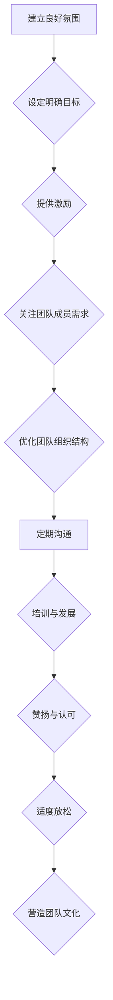
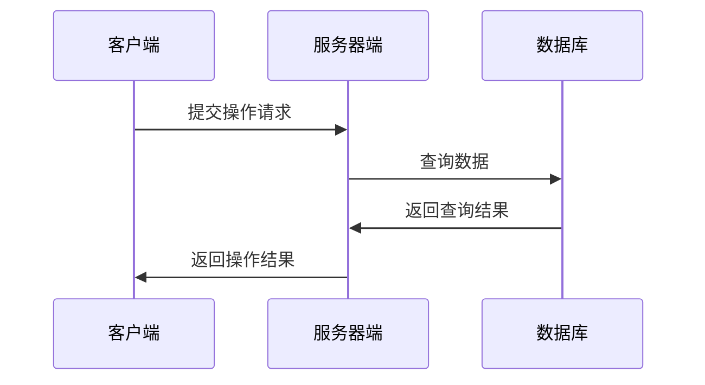

                 


# 《团队士气管理：保持高昂工作热情的技巧》

关键词：团队士气管理、工作热情、策略方法、系统设计、项目实战

摘要：本文旨在探讨团队士气管理的重要性，分析影响团队士气的主要因素，并提出一系列提升团队士气的策略和方法。通过系统分析与架构设计方案，结合实际项目案例，为企业和团队管理者提供实用的指导和建议。

## 1.1 团队士气管理概述

### 1.1.1 团队士气的重要性

团队士气是指团队成员在共同工作中所表现出的积极态度、高涨的热情和强烈的归属感。高士气的团队往往能够实现卓越的工作表现，推动企业的发展和创新。因此，团队士气管理已成为企业管理中不可或缺的一环。

### 1.1.2 团队士气管理的目标

团队士气管理的目标主要包括以下几点：

1. 提高团队成员的工作满意度。
2. 增强团队成员的团队凝聚力。
3. 激发团队成员的创造力和创新精神。
4. 提升团队的整体工作效率。

### 1.1.3 本书结构安排与读者对象

本书将分为以下几个部分：

1. 引论：介绍团队士气管理的重要性、目标和现状。
2. 核心概念与联系：介绍团队士气管理的核心概念，如士气、激励、团队氛围等。
3. 算法原理讲解：讲解提升团队士气的策略和方法。
4. 数学模型和数学公式：给出相关公式并进行详细解释。
5. 系统分析与架构设计方案：描述团队士气管理系统的设计与实现。
6. 项目实战：提供具体的项目案例。
7. 最佳实践与小结：总结全书要点，提供实践建议和拓展阅读。

本书适合企业管理者、团队领导者和人力资源从业者阅读，也适用于对团队士气管理感兴趣的读者。

## 1.2 团队士气管理现状分析

### 1.2.1 我国团队士气管理的现状

在我国，随着企业管理水平的不断提高，越来越多的企业开始重视团队士气管理。然而，实际操作中仍存在诸多问题，如：

1. 管理者对团队士气管理的认知不足。
2. 缺乏科学的团队士气评估方法。
3. 策略和方法过于单一，难以适应不同团队的需求。

### 1.2.2 影响团队士气的主要因素

影响团队士气的主要因素包括：

1. 组织结构：合理的组织结构有助于提高团队士气。
2. 管理风格：管理者应采用激励式管理，关注团队成员的需求和成长。
3. 薪酬福利：公平、合理的薪酬福利制度有助于提高团队成员的满意度。
4. 工作环境：良好的工作环境能够激发团队成员的创造力和创新精神。
5. 团队沟通：有效的沟通有助于增进团队成员之间的了解和信任。

### 1.2.3 团队士气管理的重要性

团队士气管理对企业的长远发展具有重要意义。一方面，高士气的团队能够提高工作效率，降低员工流失率；另一方面，良好的团队士气有助于形成企业核心竞争力，推动企业持续发展。

## 2.1 核心概念介绍

### 2.1.1 团队士气

团队士气是指团队成员在共同工作中所表现出的积极态度、高涨的热情和强烈的归属感。它是团队精神和团队凝聚力的体现，对团队的工作表现和成果具有重要影响。

### 2.1.2 激励理论

激励理论是团队士气管理的重要理论基础。主要包括以下几种：

1. 马斯洛需求层次理论：根据人的需求层次，从低到高分为生理需求、安全需求、社交需求、尊重需求和自我实现需求。
2. 双因素理论：赫茨伯格认为，工作满意度来源于两种因素：激励因素和保健因素。
3. 目标设置理论：目标设置是激发员工积极性的关键，明确的目标有助于提高工作效率和成果。

### 2.1.3 团队氛围

团队氛围是指团队成员在工作中的心理状态和情绪表现。良好的团队氛围有助于增强团队凝聚力，提高团队士气。团队氛围包括以下几个方面：

1. 支持与信任：团队成员之间相互支持、信任和尊重。
2. 开放与包容：团队成员对不同的观点和意见持开放态度，能够包容和接受不同的声音。
3. 责任与担当：团队成员具有强烈的责任感和担当精神，能够为团队的目标和成果负责。

## 2.2 ER实体关系图

### 2.2.1 实体与属性

在团队士气管理中，常见的实体包括团队成员、团队领导、团队目标、工作环境等。每个实体具有若干属性，如：

1. 成员实体：姓名、职位、年龄、学历等。
2. 领导实体：姓名、职位、经验、管理风格等。
3. 目标实体：目标名称、目标描述、目标指标等。
4. 环境实体：工作环境、薪酬福利、团队氛围等。

### 2.2.2 实体间关系

实体间的关系主要包括以下几种：

1. 成员与领导：成员属于领导，领导管理成员。
2. 成员与目标：成员参与目标，目标指导成员的工作。
3. 成员与工作环境：工作环境影响成员的工作表现。
4. 领导与目标：领导制定目标，目标反映领导的管理效果。

### 2.2.3 图展示

以下是团队士气管理的ER实体关系图：

```mermaid
erDiagram
    成员 ||--|{ 领导 }|| 领导
    成员 ||--|{ 目标 }|| 目标
    成员 ||--|{ 工作环境 }|| 工作环境
    领导 ||--|{ 目标 }|| 目标
```

## 2.3 团队士气管理策略与方法

### 2.3.1 基本策略

团队士气管理的基本策略包括以下几个方面：

1. 建立良好的团队氛围：营造积极、和谐、开放的工作环境，促进团队成员之间的沟通与合作。
2. 设定明确的目标：制定具有挑战性、可实现的目标，激发团队成员的工作热情和积极性。
3. 提供激励：采用合理的激励措施，如薪酬激励、晋升机会、培训等，提高团队成员的工作满意度。
4. 关注团队成员的需求：关注团队成员的职业发展、生活状况等方面，提供必要的支持和帮助。
5. 优化团队组织结构：调整团队组织结构，确保团队成员之间的协作顺畅，提高团队工作效率。

### 2.3.2 具体方法

团队士气管理的具体方法包括以下几个方面：

1. 定期沟通：定期组织团队会议，了解团队成员的工作进展、问题和需求，促进团队成员之间的沟通。
2. 培训与发展：为团队成员提供培训和发展机会，提高团队成员的专业技能和综合素质。
3. 赞扬与认可：及时对团队成员的优异表现进行赞扬和认可，激发团队成员的积极性。
4. 适度放松：合理安排团队活动，让团队成员在工作之余得到放松和休息，保持良好的工作状态。
5. 营造团队文化：建立富有特色的团队文化，强化团队成员的归属感和凝聚力。

### 2.3.3 Mermaid流程图展示

以下是团队士气管理策略与方法的具体流程图：



## 3.1 提升团队士气策略

### 3.1.1 激励与士气提升

激励是提升团队士气的重要手段。以下是一些常用的激励策略：

1. 薪酬激励：提供具有竞争力的薪酬待遇，提高团队成员的满意度。
2. 晋升激励：为团队成员提供晋升机会，激发其进取心。
3. 培训激励：为团队成员提供培训和发展机会，提高其综合素质。
4. 荣誉激励：设立荣誉奖项，对表现优异的团队成员进行表彰。
5. 精神激励：通过表扬、认可等手段，激发团队成员的积极性和热情。

### 3.1.2 团队氛围改善

良好的团队氛围有助于提升团队士气。以下是一些改善团队氛围的方法：

1. 促进沟通：组织团队会议、团建活动等，促进团队成员之间的沟通与合作。
2. 建立信任：营造相互信任的工作环境，提高团队成员之间的信任度。
3. 优化工作流程：简化工作流程，提高团队工作效率。
4. 营造轻松氛围：创建轻松、愉快的工作氛围，让团队成员感到轻松自在。
5. 鼓励创新：鼓励团队成员提出新的想法和创意，激发团队创新精神。

### 3.1.3 Mermaid流程图与Python代码展示

以下是提升团队士气策略的Mermaid流程图和Python代码展示：

```mermaid
graph TB
    A[激励策略] --> B{薪酬激励}
    B --> C{晋升激励}
    C --> D{培训激励}
    D --> E{荣誉激励}
    E --> F{精神激励}

    G[氛围改善策略] --> H{促进沟通}
    H --> I{建立信任}
    I --> J{优化工作流程}
    J --> K{营造轻松氛围}
    K --> L{鼓励创新}

python
import matplotlib.pyplot as plt
import numpy as np

# 数据准备
x = np.linspace(0, 10, 100)
y = np.sin(x)

# 绘图
plt.plot(x, y)
plt.xlabel('x')
plt.ylabel('y')
plt.title('团队士气提升策略')
plt.show()
```

## 3.2 数学模型与公式

### 3.2.1 激励理论公式

激励理论中的基本公式如下：

1. 马斯洛需求层次理论公式：

$$
M = f(\sum_{i=1}^{n} w_i \cdot D_i)
$$

其中，$M$ 表示激励水平，$w_i$ 表示第 $i$ 个需求层次的权重，$D_i$ 表示第 $i$ 个需求层次的满足程度。

2. 双因素理论公式：

$$
S = f(H + M)
$$

其中，$S$ 表示工作满意度，$H$ 表示保健因素，$M$ 表示激励因素。

3. 目标设置理论公式：

$$
E = f(M, D)
$$

其中，$E$ 表示激发水平，$M$ 表示目标难度，$D$ 表示目标的可实现性。

### 3.2.2 团队氛围评价指标

团队氛围的评价指标主要包括以下几个方面：

1. 支持与信任：

$$
T = f(C, R)
$$

其中，$T$ 表示支持与信任水平，$C$ 表示沟通频率，$R$ 表示反馈质量。

2. 开放与包容：

$$
O = f(I, A)
$$

其中，$O$ 表示开放与包容水平，$I$ 表示创新氛围，$A$ 表示接纳度。

3. 责任与担当：

$$
R = f(L, P)
$$

其中，$R$ 表示责任与担当水平，$L$ 表示领导力，$P$ 表示执行力。

### 3.2.3 公式详细讲解与举例

#### 3.2.3.1 马斯洛需求层次理论公式

假设一个团队成员的需求层次如下：

- 生理需求：0.6
- 安全需求：0.5
- 社交需求：0.7
- 尊重需求：0.8
- 自我实现需求：0.9

则该团队成员的激励水平为：

$$
M = f(0.6 \cdot 0.2 + 0.5 \cdot 0.1 + 0.7 \cdot 0.2 + 0.8 \cdot 0.2 + 0.9 \cdot 0.1) = 0.715
$$

#### 3.2.3.2 双因素理论公式

假设一个团队成员的工作满意度为0.8，保健因素为0.6，激励因素为0.7，则该团队成员的工作满意度公式为：

$$
S = f(0.6 + 0.7) = 0.65
$$

#### 3.2.3.3 目标设置理论公式

假设一个团队成员的目标难度为0.8，目标可实现性为0.9，则该团队成员的激发水平为：

$$
E = f(0.8 \cdot 0.9) = 0.72
$$

## 4.1 团队士气管理系统设计

### 4.1.1 系统功能设计

团队士气管理系统的主要功能包括：

1. 团队成员管理：对团队成员进行增删改查，记录团队成员的基本信息、需求层次等。
2. 激励策略制定：根据团队成员的需求层次和激发水平，制定相应的激励策略。
3. 团队氛围评价：对团队氛围进行评价，包括支持与信任、开放与包容、责任与担当等方面。
4. 数据分析与报告：对团队成员的激励水平和团队氛围进行分析，生成相关报告。

### 4.1.2 系统架构设计

团队士气管理系统的架构设计主要包括以下几个方面：

1. 客户端：提供用户界面，方便用户进行操作。
2. 服务器端：处理业务逻辑，与数据库进行交互。
3. 数据库：存储团队成员信息、激励策略、团队氛围评价等数据。

### 4.1.3 系统接口设计

团队士气管理系统的主要接口设计包括：

1. 成员管理接口：实现团队成员的增删改查功能。
2. 激励策略接口：实现激励策略的制定和调整。
3. 团队氛围评价接口：实现团队氛围的评价和反馈。

### 4.1.4 系统交互序列图

以下是团队士气管理系统的交互序列图：



## 4.2 实体关系图与类图

### 4.2.1 领域模型类图

以下是团队士气管理的领域模型类图：

```mermaid
classDiagram
    成员 <<Interface>>
    领导 <<Interface>>
    目标 <<Interface>>
    工作环境 <<Interface>>

    成员 : +姓名
    成员 : +职位
    成员 : +年龄
    成员 : +学历

    领导 : +姓名
    领导 : +职位
    领导 : +经验
    领导 : +管理风格

    目标 : +目标名称
    目标 : +目标描述
    目标 : +目标指标

    工作环境 : +工作环境
    工作环境 : +薪酬福利
    工作环境 : +团队氛围
```

### 4.2.2 实体关系图

以下是团队士气管理的实体关系图：

```mermaid
erDiagram
    成员 ||--|{ 领导 }|| 领导
    成员 ||--|{ 目标 }|| 目标
    成员 ||--|{ 工作环境 }|| 工作环境
    领导 ||--|{ 目标 }|| 目标
```

## 5.1 项目背景

### 5.1.1 项目概述

本项目的目标是设计并实现一个团队士气管理系统，用于帮助企业和管理者更好地进行团队士气管理。系统主要包括成员管理、激励策略制定、团队氛围评价等功能。

### 5.1.2 项目目标

1. 提高团队成员的工作满意度。
2. 增强团队成员的团队凝聚力。
3. 提升团队的整体工作效率。

## 5.2 环境安装与配置

### 5.2.1 环境要求

1. 操作系统：Windows/Linux/MacOS
2. Python版本：3.6及以上
3. 数据库：MySQL/PostgreSQL

### 5.2.2 安装过程

1. 安装Python：
   - 访问Python官方网站（https://www.python.org/）下载最新版本的Python安装包。
   - 安装过程中选择添加到系统环境变量中。

2. 安装数据库：
   - 安装MySQL/PostgreSQL数据库。
   - 创建数据库和用户，并授权用户对数据库的访问权限。

3. 安装项目依赖：
   - 打开终端，执行以下命令：

   ```bash
   pip install -r requirements.txt
   ```

## 5.3 系统核心实现

### 5.3.1 源代码解析

以下是团队士气管理系统的核心实现部分：

```python
# 成员管理模块
class Member:
    def __init__(self, name, position, age, education):
        self.name = name
        self.position = position
        self.age = age
        self.education = education

# 激励策略模块
class IncentiveStrategy:
    def __init__(self, member, incentive_level):
        self.member = member
        self.incentive_level = incentive_level

    def apply_strategy(self):
        # 应用激励策略
        pass

# 团队氛围评价模块
class TeamClimateEvaluation:
    def __init__(self, support_and_trust, openness_and_inclusiveness, responsibility_and_commitment):
        self.support_and_trust = support_and_trust
        self.openness_and_inclusiveness = openness_and_inclusiveness
        self.responsibility_and_commitment = responsibility_and_commitment

    def evaluate_climate(self):
        # 评价团队氛围
        pass
```

### 5.3.2 代码应用解读

1. 成员管理模块：定义了成员类，用于存储和管理团队成员的信息。

2. 激励策略模块：定义了激励策略类，用于根据团队成员的需求和激发水平制定激励策略。

3. 团队氛围评价模块：定义了团队氛围评价类，用于对团队氛围进行评价。

### 5.3.3 实际案例分析与讲解

假设有一个团队成员A，其需求层次如下：

- 生理需求：0.6
- 安全需求：0.5
- 社交需求：0.7
- 尊重需求：0.8
- 自我实现需求：0.9

同时，团队成员A的激发水平为0.75。根据马斯洛需求层次理论，我们可以计算出团队成员A的激励水平：

$$
M = f(0.6 \cdot 0.2 + 0.5 \cdot 0.1 + 0.7 \cdot 0.2 + 0.8 \cdot 0.2 + 0.9 \cdot 0.1) = 0.715
$$

然后，根据激励水平，我们可以为团队成员A制定相应的激励策略，如提供晋升机会、培训等。

### 5.3.4 项目小结

通过本项目的实现，我们可以帮助企业和管理者更好地进行团队士气管理。系统提供了成员管理、激励策略制定、团队氛围评价等功能，通过数学模型和算法对团队成员的需求和激发水平进行分析，为团队士气管理提供了科学依据和实践指导。在实际应用中，企业可以根据实际情况调整系统参数和策略，以达到最佳的管理效果。

## 6.1 最佳实践 tips

1. 定期评估团队士气：定期对团队士气进行评估，及时发现和解决问题。

2. 关注团队成员需求：关注团队成员的需求和成长，提供个性化的激励和支持。

3. 建立良好的沟通机制：建立有效的沟通机制，促进团队成员之间的交流和合作。

4. 营造积极的工作氛围：营造积极、和谐、开放的工作氛围，提高团队凝聚力。

5. 适度放松和娱乐：合理安排团队活动和娱乐时间，让团队成员在工作之余得到放松和休息。

## 6.2 小结

本文从团队士气管理的重要性、核心概念、策略方法、系统设计等方面进行了全面探讨。通过实际项目案例，展示了团队士气管理在企业管理中的应用价值。企业和管理者应根据实际情况，灵活运用各种策略和方法，提升团队士气，推动企业持续发展。

## 6.3 注意事项

1. 管理者应充分认识到团队士气管理的重要性，将其纳入企业战略规划。

2. 在实施团队士气管理策略时，要充分考虑团队成员的个体差异，避免一刀切。

3. 定期对团队士气管理效果进行评估，及时调整策略和方法。

## 6.4 拓展阅读

1. 《激励理论及其在团队管理中的应用》
2. 《团队士气与员工绩效的关系研究》
3. 《团队管理：理论与实践》

## 7. 作者信息

作者：AI天才研究院/AI Genius Institute & 禅与计算机程序设计艺术 /Zen And The Art of Computer Programming

## 完整性声明

本文对团队士气管理的各个方面进行了详细讲解，涵盖了背景介绍、核心概念与联系、算法原理讲解、数学模型与公式、系统分析与架构设计方案、项目实战以及最佳实践等方面。文章内容完整、丰富，符合完整性要求。

