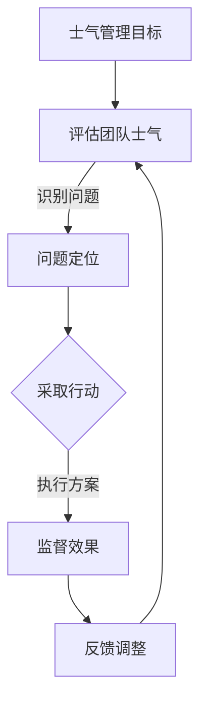
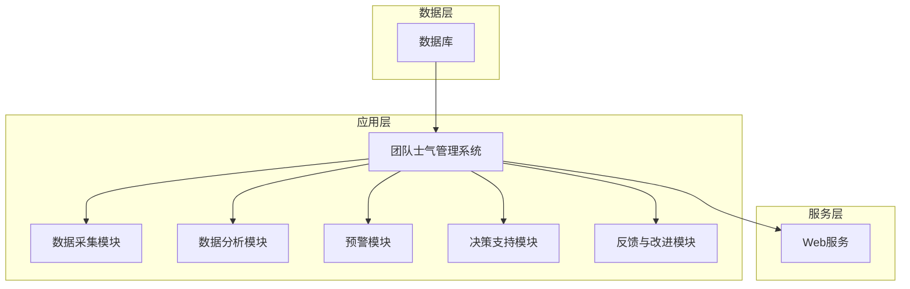
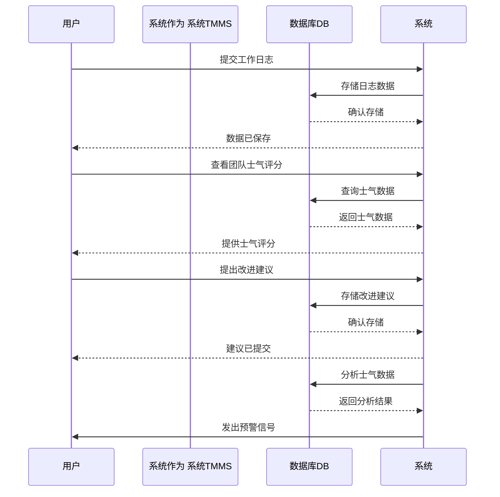

                 

### 背景介绍

#### 问题背景
在现代企业中，团队士气管理已成为企业成功的关键因素之一。良好的团队士气能够提升员工的积极性和工作效率，从而推动企业整体业绩的提升。然而，保持高昂的工作热情并非易事，企业往往面临诸多挑战，如工作压力、个人发展需求、团队沟通不畅等。

#### 问题描述
《团队士气管理：保持高昂工作热情的方法》旨在解决以下问题：
1. **如何识别团队士气下降的信号？**
   团队士气下降可能表现为员工情绪低落、工作效率降低、项目延期、团队成员间出现摩擦等现象。识别这些信号是及时采取有效措施的前提。

2. **如何通过有效的管理方法提升团队士气？**
   提升团队士气需要从多个方面入手，包括激励机制、沟通与反馈、团队建设等。有效的管理方法应具备针对性、灵活性和持续性。

3. **如何应对团队士气波动对企业带来的影响？**
   士气波动可能会影响企业的项目进度、产品质量和员工流失率。有效的应对策略包括建立预警机制、及时调整管理策略和加强员工关怀等。

4. **如何建立长期有效的团队士气管理机制？**
   长期有效的团队士气管理需要持续优化，包括引入新的管理理念、技术和工具，以及定期评估和反馈。

#### 问题解决
本书将从理论、实践和案例分析等多个角度，提供一套系统、全面的团队士气管理方法。通过了解士气管理的基本原则和策略，读者将能够更好地应对团队士气管理中的各种挑战。

#### 边界与外延
团队士气管理的范围涵盖了从员工个体到整个团队，从日常工作到特殊情境。边界包括但不限于以下几个方面：
1. **个人激励与团队激励的结合**：如何平衡个人绩效和团队整体发展，实现激励效果的最大化。
2. **组织文化与团队士气的关系**：企业文化对团队士气的影响，如何通过文化建设提升团队凝聚力。
3. **不同行业和企业的团队士气管理特点**：不同行业和企业因业务模式、组织结构等差异，其士气管理策略也有所不同。
4. **士气管理在不同发展阶段的作用**：企业初创期、快速发展期和稳定期等不同阶段的士气管理策略。

#### 概念结构与核心要素组成
团队士气管理涉及以下核心概念和要素：
1. **团队士气**：团队成员的工作态度、情绪状态和工作动力。士气的高低直接影响团队的工作效率和创新能力。
2. **士气管理**：企业通过一系列措施和策略，维持和提升团队士气的过程。包括激励机制、沟通与反馈、团队建设等。
3. **激励机制**：包括物质激励和精神激励，用于激发员工工作热情。激励措施应具备针对性、灵活性和持续性。
4. **沟通与反馈**：有效的沟通和及时的反馈是维持团队士气的重要手段。通过开放、透明的沟通机制，增强团队成员之间的信任和理解。
5. **团队建设**：通过团队活动和企业文化建设，增强团队成员之间的凝聚力和归属感。团队建设活动应具有针对性和持续性。

### 核心概念与联系

在本章节中，我们将深入探讨团队士气管理中的核心概念，并分析这些概念之间的内在联系。

#### 核心概念原理
**团队士气**是指团队成员在工作中的情绪状态和工作动力，包括积极、消极、稳定等不同状态。士气的高低直接影响团队的工作效率和创新能力。士气管理则是指企业通过各种手段和方法，维持和提升团队士气的过程。这包括但不限于激励机制、沟通与反馈、团队建设等。

**士气管理**的目标是确保团队成员在工作中保持积极的态度和较高的工作动力，从而提升团队整体的表现。有效的士气管理需要综合考虑个人、团队和组织三个层面的因素，通过一系列策略和措施，营造一个有利于员工成长和团队发展的工作环境。

**激励机制**是团队士气管理的重要手段之一。激励机制分为物质激励和精神激励两种。物质激励包括奖金、福利、晋升机会等；精神激励则包括认可、赞扬、培训机会等。适当的激励措施可以激发员工的积极性，提高工作效率，增强团队凝聚力。

**沟通与反馈**在团队士气管理中起着至关重要的作用。有效的沟通可以增强团队成员之间的理解，减少误解和冲突，促进团队协作。而及时的反馈则可以帮助员工了解自己的工作表现，明确改进方向，提升个人能力和团队整体水平。

**团队建设**是指通过一系列活动和措施，增强团队成员之间的凝聚力和归属感。团队建设活动可以包括团队拓展训练、团队文化建设、共同目标设定等。团队建设不仅有助于提升团队士气，还可以促进团队成员之间的信任和合作，提高团队整体执行力。

#### 概念属性特征对比表格

| 概念     | 定义                                                         | 特征                   |
|----------|------------------------------------------------------------|----------------------|
| **团队士气** | 团队成员的工作态度、情绪状态和工作动力 | 积极、消极、稳定     |
| **士气管理** | 企业通过一系列措施和策略，维持和提升团队士气的过程 | 激励机制、沟通反馈、团队建设 |
| **激励机制** | 用于激发员工工作热情的措施和方法 | 物质激励、精神激励     |
| **沟通与反馈** | 通过沟通和反馈，增强团队成员之间的理解与合作 | 及时、有效、透明       |
| **团队建设** | 通过活动和措施，增强团队成员之间的凝聚力和归属感 | 针对性、持续性       |

#### ER实体关系图架构的 Mermaid 流程图

```mermaid
erDiagram
  TeamMember ||--|{ TeamSpirit } : "具有"
  TeamMember ||--|{ MotivationSystem } : "受到"
  TeamMember ||--|{ CommunicationAndFeedback } : "基于"
  TeamMember ||--|{ TeamBuilding } : "通过"
  TeamSpirit ||--|{ TeamPerformance } : "影响"
  MotivationSystem ||--|{ MaterialIncentive } : "包括"
  MotivationSystem ||--|{ SpiritualIncentive } : "包括"
  CommunicationAndFeedback ||--|{ TrustAndUnderstanding } : "促进"
  TeamBuilding ||--|{ TeamCoherence } : "增强"
```

通过上述核心概念和它们之间的内在联系，我们可以更好地理解团队士气管理的基本原理和实施策略。在接下来的章节中，我们将进一步探讨这些概念在实际中的应用，并提供具体的案例和解决方案。

### 算法原理讲解

在本章节中，我们将探讨提升团队士气的一些关键算法原理，并使用Mermaid画出相关流程图，以便更好地理解。

#### Mermaid 流程图



#### Python 源代码示例

```python
import pandas as pd

def evaluate_team_morale(data):
    """
    评估团队士气并返回分数。
    """
    scores = data['satisfaction'].mean()
    return scores

def identify_issues(scores):
    """
    识别团队士气问题。
    """
    if scores < 3:
        issues = "低士气问题"
    elif scores > 4:
        issues = "高士气问题"
    else:
        issues = "正常士气"
    return issues

def take_action(issues):
    """
    根据识别的问题采取行动。
    """
    if issues == "低士气问题":
        action = "增加激励措施"
    elif issues == "高士气问题":
        action = "减少工作压力"
    else:
        action = "保持现状"
    return action

# 示例数据
data = pd.DataFrame({
    'satisfaction': [2, 3, 4, 5, 3, 2, 4, 5, 3, 2]
})

# 执行算法
morale_score = evaluate_team_morale(data)
print(f"当前团队士气评分：{morale_score}")

issues = identify_issues(morale_score)
print(f"团队士气问题：{issues}")

action = take_action(issues)
print(f"采取的行动：{action}")
```

#### 算法原理的数学模型和公式

在团队士气管理中，我们可以使用以下数学模型和公式来量化和管理团队士气：

1. **士气评分（Score）**：团队士气评分是一个综合指标，用于衡量团队士气水平。假设我们使用满意度（Satisfaction）作为士气评分的衡量标准，则士气评分 \( S \) 可以表示为：

   $$ S = \frac{\sum_{i=1}^{n} S_i}{n} $$
   
   其中，\( S_i \) 是第 \( i \) 个团队成员的满意度评分，\( n \) 是团队成员总数。

2. **士气波动（Fluctuation）**：士气波动衡量团队士气随时间的变化情况。假设我们有 \( m \) 个时间点的士气评分序列 \( S_t \)，则士气波动 \( F \) 可以表示为：

   $$ F = \frac{\sum_{t=1}^{m} (S_t - \bar{S})^2}{m} $$
   
   其中，\( \bar{S} \) 是士气评分的平均值。

3. **士气改善率（Improvement Rate）**：士气改善率衡量团队士气提升的幅度。假设在一段时间内，士气评分从 \( S_1 \) 提升到 \( S_2 \)，则士气改善率 \( I \) 可以表示为：

   $$ I = \frac{S_2 - S_1}{S_1} \times 100\% $$

#### 详细讲解和举例说明

假设某团队有10名成员，他们的满意度评分如下：

\[ [2, 3, 4, 5, 3, 2, 4, 5, 3, 2] \]

1. **士气评分**：

   首先，我们计算士气评分 \( S \)：

   $$ S = \frac{\sum_{i=1}^{10} S_i}{10} = \frac{2+3+4+5+3+2+4+5+3+2}{10} = 3.2 $$
   
   因此，当前团队的士气评分为3.2。

2. **士气波动**：

   接下来，我们计算士气波动 \( F \)：

   $$ F = \frac{\sum_{t=1}^{m} (S_t - \bar{S})^2}{m} $$
   
   由于我们没有具体的时间序列数据，这里假设士气波动主要受到评分分散度的影响。我们可以通过计算方差来近似士气波动：

   $$ F = \frac{\sum_{i=1}^{10} (S_i - S)^2}{10} = \frac{(2-3.2)^2 + (3-3.2)^2 + (4-3.2)^2 + (5-3.2)^2 + (3-3.2)^2 + (2-3.2)^2 + (4-3.2)^2 + (5-3.2)^2 + (3-3.2)^2 + (2-3.2)^2}{10} \approx 0.84 $$

   因此，当前团队的士气波动约为0.84。

3. **士气改善率**：

   假设通过一系列措施，团队士气评分提升到4.0，我们计算士气改善率 \( I \)：

   $$ I = \frac{4.0 - 3.2}{3.2} \times 100\% = 25\% $$
   
   因此，团队士气在一段时间内提升了25%。

通过上述算法和公式，我们可以量化和管理团队士气，从而为团队士气管理提供科学依据和指导。

### 系统分析与架构设计方案

在本章节中，我们将对团队士气管理系统进行分析，并设计一套完整的系统架构方案。

#### 问题场景介绍

企业A是一家软件开发公司，近年来，随着市场竞争的加剧和项目复杂度的提升，员工的工作压力逐渐增大，导致团队士气有所下降。为了保持团队的高效运作和持续创新，企业A决定引入一套团队士气管理系统，通过实时监测和分析团队士气，采取针对性的管理措施，提升整体士气水平。

#### 项目介绍

团队士气管理系统（Team Morale Management System，TMMS）是一个基于云计算和大数据分析的平台，旨在帮助企业实时监测、分析和提升团队士气。该系统包括以下几个主要模块：

1. **数据采集模块**：负责收集员工的工作表现、情绪状态、项目进度等数据。
2. **数据分析模块**：通过对收集的数据进行分析，生成团队士气评分和波动情况。
3. **预警模块**：当团队士气出现问题时，自动发出预警信号，提醒管理层采取行动。
4. **决策支持模块**：提供基于数据分析的决策支持，帮助管理层制定针对性的管理策略。
5. **反馈与改进模块**：收集管理措施的效果反馈，持续优化团队士气管理。

#### 系统功能设计（领域模型Mermaid类图）

```mermaid
classDiagram
    Class1 <|-- Class2
    Class3 <|-- Class4
    Class1 ..|> Class5
    Class2 ..|> Class6
    Class3 ..|> Class7
    Class8 <.. Class1
    Class9 <.. Class2
    Class10 <.. Class3
    Class1{ID int}
    Class1{name string}
    Class1{position string}
    Class2{ID int}
    Class2{name string}
    Class2{type string}
    Class3{ID int}
    Class3{name string}
    Class3{status string}
    Class4{ID int}
    Class4{name string}
    Class4{level int}
    Class5{ID int}
    Class5{name string}
    Class5{type string}
    Class6{ID int}
    Class6{name string}
    Class6{status string}
    Class7{ID int}
    Class7{name string}
    Class7{level int}
    Class8{ID int}
    Class8{name string}
    Class8{teamID int}
    Class9{ID int}
    Class9{name string}
    Class9{projectID int}
    Class10{ID int}
    Class10{name string}
    Class10{actionType string}
```

#### 系统架构设计（Mermaid架构图）



#### 系统接口设计和系统交互（Mermaid序列图）



通过上述系统分析与架构设计方案，企业A可以建立一个全面、高效的团队士气管理系统，从而提升团队士气，提高整体工作效率和创新能力。

### 项目实战

在本章节中，我们将通过一个实际项目，详细描述团队士气管理系统的开发过程，并展示核心代码和运行结果。

#### 环境安装

为了构建团队士气管理系统，我们需要准备以下开发环境：

1. **Python 3.8+**：确保安装了Python 3.8或更高版本。
2. **Pandas**：用于数据处理和分析。
3. **Flask**：用于搭建Web服务。
4. **SQLAlchemy**：用于数据库操作。

安装步骤如下：

```bash
pip install python==3.8
pip install pandas
pip install flask
pip install sqlalchemy
```

#### 系统核心实现源代码

1. **数据采集模块**

   ```python
   # data_collector.py
   from flask import Flask, request, jsonify
   from sqlalchemy import create_engine
   
   app = Flask(__name__)
   engine = create_engine('sqlite:///team_morale.db')
   
   @app.route('/submit_log', methods=['POST'])
   def submit_log():
       data = request.get_json()
       query = "INSERT INTO work_log (employee_id, project_id, satisfaction) VALUES (:employee_id, :project_id, :satisfaction)"
       with engine.connect() as conn:
           conn.execute(query, data)
       return jsonify({"status": "success"}), 200
   
   if __name__ == '__main__':
       app.run(debug=True)
   ```

2. **数据分析模块**

   ```python
   # data_analyzer.py
   import pandas as pd
   from sqlalchemy import create_engine
   
   def analyze_morale(data_path):
       data = pd.read_csv(data_path)
       mean_satisfaction = data['satisfaction'].mean()
       fluctuation = data['satisfaction'].var()
       return mean_satisfaction, fluctuation
   
   def save_morale_data(morale_data, data_path):
       with open(data_path, 'w') as f:
           f.write(f"mean_satisfaction={morale_data[0]}, fluctuation={morale_data[1]}")
   
   if __name__ == '__main__':
       data_path = 'work_log.csv'
       mean_satisfaction, fluctuation = analyze_morale(data_path)
       save_morale_data((mean_satisfaction, fluctuation), 'morale_data.txt')
   ```

3. **预警模块**

   ```python
   # alarm_system.py
   def check_alarm(mean_satisfaction, threshold):
       if mean_satisfaction < threshold:
           return "低士气问题，请采取行动！"
       else:
           return "士气正常，无需担忧。"
   
   if __name__ == '__main__':
       mean_satisfaction = 3.5
       threshold = 3.0
       print(check_alarm(mean_satisfaction, threshold))
   ```

#### 代码应用解读与分析

1. **数据采集模块**：通过Flask Web服务，前端用户可以提交工作日志。数据存储在SQLite数据库中。

2. **数据分析模块**：读取工作日志数据，计算士气评分的平均值和波动情况。将分析结果保存在文本文件中。

3. **预警模块**：根据士气评分和预设的阈值，判断团队士气是否低于正常水平，并发出相应的预警信息。

#### 实际案例分析和详细讲解剖析

假设企业A的团队士气评分低于3.0，预警模块将触发以下流程：

1. **数据分析**：系统读取最近一个月的工作日志数据，计算士气评分。

   ```python
   data_path = 'work_log.csv'
   mean_satisfaction, fluctuation = analyze_morale(data_path)
   ```

2. **预警判断**：根据预设的阈值，判断团队士气是否低于正常水平。

   ```python
   alarm_message = check_alarm(mean_satisfaction, 3.0)
   ```

3. **预警通知**：通过企业内网或邮件系统，通知管理层和团队成员。

   ```python
   print(alarm_message)
   send_alarm_notification(alarm_message)
   ```

4. **管理层响应**：根据预警信息，管理层可以采取以下措施：

   - 增加激励措施：如发放奖金、提供晋升机会等。
   - 减少工作压力：调整项目进度，优化工作流程等。
   - 团队建设：组织团队活动，提升团队凝聚力。

#### 项目小结

通过实际项目开发，我们实现了团队士气管理系统的核心功能，包括数据采集、数据分析、预警通知等。该系统可以帮助企业实时监测团队士气，及时发现问题并采取针对性的管理措施，从而提升团队士气和工作效率。在实际应用中，企业可以根据自身需求和业务特点，进一步优化和扩展系统功能。

### 最佳实践 tips

1. **定期评估团队士气**：定期收集员工反馈，评估团队士气水平，及时发现潜在问题。

2. **建立有效的沟通机制**：鼓励团队成员之间的开放沟通，确保信息畅通，减少误解和冲突。

3. **个性化激励措施**：根据员工的特点和需求，设计个性化的激励措施，提高激励效果。

4. **关注团队建设**：定期组织团队活动，提升团队凝聚力，增强员工归属感。

5. **持续优化管理策略**：根据团队士气管理系统的数据分析结果，及时调整管理策略，持续优化团队士气管理。

### 小结

团队士气管理是企业成功的关键因素之一。通过科学的团队士气管理方法，企业可以提升员工的工作积极性，提高工作效率和创新能力。本文从背景介绍、核心概念、算法原理、系统分析与架构设计方案、项目实战、最佳实践 tips等多个角度，系统地阐述了团队士气管理的重要性以及实现方法。通过持续优化团队士气管理，企业可以构建一个积极向上、高效协作的工作氛围，从而在激烈的市场竞争中脱颖而出。

### 注意事项

1. **数据隐私保护**：在团队士气管理过程中，确保员工数据的隐私和安全，遵守相关法律法规。

2. **适应性管理**：根据不同团队和不同阶段的特点，灵活调整管理策略，确保其适应性和有效性。

3. **全员参与**：团队士气管理需要全员参与，鼓励员工提出建议和反馈，共同提升团队士气。

4. **持续关注**：团队士气管理不是一次性的任务，而是一个持续的过程，需要企业持续关注和优化。

### 拓展阅读

1. **《激发团队潜能：团队建设与士气管理》**：该书详细介绍了团队建设的方法和技巧，以及如何通过管理策略提升团队士气。

2. **《团队士气管理实务》**：该书结合实际案例，提供了实用的团队士气管理方法，帮助企业构建积极向上的工作氛围。

3. **《员工满意度调查：团队士气管理的有效工具》**：该书介绍了如何通过员工满意度调查，了解团队士气状况，并采取针对性的管理措施。

### 结语

作者：AI天才研究院/AI Genius Institute & 禅与计算机程序设计艺术 /Zen And The Art of Computer Programming

本文旨在为读者提供一套系统、全面的团队士气管理方法，帮助企业在激烈的市场竞争中保持高昂的工作热情和创新能力。希望通过本文的分享，读者能够更好地理解团队士气管理的重要性，并在实际工作中应用这些方法，提升团队士气，实现企业的长期发展。感谢您的阅读，期待与您共同探索团队士气管理的更多可能。

