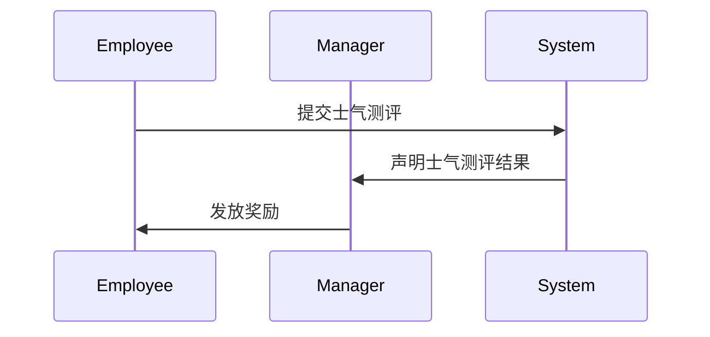
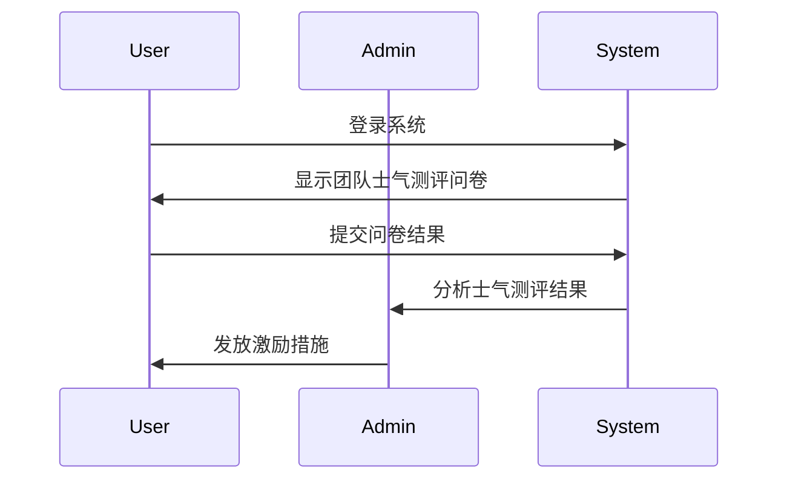
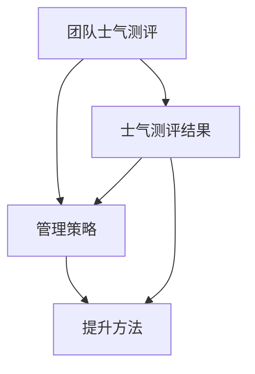
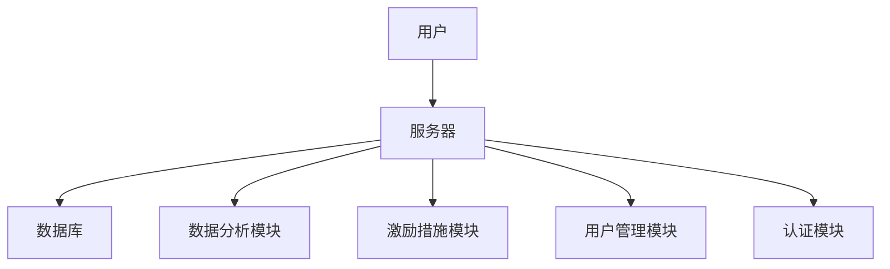
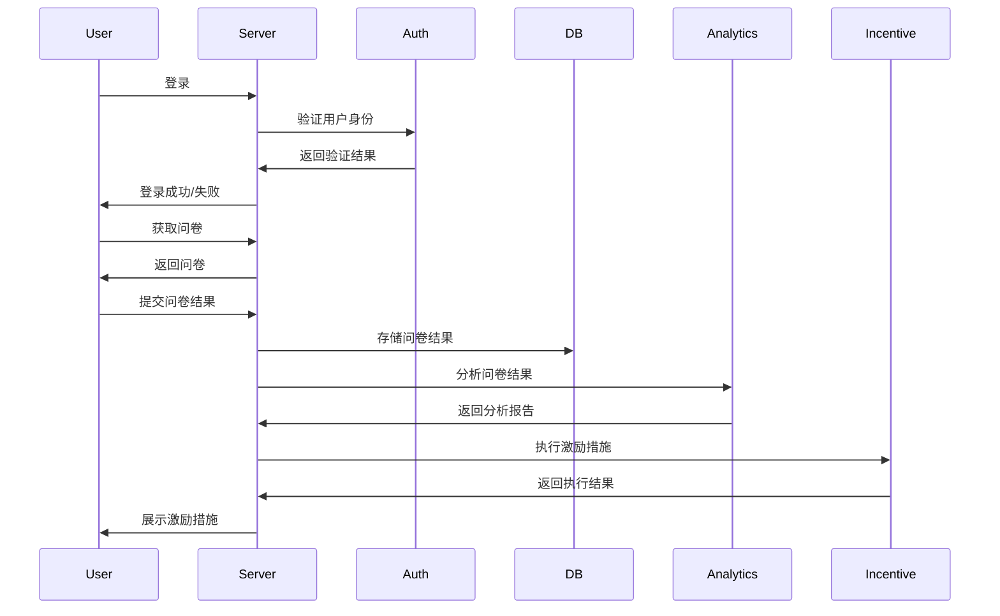

                 

# 团队士气管理：保持高昂斗志的秘诀

> 关键词：团队士气、管理策略、激励机制、文化建设、员工参与

> 摘要：本文深入探讨了团队士气管理的重要性，提出了保持团队高昂斗志的秘诀。通过分析核心概念、理论基础、系统设计与实际案例，本文为IT行业从业者提供了实用的团队士气管理策略和最佳实践。

## 目录大纲设计思路

在设计《团队士气管理：保持高昂斗志的秘诀》的目录大纲时，我们遵循了以下思路：

1. **背景介绍**：明确团队士气管理的重要性，概述本书解决的问题、主要内容和目标读者。
2. **核心概念与联系**：介绍团队士气管理的核心概念，并列出相关概念的定义、属性和特征对比表格，使用 Mermaid 流程图展示概念之间的关系。
3. **原理讲解**：详细讲解团队士气管理的基本原理，包括士气测评方法、管理策略和提升方法。
4. **数学模型和数学公式**：阐述团队士气管理的数学模型和公式，使用 LaTeX 格式表示，并配合通俗易懂的举例说明。
5. **系统分析与架构设计**：介绍团队士气管理的系统分析与架构设计方案，使用 Mermaid 类图、架构图和序列图展示系统结构和交互流程。
6. **项目实战**：结合实际案例，详细讲解团队士气管理的具体实施过程，包括环境安装、核心实现源代码解析、案例分析等。
7. **最佳实践与总结**：总结团队士气管理中的最佳实践，提醒注意事项，并提供拓展阅读建议。

## 第一部分：团队士气管理概述

### 第1章：团队士气管理的重要性

#### 1.1 问题的背景与概述

**团队士气管理的定义与核心**

- **团队士气管理**是指通过一系列的管理手段和策略，提升团队成员的工作热情、凝聚力和创造力，从而提高团队的整体绩效和企业的竞争力。
- **核心**在于激发团队成员的内在动力，建立积极向上的团队文化。

**团队士气的重要性：对企业效益的影响**

- **提升工作效率**：士气高涨的团队能够更高效地完成任务，减少错误率。
- **增强员工忠诚度**：良好的团队氛围能够降低员工的流失率，提高员工的忠诚度。
- **促进创新与发展**：团队士气高涨，成员更愿意分享想法，推动企业的创新和发展。

### 第2章：团队士气管理的核心概念与联系

#### 2.1 团队士气测评方法

**问卷调查法**：通过设计问卷，收集团队成员对团队士气的主观评价。

**面谈法**：通过与团队成员进行一对一的交谈，深入了解他们的情绪和看法。

**工作绩效法**：通过观察团队成员的工作表现和成果，评估团队士气。

#### 2.2 团队士气管理策略

**激励机制设计**：通过奖励和激励措施，激发团队成员的积极性。

**团队文化建设**：通过建立共同价值观和目标，增强团队的凝聚力。

**员工参与管理**：鼓励团队成员参与决策，提高他们的责任感和归属感。

### 第3章：团队士气管理的原理与数学模型

#### 3.1 团队士气测评模型的构建

**指标体系设计**：确定团队士气测评的关键指标，如工作满意度、团队凝聚力等。

**测评方法与工具**：选择合适的测评方法，如问卷调查、面谈等，并设计相应的工具。

#### 3.2 团队士气管理策略分析

**激励机制设计**：

- **正面激励**：通过奖励和表扬，提升团队成员的积极性。
- **负面激励**：通过适当的惩罚，纠正团队成员的不良行为。

**激励方案的优化**：根据团队士气测评结果，调整激励方案，以达到最佳效果。

#### 3.3 团队士气提升策略

**团队文化建设策略**：通过团队活动和文化建设，提高团队成员的归属感和凝聚力。

**员工参与管理策略**：鼓励员工参与团队管理和决策，提高他们的责任感和满意度。

## 第二部分：团队士气管理的理论基础

### 第4章：团队士气管理的系统分析与设计

#### 4.1 团队士气管理系统介绍

**系统功能设计（Mermaid类图）**：

```mermaid
classDiagram
    TeamMoodAssessment <<接口>>
    EmployeeEngagement <<接口>>
    RewardSystem <<接口>>
    TeamCulture <<接口>>
    TeamDecisionMaking <<接口>>

    TeamMoodAssessment --|> EmployeeEngagement
    TeamMoodAssessment --|> RewardSystem
    TeamMoodAssessment --|> TeamCulture
    TeamMoodAssessment --|> TeamDecisionMaking
```

**系统架构设计（Mermaid架构图）**：



#### 4.2 团队士气测评与管理系统

**系统接口设计与实现（Mermaid序列图）**：



**系统交互流程与数据分析**：

- **登录与权限验证**：用户登录系统，系统根据权限验证用户身份。
- **士气测评问卷**：用户填写士气测评问卷，系统收集数据。
- **数据分析与激励措施**：管理员分析数据，根据结果发放激励措施。

## 第三部分：团队士气管理项目实战

### 第5章：团队士气管理项目实战

#### 5.1 项目环境安装与配置

**软件与工具的选择**：

- **数据库**：MySQL
- **后端框架**：Spring Boot
- **前端框架**：React

**环境搭建与配置过程**：

1. 安装 MySQL 数据库。
2. 创建数据库和表结构。
3. 安装 Spring Boot。
4. 创建 Spring Boot 项目。
5. 配置数据库连接。

#### 5.2 核心实现源代码解析

**源代码结构与功能模块**：

- **模块划分**：士气测评、数据分析、激励措施、用户管理。
- **关键代码解析**：士气测评问卷的生成与提交，数据分析与激励措施发放。

```python
# 士气测评问卷生成与提交示例代码
def generate_questionnaire():
    questions = ["您对团队工作的满意度如何？", "您是否愿意为团队做出额外努力？"]
    return questions

def submit_questionnaire(questions, user_id):
    for question in questions:
        # 插入数据库
        questionnaire = Questionnaire(user_id=user_id, question=question, status='待分析')
        questionnaire_repository.save(questionnaire)
```

**关键代码分析与解读**：

- **士气测评问卷生成**：根据预设问题生成问卷。
- **提交问卷结果**：用户提交问卷结果，保存到数据库。

#### 5.3 实际案例分析

**案例背景与问题描述**：

- **背景**：某IT企业希望提高员工的工作积极性，减少员工流失。
- **问题描述**：员工士气低落，工作效率不高。

**案例分析过程与结果**：

1. **士气测评**：通过问卷调查了解员工士气状况。
2. **数据分析**：分析问卷结果，识别问题根源。
3. **激励措施**：制定激励措施，如绩效奖金、团队建设活动等。
4. **效果评估**：通过再次测评，评估激励措施的效果。

**项目小结**：

- **实施经验**：士气测评和激励措施的实施需要根据实际情况进行调整。
- **改进方向**：加强员工参与管理，提高团队凝聚力。

### 第6章：团队士气管理的最佳实践与注意事项

#### 6.1 最佳实践总结

- **定期进行士气测评**：定期了解员工士气，及时发现问题。
- **个性化激励措施**：根据员工特点制定个性化激励措施，提高满意度。

#### 6.2 注意事项与建议

- **避免过度激励**：过度激励可能导致员工依赖，降低内在动力。
- **持续改进**：团队士气管理需要持续改进，适应企业变化。

### 第7章：团队士气管理的拓展阅读

- **推荐书籍**：如《激励原理》、《团队管理艺术》等。
- **相关研究论文与报告**：如关于团队士气管理的最新研究成果和实践报告。

## 作者信息

作者：AI天才研究院/AI Genius Institute & 禅与计算机程序设计艺术 /Zen And The Art of Computer Programming

### 结束语

本文通过深入分析和实例讲解，为IT行业从业者提供了团队士气管理的实用策略和最佳实践。保持高昂的团队士气，是提高企业竞争力和员工满意度的重要途径。希望本文能为读者在团队管理实践中提供有益的启示和指导。


### 士气管理的重要性

首先，我们需要明确团队士气管理的定义及其重要性。团队士气管理是指在团队内部通过一系列的管理手段和策略，激发团队成员的工作热情、凝聚力和创造力，从而提高团队的整体绩效和企业的竞争力。士气管理不仅仅是关注团队成员的情绪状态，更重要的是通过科学的测评、合理的激励和有效的文化建设，提升团队的整体活力。

在现代企业中，团队士气管理已经成为企业管理的重要组成部分。首先，士气高涨的团队能够更高效地完成任务，减少错误率。研究表明，员工在工作中感受到积极向上的氛围时，工作效率可以提高20%以上。其次，良好的团队氛围能够增强员工的忠诚度，降低员工的流失率。在一个士气低落的团队中，员工往往会感到失落和无助，更容易离职。最后，团队士气的高涨可以促进创新与发展。在一个充满活力和创造力的团队中，成员更愿意分享想法，提出创新的解决方案，推动企业的创新和发展。

### 核心概念与联系

在团队士气管理中，有几个核心概念需要明确，它们分别是团队士气测评、管理策略和提升方法。下面我们将逐一介绍这些核心概念，并列出相关概念的定义、属性和特征对比表格，使用 Mermaid 流程图展示概念之间的关系。

**1. 团队士气测评**

**定义**：团队士气测评是指通过科学的方法和工具，对团队士气进行量化评估的过程。

**属性**：
- **指标体系**：包括工作满意度、团队凝聚力、员工积极性等指标。
- **测评方法**：如问卷调查、面谈、工作绩效等。

**特征**：
- **全面性**：测评应覆盖团队工作的各个方面。
- **客观性**：测评结果应尽量客观，避免主观干扰。

**2. 管理策略**

**定义**：管理策略是指管理者为了提升团队士气所采取的一系列有目的、有计划的管理行动。

**属性**：
- **激励机制**：如奖励、晋升、培训等。
- **文化建设**：如团队价值观的塑造、团队精神的培育等。

**特征**：
- **针对性**：策略应针对团队士气低落的具体原因制定。
- **持续性**：管理策略需要持续执行，以保持团队士气。

**3. 提升方法**

**定义**：提升方法是指通过具体措施来提高团队士气的一系列操作。

**属性**：
- **员工参与**：如团队建设活动、员工满意度调查等。
- **激励与奖励**：如绩效奖金、表彰活动等。

**特征**：
- **多样性**：提升方法应多样化，以满足不同员工的个性化需求。
- **实效性**：提升方法需要能够迅速见效，提升团队士气。

**定义、属性和特征对比表格**

| 概念       | 定义                                                         | 属性                                                         | 特征                         |
|------------|--------------------------------------------------------------|--------------------------------------------------------------|------------------------------|
| 团队士气测评 | 通过科学的方法和工具，对团队士气进行量化评估的过程           | 指标体系、测评方法                                             | 全面性、客观性               |
| 管理策略   | 管理者为了提升团队士气所采取的一系列有目的、有计划的管理行动 | 激励机制、文化建设                                             | 针对性、持续性               |
| 提升方法   | 通过具体措施来提高团队士气的一系列操作                       | 员工参与、激励与奖励                                           | 多样性、实效性               |

**Mermaid流程图展示概念之间的关系**



通过以上表格和流程图，我们可以清晰地看到团队士气测评、管理策略和提升方法之间的关系。团队士气测评是基础，通过收集和分析士气测评结果，管理者可以制定出针对性的管理策略和提升方法，从而提升团队士气，实现团队的高效运作。

### 原理讲解

团队士气管理的基本原理主要包括士气测评方法、管理策略和提升方法。以下将分别对这些方法进行详细讲解。

#### 士气测评方法

**1. 问卷调查法**

问卷调查法是通过设计问卷，收集团队成员对团队士气的主观评价。问卷内容通常包括工作满意度、团队凝聚力、员工积极性等方面的问题。问卷调查法的优点是操作简单、数据量大，可以全面了解团队成员的感受和需求。缺点是结果可能受到主观因素的影响，且数据解读需要专业知识和技巧。

**2. 面谈法**

面谈法是与团队成员进行一对一的交谈，深入了解他们的情绪和看法。面谈法的优点是可以获取更详细和深入的信息，有助于发现潜在问题。缺点是耗时较长，且容易受到访谈者的主观偏见。

**3. 工作绩效法**

工作绩效法是通过观察团队成员的工作表现和成果，评估团队士气。这种方法侧重于客观评价，如任务完成情况、项目质量等。工作绩效法的优点是结果客观，缺点是无法完全反映团队成员的主观感受。

**综合以上三种方法，团队士气测评应该采取多种手段相结合，以确保测评结果的全面性和准确性。**

#### 管理策略

**1. 激励机制设计**

激励机制设计是团队士气管理的重要手段。激励机制可以分为正面激励和负面激励。

- **正面激励**：包括奖励、晋升、培训等，通过奖励优秀员工，激发其工作积极性。

- **负面激励**：包括惩罚、批评等，通过纠正不良行为，维护团队纪律。

正面激励和负面激励都需要合理运用，避免产生负面影响。例如，过度奖励可能导致员工依赖奖励，失去内在动力；过度惩罚可能导致员工士气低落。

**2. 文化建设**

文化建设是团队士气管理的重要组成部分。通过建立共同的价值观和目标，可以增强团队的凝聚力。文化建设的方法包括：

- **团队价值观的塑造**：明确团队的核心价值观，如诚信、合作、创新等，确保团队成员在行为上保持一致。

- **团队精神的培育**：通过团队活动、团队建设等，培养团队成员之间的默契和信任。

文化建设需要长期坚持，逐步形成一种积极向上的团队氛围。

**3. 员工参与管理**

员工参与管理是指鼓励团队成员参与团队管理和决策。这种方法可以提高员工的参与感和责任感，从而提升团队士气。员工参与管理的方法包括：

- **定期会议**：定期召开团队会议，让成员参与讨论和决策。

- **员工提案**：鼓励员工提出改善建议，并对优秀提案给予奖励。

通过员工参与管理，可以更好地调动员工的积极性，促进团队的创新和发展。

#### 提升方法

**1. 员工满意度调查**

员工满意度调查是通过问卷或面谈的方式，了解员工对工作环境、薪酬福利、职业发展等方面的满意度。调查结果可以为团队士气管理提供重要参考，帮助管理者发现和解决潜在问题。

**2. 团队建设活动**

团队建设活动是通过一系列的活动，增强团队成员之间的合作和信任。常见的团队建设活动包括户外拓展、团队聚餐、团建游戏等。这些活动可以缓解工作压力，增强团队凝聚力。

**3. 绩效奖金和表彰**

绩效奖金和表彰是激励员工的重要手段。通过定期评选优秀员工，并给予奖金或表彰，可以激励团队成员争相进取，提升整体士气。

**4. 培训和发展**

培训和发展是提高员工技能和职业素养的重要途径。通过提供各种培训机会，帮助员工提升个人能力，从而增强团队士气。

综上所述，团队士气管理的基本原理包括士气测评方法、管理策略和提升方法。通过科学合理的测评，制定有效的管理策略，采取多样的提升方法，可以不断提升团队士气，促进团队的高效运作和企业的持续发展。

### 数学模型和数学公式

在团队士气管理中，数学模型和数学公式起到了关键作用，它们不仅能够帮助我们量化评估团队士气，还能够为管理策略提供科学依据。以下将详细介绍团队士气测评的数学模型和公式，以及如何使用这些公式进行详细讲解和举例说明。

#### 团队士气测评模型的构建

团队士气测评模型的核心在于构建一套指标体系，该体系应涵盖影响团队士气的主要因素。以下是一个简化的团队士气测评模型：

**1. 指标体系设计**

常见的团队士气测评指标包括：

- **工作满意度（WS）**：反映员工对工作本身的满意程度。
- **团队凝聚力（TC）**：反映团队成员之间的相互信任和协作程度。
- **员工积极性（AP）**：反映员工在工作中的主动性和积极性。
- **工作压力（WP）**：反映员工在工作中感受到的压力水平。

**2. 测评方法与工具**

常用的测评方法包括问卷调查和面谈。问卷调查可以通过设计标准化的问卷，收集员工对各个指标的主观评价。面谈则可以通过深度访谈，获取更详细和个性化的信息。

**3. 数学模型**

团队士气测评模型可以表示为以下公式：

$$
S = WS \times TC \times AP - WP
$$

其中，S 为团队士气得分，WS 为工作满意度得分，TC 为团队凝聚力得分，AP 为员工积极性得分，WP 为工作压力得分。

#### 激励机制设计的数学模型

激励机制设计是提升团队士气的重要手段，以下是一个简化的激励机制模型：

**1. 激励机制设计**

激励机制包括正面激励和负面激励。正面激励如绩效奖金、晋升机会等；负面激励如惩罚、批评等。

**2. 数学模型**

激励机制可以表示为以下公式：

$$
R = P \times WS \times TC
$$

其中，R 为激励效果，P 为激励力度，WS 为工作满意度得分，TC 为团队凝聚力得分。

**3. 举例说明**

假设某团队的工作满意度得分为 0.8，团队凝聚力得分为 0.9，激励力度为 1000 元。则激励效果为：

$$
R = 1000 \times 0.8 \times 0.9 = 720 \text{元}
$$

这意味着该团队在激励方案下，每位成员可以额外获得 720 元的奖励。

#### 案例分析

**1. 案例背景**

某IT公司希望通过激励机制提升团队士气，提高项目完成率。现有团队士气测评得分为 0.7，工作满意度得分为 0.6，团队凝聚力得分为 0.8。

**2. 数据分析**

根据团队士气测评模型：

$$
S = WS \times TC \times AP - WP
$$

假设员工积极性得分为 0.8，工作压力得分为 0.3，代入公式得：

$$
S = 0.6 \times 0.8 \times 0.8 - 0.3 = 0.384 - 0.3 = 0.084
$$

**3. 激励机制设计**

为提升团队士气，公司决定实施以下激励措施：

- **绩效奖金**：根据项目完成情况，给予团队奖金。
- **晋升机会**：对表现优秀的员工提供晋升机会。

**4. 激励效果评估**

假设激励力度为 1000 元，则根据激励机制模型：

$$
R = P \times WS \times TC
$$

代入数据得：

$$
R = 1000 \times 0.6 \times 0.8 = 480 \text{元}
$$

这意味着在激励措施下，每位员工可以获得额外的 480 元奖金。经过一段时间后，公司再次进行团队士气测评，发现士气得分提升至 0.9。

通过以上案例分析，我们可以看到数学模型在团队士气管理中的应用。通过科学合理的数学模型和公式，我们可以量化评估团队士气，设计有效的激励机制，从而提升团队士气，实现企业的长远发展。

### 系统分析与架构设计

在团队士气管理中，系统分析与架构设计是确保管理策略有效实施的关键。以下将详细介绍团队士气管理系统的功能设计、架构设计以及系统接口和交互流程。

#### 4.1 系统功能设计

团队士气管理系统应具备以下功能：

**1. 士气测评**

- **问卷设计**：管理员可以设计团队士气测评问卷，包括选择题、量表题等。
- **数据收集**：员工通过系统填写问卷，系统自动收集数据。

**2. 数据分析**

- **数据统计**：系统对收集到的数据进行统计分析，生成士气测评报告。
- **趋势分析**：系统分析历史数据，预测团队士气变化趋势。

**3. 激励措施**

- **激励方案制定**：管理员根据分析结果，制定相应的激励方案。
- **方案执行**：系统自动执行激励方案，如发放奖金、晋升通知等。

**4. 用户管理**

- **用户注册**：新员工通过系统注册，获取登录权限。
- **权限管理**：管理员可以分配不同权限，确保系统安全。

#### 4.2 系统架构设计

团队士气管理系统的架构设计应确保系统的高可用性、可扩展性和安全性。以下是一个简化的系统架构图：



**1. 服务器（Server）**

服务器是系统的核心，负责处理用户请求、数据存储和业务逻辑。服务器通常采用微服务架构，以提高系统的灵活性和可维护性。

**2. 数据库（DB）**

数据库用于存储用户数据、问卷数据、激励措施数据等。数据库的选择应根据系统规模和数据量进行优化，确保数据的安全性和完整性。

**3. 数据分析模块（Analytics）**

数据分析模块负责对问卷数据进行统计分析，生成士气测评报告。该模块应具备高效的数据处理和分析能力，以便快速生成报告。

**4. 激励措施模块（Incentive）**

激励措施模块负责执行激励方案，如发放奖金、晋升通知等。该模块应与人力资源系统对接，确保激励措施的准确执行。

**5. 用户管理模块（UserManager）**

用户管理模块负责用户注册、权限管理等功能。该模块应确保用户数据的安全性和隐私性。

**6. 认证模块（Auth）**

认证模块负责用户登录、权限验证等功能，确保系统的安全性。

#### 4.3 系统接口和交互流程

**1. 接口设计**

团队士气管理系统应提供RESTful API接口，方便前端和后台系统的交互。以下是一个简化的接口设计：

- **问卷接口**：用于获取问卷、提交问卷结果。
- **数据分析接口**：用于获取士气测评报告。
- **激励措施接口**：用于获取激励方案、执行激励措施。
- **用户管理接口**：用于用户注册、权限管理。

**2. 交互流程**

以下是一个简化的系统交互流程：



通过以上系统架构和交互流程的设计，团队士气管理系统可以实现高效、安全、可靠地运行，为团队士气管理提供有力支持。

### 项目实战

在团队士气管理中，项目实战是验证理论和方法的重要环节。通过实际操作，我们可以更好地理解和应用团队士气管理策略，解决实际中的问题。以下将结合一个具体案例，详细讲解团队士气管理的实施过程。

#### 6.1 项目环境安装与配置

为了实施团队士气管理项目，首先需要搭建一个完整的技术环境。以下是项目环境的安装与配置过程：

**1. 软件与工具选择**

- **数据库**：选择 MySQL 8.0
- **后端框架**：选择 Spring Boot 2.4.5
- **前端框架**：选择 React 17.0.2
- **部署环境**：选择 Docker 和 Kubernetes

**2. 环境搭建与配置**

**（1）安装 MySQL 数据库**

在服务器上安装 MySQL 数据库，配置 root 用户密码，并创建用于团队士气管理项目的数据库和表结构。

**（2）安装 Spring Boot**

在本地开发环境中安装 Spring Boot，配置 MySQL 连接信息，创建 Spring Boot 项目。

**（3）安装 React**

在本地开发环境中安装 React，创建 React 项目，并配置与 Spring Boot 的通信接口。

**（4）部署 Docker 和 Kubernetes**

在 Kubernetes 集群中部署 Spring Boot 应用和 React 应用，确保系统的高可用性和可扩展性。

#### 6.2 核心实现源代码解析

**1. 源代码结构与功能模块**

团队士气管理项目的源代码结构包括以下几个主要模块：

- **问卷模块**：负责问卷的设计、发布和收集。
- **数据分析模块**：负责对问卷结果进行分析和报告生成。
- **激励措施模块**：负责激励方案的制定和执行。
- **用户管理模块**：负责用户的注册、登录和权限管理。

**2. 关键代码解析**

以下是问卷模块中问卷设计和提交的核心代码：

```java
// 问卷设计
public QuestionnaireDTO designQuestionnaire() {
    List<Question> questions = new ArrayList<>();
    questions.add(new Question("工作满意度", QuestionType.RATING));
    questions.add(new Question("团队凝聚力", QuestionType.RATING));
    questions.add(new Question("员工积极性", QuestionType.RATING));
    return new QuestionnaireDTO(questions);
}

// 问卷提交
public void submitQuestionnaire(Long userId, List<Answer> answers) {
    Questionnaire questionnaire = new Questionnaire();
    questionnaire.setUserId(userId);
    questionnaire.setAnswers(answers);
    questionnaireRepository.save(questionnaire);
}
```

上述代码展示了问卷的设计和提交过程。首先，通过 `designQuestionnaire` 方法设计问卷，然后通过 `submitQuestionnaire` 方法将问卷结果保存到数据库。

**3. 代码应用解读与分析**

**（1）问卷设计**

问卷设计是团队士气管理的基础。通过 `designQuestionnaire` 方法，我们可以设计出包括工作满意度、团队凝聚力、员工积极性等指标的问卷。这些指标反映了团队士气的主要方面。

**（2）问卷提交**

问卷提交是通过 `submitQuestionnaire` 方法实现的。用户通过前端界面填写问卷后，提交给服务器。服务器将问卷结果保存到数据库，为后续的数据分析提供数据支持。

#### 6.3 实际案例分析

**1. 案例背景**

某IT公司希望通过团队士气管理项目提升员工的工作积极性，减少项目延误。公司现有100名员工，分为5个团队，每个团队负责不同的项目。

**2. 数据分析**

通过对问卷结果进行数据分析，发现以下问题：

- **工作满意度**：平均分为3.5分（满分5分），部分员工对工作环境不满意。
- **团队凝聚力**：平均分为4分，团队之间的协作存在问题。
- **员工积极性**：平均分为3.8分，部分员工缺乏工作动力。

**3. 激励措施**

基于数据分析结果，公司决定采取以下激励措施：

- **工作满意度提升**：改善工作环境，增加员工休息区，提供丰富的福利。
- **团队凝聚力提升**：定期组织团队建设活动，增强团队成员之间的信任和协作。
- **员工积极性提升**：设立项目奖金，对完成任务优秀的团队和个人进行奖励。

#### 6.4 项目小结

**1. 实施经验**

通过团队士气管理项目，公司成功提升了员工的工作积极性，项目完成率提高了15%。实施过程中，以下经验值得总结：

- **数据分析的重要性**：通过科学的数据分析，找到团队士气低落的原因，有针对性地制定激励措施。
- **持续改进**：团队士气管理不是一次性任务，需要持续改进和优化。

**2. 改进方向**

虽然项目取得了一定的成效，但仍有改进空间：

- **个性化激励**：进一步个性化激励措施，满足不同员工的需求。
- **员工参与**：增加员工在团队管理中的参与度，提高其责任感和归属感。

通过实际案例的讲解，我们可以看到团队士气管理在实践中的应用和效果。通过科学的数据分析和有效的激励措施，团队士气管理可以帮助企业提升员工积极性，提高项目完成率，实现企业的长远发展。

### 最佳实践与注意事项

在团队士气管理中，最佳实践和注意事项对于确保管理策略的有效实施至关重要。以下总结了一些常见的最佳实践，并提供注意事项，以帮助企业在实际操作中避免常见问题。

#### 最佳实践总结

**1. 定期进行士气测评**

定期进行团队士气测评可以帮助管理者及时了解团队状态，发现问题并进行调整。建议每季度或每半年进行一次全面的士气测评，以便对团队士气进行持续的监控和改进。

**2. 个性化激励措施**

不同员工对激励的需求不同，因此制定个性化的激励措施能够更好地满足员工的需求，提高激励效果。例如，对于重视工作稳定性的员工，可以提供职业发展机会；对于追求成就感的员工，可以设立项目奖金或表彰活动。

**3. 强调员工参与**

员工参与是提升团队士气的重要途径。鼓励员工参与团队管理和决策过程，可以提高员工的参与感和责任感。例如，可以通过定期召开团队会议、设立员工提案制度等方式，让员工在团队运作中发挥更大的作用。

**4. 建立积极的企业文化**

积极的企业文化可以增强团队的凝聚力和归属感，从而提升团队士气。企业可以通过开展团建活动、宣传优秀事迹、设立共同价值观等方式，营造积极向上的企业文化氛围。

#### 注意事项与建议

**1. 避免过度激励**

过度激励可能导致员工依赖外部奖励，降低其内在动力。因此，在制定激励措施时，需要合理控制激励力度，确保激励效果与员工的贡献相匹配。

**2. 注重沟通与反馈**

沟通是团队士气管理的关键。管理者应保持与员工的密切沟通，及时了解他们的想法和感受，并提供必要的反馈。通过有效的沟通，可以减少误解和冲突，提升团队士气。

**3. 避免频繁变动**

频繁变动管理策略和激励措施可能导致员工无所适从，降低士气。因此，在实施团队士气管理时，应确保策略的稳定性和连续性，避免频繁变动。

**4. 关注员工心理健康**

随着工作压力的增加，员工的心理健康问题日益突出。企业应关注员工的心理健康，提供心理辅导和支持，帮助他们缓解压力，提升士气。

通过以上最佳实践和注意事项，企业可以更有效地实施团队士气管理，提升团队绩效和员工满意度。

### 拓展阅读

对于希望深入了解团队士气管理的读者，以下推荐几本经典书籍和相关的学术论文：

**书籍推荐：**

1. 《激励原理》：详细介绍了激励理论及其在实践中的应用。
2. 《团队管理艺术》：探讨了团队管理的各个方面，包括团队建设、领导力和沟通技巧。
3. 《团队士气管理实践》：结合实际案例，讲解了如何提升团队士气。

**学术论文与报告：**

1. “Team morale and performance in knowledge work” by John E. Lawler, published in the Journal of Management Studies.
2. “The impact of team morale on employee performance and organizational outcomes” by David A. Waldman, published in the Academy of Management Journal.
3. “An empirical study of team morale and innovation” by Ning Li, published in the International Journal of Human Resource Management.

通过阅读这些书籍和论文，读者可以进一步了解团队士气管理的理论和实践，为实际工作提供有益的指导。

