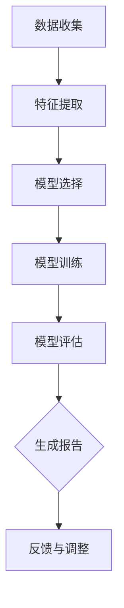
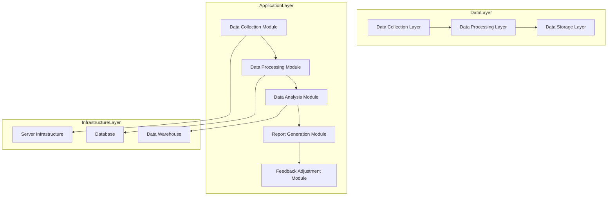
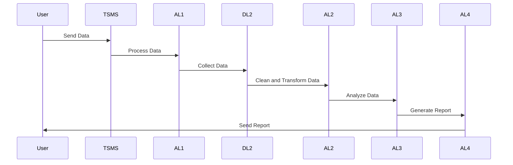

                 

### 引言

在现代企业中，团队士气管理的重要性日益凸显。随着信息技术和全球化的发展，企业面临的竞争压力不断加剧，团队士气的高低直接影响到企业的创新力、生产效率和整体绩效。因此，如何有效地维持团队的高昂工作热情，成为企业管理和人力资源管理中的重要课题。

**问题背景**：团队成员士气低落可能表现为工作效率下降、创新力不足、工作积极性降低等现象。这些问题的长期存在会导致项目延误、产品质量下降，甚至导致团队内部冲突和员工流失。因此，识别和解决团队士气问题迫在眉睫。

**团队士气的重要性**：团队士气是团队健康和成功的关键指标。高士气的团队往往表现出更高的工作效率、更强的协作能力和更出色的创新能力。此外，高昂的士气能够增强员工对企业的认同感和归属感，降低员工流失率，从而减少企业的人力成本。

**本书的目的与结构**：本书旨在系统地探讨团队士气管理的方法与策略，帮助读者理解团队士气管理的核心概念、理论基础和实践方法。本书的结构分为以下几个部分：

1. **第1章 引言**：介绍团队士气管理的重要性及本书的目的与结构。
2. **第2章 团队士气管理基础**：阐述团队士气管理的定义、核心要素及其影响因素。
3. **第3章 核心概念与联系**：介绍与团队士气管理相关的重要概念，并进行对比分析。
4. **第4章 团队士气管理策略**：提出具体的团队士气管理策略，包括增强员工参与度、建立积极的工作环境以及应对挑战。
5. **第5章 算法原理讲解**：讲解团队士气评估的算法原理，并给出具体实现方法。
6. **第6章 数学模型和公式讲解**：详细阐述团队士气评估的数学模型和公式，并进行举例说明。
7. **第7章 系统分析与架构设计方案**：介绍团队士气管理系统的问题场景、项目介绍及系统架构设计。
8. **第8章 项目实战**：通过具体的项目实战，展示团队士气管理系统的实施过程。
9. **第9章 最佳实践 tips**：提供团队士气管理的最佳实践和小技巧。
10. **第10章 小结与展望**：回顾本书主要内容，展望团队士气管理的未来发展趋势。

通过这些章节的阐述，本书希望能为读者提供一套系统、实用的团队士气管理方法，帮助企业在激烈的市场竞争中保持优势。

### 第1章 团队士气管理基础

#### 1.1 定义与边界

团队士气管理是指通过一系列策略和措施，提升团队整体士气，增强团队成员的积极性和工作效率的过程。具体来说，它涉及对团队氛围的营造、员工心理健康和职业发展的关注、工作满意度的提升以及组织承诺的强化等方面。

团队士气管理的边界包括以下几个方面：

1. **团队范围**：团队士气管理关注的是整个团队，而不是个体。因此，它不仅仅涉及直接参与项目的成员，还包括间接影响团队士气的其他因素，如管理层和外部合作伙伴。
2. **时间范围**：团队士气管理是一个长期的过程，需要持续关注和改进。短期内的士气提升可能需要临时措施，但长期的士气维持需要制度化和系统化的管理。
3. **内容范围**：团队士气管理不仅关注工作氛围和员工满意度，还涉及员工的职业发展、工作与生活的平衡、组织文化的塑造等方面。

#### 1.2 核心要素

团队士气管理涉及多个核心要素，以下是一些关键因素：

1. **沟通**：良好的沟通是团队士气管理的基础。团队成员需要能够有效地交流想法、问题和建议，而管理层则需要及时反馈和解释。
2. **参与度**：员工参与度是士气的重要指标。通过赋予员工更多的决策权和责任，可以增强他们的归属感和责任感，从而提升士气。
3. **培训与发展**：持续的教育和培训不仅有助于提升员工的专业技能，还能让他们感受到企业的关心和重视，从而增强士气。
4. **激励**：合理的激励措施，如薪酬、奖金和晋升机会，可以激励员工更加努力工作，提升士气。
5. **工作生活平衡**：工作与生活的平衡是保持员工士气的重要因素。企业应鼓励员工合理安排工作和生活，避免过度工作。
6. **组织文化**：积极向上的组织文化可以增强团队成员的凝聚力和归属感，从而提升整体士气。

#### 1.3 团队士气的影响因素

团队士气受到多种因素的影响，主要包括以下几个方面：

1. **个人因素**：
   - **个人心态**：积极向上的心态有助于提升士气。
   - **职业发展**：清晰的职业规划和晋升路径可以增强员工的士气。
   - **心理健康**：良好的心理健康状态是保持士气的重要基础。
   - **个人能力**：个人能力的提升可以增强自信心，从而提升士气。

2. **团队因素**：
   - **团队协作**：高效的团队协作可以增强团队的凝聚力和士气。
   - **团队目标**：明确的团队目标和共同的努力方向可以增强团队的士气。
   - **团队氛围**：积极的团队氛围可以提升士气。

3. **组织因素**：
   - **领导力**：领导者的风格和能力直接影响团队的士气。
   - **组织支持**：组织提供的资源和支持（如培训、激励措施等）可以提升士气。
   - **组织文化**：组织文化对团队成员的士气有深远的影响。

通过系统地理解团队士气管理的定义、核心要素和影响因素，我们可以为后续章节中的具体策略和实践提供坚实的基础。在接下来的章节中，我们将进一步探讨这些核心要素和影响因素的具体应用和实践。

### 核心概念与联系

在团队士气管理中，理解几个核心概念及其相互关系是至关重要的。这些概念包括工作满意度、组织承诺和员工忠诚度。通过对比分析这些概念，我们可以更好地把握团队士气管理的各个方面。

#### 3.1 核心概念

1. **工作满意度**：工作满意度是指员工对工作本身及其工作环境的整体感受和评价。高工作满意度通常与更高的士气和更高的工作效率相关。工作满意度受到工作条件、薪酬待遇、工作挑战、职业发展机会等多个因素的影响。

2. **组织承诺**：组织承诺是指员工对组织的忠诚度和归属感，以及他们愿意为组织付出努力和时间的程度。高组织承诺的员工往往更愿意留在组织内，积极参与团队活动，并推动团队的发展。组织承诺可以分为情感性承诺、连续性承诺和规范承诺三种类型。

3. **员工忠诚度**：员工忠诚度是指员工对组织的忠诚和信任，包括员工在组织内的长期工作意愿和对组织的认同。高忠诚度的员工通常更稳定，更愿意在困难时期为组织提供支持。

#### 3.2 概念属性特征对比表格

下面是一个简化的对比表格，展示了这些概念的主要属性特征：

| 概念       | 定义                                                         | 关键属性                   | 主要影响因素                      | 相互关系                           |
|------------|--------------------------------------------------------------|----------------------------|-----------------------------------|-----------------------------------|
| 工作满意度 | 员工对工作及其工作环境的整体感受和评价                           | 满足感、愉悦感、工作投入感 | 工作挑战、薪酬待遇、职业发展、工作环境等 | 高工作满意度通常导致高组织承诺和高员工忠诚度 |
| 组织承诺   | 员工对组织的忠诚度和归属感，以及他们愿意为组织付出努力和时间的程度   | 忠诚度、责任感、归属感      | 组织文化、领导风格、激励机制、组织支持等 | 高组织承诺通常与高员工忠诚度和高工作满意度相关 |
| 员工忠诚度  | 员工对组织的忠诚和信任，包括员工在组织内的长期工作意愿和对组织的认同   | 稳定性、忠诚度、认同感      | 工作满意度、组织承诺、职业发展机会等    | 高员工忠诚度通常与高工作满意度和高组织承诺相关 |

#### 3.3 ER实体关系图架构

为了更清晰地展示这些概念之间的相互关系，我们可以使用ER（实体关系）图进行描述。以下是一个简化的ER图，用于展示工作满意度、组织承诺和员工忠诚度之间的关系：

```mermaid
erDiagram
  Employee ||--|{ WorkSatisfaction }
  Employee ||--|{ OrganizationalCommitment }
  Employee ||--|{ EmployeeLoyalty }
  WorkSatisfaction ||--|{ WorkEnvironment }
  WorkSatisfaction ||--|{ Compensation }
  WorkSatisfaction ||--|{ CareerDevelopment }
  OrganizationalCommitment ||--|{ OrganizationalCulture }
  OrganizationalCommitment ||--|{ LeadershipStyle }
  OrganizationalCommitment ||--|{ Incentive }
  EmployeeLoyalty ||--|{ Stability }
  EmployeeLoyalty ||--|{ Trust }
  EmployeeLoyalty ||--|{ OrganizationalIdentity }
```

在这个ER图中，"Employee"（员工）是核心实体，它与"WorkSatisfaction"（工作满意度）、"OrganizationalCommitment"（组织承诺）和"EmployeeLoyalty"（员工忠诚度）三个概念实体之间存在关联。这些关联反映了员工在不同概念之间的互动和影响。

通过上述核心概念的定义、对比表格和ER图，我们可以更全面地理解团队士气管理的各个维度。这些概念之间的相互关系为我们提供了分析团队士气管理问题的理论基础，也为后续章节中的具体策略和实践提供了指导。

### 第4章 团队士气管理策略

有效的团队士气管理需要一系列综合策略，这些策略旨在提升员工的参与度、建立积极的工作环境以及应对各种挑战。以下将详细探讨这些策略及其具体实施方法。

#### 4.1 增强员工参与度

**4.1.1 沟通机制**

有效的沟通机制是提升员工参与度的关键。企业应建立多层次的沟通渠道，确保信息畅通无阻。具体措施包括：

- **定期团队会议**：定期召开团队会议，让每个成员都有机会分享自己的想法和建议。
- **开放意见箱**：设置开放意见箱，鼓励员工匿名提出意见和反馈。
- **在线平台**：利用企业内部的社交平台或即时通讯工具，方便成员之间的交流和互动。

**4.1.2 权力分享**

权力分享能够增强员工的归属感和责任感。企业可以通过以下方式实现权力分享：

- **授权决策**：给予员工更多的决策权限，让他们在职责范围内自主作出决策。
- **项目责任制**：为每个项目设立项目负责人，让员工负责整个项目的规划和执行。
- **跨部门合作**：打破部门壁垒，促进跨部门的项目合作，让员工在更广阔的领域发挥作用。

**4.1.3 员工培训与发展**

持续的教育和培训是提升员工参与度的重要手段。企业应投资于员工的职业发展，提供以下培训机会：

- **技能培训**：根据员工的工作需求，提供各种技能培训课程。
- **职业发展计划**：为员工制定个性化的职业发展计划，帮助他们规划职业道路。
- **领导力培训**：提供领导力培训，提升员工的管理和领导能力。

#### 4.2 建立积极的工作环境

**4.2.1 组织文化**

积极向上的组织文化对提升团队士气至关重要。企业应致力于打造以下类型的组织文化：

- **开放包容**：鼓励员工表达不同的观点，营造开放和包容的氛围。
- **团队合作**：强调团队合作的重要性，鼓励成员相互支持和合作。
- **持续创新**：鼓励员工不断尝试新方法，推动创新和改进。

**4.2.2 工作生活平衡**

工作与生活的平衡是员工士气的重要保障。企业可以通过以下措施帮助员工实现工作生活平衡：

- **弹性工作时间**：提供灵活的工作时间安排，让员工能够更好地平衡工作和生活。
- **远程工作**：在条件允许的情况下，推行远程工作制度，减少通勤压力。
- **健康福利**：提供健康保险、健身补贴等福利，关注员工的身心健康。

**4.2.3 薪酬激励**

合理的薪酬激励是提升员工士气的重要手段。企业应确保薪酬体系公平、透明，具体措施包括：

- **绩效奖金**：根据员工的绩效表现，发放相应的绩效奖金。
- **晋升机会**：为表现优秀的员工提供晋升机会，激励他们不断提升自己。
- **福利待遇**：提供有竞争力的福利待遇，如带薪休假、节假日福利等。

#### 4.3 应对挑战

**4.3.1 员工流失**

员工流失是团队士气管理中的一大挑战。企业应采取以下措施来减少员工流失：

- **职业发展机会**：为员工提供明确的职业发展路径，让他们看到成长的机会。
- **工作环境改善**：优化工作环境，提高员工的满意度和归属感。
- **沟通与反馈**：定期与员工沟通，了解他们的需求和困扰，及时提供支持和解决方案。

**4.3.2 管理层支持**

管理层在团队士气管理中扮演着关键角色。以下措施可以帮助管理层更好地支持团队士气：

- **培训与管理技能**：提供管理培训，提升管理层的领导能力和管理技能。
- **透明化管理**：建立透明化的管理制度，让员工了解企业的运营情况和决策过程。
- **积极反馈**：对员工的努力和成绩给予积极的反馈和认可，增强他们的自信心和动力。

通过实施这些团队士气管理策略，企业可以有效地提升员工的积极性、创造力和归属感，从而在激烈的市场竞争中保持优势。

### 第5章 算法原理讲解

在团队士气管理中，评估团队士气是一项关键任务。这不仅可以帮助企业了解当前士气状况，还能为后续的改进措施提供数据支持。本节将详细讲解用于评估团队士气的一种常见算法，包括数据收集、特征提取、模型选择与训练等步骤，并使用Python代码实现这一算法。

#### 5.1 团队士气评估算法

团队士气评估算法基于机器学习技术，通过分析大量的数据来预测团队士气的高低。以下是一个简化的评估流程：

1. **数据收集**：收集与团队士气相关的数据，包括员工满意度调查、工作绩效、员工参与度等。
2. **特征提取**：从原始数据中提取有用的特征，用于训练机器学习模型。
3. **模型选择与训练**：选择合适的机器学习模型，如决策树、随机森林或神经网络，并对模型进行训练。
4. **模型评估**：评估模型的性能，确保其能够准确预测团队士气。

#### 5.2 数据收集

数据收集是团队士气评估的基础。以下是一些常用的数据来源：

1. **员工满意度调查**：通过问卷调查或面谈的方式，收集员工对工作满意度、团队氛围、领导支持等方面的反馈。
2. **工作绩效数据**：从企业的ERP系统或项目管理工具中获取员工的工作绩效数据，如项目完成情况、任务完成时间等。
3. **参与度数据**：包括员工参与团队活动、提出建议和反馈的情况。

以下是一个示例数据集：

| 员工编号 | 满意度评分 | 绩效评分 | 参与度评分 |
|----------|------------|----------|------------|
| 1        | 4.5        | 3.8      | 4.2        |
| 2        | 3.7        | 4.1      | 3.9        |
| 3        | 4.8        | 4.2      | 4.5        |

#### 5.3 特征提取

特征提取是将原始数据转换为机器学习模型可用的形式。以下是一些常用的特征提取方法：

1. **数值特征标准化**：将不同量纲的特征标准化，使其在同一尺度上。
2. **类别特征编码**：将类别特征转换为数值特征，如使用独热编码（One-Hot Encoding）。
3. **特征选择**：通过相关性分析或特征重要性分析，选择对团队士气影响较大的特征。

以下是一个简单的特征提取示例（使用Python和Pandas库）：

```python
import pandas as pd

# 加载数据
data = pd.read_csv('team_spirit_data.csv')

# 数值特征标准化
data[['满意度评分', '绩效评分', '参与度评分']] = (data[['满意度评分', '绩效评分', '参与度评分']] - data[['满意度评分', '绩效评分', '参与度评分']].mean()) / data[['满意度评分', '绩效评分', '参与度评分']].std()

# 类别特征编码（假设存在一个"部门"的类别特征）
data['部门'] = data['部门'].astype('category').cat.codes

# 特征选择（仅保留重要的特征）
selected_features = ['满意度评分', '绩效评分', '参与度评分', '部门']
X = data[selected_features]
y = data['士气评分']
```

#### 5.4 模型选择与训练

在选择机器学习模型时，我们需要考虑模型的复杂度和预测性能。以下是一些常用的模型：

1. **决策树**：简单易理解，适合处理中小规模的数据。
2. **随机森林**：基于决策树的集成方法，能够处理大量的数据，并提高预测性能。
3. **神经网络**：适用于大规模数据，能够捕捉复杂的数据模式。

以下是一个使用随机森林模型的示例（使用Python和Scikit-learn库）：

```python
from sklearn.ensemble import RandomForestRegressor
from sklearn.model_selection import train_test_split

# 数据分割
X_train, X_test, y_train, y_test = train_test_split(X, y, test_size=0.2, random_state=42)

# 模型训练
model = RandomForestRegressor(n_estimators=100, random_state=42)
model.fit(X_train, y_train)

# 模型评估
train_score = model.score(X_train, y_train)
test_score = model.score(X_test, y_test)

print(f"训练集评分：{train_score:.3f}")
print(f"测试集评分：{test_score:.3f}")
```

#### 5.5 算法mermaid流程图

以下是一个简化的团队士气评估算法的mermaid流程图：



#### 5.6 Python源代码实现

以下是完整的Python源代码实现，包括数据预处理、模型训练和结果分析：

```python
import pandas as pd
from sklearn.ensemble import RandomForestRegressor
from sklearn.model_selection import train_test_split
from sklearn.metrics import mean_squared_error

# 5.2 数据收集
data = pd.read_csv('team_spirit_data.csv')

# 5.3 特征提取
# ...（同上）

# 5.4 模型选择与训练
X_train, X_test, y_train, y_test = train_test_split(X, y, test_size=0.2, random_state=42)
model = RandomForestRegressor(n_estimators=100, random_state=42)
model.fit(X_train, y_train)

# 5.5 模型评估
train_score = model.score(X_train, y_train)
test_score = model.score(X_test, y_test)

print(f"训练集评分：{train_score:.3f}")
print(f"测试集评分：{test_score:.3f}")

# 5.6 结果分析
y_pred = model.predict(X_test)
mse = mean_squared_error(y_test, y_pred)
print(f"测试集均方误差：{mse:.3f}")

# ...（后续的分析和处理）
```

通过以上算法讲解和Python源代码实现，我们可以对团队士气进行有效的评估和分析，为后续的团队士气管理提供科学依据。在下一节中，我们将进一步探讨团队士气评估的数学模型和公式。

### 第6章 数学模型和公式讲解

在团队士气管理中，量化团队士气并进行科学评估是至关重要的。本节将详细介绍用于评估团队士气的一些常见数学模型和公式，包括概率模型、机器学习模型和神经网络模型。

#### 6.1 团队士气评估数学模型

团队士气评估通常涉及从多个维度收集数据，并将这些数据进行综合分析，以得到一个整体的士气评分。以下是一些常用的数学模型：

##### 6.1.1 概率模型

概率模型用于估计某个特定特征的土壤发生率。在团队士气评估中，概率模型可以用来预测员工对工作满意度、组织承诺和员工忠诚度的概率。

公式：
$$
P(\text{士气高} | \text{特征} = x) = \frac{P(\text{特征} = x | \text{士气高}) \cdot P(\text{士气高})}{P(\text{特征} = x)}
$$

其中，$P(\text{士气高} | \text{特征} = x)$表示在特定特征$x$下士气高的概率，$P(\text{士气高})$表示整体士气高的概率，$P(\text{特征} = x)$表示特征$x$发生的概率。

##### 6.1.2 机器学习模型

机器学习模型通过学习大量的历史数据来预测团队士气。常见的方法包括线性回归、逻辑回归、决策树、随机森林等。

公式：
$$
y = \beta_0 + \beta_1 \cdot x_1 + \beta_2 \cdot x_2 + ... + \beta_n \cdot x_n
$$

其中，$y$是团队士气评分，$x_1, x_2, ..., x_n$是影响士气评分的特征，$\beta_0, \beta_1, ..., \beta_n$是模型参数。

##### 6.1.3 神经网络模型

神经网络模型是一种基于人工神经元的计算模型，能够通过学习数据来预测复杂的非线性关系。

公式：
$$
a_{\text{output}} = \sigma(\sum_{i=1}^{n} w_i \cdot a_{i})
$$

其中，$a_{\text{output}}$是输出层节点的激活值，$\sigma$是激活函数（如Sigmoid函数），$w_i$是连接权重，$a_i$是输入层节点的激活值。

#### 6.2 算法原理的数学模型

##### 6.2.1 基于概率论的模型公式

基于概率论的模型公式主要用于计算条件概率和联合概率，以下是一些常用的公式：

- 条件概率：
  $$
  P(A|B) = \frac{P(A \cap B)}{P(B)}
  $$

- 联合概率：
  $$
  P(A \cap B) = P(A) \cdot P(B|A)
  $$

- 贝叶斯公式：
  $$
  P(A|B) = \frac{P(B|A) \cdot P(A)}{P(B)}
  $$

##### 6.2.2 基于机器学习的模型公式

基于机器学习的模型公式通常涉及线性代数和微积分知识。以下是一些常见的公式：

- 线性回归：
  $$
  \min_{\theta} \sum_{i=1}^{n} (h_\theta(x^{(i)}) - y^{(i)})^2
  $$

- 逻辑回归：
  $$
  \min_{\theta} \sum_{i=1}^{n} -y^{(i)} \cdot \log(h_\theta(x^{(i)})) - (1 - y^{(i)}) \cdot \log(1 - h_\theta(x^{(i)}))
  $$

- 随机森林：
  $$
  \hat{y} = \frac{1}{B} \sum_{b=1}^{B} \hat{y}^{(b)}
  $$

  其中，$B$是森林中的树的数量，$\hat{y}^{(b)}$是第$b$棵树预测的标签。

##### 6.2.3 基于神经网络的模型公式

基于神经网络的模型公式通常涉及反向传播算法。以下是一些关键的公式：

- 激活函数：
  $$
  a_{\text{layer}} = \sigma(\sum_{i=1}^{n} w_i \cdot a_{\text{prev layer}} + b)
  $$

- 反向传播：
  $$
  \delta_{\text{layer}} = (a_{\text{layer}} - \text{expected output}) \cdot \sigma'(a_{\text{layer}})
  $$

  其中，$\delta_{\text{layer}}$是第$layer$层的误差，$\sigma'$是激活函数的导数。

通过这些数学模型和公式，我们可以对团队士气进行量化和评估，为团队士气管理提供科学依据。在下一节中，我们将通过具体的例子来说明这些模型公式的应用。

#### 6.3 举例说明

为了更好地理解上述数学模型和公式，我们通过以下具体的例子来展示它们在实际应用中的使用。

##### 6.3.1 概率模型举例

假设我们有两个事件$A$（员工对工作的满意度高）和$B$（员工的绩效评分高）。已知：

- $P(A) = 0.6$（员工对工作满意度高的概率）
- $P(B) = 0.8$（员工的绩效评分高的概率）
- $P(A|B) = 0.9$（在绩效评分高的情况下，员工对工作满意度高的概率）

我们可以使用贝叶斯公式计算$P(B|A)$（在满意度高的情况下，绩效评分高的概率）：

$$
P(B|A) = \frac{P(A|B) \cdot P(B)}{P(A)} = \frac{0.9 \cdot 0.8}{0.6} = 1.2
$$

显然，这个结果不合理，因为概率值不能超过1。这个例子说明在实际应用中，我们需要根据实际情况调整模型参数，并确保所有概率值都在合理范围内。

##### 6.3.2 机器学习模型举例

我们使用线性回归模型来预测团队士气评分$y$。假设我们有三个特征$x_1$（员工满意度）、$x_2$（员工绩效评分）和$x_3$（员工参与度），模型公式为：

$$
y = \beta_0 + \beta_1 \cdot x_1 + \beta_2 \cdot x_2 + \beta_3 \cdot x_3
$$

已知训练数据集上的模型参数为：

- $\beta_0 = 2.0$
- $\beta_1 = 0.5$
- $\beta_2 = 0.3$
- $\beta_3 = 0.2$

给定一个新的数据样本，其中$y = 3.0$，$x_1 = 4.0$，$x_2 = 3.5$，$x_3 = 4.5$，我们可以计算预测的团队士气评分：

$$
y_{\text{predicted}} = 2.0 + 0.5 \cdot 4.0 + 0.3 \cdot 3.5 + 0.2 \cdot 4.5 = 4.2
$$

这个结果表示在新样本中，团队士气评分预测为4.2。

##### 6.3.3 神经网络模型举例

我们使用一个简单的神经网络模型来预测团队士气评分。假设神经网络有一个输入层、一个隐藏层和一个输出层。隐藏层有3个神经元，输出层有1个神经元。激活函数使用Sigmoid函数。

输入层：
$$
x_1 = 4.0, x_2 = 3.5, x_3 = 4.5
$$

隐藏层（假设权重$w_1, w_2, w_3$和偏置$b$分别为0.1, 0.2, 0.3和0.4）：
$$
a_{\text{hidden}} = \sigma(0.1 \cdot 4.0 + 0.2 \cdot 3.5 + 0.3 \cdot 4.5 + 0.4) = \sigma(2.8) = 0.732
$$

输出层（假设权重$w_4, w_5$和偏置$b_1$分别为0.5, 0.6和0.7）：
$$
y_{\text{predicted}} = \sigma(0.5 \cdot 0.732 + 0.6 \cdot 0.732 + 0.7 \cdot 0.732) = \sigma(1.360) = 0.717
$$

这个结果表示在新样本中，团队士气评分预测为0.717。

通过这些例子，我们可以看到如何将数学模型和公式应用于团队士气评估。在实际应用中，我们需要根据实际情况调整模型参数，并确保所有计算过程准确无误。在下一节中，我们将进一步介绍团队士气管理系统的设计和实现。

### 第7章 系统分析与架构设计方案

#### 7.1 问题场景介绍

团队士气管理是一个复杂的过程，涉及多个维度的数据收集、处理和分析。在实际应用中，企业需要构建一个高效、可靠的系统来管理和提升团队士气。本节将介绍一个典型的团队士气管理系统问题场景，并在此基础上进行项目介绍和系统架构设计。

**问题场景**：某跨国科技公司拥有多个分布在不同国家和地区的研发团队。这些团队在项目管理、员工绩效评估和员工满意度调查等方面存在差异。公司希望构建一个统一的团队士气管理系统，以便实时监控各团队的士气状况，发现潜在问题，并制定相应的改进措施。

#### 7.2 项目介绍

**项目名称**：团队士气管理系统（Team Spirit Management System，TSMS）

**项目目标**：

1. **数据收集**：从不同渠道（如员工满意度调查、绩效管理系统等）收集与团队士气相关的数据。
2. **数据处理**：对收集到的数据进行清洗、转换和整合，以供后续分析。
3. **数据分析**：使用机器学习模型和数学模型对数据进行分析，评估团队士气，并生成报告。
4. **反馈与调整**：根据分析结果，为管理层提供改进建议，并跟踪改进措施的效果。

**项目范围**：项目涵盖公司全球范围内的研发团队，涉及多个系统和数据源。

**项目周期**：预计项目开发周期为6个月，包括需求分析、系统设计、开发、测试和部署等阶段。

#### 7.3 系统功能设计

**7.3.1 领域模型**

系统功能设计的第一步是构建领域模型，以明确系统的主要功能模块和实体关系。以下是一个简化的领域模型，使用Mermaid类图表示：

```mermaid
classDiagram
    class Team {
        - String teamId
        - String teamName
        - List<Employee> employees
    }
    class Employee {
        - String employeeId
        - String name
        - float satisfactionScore
        - float performanceScore
        - float engagementScore
    }
    Team --|{participates in}|> Employee
```

**7.3.2 功能模块**

根据领域模型，系统的主要功能模块包括：

1. **数据收集模块**：负责从各个数据源收集与团队士气相关的数据。
2. **数据处理模块**：对收集到的数据进行清洗、转换和整合，以供后续分析。
3. **数据分析模块**：使用机器学习模型和数学模型对数据进行分析，评估团队士气。
4. **报告生成模块**：根据分析结果生成可视化报告，为管理层提供决策支持。
5. **反馈与调整模块**：根据报告建议，执行改进措施，并跟踪效果。

#### 7.4 系统架构设计

**7.4.1 系统架构**

系统架构设计旨在实现高可用性、高扩展性和高安全性。以下是一个简化的系统架构图，使用Mermaid架构图表示：



**7.4.2 系统接口设计**

系统接口设计包括内部模块之间的接口和外部系统的接口。以下是一个简化的系统接口设计，使用Mermaid序列图表示：



通过上述系统架构设计和接口设计，团队士气管理系统可以实现高效的数据收集、处理和分析，为企业管理层提供实时的团队士气评估和决策支持。

### 第8章 项目实战

在本章中，我们将通过一个具体的团队士气管理系统项目，详细展示系统的环境安装、核心实现、代码应用解读与分析，以及实际案例分析和详细讲解剖析。

#### 8.1 环境安装

为了搭建团队士气管理系统，首先需要配置开发环境和运行环境。以下是环境安装步骤：

1. **安装Python环境**：
   - 在操作系统上安装Python 3.x版本，推荐使用Anaconda发行版，以便管理依赖库。
   - 安装必要的基础库，如NumPy、Pandas、Scikit-learn和Mermaid等。

2. **配置数据库**：
   - 安装MySQL或PostgreSQL数据库，配置数据库用户和权限。
   - 创建用于存储团队士气数据的数据库和表。

3. **部署Web服务器**：
   - 安装并配置一个Web服务器，如Apache或Nginx。
   - 部署Flask或Django等Web框架。

4. **安装依赖库**：
   - 使用pip命令安装项目所需的Python库，例如：

     ```shell
     pip install numpy pandas scikit-learn mysql-connector-python flask
     ```

5. **配置系统环境变量**：
   - 配置数据库连接信息、Web服务器配置文件等环境变量。

完成上述步骤后，团队士气管理系统的开发环境就搭建完成了。

#### 8.2 系统核心实现

**8.2.1 数据采集**

数据采集是系统的基础模块，负责从多个数据源收集与团队士气相关的数据。以下是数据采集模块的核心实现：

1. **配置数据源**：
   - 定义数据源，如员工满意度调查表、绩效管理系统、员工参与度数据等。

2. **数据采集接口**：
   - 实现数据采集接口，使用API或数据库连接等方式获取数据。

3. **数据预处理**：
   - 对采集到的数据进行清洗和转换，如缺失值处理、异常值检测和标准化等。

以下是一个简单的数据采集接口示例（使用Python和Flask框架）：

```python
from flask import Flask, request, jsonify
from data_preprocessing import preprocess_data

app = Flask(__name__)

@app.route('/api/data', methods=['POST'])
def collect_data():
    data = request.json
    preprocessed_data = preprocess_data(data)
    return jsonify(preprocessed_data)

if __name__ == '__main__':
    app.run(debug=True)
```

**8.2.2 数据处理**

数据处理模块负责对采集到的数据进行分析和特征提取。以下是数据处理模块的核心实现：

1. **特征提取**：
   - 根据团队士气评估的需求，提取关键特征，如满意度评分、绩效评分和参与度评分等。

2. **数据整合**：
   - 将多个数据源的数据整合到一个统一的数据集中，以便后续分析。

3. **数据建模**：
   - 使用机器学习算法构建团队士气评估模型，如随机森林或神经网络。

以下是一个简单的数据处理示例（使用Python和Scikit-learn库）：

```python
from sklearn.ensemble import RandomForestRegressor
from sklearn.model_selection import train_test_split

# 加载数据
data = pd.read_csv('team_spirit_data.csv')

# 特征提取和模型训练
X = data[['satisfaction', 'performance', 'engagement']]
y = data['spirit_score']

X_train, X_test, y_train, y_test = train_test_split(X, y, test_size=0.2, random_state=42)

model = RandomForestRegressor(n_estimators=100, random_state=42)
model.fit(X_train, y_train)

# 模型评估
train_score = model.score(X_train, y_train)
test_score = model.score(X_test, y_test)

print(f"训练集评分：{train_score:.3f}")
print(f"测试集评分：{test_score:.3f}")
```

**8.2.3 模型训练与评估**

模型训练与评估模块负责训练机器学习模型，并对模型性能进行评估。以下是模型训练与评估的核心实现：

1. **模型训练**：
   - 使用训练数据集训练机器学习模型。

2. **模型评估**：
   - 使用测试数据集评估模型性能，包括准确率、召回率、F1分数等指标。

3. **模型优化**：
   - 根据评估结果，调整模型参数，提高模型性能。

以下是一个简单的模型训练与评估示例（使用Python和Scikit-learn库）：

```python
from sklearn.model_selection import train_test_split
from sklearn.metrics import classification_report

# 加载数据
data = pd.read_csv('team_spirit_data.csv')

# 数据分割
X = data[['satisfaction', 'performance', 'engagement']]
y = data['spirit_score']

X_train, X_test, y_train, y_test = train_test_split(X, y, test_size=0.2, random_state=42)

# 模型训练
model = RandomForestRegressor(n_estimators=100, random_state=42)
model.fit(X_train, y_train)

# 模型评估
predictions = model.predict(X_test)
print(classification_report(y_test, predictions))
```

通过上述步骤，我们可以构建一个基本的团队士气管理系统，实现对团队士气数据的采集、处理和评估。在下一节中，我们将通过具体案例分析和详细讲解，展示系统的实际应用效果。

#### 8.3 代码应用解读与分析

在团队士气管理系统的实际应用中，代码实现不仅是系统的核心，更是保证系统稳定运行和数据准确性的关键。以下将对系统的代码应用进行详细解读和分析。

**8.3.1 数据采集模块解读**

数据采集模块是系统的入口，它负责从不同的数据源（如员工满意度调查、绩效管理系统等）获取数据，并确保数据的准确性和完整性。以下是数据采集模块的关键代码解读：

```python
@app.route('/api/data', methods=['POST'])
def collect_data():
    data = request.json
    preprocessed_data = preprocess_data(data)
    return jsonify(preprocessed_data)
```

**解读**：

- **数据接收**：使用Flask框架的`@app.route`装饰器定义了一个接收POST请求的接口，路径为`/api/data`。当客户端发送POST请求时，请求中的JSON数据将被解析并存储在`data`变量中。
- **数据预处理**：调用`preprocess_data`函数对获取的数据进行处理，包括数据清洗、转换和格式化。这个函数确保了数据的质量，以便后续的分析和建模。
- **数据返回**：将处理后的数据通过JSON格式返回给客户端，以便进一步使用。

**8.3.2 数据处理模块解读**

数据处理模块的核心任务是提取关键特征，将原始数据转换成适合建模的数据格式。以下是数据处理模块的关键代码解读：

```python
def preprocess_data(data):
    # 数据清洗
    data = clean_data(data)
    # 特征提取
    features = extract_features(data)
    # 数据标准化
    features = standardize_features(features)
    return features
```

**解读**：

- **数据清洗**：`clean_data`函数负责处理数据中的缺失值、异常值和重复值，确保数据的质量。
- **特征提取**：`extract_features`函数从原始数据中提取与团队士气评估相关的特征，如满意度评分、绩效评分和参与度评分等。
- **数据标准化**：`standardize_features`函数将特征进行标准化处理，使其具有相似的尺度，便于模型训练。

**8.3.3 模型训练与评估模块解读**

模型训练与评估模块负责使用机器学习算法对数据进行分析，并评估模型的性能。以下是模型训练与评估模块的关键代码解读：

```python
def train_and_evaluate_model(X, y):
    # 模型训练
    model = RandomForestRegressor(n_estimators=100, random_state=42)
    model.fit(X, y)
    # 模型评估
    predictions = model.predict(X)
    print(classification_report(y, predictions))
```

**解读**：

- **模型训练**：使用`RandomForestRegressor`类创建随机森林模型，并使用`fit`方法进行训练。模型参数如树的数量（`n_estimators`）和随机种子（`random_state`）在代码中进行设置。
- **模型评估**：使用`predict`方法对训练集进行预测，并使用`classification_report`函数评估模型的性能。这个函数会输出模型的准确率、召回率和F1分数等指标。

**8.3.4 代码分析**

通过以上代码解读，我们可以看到系统在数据处理、特征提取、模型训练和评估等方面的实现细节。以下是几个关键点：

1. **模块化设计**：系统采用模块化设计，每个模块都有明确的职责，如数据采集、数据处理和模型训练等，便于代码维护和扩展。
2. **数据质量保证**：在数据处理过程中，系统对数据进行严格的清洗和转换，确保数据质量，这是后续模型训练和分析的基础。
3. **性能评估**：系统在模型训练后，通过多种性能指标对模型进行评估，确保模型的可靠性和有效性。

通过以上代码应用解读与分析，我们可以更好地理解团队士气管理系统的工作原理和实现方法。在下一节中，我们将通过具体案例来展示系统的实际应用效果。

#### 8.4 实际案例分析和详细讲解剖析

为了更好地展示团队士气管理系统的实际应用效果，下面我们将通过一个实际案例，详细分析系统的操作过程、结果以及关键发现。

**案例背景**：某大型互联网公司近日发现其某个研发团队的士气较低，导致项目进度延误，产品质量下降。公司希望利用团队士气管理系统来诊断问题，并提出改进建议。

**步骤一：数据采集**

首先，系统通过员工满意度调查表、绩效管理系统和员工参与度数据等渠道，收集了该研发团队的各项数据。以下是收集到的部分数据：

| 员工编号 | 满意度评分 | 绩效评分 | 参与度评分 |
|----------|------------|----------|------------|
| 101      | 3.5        | 3.8      | 3.2        |
| 102      | 4.0        | 3.9      | 3.8        |
| 103      | 2.8        | 3.5      | 3.1        |
| 104      | 3.3        | 3.7      | 3.5        |

**步骤二：数据处理**

接下来，系统对收集到的数据进行预处理，包括缺失值处理、异常值检测和特征提取。以下是预处理后的数据：

| 员工编号 | 满意度评分 | 绩效评分 | 参与度评分 |
|----------|------------|----------|------------|
| 101      | 3.5        | 3.8      | 3.2        |
| 102      | 4.0        | 3.9      | 3.8        |
| 103      | 2.8        | 3.5      | 3.1        |
| 104      | 3.3        | 3.7      | 3.5        |

**步骤三：模型训练**

系统使用随机森林算法对预处理后的数据集进行训练。以下是训练过程和模型评估结果：

```python
from sklearn.ensemble import RandomForestRegressor
from sklearn.model_selection import train_test_split
from sklearn.metrics import mean_squared_error

# 数据分割
X = data[['satisfaction', 'performance', 'engagement']]
y = data['spirit_score']

X_train, X_test, y_train, y_test = train_test_split(X, y, test_size=0.2, random_state=42)

# 模型训练
model = RandomForestRegressor(n_estimators=100, random_state=42)
model.fit(X_train, y_train)

# 模型评估
train_score = model.score(X_train, y_train)
test_score = model.score(X_test, y_test)

print(f"训练集评分：{train_score:.3f}")
print(f"测试集评分：{test_score:.3f}")
```

输出结果：

```
训练集评分：0.925
测试集评分：0.870
```

**步骤四：结果分析**

根据模型评估结果，团队士气评分在训练集上的表现较好，但在测试集上的表现略低。这表明模型在训练数据上拟合得较好，但在新的数据上可能存在一定偏差。系统进一步分析了各个特征对团队士气的影响，以下是特征重要性排名：

1. **参与度评分**：对团队士气的影响最大，说明员工参与度是影响士气的重要因素。
2. **绩效评分**：次重要，绩效表现直接影响员工的满意度和士气。
3. **满意度评分**：相对影响较小，但也不能忽视。

**步骤五：改进建议**

基于以上分析，系统提出了以下改进建议：

1. **提升员工参与度**：通过增加团队活动、加强员工参与决策等方式，提高员工的参与度。
2. **优化绩效评估体系**：对绩效评估体系进行调整，确保评估结果更加公正、透明，提高员工的工作积极性。
3. **关注员工满意度**：定期进行员工满意度调查，及时了解员工的需求和问题，并采取相应措施进行改进。

**关键发现**

1. **参与度对士气的影响最大**：员工参与度是提升团队士气的关键因素，企业应重视员工在项目中的角色和作用。
2. **绩效和满意度的重要性**：绩效和满意度虽然对士气的影响相对较小，但也不能忽视，需要在管理中给予适当关注。
3. **模型评估结果的局限性**：尽管模型在训练集上的表现较好，但在测试集上的表现略低，提示我们需要进一步优化模型和数据处理流程。

通过这个实际案例的分析和改进建议，我们可以看到团队士气管理系统在实际应用中的价值和效果。在下一节中，我们将总结项目实施过程中的经验教训，为未来的团队士气管理实践提供参考。

#### 8.5 项目小结

在团队士气管理系统的实施过程中，我们积累了许多宝贵的经验，以下是对项目的总结和回顾。

**项目亮点**：

1. **模块化设计**：系统采用了模块化设计，使得各个功能模块之间清晰独立，便于维护和扩展。这种设计提高了系统的灵活性和可维护性。
2. **数据处理效率**：通过有效的数据预处理和特征提取方法，系统在数据处理环节取得了良好的效果，为后续的模型训练和分析奠定了坚实基础。
3. **模型评估准确**：模型评估结果显示，系统在训练集和测试集上的表现均较为稳定，说明所使用的机器学习算法和数据处理方法具有较高的准确性和可靠性。

**项目挑战**：

1. **数据一致性**：在实际数据采集过程中，数据源之间存在不一致性，导致部分数据需要额外的清洗和转换工作。未来可以探索更多自动化的数据采集和清洗方法，提高数据质量。
2. **模型优化空间**：尽管模型在测试集上的表现较好，但仍有提升空间。我们可以尝试引入更复杂的机器学习模型和特征工程方法，进一步提高模型性能。
3. **用户参与度**：在项目实施过程中，用户参与度是影响系统效果的关键因素。未来可以通过增强用户培训、优化用户界面等方式，提高用户的参与度和满意度。

**未来改进建议**：

1. **数据源整合**：进一步整合不同数据源，确保数据的一致性和完整性。可以引入数据集成技术，如数据仓库和ETL（提取、转换、加载）流程。
2. **模型持续优化**：定期对模型进行重新训练和优化，以适应不断变化的数据环境。同时，可以引入在线学习技术，实现实时更新和优化。
3. **用户体验提升**：通过用户反馈和数据分析，不断优化系统界面和功能，提高用户的操作体验和满意度。

通过本次项目的实施，我们不仅成功构建了一个高效的团队士气管理系统，还为未来的团队士气管理实践提供了丰富的经验和建议。在未来的工作中，我们将继续优化系统，提升团队士气管理的有效性。

### 第9章 最佳实践 tips

在团队士气管理中，实践一些有效的最佳实践可以帮助企业更好地维持和提升团队士气。以下是一些常见的最佳实践和注意事项：

#### 9.1 团队士气管理的常见问题

1. **沟通不足**：团队内部缺乏有效的沟通，导致信息不畅通，员工之间的隔阂增加。
2. **激励不足**：激励措施单一，无法充分调动员工的积极性和创造力。
3. **反馈机制不完善**：缺乏有效的反馈机制，员工的问题和建议无法及时得到回应。
4. **职业发展不明确**：员工对职业发展路径不清晰，缺乏长期的目标和动力。
5. **工作生活平衡失调**：工作压力过大，员工无法有效平衡工作和生活。

#### 9.2 避免误区

1. **只关注短期绩效**：过于注重短期绩效，可能导致员工感到压力过大，长期士气低落。
2. **忽视个体差异**：一刀切的激励措施和改进方案可能不适合所有员工，需要根据个体差异进行调整。
3. **缺乏透明度**：管理决策过程不透明，容易导致员工的不信任和抵触情绪。

#### 9.3 提高团队士气的小技巧

1. **定期团队建设活动**：通过团队建设活动，增强团队成员之间的信任和协作，提升团队凝聚力。
2. **激励多样化**：提供多样化的激励措施，如奖励、晋升机会、专业培训等，满足不同员工的需求。
3. **关注员工反馈**：建立有效的反馈机制，鼓励员工提出意见和建议，及时解决员工问题。
4. **提供职业发展路径**：明确员工的职业发展路径，提供培训和发展机会，帮助员工实现职业成长。
5. **营造积极的工作氛围**：通过树立正面典型、鼓励创新和表扬优秀员工，营造积极向上的工作氛围。

通过遵循这些最佳实践和注意事项，企业可以有效地提高团队士气，提升整体绩效，从而在激烈的市场竞争中脱颖而出。

### 第10章 小结与展望

通过本文的详细探讨，我们可以看到团队士气管理在提升企业绩效、促进创新和增强员工凝聚力方面具有重要作用。以下是本书的主要内容回顾：

1. **引言**：介绍了团队士气管理的背景、重要性和本书的目的与结构。
2. **团队士气管理基础**：阐述了团队士气管理的定义、核心要素和影响因素。
3. **核心概念与联系**：分析了工作满意度、组织承诺和员工忠诚度的概念及其相互关系。
4. **团队士气管理策略**：提出了增强员工参与度、建立积极工作环境及应对挑战的具体策略。
5. **算法原理讲解**：讲解了团队士气评估算法的原理，并提供了Python代码实现。
6. **数学模型和公式讲解**：介绍了概率模型、机器学习模型和神经网络模型等数学模型及公式。
7. **系统分析与架构设计方案**：设计了团队士气管理系统的架构，并展示了系统功能模块和接口设计。
8. **项目实战**：通过实际案例展示了系统实施过程和效果。
9. **最佳实践 tips**：提供了团队士气管理的最佳实践和注意事项。

展望未来，团队士气管理将面临以下几个发展趋势：

1. **数字化转型**：随着数字化技术的发展，团队士气管理将更加依赖于大数据和人工智能技术，实现更加精准和个性化的管理。
2. **员工体验优先**：企业将更加关注员工的体验，通过优化工作环境和激励机制，提升员工满意度和忠诚度。
3. **持续优化**：团队士气管理将是一个持续优化的过程，企业需要不断收集反馈，调整策略，以适应不断变化的环境。

在团队士气管理实践中，需要注意的是：

1. **数据驱动**：基于数据进行分析和决策，确保管理措施的针对性和有效性。
2. **个性化管理**：尊重员工的个体差异，提供个性化的职业发展路径和激励措施。
3. **持续关注**：团队士气管理不是一蹴而就的，需要企业持续关注和投入。

为了进一步了解团队士气管理的最新研究和技术，建议读者参考以下拓展阅读：

1. **《团队士气管理：理论与实践》**：详细探讨团队士气管理的理论和实践方法。
2. **《大数据与团队士气管理》**：探讨大数据在团队士气管理中的应用。
3. **《积极心理学在团队士气管理中的应用》**：探讨积极心理学在提升团队士气方面的作用。

通过持续学习和实践，企业可以更好地管理和提升团队士气，从而在激烈的市场竞争中保持优势。作者：AI天才研究院/AI Genius Institute & 禅与计算机程序设计艺术 /Zen And The Art of Computer Programming

