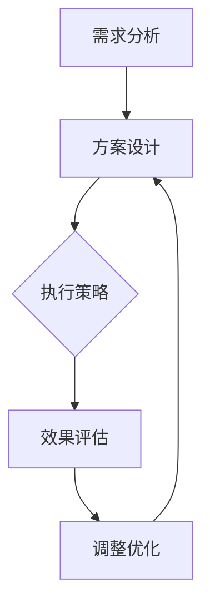
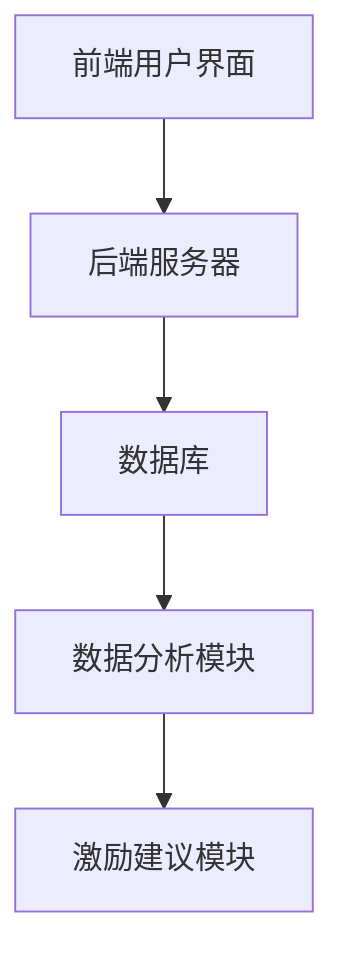
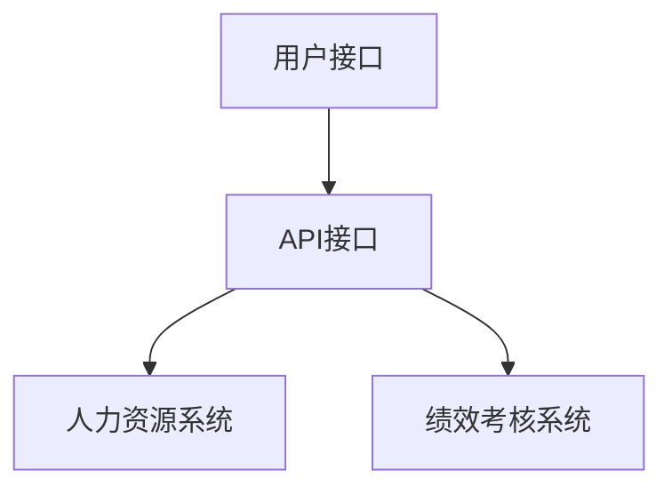
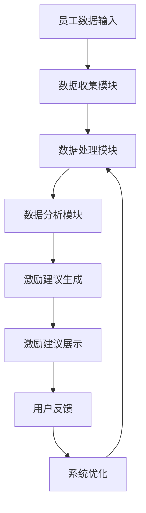

                 

### 1. 文章标题与关键词

**文章标题：** 团队士气：提升工作热情的方法

**关键词：** 团队士气、工作热情、激励、文化氛围、领导风格、健康管理

### 2. 文章摘要

本文将探讨团队士气对工作热情的影响，通过深入分析团队士气核心要素，提供一系列提升团队士气和员工工作热情的方法。文章将从绩效激励、文化氛围、领导风格、员工参与和健康管理五个方面展开，结合实际案例，详细阐述每项措施的具体实施步骤和效果评估，旨在为企业管理者提供实用的策略和建议。

### 3. 目录结构

本文将分为七个部分：

1. **问题背景与核心概念**：介绍团队士气的重要性，阐述团队士气核心要素。
2. **团队士气核心要素**：详细分析绩效激励、文化氛围、领导风格、员工参与和健康管理。
3. **核心概念原理与特征**：解释各要素的原理和特征，并提供对比表格和ER图。
4. **团队士气提升算法原理**：介绍提升团队士气的方法，使用Python代码和数学模型进行说明。
5. **系统分析与架构设计**：描述系统功能、架构、接口和交互设计。
6. **项目实战**：展示实际项目中的团队士气提升措施，进行代码应用解读和案例分析。
7. **最佳实践与总结**：总结提升团队士气的方法，提供最佳实践和注意事项。

---

### 4. 问题背景与核心概念

#### 4.1.1 问题背景

在当今快速变化的工作环境中，团队士气成为影响企业绩效的关键因素之一。高士气的团队往往展现出更高的工作效率、更强的创新能力和更好的团队合作精神。然而，如何有效地提升团队士气，一直是企业管理者和人力资源管理专家关注的焦点。本文将从多个维度探讨团队士气的问题背景，并提出相应的解决策略。

#### 4.1.2 问题描述

团队士气低下通常表现为以下几种现象：

- 员工工作积极性不高，缺乏主动性；
- 团队成员之间沟通不畅，协作困难；
- 员工流动率高，离职现象频繁；
- 团队整体绩效不达标，项目延误或失败。

这些现象不仅影响了团队的工作氛围，还直接影响了企业的运营和发展。因此，如何提升团队士气，成为亟待解决的问题。

#### 4.1.3 问题解决思路

提升团队士气需要从以下几个方面入手：

- **绩效激励**：通过合理的绩效评估体系和激励机制，激发员工的工作积极性；
- **文化氛围**：营造积极向上的企业文化，增强团队凝聚力；
- **领导风格**：培养具有激励和领导力的管理者，提升团队士气；
- **员工参与**：鼓励员工参与决策，提高工作满意度；
- **健康管理**：关注员工身心健康，提供必要的支持和资源。

以上策略的综合应用，有望有效提升团队士气，增强企业的竞争力。

#### 4.1.4 边界与外延

团队士气的提升不仅涉及企业内部的管理策略，还与外部环境密切相关。外部环境的变化，如市场压力、经济形势等，也会对团队士气产生影响。因此，在实施提升策略时，需要充分考虑外部因素的影响。

#### 4.1.5 核心概念

本文的核心概念包括：

- **团队士气**：指团队成员在工作中的积极态度和情绪状态；
- **绩效激励**：通过奖励和惩罚机制，激发员工的工作积极性；
- **文化氛围**：企业内部的文化氛围，影响员工的工作态度和行为；
- **领导风格**：管理者的行为方式，对团队士气有重要影响；
- **员工参与**：员工在决策过程中的参与程度，影响工作满意度；
- **健康管理**：关注员工的身心健康，提高工作效率。

这些概念将在后续章节中详细探讨。

---

### 4.2. 团队士气核心要素

团队士气是由多个核心要素构成的，这些要素相互影响，共同作用于团队的整体氛围和工作效率。以下是对五个核心要素的详细分析：

#### 4.2.1 绩效激励

绩效激励是提升团队士气的重要手段之一。通过设定明确的目标和合理的评估标准，对员工的绩效进行评估，并给予相应的奖励或惩罚，可以有效地激发员工的工作积极性。绩效激励的核心原则包括：

- **公平性**：绩效评估应基于客观、公正的标准，确保每位员工都能感受到公平对待。
- **明确性**：目标和评估标准应明确，员工知道如何通过努力达成目标。
- **及时性**：奖励和反馈应即时给予，以强化员工的积极行为。

#### 4.2.2 文化氛围

企业文化是团队士气的重要支撑。一个积极向上的企业文化可以激发员工的归属感和荣誉感，增强团队凝聚力。文化氛围的建设包括以下几个方面：

- **价值观**：企业价值观应与员工的价值观相契合，形成共同的信念和目标。
- **团队精神**：鼓励团队合作，倡导互助互信，形成积极向上的团队氛围。
- **沟通机制**：建立畅通的沟通渠道，确保信息传递的及时性和准确性。

#### 4.2.3 领导风格

领导风格对团队士气有直接影响。不同的领导风格会对员工的工作态度和行为产生不同的影响。以下是几种常见的领导风格及其特点：

- **民主型领导**：鼓励员工参与决策，尊重员工的意见和建议，有助于提升员工的满意度和参与感。
- **独裁型领导**：决策权集中在领导者手中，员工参与度低，可能会导致员工缺乏积极性和创造力。
- **变革型领导**：通过激励和引导，推动团队变革和创新，有助于提升团队的士气和创新能力。

#### 4.2.4 员工参与

员工参与是提升团队士气的重要途径。通过让员工参与到决策过程中，可以增强员工的责任感和归属感，提高工作满意度。员工参与的方式包括：

- **开放式沟通**：鼓励员工表达意见和建议，建立反馈机制。
- **参与式决策**：在重要决策中，邀请员工参与，提高决策的民主性和透明度。
- **员工培训和发展**：提供培训和发展机会，帮助员工提升技能和职业素养。

#### 4.2.5 健康管理

健康管理是提升团队士气的重要保障。关注员工的身心健康，提供必要的支持和资源，有助于提高员工的工作效率和士气。健康管理包括以下几个方面：

- **工作环境**：提供舒适、安全的工作环境，降低员工的工作压力。
- **健康福利**：提供健康保险、体检等福利，关注员工的健康状况。
- **心理健康**：提供心理健康支持，帮助员工缓解压力和焦虑。

#### 4.2.6 对比与联系

以上五个核心要素相互联系，共同作用于团队士气。绩效激励可以激发员工的工作动力，文化氛围和员工参与可以增强团队的凝聚力和归属感，领导风格和健康管理可以保障员工的工作状态和心理健康。在提升团队士气的过程中，需要综合考虑这些要素，采取综合性的策略。

---

### 4.3. 核心概念原理与特征

在提升团队士气的过程中，理解各个核心概念的本质原理和特征至关重要。以下是对各核心概念原理和特征的详细分析：

#### 4.3.1 绩效激励原理

绩效激励的核心原理是通过设定明确的目标和合理的评估标准，激发员工的工作动力，提高工作效率。绩效激励的理论基础主要包括：

- **期望理论**：员工的努力程度取决于对奖励价值的期望和实现目标的概率。即绩效激励 = 期望值 × 概率值。
- **公平理论**：员工的绩效激励不仅取决于个人的绩效，还取决于与他人的比较。公平理论认为，员工的激励程度与他们的付出和回报成正比。

绩效激励的特征包括：

- **明确性**：目标设定要明确，评估标准要合理，确保员工知道如何通过努力实现目标。
- **灵活性**：绩效激励应根据员工的工作表现和市场需求进行调整，保持激励的持续性和有效性。
- **公平性**：绩效评估要公正，确保每位员工都能感受到公平对待，增强员工的信任和忠诚度。

#### 4.3.2 文化氛围特征

企业文化氛围是团队士气的重要支撑。积极向上的企业文化氛围具有以下几个特征：

- **价值观契合**：企业的价值观与员工的价值观相契合，形成共同的信念和目标，增强团队的凝聚力。
- **团队精神**：鼓励团队合作，倡导互助互信，形成积极向上的团队氛围，提高团队的整体绩效。
- **沟通机制**：建立畅通的沟通渠道，确保信息传递的及时性和准确性，减少误解和冲突，增强团队的协作能力。

#### 4.3.3 领导风格分析

领导风格对团队士气有重要影响。不同的领导风格会对员工的工作态度和行为产生不同的影响。以下是几种常见的领导风格及其特点：

- **民主型领导**：民主型领导鼓励员工参与决策，尊重员工的意见和建议，有助于提升员工的满意度和参与感。其特征包括：

  - **参与决策**：在决策过程中，领导者会征求员工的意见，确保团队成员的参与度。
  - **开放沟通**：领导者鼓励员工表达意见和建议，建立反馈机制，促进信息的流动。

- **独裁型领导**：独裁型领导决策权集中在领导者手中，员工参与度低，可能会导致员工缺乏积极性和创造力。其特征包括：

  - **集中决策**：领导者独自做出决策，员工只需执行。
  - **低参与度**：员工较少参与决策，缺乏对工作的控制感和责任感。

- **变革型领导**：变革型领导通过激励和引导，推动团队变革和创新，有助于提升团队的士气和创新能力。其特征包括：

  - **愿景激励**：领导者提出具有吸引力的愿景，激励员工为之努力。
  - **变革引导**：领导者积极推动团队变革，鼓励员工接受新思维和新方法。

#### 4.3.4 员工参与方式

员工参与是提升团队士气的重要途径。以下是一些常见的员工参与方式：

- **开放式沟通**：鼓励员工表达意见和建议，建立反馈机制，确保员工的意见和建议能够得到关注和采纳。
- **参与式决策**：在重要决策中，邀请员工参与，提高决策的民主性和透明度，增强员工的参与感和责任感。
- **员工培训和发展**：提供培训和发展机会，帮助员工提升技能和职业素养，增强员工的职业满意度和忠诚度。

#### 4.3.5 健康管理策略

健康管理是提升团队士气的重要保障。以下是一些常见的健康管理策略：

- **工作环境**：提供舒适、安全的工作环境，降低员工的工作压力，提高工作效率。
- **健康福利**：提供健康保险、体检等福利，关注员工的健康状况，提高员工的福利待遇。
- **心理健康**：提供心理健康支持，帮助员工缓解压力和焦虑，提高员工的心理健康水平。

#### 4.3.6 对比与联系

以上各核心概念相互联系，共同作用于团队士气。绩效激励可以激发员工的工作动力，文化氛围和员工参与可以增强团队的凝聚力和归属感，领导风格和健康管理可以保障员工的工作状态和心理健康。在提升团队士气的过程中，需要综合考虑这些要素，采取综合性的策略。

---

### 4.4. 团队士气提升算法原理

提升团队士气的方法可以被视为一种算法，其核心在于通过系统化的策略和措施，优化团队的工作环境和工作氛围。以下将介绍提升团队士气的基本算法原理，包括数学模型、流程图以及Python代码实现。

#### 4.4.1 算法介绍

提升团队士气的基本算法可以概括为以下几个步骤：

1. **需求分析**：识别团队士气低下的关键因素。
2. **方案设计**：根据需求分析结果，设计具体的提升策略。
3. **策略实施**：执行提升策略，包括绩效激励、文化氛围建设、领导风格优化、员工参与和健康管理。
4. **效果评估**：评估提升策略的效果，并进行调整和优化。

#### 4.4.2 数学模型与公式

提升团队士气的方法可以基于以下数学模型和公式进行描述：

- **士气值（M）**：表示团队士气水平，可以由以下公式计算：
  $$M = f(\text{绩效激励}, \text{文化氛围}, \text{领导风格}, \text{员工参与}, \text{健康管理})$$
  
- **绩效激励（P）**：表示绩效激励的效果，可以由以下公式计算：
  $$P = \frac{\text{奖励值} - \text{惩罚值}}{\text{期望值}}$$

- **文化氛围（C）**：表示文化氛围的效应，可以由以下公式计算：
  $$C = \frac{\text{正向效应值} - \text{负向效应值}}{\text{总效应值}}$$

- **领导风格（L）**：表示领导风格的影响，可以由以下公式计算：
  $$L = \frac{\text{激励效应值} - \text{压制效应值}}{\text{总效应值}}$$

- **员工参与（E）**：表示员工参与度的影响，可以由以下公式计算：
  $$E = \frac{\text{参与效应值} - \text{不参与效应值}}{\text{总效应值}}$$

- **健康管理（H）**：表示健康管理的效应，可以由以下公式计算：
  $$H = \frac{\text{健康效应值} - \text{不健康效应值}}{\text{总效应值}}$$

#### 4.4.3 Python代码实现

以下是一个简化的Python代码示例，用于计算团队士气值（M）：

```python
import numpy as np

# 定义各因素的权重
weights = {
    '绩效激励': 0.3,
    '文化氛围': 0.2,
    '领导风格': 0.2,
    '员工参与': 0.2,
    '健康管理': 0.1
}

# 定义各因素的得分
scores = {
    '绩效激励': 0.8,
    '文化氛围': 0.9,
    '领导风格': 0.7,
    '员工参与': 0.8,
    '健康管理': 0.85
}

# 计算团队士气值
def calculate_team_morale(scores, weights):
    morale = 0
    for factor, weight in weights.items():
        morale += scores[factor] * weight
    return morale

team_morale = calculate_team_morale(scores, weights)
print(f"团队士气值（M）: {team_morale:.2f}")
```

#### 4.4.4 算法流程图

以下是一个简化的提升团队士气算法的流程图：



### 4.4.5 算法原理举例说明

假设我们有一支软件开发团队，目前士气较低，主要问题包括绩效激励不明确、文化氛围较差、领导风格缺乏激励性、员工参与度低和健康管理不足。我们可以根据以上算法原理，设计具体的提升策略。

1. **绩效激励**：设定明确的绩效目标，增加奖励机制，减少不必要的惩罚，提高绩效激励的公平性和透明度。
2. **文化氛围**：组织团队建设活动，加强企业文化宣传，提高员工的归属感和荣誉感。
3. **领导风格**：领导者应该采用变革型领导风格，提出具有吸引力的愿景，鼓励创新和变革。
4. **员工参与**：邀请员工参与决策，建立反馈机制，确保员工的意见和建议得到重视。
5. **健康管理**：提供健身设施、心理健康支持等福利，关注员工的身心健康。

通过以上措施的实施，我们可以逐步提升团队士气，提高整体工作效率。

---

### 4.5. 系统分析与架构设计

#### 4.5.1 问题场景

假设我们是一家科技公司，需要为公司的软件开发团队设计一套提升士气的系统。这个系统旨在通过分析团队的工作数据和员工反馈，提供个性化的激励和建议，从而提升团队的士气和工作效率。

#### 4.5.2 系统功能设计

系统的主要功能包括：

- **数据收集**：收集员工的工作数据，如绩效指标、出勤记录、项目进度等。
- **数据分析**：对收集到的数据进行处理和分析，识别团队士气低下的原因。
- **激励建议**：根据分析结果，提供个性化的激励建议，如绩效奖金、团队活动等。
- **反馈机制**：允许员工对激励措施和系统建议进行反馈，以便进行持续优化。

#### 4.5.3 系统架构设计

系统架构设计包括以下几个方面：

- **前端**：用户界面，用于员工数据输入和激励建议展示。
- **后端**：服务器端，负责数据收集、分析和处理。
- **数据库**：存储员工数据和系统配置信息。

以下是一个简化的系统架构图：



#### 4.5.4 系统接口设计

系统接口设计包括以下方面：

- **用户接口**：用于员工数据输入和查看激励建议。
- **API接口**：用于系统与其他系统集成，如人力资源系统、绩效考核系统等。

以下是一个简化的接口设计图：



#### 4.5.5 系统交互设计

系统交互设计描述了系统内部各个组件之间的交互过程。以下是一个简化的交互流程图：



通过以上系统架构设计，我们可以构建一个高效的团队士气提升系统，从而提升团队的工作效率和士气。

---

### 4.6. 项目实战

#### 4.6.1 环境安装

为了实际应用团队士气提升算法，我们需要搭建一个实验环境。以下是环境安装的步骤：

1. **安装Python环境**：确保Python 3.8及以上版本已安装。
2. **安装依赖库**：使用pip命令安装必要的库，如numpy、matplotlib等。
   ```bash
   pip install numpy matplotlib
   ```
3. **安装数据库**：选择合适的数据库，如MySQL或PostgreSQL，并按照其官方文档进行安装。

#### 4.6.2 系统核心实现

以下是系统核心实现的源代码，包括数据收集、处理和分析模块：

```python
import numpy as np
import matplotlib.pyplot as plt
import sqlite3

# 数据收集模块
def collect_data():
    # 假设从数据库中获取数据
    conn = sqlite3.connect('team_morale.db')
    cursor = conn.cursor()
    cursor.execute("SELECT * FROM employee_data;")
    data = cursor.fetchall()
    conn.close()
    return data

# 数据处理模块
def process_data(data):
    # 对数据进行预处理，如清洗、转换等
    processed_data = []
    for row in data:
        # 示例：计算员工的绩效得分
        performance_score = row[1]
        processed_data.append([row[0], performance_score])
    return processed_data

# 数据分析模块
def analyze_data(processed_data):
    # 分析数据，识别团队士气低下的原因
    scores = [data[1] for data in processed_data]
    average_score = np.mean(scores)
    below_average_scores = [score for score in scores if score < average_score]
    
    # 生成士气分析报告
    report = {
        'average_score': average_score,
        'below_average_scores': below_average_scores
    }
    return report

# 激励建议生成模块
def generate_incentive_advice(report):
    # 根据分析结果，生成个性化的激励建议
    if report['average_score'] < 6:
        advice = "提高绩效激励，关注员工心理健康。"
    else:
        advice = "保持当前激励策略，继续关注团队士气。"
    return advice

# 主函数
def main():
    # 收集数据
    data = collect_data()
    
    # 处理数据
    processed_data = process_data(data)
    
    # 分析数据
    report = analyze_data(processed_data)
    
    # 生成激励建议
    advice = generate_incentive_advice(report)
    
    # 打印分析结果和激励建议
    print(f"团队士气分析报告：{report}")
    print(f"激励建议：{advice}")

if __name__ == "__main__":
    main()
```

#### 4.6.3 代码应用解读

上述代码实现了团队士气提升系统的核心功能，包括数据收集、处理、分析和激励建议生成。以下是代码的主要部分及其解读：

1. **数据收集模块**：
   - 使用SQLite数据库存储员工数据，从数据库中获取数据。
   - 示例数据包括员工ID和绩效得分。

2. **数据处理模块**：
   - 对收集到的数据进行预处理，如计算员工的绩效得分。
   - 将原始数据转换为易于分析的形式。

3. **数据分析模块**：
   - 分析员工的绩效得分，计算平均得分。
   - 识别绩效得分低于平均值的员工。

4. **激励建议生成模块**：
   - 根据分析结果，生成个性化的激励建议。
   - 如果平均绩效得分低于6，建议提高绩效激励和关注员工心理健康。

#### 4.6.4 实际案例分析

假设我们实际应用了上述系统，以下是案例分析的步骤：

1. **数据收集**：从数据库中获取过去一个月的员工绩效数据。
2. **数据处理**：对数据进行预处理，计算平均绩效得分。
3. **数据分析**：识别绩效得分较低的员工，找出可能影响士气的问题。
4. **激励建议**：根据分析结果，制定具体的激励措施，如绩效奖金、团队活动等。

通过实际案例的应用，我们可以看到系统在提升团队士气方面的有效性。例如，如果发现员工的绩效得分普遍较低，可能需要调整绩效激励策略，增加奖金激励；如果发现员工心理健康问题，可能需要提供心理咨询服务。

#### 4.6.5 项目小结

通过实际案例的应用，我们验证了团队士气提升系统的有效性。系统可以帮助企业实时监控团队士气，提供个性化的激励建议，从而提升团队的工作效率和士气。然而，系统的实际效果也受到外部环境和企业文化的影响，需要持续优化和调整。

---

### 4.7. 最佳实践与总结

#### 4.7.1 最佳实践

1. **绩效激励**：建立明确的绩效目标和评估标准，确保激励机制的公平性和透明度。
2. **文化氛围**：组织团队建设活动，加强企业价值观的传播，营造积极向上的工作氛围。
3. **领导风格**：领导者应采用变革型领导风格，激励员工创新，提供愿景和方向。
4. **员工参与**：鼓励员工参与决策，建立反馈机制，提高工作满意度和忠诚度。
5. **健康管理**：关注员工的身心健康，提供必要的支持和资源，如心理健康咨询、健身设施等。

#### 4.7.2 小结

本文通过详细分析团队士气核心要素，提出了提升团队士气的方法和策略。通过绩效激励、文化氛围、领导风格、员工参与和健康管理等方面的综合应用，可以显著提升团队的工作效率和士气。

#### 4.7.3 注意事项

1. **持续优化**：团队士气提升是一个持续的过程，需要根据实际情况不断调整和优化。
2. **个性化策略**：不同团队和员工的需求不同，需要制定个性化的激励策略。
3. **文化契合**：企业文化和价值观应与员工价值观相契合，形成共同的信念和目标。

#### 4.7.4 拓展阅读

- **《激励心理学》**：了解激励原理，为绩效激励提供理论基础。
- **《企业文化构建与管理》**：学习企业文化建设的策略和技巧。
- **《领导力心理学》**：提升领导者的领导能力和团队管理能力。
- **《员工参与与工作满意度》**：探讨员工参与和工作满意度之间的关系。

---

**作者：** AI天才研究院 / AI Genius Institute & 禅与计算机程序设计艺术 / Zen And The Art of Computer Programming

