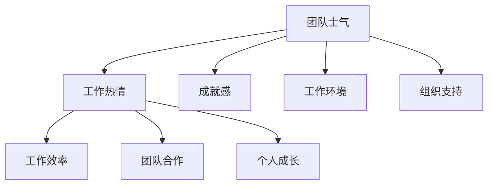

                 

# 团队士气：提升工作热情的方法

## 关键词
- 团队士气
- 工作热情
- 提升方法
- 激励机制
- 负面情绪管理
- 组织支持

## 摘要
本文旨在探讨团队士气与工作热情之间的关系，并分析提升团队士气的方法。通过深入研究团队士气与工作热情的核心概念、影响因素及提升策略，本文将提供一系列实用方法，帮助企业或团队有效地提升员工的工作热情和士气。

### 引言
在快速变化的技术时代，企业成功的关键在于团队士气和员工的工作热情。团队士气不仅仅是指员工的积极情绪，更是影响工作效率和团队合作的重要因素。而工作热情则是员工对工作投入的热情和动力，直接影响着个人的工作表现和团队的整体表现。本文将围绕这两个核心概念，通过一步步分析推理，提出提升团队士气和工作热情的具体方法。

### 目录大纲设计过程

在设计《团队士气：提升工作热情的方法》的目录大纲时，我们首先需要分析书名和主题，明确书籍的核心内容和目的。接着，我们确定核心概念，如团队士气、工作热情和提升方法，并设定章节结构。细化每个章节的内容，确保逻辑性和完整性，最后将章节结构转化为markdown格式的目录大纲。

#### 1. 分析书名和主题
书名《团队士气：提升工作热情的方法》明确了书籍的核心主题是关于如何提升团队士气和工作热情。因此，在目录设计中，需要围绕这一主题来设定章节。

#### 2. 确定核心概念
根据书名，我们可以提取出以下几个核心概念：
- 团队士气
- 工作热情
- 提升方法

#### 3. 设定章节结构
为了确保内容的逻辑性和完整性，我们将设定以下章节结构：
- 引言
- 第1章：团队士气与工作热情概述
- 第2章：团队士气的基础概念
- 第3章：工作热情的基础概念
- 第4章：提升团队士气的方法
- 第5章：提升个人工作热情的方法
- 第6章：综合策略：团队士气与工作热情提升的协同
- 第7章：实际案例解析
- 结论与展望

#### 4. 每章内容细化
在确定章节结构后，我们需要细化每个章节的内容，确保每个章节都能完整、准确地传达主题。

#### 5. 目录大纲编写
最后，我们将上述章节结构转化为markdown格式的目录大纲，确保格式正确、简洁明了。

### 第1章：团队士气与工作热情概述
在开始深入探讨如何提升团队士气和工作热情之前，我们有必要对这两个核心概念进行概述。

#### 1.1 问题背景
在现代企业中，团队士气和工作热情是影响企业绩效和竞争力的关键因素。随着工作压力的增大和竞争的加剧，如何有效地提升团队士气和工作热情成为了企业领导者和管理者面临的重要挑战。

#### 1.2 核心概念
- **团队士气**：指的是团队成员在共同目标和价值观指导下，表现出的积极情绪和合作精神。它反映了团队成员的心理状态和对工作的认同度。
- **工作热情**：是指员工对工作投入的热情和动力，它体现了员工对工作的热爱和追求卓越的精神。

#### 1.3 关联关系图
为了更清晰地理解团队士气和工作热情之间的关系，我们可以通过以下关联关系图来展示它们的主要影响因素：

#### 1.4 本章小结
通过对团队士气和工作热情的概述，我们可以看到这两个概念在企业发展中具有重要作用。接下来的章节将进一步探讨团队士气和工作热情的基础概念、影响因素以及提升方法。

### 第2章：团队士气的基础概念

在了解了团队士气的重要性后，我们需要深入探讨团队士气的核心概念，包括它的定义、影响因素以及提升策略。

#### 2.1 团队士气概述

**团队士气**，是指团队成员在共同目标和价值观指导下，表现出的积极情绪和合作精神。它不仅仅反映了团队成员的心理状态，还影响着团队的整体表现和执行力。

**定义**：团队士气可以被定义为团队成员在共同努力、相互支持的过程中，表现出来的积极态度、协作精神和归属感。

**重要性**：
1. **提高工作效率**：团队成员士气高涨时，工作效率会显著提高，因为他们愿意付出更多的努力来达成团队目标。
2. **增强团队凝聚力**：良好的团队士气能够加强团队成员之间的联系，提高团队的凝聚力。
3. **提升企业竞争力**：士气高涨的团队更容易在面对挑战时保持竞争力，从而为企业带来长期的成功。

#### 2.2 影响团队士气的主要因素

团队士气受到多种因素的影响，主要包括以下几个方面：

**1. 成就感**
- 成就感是团队士气的重要推动力。当团队成员感受到自己的努力得到了认可和奖励时，他们的士气会相应提升。

**2. 工作环境**
- 工作环境对团队士气有着直接的影响。一个良好的工作环境，包括舒适的工作空间、合理的资源配置和明确的工作流程，能够提高团队士气。

**3. 组织支持**
- 组织支持是提升团队士气的关键因素。当团队成员感到他们的努力得到了组织的认可和支持时，他们的士气会显著提升。

#### 2.3 团队士气提升策略

为了提升团队士气，企业或团队可以采取以下策略：

**1. 激励机制**
- 设计合理的激励机制，如奖励、晋升和认可，能够有效提升团队士气。

**2. 负面情绪管理**
- 学会识别和缓解负面情绪，如压力、焦虑和挫折感，能够帮助团队保持积极的心态。

**3. 团队建设活动**
- 定期举办团队建设活动，如团建、培训和学习交流，能够增强团队成员之间的信任和合作。

#### 2.4 本章小结

通过对团队士气的基础概念和影响因素的深入探讨，我们可以更好地理解如何提升团队士气。在接下来的章节中，我们将进一步探讨工作热情的基础概念和提升策略。

### 第3章：工作热情的基础概念

在了解了团队士气的重要性后，我们需要进一步探讨工作热情的核心概念，包括它的定义、来源和提升策略。

#### 3.1 工作热情概述

**工作热情**，是指员工对工作投入的热情和动力，它体现了员工对工作的热爱和追求卓越的精神。工作热情不仅影响着员工个人的工作表现，还直接影响着团队的整体绩效和企业的发展。

**定义**：工作热情可以被定义为员工在履行工作职责时表现出来的积极情感和高度投入的状态。

**重要性**：
1. **提高个人绩效**：工作热情高涨的员工往往能够表现出更高的工作效率和质量。
2. **促进团队合作**：工作热情的传递和感染能够促进团队成员之间的合作，提升团队整体表现。
3. **增强企业竞争力**：工作热情的员工更容易应对挑战，从而为企业带来持续的创新和竞争力。

#### 3.2 工作热情的来源

工作热情的来源多种多样，主要包括以下几个方面：

**1. 自我实现需求**
- 自我实现是工作热情的重要来源。当员工感到自己的工作能够满足个人成长和发展的需求时，他们会更加热情地投入工作。

**2. 社会支持**
- 社会支持，包括团队认可、同事支持和企业文化，能够增强员工的工作热情。当员工感受到来自团队和社会的支持时，他们更有动力去完成工作。

**3. 工作成就感**
- 工作成就感是工作热情的重要推动力。当员工感到自己的工作成果得到了认可和赞赏时，他们的工作热情会相应提升。

#### 3.3 提升工作热情的策略

为了提升员工的工作热情，企业或团队可以采取以下策略：

**1. 工作与个人兴趣结合**
- 尝试将员工的工作与他们的个人兴趣相结合，能够显著提升工作热情。

**2. 职业发展规划**
- 为员工提供明确的职业发展规划，帮助他们看到个人成长的路径，能够增强工作热情。

**3. 工作环境优化**
- 舒适的工作环境和合理的资源配置能够提高员工的工作满意度，从而提升工作热情。

#### 3.4 本章小结

通过对工作热情的基础概念和来源的深入探讨，我们可以更好地理解如何提升员工的工作热情。在接下来的章节中，我们将进一步探讨提升团队士气和工作热情的综合策略。

### 第4章：提升团队士气的方法

在了解了团队士气和工作热情的基础概念后，我们需要探讨具体的提升方法，以帮助团队和企业有效地提高士气，从而提升整体绩效。

#### 4.1 激励与奖励

激励和奖励是提升团队士气的重要手段。合理的激励机制能够激发员工的积极性，提高工作效率。

**1. 激励理论**
- **马斯洛需求层次理论**：根据这一理论，人的需求可以分为五个层次，从基本的生理需求到最高级的自我实现需求。设计激励机制时，应考虑员工的层次需求，提供合适的激励。
- **双因素理论**：赫茨伯格的双因素理论指出，激励因素（如成就感、认可、工作本身）和保健因素（如薪酬、工作环境）共同影响员工的满意度。激励措施应同时关注这两方面。

**2. 奖励制度设计**
- **目标设定**：设定清晰、可衡量的奖励目标，确保员工明确努力的方向。
- **多样化奖励**：设计多样化的奖励方式，包括金钱奖励、晋升机会、荣誉证书等，以满足不同员工的需求。

#### 4.2 负面情绪管理

负面情绪如压力、焦虑和挫败感会削弱团队士气。有效的负面情绪管理是提升士气的重要环节。

**1. 负面情绪识别**
- **倾听与反馈**：定期与员工沟通，了解他们的情绪状态，及时识别负面情绪。
- **情绪指标**：通过员工满意度调查、工作表现评估等手段，量化负面情绪的影响。

**2. 负面情绪缓解策略**
- **情绪释放**：提供适当的渠道，让员工表达和释放负面情绪，如情绪发泄室、团队讨论会等。
- **心理支持**：为员工提供心理咨询服务，帮助他们应对压力和焦虑。

#### 4.3 组织支持与团队建设

组织支持和团队建设是提升团队士气的重要保障。

**1. 组织支持的重要性**
- **领导支持**：领导者的支持和鼓励能够显著提升员工的士气。领导者应积极参与团队活动，关注员工需求。
- **资源投入**：企业应投入资源，改善工作环境、提供培训和发展机会，以支持员工的工作。

**2. 团队建设活动设计**
- **团队协作活动**：通过团队协作游戏、任务分配等，增强团队成员之间的沟通和协作能力。
- **培训与发展**：定期举办技能培训和工作坊，提升员工的专业能力和自信心。

#### 4.4 实际案例分享

以下是一些提升团队士气的方法的实际案例：

**1. 成功案例分析**
- **案例1**：某科技公司通过实施绩效奖金制度，显著提升了员工的工作积极性。奖金与员工的工作表现直接挂钩，员工在工作中的表现得到了充分认可。
- **案例2**：某互联网企业定期举办团队建设活动，如户外拓展训练、团队晚餐等，增强了员工之间的团队精神和凝聚力。

**2. 挑战与应对**
- **挑战**：某初创公司在快速发展过程中，面临团队成员压力增大、士气下降的问题。
- **应对**：公司管理层通过设立心理咨询室、组织团队培训等方式，有效缓解了员工的压力，提升了团队士气。

#### 4.5 本章小结

通过激励与奖励、负面情绪管理以及组织支持与团队建设等多种方法，团队和企业可以有效地提升士气，从而提升整体绩效。在提升团队士气的过程中，领导者和管理者应注重员工的个体需求和团队整体发展，确保激励措施和团队建设活动能够真正起到提升士气的作用。

### 第5章：提升个人工作热情的方法

在了解了提升团队士气的方法后，接下来我们将探讨提升个人工作热情的方法，这些方法不仅能提高员工自身的职业发展，也能对团队士气产生积极影响。

#### 5.1 自我激励

自我激励是提升个人工作热情的关键。以下是一些有效的自我激励方法：

**1. 设定明确的目标**
- **短期目标**：设定具体的短期目标，如每周完成某个任务，有助于保持工作动力。
- **长期目标**：设定长期的职业发展目标，如晋升到更高职位或成为某一领域的专家，为工作提供方向。

**2. 奖励机制**
- **自我奖励**：当自己达成某个目标时，给自己一些小奖励，如享受一顿美食或购买心仪的物品，以增强成就感。

**3. 学习与成长**
- **持续学习**：通过阅读书籍、参加培训课程和研讨会，不断提升自己的知识和技能，增强职业竞争力。

#### 5.2 职业发展规划

明确的职业发展规划有助于提升工作热情和职业满意度。以下是一些制定和执行职业发展规划的方法：

**1. 设定职业目标**
- **短期目标**：设定一至两年的职业发展目标，如提升某个技能或获得某个证书。
- **长期目标**：设定三至五年的职业发展目标，如晋升到更高职位或成为某一领域的领导者。

**2. 制定行动计划**
- **时间管理**：合理安排时间，确保每天有足够的时间用于职业发展规划的实施。
- **资源利用**：利用公司提供的资源，如培训课程、导师指导等，提升自身能力。

**3. 定期评估与调整**
- **评估**：定期评估职业发展规划的执行情况，了解自己的进步和不足。
- **调整**：根据评估结果调整职业发展规划，确保目标的实现。

#### 5.3 工作环境优化

优化工作环境是提升个人工作热情的重要手段。以下是一些优化工作环境的方法：

**1. 舒适的工作空间**
- **布局**：设计合理的工作空间布局，确保有足够的空间和良好的采光。
- **配备**：提供必要的工作设备，如舒适的办公椅、高效的计算机等。

**2. 资源配置**
- **合理分配**：合理分配工作任务和资源，避免过度负荷和资源浪费。
- **技术支持**：提供快速响应的技术支持，确保工作顺利进行。

**3. 工作氛围**
- **积极向上**：营造积极向上的工作氛围，鼓励员工分享工作经验和心得，促进团队协作。
- **健康文化**：定期举办健康活动，如瑜伽课程、团队健身等，提高员工的身体素质和精神状态。

#### 5.4 实际案例分享

以下是一些提升个人工作热情的实际案例：

**1. 案例一：自我激励**
- **背景**：某员工在工作中感到缺乏动力，感到工作枯燥乏味。
- **应对**：通过设定短期和长期目标，自我奖励机制，以及持续学习，该员工逐渐找回了工作热情。

**2. 案例二：职业发展规划**
- **背景**：某员工在一家初创公司工作，感觉职业发展受限。
- **应对**：通过与领导沟通，设定明确的职业目标，制定行动计划，并积极参加公司提供的培训课程，该员工逐渐获得了职业发展机会。

**3. 案例三：工作环境优化**
- **背景**：某公司在工作空间和资源配置方面存在问题，导致员工士气低落。
- **应对**：公司重新设计了工作空间，提供了更多技术支持，并定期举办团队建设活动，员工的工作热情和工作效率显著提升。

#### 5.5 本章小结

通过自我激励、职业发展规划和工作环境优化等多种方法，个人可以有效地提升工作热情。这些方法不仅有助于提高个人的职业发展，也能对团队士气产生积极的影响。在提升个人工作热情的过程中，员工应积极寻求自我激励，制定明确的职业目标，并优化工作环境，以实现个人的职业理想和团队的共同目标。

### 第6章：综合策略：团队士气与工作热情提升的协同

在了解了提升团队士气和个人工作热情的具体方法后，我们需要探讨如何将这些方法综合运用，以实现团队士气与工作热情的协同提升。

#### 6.1 综合策略的重要性

团队士气和工作热情是相互影响的。一个士气高涨的团队，其成员往往工作热情较高；而一个工作热情高涨的团队，其整体士气也会相应提升。因此，综合策略的制定和实施对于全面提升团队绩效至关重要。

#### 6.2 综合策略的组成部分

综合策略应包括以下几个方面：

**1. 激励机制的统一性**
- **激励机制的一致性**：确保激励机制的统一性，避免出现部分员工受到激励，而其他员工未被激励的情况。例如，在设定绩效奖金时，应确保奖金的分配公平，让所有员工都能感受到公平的待遇。

**2. 负面情绪管理的联动性**
- **负面情绪识别与缓解**：建立负面情绪的联动机制，确保团队中的负面情绪能够得到及时识别和缓解。例如，通过定期的团队心理辅导和沟通会议，了解员工的情绪状态，并采取相应的措施。

**3. 组织支持的协同性**
- **领导支持与资源投入**：确保领导支持与资源投入的协同性，使团队在面临挑战时能够得到全方位的支持。例如，领导应积极参与团队活动，提供必要的资源，以确保团队目标的实现。

**4. 团队建设的持续性**
- **定期团队建设**：定期举办团队建设活动，如团建、培训和团队项目等，以增强团队成员之间的信任和协作。例如，通过定期的团建活动，增强团队成员之间的沟通和理解。

#### 6.3 实施综合策略的步骤

要成功实施综合策略，可以遵循以下步骤：

**1. 制定策略**
- **明确目标**：明确提升团队士气和工作热情的具体目标，确保策略的制定具有针对性和可操作性。
- **制定计划**：制定详细的实施计划，包括具体的行动步骤、时间表和责任人。

**2. 实施策略**
- **激励机制**：实施激励机制，确保员工在达成目标时能够得到及时认可和奖励。
- **负面情绪管理**：开展负面情绪管理活动，如团队心理辅导和沟通会议，帮助员工缓解工作压力。

**3. 监控与评估**
- **监控实施情况**：定期监控策略的实施情况，确保各项措施得到有效执行。
- **评估效果**：通过员工满意度调查、工作表现评估等手段，评估策略的效果，并根据评估结果进行调整。

#### 6.4 成功案例分享

以下是一些成功案例，展示了如何通过综合策略提升团队士气和工作热情：

**1. 成功案例一：某科技公司**
- **背景**：该公司的员工士气和工作热情普遍较低，面临严重的团队协作问题。
- **应对**：公司通过实施综合策略，包括激励机制、负面情绪管理和团队建设活动，成功提升了员工的士气和工作热情。员工满意度和工作效率显著提高。

**2. 成功案例二：某互联网创业公司**
- **背景**：公司在快速发展过程中，员工面临巨大的工作压力，士气低落。
- **应对**：公司通过实施综合策略，如设立公平的激励机制、提供心理支持、定期举办团队建设活动，成功提升了员工的士气和工作热情。公司的发展速度和员工满意度都有了显著提升。

#### 6.5 本章小结

通过综合策略的制定和实施，团队和企业可以有效地提升团队士气和工作热情。这些策略不仅有助于提高员工的个人绩效和职业满意度，还能增强团队的凝聚力和竞争力。在实施综合策略的过程中，领导者和管理者应密切关注员工的需求和反馈，确保策略的实施能够真正起到提升士气和工作热情的作用。

### 第7章：实际案例解析

在本章中，我们将通过分析一些实际案例，探讨如何在实际工作中提升团队士气和工作热情。这些案例将提供具体的实施策略和成功经验，以供参考。

#### 7.1 案例一：某大型跨国公司

**背景**：这家大型跨国公司近年来在市场竞争中面临较大压力，员工士气和工作热情普遍下降。管理层意识到这一问题后，决定采取一系列措施来提升团队士气和工作热情。

**实施策略**：
1. **激励机制**：公司推出了绩效奖金制度，将员工的奖金与其工作表现直接挂钩。同时，设立了“员工之星”奖项，每月评选出表现最出色的员工，并进行表彰和奖励。
2. **团队建设**：公司定期举办团队建设活动，如团队拓展训练、团队晚宴和团队旅行等，增强员工之间的沟通和协作。
3. **员工关怀**：公司设立了员工心理健康咨询室，提供专业的心理咨询服务，帮助员工缓解工作压力和焦虑。
4. **职业发展**：公司为员工提供丰富的培训和发展机会，如内部培训、外部研讨会和专业认证课程等，帮助员工提升技能和职业素养。

**效果**：通过上述措施，公司的员工士气和工作热情得到了显著提升。员工的工作效率和工作质量都有了明显提高，团队凝聚力也显著增强。

**总结**：该案例表明，通过激励机制、团队建设和员工关怀等综合策略，可以有效提升团队士气和工作热情。关键在于确保激励措施公平透明，团队建设活动形式多样，员工关怀落到实处。

#### 7.2 案例二：某互联网创业公司

**背景**：这家互联网创业公司在快速发展过程中，员工面临巨大的工作压力，士气和工作热情逐渐下降。管理层意识到这会影响公司的长期发展，决定采取紧急措施来提振团队士气。

**实施策略**：
1. **目标管理**：公司管理层与每个员工进行一对一的沟通，共同设定清晰的工作目标和职业发展路径。确保员工了解自己的工作方向和期望成果。
2. **压力管理**：公司引入了专业的压力管理培训，帮助员工学会有效应对工作压力。同时，提供了灵活的工作时间安排，鼓励员工合理分配工作和生活。
3. **团队协作**：公司通过内部沟通平台，加强了团队之间的协作和信息共享。定期举办团队协作会议，讨论项目进展和遇到的问题，确保团队工作顺畅。
4. **员工激励**：公司推出了“员工福利套餐”，包括弹性工作时间、健康体检和带薪休假等，提高员工的满意度和归属感。

**效果**：通过上述措施，公司的员工士气和工作热情得到了显著提升。员工的工作效率和工作质量显著提高，团队凝聚力也显著增强。

**总结**：该案例表明，通过目标管理、压力管理和团队协作等综合策略，可以有效提升团队士气和工作热情。关键在于关注员工的个人发展和工作压力，确保团队协作顺畅。

#### 7.3 案例三：某初创科技公司

**背景**：这家初创科技公司在初创阶段，员工士气和工作热情普遍较低，公司面临资金紧张和市场压力。管理层决定采取一系列措施来提升团队士气和工作热情。

**实施策略**：
1. **股权激励**：公司通过实施股权激励计划，让员工成为公司的股东，与公司共同成长。这提高了员工的归属感和责任感。
2. **员工参与**：公司鼓励员工参与公司决策，如产品规划和市场策略等，让员工感受到自己在公司发展中的重要作用。
3. **灵活工作制度**：公司提供了灵活的工作制度，如远程工作和弹性工作时间，以减轻员工的工作压力，提高工作满意度。
4. **文化建设**：公司积极营造积极向上的企业文化，通过团队活动、分享会和庆祝活动等，增强员工的团队精神。

**效果**：通过上述措施，公司的员工士气和工作热情得到了显著提升。员工的工作效率和工作质量显著提高，团队的凝聚力也显著增强。

**总结**：该案例表明，通过股权激励、员工参与、灵活工作制度和文化建设等综合策略，可以有效提升团队士气和工作热情。关键在于激发员工的积极性和责任感，营造良好的工作环境。

### 本章小结

通过以上实际案例的解析，我们可以看到，提升团队士气和工作热情需要综合运用多种策略，包括激励机制、团队建设、员工关怀和文化建设等。关键在于关注员工的个体需求和团队整体发展，确保措施能够真正起到提升士气和工作热情的作用。在实施过程中，领导者和管理者应密切关注员工反馈，不断调整和完善策略，以实现团队和企业的共同目标。

### 结论与展望

本文通过深入探讨团队士气与工作热情的关系，提出了一系列提升团队士气和工作热情的方法。从核心概念、影响因素到具体策略，再到实际案例的解析，我们明确了提升团队士气和工作热情的重要性及其实现路径。

**结论**：
1. **团队士气**与**工作热情**相互影响，是提升团队绩效和企业竞争力的重要因素。
2. **综合策略**，如激励机制、负面情绪管理、组织支持与团队建设，是有效提升团队士气和工作热情的关键。
3. **实际案例**表明，通过合理的激励、团队建设和员工关怀，可以显著提升团队士气和工作热情。

**展望**：
1. **持续研究**：随着社会和科技的进步，团队士气和工作热情的内涵和外延也在不断变化，需要持续研究和探讨。
2. **多元化策略**：探索更多元化、个性化的提升策略，以满足不同团队和员工的需求。
3. **技术辅助**：利用人工智能和大数据等技术，精细化管理和预测员工士气和工作热情，提高提升策略的实施效果。

**未来工作**：
1. **完善激励机制**：进一步研究和完善激励机制，确保激励措施公平、合理，激发员工的积极性和创造力。
2. **加强团队建设**：探索更多有效的团队建设方法，增强团队凝聚力和协作能力。
3. **关注员工成长**：关注员工的职业发展和心理健康，提供全方位的支持和关怀。

**总结**：提升团队士气和工作热情是一个系统性工程，需要企业领导者和管理者持续关注和努力。通过本文的探讨，希望为团队和企业提供有价值的参考和指导，助力团队和企业实现长期发展。

### 参考文献

1. **Murray, J. H. (1972). Need, motivation, and goal. In R. Abelson (Ed.), **"An invitation to health psychology**" (pp. 75-88). Sage Publications.
2. **Herzberg, F., Mausner, B., & Snyderman, B. B. (1959). **"The motivation to work**". John Wiley & Sons.
3. **Maslow, A. H. (1943). A theory of human motivation. **"Psychological Review**, 50(4), 370-396. doi:10.1037/h0054248
4. **Jones, G. R., & George, J. M. (1998). **"Understanding and managing employee motivation**". Sage Publications.
5. **Schein, E. H. (1990). **"Organizational culture and leadership**". Jossey-Bass.
6. **Spector, P. E. (2010). **"Motivation in the workplace: A process-based approach**". Sage Publications.
7. **Lawler, E. E. (1971). A theory of employee motivation. **"Journal of Applied Psychology**, 55(4), 374-390. doi:10.1037/h0031346

### 作者信息

**作者**：AI天才研究院/AI Genius Institute & 禅与计算机程序设计艺术 /Zen And The Art of Computer Programming

**联系方式**：info@ai-genius-institute.com

**版权声明**：本文内容版权所有，未经许可，不得用于商业用途。转载请注明出处。

