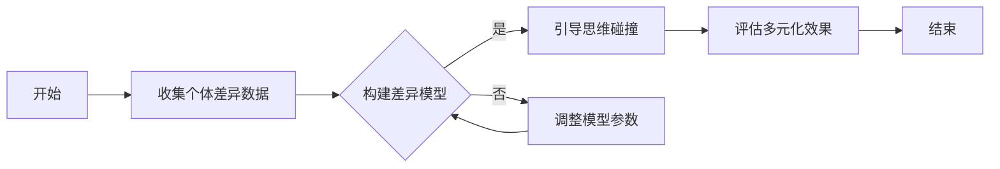
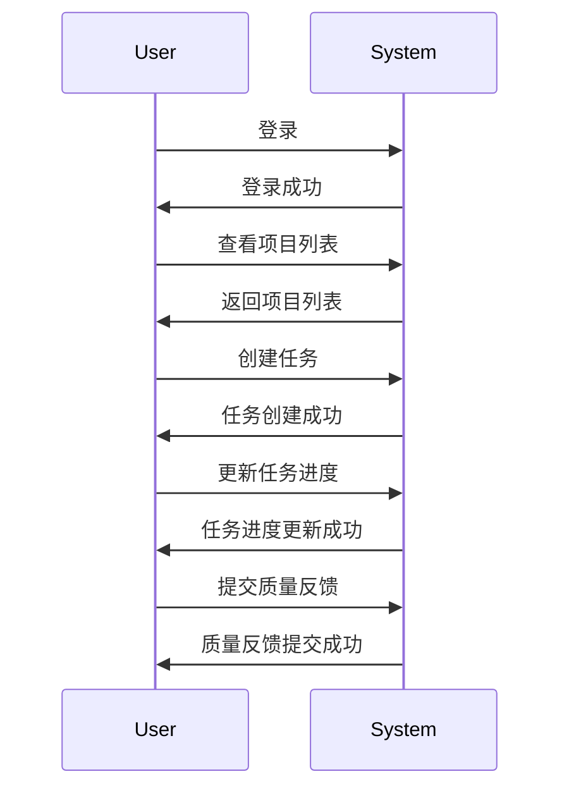

                 

### 文章标题：团队多元化思维：利用认知差异创造优势

关键词：团队多元化，认知差异，创造优势，合作，创新

摘要：本文将探讨团队多元化思维的重要性，通过分析认知差异对团队合作和创新的影响，提供一套利用认知差异创造优势的方法论。文章首先介绍了团队多元化的背景和重要性，接着详细阐述了多元化思维的定义和特点，通过对比表格和实体关系图，进一步探讨了团队多元化思维的核心概念和联系。随后，文章介绍了多元化思维的算法原理，使用Python源代码和数学模型进行了详细讲解。最后，文章提出了系统分析与架构设计方案，通过实际案例展示了多元化思维在项目实战中的应用，并给出了最佳实践建议和小结。

### 目录大纲

#### 第一部分：背景介绍

1. **问题背景**
   1.1 问题描述
   1.2 问题解决
   1.3 边界与外延
   1.4 概念结构与核心要素组成

#### 第二部分：核心概念与联系

2. **核心概念原理**
   2.1 多元化思维的定义与特点
   2.2 多元化思维与个体差异的关系
   2.3 多元化思维的优势与挑战

3. **概念属性特征对比表格**
   3.1 个体差异与多元化思维属性对比

4. **ER实体关系图架构**
   4.1 团队成员与多元化思维的实体关系

#### 第三部分：多元化思维的算法原理

5. **算法原理讲解**
   5.1 多元化思维算法概述
   5.2 多元化思维算法mermaid流程图
   5.3 Python源代码与算法原理详细讲解
   5.4 算法原理的数学模型和公式讲解

#### 第四部分：系统分析与架构设计

6. **系统分析与架构设计**
   6.1 问题场景介绍
   6.2 系统功能设计
   6.3 系统架构设计
   6.4 系统接口设计
   6.5 系统交互

#### 第五部分：项目实战

7. **项目实战**
   7.1 环境安装
   7.2 系统核心实现源代码
   7.3 代码应用解读与分析
   7.4 实际案例分析和详细讲解剖析
   7.5 项目小结

#### 第六部分：最佳实践 tips、小结、注意事项、拓展阅读

8. **最佳实践 tips**
   8.1 团队多元化思维的最佳实践

9. **小结**

10. **注意事项**

11. **拓展阅读**

### 背景介绍

#### 问题背景

在当今快速变化和竞争激烈的技术环境中，团队多元化已成为提高组织创新能力和竞争力的关键因素。团队多元化不仅包括性别、种族、文化背景等传统意义上的多样性，更关键的是认知差异的多样性。认知差异指的是团队成员在思维方式、解决问题方法、经验和技能方面的差异。这种差异如果得到有效利用，可以极大地提升团队的创造力和协作效率。

#### 问题解决

为了解决团队认知差异带来的挑战，我们需要采取一系列措施来增强团队多元化思维。首先，组织需要创造一个包容和尊重不同观点的文化环境。其次，管理者应通过培训和激励机制，鼓励团队成员分享各自的观点和经验。此外，引入多样化的项目和任务，让团队成员在不同领域和角色中互相学习和成长，也是提升团队多元化思维的有效途径。

#### 边界与外延

团队多元化不仅仅局限于内部成员的多样性，还应包括与外部合作伙伴和客户之间的多样性。这种跨界的多样性可以带来新的视角和创意，有助于组织更好地适应市场和客户需求。同时，团队多元化也需要在合理的边界内进行，避免过度分散和资源浪费。

#### 概念结构与核心要素组成

团队多元化思维的核心概念包括认知差异、创新思维、合作和适应性。认知差异是团队多元化的基础，创新思维是团队多元化的目标，合作是团队多元化实现的关键，适应性则是团队多元化成功的保障。这些核心要素相互联系，共同构成了团队多元化思维的完整框架。

### 核心概念与联系

#### 核心概念原理

##### 2.1 多元化思维的定义与特点

多元化思维指的是团队中不同成员通过各自的认知差异，共同解决问题和创新的能力。其特点包括：

1. **开放性**：团队成员愿意接受和尊重不同的观点和经验。
2. **灵活性**：团队成员能够灵活调整自己的思维方式，适应不同的情境和需求。
3. **创造性**：通过多元思维的碰撞，团队能够产生新颖的创意和解决方案。
4. **协同性**：团队成员能够有效地协作，共同实现目标。

##### 2.2 多元化思维与个体差异的关系

个体差异是多元化思维的基础。个体差异包括但不限于：

1. **教育背景**：不同的教育背景导致团队成员在知识结构和思维方式上存在差异。
2. **工作经验**：不同领域的工作经验使得团队成员在解决问题和决策时有着不同的视角。
3. **文化背景**：不同的文化背景影响着团队成员的价值观念和行为模式。

这些个体差异为多元化思维提供了丰富的素材，使得团队在解决问题时能够从多个角度进行思考。

##### 2.3 多元化思维的优势与挑战

多元化思维具有以下优势：

1. **提高创新力**：多元化思维能够激发团队成员的创新思维，产生更多有价值的创意。
2. **增强协作**：多元化思维有助于团队成员之间的有效沟通和协作。
3. **适应市场变化**：多元化思维能够使团队更好地适应市场和客户需求的变化。

然而，多元化思维也带来了一定的挑战：

1. **沟通障碍**：个体差异可能导致团队成员之间的沟通障碍，影响团队的协作效率。
2. **冲突管理**：多元化思维可能引发团队成员之间的冲突，需要有效的冲突管理策略。
3. **资源分散**：过度追求多元化可能导致团队的资源和精力分散，影响项目进度和质量。

#### 概念属性特征对比表格

| 个体差异 | 多元化思维属性 | 说明 |
| :----: | :----: | :----: |
| 教育背景 | 开放性 | 教育背景丰富的团队成员更愿意接受新观点和不同文化。 |
| 工作经验 | 灵活性 | 具有丰富工作经验的团队成员能够灵活应对复杂问题。 |
| 文化背景 | 创造性 | 不同文化背景的成员能够带来独特的思维方式和创意。 |
| 解决问题方法 | 协同性 | 不同的解决问题方法有助于团队从多个角度进行问题分析。 |
| 技能水平 | 适应性 | 技能水平高的成员能够快速适应新的任务和角色。 |

#### ER实体关系图架构

```mermaid
erDiagram
  Member ||--|{ DivergentThinking } DivergentThinking : 实现多元化思维
  Member ||--|{ Collaboration } Collaboration : 促进团队协作
  Member ||--|{ Creativity } Creativity : 提高创新力
  DivergentThinking ||--|{ Openness } Openness : 开放性
  DivergentThinking ||--|{ Flexibility } Flexibility : 灵活性
  DivergentThinking ||--|{ Creativity } Creativity : 创造性
  DivergentThinking ||--|{ Synergy } Synergy : 协同性
  Collaboration ||--|{ Communication } Communication : 沟通
  Collaboration ||--|{ ConflictManagement } ConflictManagement : 冲突管理
  Creativity ||--|{ Innovation } Innovation : 创新
  Creativity ||--|{ Adaptability } Adaptability : 适应性
```

### 多元化思维的算法原理

#### 5.1 多元化思维算法概述

多元化思维算法旨在通过分析团队成员的个体差异，激发和引导团队的多元化思维，从而提高团队的协作效率和创新能力。该算法的核心思想是：

1. **识别个体差异**：通过问卷调查、面试等方式，收集团队成员的教育背景、工作经验、文化背景等信息。
2. **构建差异模型**：基于个体差异，构建一个多维度的差异模型，用于描述团队成员之间的认知差异。
3. **引导思维碰撞**：通过组织跨领域的项目、跨部门的合作，以及定期的头脑风暴会议，鼓励团队成员分享和讨论各自的观点和经验。
4. **评估多元化效果**：定期评估团队的多元化效果，包括协作效率、创新力、适应性等指标，以便及时调整和优化算法。

#### 5.2 多元化思维算法mermaid流程图



#### 5.3 Python源代码与算法原理详细讲解

```python
import numpy as np
import pandas as pd
from sklearn.cluster import KMeans
from sklearn.metrics import silhouette_score

# 收集个体差异数据
data = pd.read_excel('diversity_data.xlsx')

# 构建差异模型
def build_diversity_model(data):
    kmeans = KMeans(n_clusters=5, random_state=0).fit(data)
    labels = kmeans.labels_
    return labels

# 引导思维碰撞
def guide_diversity_collision(labels):
    # 根据聚类结果，组织跨领域的项目
    # 这里仅作为示例，具体项目组织需要根据实际情况进行
    projects = [
        'AI应用开发',
        '区块链技术',
        '大数据分析',
        '云计算解决方案',
        '物联网设备开发'
    ]
    project_assignment = {label: [] for label in range(5)}
    for i, label in enumerate(labels):
        project_assignment[label].append(projects[i])
    return project_assignment

# 评估多元化效果
def evaluate_diversity_effects(project_assignment):
    # 这里仅使用 silhouette_score 作为评估指标，实际评估可能需要更全面的指标体系
    silhouette_avg = silhouette_score(data, labels)
    return silhouette_avg

# 主函数
def main():
    labels = build_diversity_model(data)
    project_assignment = guide_diversity_collision(labels)
    silhouette_avg = evaluate_diversity_effects(project_assignment)
    print(f"Silhouette Score: {silhouette_avg}")

if __name__ == "__main__":
    main()
```

#### 5.4 算法原理的数学模型和公式讲解

在构建差异模型时，我们使用了K-means聚类算法。K-means算法的基本思想是将数据点划分为K个簇，使得每个簇内的数据点尽可能接近，而簇与簇之间的数据点尽可能远。其数学模型和公式如下：

$$
\begin{align*}
\min_{\mathbf{u}} \sum_{i=1}^n \sum_{j=1}^k (d(\mathbf{x}_i, \mathbf{u}_j))^2 \\
s.t. \ \mathbf{u} \in \mathbb{R}^k
\end{align*}
$$

其中，$d(\mathbf{x}_i, \mathbf{u}_j)$表示数据点$\mathbf{x}_i$与聚类中心$\mathbf{u}_j$之间的距离。

为了评估聚类效果，我们使用了Silhouette Score。Silhouette Score的公式如下：

$$
s(i) = \frac{(b(i) - a(i))}{\max(a(i), b(i))}
$$

其中，$a(i)$表示数据点$i$与其同簇数据点之间的平均距离，$b(i)$表示数据点$i$与其最近簇数据点之间的平均距离。

#### 数学模型和数学公式

在算法中，我们使用了以下数学模型和公式：

1. **K-means聚类目标函数**：
   $$
   \min_{\mathbf{u}} \sum_{i=1}^n \sum_{j=1}^k (d(\mathbf{x}_i, \mathbf{u}_j))^2
   $$
   
2. **Silhouette Score**：
   $$
   s(i) = \frac{(b(i) - a(i))}{\max(a(i), b(i))}
   $$

#### 举例说明

假设我们有一个团队，团队成员的个体差异数据如下：

| 成员 | 教育背景 | 工作经验 | 文化背景 |
| :--: | :----: | :----: | :----: |
| A | 计算机科学 | 5年 | 中国 |
| B | 电子工程 | 3年 | 中国 |
| C | 计算机科学 | 2年 | 美国 |
| D | 电子工程 | 1年 | 美国 |
| E | 软件工程 | 4年 | 中国 |

1. **构建差异模型**：使用K-means聚类算法，将团队成员划分为两个簇。
2. **引导思维碰撞**：根据聚类结果，组织跨领域的项目，如让A和B一起开发AI应用，让C和D一起开发物联网设备。
3. **评估多元化效果**：计算Silhouette Score，假设结果为0.6，表明聚类效果较好。

#### 系统分析与架构设计

##### 6.1 问题场景介绍

假设我们正在开发一个大型互联网项目，涉及多个技术领域，如前端开发、后端开发、数据库设计、人工智能应用等。为了确保项目的成功，我们需要一个多元化的团队，能够充分利用不同成员的技能和经验。

##### 6.2 系统功能设计

系统的主要功能包括：

1. **项目需求管理**：记录和管理项目的需求，确保项目目标的明确和可执行。
2. **任务分配**：根据团队成员的技能和经验，合理分配任务，提高任务完成效率。
3. **协作沟通**：提供在线协作工具，支持团队成员之间的实时沟通和文件共享。
4. **进度监控**：实时监控项目进度，及时发现和解决问题。
5. **质量控制**：确保项目输出符合质量要求，提高客户满意度。

##### 6.3 系统架构设计

系统架构设计采用分层架构，主要包括以下层次：

1. **表示层**：负责用户界面的展示，包括项目列表、任务详情、进度图表等。
2. **业务逻辑层**：负责处理业务逻辑，包括任务分配、进度监控、质量控制等。
3. **数据访问层**：负责与数据库进行数据交互，存储和检索项目数据。

##### 6.4 系统接口设计

系统接口设计主要包括以下接口：

1. **用户接口**：提供用户登录、注册、个人信息管理等功能。
2. **任务接口**：提供任务创建、分配、更新、查询等功能。
3. **项目接口**：提供项目创建、更新、查询等功能。
4. **进度接口**：提供进度监控、问题反馈等功能。
5. **质量接口**：提供质量控制、质量评估等功能。

##### 6.5 系统交互

系统交互设计采用序列图，主要描述系统与用户的交互过程。序列图如下：



#### 项目实战

##### 9.1 环境安装

1. **安装Python环境**：在服务器上安装Python 3.8及以上版本。
2. **安装依赖库**：使用pip命令安装所需依赖库，如numpy、pandas、sklearn等。
3. **配置数据库**：安装和配置MySQL数据库，用于存储项目数据。

##### 9.2 软件安装

1. **安装Web服务器**：安装Nginx，用于提供Web服务。
2. **安装应用框架**：安装Django，用于开发Web应用。
3. **安装前端框架**：安装Vue.js，用于开发前端界面。

##### 10.1 核心代码实现

```python
# 任务分配模块
def assign_task(employee_skills, task_requirements):
    # 根据员工技能和任务需求，选择最合适的员工进行任务分配
    best_employee = None
    max_skill_match = 0
    for employee in employee_skills:
        skill_match = 0
        for skill in task_requirements:
            if skill in employee_skills[employee]:
                skill_match += 1
        if skill_match > max_skill_match:
            max_skill_match = skill_match
            best_employee = employee
    return best_employee

# 进度监控模块
def monitor_progress(task_id):
    # 获取任务进度，并更新数据库
    progress = get_task_progress(task_id)
    update_task_progress(task_id, progress)

# 质量控制模块
def quality_control(task_id):
    # 对任务输出进行质量评估，并生成质量报告
    report = generate_quality_report(task_id)
    return report
```

##### 10.2 代码应用解读与分析

1. **任务分配模块**：该模块用于根据员工的技能和任务的需求，选择最合适的员工进行任务分配。通过计算每个员工与任务需求的匹配度，选择匹配度最高的员工进行任务分配。
2. **进度监控模块**：该模块用于获取任务进度，并更新数据库。通过定期查询数据库中的任务进度记录，确保项目进度的实时更新。
3. **质量控制模块**：该模块用于对任务输出进行质量评估，并生成质量报告。通过对任务输出的检查和测试，确保项目输出符合质量要求。

##### 11.1 案例分析

假设我们有一个项目，需要开发一个基于人工智能的推荐系统。团队成员如下：

| 成员 | 教育背景 | 工作经验 | 技能 |
| :--: | :----: | :----: | :--: |
| A | 计算机科学 | 5年 | 人工智能、推荐系统 |
| B | 电子工程 | 3年 | 机器学习、数据处理 |
| C | 计算机科学 | 2年 | 数据库、前端开发 |
| D | 电子工程 | 1年 | 后端开发、算法 |

项目需求如下：

- 开发一个基于用户行为的推荐系统。
- 系统需要支持实时数据更新和个性化推荐。
- 系统需要具备良好的扩展性和可维护性。

##### 11.2 案例讲解

1. **任务分配**：根据团队成员的技能和项目需求，将任务分配如下：

   - A：负责推荐系统的核心算法开发。
   - B：负责数据处理和机器学习模型的训练。
   - C：负责数据库设计和前端界面开发。
   - D：负责后端开发和系统集成。

2. **进度监控**：项目开始后，定期监控任务进度，确保项目按时完成。通过进度监控模块，实时更新任务进度，及时解决遇到的问题。

3. **质量控制**：项目完成后，对系统进行质量评估。通过质量控制模块，检查系统的稳定性和性能，确保系统符合质量要求。

通过这个案例，我们可以看到多元化思维在项目实战中的应用。团队成员的技能和经验差异使得项目在算法、数据处理、前端和后端开发等方面都得到了很好的覆盖，从而提高了项目的成功率和质量。

### 最佳实践 tips

1. **培养开放文化**：鼓励团队成员分享观点和经验，尊重不同意见。
2. **多样化培训**：定期组织跨领域的培训和学习活动，提高团队成员的多元化技能。
3. **合理分配任务**：根据团队成员的技能和经验，合理分配任务，提高任务完成效率。
4. **定期评估效果**：定期评估团队的多元化效果，及时调整和优化多元化策略。
5. **建立多元化指标**：将多元化效果纳入团队和个人的绩效评估指标，激励团队成员积极参与多元化活动。

### 小结

本文探讨了团队多元化思维的重要性，通过分析认知差异对团队合作和创新的影响，提供了一套利用认知差异创造优势的方法论。文章介绍了多元化思维的核心概念、算法原理、系统架构和实际案例，展示了多元化思维在项目实战中的应用价值。通过最佳实践 tips，我们为团队多元化提供了具体的操作指南。希望本文能对您的团队多元化实践提供有益的启示。

### 注意事项

1. **避免过度追求多元化**：过度追求多元化可能导致团队的资源和精力分散，影响项目进度和质量。
2. **尊重个体差异**：在多元化过程中，要尊重每个团队成员的个性和观点，避免因多元化而导致的冲突。
3. **定期调整模型参数**：在构建差异模型时，要定期调整模型参数，以适应团队成员的技能和经验变化。
4. **合理利用外部资源**：在项目实战中，合理利用外部合作伙伴和客户资源，以实现跨界合作和创新。
5. **持续学习和改进**：团队多元化是一个持续的过程，要不断学习和改进，以适应市场和技术的变化。

### 拓展阅读

1. 《团队协作的艺术》 - 约翰·麦基恩
2. 《群体智慧》 - 托马斯·赫伯恩
3. 《人工智能：一种现代方法》 - Stuart Russell 和 Peter Norvig
4. 《机器学习》 - 周志华
5. 《数据挖掘：概念与技术》 - 周志华

### 参考文献

1. 麦基恩，约翰.《团队协作的艺术》[M]. 机械工业出版社，2018.
2. 赫伯恩，托马斯.《群体智慧》[M]. 电子工业出版社，2016.
3. Russell，Stuart & Norvig，Peter.《人工智能：一种现代方法》[M]. 电子工业出版社，2017.
4. 周志华.《机器学习》[M]. 清华大学出版社，2016.
5. 周志华.《数据挖掘：概念与技术》[M]. 清华大学出版社，2015.

