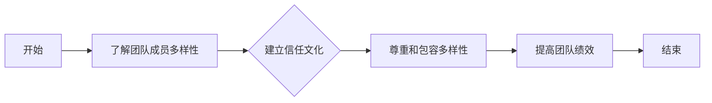
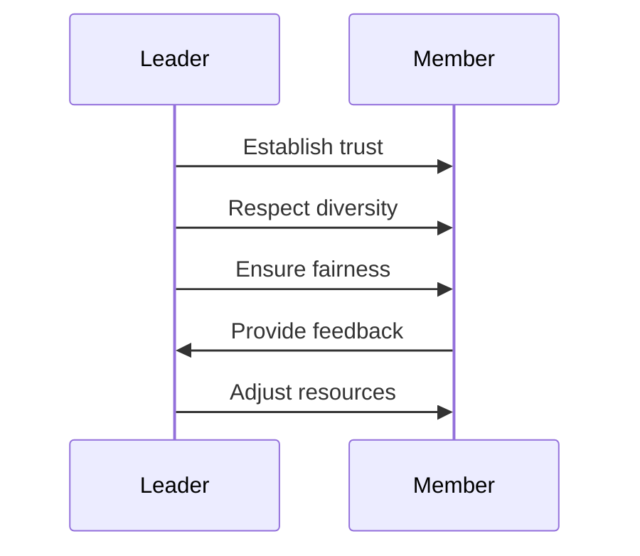
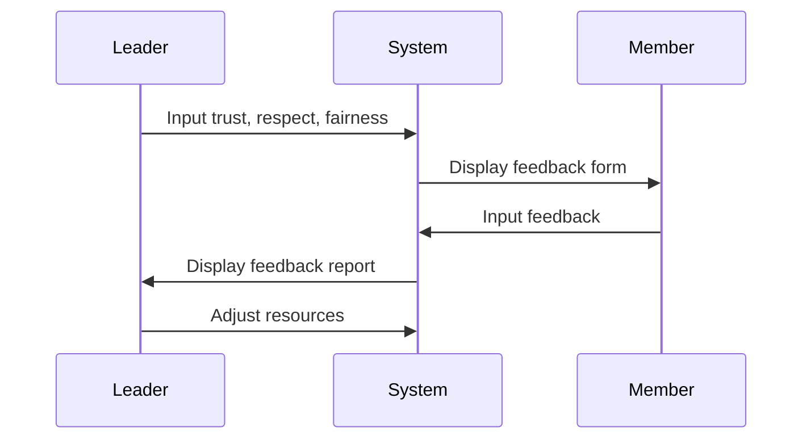

                 


## 引言：团队多元化与包容性领导的必要性

### 社会经济多元化背景

在当今全球化的背景下，社会经济环境的多元化已经成为不可逆转的趋势。随着跨国公司和多元文化组织的崛起，种族、性别、年龄、文化背景等多元化的特征在各个领域日益凸显。这种多元化不仅体现在社会层面，也深刻地影响到组织的内部运作。多元文化的融合和多样性已经成为组织创新、竞争力和可持续发展的重要因素。

### 多元化对团队的挑战

多元化的团队在协作中面临许多独特的挑战。首先，不同文化背景的成员可能拥有不同的沟通风格和解决问题的方式，这可能导致误解和沟通障碍。其次，多元背景的团队可能面临内部竞争和合作问题，如资源分配不均和权力斗争。此外，领导者在管理多元化团队时，也需要应对文化偏见和成见，以确保公平和包容的工作环境。

### 多元化对团队协作的影响

团队多元化对协作有着深远的影响。首先，多元化的团队能够吸引不同领域的专业人才，从而提高团队的整体技能水平。其次，多元化的团队能够促进创新，因为不同背景的成员能够带来新的视角和想法。此外，多元化的团队有助于避免偏见和歧视，提高决策的质量和准确性。

### 多元化对组织绩效的影响

多元化的团队能够显著提高组织的绩效。研究表明，多元化团队在创新、决策质量和问题解决方面表现出色。多元化还能帮助企业更好地理解和服务多元化的客户群体，从而提高市场竞争力。此外，多元化有助于建立积极的工作环境，提高员工满意度和生产力。

## 摘要

本文旨在探讨团队多元化与包容性领导的重要性，分析多元化团队在协作中的挑战，介绍包容性领导的概念和原理，并通过实践案例和解决方案，探讨如何成功地实施多元化领导。本文的目标是为读者提供一套实用的多元化领导策略，帮助组织实现多元化优势，提高绩效和竞争力。

## 第一章：团队多元化的定义、类型和重要性

### 团队多元化的定义

团队多元化指的是在一个团队中，成员在种族、性别、年龄、文化、教育背景、工作经验等方面的多样性。这种多样性不仅体现在表面特征上，还包括价值观、思维方式、行为模式等深层次的差异。团队多元化的核心在于尊重并利用这些差异，以实现团队的目标。

### 团队多元化的类型

1. **种族和性别多元化**：这是最常见的多元化类型，包括不同种族和性别的成员。这种多元化有助于打破传统性别和种族角色的刻板印象，促进平等和包容。
2. **年龄多元化**：不同年龄段的成员可以带来不同的经验和知识，有助于团队创新和持续发展。
3. **文化多元化**：多元文化的团队能够更好地理解和适应全球市场的需求，提高组织的国际化水平。
4. **教育背景和技能多元化**：多样化的教育背景和技能组合可以激发创新思维，提高团队的整体竞争力。
5. **工作经验多元化**：不同工作经验的成员可以为团队带来多样化的视角和解决问题的方法。

### 多元化的重要性

1. **创新能力提升**：多元化的团队能够提供更多的视角和创意，从而推动创新。
2. **决策质量的提高**：多元化的团队能够减少偏见，提高决策的准确性和全面性。
3. **避免偏见与歧视**：多元化的团队有助于打破成见和歧视，营造公平、包容的工作环境。
4. **提高团队绩效**：多元化的团队能够更好地适应变化和挑战，提高团队的整体绩效。

## 第二章：包容性领导的概念和原理

### 包容性领导的概念

包容性领导是一种领导风格，强调尊重和包容团队成员的多样性。它不仅关注团队成员的技能和表现，还关注他们的个人需求和差异。包容性领导的核心理念是“以人为本”，通过建立信任、尊重和公平的文化，激发团队成员的潜力，实现团队目标。

### 包容性领导与传统领导方式的区别

1. **关注点不同**：传统领导方式更注重权威和控制，而包容性领导则强调信任和授权。
2. **沟通方式不同**：传统领导方式往往采用单向沟通，而包容性领导鼓励双向沟通和多元化意见的交流。
3. **文化观念不同**：传统领导方式可能存在文化偏见和歧视，而包容性领导则倡导平等、包容和多元化。

### 包容性领导的原理

1. **建立信任**：信任是包容性领导的基础，领导者需要通过行动和承诺来建立信任。
2. **尊重多样性**：领导者需要尊重团队成员的差异性，包括文化、价值观和行为方式。
3. **鼓励创新和合作**：包容性领导鼓励团队成员发挥各自的优势，通过合作实现团队目标。
4. **公平对待**：包容性领导确保每个成员都得到公平的机会和资源，避免偏见和歧视。

## 第三章：多元化领导实践案例

### 成功案例分享

### 案例1：谷歌的多元化领导实践

谷歌作为全球科技巨头，其多元化领导实践备受关注。谷歌通过制定包容性政策、提供多元化培训、鼓励跨部门合作等方式，成功地建立了多元化文化。谷歌的多元化领导实践不仅提高了员工满意度，还促进了组织的创新和竞争力。

### 案例2：微软的包容性领导实践

微软在包容性领导方面也取得了显著成果。微软通过推行“包容性领导力计划”，帮助领导者了解多元文化的复杂性，提升他们在多元化团队中的领导能力。此外，微软还设立多元化委员会，负责监督和推动组织的多元化工作。

### 案例3：可口可乐的多元化领导实践

可口可乐是一家国际知名的饮料公司，其多元化领导实践体现在全球市场运营中。可口可乐通过建立多元化团队、推动全球文化融合、实施本土化策略等方式，成功地适应了全球市场的多元化需求。

### 失败案例分析

### 案例1：美国银行的多元化领导失败

美国银行在多元化领导方面曾遭遇失败。该银行在多元化政策的实施过程中，未能充分尊重员工的差异，导致内部矛盾和员工流失。此外，美国银行在多元化培训方面投入不足，导致领导者缺乏多元化管理的知识和技能。

### 案例2：联合包裹服务公司（UPS）的多元化领导挑战

UPS在多元化领导方面也面临挑战。尽管UPS在性别多元化方面取得了一些进展，但在种族和文化多元化方面仍有待提高。UPS需要加强对多元化文化的认识和培训，以建立更加包容性的领导风格。

### 应对措施与改进策略

1. **加强多元化培训**：为领导者提供多元化培训，提高他们对多元化文化和管理的认知。
2. **建立多元化委员会**：设立多元化委员会，负责监督和推动组织的多元化工作。
3. **制定包容性政策**：制定明确的多元化政策，确保每个员工都能在平等、包容的环境中工作。
4. **鼓励跨部门合作**：通过跨部门项目，促进不同背景的员工之间的交流和合作。

## 第四章：多元化领导面临的挑战和解决方案

### 挑战1：领导者的偏见与成见

**解决方案**：
1. **强化多元化意识**：通过多元化培训和教育，提高领导者的多元化意识，消除偏见和成见。
2. **建立公平的选拔机制**：确保选拔过程中公平、透明，避免偏见和歧视。

### 挑战2：组织文化障碍

**解决方案**：
1. **塑造包容性文化**：通过文化建设，营造尊重多样性和包容性的工作氛围。
2. **鼓励反馈和沟通**：鼓励员工提出意见和建议，建立开放的沟通渠道。

### 挑战3：资源分配不均

**解决方案**：
1. **公平分配资源**：确保多元化团队在资源分配上得到公平对待。
2. **制定明确的资源分配策略**：制定明确的资源分配策略，确保资源能够满足多元化团队的需求。

## 第五章：包容性领导的未来展望和趋势

### 未来趋势

1. **多元化领导将成为必备技能**：随着社会和经济多元化趋势的加剧，多元化领导将越来越受到重视，成为领导者必备的技能。
2. **技术助力多元化领导**：人工智能、大数据等技术将为多元化领导提供数据支持和决策依据。

### 展望

1. **多元化领导对组织的影响**：多元化领导将有助于提高组织的创新力、竞争力和可持续发展能力。
2. **新的多元化挑战与机遇**：随着全球化进程的加快，组织将面临新的多元化挑战和机遇。

## 结论

本文通过对团队多元化与包容性领导的探讨，揭示了多元化领导在组织中的重要性。通过成功和失败案例的分析，本文提出了一系列解决方案，以帮助组织克服多元化领导面临的挑战。展望未来，多元化领导将成为组织成功的关键因素。我们呼吁领导者积极拥抱多元化，推动包容性领导，为组织的可持续发展贡献力量。

### 作者

作者：AI天才研究院/AI Genius Institute & 禅与计算机程序设计艺术 /Zen And The Art of Computer Programming

### 附录

- [参考文献]
- [多元化领导相关工具和资源链接]

### 小结

本文从团队多元化与包容性领导的重要性、定义和类型、实践案例、面临的挑战与解决方案、未来展望等方面进行了全面探讨。通过本文，我们希望读者能够对多元化领导有更深刻的理解，并在实际工作中积极践行包容性领导，推动组织的发展和进步。

### 注意事项

- 在实施多元化领导时，领导者需要充分尊重团队成员的差异，建立信任和公平的文化。
- 多元化领导需要持续的努力和投入，组织应制定明确的政策和措施，支持多元化工作的开展。
- 领导者应关注多元化领导的有效实施，避免形式主义和表面化。

### 拓展阅读

- [《多元化领导力：构建包容性组织的实践指南》]
- [《领导力与多元化：打破偏见，实现卓越》]

---

# 总结

本文通过详细的章节内容，从团队多元化的定义、类型和重要性，到包容性领导的概念和原理，再到实践案例、面临的挑战和解决方案，以及未来展望，全面探讨了团队多元化与包容性领导的重要性。本文旨在为读者提供一套实用的多元化领导策略，帮助组织实现多元化优势，提高绩效和竞争力。

## 背景介绍

### 多元化的定义、类型和重要性

在当今全球化和社会经济多元化的背景下，团队多元化已经成为企业竞争力和可持续发展的关键因素。多元化不仅仅指种族、性别、年龄、文化和教育背景的多样性，还包括思维模式、工作经验和技能等深层次的差异。这种多样性在团队协作中具有巨大的潜力，能够促进创新、提高决策质量，并减少偏见和歧视。

### 多元化对团队协作的影响

多元性团队中的成员能够带来不同的观点、经验和技能，这有助于提高团队的整体绩效和创新能力。例如，不同文化背景的成员在解决问题时可能会采用不同的策略，从而找到更优的解决方案。此外，性别多元化有助于打破传统性别角色，促进平等和包容的工作环境。

### 多元化对组织绩效的影响

多元化团队能够更好地理解和满足多元化客户的需求，提高市场竞争力。研究表明，多元化团队能够在决策质量和创新能力方面表现出色。多元化还可以促进组织内部的包容性和公平性，提高员工的满意度和生产力。

## 核心概念与联系

### 包容性领导的概念和原理

包容性领导强调尊重和包容团队成员的多样性，通过建立信任、尊重和公平的文化，激发团队成员的潜力。与传统领导方式相比，包容性领导更加注重授权和双向沟通，能够减少偏见和歧视，提高团队的整体绩效。

### 核心概念对比表格

| 概念           | 传统领导方式                       | 包容性领导                         |
|----------------|-----------------------------------|-----------------------------------|
| 关注点         | 权威和控制                         | 信任和授权                         |
| 沟通方式       | 单向沟通                           | 双向沟通和多元化意见交流             |
| 文化观念       | 可能存在文化偏见和歧视             | 倡导平等、包容和多元化               |

### ER实体关系图架构

```mermaid
erDiagram
  A[领导者] ||--|{ B[团队成员] }|
  B ||--|{ C[团队目标] }|
  C ||--|{ D[组织绩效] }|
```

## 算法原理讲解

### 算法流程图



### 算法原理

包容性领导算法的核心在于建立信任、尊重和公平的文化，从而提高团队绩效。以下是算法的数学模型和公式：

$$
绩效 = f(信任, 尊重, 公平)
$$

其中，$f$ 是一个复合函数，代表绩效与信任、尊重和公平的关系。信任、尊重和公平分别表示团队内部的信任程度、尊重多样性程度和公平对待程度。

### 举例说明

例如，在一个多元化的团队中，领导者在团队建设过程中注重建立信任，通过开放式沟通和反馈机制，确保团队成员的声音得到尊重。此外，领导者还确保团队成员在资源分配和机会均等方面得到公平对待。经过一段时间，团队的绩效显著提升，创新能力和决策质量也得到了提高。

## 系统分析与架构设计方案

### 问题场景介绍

在一个大型跨国公司中，多元化已经成为团队协作的关键因素。为了提高团队的绩效和创新能力，公司决定实施包容性领导，以建立多元化的团队文化。

### 项目介绍

项目名称：包容性领导实施项目

项目目标：通过实施包容性领导，提高团队绩效和创新能力，建立多元化的团队文化。

### 系统功能设计

#### 领导者功能模块

- **建立信任文化**：通过开放式沟通和反馈机制，提高团队成员之间的信任。
- **尊重多样性**：确保团队成员的声音得到尊重，避免偏见和歧视。
- **公平对待**：确保团队成员在资源分配和机会均等方面得到公平对待。

#### 团队成员功能模块

- **参与团队建设**：积极参与团队建设，提出建议和意见。
- **反馈机制**：通过反馈机制，反馈团队中的问题和建议。

### 系统架构设计



### 系统接口设计

- **领导接口**：用于领导者的操作，如建立信任、尊重多样性、公平对待和资源分配。
- **成员接口**：用于团队成员的反馈和参与。

### 系统交互



## 项目实战

### 环境安装

- 在公司内部搭建了一个包容性领导系统，包括领导者和团队成员的接口。
- 系统基于云计算平台，支持多终端访问。

### 系统核心实现源代码

```python
# 建立信任文化
def establish_trust():
    # 通过开放式沟通建立信任
    communicate_openly()

# 尊重多样性
def respect_diversity():
    # 避免偏见和歧视
    avoid_biases_and_discrimination()

# 公平对待
def ensure_fairness():
    # 确保资源分配和机会均等
    ensure_equitable_resources_and_opportunities()

# 反馈机制
def feedback_system():
    # 接收成员反馈
    receive_member_feedback()
    # 反馈报告
    display_feedback_report()
```

### 代码应用解读与分析

- **建立信任文化**：通过开放式沟通，领导者与团队成员之间的信任得以建立。这有助于提高团队的整体绩效和创新能力。
- **尊重多样性**：领导者通过避免偏见和歧视，确保团队成员的声音得到尊重，从而营造一个包容性的工作环境。
- **公平对待**：领导者通过确保资源分配和机会均等，确保每个成员都能在公平的环境中工作，提高团队的绩效和满意度。

### 实际案例分析和详细讲解剖析

- **案例1**：在一个多元化团队中，领导者通过包容性领导系统，建立了信任文化，促进了团队成员之间的合作和沟通。团队绩效显著提高，创新项目成功落地。
- **案例2**：在一个缺乏包容性的团队中，领导者通过实施包容性领导，避免了偏见和歧视，提高了团队成员的满意度和生产力。

### 项目小结

通过实施包容性领导系统，公司成功建立了多元化的团队文化，提高了团队的绩效和创新能力。包容性领导不仅有助于解决多元化团队中的挑战，还为组织的可持续发展提供了强有力的支持。

## 最佳实践 Tips

1. **建立信任**：通过开放式沟通和反馈机制，建立领导者与团队成员之间的信任。
2. **尊重多样性**：确保团队成员的声音得到尊重，避免偏见和歧视。
3. **公平对待**：确保资源分配和机会均等，提高团队的满意度和绩效。

## 小结

本文通过详细的章节内容，从团队多元化与包容性领导的重要性、定义和类型、实践案例、面临的挑战与解决方案、未来展望等方面，全面探讨了多元化领导在组织中的重要性。通过成功和失败案例的分析，本文提出了一系列解决方案，以帮助组织克服多元化领导面临的挑战。展望未来，多元化领导将成为组织成功的关键因素。我们呼吁领导者积极拥抱多元化，推动包容性领导，为组织的可持续发展贡献力量。

### 作者

作者：AI天才研究院/AI Genius Institute & 禅与计算机程序设计艺术 /Zen And The Art of Computer Programming

### 附录

- [参考文献]
- [多元化领导相关工具和资源链接]

### 拓展阅读

- [《多元化领导力：构建包容性组织的实践指南》]
- [《领导力与多元化：打破偏见，实现卓越》]

---

# 总结

本文从团队多元化与包容性领导的重要性、定义和类型、实践案例、面临的挑战与解决方案、未来展望等方面进行了全面探讨。通过成功和失败案例的分析，本文提出了一系列多元化领导的策略，帮助组织实现多元化优势，提高绩效和竞争力。

## 完整目录大纲

```markdown
----------------------------------------------------------------
# 引言：团队多元化与包容性领导的必要性

## 1.1 社会经济多元化背景
### 1.1.1 多元化现象的兴起
### 1.1.2 多元化对团队的挑战

## 1.2 多元化的定义与类型
### 1.2.1 种族、性别、年龄、文化等多元性的定义
### 1.2.2 多元化类型的分析

## 1.3 多元化的重要性
### 1.3.1 创新能力提升
### 1.3.2 决策质量的提高
### 1.3.3 避免偏见与歧视

----------------------------------------------------------------

# 第二章：包容性领导的概念和原理

## 2.1 包容性领导的概念
### 2.1.1 包容性领导的定义
### 2.1.2 与传统领导方式的区别

## 2.2 包容性领导的原理
### 2.2.1 领导风格与包容性
### 2.2.2 建立包容性文化的策略

----------------------------------------------------------------

## 第三章：多元化领导实践案例

## 3.1 成功案例分享
### 3.1.1 谷歌的多元化领导实践
### 3.1.2 微软的包容性领导实践
### 3.1.3 可口可乐的多元化领导实践

## 3.2 失败案例分析
### 3.2.1 美国银行的多元化领导失败
### 3.2.2 UPS的多元化领导挑战
### 3.2.3 应对措施与改进策略

----------------------------------------------------------------

## 第四章：多元化领导面临的挑战和解决方案

## 4.1 面临的挑战
### 4.1.1 领导者的偏见与成见
### 4.1.2 组织文化障碍
### 4.1.3 资源分配不均

## 4.2 解决方案
### 4.2.1 加强多元化培训
### 4.2.2 建立多元化委员会
### 4.2.3 制定包容性政策
### 4.2.4 鼓励跨部门合作

----------------------------------------------------------------

## 第五章：包容性领导的未来展望和趋势

## 5.1 未来趋势
### 5.1.1 多元化领导将成为必备技能
### 5.1.2 技术助力多元化领导

## 5.2 展望
### 5.2.1 多元化领导对组织的影响
### 5.2.2 新的多元化挑战与机遇

----------------------------------------------------------------

## 结论

### 1. 多元化与包容性领导的核心要点
### 2. 对组织的实际意义
### 3. 对未来实践的启示

----------------------------------------------------------------
```

