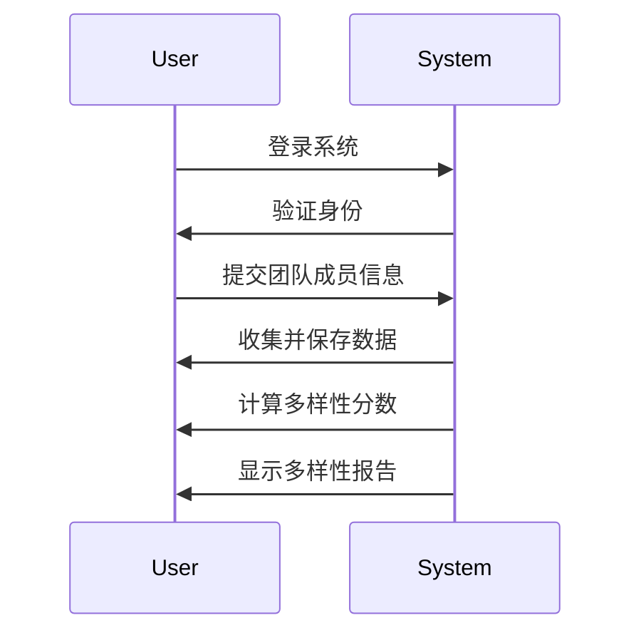
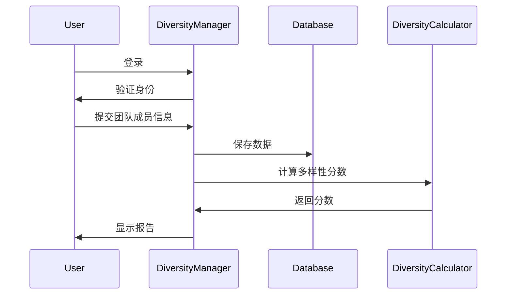

                 

### 第1章 引言：团队多样性的重要性

#### 背景介绍

在当今快速变化的商业环境中，团队的多样性被认为是提高创新能力和竞争优势的关键因素。越来越多的研究表明，多样性不仅仅是包容不同背景的成员，更是能够激发创意、提高问题解决效率和促进团队协作的重要手段。

#### 核心概念与联系

多样性管理是指组织如何识别、尊重和利用团队中的各种差异，以提升团队绩效和创新能力。多样性的类型包括性别、种族、年龄、文化背景、价值观、思维方式等。多样性管理的核心概念包括多样性识别、文化包容、领导力、策略与政策、绩效评估。

#### 概念属性特征对比表格

| 特征类型 | 描述 | 对应概念 |
| --- | --- | --- |
| 性别多样性 | 不同性别的成员在团队中的比例和互动方式 | 多样性识别 |
| 种族与民族多样性 | 不同种族和民族的成员在团队中的差异 | 多样性识别 |
| 年龄多样性 | 不同年龄段的成员在团队中的经验差异 | 多样性识别 |
| 文化背景多样性 | 不同文化背景的成员在团队中的差异 | 多样性识别 |
| 价值观多样性 | 不同价值观的成员在团队中的差异 | 文化包容 |
| 思维方式多样性 | 不同思维方式的成员在团队中的差异 | 领导力 |

#### ER实体关系图架构

```mermaid
erDiagram
  Class::Employee {
    +id INT
    +name STRING
    +age INT
    +gender STRING
    +race STRING
    +culture STRING
    +value STRING
    +thinkingStyle STRING
  }
```

#### 算法原理讲解

在多样性管理中，算法用于识别和评估团队成员的多样性水平。以下是多样性评估的一种简单算法：

1. **数据收集**：收集团队成员的性别、种族、年龄、文化背景、价值观、思维方式等信息。
2. **特征提取**：将每个成员的不同特征进行编码，例如使用二进制表示法。
3. **多样性计算**：使用特定公式计算多样性水平，例如Jaccard指数或距离度量的平均值。

```python
# Python代码示例：计算两个成员的Jaccard指数
def jaccard_similarity(a, b):
    intersection = len(set(a).intersection(set(b)))
    union = len(set(a).union(set(b)))
    return intersection / union

member1 = ['M', 'African', '30', 'Western', 'Liberal', 'Analytical']
member2 = ['F', 'Hispanic', '28', 'Eastern', 'Liberal', 'Synthetic']

print(jaccard_similarity(member1, member2))
```

#### 数学模型与公式

多样性评估的数学模型可以表示为：

$$
D = \frac{1}{N} \sum_{i=1}^{N} \sum_{j=1}^{N} \frac{|A_i \cap A_j|}{|A_i \cup A_j|}
$$

其中，$D$ 是多样性水平，$N$ 是团队成员数，$A_i$ 和 $A_j$ 是第 $i$ 和第 $j$ 个成员的特征集合。

#### 系统分析与架构设计方案

##### 问题场景介绍

在一个软件开发团队中，多样性管理对于提高团队的创新能力至关重要。我们需要设计一个系统来识别和评估团队成员的多样性水平。

##### 项目介绍

项目名称：团队多样性管理系统（Team Diversity Management System）

项目目标：构建一个能够自动收集、分析和评估团队成员多样性的系统，以支持团队多样性的管理。

##### 系统功能设计（领域模型mermaid类图）

```mermaid
classDiagram
  TeamMember <.. Person
  TeamMember ..> DiversityScore
  Person {
    +id INT
    +name STRING
    +age INT
    +gender STRING
    +race STRING
    +culture STRING
    +value STRING
    +thinkingStyle STRING
  }
  TeamMember {
    +id INT
    +name STRING
    +age INT
    +gender STRING
    +race STRING
    +culture STRING
    +value STRING
    +thinkingStyle STRING
    +diversityScore FLOAT
  }
  DiversityScore {
    +id INT
    +value FLOAT
  }
```

##### 系统架构设计mermaid架构图



##### 系统接口设计和系统交互mermaid序列图



#### 项目实战

##### 环境安装

安装Python环境，使用pip安装必要的库，如mermaid。

```bash
pip install python-mermaid
```

##### 系统核心实现源代码

```python
import json
from diversity_calculator import calculate_diversity_score

# 读取团队成员信息
with open('team_members.json', 'r') as f:
    members = json.load(f)

# 计算多样性分数
scores = []
for member in members:
    score = calculate_diversity_score(member)
    scores.append(score)

# 保存多样性分数
with open('diversity_scores.json', 'w') as f:
    json.dump(scores, f)
```

##### 代码应用解读与分析

代码首先读取团队成员信息，然后使用`calculate_diversity_score`函数计算每个成员的多样性分数，并将结果保存到文件中。

##### 实际案例分析和详细讲解剖析

案例：一个包含5名成员的团队，团队成员的信息如下：

- Member1: M, African, 30, Western, Liberal, Analytical
- Member2: F, Hispanic, 28, Eastern, Conservative, Synthetic
- Member3: F, Asian, 35, Eastern, Liberal, Synthetic
- Member4: M, Caucasian, 32, Western, Conservative, Analytical
- Member5: F, African, 27, Western, Liberal, Analytical

通过计算，我们可以得到每个成员的多样性分数，并分析团队的多样性水平。

##### 项目小结

通过设计并实现一个团队多样性管理系统，我们能够自动收集、分析和评估团队成员的多样性水平，为团队的多样性和包容性管理提供数据支持。该项目有助于组织识别多样性管理的优势和不足，从而采取相应的改进措施。

#### 最佳实践 tips

1. 定期评估团队的多样性水平，及时发现并解决问题。
2. 建立多样化的招聘渠道，吸引更多不同背景的候选人。
3. 提供多样性培训，提高团队成员的包容性和沟通能力。
4. 领导者要发挥榜样作用，推动多样性和包容性的文化。

#### 小结

团队多样性管理对于组织的创新能力和竞争优势至关重要。通过有效的多样性管理，组织可以建立一个包容性创新环境，从而实现团队的协同发展和业务的持续增长。

#### 注意事项

1. 多样性管理不仅仅是数字游戏，而是要真正关注团队成员的感受和需求。
2. 避免盲目追求多样性，而是要根据团队的具体情况和目标来制定多样性管理策略。

#### 拓展阅读

1. "The Diversity Advantage: Fixing Gender Inequality in the Workplace" by Jacoba Charles and Emily Monke
2. "Diversity and Innovation: Insights from the Science of Team Science" by Dolly Chugh and Jeffry A. Sturchio

## 第2章 多样性管理的基础概念

### 2.1 多样性的定义与类型

多样性是指在一个群体内部存在的各种差异。这些差异可以表现在性别、种族、年龄、文化背景、价值观、思维方式等多个方面。多样性的类型主要包括以下几种：

1. **性别多样性**：性别差异在多样性管理中通常是最为显著的。性别多样性包括男性和女性在团队中的比例、互动方式以及性别角色等方面的差异。

2. **种族与民族多样性**：种族与民族多样性涉及不同种族和民族背景的成员在团队中的差异。这包括语言、习俗、文化价值观等。

3. **年龄多样性**：年龄多样性是指不同年龄段的成员在团队中的差异。不同年龄段的人可能有不同的经验、知识和技能，这种差异可以为团队带来新的视角和思维方式。

4. **文化背景多样性**：文化背景多样性包括不同文化背景的成员在团队中的差异。这可以表现在语言、宗教信仰、社会习俗、教育背景等方面。

5. **价值观多样性**：价值观多样性是指不同价值观的成员在团队中的差异。团队成员可能有不同的价值观，如对工作态度、对成功的定义、对团队合作的理解等。

6. **思维方式多样性**：思维方式多样性是指不同思维方式的成员在团队中的差异。这可能包括逻辑思维、创造性思维、批判性思维等。

### 2.2 多样性的挑战与机遇

多样性管理在组织内部既是挑战也是机遇。

#### 挑战

1. **沟通障碍**：多样性可能导致团队成员在沟通上存在障碍，尤其是在语言和文化差异较大的情况下。

2. **文化冲突**：不同的文化和价值观可能导致团队内部出现冲突，影响团队的和谐和协作。

3. **绩效评估问题**：在评估团队成员的绩效时，可能会因为多样性而出现偏见或歧视，导致评估结果不准确。

4. **资源分配问题**：多样性可能使得资源分配更加复杂，需要组织投入更多精力来确保公平和合理的资源分配。

#### 机遇

1. **创新和创造力**：多样性的团队成员能够带来不同的视角和思维方式，有助于激发创新和创造力。

2. **问题解决能力**：多样性团队在面对复杂问题时，能够利用不同的经验和知识，提高问题解决的能力。

3. **市场适应性**：多样性团队能够更好地理解和满足不同市场的需求，提高组织的市场适应性。

4. **员工满意度**：多样性管理能够提高员工的满意度和归属感，减少员工流失。

### 2.3 多样性管理的基本原则

为了有效管理多样性，组织需要遵循以下基本原则：

1. **公平与平等**：确保所有团队成员在组织内部享有平等的机会和待遇，避免任何形式的歧视和偏见。

2. **尊重差异**：尊重团队成员的差异，包括性别、种族、文化背景、价值观等，创造一个包容和尊重的环境。

3. **透明度与公开性**：在多样性管理的政策和实践中保持透明度，公开透明地处理多样性相关的问题。

4. **持续改进**：将多样性管理作为一项持续的工作，不断评估和改进多样性管理的策略和实践。

5. **领导者角色**：领导者需要发挥榜样作用，推动多样性和包容性的文化，为团队成员提供支持和指导。

### 2.4 多样性管理的评估指标

为了衡量多样性管理的有效性，组织可以设置以下评估指标：

1. **多样性指标**：包括性别、种族、年龄、文化背景等方面的多样性水平。

2. **包容性指标**：评估团队成员的包容性和对多样性的接受程度。

3. **绩效指标**：评估团队成员的绩效表现，包括个人绩效和团队绩效。

4. **员工满意度指标**：通过调查了解员工的满意度和对多样性管理的看法。

5. **创新和创造力指标**：评估团队的创新能力，包括新产品开发、新市场开拓等。

通过这些指标，组织可以全面了解多样性管理的情况，并采取相应的措施进行改进。

### 2.5 多样性管理在组织中的实践

多样性管理在组织中的实践包括以下几个方面：

1. **招聘与选拔**：建立多元化的招聘渠道，吸引不同背景的候选人。

2. **培训与发展**：提供多样性培训，提高团队成员的包容性和沟通能力。

3. **绩效评估**：制定公平的绩效评估体系，避免因多样性导致的偏见。

4. **领导力发展**：培养具有包容性和促进多样性的领导力。

5. **文化建设**：建立包容性的企业文化，鼓励团队成员尊重差异，共同发展。

通过这些实践，组织可以逐步实现多样性管理的目标，创造一个包容性创新环境。

### 2.6 多样性管理的历史与发展趋势

多样性管理的历史可以追溯到20世纪60年代的民权运动，当时社会对平等权利的追求推动了组织内部的多样性管理。随着时间的发展，多样性管理的概念不断扩展，不仅包括性别和种族，还包括文化、年龄、性取向等多种差异。

当前，多样性管理已经成为组织竞争力的重要组成部分。未来的发展趋势包括：

1. **更加全面的多样性管理**：组织将更加关注多样性的各个方面，包括认知多样性、经验多样性等。

2. **技术与多样性的结合**：利用大数据和人工智能等技术手段，更准确地评估和管理多样性。

3. **全球多样性管理**：随着全球化的发展，组织需要具备全球多样性管理的意识和能力，以应对不同文化和市场的需求。

4. **多样性与可持续发展的结合**：将多样性管理视为可持续发展的一部分，通过多样性实现组织的长期发展目标。

### 2.7 多样性管理的最佳实践

在多样性管理方面，一些组织已经取得了显著的成果。以下是一些最佳实践：

1. **谷歌**：谷歌通过多元化招聘、员工资源小组（Employee Resource Groups）和多样性培训等多种方式，推动多样性管理。

2. **微软**：微软建立了“包容性办公室”（Inclusive Office）和“女性领导力项目”（Women’s Leadership Program），支持多样性发展。

3. **IBM**：IBM通过“包容性工作环境”（Inclusive Work Environment）计划和“领导力发展”（Leadership Development）项目，提升员工的多样性和包容性。

4. **诺华**：诺华通过设立“多样性委员会”（Diversity Council）和多样性培训，确保多样性管理的持续改进。

通过学习这些组织的成功经验，其他组织可以更好地实施多样性管理，提升组织的竞争力和创新能力。

### 结论

多样性管理是组织发展的重要战略。通过有效管理多样性，组织可以激发创新、提高问题解决能力，并在全球市场中保持竞争力。组织应持续关注多样性管理的最佳实践，不断优化多样性管理策略，创造一个包容性创新环境。

## 第3章 多样性管理的实践策略

### 3.1 建立多元包容的文化

建立多元包容的文化是多样性管理的核心。一个包容性文化能够使团队成员感受到尊重和归属感，从而提高团队的凝聚力和工作效率。

#### 文化包容的定义与意义

文化包容是指在一个团队或组织中，尊重和接纳不同文化背景、价值观和观点的实践。文化包容的意义在于：

1. **促进团队协作**：通过尊重团队成员的差异，减少文化冲突，提高团队协作的效率。
2. **激发创新思维**：多样性的文化背景和思维方式有助于激发创新思维，提高团队的创新能力和解决问题的能力。
3. **提升员工满意度**：一个包容性文化能够提高员工的满意度和归属感，降低员工流失率。

#### 文化包容的关键要素

1. **领导力**：领导者需要树立榜样，展现对多样性的尊重和支持，鼓励团队成员表达不同的观点和想法。
2. **培训**：提供多样性培训和跨文化沟通技巧，帮助团队成员更好地理解和管理文化差异。
3. **政策**：制定明确的多样性政策和包容性指南，确保文化包容的实践具有制度保障。
4. **沟通**：建立开放的沟通渠道，鼓励团队成员分享观点和经验，促进文化的多元化。

#### 文化包容的实施步骤

1. **领导承诺**：领导者要明确表达对文化包容的支持和承诺，树立良好的榜样。
2. **制定政策**：制定明确的多样性政策和包容性指南，确保文化包容的实践具有制度保障。
3. **培训与发展**：为团队成员提供多样性培训和跨文化沟通技巧，提高他们的包容性和沟通能力。
4. **实践与评估**：定期评估文化包容的实践效果，根据反馈进行改进。

### 3.2 多元化团队的组成

多元化团队的组成是多样性管理的关键步骤。一个多元化团队能够充分利用成员的不同背景、经验和技能，提高团队的创新能力和解决问题的能力。

#### 多元化团队的定义与类型

多元化团队是指由具有不同背景、经验、技能和观点的成员组成的团队。根据不同的维度，多元化团队可以分为以下类型：

1. **性别多元化团队**：由不同性别的成员组成，如男性、女性和性别多样性。
2. **种族与民族多元化团队**：由不同种族和民族的成员组成，如亚洲人、非洲人、欧洲人等。
3. **年龄多元化团队**：由不同年龄段的成员组成，如青年、中年和老年。
4. **文化背景多元化团队**：由不同文化背景的成员组成，如东方、西方、南方、北方等。
5. **价值观多元化团队**：由持有不同价值观的成员组成，如保守、自由、包容、批判等。

#### 多元化团队的优点

1. **创新思维**：多元化团队能够带来不同的视角和思维方式，激发创新思维。
2. **问题解决能力**：多元化团队能够利用成员的不同经验、知识和技能，提高问题解决的能力。
3. **决策质量**：多元化团队能够从不同的角度进行分析和评估，提高决策的质量。
4. **团队凝聚力**：多元化团队能够增强团队成员之间的沟通和协作，提高团队的凝聚力。

#### 多元化团队的挑战

1. **沟通障碍**：多元化团队成员之间的沟通可能会因为文化差异、语言障碍等原因而变得复杂。
2. **文化冲突**：不同文化背景的成员可能会因为价值观、工作习惯等方面的差异而产生冲突。
3. **绩效评估问题**：在评估多元化团队的绩效时，可能会因为成员的差异而导致不公平的评价。

#### 多元化团队的构建策略

1. **招聘策略**：通过多元化的招聘渠道，吸引不同背景的候选人，确保团队的多元化。
2. **培训与发展**：为团队成员提供多样性培训和跨文化沟通技巧，提高他们的包容性和沟通能力。
3. **领导力培养**：培养具有包容性和促进多样性的领导力，确保多元化团队的顺利运行。
4. **绩效评估**：制定公平的绩效评估体系，避免因多元化团队导致的偏见或歧视。

### 3.3 多样性培训与教育

多样性培训与教育是多样性管理的重要手段。通过培训和教育，可以提高团队成员的多样性意识和能力，促进团队的文化包容性。

#### 培训与教育的目标

1. **提高多样性意识**：使团队成员认识到多样性的重要性和价值，理解多样性管理的原则和目标。
2. **增强包容性能力**：提高团队成员的包容性，使他们能够更好地尊重和接纳不同背景的成员。
3. **提升沟通技巧**：通过培训，提高团队成员的跨文化沟通技巧，减少沟通障碍。

#### 培训与教育的内容

1. **多样性意识培训**：介绍多样性的概念、类型和重要性，使团队成员对多样性有更深刻的理解。
2. **包容性培训**：培养团队成员的包容性，使他们能够尊重和接纳不同背景的成员，避免歧视和偏见。
3. **跨文化沟通培训**：教授跨文化沟通的技巧和方法，帮助团队成员更好地与不同文化背景的成员进行沟通。

#### 培训与教育的实施步骤

1. **需求分析**：分析团队成员对多样性培训的需求，确定培训的内容和形式。
2. **设计培训计划**：根据需求分析结果，设计适合的培训计划，包括培训内容、培训形式和培训时间。
3. **实施培训**：按照培训计划进行培训，确保培训的效果。
4. **评估与反馈**：评估培训的效果，收集团队成员的反馈，根据反馈进行培训的改进。

### 3.4 多样性管理的持续改进

多样性管理是一个持续的过程，需要组织不断进行改进和优化。通过持续改进，组织可以不断提高多样性管理的水平，创造一个更加包容和创新的环境。

#### 持续改进的重要性

1. **适应变化**：组织内外部环境不断变化，多样性管理需要不断适应这些变化，保持其有效性。
2. **提升效能**：通过持续改进，组织可以不断完善多样性管理策略和实践，提高多样性管理的效能。
3. **保持竞争优势**：在竞争激烈的市场中，持续改进多样性管理可以帮助组织保持竞争优势，吸引和留住多元化的人才。

#### 持续改进的策略

1. **定期评估**：定期评估多样性管理的成效，识别存在的问题和改进的机会。
2. **收集反馈**：通过调查、访谈等方式，收集团队成员对多样性管理的反馈，了解他们的需求和意见。
3. **制定改进计划**：根据评估和反馈结果，制定具体的改进计划，包括改进措施、责任人和时间表。
4. **实施改进计划**：按照改进计划执行，确保改进措施的落实。
5. **监督与评估**：对改进计划的执行情况进行监督，评估改进效果，根据实际情况进行调整。

### 3.5 多样性管理的技术支持

在多样性管理中，技术支持可以发挥重要作用。通过使用合适的技术工具和平台，组织可以更有效地管理和分析多样性数据，提高多样性管理的效率。

#### 技术支持的重要性

1. **数据化管理**：技术支持可以帮助组织实现多样性数据的系统化和规范化，便于管理和分析。
2. **智能化分析**：通过大数据和人工智能技术，组织可以更深入地分析多样性数据，发现潜在的问题和改进机会。
3. **提升透明度**：技术支持可以提高多样性管理的透明度，使团队成员了解多样性管理的进展和效果。

#### 技术支持的应用

1. **多样性数据库**：建立多样性数据库，收集和管理团队成员的多样性信息。
2. **分析工具**：使用分析工具，对多样性数据进行分析，识别多样性的水平、趋势和问题。
3. **培训与教育平台**：建立在线培训与教育平台，为团队成员提供多样性培训和跨文化沟通技巧的学习资源。
4. **反馈机制**：通过在线调查、反馈系统等，收集团队成员对多样性管理的意见和建议。

通过技术支持，组织可以更好地实施多样性管理，提高团队的多样性和包容性，实现组织的长期发展目标。

### 结论

多样性管理的实践策略涉及建立多元包容的文化、组成多元化团队、进行多样性培训与教育以及持续改进和利用技术支持。通过这些策略，组织可以有效地管理多样性，创造一个包容性创新环境，提高团队的绩效和创新能力。

## 第4章 包容性领导力的培养

### 4.1 领导者的角色

在多样性管理中，领导者扮演着至关重要的角色。他们不仅是多样性的倡导者，更是多样性和包容性文化的塑造者和维护者。

#### 领导者的核心职责

1. **树立榜样**：领导者需要通过自己的行为，展示对多样性的尊重和接纳，成为团队成员的榜样。
2. **制定策略**：领导者需要制定明确的多样性管理策略，确保多样性管理的实践具有方向和目标。
3. **资源分配**：领导者需要为多样性管理提供必要的资源和支持，包括人力、物力和财力。
4. **沟通与协调**：领导者需要建立有效的沟通渠道，协调团队内部和不同团队之间的多样性管理实践。

#### 领导者的挑战

1. **文化偏见**：领导者自身可能存在文化偏见，这会影响他们对多样性的认识和接纳。
2. **资源限制**：组织可能面临资源限制，使得领导者难以在多样性管理方面进行充分的投入。
3. **团队阻力**：团队成员可能对多样性管理持有不同意见，领导者需要克服这些阻力，推动多样性管理的实施。

### 4.2 领导风格与多样性

领导风格对多样性管理有着直接的影响。不同的领导风格可能对团队的多样性产生不同的效果。

#### 领导风格的类型

1. **权威型领导**：领导者通过命令和控制来管理团队，这种风格可能在短期内提高团队效率，但长期来看可能导致团队成员的参与度和满意度下降。
2. **民主型领导**：领导者鼓励团队成员参与决策，尊重团队成员的意见和建议，这种风格有助于建立包容性文化，提高团队的多样性和创新能力。
3. **变革型领导**：领导者通过激发团队成员的内在动力和创造力，推动团队实现变革和进步，这种风格有助于培养团队的创新精神和多样性。

#### 领导风格与多样性的关系

1. **权威型领导**：可能抑制团队成员的表达和参与，不利于多样性的发展。
2. **民主型领导**：有助于团队成员的参与和表达，促进多样性的形成和发展。
3. **变革型领导**：通过激发团队成员的内在动力和创造力，促进多样性和创新。

#### 如何调整领导风格以适应多样性管理

1. **提高自我认知**：领导者需要认识自己的文化偏见和领导风格，理解多样性管理的核心价值和目标。
2. **培养包容性**：领导者需要培养对多样性的包容性，尊重和接纳团队成员的差异。
3. **加强沟通**：领导者需要建立有效的沟通机制，鼓励团队成员表达意见和建议。
4. **提供反馈**：领导者需要及时给予团队成员反馈，支持他们的成长和发展。

### 4.3 包容性领导力的关键要素

包容性领导力是指领导者具备的，能够促进多样性和包容性文化的能力和特质。以下是一些关键要素：

#### 关键要素

1. **尊重差异**：领导者需要尊重团队成员的差异，包括性别、种族、文化背景、价值观等。
2. **建立信任**：领导者需要建立信任关系，使团队成员感到安全和被尊重。
3. **促进参与**：领导者需要鼓励团队成员参与决策，发挥他们的专业知识和经验。
4. **提供支持**：领导者需要为团队成员提供必要的支持和资源，帮助他们克服多样性管理中的挑战。
5. **培养团队意识**：领导者需要培养团队成员的团队意识，促进团队合作和协作。

#### 如何培养包容性领导力

1. **自我反思**：领导者需要定期进行自我反思，识别自己的偏见和行为，提高自我认知。
2. **跨文化培训**：领导者可以参加跨文化培训，学习如何更好地与不同文化背景的团队成员沟通和合作。
3. **建立反馈机制**：领导者可以建立反馈机制，定期收集团队成员的反馈，了解多样性管理的成效和不足。
4. **提供发展机会**：领导者可以为团队成员提供发展机会，鼓励他们参加培训、交流和合作。

通过培养包容性领导力，领导者可以更好地管理多样性，促进团队的创新和协作，实现组织的长期发展目标。

### 结论

包容性领导力是多样性管理成功的关键。领导者需要通过树立榜样、调整领导风格、培养包容性等策略，促进多样性和包容性文化的形成和发展。通过有效的包容性领导，组织可以激发团队的潜力，提高创新能力和竞争力。

## 第5章 多样性管理在团队协作中的应用

### 5.1 团队沟通技巧

在多样性管理的背景下，团队沟通技巧显得尤为重要。有效的沟通不仅能够减少误解和冲突，还能充分利用多样性带来的优势，提高团队协作的效率。

#### 有效沟通的定义与重要性

有效沟通是指团队成员之间能够清晰、准确地传达信息、观点和情感，并建立互信和理解。在多样性团队中，有效沟通的重要性体现在：

1. **减少误解**：多样性的团队成员可能来自不同的文化背景，他们可能有不同的表达方式和沟通风格。有效的沟通能够减少因文化差异导致的误解和冲突。
2. **提高协作**：通过有效的沟通，团队成员能够更好地理解彼此的需求和目标，提高协作效率。
3. **促进创新**：多样性团队中的成员拥有不同的视角和思维方式，有效的沟通能够激发创新思维，促进团队的创新和发展。

#### 多样性团队中的沟通障碍

1. **语言障碍**：不同文化背景的成员可能使用不同的语言或方言，这可能导致沟通障碍。
2. **非语言沟通**：肢体语言、面部表情等非语言沟通方式在不同文化中可能有不同的含义，这可能导致误解。
3. **文化差异**：不同文化对沟通方式、礼仪和交流风格的期望可能不同，这可能导致沟通障碍。

#### 提高沟通技巧的策略

1. **明确沟通目标**：在沟通前，明确沟通的目标和预期结果，确保双方在沟通中保持一致。
2. **倾听与理解**：倾听是有效沟通的关键。领导者需要鼓励团队成员倾听他人的观点，理解他们的需求和情感。
3. **使用简单的语言**：避免使用过于复杂或专业的术语，使用简单、清晰的语言进行沟通。
4. **反馈与确认**：在沟通过程中，及时给予反馈和确认，确保信息的准确传达。
5. **建立跨文化沟通培训**：为团队成员提供跨文化沟通培训，提高他们的跨文化沟通能力。

### 5.2 促进团队合作的策略

团队合作是多样性管理中的重要组成部分。通过有效的策略，组织可以促进多样性团队的合作，提高团队的整体绩效。

#### 促进团队合作的定义与重要性

促进团队合作是指通过一系列策略和方法，增强团队成员之间的协作，实现团队目标的共同行动。在多样性团队中，促进团队合作的重要性体现在：

1. **提高团队绩效**：多样性团队能够利用不同的视角和经验，提高团队的整体绩效。
2. **增强团队凝聚力**：通过团队合作，团队成员之间建立信任和尊重，增强团队的凝聚力。
3. **促进创新**：多样性团队能够激发创新思维，促进团队的创新和发展。

#### 多样性团队中合作的挑战

1. **文化差异**：不同文化背景的成员可能在价值观、工作习惯和沟通方式上存在差异，这可能导致合作困难。
2. **沟通障碍**：多样性团队中的沟通障碍可能导致误解和冲突，影响团队合作。
3. **资源分配**：多样性团队可能面临资源分配不均的问题，影响团队合作的效果。

#### 促进团队合作的策略

1. **建立共同目标**：明确团队的目标和期望，使团队成员明确自己的角色和责任，增强合作的动力。
2. **提供培训与支持**：为团队成员提供必要的培训和资源支持，提高他们的协作能力和沟通技巧。
3. **建立信任**：通过团队建设活动和互动，建立团队成员之间的信任和尊重，促进团队合作。
4. **鼓励多元化思维**：鼓励团队成员分享不同的观点和想法，尊重他们的意见，激发创新思维。
5. **设置明确的期望和反馈机制**：明确团队成员的期望，定期进行反馈和评估，帮助团队成员不断改进和成长。

### 5.3 处理多样性冲突的方法

在多样性团队中，冲突是不可避免的。有效的冲突处理方法能够帮助团队克服冲突，促进和谐与合作。

#### 冲突处理的定义与重要性

冲突处理是指通过一系列策略和方法，解决团队成员之间的分歧和冲突，促进团队的和谐与合作。在多样性团队中，冲突处理的重要性体现在：

1. **维护团队和谐**：有效的冲突处理能够减少团队内部的不和谐因素，维护团队的稳定和和谐。
2. **提高团队绩效**：通过解决冲突，团队成员能够更好地协作，提高团队的整体绩效。
3. **促进个人成长**：冲突处理过程中，团队成员能够学会如何面对和解决问题，提高个人的沟通和协作能力。

#### 多样性团队中的冲突类型

1. **价值观冲突**：由于团队成员的价值观不同，可能导致对问题的看法和处理方式不一致。
2. **文化冲突**：不同文化背景的成员可能在沟通方式和行为习惯上存在差异，导致冲突。
3. **资源冲突**：多样性团队可能面临资源分配不均的问题，导致成员之间的竞争和冲突。

#### 处理多样性冲突的策略

1. **主动沟通**：冲突发生时，及时主动沟通，了解对方的观点和需求，寻找共同点。
2. **倾听与理解**：倾听是解决冲突的关键。领导者需要倾听团队成员的观点，理解他们的情感和需求。
3. **中立调解**：在冲突中，领导者应保持中立，不偏袒任何一方，以公正的方式调解冲突。
4. **建立规则**：制定明确的团队规则，规范团队成员的行为，减少冲突的发生。
5. **提供培训**：为团队成员提供冲突处理培训，提高他们的冲突解决能力。

### 结论

多样性管理在团队协作中的应用至关重要。通过有效的沟通技巧、促进合作策略和冲突处理方法，组织可以充分发挥多样性团队的优势，提高团队的整体绩效和创新能力。领导者需要发挥关键作用，推动多样性管理在团队中的有效实施。

## 第6章 多样性管理在创新环境中的作用

### 6.1 多样性与创新的关系

多样性与创新之间存在着密切的关系。多样性不仅是创新的源泉，也是促进创新的重要驱动力。以下是多样性与创新之间关系的几个方面：

#### 多样性是创新的源泉

1. **不同的视角**：多样性团队中的成员来自不同的背景和经验，他们拥有不同的视角和思维方式，这为创新提供了丰富的视角和灵感。
2. **互补的技能**：多样性团队中的成员拥有互补的技能和专业知识，这有助于团队在面对复杂问题时，利用不同领域的知识和经验进行创新。
3. **创意的融合**：多样性团队通过成员之间的交流和互动，能够将不同的创意和想法融合在一起，产生新的创新点子。

#### 多样性促进创新

1. **激发创意**：多样性团队中的成员能够相互激发创意，通过碰撞不同的思维火花，产生新的创意和解决方案。
2. **挑战传统**：多样性团队能够挑战传统的思维方式和观点，打破固有的思维模式，从而推动创新。
3. **减少偏见**：多样性团队能够减少因单一视角和经验导致的偏见，从更全面和客观的角度进行创新。

#### 多样性如何促进创新

1. **建立包容性文化**：通过建立包容性文化，尊重和接纳不同背景和观点的成员，为创新提供良好的环境。
2. **跨学科合作**：鼓励团队成员跨学科合作，利用不同领域的知识和技能，推动创新的实现。
3. **开放沟通**：鼓励团队成员之间开放沟通，分享创意和想法，促进创新的发展。
4. **多样化招聘**：通过多样化招聘，吸引不同背景和技能的成员，为创新注入新的活力。

### 6.2 促进创新的多样性策略

为了充分发挥多样性在创新中的作用，组织需要制定和实施一系列促进创新的多样性策略。以下是几个关键策略：

#### 多样性招聘

1. **扩大招聘渠道**：通过多种渠道进行招聘，包括网络招聘、校园招聘、行业协会招聘等，吸引不同背景和经验的候选人。
2. **多元化面试团队**：建立多元化面试团队，确保面试过程中能够从不同角度评估候选人，减少偏见。
3. **鼓励内部推荐**：鼓励现有员工推荐不同背景和技能的候选人，增加多样性团队的可能性。

#### 跨学科合作

1. **建立跨学科团队**：组建跨学科团队，利用不同领域的知识和技能，推动创新的实现。
2. **定期知识分享**：定期组织跨学科知识分享会，促进团队成员之间的学习和交流，激发创新思维。
3. **跨部门协作**：鼓励不同部门之间的协作，打破部门壁垒，推动创新项目的发展。

#### 多样性培训与教育

1. **提供多样性培训**：为团队成员提供多样性培训，提高他们的包容性和跨文化沟通能力。
2. **培养领导力**：培养具有包容性和促进多样性的领导力，确保团队在多样性管理中的有效实施。
3. **职业发展支持**：为团队成员提供职业发展支持，鼓励他们不断学习和成长，为创新提供人才支持。

#### 多样性激励机制

1. **设立多样性奖项**：设立多样性奖项，表彰在多样性管理和创新中表现突出的团队和个人。
2. **多样性绩效评估**：将多样性管理纳入绩效评估体系，激励团队成员积极参与多样性管理，推动创新的发展。
3. **提供资源支持**：为多样性项目和团队提供必要的资源支持，包括资金、技术和人力等。

通过这些策略，组织可以有效地促进多样性在创新中的作用，提高团队的创新能力，实现组织的长期发展目标。

### 结论

多样性管理在创新环境中扮演着重要角色。通过建立包容性文化、促进跨学科合作、提供多样性和培训以及设立激励机制，组织可以充分发挥多样性在创新中的作用，提高团队的创新能力，推动组织的持续发展。

## 第7章 多样性管理的评估与改进

### 7.1 多样性管理的评估指标

为了确保多样性管理的有效实施，组织需要建立一套全面的评估指标体系。这些指标能够帮助组织衡量多样性管理的成效，发现存在的问题，并制定改进策略。以下是一些关键的多样性管理评估指标：

#### 1. 多样性指标

1. **性别多样性**：女性在管理层、关键岗位和决策层中的比例。
2. **种族与民族多样性**：不同种族和民族在团队中的比例。
3. **文化多样性**：团队成员来自的不同文化和背景。
4. **年龄多样性**：不同年龄段成员在团队中的比例。

#### 2. 包容性指标

1. **员工满意度**：通过调查了解员工对多样性管理的满意度和归属感。
2. **包容性文化**：团队内部是否存在包容性文化，成员是否感受到被尊重和接纳。
3. **沟通与协作**：团队内部是否存在有效的沟通机制，成员之间的协作是否顺畅。

#### 3. 绩效指标

1. **团队绩效**：团队整体绩效的提升情况。
2. **个人绩效**：团队成员个人绩效的提升情况。
3. **创新成果**：团队在创新方面的成果和贡献。

#### 4. 培训与发展指标

1. **多样性培训参与率**：参加多样性培训的团队成员比例。
2. **培训效果**：多样性培训对团队成员的影响和改变。

#### 5. 反馈与改进指标

1. **员工反馈**：通过调查和访谈了解员工对多样性管理的反馈和建议。
2. **改进措施实施情况**：评估改进措施的实施情况和效果。

通过这些评估指标，组织可以全面了解多样性管理的现状，识别存在的问题和改进的机会。

### 7.2 改进多样性管理的策略

在评估多样性管理成效的基础上，组织需要制定和实施一系列改进策略，以提升多样性管理的水平。以下是一些关键的改进策略：

#### 1. 明确目标和愿景

组织需要明确多样性管理的目标和愿景，确保所有团队成员都了解多样性管理的重要性，并认同其目标。

#### 2. 制定和实施多样化招聘策略

通过多元化招聘策略，吸引不同背景和技能的候选人，确保团队的多样性。

#### 3. 提供多样性培训

为团队成员提供多样性培训，提高他们的包容性和跨文化沟通能力，促进团队的文化包容性。

#### 4. 建立反馈机制

建立有效的反馈机制，定期收集员工的意见和建议，及时识别和解决多样性管理中存在的问题。

#### 5. 设立多样性奖励机制

设立多样性奖项，激励团队成员积极参与多样性管理，表彰在多样性管理中表现突出的个人和团队。

#### 6. 领导力发展

培养具有包容性和促进多样性的领导力，确保领导者能够在团队中发挥榜样作用，推动多样性管理。

#### 7. 持续改进

多样性管理是一个持续的过程，组织需要不断评估和改进多样性管理的策略和实践，确保多样性管理的有效性。

通过这些改进策略，组织可以不断提升多样性管理的水平，创造一个包容性创新环境，提高团队的绩效和创新能力。

### 结论

多样性管理的评估与改进是组织实现多样性目标的关键。通过建立全面的评估指标体系，实施有效的改进策略，组织可以持续提升多样性管理的水平，创造一个包容性创新环境，推动组织的持续发展。

## 第8章 多样性管理的最佳实践与案例研究

### 8.1 国内外多样性管理最佳实践

在全球范围内，许多组织在多样性管理方面已经取得了显著的成果，并形成了最佳实践。以下是一些国内外多样性管理的最佳实践：

#### 1. 谷歌（Google）

谷歌通过多元化招聘、员工资源小组（Employee Resource Groups, ERGs）和多样性培训等多种方式推动多样性管理。谷歌的员工资源小组由具有共同背景的员工自发组成，为员工提供支持和职业发展机会。

#### 2. 微软（Microsoft）

微软建立了“包容性办公室”（Inclusive Office）和“女性领导力项目”（Women’s Leadership Program），支持多样性发展。微软还通过跨文化沟通培训和领导力发展项目，提升员工的包容性和沟通能力。

#### 3. IBM

IBM设立了“多样性委员会”（Diversity Council），负责制定和实施多样性管理策略。IBM还通过多样性培训、员工反馈机制和绩效评估，持续改进多样性管理。

#### 4. 宝洁（Procter & Gamble）

宝洁通过“多样性与包容性”（Diversity & Inclusion, D&I）战略，推动多样性管理。宝洁定期评估多样性管理的成效，并根据反馈进行改进。宝洁还设立多样性奖项，激励员工积极参与多样性管理。

#### 5. 麦当劳（McDonald’s）

麦当劳通过多元化招聘、员工培训和领导力发展项目，推动多样性管理。麦当劳还建立了一个全球多样性办公室，负责监督和指导全球多样性管理工作。

#### 6. 中国国际金融股份有限公司（China International Capital Corporation, CICC）

中国国际金融股份有限公司通过建立“多样性委员会”，制定多样性管理策略，并定期评估多样性管理的成效。CICC还为员工提供多样性培训和跨文化沟通技巧，提高员工的包容性和沟通能力。

### 8.2 案例研究：多样性管理成功的实例分析

以下是一个多样性管理成功的案例研究：

#### 案例背景

某大型科技公司，A公司，致力于通过多样性管理提升团队绩效和创新力。该公司在多样性管理方面取得了显著成果，以下是其成功的关键要素和经验：

#### 1. 明确目标和愿景

A公司明确了多样性管理的目标和愿景，即建立包容性文化，提高团队的多样性和创新能力，实现企业的长期发展目标。

#### 2. 多元化招聘策略

A公司通过多元化的招聘渠道，包括校园招聘、网络招聘、行业协会招聘等，吸引不同背景和技能的候选人。面试团队也实现了多元化，确保招聘过程中的公平性和客观性。

#### 3. 多样性培训

A公司为员工提供多样性培训，内容包括跨文化沟通技巧、包容性文化建立、领导力发展等。通过培训，提高员工的多样性和包容性意识，促进团队的文化包容性。

#### 4. 员工资源小组（ERGs）

A公司建立了多个员工资源小组，由具有共同背景的员工自发组成，如女性小组、亚太裔小组、非洲裔小组等。这些小组为员工提供支持，促进职业发展，并在公司内部推动多样性管理。

#### 5. 领导力发展

A公司重视领导力发展，培养具有包容性和促进多样性的领导力。通过领导力发展项目，提升领导者的多样性和包容性意识，确保他们在团队中发挥榜样作用。

#### 6. 持续改进

A公司定期评估多样性管理的成效，收集员工的反馈和建议，根据反馈进行改进。公司还设立多样性奖项，激励员工积极参与多样性管理。

#### 案例分析

A公司的成功在于其系统化和持续性的多样性管理策略。通过明确目标和愿景、多元化招聘、多样性培训、员工资源小组、领导力发展和持续改进，A公司成功地建立了包容性文化，提高了团队的多样性和创新能力。这个案例表明，多样性管理需要从多个方面进行综合规划和实施，持续改进和优化。

### 8.3 从案例中学习的经验与教训

从A公司的案例中，我们可以总结出以下经验与教训：

1. **明确目标和愿景**：多样性管理的成功需要明确的目标和愿景，确保所有团队成员都认同并积极参与。

2. **多元化招聘策略**：通过多元化的招聘渠道，确保团队的多样性，吸引不同背景和技能的候选人。

3. **多样性培训**：为员工提供多样性培训，提高他们的多样性和包容性意识，促进团队的文化包容性。

4. **员工资源小组（ERGs）**：建立员工资源小组，为员工提供支持，促进职业发展，并在公司内部推动多样性管理。

5. **领导力发展**：培养具有包容性和促进多样性的领导力，确保领导者在团队中发挥榜样作用。

6. **持续改进**：定期评估多样性管理的成效，收集员工的反馈和建议，根据反馈进行改进，确保多样性管理的持续优化。

通过这些经验和教训，其他组织可以更好地实施多样性管理，创造一个包容性创新环境，提高团队的绩效和创新能力。

### 结论

多样性管理的最佳实践和案例研究表明，通过明确目标和愿景、多元化招聘、多样性培训、员工资源小组、领导力发展和持续改进，组织可以成功地建立包容性文化，提高团队的多样性和创新能力。其他组织可以借鉴这些实践和经验，优化多样性管理策略，实现组织的长期发展目标。

## 第9章 未来展望：多样性管理的挑战与趋势

### 9.1 多样性管理的未来趋势

随着全球化和技术进步的不断推进，多样性管理也在不断演变和发展。以下是一些未来多样性管理的趋势：

#### 1. 更全面的多维度多样性

未来的多样性管理将不再局限于传统的性别、种族和年龄等维度，而是会更加关注认知多样性、经验多样性和价值观多样性等更全面的多维度多样性。这些多维度的多样性将有助于组织更好地理解和满足不同市场的需求，提高创新能力。

#### 2. 技术与多样性的结合

随着大数据、人工智能和区块链等技术的发展，多样性管理将更多地依赖于技术工具。这些技术可以帮助组织更准确地评估和管理多样性，提高多样性管理的效率和准确性。

#### 3. 持续的多样性教育

未来的多样性管理将更加注重持续的教育和培训。通过定期的多样性教育，组织可以不断提高员工的多样性和包容性意识，培养更加包容和多元的文化氛围。

#### 4. 多元性与可持续发展的融合

多样性与可持续发展之间的关系将更加紧密。未来的多样性管理将不仅仅是关注组织的内部多样性，还会将多样性与组织的可持续发展目标相结合，通过多样性促进可持续发展。

### 9.2 应对多样性管理挑战的策略

尽管多样性管理有许多优势，但组织在实施过程中仍然会面临一系列挑战。以下是一些应对多样性管理挑战的策略：

#### 1. 建立明确的多样性和包容性政策

组织需要制定明确的多样性和包容性政策，明确多样性和包容性的目标和标准，为多样性的实施提供制度保障。

#### 2. 培养包容性领导力

领导者需要具备包容性和促进多样性的能力。通过培训和指导，提升领导者的多样性和包容性意识，确保他们能够有效地推动多样性和包容性的文化。

#### 3. 提供持续的多样性培训

为员工提供定期的多样性培训，提高他们的多样性和包容性意识，培养跨文化沟通和协作的能力。

#### 4. 建立有效的反馈机制

建立有效的反馈机制，定期收集员工的意见和建议，及时发现和解决问题，确保多样性管理的有效性。

#### 5. 融合技术与多样性管理

利用大数据、人工智能和区块链等新兴技术，提高多样性管理的效率和准确性，为多样性管理提供数据支持和决策依据。

#### 6. 考虑多样性的长期影响

在制定多样性管理策略时，要考虑多样性的长期影响，不仅仅是短期的绩效提升，而是要考虑多样性对组织长期发展的影响。

### 9.3 多样性管理对未来组织的启示

多样性管理对未来组织的发展具有重要启示：

#### 1. 多样性是组织竞争力的重要组成部分

未来的组织需要认识到多样性是提高竞争力的重要手段。通过有效的多样性管理，组织可以激发创新、提高问题解决能力，并在全球市场中保持竞争优势。

#### 2. 包容性文化是组织的核心价值

未来的组织需要建立一个包容性文化，使每个团队成员都能感到被尊重和重视。包容性文化能够提高员工的满意度和归属感，减少员工流失，促进团队的和谐与合作。

#### 3. 持续改进是多样性管理的核心

多样性管理不是一次性的任务，而是一个持续的过程。组织需要不断评估和改进多样性管理的策略和实践，确保多样性管理的有效性。

#### 4. 技术与多样性的结合

未来的组织需要利用新兴技术，如大数据、人工智能和区块链等，提高多样性管理的效率和准确性，为多样性管理提供数据支持和决策依据。

### 结论

未来，多样性管理将继续发展和演变，面临更多的挑战和机遇。通过建立明确的多样性和包容性政策、培养包容性领导力、提供持续的多样性培训、建立有效的反馈机制以及融合技术与多样性管理，组织可以更好地应对多样性管理的挑战，实现组织的长期发展目标。多样性管理不仅是组织竞争力的体现，更是未来组织成功的关键因素。

## 第10章 总结与展望

### 总结

本文通过系统的分析和深入的探讨，详细阐述了团队多样性管理的重要性、基础概念、实践策略、创新作用、评估与改进、最佳实践与案例研究，以及未来展望。我们明确了多样性管理不仅包括性别、种族、年龄、文化背景等传统维度，还涵盖了价值观、思维方式等多方面的差异。通过有效的多样性管理，组织可以激发创新、提高问题解决能力，促进团队的协作和凝聚力，从而实现组织的长期发展目标。

### 展望

未来，多样性管理将继续在全球范围内得到重视和推广。随着技术的进步和社会的变化，多样性管理将更加全面、多元和智能化。组织需要不断适应新的挑战，通过技术创新、文化塑造、领导力培养等多方面的努力，构建一个包容性创新环境。以下是未来多样性管理的一些发展方向：

1. **全面的多维度多样性**：组织将更加关注多维度的多样性，如认知多样性、经验多样性、价值观多样性等，以实现更全面的人才利用和创新能力。

2. **技术驱动的多样性管理**：大数据、人工智能等技术的应用将使多样性管理更加高效和准确。通过数据分析和智能推荐，组织可以更好地识别和利用多样性资源。

3. **持续的教育与培训**：组织需要持续提供多样性和包容性教育，提高员工的意识和管理能力，确保多样性管理的有效性。

4. **全球多样性管理**：随着全球化的发展，组织需要具备全球多样性管理的意识和能力，以应对不同文化和市场的挑战。

5. **多样性与可持续发展的融合**：多样性管理将与组织的可持续发展目标相结合，通过多样性促进可持续发展，实现企业的社会责任和长期发展。

### 结论

多样性管理是组织发展的关键因素，对于提高创新能力、增强团队凝聚力和实现长期发展具有重要意义。未来，组织需要持续关注多样性管理，通过有效的策略和实践，构建一个包容性创新环境，推动组织的持续发展和竞争优势。让我们共同努力，创造一个更加多元、包容和创新的未来。

