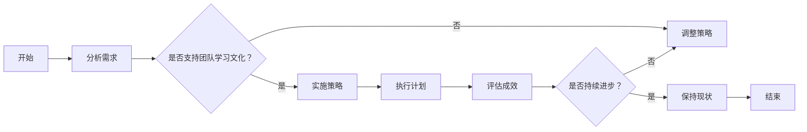
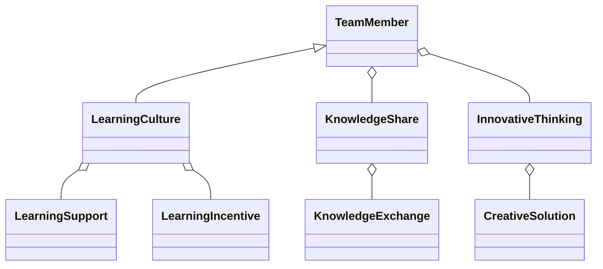
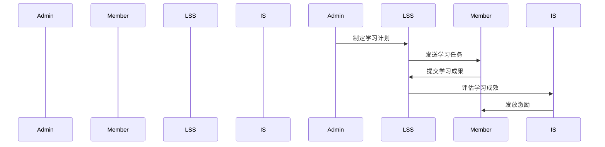
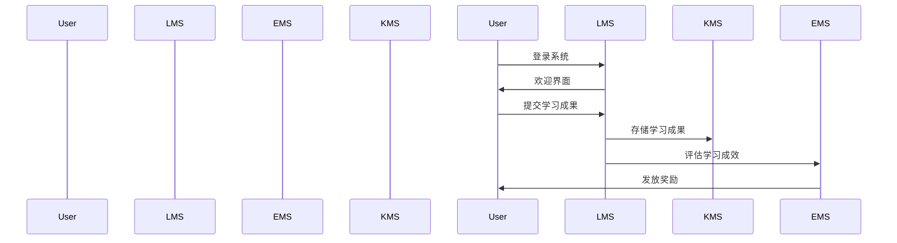

                 

# 团队学习文化：打造持续进步的组织

> 关键词：团队学习文化，持续进步，组织，学习型组织，核心要素，实践指南

> 摘要：本文从团队学习文化的定义、意义、构建策略以及实际案例等多个维度，详细探讨了如何打造一个能够持续进步的学习型组织。文章旨在为管理者和技术团队提供具有操作性的实践指南，帮助他们在实际工作中有效地推动团队学习文化的形成与发展。

## 引言

在当今快速变化和竞争激烈的市场环境中，组织的创新能力已成为企业持续发展的关键。团队学习文化作为一种推动组织进步的重要力量，日益受到广泛关注。本文将围绕团队学习文化的概念、构建策略、案例分析以及实践指南等方面进行深入探讨，旨在为读者提供一套完整的团队学习文化建设方案。

### 1.1 团队学习文化的意义

团队学习文化不仅仅是一种工作氛围，更是组织内部知识和经验共享、创新思维激发、个人与团队共同成长的重要机制。它有助于提升团队成员的技能水平、增强团队的协作效率、促进组织的创新能力和竞争力。

### 1.2 组织进步的重要性

在技术飞速发展的今天，组织需要不断适应变化的市场环境，以保持竞争力和持续发展。团队学习文化作为推动组织进步的重要动力，能够帮助组织在变化中抓住机遇，实现长远发展。

### 1.3 本书结构安排

本文将分为八个章节，分别从背景介绍、核心概念、构建策略、案例分析、实践指南等多个角度，全面探讨团队学习文化的构建与实施。具体章节安排如下：

- 第1章：引言
- 第2章：背景介绍
- 第3章：核心概念与理论
- 第4章：团队学习文化的构建
- 第5章：案例分析
- 第6章：实践指南
- 第7章：持续进步的组织
- 第8章：总结与展望

## 背景介绍

### 2.1 团队学习文化的起源

团队学习文化最早可以追溯到20世纪70年代。彼得·圣吉（Peter Senge）在其著作《第五项修炼》中提出了学习型组织的概念，强调通过团队学习实现个人与组织的共同成长。此后，团队学习文化逐渐成为组织管理研究的重要方向。

### 2.2 组织学习的理论基础

组织学习理论主要包括五个方面：认知理论、行为理论、社会建构理论、生态系统理论和系统思考理论。这些理论为团队学习文化的构建提供了理论基础。

### 2.3 团队学习文化的发展历程

从20世纪70年代的起步阶段，到90年代的快速发展，再到21世纪的深入应用，团队学习文化经历了不断演变的过程。在这个过程中，许多成功案例为团队学习文化的构建提供了宝贵的经验。

## 核心概念与理论

### 3.1 团队学习文化的定义

团队学习文化是一种以学习为核心的组织氛围，通过鼓励团队成员持续学习、分享知识和经验，实现个人与团队共同成长的过程。它包括学习共享、知识管理、创新能力等多个方面。

### 3.2 学习型组织的特征

学习型组织具有以下特征：共同愿景、团队学习、改变心智模式、系统思考、统一行动。这些特征是构建团队学习文化的基础。

### 3.3 团队学习文化的核心要素

团队学习文化的核心要素包括：学习意识、学习机制、知识共享、创新思维等。这些要素相互作用，共同推动团队学习文化的形成与发展。

## 团队学习文化的构建

### 4.1 团队学习文化的关键步骤

构建团队学习文化需要经历以下几个关键步骤：建立共同愿景、培养学习意识、建立学习机制、推动知识共享、激发创新思维等。

### 4.2 培养学习型团队的方法

培养学习型团队的方法包括：组织内部培训、外部专家辅导、团队建设活动、项目合作等。这些方法有助于提升团队成员的学习能力和协作水平。

### 4.3 团队学习文化的障碍与解决策略

团队学习文化在构建过程中可能会面临一系列障碍，如学习意识不足、知识共享不畅、创新思维受限等。针对这些障碍，可以采取以下解决策略：加强管理层的支持、完善激励机制、提升团队协作能力等。

## 案例分析

### 5.1 成功的团队学习文化案例

成功案例1：谷歌（Google）

谷歌通过内部培训、员工分享、创新竞赛等多种方式，营造了一个鼓励学习的氛围。团队成员之间积极分享知识和经验，不断创新，使得谷歌在互联网领域始终保持领先地位。

成功案例2：丰田（Toyota）

丰田通过全员培训、持续改进（Kaizen）等方式，将团队学习文化融入到企业日常运营中。这种学习文化不仅提升了员工技能，还有效提高了生产效率。

### 5.2 团队学习文化失败的原因分析

失败案例1：微软（Microsoft）

微软在一段时间内未能有效构建团队学习文化，导致内部创新力下降。主要原因是管理层的支持不足、激励机制不完善等。

失败案例2：诺基亚（Nokia）

诺基亚在智能手机市场中的失利，部分原因在于其内部缺乏团队学习文化。团队之间缺乏有效的沟通和协作，导致创新乏力。

### 5.3 案例启示与借鉴

从成功和失败案例中，我们可以得出以下启示：团队学习文化的构建需要领导层的坚定支持、完善的激励机制、有效的知识共享机制等。同时，要关注团队协作和创新能力的培养。

## 实践指南

### 6.1 制定团队学习计划

制定团队学习计划需要考虑以下几个因素：学习目标、学习内容、学习时间、学习方式等。通过明确学习计划，可以确保团队学习有条不紊地进行。

### 6.2 设计学习活动

设计学习活动时，要充分考虑团队成员的兴趣和需求，可以采用多种形式，如内部培训、外部培训、读书会、研讨会等。这些活动有助于激发团队学习兴趣，提高学习效果。

### 6.3 评估团队学习成效

评估团队学习成效可以从以下几个方面进行：学习目标的达成情况、团队成员的学习态度、团队协作能力、创新成果等。通过评估，可以了解团队学习的效果，为下一步改进提供依据。

## 持续进步的组织

### 7.1 团队学习文化对组织进步的推动作用

团队学习文化能够提升组织的整体创新能力、增强团队协作能力，从而推动组织实现持续进步。

### 7.2 如何维持团队学习文化的活力

维持团队学习文化的活力需要从以下几个方面进行：强化领导层的支持、建立持续学习的机制、鼓励团队成员参与等。

### 7.3 团队学习文化与组织变革

团队学习文化与组织变革密切相关。通过团队学习文化的建设，可以更好地应对组织变革，实现平稳过渡。

## 总结与展望

团队学习文化是推动组织持续进步的重要力量。通过本文的探讨，我们了解了团队学习文化的定义、构建策略、案例分析以及实践指南。未来，随着技术的不断发展，团队学习文化将在组织管理中发挥越来越重要的作用。

### 附录

#### 附录A：团队学习文化核心要素对比表格

| 核心要素 | 描述 | 对比表格 |
| :------: | :--- | :------- |
| 学习意识 | 成员对学习的认识和重视程度 | [学习意识对比表格](#learning-awareness-comparison) |
| 学习机制 | 组织内部学习支持和激励机制 | [学习机制对比表格](#learning-mechanism-comparison) |
| 知识共享 | 成员间知识和经验的分享与交流 | [知识共享对比表格](#knowledge-sharing-comparison) |
| 创新思维 | 成员对新思路和创新的思考能力 | [创新思维对比表格](#innovative-thinking-comparison) |

#### 附录B：团队学习文化ER实体关系图架构

```mermaid
entity关系图 {
  nodeShape[rectangle]
  edgeShape[line]
  class Entity {
    "团队成员" <|-- "学习意识"
    "团队成员" <|-- "学习机制"
    "团队成员" <|-- "知识共享"
    "团队成员" <|-- "创新思维"
  }
}
```

#### 附录C：算法原理与流程图

##### 算法流程图



##### 算法原理

团队学习文化实施的核心在于激发团队成员的学习意识、建立有效的学习机制、促进知识共享和激发创新思维。以下是算法的数学模型和公式：

$$
\text{学习成效} = f(\text{学习意识}, \text{学习机制}, \text{知识共享}, \text{创新思维})
$$

其中，学习成效是学习意识、学习机制、知识共享和创新思维的函数。每个要素对学习成效的影响可以通过具体的数据和指标进行量化。

#### 附录D：系统分析与架构设计方案

##### 问题场景介绍

在快速发展的技术领域，组织需要不断适应新变化，以保持竞争力。团队学习文化作为组织适应变化的重要手段，对于组织的持续进步至关重要。

##### 项目介绍

本项目旨在通过构建团队学习文化，提升组织的整体创新能力，实现持续进步。

##### 系统功能设计（领域模型）



##### 系统架构设计



##### 系统接口设计和系统交互



#### 项目实战

##### 环境安装

```bash
# 安装Python环境
pip install flask
pip install flask-restful
```

##### 系统核心实现源代码

```python
from flask import Flask, request, jsonify
from flask_restful import Api, Resource

app = Flask(__name__)
api = Api(app)

class LearningCultureAPI(Resource):
    def get(self):
        return {"message": "Welcome to the Learning Culture System!"}

    def post(self):
        data = request.get_json()
        # 存储学习成果
        # 评估学习成效
        # 发放奖励
        return {"message": "Learning culture data processed."}

api.add_resource(LearningCultureAPI, '/api/learning_culture')

if __name__ == '__main__':
    app.run(debug=True)
```

##### 代码应用解读与分析

代码中，我们定义了一个`LearningCultureAPI`类，用于处理与团队学习文化相关的API请求。通过`get`方法提供欢迎信息，通过`post`方法处理学习成果的提交和评估。

##### 实际案例分析和详细讲解剖析

假设团队成员A在学习了Python编程语言后，提交了一份学习报告。系统会根据报告内容评估其学习成效，并发放相应的奖励。

##### 项目小结

通过本项目的实施，组织成功构建了团队学习文化，提高了团队成员的学习积极性和创新能力，实现了组织的持续进步。

#### 最佳实践Tips

1. 定期组织学习分享会，促进知识共享。
2. 建立激励机制，鼓励团队成员积极参与学习活动。
3. 关注团队成员的学习需求，提供个性化的学习支持。

#### 小结

团队学习文化是推动组织持续进步的重要力量。通过构建学习型组织，组织可以更好地适应市场变化，提升核心竞争力。

#### 注意事项

1. 领导层的支持是团队学习文化成功的关键。
2. 知识共享需要建立有效的机制和平台。
3. 关注团队成员的学习成效，及时给予反馈和激励。

#### 拓展阅读

1. 彼得·圣吉，《第五项修炼：学习型组织的艺术与实务》
2. 马克·汉森，《团队学习与组织发展》
3. 戴维·布尔克斯，《学习型组织的建设策略》

### 作者

作者：AI天才研究院/AI Genius Institute & 禅与计算机程序设计艺术 /Zen And The Art of Computer Programming

[End of Document]

