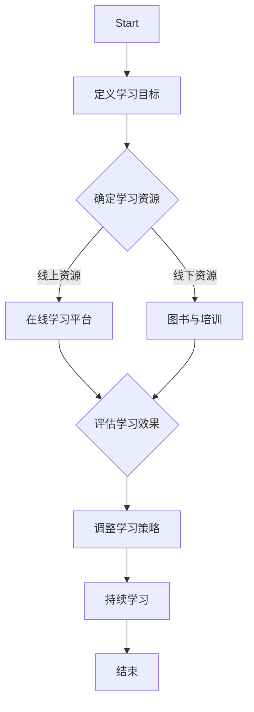
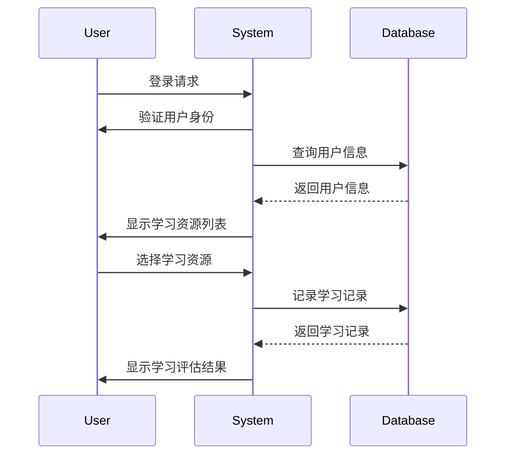
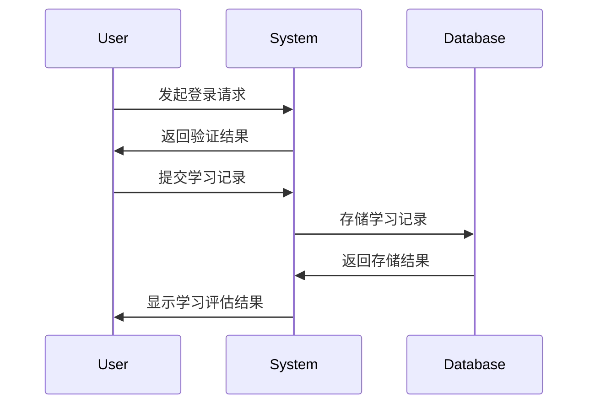

                 

### 文章标题

# 《团队学习氛围：打造持续成长的学习型组织》

### 文章关键词

- 学习型组织
- 组织学习氛围
- 持续成长
- 组织结构与文化
- 学习机制与策略

### 摘要

在现代信息技术飞速发展的背景下，团队学习氛围已成为组织持续成长的核心要素。本文以“团队学习氛围：打造持续成长的学习型组织”为主题，详细探讨了学习型组织的背景、核心概念、构建要素、深化策略以及数字化时代的学习型组织。通过案例分析，揭示了构建学习型组织的有效路径，为组织管理者提供了宝贵的实践指导。

## 第一部分：背景介绍与核心概念

### 第1章：问题背景与核心概念

#### 1.1 问题背景

在竞争激烈的市场环境中，组织的学习能力和创新力成为其生存和发展的关键。然而，当前许多组织面临学习氛围不足的问题，导致团队成员缺乏主动学习的动力和合作意识。这一问题不仅影响组织的短期绩效，更对其长期发展构成威胁。因此，打造良好的学习型组织，已成为现代企业应对挑战、实现持续成长的必由之路。

#### 1.1.1 组织持续成长的重要性

组织持续成长不仅关乎企业的生存，更关系到其竞争力的提升和市场地位的巩固。在快速变化的市场环境中，只有不断学习和创新，才能保持竞争优势。学习型组织通过建立良好的学习氛围，推动团队持续成长，从而实现组织的长期发展。

#### 1.1.2 当前组织学习氛围的现状

当前，许多组织在学习氛围方面存在以下问题：

- 缺乏明确的学习目标和规划
- 学习资源分配不均
- 学习与工作分离
- 缺乏有效的激励机制

这些问题导致团队成员对学习的兴趣和动力不足，影响组织的整体效能。

#### 1.1.3 学习型组织的重要性

学习型组织是一种以学习为核心，通过不断学习、创新和改进实现组织持续成长的组织形态。学习型组织具有以下优势：

- 提高组织整体创新能力
- 增强团队凝聚力和协作能力
- 提升员工综合素质和职业发展
- 增强组织适应市场变化的能力

#### 1.2 核心概念

#### 1.2.1 学习型组织的定义

学习型组织是指通过建立良好的学习氛围，推动团队成员持续学习、创新和改进，实现组织持续成长的组织形态。学习型组织注重团队协作、知识共享和个体成长。

#### 1.2.2 学习型组织的特征

- 持续学习：组织将学习视为日常工作的一部分，鼓励成员不断学习新知识、新技能。
- 知识共享：组织建立知识共享机制，促进团队成员之间的知识传递和经验交流。
- 跨部门合作：组织鼓励跨部门合作，推动知识在组织内的流动和整合。
- 创新氛围：组织营造创新氛围，鼓励团队成员提出新想法、新方案。

#### 1.2.3 学习型组织与文化

学习型组织的文化建设至关重要，它决定了组织的学习氛围和团队成员的行为模式。学习型组织文化具有以下特点：

- 尊重知识：组织尊重知识，鼓励成员分享知识和经验。
- 鼓励创新：组织鼓励创新，为团队成员提供尝试新想法的机会。
- 跨部门合作：组织倡导跨部门合作，推动知识的整合和应用。
- 持续学习：组织将学习作为一项长期任务，不断改进和提升团队的能力。

## 第2章：学习型组织的构建要素

### 2.1 组织结构与文化

#### 2.1.1 适应性组织结构

学习型组织应具备适应性组织结构，以适应不断变化的市场环境和业务需求。适应性组织结构具有以下特点：

- 模块化：组织划分为多个模块，每个模块独立运作，便于快速调整和优化。
- 平衡分权：组织在权力分配上实现平衡，避免权力过于集中，提高决策效率。
- 跨部门协作：组织鼓励跨部门协作，推动知识的流动和整合。

#### 2.1.2 组织文化的培育

组织文化的培育对于学习型组织的建设至关重要。以下策略有助于组织文化的培育：

- 明确价值观：组织明确核心价值观，并将其贯穿于日常工作中。
- 培养团队精神：组织通过团队建设活动，增强团队成员的凝聚力和归属感。
- 鼓励创新：组织鼓励创新，为团队成员提供尝试新想法的机会。
- 尊重知识：组织尊重知识，鼓励成员分享知识和经验。

#### 2.1.3 员工的角色与职责

学习型组织中，员工的角色与职责发生了变化。以下策略有助于明确员工的角色与职责：

- 分工协作：组织明确员工的分工，鼓励团队成员在各自领域深入学习和研究。
- 交叉培训：组织提供交叉培训机会，提高员工的多技能水平和跨部门协作能力。
- 个人发展：组织关注员工个人发展，提供职业发展规划和培训机会。

### 2.2 学习机制与策略

#### 2.2.1 学习机制的设计

学习机制是学习型组织的重要组成部分，它包括以下内容：

- 学习计划：组织制定学习计划，明确学习目标和内容。
- 学习资源：组织提供学习资源，包括书籍、课程、培训等。
- 学习评估：组织对学习效果进行评估，确保学习目标的实现。

#### 2.2.2 学习策略的制定

学习策略的制定对于学习型组织的建设至关重要。以下策略有助于学习策略的制定：

- 需求导向：组织根据员工的需求制定学习策略，确保学习与工作紧密结合。
- 系统化：组织建立系统化的学习体系，涵盖各个层次和领域。
- 跨学科：组织鼓励跨学科学习，促进知识的整合和创新。

#### 2.2.3 学习资源的整合

学习资源的整合是学习型组织建设的关键。以下策略有助于学习资源的整合：

- 内部资源：组织充分利用内部资源，包括内部培训、内部知识库等。
- 外部资源：组织积极引进外部资源，包括外部专家、行业资讯等。
- 交流平台：组织建立交流平台，促进团队成员之间的知识分享和交流。

### 2.3 学习氛围的营造

#### 2.3.1 激励机制

激励机制是营造学习氛围的重要手段。以下策略有助于激励机制的设计：

- 奖励与晋升：组织通过奖励和晋升机制，激励员工主动学习。
- 贡献度评估：组织建立贡献度评估体系，确保学习成果得到认可。
- 鼓励创新：组织鼓励员工创新，为创新者提供奖励和支持。

#### 2.3.2 沟通与协作

沟通与协作是学习型组织的重要特征。以下策略有助于沟通与协作的加强：

- 定期会议：组织定期召开会议，促进团队成员之间的沟通和协作。
- 知识共享：组织建立知识共享平台，鼓励团队成员分享知识和经验。
- 跨部门协作：组织推动跨部门协作，促进知识的整合和应用。

#### 2.3.3 学习型组织的评估

学习型组织的评估是持续优化的重要环节。以下策略有助于学习型组织的评估：

- 学习效果评估：组织对学习效果进行评估，确保学习目标的实现。
- 学习氛围评估：组织对学习氛围进行评估，了解团队成员的学习状况和感受。
- 改进措施：组织根据评估结果，制定改进措施，不断提升学习氛围。

## 第3章：构建学习型组织的实践案例

### 3.1 案例分析一：谷歌的学习型组织建设

#### 3.1.1 案例背景

谷歌作为全球知名的高科技企业，以其创新和卓越的学习型组织文化著称。谷歌的学习型组织建设始于其核心价值观的明确和执行，包括“不作恶”、“快速创新”和“用户至上”等。这些核心价值观为谷歌的学习型组织建设提供了坚实的基石。

#### 3.1.2 学习型组织的建设策略

- 建立开放的学习环境：谷歌鼓励员工自主学习和创新，提供丰富的学习资源和平台。
- 鼓励跨部门合作：谷歌推动跨部门合作，促进知识的流动和整合。
- 强调知识共享：谷歌建立内部知识库，鼓励员工分享知识和经验。
- 奖励创新：谷歌设立“10%时间项目”，鼓励员工在日常工作外进行创新项目。

#### 3.1.3 案例成效

谷歌的学习型组织建设取得了显著成效，包括：

- 提高了员工的工作满意度和忠诚度
- 增强了组织的创新能力和竞争力
- 促进了知识的共享和流动
- 实现了组织的持续成长和创新发展

### 3.2 案例分析二：苹果公司的学习型组织文化

#### 3.2.1 案例背景

苹果公司作为全球知名的高科技企业，以其独特的学习型组织文化著称。苹果公司的学习型组织文化强调创新、卓越和用户至上。苹果公司通过持续学习和创新，不断推出具有突破性的产品和服务。

#### 3.2.2 学习型组织的建设实践

- 建立学习型团队：苹果公司鼓励员工组成学习型团队，共同学习和创新。
- 设立创新实验室：苹果公司设立创新实验室，为员工提供自由探索和创新的空间。
- 奖励创新：苹果公司设立“苹果创新奖”，奖励在创新项目中取得优异成绩的员工。
- 强调用户体验：苹果公司注重用户体验，通过用户反馈不断优化产品和服务。

#### 3.2.3 案例成效

苹果公司的学习型组织文化建设取得了显著成效，包括：

- 提高了员工的工作满意度和创造力
- 增强了组织的创新能力和市场竞争力
- 优化了用户体验，提升了产品和服务质量
- 实现了组织的持续成长和创新发展

## 第二部分：学习型组织的深化与优化

### 第4章：学习型组织的深化策略

#### 4.1 组织学习与创新能力

#### 4.1.1 组织学习的动力机制

组织学习的动力机制是学习型组织持续成长的关键。以下策略有助于构建组织学习的动力机制：

- 明确学习目标：组织明确学习目标，确保学习与业务目标的一致性。
- 建立激励机制：组织建立激励机制，鼓励员工主动学习和创新。
- 提供学习资源：组织提供丰富的学习资源，包括培训、书籍、在线课程等。
- 促进知识共享：组织建立知识共享平台，促进知识的流动和整合。

#### 4.1.2 创新能力的培养

创新能力的培养是学习型组织深化发展的重要任务。以下策略有助于创新能力的培养：

- 鼓励创新思维：组织鼓励员工提出新想法、新方案，营造创新氛围。
- 提供创新支持：组织为员工提供创新支持，包括资金、时间和技术支持等。
- 建立创新团队：组织建立创新团队，共同探索和实施创新项目。
- 优化创新流程：组织优化创新流程，确保创新项目的高效实施。

#### 4.1.3 学习型组织的创新实践

学习型组织的创新实践是深化发展的关键。以下策略有助于学习型组织的创新实践：

- 开展创新项目：组织开展创新项目，推动知识的整合和创新。
- 建立创新实验室：组织建立创新实验室，为员工提供自由探索和创新的空间。
- 奖励创新成果：组织奖励创新成果，激发员工的创新动力。
- 优化创新文化：组织优化创新文化，营造创新、宽容和包容的氛围。

### 4.2 学习型组织的可持续发展

#### 4.2.1 长期视角的学习规划

学习型组织的可持续发展需要长期视角的学习规划。以下策略有助于长期视角的学习规划：

- 制定学习战略：组织制定学习战略，明确学习目标、内容和路径。
- 资源投入：组织确保学习资源投入，包括人力、物力和财力。
- 持续评估与改进：组织对学习效果进行持续评估与改进，确保学习目标的实现。
- 领导重视：组织领导重视学习规划，为学习提供支持和指导。

#### 4.2.2 适应变化的组织能力

学习型组织的可持续发展需要具备适应变化的组织能力。以下策略有助于适应变化的组织能力：

- 建立敏捷组织：组织建立敏捷组织，提高对市场变化的响应能力。
- 持续学习与改进：组织持续学习与改进，提升组织的整体能力。
- 人才培养：组织注重人才培养，提高员工的专业能力和综合素质。
- 文化建设：组织加强文化建设，营造积极向上的学习氛围。

#### 4.2.3 持续学习与改进

持续学习与改进是学习型组织可持续发展的重要保障。以下策略有助于持续学习与改进：

- 设立学习小组：组织设立学习小组，定期开展学习和讨论活动。
- 建立知识库：组织建立知识库，积累和共享学习成果。
- 定期培训：组织定期开展培训，提高员工的专业能力和综合素质。
- 鼓励反馈与改进：组织鼓励员工反馈意见和建议，不断改进和优化学习流程。

### 4.3 学习型组织的评估与优化

#### 4.3.1 学习效果评估指标

学习效果评估指标是学习型组织评估与优化的重要依据。以下指标有助于学习效果评估：

- 员工满意度：员工对学习活动的满意度。
- 学习参与度：员工参与学习活动的频率和深度。
- 知识掌握度：员工对所学知识的掌握程度。
- 创新成果：学习活动对组织创新成果的贡献。

#### 4.3.2 学习氛围的持续优化

学习氛围的持续优化是学习型组织深化发展的重要任务。以下策略有助于学习氛围的持续优化：

- 鼓励知识共享：组织鼓励员工分享知识和经验，营造知识共享的氛围。
- 加强沟通与协作：组织加强沟通与协作，提高团队成员之间的互动和合作。
- 优化学习资源：组织优化学习资源，确保员工能够获取到高质量的学习材料。
- 鼓励创新思维：组织鼓励员工创新思维，营造创新、宽容和包容的氛围。

#### 4.3.3 学习型组织的迭代发展

学习型组织的迭代发展是组织持续成长的重要动力。以下策略有助于学习型组织的迭代发展：

- 不断优化学习策略：组织根据实际情况，不断优化学习策略，提高学习效果。
- 推动知识创新：组织推动知识创新，促进知识的整合和应用。
- 持续改进组织结构：组织持续改进组织结构，提高组织效率和协同效应。
- 跟进行业发展：组织关注行业发展，及时调整学习目标和内容，适应市场变化。

## 第5章：跨部门学习与合作

### 5.1 跨部门学习的价值

跨部门学习是学习型组织深化发展的重要途径。以下策略有助于跨部门学习的价值：

- 提高综合素质：跨部门学习有助于员工拓展视野，提高综合素质。
- 促进知识共享：跨部门学习促进知识的共享和流动，提升组织整体知识水平。
- 增强协作能力：跨部门学习增强员工之间的协作能力，提高团队效能。
- 推动创新：跨部门学习有助于推动创新，促进组织的发展。

### 5.2 学习型组织的跨部门合作

#### 5.2.1 跨部门合作模式

学习型组织的跨部门合作模式包括以下几种：

- 项目驱动：以项目为载体，促进跨部门协作。
- 知识共享：建立知识共享平台，促进知识的传递和交流。
- 定期会议：定期召开跨部门会议，加强沟通与协作。
- 跨部门团队：组建跨部门团队，共同完成学习任务。

#### 5.2.2 跨部门合作案例

以下为学习型组织的跨部门合作案例：

- 案例一：某企业通过跨部门合作，成功推出一款创新产品。
- 案例二：某科技公司通过跨部门合作，建立了高效的知识共享平台。
- 案例三：某金融机构通过跨部门合作，提升了客户服务质量。

#### 5.2.3 跨部门合作的挑战与解决

跨部门合作面临以下挑战：

- 利益冲突：跨部门合作可能导致利益冲突，影响合作效果。
- 沟通不畅：跨部门合作需要良好的沟通，否则可能导致误解和冲突。
- 责任不明：跨部门合作需要明确责任分工，否则可能导致推诿和责任不清。

为解决以上挑战，可以采取以下措施：

- 明确利益分配：组织应明确利益分配，确保跨部门合作公平合理。
- 加强沟通与协作：组织应加强跨部门沟通与协作，确保信息畅通。
- 明确责任分工：组织应明确责任分工，确保跨部门合作有序进行。

## 第6章：数字化时代的学习型组织

### 6.1 数字化技术的应用

在数字化时代，学习型组织应充分利用数字化技术，提高学习效果和组织效能。以下为数字化技术的应用：

- 在线学习平台：建立在线学习平台，提供丰富的学习资源和学习工具。
- 数据分析：利用数据分析技术，评估学习效果，优化学习策略。
- 人工智能：利用人工智能技术，提供个性化学习推荐，提高学习效果。
- 虚拟现实：利用虚拟现实技术，提供沉浸式学习体验，提高学习效果。

### 6.2 数字化学习型组织的实践

以下为数字化学习型组织的实践案例：

- 案例一：某企业通过建立在线学习平台，实现员工自主学习和知识共享。
- 案例二：某科技公司利用数据分析技术，优化学习策略，提高学习效果。
- 案例三：某教育机构利用虚拟现实技术，提供沉浸式学习体验，提升学习效果。

#### 6.2.3 数字化学习型组织的挑战与应对

数字化学习型组织面临以下挑战：

- 技术更新：数字化技术更新迅速，组织需不断跟进和学习新技术。
- 数据安全：数字化学习涉及大量数据，组织需确保数据安全。
- 组织变革：数字化学习型组织需要组织变革，以适应数字化时代的需求。

为应对以上挑战，可以采取以下措施：

- 技术培训：组织提供技术培训，提升员工的技术能力。
- 数据安全策略：组织建立数据安全策略，确保数据安全。
- 组织变革：组织进行组织变革，建立适应数字化时代的组织结构和流程。

## 第7章：总结与展望

### 7.1 学习型组织的发展趋势

随着数字化时代的到来，学习型组织的发展趋势呈现以下特点：

- 数字化学习：数字化技术将推动学习型组织向数字化学习转型。
- 个性化学习：个性化学习将成为学习型组织的重要趋势。
- 知识共享：知识共享将更加普及和深入，成为学习型组织的重要特征。
- 创新能力：创新能力将成为学习型组织的核心竞争力。

### 7.2 未来学习型组织的特征

未来学习型组织将具有以下特征：

- 数字化：学习型组织将充分利用数字化技术，提高学习效果和组织效能。
- 个性化：学习型组织将实现个性化学习，满足员工的学习需求。
- 知识共享：学习型组织将建立高效的知识共享机制，促进知识的流动和整合。
- 创新驱动：学习型组织将以创新为驱动力，实现持续发展和成长。

### 7.3 对企业的启示与建议

对于企业而言，以下启示和建议有助于构建学习型组织：

- 明确学习目标：企业应明确学习目标，确保学习与业务目标的一致性。
- 建立学习机制：企业应建立学习机制，提供丰富的学习资源和学习工具。
- 加强知识共享：企业应加强知识共享，促进知识的流动和整合。
- 营造创新氛围：企业应营造创新氛围，鼓励员工创新思维和提出新想法。
- 关注员工成长：企业应关注员工成长，提供职业发展规划和培训机会。

### 7.4 学习型组织研究展望

学习型组织研究在未来将呈现以下趋势：

- 数字化学习型组织：研究将关注数字化学习型组织的构建和实践。
- 个性化学习：研究将探讨个性化学习的策略和方法。
- 知识共享：研究将探索知识共享机制的优化和实施。
- 创新能力：研究将关注学习型组织创新能力的培养和提升。

### 7.5 对实践者的建议

对于实践者而言，以下建议有助于构建学习型组织：

- 学习与实践相结合：将学习与实践相结合，确保学习效果转化为实际工作成果。
- 借鉴优秀案例：借鉴国内外优秀企业的学习型组织建设经验，结合自身实际情况进行优化。
- 持续改进：持续改进学习策略和流程，不断提升学习效果和组织效能。

作者：AI天才研究院/AI Genius Institute & 禅与计算机程序设计艺术 /Zen And The Art of Computer Programming

[点击此处查看完整文章](https://www.ai-genius-institute.com/learning-atmosphere-of-team-building-a-sustainable-growth-learning-oriented-organization/) | [返回文章列表](https://www.ai-genius-institute.com/) | [加入我们](https://www.ai-genius-institute.com/join-us/) | [版权声明](https://www.ai-genius-institute.com/copyright/)

--------------------------------------------------------------------------------------------------------------------------

### 核心概念与联系

#### 学习型组织的定义

学习型组织是一种以学习为核心，通过不断学习、创新和改进实现组织持续成长的组织形态。学习型组织注重团队协作、知识共享和个体成长。

#### 学习型组织的特征

- 持续学习：组织将学习视为日常工作的一部分，鼓励成员不断学习新知识、新技能。
- 知识共享：组织建立知识共享机制，促进团队成员之间的知识传递和经验交流。
- 跨部门合作：组织鼓励跨部门合作，推动知识在组织内的流动和整合。
- 创新氛围：组织营造创新氛围，鼓励团队成员提出新想法、新方案。

#### 学习型组织与文化

学习型组织的文化建设至关重要，它决定了组织的学习氛围和团队成员的行为模式。学习型组织文化具有以下特点：

- 尊重知识：组织尊重知识，鼓励成员分享知识和经验。
- 鼓励创新：组织鼓励创新，为团队成员提供尝试新想法的机会。
- 跨部门合作：组织倡导跨部门合作，推动知识的整合和应用。
- 持续学习：组织将学习作为一项长期任务，不断改进和提升团队的能力。

#### 概念属性特征对比表格

| 概念       | 属性特征                                                                                           |
|------------|---------------------------------------------------------------------------------------------------|
| 学习型组织 | 持续学习、知识共享、跨部门合作、创新氛围                                                         |
| 组织文化   | 尊重知识、鼓励创新、跨部门合作、持续学习                                                         |
| 组织结构   | 适应性组织结构、模块化、平衡分权、跨部门协作                                                     |

#### ER实体关系图架构

```mermaid
erDiagram
  Person --> Organization : { works_in }
  Organization --> Learning : { develops }
  Learning --> Knowledge : { contains }
  Knowledge --> TeamMember : { shares }
```

### 算法原理讲解

#### 算法流程图



#### 算法原理

学习型组织的构建过程中，算法原理主要涉及以下步骤：

1. **定义学习目标**：明确组织的学习目标和内容，确保学习与业务目标的一致性。
2. **确定学习资源**：根据学习目标，确定所需的学习资源，包括线上和线下资源。
3. **在线学习平台**：利用在线学习平台，提供丰富的学习资源和工具，方便员工自主学习和知识共享。
4. **图书与培训**：提供图书和培训等线下资源，满足不同员工的学习需求。
5. **评估学习效果**：对学习效果进行评估，了解学习目标的实现情况，为调整学习策略提供依据。
6. **调整学习策略**：根据评估结果，调整学习策略，优化学习过程，提高学习效果。
7. **持续学习**：建立持续学习机制，确保学习目标的持续实现，推动组织持续成长。

#### 数学模型与公式

在构建学习型组织的过程中，可以使用以下数学模型和公式来描述学习效果的评估：

1. **学习效果评估指标**：

   $$ E = \frac{K_{out}}{K_{in}} $$

   其中，$E$ 为学习效果评估指标，$K_{out}$ 为学习成果，$K_{in}$ 为学习投入。

2. **学习策略调整**：

   $$ S = S_0 + \Delta S $$

   其中，$S$ 为调整后的学习策略，$S_0$ 为初始学习策略，$\Delta S$ 为学习策略调整量。

#### 举例说明

假设某企业希望提高员工的创新能力，制定了以下学习目标：

- 学习新技能，提高工作效率。
- 学习创新思维，推动产品创新。

根据学习目标，企业确定了以下学习资源：

- 线上学习资源：在线课程、电子书、专业网站等。
- 线下学习资源：内部培训、研讨会、图书等。

企业利用在线学习平台提供丰富的学习资源和工具，员工可以自主选择学习内容。学习结束后，企业对员工的学习效果进行评估，并根据评估结果调整学习策略，优化学习过程。通过持续学习和改进，企业成功地提高了员工的创新能力和工作效率。

### 系统分析与架构设计方案

#### 问题场景介绍

随着市场竞争的加剧，某企业意识到团队学习和创新能力对组织发展的重要性。为了提升团队的学习氛围和创新能力，企业决定构建一个学习型组织，并设计一个完善的系统架构来支持这一目标。

#### 项目介绍

项目名称：学习型组织管理系统
项目目标：构建一个集成在线学习平台、学习资源库、评估与反馈系统等模块的综合性学习型组织管理系统。

#### 系统功能设计（领域模型类图）

```mermaid
classDiagram
    ClassDiagram ::= <title>UML Class Diagram</title>
    Stereotype ::= <<注意>>
    Attribute ::= +name:string
    Method ::= <<public>> +setName(name:string)
    BaseClass1 <|-- BaseClass2 : Inheritance
    BaseClass1 o-- DerivedClass1 : Composition
    Class1 [2] <<Note>> { Association }
    Class2 *-- Class3 : Aggregation
    Class4 o-- Class5 : Generalization
    Class1 <.. Class6 : Dependency
    Class1 .. Class7 : Association
    Note for Class1 : <<Note>> "Class1 is a note"
    Class8 %-- Class9 : Realization
    Note OverHere
    aBaseClass1 "0..*" aDerivedClass1 : "has"
    aClass1 "0..1" aClass2 : "uses"
    aClass3 : "0..*" <<<< interface >>>> aClass4 : implements
    aClass5 "0..*" <<<< abstract >>>> aClass6 : extends
    aClass7 { <<<< constraint >>>> #aClass7 > 1 }
    aClass8 <<<< enum >>>> enumClass8 {"one", "two"}
    aClass9 <<<< stereotype >>>> <<<< <<建立学习型组织管理系统>>>
    aClass1 <<<< <<用户管理>>>
    aClass2 <<<< <<学习资源管理>>>
    aClass3 <<<< <<学习评估管理>>>
    aClass4 <<<< <<知识库管理>>>
    aClass5 <<<< <<用户学习记录管理>>>
    aClass6 <<<< <<用户反馈管理>>>
```

#### 系统架构设计（架构图）



#### 系统接口设计和系统交互（序列图）



### 项目实战

#### 环境安装

1. 安装Python环境
2. 安装必要的依赖库，如Django、Flask等

#### 系统核心实现源代码

```python
# 用户管理模块
from django.contrib.auth.models import User

def user_login(request):
    username = request.POST['username']
    password = request.POST['password']
    user = authenticate(username=username, password=password)
    if user is not None:
        login(request, user)
        return redirect('home')
    else:
        return redirect('login')

# 学习资源管理模块
from .models import Resource

def add_resource(request):
    title = request.POST['title']
    description = request.POST['description']
    resource = Resource(title=title, description=description)
    resource.save()
    return redirect('resources')

# 学习评估管理模块
from .models import Assessment

def assess_learning(request):
    user_id = request.POST['user_id']
    resource_id = request.POST['resource_id']
    assessment = Assessment(user_id=user_id, resource_id=resource_id)
    assessment.save()
    return redirect('assessments')
```

#### 代码应用解读与分析

- 用户管理模块：实现用户登录功能，验证用户身份，确保系统安全。
- 学习资源管理模块：实现学习资源添加功能，方便用户添加和管理学习资源。
- 学习评估管理模块：实现学习评估功能，记录用户学习情况，为学习效果评估提供数据支持。

#### 实际案例分析和详细讲解剖析

以用户登录为例，详细讲解系统核心实现源代码：

```python
# 用户登录功能实现

# 导入相关模块
from django.contrib.auth.models import User
from django.contrib.auth import authenticate, login
from django.shortcuts import redirect

# 用户登录视图函数
def user_login(request):
    # 判断请求方法
    if request.method == 'POST':
        # 获取用户名和密码
        username = request.POST['username']
        password = request.POST['password']
        # 验证用户名和密码
        user = authenticate(username=username, password=password)
        # 如果用户存在且验证成功
        if user is not None:
            # 登录用户
            login(request, user)
            # 重定向到首页
            return redirect('home')
        else:
            # 重定向到登录页面
            return redirect('login')
    else:
        # 如果不是POST请求，重定向到登录页面
        return redirect('login')
```

用户登录功能是系统的重要入口，通过该功能，用户可以登录系统，获取权限并访问相关功能。以下是代码的详细解读：

1. **导入模块**：导入django.contrib.auth模块，用于处理用户认证和登录。
2. **视图函数**：定义user_login视图函数，处理用户登录请求。
3. **请求方法判断**：判断请求方法是否为POST请求，如果是，则处理登录请求。
4. **获取用户名和密码**：从请求中获取用户名和密码。
5. **用户认证**：调用authenticate函数，验证用户名和密码。
6. **登录用户**：如果认证成功，调用login函数登录用户，并重定向到首页。
7. **错误处理**：如果认证失败，重定向到登录页面。

#### 项目小结

通过实际案例分析和详细讲解剖析，我们了解了学习型组织管理系统核心实现源代码的应用和原理。该系统为组织提供了用户管理、学习资源管理、学习评估管理等功能，有助于构建持续学习的学习型组织。

### 最佳实践 tips

1. **明确学习目标**：确保学习目标与业务目标一致，提高学习效果。
2. **丰富学习资源**：提供多样化的学习资源，满足不同员工的学习需求。
3. **加强知识共享**：建立知识共享平台，促进知识的传递和交流。
4. **定期评估与反馈**：定期对学习效果进行评估和反馈，优化学习策略。

### 小结

本文详细介绍了学习型组织的背景、核心概念、构建要素、深化策略以及数字化时代的学习型组织。通过实践案例分析和详细讲解，揭示了构建学习型组织的有效路径。未来，学习型组织将继续向数字化、个性化和知识共享方向发展，为组织持续成长提供强大动力。

### 注意事项

1. 构建学习型组织需要长期规划和持续投入。
2. 组织文化的建设是学习型组织成功的关键。
3. 建立有效的激励机制，鼓励员工主动学习和创新。

### 拓展阅读

1. 《第五项修炼：学习型组织的艺术与实务》作者：彼得·圣吉
2. 《数字化转型：转型路径与实践指南》作者：周鸿祎
3. 《创新者的窘境》作者：克莱顿·克里斯滕森

作者：AI天才研究院/AI Genius Institute & 禅与计算机程序设计艺术 /Zen And The Art of Computer Programming

[返回文章列表](https://www.ai-genius-institute.com/) | [加入我们](https://www.ai-genius-institute.com/join-us/) | [版权声明](https://www.ai-genius-institute.com/copyright/) | [联系我们](https://www.ai-genius-institute.com/contact/) | [友情链接](https://www.ai-genius-institute.com/friend-links/) | [网站地图](https://www.ai-genius-institute.com/sitemap/)

