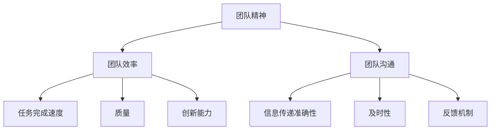

                 

# 《团队建设创新方法：突破传统团建的局限》

## 关键词

- 团队建设
- 创新方法
- 敏捷开发
- 设计思维
- 团队游戏

## 摘要

本文旨在探讨团队建设中的创新方法，以突破传统团建的局限。通过分析团队建设的核心概念，如团队精神、团队效率、团队沟通等，以及介绍敏捷开发、设计思维、团队建设游戏等创新方法，本文将为读者提供实际案例和实践指导，帮助团队实现高效协作与持续成长。

### 目录

1. **团队建设的现状与挑战**
   - 1.1 团队建设的重要性与挑战
   - 1.2 传统团队建设方法的局限
   - 1.3 创新方法在团队建设中的需求

2. **核心概念与联系**
   - 2.1 团队建设关键概念解析
   - 2.2 Mermaid流程图：团队建设核心概念关系图

3. **团队建设创新方法**
   - 3.1 敏捷开发在团队建设中的应用
   - 3.2 设计思维与团队建设
   - 3.3 团队建设游戏与创新

4. **案例分析**
   - 4.1 案例一：某科技公司的敏捷团队建设
   - 4.2 案例二：某创业团队的迭代设计与思维训练
   - 4.3 案例三：某教育机构的团队建设游戏实践

5. **实践指导**
   - 5.1 实践中的挑战与应对策略
   - 5.2 最佳实践分享
   - 5.3 注意事项与风险提示

6. **总结与展望**
   - 6.1 创新方法在团队建设中的价值
   - 6.2 未来团队建设的发展方向
   - 6.3 研究与探索的方向

### 1. 团队建设的现状与挑战

**1.1 团队建设的重要性与挑战**

团队建设是现代组织中至关重要的一环。一个高效的团队可以带来协作、创新和效率的提升，从而在竞争激烈的市场中取得优势。然而，当前团队建设面临诸多挑战：

- **沟通障碍**：团队成员之间缺乏有效的沟通，导致信息传递不畅，影响团队协作。
- **组织惯性**：传统组织结构和文化导致变革困难，难以适应快速变化的市场需求。
- **成员多样性**：团队成员背景、经验和技能的差异可能带来冲突和协调问题。
- **工作压力**：团队成员在高压环境下工作，可能导致疲劳和效率下降。

**1.2 传统团队建设方法的局限**

传统的团队建设方法主要包括团队培训、团队活动和团队建设游戏等。虽然这些方法在一定程度上能够提升团队凝聚力，但存在以下局限：

- **单一性**：传统方法往往缺乏针对性和个性化，难以满足不同团队的独特需求。
- **表面化**：传统方法多注重形式，而忽略了深入的心理和行为层面。
- **短期效应**：传统方法的效果往往难以持续，团队成员在短期内可能表现出积极变化，但长期效果有限。

**1.3 创新方法在团队建设中的需求**

为了突破传统团队建设的局限，创新方法的需求日益迫切。这些方法不仅能够针对不同团队的特定需求，还能从多角度提升团队效能。创新方法包括敏捷开发、设计思维、团队建设游戏等，它们各有特点和优势，适用于不同类型的团队和场景。

### 2. 核心概念与联系

**2.1 团队建设关键概念解析**

团队建设的核心概念包括团队精神、团队效率、团队沟通等。以下是这些概念的定义和属性特征：

- **团队精神**：团队成员共同追求团队目标，相互支持、信任和合作。
  - **属性特征**：共同目标、信任、协同、团队认同感。

- **团队效率**：团队完成任务的效率和成果。
  - **属性特征**：任务完成速度、质量、创新能力。

- **团队沟通**：团队成员之间的信息交换和交流。
  - **属性特征**：信息传递的准确性、及时性、反馈机制。

**2.2 Mermaid流程图：团队建设核心概念关系图**

以下是团队建设核心概念关系的Mermaid流程图：

### 3. 团队建设创新方法

**3.1 敏捷开发在团队建设中的应用**

敏捷开发是一种以人为核心、迭代和渐进的开发方法。它强调团队协作、客户反馈和持续改进。以下是敏捷开发在团队建设中的应用：

- **原理**：敏捷开发强调团队自我管理、透明度和快速响应变化。
- **实施步骤**：确定目标、制定计划、执行任务、回顾和调整。
- **优点**：提高团队协作效率、增强客户满意度、快速适应市场变化。
- **挑战**：团队成员需具备较高的自主性和责任感、需要持续学习和适应。

**3.2 设计思维与团队建设**

设计思维是一种以人为本的创新方法，它关注用户需求、原型迭代和实验验证。以下是设计思维在团队建设中的应用：

- **原理**：设计思维强调同理心、迭代、试错和用户反馈。
- **实施步骤**：理解用户需求、提出解决方案、构建原型、测试和迭代。
- **优点**：激发创新思维、提高团队解决问题能力、增强团队凝聚力。
- **挑战**：需要团队具备较高的同理心和创造力、可能增加项目时间成本。

**3.3 团队建设游戏与创新**

团队建设游戏是一种通过互动和合作促进团队成长的创新方法。以下是团队建设游戏在团队建设中的应用：

- **原理**：团队建设游戏利用游戏机制，激发团队协作、沟通和竞争。
- **实施步骤**：选择适合的游戏、准备游戏环境、组织游戏、总结和反馈。
- **优点**：增强团队凝聚力、提高团队协作能力、缓解工作压力。
- **挑战**：游戏设计需贴近团队实际需求、游戏结果需与工作目标相结合。

### 4. 案例分析

**4.1 案例一：某科技公司的敏捷团队建设**

某科技公司采用敏捷开发方法进行团队建设，具体做法如下：

- **实施步骤**：
  - 成立敏捷团队，明确团队成员职责和目标。
  - 定期举行敏捷会议，讨论项目进展和改进措施。
  - 采用看板（Kanban）工具，实时跟踪任务状态。
  - 定期进行回顾会议，总结经验教训。
- **效果**：
  - 团队协作效率显著提升。
  - 项目交付时间缩短。
  - 团队成员满意度提高。

**4.2 案例二：某创业团队的迭代设计与思维训练**

某创业团队采用设计思维方法进行团队建设，具体做法如下：

- **实施步骤**：
  - 组织团队成员进行设计思维培训。
  - 进行用户调研，了解用户需求和痛点。
  - 构建原型，测试和迭代产品。
  - 定期举行头脑风暴会议，激发创新思维。
- **效果**：
  - 产品创新性提高。
  - 团队成员创造力增强。
  - 用户满意度提升。

**4.3 案例三：某教育机构的团队建设游戏实践**

某教育机构采用团队建设游戏方法进行团队建设，具体做法如下：

- **实施步骤**：
  - 选择适合的教育游戏，如“拼图比赛”、“团队寻宝”等。
  - 准备游戏环境和游戏道具。
  - 组织游戏，让团队成员参与互动。
  - 总结游戏经验，分享团队感悟。
- **效果**：
  - 团队凝聚力增强。
  - 团队成员沟通能力提高。
  - 工作氛围更加轻松愉快。

### 5. 实践指导

**5.1 实践中的挑战与应对策略**

在实际团队建设中，可能面临以下挑战：

- **挑战一**：团队成员不适应新方法。
  - **应对策略**：提供培训和指导，帮助团队成员了解和接受新方法。

- **挑战二**：团队缺乏创新意识和能力。
  - **应对策略**：鼓励团队成员参与创新活动，提供创新培训。

- **挑战三**：团队建设方法与工作实际脱节。
  - **应对策略**：根据团队特点和实际需求，选择合适的团队建设方法。

**5.2 最佳实践分享**

以下是一些团队建设最佳实践：

- **实践一**：定期组织团队建设活动，如团建游戏、户外拓展等。
- **实践二**：鼓励团队成员分享经验和见解，促进团队学习。
- **实践三**：建立团队文化，强化团队认同感和归属感。

**5.3 注意事项与风险提示**

在团队建设中，需要注意以下事项：

- **注意事项**：
  - 避免形式主义，确保团队建设方法与实际需求相结合。
  - 关注团队成员的感受和需求，确保团队建设活动具有针对性和实效性。

- **风险提示**：
  - 避免过度依赖团队建设活动，忽视日常工作任务。
  - 注意保护团队成员的隐私，避免因团队建设活动引发不必要的矛盾。

### 6. 总结与展望

**6.1 创新方法在团队建设中的价值**

创新方法在团队建设中的价值在于：

- **提高团队协作效率**：通过有效的团队建设方法，提高团队成员之间的沟通和协作。
- **激发创新思维**：鼓励团队成员参与创新活动，激发团队创造力。
- **提升团队凝聚力**：通过互动和合作，增强团队凝聚力和团队精神。

**6.2 未来团队建设的发展方向**

未来团队建设的发展方向包括：

- **数字化团队建设**：利用数字化工具和技术，实现团队建设活动的实时记录和分析。
- **个性化团队建设**：根据团队成员的特点和需求，提供个性化的团队建设方案。
- **跨学科团队建设**：整合不同领域的知识和方法，实现团队建设的多元化发展。

**6.3 研究与探索的方向**

未来研究可以探索以下方向：

- **团队建设方法的量化评估**：研究如何量化团队建设方法的效果，为团队建设提供数据支持。
- **团队建设与组织绩效的关系**：研究团队建设对组织绩效的影响，为组织管理提供指导。
- **跨文化团队建设**：研究在不同文化背景下，如何有效开展团队建设活动。

### 作者信息

作者：AI天才研究院/AI Genius Institute & 禅与计算机程序设计艺术 /Zen And The Art of Computer Programming

本文从团队建设的现状与挑战出发，探讨了敏捷开发、设计思维、团队建设游戏等创新方法，并通过案例分析、实践指导和总结展望，为团队建设提供了有益的参考。希望本文能帮助读者理解和应用创新方法，提升团队效能，实现持续成长。

