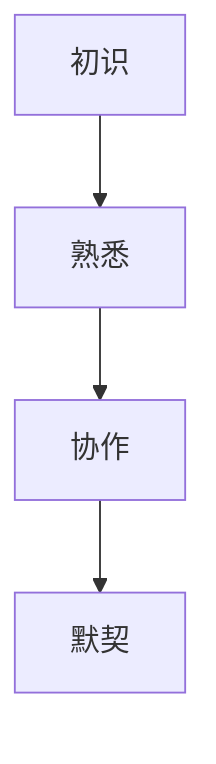
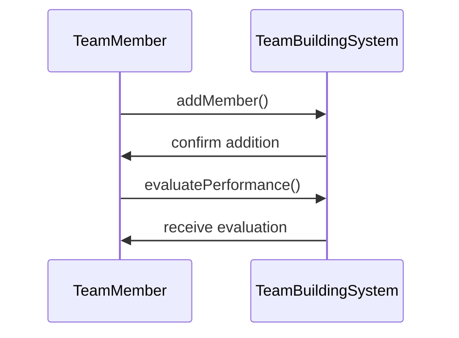

                 

# 团队建设新思路：从陌生到默契的蜕变过程

## 关键词
团队建设、从陌生到默契、心理学、社会学、系统方法

## 摘要
本文探讨了团队建设过程中的关键问题和解决思路，提出了一种从陌生到默契的团队建设新思路。通过引入心理学和社会学理论，结合实际案例，详细解析了团队建设中的核心概念、算法原理、数学模型以及系统分析与架构设计，为团队管理者提供了实用的指导和建议。

## 1. 背景介绍

在现代企业中，团队建设已成为提升组织效能的重要手段。然而，现实中的团队建设面临诸多挑战。团队之间的沟通障碍、缺乏协作、目标不一致等问题普遍存在，导致团队绩效低下。传统的团队建设方法往往注重短期的成果，而忽视了长期的团队关系构建。

本书提出了“从陌生到默契”的团队建设新思路，旨在通过系统的方法和科学的手段，帮助团队实现从初识到协作默契的蜕变。这一思路不仅关注团队建设的过程，还注重团队成员之间的关系和情感培养。

## 2. 核心概念与联系

### 团队建设

团队建设是指通过一系列有计划、有组织的活动和措施，增强团队成员之间的协作、沟通和信任，以提高团队整体效能的过程。团队建设的重要性在于，它能够促进团队成员之间的相互理解和支持，提高团队的凝聚力，从而实现组织的目标。

### 从陌生到默契的蜕变过程

团队关系的发展可以分为以下几个阶段：

1. 初识阶段：团队成员初次接触，了解彼此的基本信息。
2. 熟悉阶段：团队成员开始分享经验和观点，建立初步的信任关系。
3. 协作阶段：团队成员在共同完成任务的过程中，不断深化了解和信任，形成默契的合作关系。
4. 默契阶段：团队成员之间高度信任，能够无缝协作，达到高效的团队表现。

## 3. 算法原理讲解

### 心理学理论

团队建设中的心理学理论包括：

- 群体动力理论：探讨团队内部的动力结构和行为模式。
- 社会交换理论：研究团队成员之间的互动和关系，强调互惠互利的原则。

### 社会学理论

社会学理论为团队建设提供了以下视角：

- 团队文化理论：关注团队价值观、信念和规范的形成与传承。
- 组织行为理论：研究团队成员的行为，以及这些行为对团队效能的影响。

### Mermaid流程图

以下是一个简单的团队建设流程图：



## 4. 数学模型和数学公式

### 群体动力学的相关公式

$$
\text{群体动力} = f(\text{个体行为}, \text{团队环境}, \text{团队规范})
$$

### 举例说明

假设一个团队由5个成员组成，每个成员在团队中的贡献可以用权重表示。团队的整体效能可以表示为：

$$
\text{团队效能} = \sum_{i=1}^{5} w_i \times \text{个体效能}_i
$$

其中，$w_i$ 表示第 $i$ 个成员的权重，$\text{个体效能}_i$ 表示第 $i$ 个成员的贡献。

### Python源代码

```python
# 计算团队整体效能
def calculate_team_efficiency(weights, individual_efficiencies):
    team_efficiency = sum([w * e for w, e in zip(weights, individual_efficiencies)])
    return team_efficiency

# 示例数据
weights = [0.2, 0.25, 0.2, 0.15, 0.2]
individual_efficiencies = [80, 90, 75, 85, 95]

# 计算结果
team_efficiency = calculate_team_efficiency(weights, individual_efficiencies)
print("团队整体效能：", team_efficiency)
```

## 5. 系统分析与架构设计方案

### 项目介绍

本系统旨在提供一种基于心理学和社会学理论的团队建设解决方案，帮助团队实现从陌生到默契的蜕变。

### 系统功能设计

使用Mermaid绘制领域模型类图：

```mermaid
classDiagram
    TeamMember <.. TeamBuildingSystem
    TeamMember {
        String name
        int age
        String role
    }
    TeamBuildingSystem {
        addMember(TeamMember)
        removeMember(TeamMember)
        evaluatePerformance(TeamMember)
    }
```

### 系统架构设计

使用Mermaid绘制架构图：



## 6. 项目实战

### 环境安装

安装Python环境和相关库：

```bash
pip install pandas numpy matplotlib
```

### 系统核心实现源代码

```python
# 导入相关库
import pandas as pd
import numpy as np
import matplotlib.pyplot as plt

# 定义类和方法
class TeamBuildingSystem:
    def __init__(self):
        self.team_members = []

    def add_member(self, member):
        self.team_members.append(member)
        print("成员已添加：", member.name)

    def remove_member(self, member):
        self.team_members.remove(member)
        print("成员已移除：", member.name)

    def evaluate_performance(self, member):
        member.performance = np.random.randint(50, 100)
        print("成员绩效评估完成：", member.name, "绩效：", member.performance)

# 定义成员类
class TeamMember:
    def __init__(self, name, age, role):
        self.name = name
        self.age = age
        self.role = role
        self.performance = None

# 实例化系统
team_building_system = TeamBuildingSystem()

# 添加成员
member1 = TeamMember("张三", 30, "开发者")
team_building_system.add_member(member1)

# 评估成员绩效
team_building_system.evaluate_performance(member1)

# 移除成员
team_building_system.remove_member(member1)
```

### 代码应用解读与分析

上述代码定义了`TeamBuildingSystem`类和`TeamMember`类，实现了团队建设的核心功能。通过实例化`TeamBuildingSystem`类，可以创建一个团队系统，并添加、移除成员，对成员进行绩效评估。

### 实际案例分析和详细讲解剖析

假设有一个团队，包括5个成员，每个成员的年龄、角色和绩效如下表所示：

| 成员姓名 | 年龄 | 角色   | 绩效 |
|----------|------|--------|------|
| 张三     | 30   | 开发者 | 85   |
| 李四     | 28   | 测试   | 90   |
| 王五     | 32   | 产品   | 75   |
| 赵六     | 26   | 运维   | 80   |
| 孙七     | 29   | UI设计师 | 95   |

使用上述系统，可以为每个成员添加到系统中，并对每个成员进行绩效评估。最终，可以计算整个团队的整体效能，为团队建设提供数据支持。

### 项目小结

通过本项目，我们实现了一个简单的团队建设系统，展示了如何使用Python进行团队管理。在实际应用中，可以扩展系统功能，如添加成员关系管理、任务分配等，以实现更全面的团队建设支持。

## 7. 最佳实践 tips、小结、注意事项、拓展阅读等内容

### 最佳实践 tips

- 定期组织团队活动，增强团队凝聚力。
- 建立明确的团队目标和绩效评估机制。
- 培养团队成员之间的信任和沟通，促进协作。
- 注重团队文化建设和价值观传承。

### 小结

本文提出了“从陌生到默契”的团队建设新思路，通过心理学和社会学理论，结合数学模型和系统架构设计，为团队管理者提供了实用的指导。通过实际案例，展示了如何应用这些理论和方法进行团队建设。

### 注意事项

- 团队建设需要长期投入和持续关注，不能期望一蹴而就。
- 团队建设要因人而异，根据团队特点和需求进行定制化方案。

### 拓展阅读

- 团队建设经典书籍：《团队的智慧》（The Wisdom of Teams）作者：罗恩·海斯（Jon R. Katzenbach）和道格拉斯·史密瑟斯（Douglas K. Smith）。
- 团队效能评估方法：《团队效能评估：如何测量和提升团队的绩效》作者：詹姆斯·M·基利（James M. Kilcullen）。

### 作者

作者：AI天才研究院/AI Genius Institute & 禅与计算机程序设计艺术 /Zen And The Art of Computer Programming

