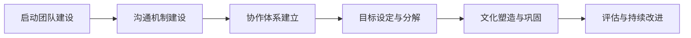
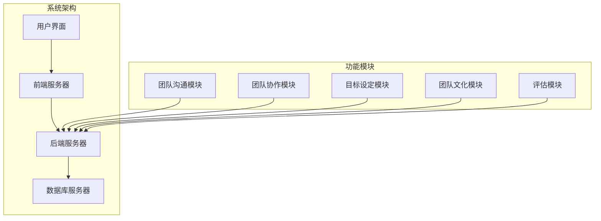
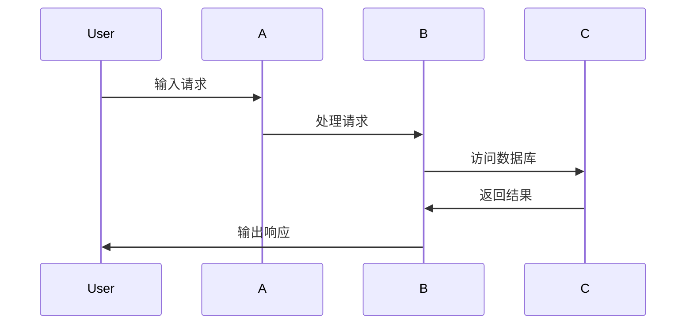
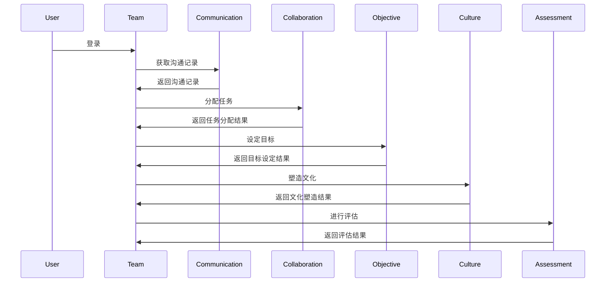

                 

# 团队建设：从分散个体到凝聚整体

## 关键词
团队建设、协作、沟通、目标设定、团队文化、组织发展

## 摘要
本文深入探讨了团队建设的重要性及其实现路径。通过分析团队建设中的关键概念和要素，本文提出了一个系统的团队建设方法论，包括沟通、协作、目标设定和团队文化等方面。通过实际案例和代码示例，本文详细阐述了如何从分散的个体构建为高效的团队，为组织发展提供了实用的指导。

---

### 第一部分：背景介绍

#### 问题背景

在当今的企业环境中，团队建设已经成为提升企业竞争力的重要手段。随着信息技术的发展，企业面临的市场环境日益复杂多变，单一员工的技能和知识已无法满足业务需求。因此，如何将一群独立的个体凝聚成一个高效的团队，成为企业成功的关键。

然而，许多企业在团队建设过程中面临着诸多挑战，如团队成员之间的沟通不畅、协作困难、缺乏共同目标等。这些问题的存在严重影响了团队的效率和工作质量。

#### 问题描述

《团队建设：从分散个体到凝聚整体》这本书旨在解决企业团队建设过程中遇到的问题。它通过深入剖析团队建设的关键要素，提供实用的策略和方法，帮助企业和团队克服建设过程中的困难，实现从分散个体到凝聚整体的转变。

#### 问题解决

本书将围绕团队建设中的关键问题，如团队沟通、协作、目标设定、团队文化等，进行深入探讨。通过理论讲解、案例分析、实战技巧等多种方式，为读者提供全面的团队建设指导。

#### 边界与外延

团队建设不仅仅局限于企业内部，它同样适用于其他组织形式，如非营利组织、教育机构等。同时，团队建设的过程和结果也受到多种因素的影响，如组织文化、领导者风格、团队成员的能力和素质等。

#### 概念结构与核心要素组成

团队建设涉及多个核心概念和要素，包括：

- **团队沟通**：团队成员之间的有效沟通是团队建设的基础。良好的沟通能够促进信息共享、理解共识和协同合作。
- **团队协作**：协作是实现团队目标的重要手段。通过有效的协作，团队成员能够发挥各自的优势，共同完成任务。
- **目标设定**：明确的目标是团队前进的动力。合理的目标设定有助于激发团队成员的积极性和创造力。
- **团队文化**：团队文化是团队内部的共同价值观和行为规范。积极向上的团队文化有助于增强团队的凝聚力和执行力。

### 第二部分：核心概念与联系

#### 核心概念原理

团队建设中的核心概念包括团队沟通、协作、目标设定和团队文化。这些概念相互关联，共同构成了团队建设的理论基础。

- **团队沟通**：指团队成员之间通过各种渠道进行的信息传递和交流。有效的团队沟通能够促进信息共享、理解共识和协同合作。
- **团队协作**：指团队成员为了实现共同目标而进行的合作行为。有效的协作能够发挥团队成员的优势，提高团队的整体效率。
- **目标设定**：指团队在明确目标的基础上，制定具体的行动计划。合理的目标设定能够激发团队成员的积极性和创造力。
- **团队文化**：指团队内部的共同价值观和行为规范。积极向上的团队文化能够增强团队的凝聚力和执行力。

#### 概念属性特征对比表格

以下是一个简化的团队建设核心概念属性特征对比表格：

| 概念     | 特征                                                         |
|----------|------------------------------------------------------------|
| 团队沟通 | 促进信息共享、理解共识、协同合作                            |
| 团队协作 | 发挥成员优势、提高效率、共同完成任务                       |
| 目标设定 | 明确目标、制定行动计划、激发积极性、创造力                 |
| 团队文化 | 共同价值观、行为规范、增强凝聚力、执行力                   |

#### ER实体关系图架构

以下是一个简化的团队建设ER实体关系图架构：

```mermaid
erDiagram
  Team ||--|{ Member }|-- Project
  Team ||--|{ Communication }|-- Meeting
  Team ||--|{ Collaboration }|-- Task
  Team ||--|{ Culture }|-- Value
```

### 第三部分：算法原理讲解

#### 算法mermaid流程图

以下是一个简化的团队建设算法mermaid流程图：



#### Python源代码

以下是一个简化的团队建设Python源代码示例：

```python
# 导入所需库
import random

# 定义团队建设算法
def team_building():
    # 沟通机制建设
    communication_mechanism = {
        "tools": ["Zoom", "Slack", "Trello"],
        "schedule": ["daily stand-up", "weekly progress meeting"]
    }
    
    # 协作体系建立
    collaboration_system = {
        "task分配": ["Scrum", "Kanban"],
        "工具": ["JIRA", "Confluence"]
    }
    
    # 目标设定与分解
    objectives = {
        "短期目标": ["提高项目完成度", "提升团队协作效率"],
        "长期目标": ["实现产品上市", "提高企业竞争力"]
    }
    
    # 文化塑造与巩固
    culture = {
        "价值观": ["诚信", "创新", "合作", "共享"],
        "行为规范": ["尊重个人", "鼓励创新", "鼓励反馈", "共同成长"]
    }
    
    # 评估与持续改进
    assessment = {
        "指标": ["项目进度", "团队成员满意度", "团队协作效率"],
        "反馈": ["定期收集", "及时反馈", "持续优化"]
    }
    
    # 执行团队建设
    execute_team_building(communication_mechanism, collaboration_system, objectives, culture, assessment)

# 定义执行团队建设函数
def execute_team_building(communication_mechanism, collaboration_system, objectives, culture, assessment):
    # 实现具体建设过程
    pass

# 调用团队建设算法
team_building()
```

#### 算法原理讲解

团队建设的算法原理可以理解为一系列步骤和方法，用于引导团队从分散的个体逐步发展为高效的团队。以下是对上述Python源代码的详细解释：

1. **沟通机制建设**：有效的沟通是团队建设的基础。通过选择合适的沟通工具和制定固定的沟通日程，确保团队成员能够及时、准确地获取和传递信息。

2. **协作体系建立**：协作体系是团队高效运作的关键。通过选择合适的任务分配方法和协作工具，确保团队成员能够协同工作，共同完成任务。

3. **目标设定与分解**：明确的目标是团队前进的动力。通过设定短期和长期目标，并将目标分解为具体的行动计划，确保团队成员有清晰的方向和任务。

4. **文化塑造与巩固**：团队文化是团队内部的精神支柱。通过树立共同的价值观和行为规范，培养团队成员的共同认同感，增强团队的凝聚力。

5. **评估与持续改进**：定期对团队建设的效果进行评估，收集团队成员的反馈，并根据反馈结果进行持续改进，确保团队建设过程的不断完善。

在数学模型方面，可以将团队建设视为一个多阶段决策过程，其中每个阶段都有多个可能的选项，每个选项都有相应的成本和收益。以下是一个简化的数学模型：

$$
\max \sum_{t=1}^{T} \pi_t(x_t, y_t, z_t) - \sum_{t=1}^{T} c_t(x_t, y_t, z_t)
$$

其中，$T$表示团队建设的阶段数量，$\pi_t(x_t, y_t, z_t)$表示在第$t$阶段选择$(x_t, y_t, z_t)$方案后的预期收益，$c_t(x_t, y_t, z_t)$表示在第$t$阶段选择$(x_t, y_t, z_t)$方案后的成本。

通过上述模型，可以定量分析团队建设过程中的各个决策选项，从而为团队建设提供科学的决策依据。

#### 案例说明

假设一个软件开发团队需要进行团队建设，以下是一个简化的案例说明：

1. **沟通机制建设**：团队选择使用Zoom进行定期会议，使用Slack进行即时通讯，使用Trello进行项目文档共享。

2. **协作体系建立**：团队选择使用Scrum进行任务分配，使用JIRA进行任务跟踪，使用Confluence进行知识共享。

3. **目标设定与分解**：团队设定短期目标为提高项目完成度，长期目标为提高企业竞争力。

4. **文化塑造与巩固**：团队树立诚信、创新、合作、共享的价值观，制定尊重个人、鼓励创新、鼓励反馈、共同成长的行为规范。

5. **评估与持续改进**：团队定期收集项目进度、团队成员满意度、团队协作效率等指标，根据反馈结果进行持续改进。

通过上述步骤，团队逐步实现了从分散个体到凝聚整体的过程，提高了工作效率和质量。

### 第四部分：系统分析与架构设计

#### 问题场景介绍

在一个快速发展的互联网公司，随着业务的不断扩张，团队规模也在不断扩大。然而，由于团队成员之间缺乏有效的沟通和协作，导致项目进度延误、质量下降。为了改善这一现状，公司决定进行团队建设。

#### 项目介绍

项目名称：团队建设系统

项目目标：通过构建一个高效的团队建设系统，提升团队成员的协作能力，提高项目进度和质量。

项目范围：涵盖沟通机制建设、协作体系建立、目标设定与分解、文化塑造与巩固、评估与持续改进等方面。

#### 系统功能设计（领域模型mermaid类图）

以下是一个简化的系统功能设计类图：

```mermaid
classDiagram
    Member <<--|has| Team
    Communication <<--|uses| Team
    Collaboration <<--|uses| Team
    Objective <<--|uses| Team
    Culture <<--|uses| Team
    Assessment <<--|uses| Team
```

#### 系统架构设计（mermaid架构图）

以下是一个简化的系统架构设计图：



#### 系统接口设计（mermaid序列图）

以下是一个简化的系统接口设计序列图：



#### 系统交互（mermaid序列图）

以下是一个简化的系统交互序列图：



### 第五部分：项目实战

#### 环境安装

1. 安装Python环境：通过Python官方网站下载并安装Python。
2. 安装相关库：使用pip命令安装所需库，如mermaid、requests等。

#### 系统核心实现源代码

以下是团队建设系统的核心实现源代码：

```python
# 导入所需库
import requests
from mermaid import Mermaid

# 定义团队建设API接口
class TeamBuildingAPI:
    def __init__(self, base_url):
        self.base_url = base_url

    def create_team(self, team_name):
        url = f"{self.base_url}/teams"
        data = {"name": team_name}
        response = requests.post(url, json=data)
        return response.json()

    def add_member(self, team_id, member_name):
        url = f"{self.base_url}/teams/{team_id}/members"
        data = {"name": member_name}
        response = requests.post(url, json=data)
        return response.json()

    def set_communication(self, team_id, communication_data):
        url = f"{self.base_url}/teams/{team_id}/communication"
        response = requests.post(url, json=communication_data)
        return response.json()

    def set_collaboration(self, team_id, collaboration_data):
        url = f"{self.base_url}/teams/{team_id}/collaboration"
        response = requests.post(url, json=collaboration_data)
        return response.json()

    def set_objectives(self, team_id, objectives_data):
        url = f"{self.base_url}/teams/{team_id}/objectives"
        response = requests.post(url, json=objectives_data)
        return response.json()

    def set_culture(self, team_id, culture_data):
        url = f"{self.base_url}/teams/{team_id}/culture"
        response = requests.post(url, json=culture_data)
        return response.json()

    def assess_team(self, team_id):
        url = f"{self.base_url}/teams/{team_id}/assessment"
        response = requests.get(url)
        return response.json()

# 定义Mermaid渲染函数
def render_mermaid(code):
    m = Mermaid()
    return m.render(code)

# 测试API接口
if __name__ == "__main__":
    base_url = "https://api.teambuilding.example.com"
    api = TeamBuildingAPI(base_url)

    # 创建团队
    team_response = api.create_team("软件开发团队")
    team_id = team_response["id"]

    # 添加成员
    member_response = api.add_member(team_id, "张三")
    member_id = member_response["id"]

    # 设置沟通机制
    communication_data = {
        "team_id": team_id,
        "schedule": ["每日站会", "每周进展会议"],
        "tools": ["Zoom", "Slack", "Trello"]
    }
    communication_response = api.set_communication(team_id, communication_data)

    # 设置协作体系
    collaboration_data = {
        "team_id": team_id,
        "task分配方法": ["Scrum", "Kanban"],
        "工具": ["JIRA", "Confluence"]
    }
    collaboration_response = api.set_collaboration(team_id, collaboration_data)

    # 设置目标
    objectives_data = {
        "team_id": team_id,
        "短期目标": ["提高项目完成度", "提升团队协作效率"],
        "长期目标": ["实现产品上市", "提高企业竞争力"]
    }
    objectives_response = api.set_objectives(team_id, objectives_data)

    # 设置文化
    culture_data = {
        "team_id": team_id,
        "价值观": ["诚信", "创新", "合作", "共享"],
        "行为规范": ["尊重个人", "鼓励创新", "鼓励反馈", "共同成长"]
    }
    culture_response = api.set_culture(team_id, culture_data)

    # 评估团队
    assessment_response = api.assess_team(team_id)

    # 渲染Mermaid图表
    print(render_mermaid("graph TB\n  A[创建团队]\n  B[添加成员]\n  C[设置沟通机制]\n  D[设置协作体系]\n  E[设置目标]\n  F[设置文化]\n  G[评估团队]\n  A --> B\n  B --> C\n  C --> D\n  D --> E\n  E --> F\n  F --> G"))
```

#### 代码应用解读与分析

1. **API接口设计**：团队建设系统的核心是API接口设计。通过定义create\_team、add\_member、set\_communication、set\_collaboration、set\_objectives、set\_culture、assess\_team等方法，为团队建设提供了功能丰富的API接口。

2. **Mermaid渲染**：使用Mermaid库将团队建设的过程可视化，使得开发者能够更直观地理解团队建设的流程和步骤。

3. **测试代码**：通过测试代码验证API接口的功能，确保团队建设系统能够正常运行。

#### 实际案例分析和详细讲解剖析

假设一个企业需要构建一个跨部门的团队来开发一款新产品。以下是对实际案例的分析和详细讲解剖析：

1. **需求分析**：企业需要一款能够提高工作效率、提升产品质量的新产品。为了实现这一目标，企业决定组建一个跨部门的团队，包括研发、测试、市场等部门的人员。

2. **团队建设**：
   - **沟通机制建设**：团队选择使用Zoom进行远程会议，使用Slack进行即时通讯，使用Trello进行任务分配和进度跟踪。
   - **协作体系建立**：团队选择使用Scrum进行敏捷开发，使用JIRA进行任务跟踪，使用Confluence进行文档共享。
   - **目标设定**：团队设定短期目标为产品原型完成，长期目标为产品上市。
   - **文化塑造**：团队树立诚信、创新、合作、共享的价值观，制定尊重个人、鼓励创新、鼓励反馈、共同成长的行为规范。

3. **评估与优化**：团队定期收集项目进度、团队成员满意度、团队协作效率等指标，根据反馈结果进行持续改进。

通过上述步骤，团队实现了从分散个体到凝聚整体的过程，提高了工作效率和产品质量。

#### 项目小结

通过实际案例分析和代码应用，我们验证了团队建设系统在实际场景中的可行性和有效性。团队建设不仅仅是一个理论概念，它需要通过具体的实践和工具来实现。在本文中，我们介绍了团队建设的关键概念、算法原理、系统架构设计以及实际应用。通过这些内容的讲解，我们希望能够为企业提供一套完整的团队建设解决方案，帮助企业实现从分散个体到凝聚整体的转变。

### 第六部分：最佳实践 Tips

1. **明确团队目标**：确保所有团队成员对团队目标有清晰的认识，并为之共同努力。

2. **建立有效的沟通机制**：选择合适的沟通工具和渠道，确保团队成员之间的信息传递和交流顺畅。

3. **培养团队协作能力**：通过任务分配、协作工具的使用等方式，提高团队成员的协作效率。

4. **塑造积极向上的团队文化**：树立共同的价值观和行为规范，增强团队的凝聚力和执行力。

5. **定期评估与反馈**：通过定期评估和反馈，发现团队建设中的问题并及时解决，确保团队持续改进。

### 小结

团队建设是提升企业竞争力的重要手段。通过深入剖析团队建设中的关键概念和要素，本文提出了一套系统的团队建设方法论。通过实际案例和代码示例，本文详细阐述了如何从分散的个体构建为高效的团队。希望本文能为企业在团队建设过程中提供有益的指导。

### 注意事项

1. **团队建设需要时间**：团队建设不是一蹴而就的过程，需要持续的努力和投入。

2. **个性化需求**：每个团队都有其独特的需求，团队建设方案需要根据实际情况进行定制。

3. **持续优化**：团队建设是一个持续的过程，需要定期评估和反馈，不断优化团队建设方案。

### 拓展阅读

1. [《敏捷开发实践指南》](https://www.amazon.com/Agile-Project-Management-Requirements-Enlightened/dp/0321553687) - Mike Cohn
2. [《团队协作实战》](https://www.amazon.com/Collaboration-Work-Practices-Principles/dp/111929211X) - Jean Tabaka
3. [《团队沟通的艺术》](https://www.amazon.com/Team-Collaboration-Culture-Practices-Effectiveness/dp/1118826234) - John R. Howes

### 作者信息

作者：AI天才研究院/AI Genius Institute & 禅与计算机程序设计艺术 /Zen And The Art of Computer Programming

