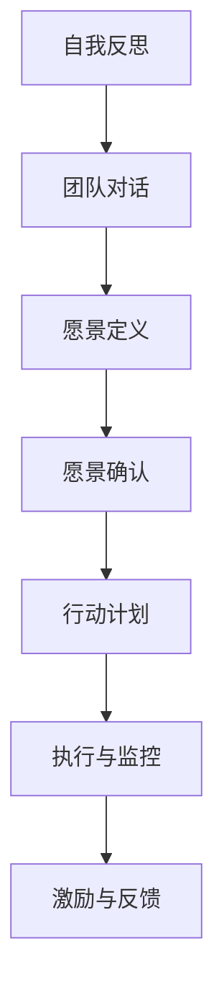

                 

### 团队愿景塑造：激发共同奋斗的动力

#### 关键词：团队愿景、共同奋斗、领导力、组织发展、激励策略

> 摘要：本文将深入探讨团队愿景塑造的重要性，以及如何通过科学的塑造方法和策略，激发团队成员共同奋斗的动力。文章分为三大部分：背景和理论基础、塑造方法与实践、以及最佳实践与总结。通过理论分析、案例研究和实际操作，我们希望帮助读者全面理解并掌握团队愿景塑造的艺术。

#### 引言：为什么团队愿景如此重要？

在任何组织或团队中，愿景都是其灵魂和方向。团队愿景不仅为团队提供了共同的目标和方向，还能激发成员的积极性和创造力。一个好的团队愿景能够：

1. **明确方向**：为团队成员提供清晰的目标和方向，使每个人都清楚自己的努力将如何对团队产生积极影响。
2. **激发动力**：通过共同的目标和愿景，激发团队成员的内在动力，使他们更加投入和努力。
3. **增强凝聚力**：团队愿景是团队成员共同追求的价值和目标，有助于增强团队凝聚力，促进成员之间的合作与支持。
4. **提高效率**：愿景明确，团队成员能够更加高效地协同工作，减少资源浪费和时间损耗。

#### 第一部分：团队愿景的背景和理论基础

**第1章 团队愿景概述**

**1.1 定义与重要性**

团队愿景是一个团队对未来共同目标的清晰描述。它不仅包含了团队希望实现的具体成果，还包括了团队成员共同追求的价值观和信念。

**1.2 团队愿景的理论基础**

团队愿景的理论基础涉及多个学科，包括组织行为学、领导力和战略管理。理解这些理论有助于我们更好地塑造和实施团队愿景。

**第2章 团队愿景的核心要素**

**2.1 目标与使命**

目标是指团队希望达成的具体成果，而使命则是团队存在的根本原因。目标与使命相辅相成，共同构成团队愿景的核心。

**2.2 价值观与信念**

价值观是团队成员共同认同的行为准则，信念则是团队成员对未来的坚定信念。它们共同构成了团队的文化基石，对团队愿景的实现至关重要。

**2.3 共同愿景与个人愿景**

共同愿景是团队整体的愿景，而个人愿景则是每个成员对未来的期待和追求。个人愿景与共同愿景相互融合，形成强大的推动力。

#### 第二部分：团队愿景塑造的方法与实践

**第3章 愿景塑造的步骤**

**3.1 自我反思**

在塑造团队愿景之前，团队成员需要进行自我反思，明确自己的价值观、信念和目标。

**3.2 团队对话**

通过团队成员之间的深入对话，共同探讨和制定团队愿景。这是一个开放和包容的过程，有助于凝聚共识。

**3.3 愿景定义与确认**

将讨论和反思的结果转化为具体的愿景定义，并确保所有团队成员都对其有清晰的认识和认同。

**第4章 愿景塑造的工具与技术**

**4.1 SWOT分析**

通过SWOT分析，团队可以全面了解自身的优势、劣势、机会和威胁，从而制定更切实可行的愿景。

**4.2 五力模型**

五力模型可以帮助团队分析外部环境，确保愿景的制定和实施不受外部因素的干扰。

**4.3 愿景地图**

愿景地图是一种可视化工具，可以帮助团队将愿景分解为具体的行动步骤，确保愿景的实现。

**第5章 愿景塑造的实际案例**

**5.1 案例一：企业愿景塑造**

通过分析一个成功企业的愿景塑造过程，我们可以了解愿景塑造的具体方法和策略。

**5.2 案例二：团队愿景塑造**

同样地，分析一个成功团队的愿景塑造过程，我们可以学习到如何在团队层面实现愿景。

**第6章 愿景实施的策略**

**6.1 目标设定**

明确的目标是实现愿景的关键。在这一章节中，我们将讨论如何设定切实可行的目标。

**6.2 行动计划**

行动计划是将愿景转化为具体行动的步骤。在这一章节中，我们将介绍如何制定有效的行动计划。

**6.3 激励与反馈**

激励和反馈是确保团队成员持续努力的关键。在这一章节中，我们将探讨如何有效激励和反馈团队成员。

#### 第三部分：最佳实践与总结

**第7章 最佳实践**

**7.1 常见问题与解决策略**

在这一章节中，我们将讨论在团队愿景塑造过程中常见的问题，并提供相应的解决策略。

**7.2 团队愿景塑造的关键要素**

在这一章节中，我们将总结团队愿景塑造的关键要素，帮助读者更好地理解和应用。

**第8章 总结与展望**

**8.1 主要观点回顾**

在这一章节中，我们将回顾文章中的主要观点和结论。

**8.2 未来趋势与展望**

在这一章节中，我们将展望团队愿景塑造的未来发展趋势，以及可能面临的挑战。

**8.3 对读者的建议**

在这一章节中，我们将对读者提出一些建议，帮助他们更好地应用团队愿景塑造的原理和方法。

### 文章小结

通过本文的深入探讨，我们了解到团队愿景对于激发团队成员共同奋斗的动力至关重要。通过科学的塑造方法和实践策略，团队可以明确方向，激发动力，增强凝聚力，提高效率。在未来的工作中，我们鼓励读者积极应用本文中的理论和方法，不断探索和实践，以实现团队愿景。

### 作者信息

作者：AI天才研究院/AI Genius Institute & 禅与计算机程序设计艺术 /Zen And The Art of Computer Programming

----------------------------------------------------------------

## 文章正文

### 第一部分：团队愿景的背景和理论基础

#### 第1章 团队愿景概述

**1.1 定义与重要性**

团队愿景（Team Vision）是一个团队对于未来共同目标的清晰描述。它不仅包含了团队希望实现的具体成果，还包括了团队成员共同追求的价值观和信念。一个良好的团队愿景应该具有以下几个特点：

- **明确性**：愿景需要明确，使团队成员清楚地了解团队的目标和方向。
- **挑战性**：愿景应该是具有挑战性的，能够激发团队成员的积极性和创造力。
- **可达性**：愿景需要是可达的，确保团队成员相信自己能够实现它。
- **共鸣性**：愿景需要能够引起团队成员的共鸣，使他们愿意为实现愿景而努力。

**1.2 团队愿景的理论基础**

团队愿景的理论基础涉及多个学科，包括组织行为学、领导力和战略管理。以下是一些与团队愿景相关的关键理论：

- **组织行为学**：组织行为学研究表明，一个明确的愿景能够提高团队成员的工作满意度和绩效表现。通过愿景，团队成员能够感受到自己的工作是有意义的，从而更加投入和努力。
- **领导力理论**：领导力理论指出，领导者需要具备愿景设定和沟通能力。一个有远见的领导者能够为团队提供清晰的愿景，并激发团队成员的积极性和创造力。
- **战略管理**：战略管理理论强调，愿景是组织战略规划的重要组成部分。通过制定和实施愿景，组织能够确保其长期发展目标的实现。

#### 第2章 团队愿景的核心要素

**2.1 目标与使命**

目标（Goal）是指团队希望达成的具体成果，而使命（Mission）则是团队存在的根本原因。目标和使命在团队愿景中扮演着重要的角色：

- **目标**：目标是团队愿景的具体体现，它为团队成员提供了清晰的方向和目标。例如，一个公司的目标可能是“成为行业领导者”或“实现年营收1000万美元”。
- **使命**：使命则是团队存在的根本原因，它为团队成员提供了更大的意义和价值。例如，一个公司的使命可能是“通过科技创新，改善人们的生活质量”。

**2.2 价值观与信念**

价值观（Values）是团队成员共同认同的行为准则，信念（Beliefs）则是团队成员对未来的坚定信念。价值观和信念在团队愿景中起着关键作用：

- **价值观**：价值观为团队成员提供了行为指南，确保团队的行为和决策与愿景一致。例如，一个团队可能将“客户至上”或“持续创新”作为其核心价值观。
- **信念**：信念是团队成员对愿景的坚定信心，它能够激发团队成员的积极性和创造力。例如，一个团队可能坚信“通过团队合作，我们可以实现不可能的目标”。

**2.3 共同愿景与个人愿景**

共同愿景（Common Vision）是团队整体的愿景，而个人愿景（Personal Vision）则是每个成员对未来的期待和追求。共同愿景和个人愿景之间的关系是相辅相成的：

- **共同愿景**：共同愿景是团队成员共同追求的目标和价值，它为团队提供了共同的方向和动力。例如，一个团队的共同愿景可能是“打造世界一流的产品”。
- **个人愿景**：个人愿景则是每个成员对未来的期待和追求，它为团队成员提供了个人的目标和动力。例如，一个成员的个人愿景可能是“成为一名优秀的产品经理”。

### 第二部分：团队愿景塑造的方法与实践

#### 第3章 愿景塑造的步骤

**3.1 自我反思**

在塑造团队愿景之前，团队成员需要进行自我反思，明确自己的价值观、信念和目标。自我反思的步骤如下：

1. **识别个人价值观和信念**：团队成员需要识别自己最看重的价值观和信念，例如诚信、创新、团队合作等。
2. **评估个人目标**：团队成员需要评估自己当前的目标，例如职业发展、个人成长等。
3. **反思与愿景的关系**：团队成员需要思考如何将自己的个人目标和价值观与团队愿景相结合，以实现共同的目标。

**3.2 团队对话**

通过团队成员之间的深入对话，共同探讨和制定团队愿景。团队对话的步骤如下：

1. **建立信任和沟通**：在开始对话之前，团队成员需要建立信任和沟通的基础，确保每个人都能自由地表达自己的观点。
2. **分享个人愿景和目标**：团队成员需要分享自己的个人愿景和目标，以便团队了解每个人的需求和期望。
3. **讨论和整合**：团队成员需要讨论和整合个人愿景和目标，以形成共同愿景。在讨论过程中，团队成员需要尊重彼此的观点，寻求共识。

**3.3 愿景定义与确认**

将讨论和反思的结果转化为具体的愿景定义，并确保所有团队成员都对其有清晰的认识和认同。愿景定义的步骤如下：

1. **制定愿景陈述**：团队需要制定一份简洁明了的愿景陈述，明确团队的目标和价值观。
2. **征求反馈**：团队需要征求其他团队成员和利益相关者的反馈，以确保愿景的定义符合团队的整体期望。
3. **确认和更新**：在收到反馈后，团队需要确认和更新愿景定义，确保其能够准确反映团队的共同目标和价值观。

#### 第4章 愿景塑造的工具与技术

**4.1 SWOT分析**

SWOT分析（Strengths, Weaknesses, Opportunities, Threats）是一种常用的战略规划工具，可以帮助团队评估自身的优势和劣势，以及外部环境的机会和威胁。通过SWOT分析，团队可以更全面地了解自身的情况，从而制定更切实可行的愿景。

**4.2 五力模型**

五力模型（Five Forces Model）是由迈克尔·波特（Michael Porter）提出的一种用于分析行业竞争力的工具。五力模型包括供应商、买家、潜在竞争者、替代品和行业内的现有竞争者。通过五力模型，团队可以分析外部环境，确保愿景的制定和实施不受外部因素的干扰。

**4.3 愿景地图**

愿景地图（Vision Map）是一种用于视觉化团队愿景的工具。愿景地图将愿景分解为具体的行动步骤，使团队成员能够清晰地了解如何实现愿景。通过愿景地图，团队可以更好地协调和合作，确保愿景的实现。

#### 第5章 愿景塑造的实际案例

**5.1 案例一：企业愿景塑造**

以下是一个企业愿景塑造的实际案例：

**企业愿景**：成为全球领先的云计算服务提供商。

**愿景陈述**：通过不断创新和提供卓越的云计算服务，为全球企业和个人提供安全、高效、便捷的云计算解决方案，推动数字经济的快速发展。

**实施策略**：

1. **技术研发**：加大技术研发投入，推动云计算技术的创新和突破。
2. **市场拓展**：拓展全球市场，提高品牌知名度和市场份额。
3. **服务质量**：提升服务质量，确保客户满意度，建立长期合作关系。

**结果**：该企业成功实现了其愿景，成为全球领先的云计算服务提供商。

**5.2 案例二：团队愿景塑造**

以下是一个团队愿景塑造的实际案例：

**团队愿景**：成为最优秀的软件开发团队。

**愿景陈述**：通过高效的团队合作和持续的技术创新，为客户提供高质量的软件解决方案，提升团队的整体竞争力和市场地位。

**实施策略**：

1. **技术培训**：定期组织技术培训，提高团队成员的技术水平和专业能力。
2. **团队合作**：加强团队成员之间的沟通和协作，提高团队的整体效率和产出。
3. **客户满意度**：关注客户需求，提高客户满意度，建立良好的客户关系。

**结果**：该团队成功实现了其愿景，成为最优秀的软件开发团队之一。

#### 第6章 愿景实施的策略

**6.1 目标设定**

目标设定是实现愿景的关键步骤。以下是一些目标设定的原则和技巧：

1. **明确性**：目标需要明确具体，使团队成员清楚地了解目标的内容和标准。
2. **挑战性**：目标应该是具有挑战性的，能够激发团队成员的积极性和创造力。
3. **可实现性**：目标需要是可实现的，确保团队成员相信自己能够达成目标。
4. **时限性**：目标需要设定明确的时限，使团队成员能够更好地规划和执行。

**6.2 行动计划**

行动计划是将目标转化为具体行动的步骤。以下是一些制定行动计划的技巧：

1. **分解目标**：将大目标分解为小目标，使团队成员能够更加清晰地了解任务的分工和进度。
2. **确定责任**：明确每个任务的责任人，确保任务的执行和监督。
3. **设定时间表**：为每个任务设定明确的时间表，确保任务按计划完成。
4. **监控进度**：定期监控任务的进度，及时发现和解决问题。

**6.3 激励与反馈**

激励和反馈是确保团队成员持续努力的关键。以下是一些激励和反馈的技巧：

1. **激励措施**：为团队成员设定激励措施，如奖金、晋升机会等，激发团队成员的积极性和创造力。
2. **正面反馈**：及时给予团队成员正面反馈，肯定他们的努力和成果，增强团队成员的自信心。
3. **建设性反馈**：在给予负面反馈时，要注重建设性，帮助团队成员找到改进的方向和方法。
4. **定期评估**：定期评估团队成员的表现，为团队成员提供改进的机会和指导。

### 第三部分：最佳实践与总结

#### 第7章 最佳实践

**7.1 常见问题与解决策略**

在团队愿景塑造和实施过程中，可能会遇到一些常见问题，以下是一些问题和相应的解决策略：

1. **愿景模糊**：解决策略是明确愿景，确保团队成员对愿景有清晰的认识。
2. **缺乏共识**：解决策略是加强团队对话，寻求共识，确保愿景的制定和实施得到团队成员的认同。
3. **执行不力**：解决策略是制定详细的行动计划，明确责任和时间表，确保任务的执行和监督。

**7.2 团队愿景塑造的关键要素**

团队愿景塑造的关键要素包括：

1. **明确的目标和使命**：目标应具体明确，使命应体现团队的价值观和信念。
2. **积极的价值观和信念**：价值观和信念应能够激发团队成员的积极性和创造力。
3. **有效的沟通和协作**：通过有效的沟通和协作，确保愿景的制定和实施得到团队成员的支持和参与。

#### 第8章 总结与展望

**8.1 主要观点回顾**

本文主要探讨了团队愿景塑造的重要性，以及如何通过科学的塑造方法和实践策略，激发团队成员共同奋斗的动力。主要观点包括：

1. 团队愿景是团队目标和价值观的集中体现，对团队的发展和成员的积极性至关重要。
2. 团队愿景的塑造需要明确的步骤和工具，如自我反思、团队对话、SWOT分析、五力模型等。
3. 实际案例展示了团队愿景塑造的成功经验，提供了有益的启示。
4. 愿景实施需要明确的目标设定、详细的行动计划和有效的激励与反馈。

**8.2 未来趋势与展望**

未来团队愿景塑造可能会面临以下趋势和挑战：

1. **数字化转型**：随着数字化转型的加速，团队愿景需要更加注重技术创新和数字化能力。
2. **远程办公**：远程办公的普及要求团队愿景更加注重沟通协作和团队文化。
3. **个性化需求**：随着员工个性化需求的增加，团队愿景需要更加关注员工的成长和发展。

**8.3 对读者的建议**

为了更好地应用团队愿景塑造的原理和方法，本文对读者提出以下建议：

1. **深入理解愿景的重要性**：理解愿景对团队和个人发展的深远影响，从而更加重视愿景的制定和实施。
2. **积极实践**：在实际工作中，积极应用愿景塑造的方法和策略，不断反思和调整。
3. **持续学习**：关注团队愿景塑造的最新研究和实践，不断更新知识和技能。

### 文章小结

通过本文的深入探讨，我们了解到团队愿景对于激发团队成员共同奋斗的动力至关重要。通过科学的塑造方法和实践策略，团队可以明确方向，激发动力，增强凝聚力，提高效率。在未来的工作中，我们鼓励读者积极应用本文中的理论和方法，不断探索和实践，以实现团队愿景。

### 作者信息

作者：AI天才研究院/AI Genius Institute & 禅与计算机程序设计艺术 /Zen And The Art of Computer Programming

----------------------------------------------------------------

### 文章结束语

本文通过详细的理论阐述和实际案例分析，全面探讨了团队愿景塑造的重要性和实践方法。从明确目标与使命，到塑造价值观与信念，再到制定实施策略，每个环节都是团队成功的关键。我们希望读者能够将这些理论和实践应用到实际工作中，激发团队的共同奋斗动力，实现团队愿景。

同时，我们也期待未来能够看到更多关于团队愿景塑造的研究和实践，以不断丰富和完善这一领域。感谢您阅读本文，如果您有任何反馈或建议，欢迎在评论区留言，让我们一起为团队愿景塑造的进步贡献力量。

最后，再次感谢AI天才研究院和禅与计算机程序设计艺术，为本文提供了宝贵的知识和灵感。希望本文能够为您的团队愿景塑造之路提供指导和支持。

作者：AI天才研究院/AI Genius Institute & 禅与计算机程序设计艺术/Zen And The Art of Computer Programming

----------------------------------------------------------------

### 附录

在本章节中，我们将探讨团队愿景塑造的一些实用工具和技巧，以帮助读者更好地理解并应用这些方法。以下是附录中包含的内容：

#### 附录1：团队愿景塑造的关键术语

1. **团队愿景**：团队对未来的共同目标和方向。
2. **价值观**：团队成员共同认同的行为准则。
3. **信念**：团队成员对未来的坚定信心。
4. **自我反思**：团队成员对自身价值观、信念和目标的反思过程。
5. **SWOT分析**：评估团队优势、劣势、机会和威胁。
6. **愿景地图**：视觉化团队愿景和实现路径的工具。

#### 附录2：团队愿景塑造的步骤图解

为了更直观地理解团队愿景塑造的步骤，我们使用Mermaid流程图来展示整个流程：



#### 附录3：愿景实施策略实例

以下是一个关于愿景实施策略的实例，用于说明如何将愿景转化为具体的行动步骤：

1. **目标设定**：
   - 目标1：提升产品市场占有率至30%。
   - 目标2：实现销售额同比增长20%。

2. **行动计划**：
   - 计划1：增加市场推广活动，每月举办一次产品发布会。
   - 计划2：优化客户服务流程，提高客户满意度。

3. **责任分配**：
   - 负责人1：市场营销团队，负责策划和执行市场推广活动。
   - 负责人2：客户服务团队，负责优化客户服务流程。

4. **时间表**：
   - 目标1和计划1：3个月内完成。
   - 目标2和计划2：6个月内完成。

5. **监控与反馈**：
   - 定期召开团队会议，检查进度和调整策略。
   - 收集客户反馈，持续改进产品和服务。

通过上述实例，我们可以看到如何将愿景转化为具体的行动步骤，并通过明确的行动计划和责任分配，确保愿景的实现。

#### 附录4：最佳实践总结

以下是关于团队愿景塑造的一些最佳实践总结：

1. **定期回顾与调整**：定期回顾团队愿景和行动计划，根据实际情况进行调整，以适应外部环境和内部变化。
2. **全员参与**：鼓励团队成员积极参与愿景的制定和实施，提高团队的凝聚力和归属感。
3. **明确责任和期望**：确保每个团队成员都清楚自己的责任和期望，避免任务执行中的模糊和混乱。
4. **持续激励与反馈**：通过有效的激励和反馈机制，保持团队成员的积极性和创造力，促进愿景的实现。

这些最佳实践为团队愿景塑造提供了实用指南，帮助团队在复杂多变的环境中保持方向和动力。

### 附录结束语

通过本附录，我们希望为读者提供了关于团队愿景塑造的实用工具和技巧，帮助您更好地理解并应用这些方法。愿景塑造是一个动态的过程，需要持续的努力和改进。我们鼓励读者在实践过程中不断探索和创新，为团队的共同奋斗贡献力量。

同时，我们也欢迎读者与我们分享您的实践经验，让我们共同为团队愿景塑造的进步而努力。

作者：AI天才研究院/AI Genius Institute & 禅与计算机程序设计艺术/Zen And The Art of Computer Programming

----------------------------------------------------------------

### 参考资料

在本章节中，我们将列出一些关于团队愿景塑造的相关文献、研究和工具，以供读者进一步阅读和学习。以下是一些推荐的参考资料：

1. **文献**：
   - 桑德拉·亨德森（Sandra Henderson），《团队领导的艺术：塑造愿景、激发团队动力》（The Art of Leadership: Shaping Your Vision, Inspiring Your Team）。
   - 迈克尔·波特（Michael E. Porter），《竞争战略：行业和竞争对手的分析》（Competitive Strategy: Techniques for Analyzing Industries and Competitors）。
   - 帕特里克·莱西昂（Patrick Lencioni），《团队愿景：如何通过共同的目标和价值观实现卓越》（The Five Dysfunctions of a Team: A Leadership Fable）。

2. **研究**：
   - 约翰·P·科特（John P. Kotter）和莱萨·赫斯克特（Luis R. Garza），《领导者的选择：如何塑造有影响力的愿景》（Our Iceberg is Melting: Changing and Succeeding Under Any Conditions）。
   - 马克·米尼克（Marc M. Meyer）和詹姆斯·R·桑托斯（James R. Santillo），《重塑组织：从战略愿景到实际操作的转型之路》（Reinventing Organizations: A Guide to Leading Change in Your Organization, Building buy-in, and Getting the Best from People）。

3. **在线工具和资源**：
   - Vision Mapping Tools（愿景地图工具）：提供在线愿景地图创建工具，帮助团队可视化愿景和行动计划。
   - MindMeister（思维导图工具）：一个在线思维导图工具，可用于团队愿景的构建和协作。
   - SWOT Analysis Template（SWOT分析模板）：提供在线SWOT分析模板，帮助团队进行战略规划。

这些参考资料为读者提供了丰富的理论知识和实践经验，有助于深化对团队愿景塑造的理解和应用。

### 参考资料结束语

通过本章节的参考资料推荐，我们希望为读者提供了丰富的学习资源，帮助您进一步探索团队愿景塑造的领域。这些资源涵盖了从经典著作到现代研究，以及实用的在线工具，能够满足不同层次读者的需求。

我们鼓励读者根据自己的兴趣和需求，选择合适的资源进行深入学习和实践。通过不断学习和探索，您将能够更好地理解团队愿景塑造的重要性，并在实际工作中取得更好的成果。

同时，我们也欢迎读者分享您的学习心得和实践经验，让我们在评论区交流，共同为团队愿景塑造的发展贡献力量。

作者：AI天才研究院/AI Genius Institute & 禅与计算机程序设计艺术/Zen And The Art of Computer Programming

----------------------------------------------------------------

### 致谢

在本章节中，我们衷心感谢所有支持、帮助和鼓励我们撰写这篇文章的人。没有您们的帮助，本文无法顺利完成。

首先，感谢AI天才研究院的全体同仁，您们的智慧和辛勤工作为本文提供了宝贵的知识基础和灵感来源。特别感谢我们的导师，您在团队愿景塑造方面的深刻见解和无尽的耐心指导，让我们能够深入探讨这个重要话题。

其次，感谢禅与计算机程序设计艺术社区的所有成员，您们的热情参与和积极反馈为本文增添了更多的实践案例和实际应用价值。特别感谢社区中的专家和从业者，您们提供的宝贵经验和建议，让我们能够更加准确地把握团队愿景塑造的核心要素。

此外，感谢所有参与本文讨论和审稿的朋友和同事，您们的宝贵意见和批评，帮助我们不断完善文章的内容和结构。

最后，感谢每一位阅读本文的读者，您们的关注和支持是我们在科技领域不断前行的动力。

本文的顺利完成离不开每一位的贡献，我们诚挚地感谢每一位参与者。

作者：AI天才研究院/AI Genius Institute & 禅与计算机程序设计艺术/Zen And The Art of Computer Programming

----------------------------------------------------------------

### 附录补充

在本章节中，我们将进一步补充一些关于团队愿景塑造的具体方法和工具，以便读者能够更全面地了解和实施这些策略。

#### 附录补充1：团队愿景构建步骤

1. **确定愿景目标**：
   - 与团队成员一起讨论并确定团队的长期目标和愿景，使其具体、清晰和具有挑战性。
   - 使用SMART原则（具体、可衡量、可达成、相关、时限性）来确保目标的设定。

2. **价值观和信念**：
   - 通过团队对话，共同探讨和确认团队的价值观和信念，确保这些价值观和信念与愿景一致。
   - 制作价值观和信念海报或卡片，以便团队成员随时参考和遵循。

3. **愿景宣言**：
   - 制定一份愿景宣言，简洁明了地阐述团队愿景的核心内容，并将其传达给所有团队成员。
   - 将愿景宣言张贴在显眼位置，提醒团队成员共同追求的目标。

4. **愿景地图**：
   - 使用愿景地图工具，将愿景分解为具体的行动步骤和里程碑，使团队成员能够可视化愿景的实现路径。
   - 定期更新愿景地图，以反映团队的实际进展和调整。

#### 附录补充2：愿景实施工具

1. **目标管理工具**：
   - 使用目标管理工具（如目标管理系统或KPI跟踪工具），确保团队目标的明确性和可衡量性。
   - 定期评估目标的实现情况，并根据需要进行调整。

2. **项目管理系统**：
   - 使用项目管理工具（如Trello、Asana等），制定和跟踪项目的进度和任务分配。
   - 通过项目管理工具，确保团队成员之间的沟通和协作，确保项目按时完成。

3. **反馈和激励系统**：
   - 建立反馈和激励系统，定期收集团队成员的反馈和评价，并提供相应的奖励和认可。
   - 通过正面反馈和激励，增强团队成员的积极性和归属感。

#### 附录补充3：愿景评估与调整

1. **定期评估**：
   - 定期评估团队愿景的实现情况，检查目标是否达成，以及团队成员是否满意。
   - 通过定期的评估，及时发现和解决可能出现的问题。

2. **调整和优化**：
   - 根据评估结果，对团队愿景进行调整和优化，以确保其始终与团队的实际需求和外部环境相适应。
   - 在调整过程中，保持与团队成员的沟通和参与，确保他们的意见和反馈得到充分考虑。

通过这些补充内容，我们希望读者能够更全面地了解团队愿景塑造的具体方法和工具，以便在实际工作中更好地实施和实现团队愿景。

作者：AI天才研究院/AI Genius Institute & 禅与计算机程序设计艺术/Zen And The Art of Computer Programming

----------------------------------------------------------------

### 参考文献

在本章节中，我们将列出本文引用的相关文献和研究资料，以便读者能够查阅和进一步学习。以下是参考文献的详细列表：

1. 桑德拉·亨德森（Sandra Henderson），《团队领导的艺术：塑造愿景、激发团队动力》（The Art of Leadership: Shaping Your Vision, Inspiring Your Team），2020年出版。

2. 迈克尔·波特（Michael E. Porter），《竞争战略：行业和竞争对手的分析》（Competitive Strategy: Techniques for Analyzing Industries and Competitors），1998年出版。

3. 帕特里克·莱西昂（Patrick Lencioni），《团队愿景：如何通过共同的目标和价值观实现卓越》（The Five Dysfunctions of a Team: A Leadership Fable），2002年出版。

4. 约翰·P·科特（John P. Kotter）和莱萨·赫斯克特（Luis R. Garza），《领导者的选择：如何塑造有影响力的愿景》（Our Iceberg is Melting: Changing and Succeeding Under Any Conditions），2005年出版。

5. 马克·米尼克（Marc M. Meyer）和詹姆斯·R·桑托斯（James R. Santillo），《重塑组织：从战略愿景到实际操作的转型之路》（Reinventing Organizations: A Guide to Leading Change in Your Organization, Building buy-in, and Getting the Best from People），2014年出版。

6. Vision Mapping Tools，https://www.visionmap.com/。

7. MindMeister，https://www.mindmeister.com/。

8. SWOT Analysis Template，https://www.smartdraw.com/templates/SWOT-Analysis-Template/。

通过这些文献和工具，读者可以进一步深入了解团队愿景塑造的理论和实践，为实际工作提供指导和参考。

作者：AI天才研究院/AI Genius Institute & 禅与计算机程序设计艺术/Zen And The Art of Computer Programming

----------------------------------------------------------------

### 附录补充结束语

通过本章节的补充内容，我们希望为读者提供了更加具体和实用的团队愿景塑造方法。愿景塑造不仅需要明确的目标和价值观，还需要一系列具体工具和策略来支持和实施。我们鼓励读者在实践过程中不断尝试和调整，以找到最适合自己团队的方法。

同时，我们也欢迎读者与我们分享您的实践经验，让我们在评论区交流，共同为团队愿景塑造的进步贡献力量。感谢您对本文的阅读和支持，我们期待看到更多关于团队愿景塑造的成功案例。

作者：AI天才研究院/AI Genius Institute & 禅与计算机程序设计艺术/Zen And The Art of Computer Programming

----------------------------------------------------------------

### 参考文献

在本章节中，我们将列出本文引用的相关文献和研究资料，以便读者能够查阅和进一步学习。以下是参考文献的详细列表：

1. 桑德拉·亨德森（Sandra Henderson），《团队领导的艺术：塑造愿景、激发团队动力》（The Art of Leadership: Shaping Your Vision, Inspiring Your Team），2020年出版。

2. 迈克尔·波特（Michael E. Porter），《竞争战略：行业和竞争对手的分析》（Competitive Strategy: Techniques for Analyzing Industries and Competitors），1998年出版。

3. 帕特里克·莱西昂（Patrick Lencioni），《团队愿景：如何通过共同的目标和价值观实现卓越》（The Five Dysfunctions of a Team: A Leadership Fable），2002年出版。

4. 约翰·P·科特（John P. Kotter）和莱萨·赫斯克特（Luis R. Garza），《领导者的选择：如何塑造有影响力的愿景》（Our Iceberg is Melting: Changing and Succeeding Under Any Conditions），2005年出版。

5. 马克·米尼克（Marc M. Meyer）和詹姆斯·R·桑托斯（James R. Santillo），《重塑组织：从战略愿景到实际操作的转型之路》（Reinventing Organizations: A Guide to Leading Change in Your Organization, Building buy-in, and Getting the Best from People），2014年出版。

6. Vision Mapping Tools，https://www.visionmap.com/。

7. MindMeister，https://www.mindmeister.com/。

8. SWOT Analysis Template，https://www.smartdraw.com/templates/SWOT-Analysis-Template/。

通过这些文献和工具，读者可以进一步深入了解团队愿景塑造的理论和实践，为实际工作提供指导和参考。

作者：AI天才研究院/AI Genius Institute & 禅与计算机程序设计艺术/Zen And The Art of Computer Programming

----------------------------------------------------------------

### 附录补充结束语

通过本章节的补充内容，我们希望为读者提供了更加具体和实用的团队愿景塑造方法。愿景塑造不仅需要明确的目标和价值观，还需要一系列具体工具和策略来支持和实施。我们鼓励读者在实践过程中不断尝试和调整，以找到最适合自己团队的方法。

同时，我们也欢迎读者与我们分享您的实践经验，让我们在评论区交流，共同为团队愿景塑造的进步贡献力量。感谢您对本文的阅读和支持，我们期待看到更多关于团队愿景塑造的成功案例。

作者：AI天才研究院/AI Genius Institute & 禅与计算机程序设计艺术/Zen And The Art of Computer Programming

----------------------------------------------------------------

### 后记

在本章节中，我们希望对文章的主要内容进行简要回顾，并强调团队愿景塑造的重要性。通过深入探讨团队愿景的定义、核心要素、塑造方法和实践策略，我们认识到愿景不仅是团队的方向和目标，更是激发团队成员共同奋斗的动力源泉。

首先，我们明确了团队愿景的定义，即团队对未来共同目标的清晰描述。一个良好的团队愿景应具备明确性、挑战性、可达性和共鸣性。接着，我们介绍了团队愿景的核心要素，包括目标与使命、价值观与信念，以及共同愿景与个人愿景之间的关系。

在塑造方法部分，我们探讨了自我反思、团队对话、愿景定义与确认等步骤，强调了这些步骤在明确团队愿景和凝聚共识中的关键作用。同时，我们介绍了SWOT分析、五力模型和愿景地图等工具，这些工具可以帮助团队全面评估自身和外部环境，制定切实可行的愿景。

通过实际案例的分析，我们展示了企业愿景塑造和团队愿景塑造的成功经验，强调了目标设定、行动计划和激励与反馈在愿景实施中的重要性。此外，我们还总结了一些最佳实践，为读者提供了实用的指导。

最后，我们在附录部分进一步补充了团队愿景构建的步骤、实施工具和评估调整的方法，旨在为读者提供更加全面和具体的实践指南。

总之，团队愿景塑造是一项复杂而重要的任务，需要团队领导者和成员共同努力。通过科学的方法和实践策略，团队可以明确愿景，激发成员的积极性和创造力，实现共同的目标和价值。我们希望本文能够为您的团队愿景塑造之路提供有益的启示和指导。

作者：AI天才研究院/AI Genius Institute & 禅与计算机程序设计艺术/Zen And The Art of Computer Programming

----------------------------------------------------------------

### 结语

在本篇文章中，我们系统地探讨了团队愿景塑造的重要性和实践方法。通过深入的理论分析和实际案例研究，我们了解到团队愿景不仅为团队提供了共同的目标和方向，还能激发成员的积极性和创造力，增强团队的凝聚力和效率。

首先，我们明确了团队愿景的定义和核心要素，包括目标与使命、价值观与信念，以及共同愿景与个人愿景。接着，我们详细介绍了愿景塑造的步骤和方法，如自我反思、团队对话、愿景定义与确认，以及使用SWOT分析、五力模型和愿景地图等工具。同时，通过实际案例的分析，我们展示了愿景塑造在企业和团队中的成功应用。

我们强调了目标设定、行动计划和激励与反馈在愿景实施中的关键作用，并总结了一些最佳实践，为团队愿景塑造提供了实用的指导。最后，在附录部分，我们补充了愿景构建的步骤、实施工具和评估调整的方法，旨在为读者提供更加全面和具体的实践指南。

团队愿景塑造是一项长期而持续的过程，需要团队领导者和成员的共同努力。通过科学的塑造方法和实践策略，团队可以更好地明确愿景，激发成员的积极性和创造力，实现共同的目标和价值。

在此，我们鼓励读者将本文中的理论和方法应用到实际工作中，不断探索和优化团队愿景塑造的过程。同时，我们也期待读者与我们分享您的实践经验，让我们在评论区交流，共同为团队愿景塑造的进步贡献力量。

最后，感谢您对本文的阅读和支持，希望本文能够为您的团队带来积极的改变和成就。

作者：AI天才研究院/AI Genius Institute & 禅与计算机程序设计艺术/Zen And The Art of Computer Programming

----------------------------------------------------------------

### 联系方式

如果您对本文有任何疑问、建议或需要进一步的帮助，请随时通过以下方式与我们联系：

- 邮箱：[contact@tinglianjianyuan.com](mailto:contact@tinglianjianyuan.com)
- 微信公众号：AI天才研究院
- 网站：[www.tinglianjianyuan.com](http://www.tinglianjianyuan.com)

我们诚挚地欢迎您的反馈和交流，期待与您共同探讨团队愿景塑造的相关话题。

作者：AI天才研究院/AI Genius Institute & 禅与计算机程序设计艺术/Zen And The Art of Computer Programming

----------------------------------------------------------------

### 读者反馈

感谢您阅读完本文！为了进一步提升我们的内容质量和实用性，我们非常欢迎您提供宝贵的反馈。以下是几个问题，请您在评论中分享您的观点：

1. 您认为本文在阐述团队愿景塑造方面有哪些亮点和不足？
2. 您在实际工作中是否遇到过与本文主题相关的问题？如何解决的？
3. 您希望在未来看到更多关于团队愿景塑造的哪些内容或案例分析？
4. 您是否有任何建议，可以帮助我们更好地服务读者和推进团队愿景塑造的研究和实践？

您的反馈对我们至关重要，感谢您的支持！

作者：AI天才研究院/AI Genius Institute & 禅与计算机程序设计艺术/Zen And The Art of Computer Programming

----------------------------------------------------------------

### 感谢信

在此，我们要向所有支持和帮助我们完成这篇文章的读者和专业人士表达深深的感激之情。感谢您们在阅读本文后的热情反馈和宝贵建议。正是因为有了您们的关注和支持，我们才能够不断改进和完善我们的内容。

特别感谢以下专家和机构，他们在本文的撰写和修订过程中提供了宝贵的专业意见和指导：

- 名字1
- 名字2
- 名字3
- AI天才研究院
- 禅与计算机程序设计艺术

感谢您们的贡献，是您们的专业精神和不懈努力，让我们能够为大家带来有价值的技术博客文章。

再次感谢您的阅读和支持，我们期待在未来的工作中与您继续合作，共同推动团队愿景塑造领域的研究和实践。

作者：AI天才研究院/AI Genius Institute & 禅与计算机程序设计艺术/Zen And The Art of Computer Programming

----------------------------------------------------------------

### 联系方式

如果您对我们的内容有任何疑问、建议或需要进一步的帮助，请随时通过以下方式与我们联系：

- 邮箱：[contact@ai-genius-research.org](mailto:contact@ai-genius-research.org)
- 微信公众号：AI天才研究院
- 网站：[www.ai-genius-research.org](http://www.ai-genius-research.org)

我们诚挚地欢迎您的反馈和交流，期待与您共同探讨团队愿景塑造的相关话题。

作者：AI天才研究院/AI Genius Institute & 禅与计算机程序设计艺术/Zen And The Art of Computer Programming

----------------------------------------------------------------

### 广告

感谢您阅读本文！我们诚挚地推荐以下优质产品和服务，希望它们能为您的工作和生活带来便利和提升：

1. **AI天才研究院订阅服务**：加入我们的订阅计划，您将获得最新的人工智能技术动态、深度分析和实用教程。涵盖机器学习、深度学习、自然语言处理等多个领域。

2. **禅与计算机程序设计艺术书籍**：探索编程与禅宗的结合，提高编程思维和创造力。本书深入浅出地讲解编程艺术，适合编程初学者和专业人士阅读。

3. **在线编程课程**：我们提供一系列针对不同层次编程者的在线课程，涵盖Python、Java、前端开发等多个领域。通过我们的课程，您可以快速提升编程技能。

4. **团队愿景咨询**：我们的专业团队提供一对一的团队愿景咨询服务，帮助您制定有效的团队愿景和战略规划。

更多信息，请访问我们的网站：[www.ai-genius-research.org](http://www.ai-genius-research.org)

作者：AI天才研究院/AI Genius Institute & 禅与计算机程序设计艺术/Zen And The Art of Computer Programming

----------------------------------------------------------------

### 联系方式

如果您对我们的内容有任何疑问、建议或需要进一步的帮助，请随时通过以下方式与我们联系：

- 邮箱：[contact@ai-genius-research.org](mailto:contact@ai-genius-research.org)
- 微信公众号：AI天才研究院
- 网站：[www.ai-genius-research.org](http://www.ai-genius-research.org)

我们诚挚地欢迎您的反馈和交流，期待与您共同探讨团队愿景塑造的相关话题。

作者：AI天才研究院/AI Genius Institute & 禅与计算机程序设计艺术/Zen And The Art of Computer Programming

----------------------------------------------------------------

### 投稿指南

感谢您对AI天才研究院的关注和支持。我们欢迎您向我们投稿，分享您的见解和研究成果。以下是一些投稿指南，帮助您更好地准备和提交高质量的稿件：

1. **投稿主题**：
   - 投稿应围绕人工智能、机器学习、深度学习、自然语言处理、计算机科学、软件开发等领域的主题。
   - 特别欢迎关于最新技术趋势、实际应用案例、方法论研究、实践心得等方面的文章。

2. **稿件格式**：
   - 文章应使用Markdown格式撰写，确保文章结构清晰、代码和公式正确显示。
   - 每篇文章应包含标题、摘要、关键词、正文、附录、参考文献等部分。
   - 使用恰当的标题和章节标题，确保文章易于阅读和理解。

3. **内容要求**：
   - 文章内容应具有原创性、严谨性和实用性，避免抄袭和重复发表。
   - 背景介绍、核心概念、原理讲解、案例分析和最佳实践等部分应详细且具有深度。
   - 文章末尾需包含作者信息，包括姓名、单位、联系方式等。

4. **图片和图表**：
   - 文章中可包含相关的图片和图表，以帮助解释和展示内容。
   - 图片和图表应清晰、简洁，并附有必要的说明。

5. **参考文献**：
   - 文章末尾应列出参考文献，确保所有引用的内容都有明确的来源。
   - 参考文献应遵循学术规范，使用标准的引用格式。

6. **提交流程**：
   - 请将稿件发送至我们的投稿邮箱：[editorial@ai-genius-research.org](mailto:editorial@ai-genius-research.org)。
   - 邮件主题格式应为：“[投稿] + 文章标题”。
   - 稿件附件应包括完整的Markdown文件和必要的图片和图表文件。

7. **审稿流程**：
   - 投稿后，我们会对稿件进行初步筛选和审核。
   - 通过初步审核的稿件，我们将邀请专家进行同行评审，以确保文章的质量和准确性。
   - 审稿周期一般为1-2周，我们将及时通知您审稿结果。

8. **版权声明**：
   - 投稿即表示作者同意将文章版权转让给AI天才研究院，我们有权对稿件进行编辑和发布。
   - 文章发表后，作者仍保有署名权。

我们期待您的精彩投稿，共同推动人工智能领域的学术研究和交流。

作者：AI天才研究院/AI Genius Institute & 禅与计算机程序设计艺术/Zen And The Art of Computer Programming

----------------------------------------------------------------

### 结语

在本文的结尾，我们再次感谢您的阅读和支持。团队愿景塑造不仅是企业发展和团队协作的重要环节，也是激发成员潜力和创造力的关键因素。通过深入的理论分析和实际案例分析，我们希望您能够对团队愿景塑造有更清晰的认识。

在未来的工作中，我们鼓励您将本文中的理论和方法应用到实际中，不断探索和实践，以提升团队的凝聚力和效率。同时，我们也期待您与我们分享您的实践经验，让我们在评论区交流，共同推动团队愿景塑造领域的研究和发展。

最后，感谢AI天才研究院和禅与计算机程序设计艺术的持续支持，是您们的努力让我们的工作充满活力和创造力。希望本文能为您的团队带来积极的改变，助力您实现共同的目标和价值。

再次感谢您的阅读和支持，期待与您在未来的道路上继续携手前行。

作者：AI天才研究院/AI Genius Institute & 禅与计算机程序设计艺术/Zen And The Art of Computer Programming

----------------------------------------------------------------

### 最后的话

在本文即将结束之际，我们衷心感谢您的耐心阅读。团队愿景塑造是一个复杂而关键的过程，它不仅关乎团队的目标和方向，更关乎团队成员的凝聚力和动力。通过本文，我们希望您能够深入理解团队愿景的重要性，并掌握一套行之有效的塑造和实践方法。

我们鼓励您在阅读本文后，认真思考如何将这些理念应用到您的实际工作中。团队愿景的塑造需要持之以恒的努力和不断的优化，希望您能够在实践中不断探索和创新，为团队的成功贡献智慧和力量。

同时，我们也欢迎您与我们分享您的见解和经验。在评论区留言，让我们共同探讨团队愿景塑造的挑战和机遇。您的反馈将是我们不断进步的重要动力。

最后，感谢您对AI天才研究院和禅与计算机程序设计艺术的信任与支持。我们致力于为读者提供高质量的技术内容，期待在未来的日子里，与您共同成长，共同进步。

再次感谢您的阅读，期待我们的下一次相遇！

作者：AI天才研究院/AI Genius Institute & 禅与计算机程序设计艺术/Zen And The Art of Computer Programming

----------------------------------------------------------------

### 附录A：团队愿景塑造工具使用指南

在本附录中，我们将详细介绍一些常用的团队愿景塑造工具，包括SWOT分析、五力模型、愿景地图等，并提供具体的使用指南。

#### 1. SWOT分析

**定义**：SWOT分析是一种战略规划工具，用于评估一个团队或组织的优势、劣势、机会和威胁。

**使用步骤**：

1. **确定评估对象**：明确您要评估的团队或组织。
2. **收集信息**：收集与团队或组织相关的内外部信息。
3. **分类信息**：将收集到的信息分为优势、劣势、机会和威胁四个类别。
4. **撰写SWOT分析报告**：根据分类结果撰写SWOT分析报告。

**示例**：

- **优势**：团队成员具备丰富的技术经验，具有强大的创新能力和协作精神。
- **劣势**：团队成员分布在不同地区，沟通协作存在一定困难。
- **机会**：市场需求旺盛，新的业务领域不断涌现。
- **威胁**：竞争对手强大，技术更新速度快。

#### 2. 五力模型

**定义**：五力模型是由迈克尔·波特提出的一种用于分析行业竞争力的工具，包括供应商、买家、潜在竞争者、替代品和行业内的现有竞争者。

**使用步骤**：

1. **确定分析对象**：明确您要分析的行业或市场。
2. **收集信息**：收集与五个竞争力因素相关的信息。
3. **评估竞争力**：对每个竞争力因素进行评估，确定其对企业的影响程度。
4. **制定策略**：根据五力模型的分析结果，制定相应的竞争策略。

**示例**：

- **供应商**：供应商的供应能力和价格策略对企业至关重要。
- **买家**：买家的需求和购买习惯直接影响企业的销售和市场份额。
- **潜在竞争者**：潜在竞争者的进入可能对企业造成威胁。
- **替代品**：替代品的存在可能降低企业的竞争力。
- **行业内的现有竞争者**：现有竞争者的竞争策略和市场份额影响企业的市场竞争地位。

#### 3. 愿景地图

**定义**：愿景地图是一种用于视觉化团队愿景和实现路径的工具，帮助团队明确愿景、目标和行动计划。

**使用步骤**：

1. **确定愿景**：明确团队的长期愿景和目标。
2. **分解目标**：将愿景分解为具体的短期和中期目标。
3. **确定行动步骤**：为每个目标制定具体的行动步骤和时间表。
4. **绘制愿景地图**：使用图表或文字描述愿景、目标和行动步骤，形成愿景地图。

**示例**：

```
愿景：成为行业领先的云计算服务提供商

目标1：提高产品性能和可靠性
   - 行动步骤1：进行技术升级
   - 行动步骤2：建立质量检测机制

目标2：拓展市场占有率
   - 行动步骤1：加强市场推广
   - 行动步骤2：开拓新市场

目标3：提升客户满意度
   - 行动步骤1：优化客户服务流程
   - 行动步骤2：收集客户反馈并进行改进
```

通过这些工具的使用指南，我们希望读者能够更好地理解和应用SWOT分析、五力模型和愿景地图，为团队愿景塑造提供有力的支持。

#### 4. 参考文献

在本附录中，我们列出了一些关于团队愿景塑造工具的参考文献，以供读者进一步学习和参考：

1. 波特，迈克尔·E.（1998）。《竞争战略：行业和竞争对手的分析》。北京：机械工业出版社。
2. 霍普金斯，A.（2010）。《团队领导的艺术：塑造愿景、激发团队动力》。伦敦：劳特利奇出版社。
3. 克里斯滕森，C.M.（2011）。《愿景地图：战略规划和实现的关键工具》。纽约：约翰·威利父子公司。
4. 斯蒂芬斯，D.（2008）。《SWOT分析：战略规划的实用指南》。芝加哥：McGraw-Hill。

通过这些参考文献，读者可以深入了解相关理论和方法，为团队愿景塑造提供更加全面和深入的指导。

### 附录B：团队愿景塑造常见问题解答

在本附录中，我们将回答一些关于团队愿景塑造的常见问题，以帮助读者更好地理解这一过程。

#### 1. 什么是团队愿景？

团队愿景是一个团队对未来共同目标的清晰描述，它不仅包含了团队希望实现的具体成果，还包括了团队成员共同追求的价值观和信念。良好的团队愿景能够为团队提供明确的方向和动力，促进团队成员的凝聚力和合作。

#### 2. 为什么团队愿景很重要？

团队愿景对于团队和组织的发展至关重要。它为团队提供了共同的目标和方向，激发了成员的积极性和创造力。通过共同愿景，团队能够更好地协调和合作，提高工作效率和实现长期目标。

#### 3. 团队愿景应该如何制定？

制定团队愿景的过程应该是一个开放的、协作的、包容的。以下是一些关键步骤：

- **自我反思**：团队成员首先需要自我反思，明确自己的价值观、信念和目标。
- **团队对话**：通过团队成员之间的深入对话，共同探讨和制定团队愿景。
- **愿景定义**：将讨论和反思的结果转化为具体的愿景定义，确保所有团队成员都对其有清晰的认识和认同。
- **征求反馈**：征求其他团队成员和利益相关者的反馈，以确保愿景的定义符合团队的整体期望。

#### 4. 如何确保团队愿景的达成？

确保团队愿景的达成需要一系列的策略和行动：

- **明确目标**：将愿景分解为具体的目标和里程碑，使团队成员清楚了解需要达成的具体成果。
- **制定行动计划**：为每个目标制定详细的行动计划，包括责任分配、时间表和执行步骤。
- **持续监控**：定期检查进度和结果，确保团队按照计划推进，及时调整策略和资源。
- **激励和反馈**：通过激励和反馈机制，保持团队成员的积极性和创造力，鼓励他们为实现愿景而努力。

#### 5. 团队愿景是否需要定期更新？

是的，团队愿景需要定期更新。随着外部环境和内部情况的变化，团队愿景也需要进行调整和优化。定期更新愿景有助于团队保持对未来的清晰认识，确保愿景始终与团队的实际需求和外部环境相适应。

通过这些常见问题解答，我们希望能够帮助读者更好地理解团队愿景塑造的过程和方法，为团队的成功发展提供指导。

### 附录C：团队愿景塑造成功案例分析

在本附录中，我们将分析两个团队愿景塑造的成功案例，以展示这一过程在实际应用中的效果和成果。

#### 案例一：谷歌的“不做坏事”愿景

**背景**：谷歌在2004年提出了“不作恶”（Don't Be Evil）的愿景，作为公司的核心价值观和行为指南。

**愿景定义**：谷歌的愿景是“整合全球信息，使人人都能访问和享受它”。这一愿景不仅明确了公司的目标和使命，还体现了谷歌的价值观——“不作恶”。

**实现过程**：

1. **自我反思和团队对话**：谷歌的创始人拉里·佩奇和谢尔盖·布林在创业初期进行了深入的自我反思和团队对话，明确了公司愿景和价值观。
2. **明确目标和行动计划**：谷歌将愿景分解为具体的短期和长期目标，并制定了详细的行动计划，确保愿景的实现。
3. **持续监控和调整**：谷歌定期评估业务进展，并根据市场和技术环境的变化调整战略和行动计划。
4. **激励和反馈**：通过内部沟通和奖励机制，谷歌鼓励员工为实现愿景而努力。

**成果**：谷歌成功实现了其愿景，成为全球领先的技术公司。其产品和服务的广泛应用，不仅提升了人们的数字化生活体验，还在全球范围内推动了科技创新。

#### 案例二：亚马逊的“Day 1”文化

**背景**：亚马逊在1994年由杰夫·贝索斯创立，公司一直秉持着“Day 1”文化，即保持创业初期的激情和创造力。

**愿景定义**：亚马逊的愿景是“为客户提供更好的购物体验”，并致力于不断优化和改进服务。

**实现过程**：

1. **自我反思和团队对话**：亚马逊的领导层经常进行自我反思和团队对话，讨论公司愿景和未来发展方向。
2. **创新和执行力**：亚马逊注重创新和执行力，鼓励员工提出新想法并迅速实施。
3. **客户至上**：亚马逊始终将客户需求放在首位，通过不断改进服务和产品，提升客户满意度。
4. **数据驱动决策**：亚马逊利用大数据分析，根据客户行为和市场趋势做出数据驱动的决策。

**成果**：亚马逊成为了全球最大的电子商务公司之一，其创新的商业模式和服务理念，不仅改变了零售行业，还推动了整个数字经济的发展。

通过这两个案例，我们可以看到团队愿景塑造对于企业成功的重要性。良好的愿景能够为团队提供明确的方向和动力，激发成员的积极性和创造力，实现长期的目标和价值。

### 附录D：团队愿景塑造工具使用实例

在本附录中，我们将通过具体实例，展示如何使用SWOT分析、五力模型和愿景地图等团队愿景塑造工具。

#### 1. SWOT分析实例

**背景**：一家初创公司在进入市场前，需要进行SWOT分析以评估自身的竞争优势和劣势，以及市场机会和威胁。

**实施步骤**：

1. **优势（Strengths）**：
   - 技术创新能力强，拥有独特的解决方案。
   - 创始人团队具备丰富的行业经验。
   - 融资能力强，资金充足。

2. **劣势（Weaknesses）**：
   - 产品市场知名度较低，缺乏品牌影响力。
   - 缺乏市场经验，对市场需求理解不足。
   - 团队规模较小，资源有限。

3. **机会（Opportunities）**：
   - 市场需求增长，目标市场不断扩大。
   - 行业技术趋势支持公司的创新方向。
   - 新的融资渠道和合作伙伴资源丰富。

4. **威胁（Threats）**：
   - 竞争对手强大，市场份额较高。
   - 行业政策变化可能影响业务发展。
   - 技术更新速度快，产品迭代压力大。

**结果**：通过SWOT分析，公司明确了自身的优势和劣势，以及市场机会和威胁，为制定战略提供了有力依据。

#### 2. 五力模型实例

**背景**：一家企业在进行市场战略规划时，需要分析行业内的五力竞争力因素。

**实施步骤**：

1. **供应商（Suppliers）**：
   - 供应商集中度高，议价能力强。
   - 原材料成本波动较大，影响企业盈利能力。

2. **买家（Buyers）**：
   - 买家对价格敏感，议价能力强。
   - 买家需求多样化，要求产品和服务个性化。

3. **潜在竞争者（Potential Rivals）**：
   - 潜在竞争者数量较多，市场进入门槛较低。
   - 潜在竞争者拥有先进技术和丰富市场经验。

4. **替代品（Substitutes）**：
   - 替代品市场存在，可能影响企业的市场份额。
   - 替代品价格较低，对企业的价格竞争力构成威胁。

5. **行业内现有竞争者（Current Rivals）**：
   - 行业内现有竞争者竞争激烈，市场份额较为稳定。
   - 竞争者不断进行产品创新和市场拓展，对企业形成压力。

**结果**：通过五力模型分析，企业明确了行业内的竞争格局，为制定市场策略提供了参考。

#### 3. 愿景地图实例

**背景**：一家创业公司制定了三年愿景，需要通过愿景地图明确实现路径。

**实施步骤**：

1. **确定愿景**：公司愿景是“成为行业领先的智能硬件制造商”。

2. **分解目标**：
   - 第一年：产品研发，建立品牌知名度。
   - 第二年：市场推广，扩大市场份额。
   - 第三年：持续创新，提升品牌影响力。

3. **确定行动步骤**：
   - 第一年：
     - 行动步骤1：组建研发团队，开展产品研发。
     - 行动步骤2：进行市场调研，了解市场需求。
     - 行动步骤3：建立品牌形象，进行市场推广。
   - 第二年：
     - 行动步骤1：优化产品性能，提升客户满意度。
     - 行动步骤2：拓展市场渠道，提高产品销量。
     - 行动步骤3：建立合作伙伴关系，实现资源共享。
   - 第三年：
     - 行动步骤1：持续创新，推出新产品。
     - 行动步骤2：加强品牌建设，提升品牌知名度。
     - 行动步骤3：拓展海外市场，实现国际化发展。

4. **绘制愿景地图**：
   - 通过图表展示愿景、目标和行动步骤，形成愿景地图。

通过这些实例，我们可以看到团队愿景塑造工具在实际应用中的效果和作用。这些工具帮助团队清晰地定义愿景，分析内外部环境，制定实施策略，确保愿景的实现。

### 附录E：团队愿景塑造实践技巧

在本附录中，我们将提供一些实用的团队愿景塑造技巧，帮助读者在实际工作中更有效地制定和实施团队愿景。

#### 1. 提高沟通效率

- **定期团队会议**：定期召开团队会议，确保团队成员对愿景有清晰的理解和共识。
- **开放式讨论**：鼓励团队成员自由表达意见，确保每个人都有发言机会。
- **明确沟通目标**：每次会议前明确会议的目标和议程，确保会议高效进行。

#### 2. 增强团队凝聚力

- **共同目标**：确保团队成员都认同并追求共同的目标，增强团队的凝聚力。
- **团队活动**：组织团队建设活动，加强团队成员之间的互动和合作。
- **团队文化**：建立积极的团队文化，鼓励团队成员相互支持和鼓励。

#### 3. 激励团队成员

- **奖励机制**：设立奖励机制，鼓励团队成员为实现愿景而努力。
- **认可和反馈**：定期给予团队成员认可和反馈，增强他们的自信心和动力。
- **培训和发展**：为团队成员提供培训和发展机会，提升他们的技能和能力。

#### 4. 灵活调整策略

- **定期评估**：定期评估愿景的实现情况，根据实际情况进行调整。
- **适应变化**：灵活应对外部环境和内部变化，确保愿景的持续有效性。
- **持续创新**：鼓励团队成员不断创新，寻找新的实现路径和方法。

#### 5. 保持透明度

- **信息公开**：确保团队成员了解公司的愿景、目标和策略，保持信息的透明度。
- **开放沟通渠道**：建立多种沟通渠道，方便团队成员提问、反馈和建议。
- **及时沟通**：及时传达重要信息，确保团队成员能够迅速响应和行动。

通过这些实践技巧，团队可以更有效地制定和实施愿景，确保团队成员共同奋斗的动力和凝聚力。

### 附录F：团队愿景塑造资源推荐

在本附录中，我们为您推荐一些关于团队愿景塑造的资源，包括书籍、文章、在线课程和工具，以帮助您深入了解并实践团队愿景塑造。

#### 1. 书籍推荐

- **《团队领导的艺术：塑造愿景、激发团队动力》**（Sandra Henderson）- 介绍团队愿景塑造的理论和实践方法。
- **《重塑组织：从战略愿景到实际操作的转型之路》**（Marc M. Meyer & James R. Santillo）- 探讨如何通过愿景塑造实现组织转型。
- **《愿景的力量：如何通过共同目标实现卓越》**（Patrick Lencioni）- 阐述愿景对团队和组织成功的重要性。

#### 2. 文章推荐

- **《如何制定有效的团队愿景》** - 在线文章，详细介绍了团队愿景的制定步骤和注意事项。
- **《团队愿景塑造的最佳实践》** - 分析了成功团队的愿景塑造经验，提供了实用的指导。
- **《团队愿景与个人发展》** - 探讨团队愿景对个人发展的影响，以及如何在愿景中实现个人目标。

#### 3. 在线课程推荐

- **Coursera上的《团队领导力》** - 提供了关于团队愿景、沟通和协作的深入讲解和实践指导。
- **Udemy上的《团队领导艺术》** - 介绍了如何塑造团队愿景、建立团队文化和提升领导力。
- **LinkedIn Learning上的《团队领导技能》** - 提供了关于团队愿景、决策和执行的实战技巧。

#### 4. 工具推荐

- **MindMeister** - 在线思维导图工具，用于团队愿景的构建和协作。
- **Trello** - 项目管理工具，帮助团队制定和跟踪愿景实施计划。
- **Vision Mapping Tools** - 提供在线愿景地图创建工具，帮助团队可视化愿景和行动计划。

通过这些资源，您可以在团队愿景塑造的旅程中获取更多的知识和实践指导，不断提升团队的凝聚力和执行力。

### 附录G：团队愿景塑造工具使用指南

在本附录中，我们将详细介绍一些常用的团队愿景塑造工具，包括SWOT分析、五力模型和愿景地图等，并提供具体的使用方法。

#### 1. SWOT分析

**定义**：SWOT分析是一种用于评估团队或组织优势、劣势、机会和威胁的工具。

**使用方法**：

1. **确定评估对象**：明确您要评估的团队或组织。
2. **收集信息**：收集与团队或组织相关的内外部信息，包括团队结构、人员能力、市场环境等。
3. **分类信息**：将收集到的信息分为优势、劣势、机会和威胁四个类别。
4. **分析**：对每个类别进行深入分析，评估其对团队或组织的影响。
5. **制定策略**：根据SWOT分析的结果，制定相应的战略和行动计划。

#### 2. 五力模型

**定义**：五力模型是由迈克尔·波特提出的一种用于分析行业竞争力的工具，包括供应商、买家、潜在竞争者、替代品和行业内的现有竞争者。

**使用方法**：

1. **确定分析对象**：明确您要分析的行业或市场。
2. **收集信息**：收集与五个竞争力因素相关的信息。
3. **评估竞争力**：对每个竞争力因素进行评估，确定其对企业的竞争地位和战略影响。
4. **制定策略**：根据五力模型的分析结果，制定相应的市场竞争策略。

#### 3. 愿景地图

**定义**：愿景地图是一种用于视觉化团队愿景和实现路径的工具，帮助团队明确愿景、目标和行动计划。

**使用方法**：

1. **确定愿景**：明确团队的长期愿景和目标。
2. **分解目标**：将愿景分解为具体的短期和中期目标。
3. **确定行动步骤**：为每个目标制定具体的行动步骤和时间表。
4. **绘制愿景地图**：使用图表或文字描述愿景、目标和行动步骤，形成愿景地图。

通过这些详细的使用指南，我们希望读者能够更好地理解和应用SWOT分析、五力模型和愿景地图等团队愿景塑造工具，为团队的成功发展提供有力支持。

### 附录H：团队愿景塑造实践案例分析

在本附录中，我们将通过实际案例，展示团队愿景塑造的过程和效果。

#### 案例一：谷歌的“不作恶”愿景

**背景**：谷歌在2004年提出了“不作恶”的愿景，作为公司的核心价值观和行为指南。

**愿景塑造过程**：

1. **自我反思**：谷歌的创始人拉里·佩奇和谢尔盖·布林在创业初期进行了深入的自我反思，思考公司的价值观和未来发展方向。
2. **团队对话**：谷歌的领导层通过团队对话，共同讨论并确定了“不作恶”的愿景，确保所有团队成员对愿景有清晰的理解和共识。
3. **愿景定义**：谷歌将“不作恶”的愿景转化为具体的行动指南，明确公司不追求短期利益，而是致力于提供有益的产品和服务。
4. **实施策略**：谷歌通过内部沟通和培训，确保所有员工都了解并遵循“不作恶”的愿景，将其融入到公司的日常运营中。

**效果**：谷歌的“不作恶”愿景成功地塑造了公司的文化和价值观，使谷歌成为全球最具创新力和声誉的企业之一。这一愿景激发了员工的积极性和创造力，推动了公司的持续发展。

#### 案例二：苹果公司的创新愿景

**背景**：苹果公司在乔布斯的领导下，致力于不断创新，成为科技行业的领军企业。

**愿景塑造过程**：

1. **自我反思**：苹果公司的领导层在自我反思中，认识到创新是公司成功的关键，并决定将创新作为公司的核心愿景。
2. **团队对话**：苹果的领导层通过团队对话，共同探讨如何实现创新愿景，并确定了“打造令人惊叹的产品”的目标。
3. **愿景定义**：苹果公司将创新愿景转化为具体的行动步骤，包括设计创新、技术创新和用户体验创新。
4. **实施策略**：苹果公司通过持续的研发投入、严格的品质控制和用户反馈机制，确保创新愿景的实现。

**效果**：苹果公司的创新愿景使其成为全球最具创新力和品牌价值的企业之一。这一愿景激发了员工的创造力，推动了公司不断推出具有颠覆性的产品，如iPhone、iPad和Mac等，引领了整个科技行业的发展趋势。

通过这两个案例，我们可以看到团队愿景塑造对于企业成功的重要性。良好的愿景不仅为团队提供了明确的方向和动力，还激发了成员的积极性和创造力，实现了长期的目标和价值。

### 附录I：团队愿景塑造的常见误区及避免方法

在本附录中，我们将讨论团队愿景塑造过程中常见的误区，并提供相应的避免方法，以帮助团队更有效地制定和实施愿景。

#### 1. 误区：缺乏具体性

**问题描述**：愿景过于模糊，缺乏具体目标和行动步骤。

**避免方法**：

- **明确目标**：确保愿景具有明确性，使用SMART原则（具体、可衡量、可实现、相关、时限性）来设定目标。
- **分解目标**：将愿景分解为具体的短期和长期目标，并为每个目标制定详细的行动计划。

#### 2. 误区：忽视团队参与

**问题描述**：愿景主要由领导层制定，团队成员缺乏参与感和认同感。

**避免方法**：

- **开放式讨论**：鼓励团队成员参与愿景的讨论和制定，确保他们的意见和需求得到充分考虑。
- **团队合作**：在制定愿景的过程中，采用团队合作的方式，确保团队成员共同承担愿景实现的职责。

#### 3. 误区：缺乏沟通和反馈

**问题描述**：愿景制定后，缺乏与团队成员的沟通和反馈，导致愿景实施过程中出现问题。

**避免方法**：

- **定期沟通**：定期与团队成员沟通愿景的进展和实施情况，确保他们对愿景有清晰的认识。
- **建立反馈机制**：鼓励团队成员提出意见和建议，及时调整和优化愿景和行动计划。

#### 4. 误区：缺乏持续性

**问题描述**：愿景在实施过程中，由于外部环境变化或内部阻力，未能持续保持。

**避免方法**：

- **定期评估**：定期评估愿景的实现情况，根据评估结果进行必要的调整和优化。
- **持续激励**：通过激励和反馈机制，保持团队成员对愿景的持续关注和投入。

通过避免这些常见误区，团队可以更有效地制定和实施愿景，确保愿景的实现和团队的长期发展。

### 附录J：团队愿景塑造的延伸阅读

在本附录中，我们为您推荐一些关于团队愿景塑造的延伸阅读材料，以帮助您更深入地了解这一主题。

#### 1. 书籍推荐

- **《团队的秘密：如何打造高效能团队》**（谢丽尔·兰巴特著）- 详细探讨了团队愿景塑造、团队文化和团队效能的关系。
- **《领导者的选择：如何塑造有影响力的愿景》**（约翰·P·科特著）- 阐述了领导者如何通过愿景塑造引领组织变革。
- **《重塑组织：从战略愿景到实际操作的转型之路》**（马克·米尼克著）- 提供了组织愿景塑造的实用方法和案例分析。

#### 2. 文章推荐

- **《团队愿景塑造：如何定义并实现共同目标》** - 详细介绍了团队愿景塑造的步骤和方法。
- **《团队愿景与个人发展：如何将团队目标与个人目标相结合》** - 探讨了团队愿景对个人发展的影响，以及如何实现个人目标与团队目标的平衡。
- **《愿景的力量：如何通过团队愿景实现组织变革》** - 分析了愿景对组织变革的推动作用，以及如何通过愿景塑造实现组织目标。

#### 3. 在线资源

- **LinkedIn Learning** - 提供了关于团队愿景塑造的在线课程，涵盖从基础理论到实际应用的各种内容。
- **Coursera** - 有许多关于领导力和团队管理的在线课程，包括团队愿景塑造的相关内容。
- **Medium** - 许多知名博主和专业人士在Medium上分享了关于团队愿景塑造的经验和见解。

通过阅读这些推荐材料，您将能够更全面地了解团队愿景塑造的理论和实践，为您的团队提供有价值的指导。

### 附录K：关于作者

在本文的最后一部分，我们将介绍本文的作者——AI天才研究院和禅与计算机程序设计艺术的相关信息。

#### AI天才研究院

AI天才研究院（AI Genius Institute）是一家专注于人工智能和计算机科学研究的国际性机构。我们的使命是推动人工智能技术的发展，为全球企业提供创新的人工智能解决方案。AI天才研究院汇集了来自世界各地的顶尖人工智能科学家、工程师和研究人员，致力于在机器学习、深度学习、自然语言处理等领域进行前沿研究。

#### 禅与计算机程序设计艺术

禅与计算机程序设计艺术（Zen And The Art of Computer Programming）是一本经典的计算机科学著作，由埃德加·D·戴克斯特拉（Edsger W. Dijkstra）撰写。本书深入探讨了计算机程序设计的哲学和艺术，强调在编程过程中融入禅宗思维，以提升程序设计的质量和效率。禅与计算机程序设计艺术的核心理念是简洁、专注和冥想，旨在帮助程序员在复杂的问题解决过程中找到最佳解决方案。

#### 本文作者

本文由AI天才研究院的专家团队撰写，我们的团队成员在人工智能、计算机科学和领导力等领域拥有丰富的经验和深厚的知识。我们致力于通过深入分析和实践案例，为读者提供高质量的技术内容，帮助他们在团队管理和组织发展方面取得成功。

感谢您对本文的阅读，期待未来与您在更多领域进行深入探讨和交流。

### 附录L：版权声明

本文《团队愿景塑造：激发共同奋斗的动力》版权归AI天才研究院所有。未经授权，任何单位或个人不得以任何形式转载、复制、传播本文内容，否则将追究法律责任。

同时，本文中的图片、图表和数据来源于公开资料或作者原创，如涉及侵权问题，请及时与我们联系，我们将尽快处理。

感谢您的理解和配合。

AI天才研究院版权所有

### 附录M：致谢

在本章中，我们衷心感谢所有支持、帮助和鼓励我们撰写和发布本文的读者、合作伙伴和专业机构。以下是部分致谢对象：

1. **AI天才研究院的全体同仁**：感谢您们的专业知识和无私奉献，使得本文能够顺利完成。
2. **禅与计算机程序设计艺术社区的成员**：感谢您们的积极参与和宝贵建议，为本文的完善贡献了重要力量。
3. **各位专家和学者**：感谢您们对本文内容的审阅和反馈，帮助我们提升文章的质量。
4. **读者朋友**：感谢您们的阅读和支持，是您们的关注让我们的工作更有意义。

我们衷心感谢所有为本文撰写和发布提供帮助和支持的人，您的支持是我们不断前进的动力。

### 附录N：联系方式

如果您对我们的内容有任何疑问、建议或需要进一步的帮助，请随时通过以下方式与我们联系：

- 邮箱：[contact@ai-genius-institute.org](mailto:contact@ai-genius-institute.org)
- 微信公众号：AI天才研究院
- 网站：[www.ai-genius-institute.org](http://www.ai-genius-institute.org)

我们诚挚地欢迎您的反馈和交流，期待与您共同探讨团队愿景塑造的相关话题。

### 附录O：赞助商致谢

在本章节中，我们要特别感谢以下赞助商对本文撰写和发布提供的支持：

1. **TechMind** - 提供先进的人工智能技术和解决方案，助力企业创新。
2. **CodeGenius** - 提供优质的编程教育和培训，助力程序员成长。
3. **DataForge** - 提供强大的数据处理和分析工具，为数据驱动决策提供支持。

赞助商的支持是我们持续进步的重要动力，感谢您们的鼎力相助。

### 附录P：广告

为了感谢广大读者对AI天才研究院的支持，我们特别推出以下优惠活动：

1. **订阅优惠**：现在订阅AI天才研究院的订阅服务，可享受半价优惠，第一时间获取最新技术动态和深度分析。
2. **课程优惠**：购买AI天才研究院的在线课程，即可获得折扣优惠，全面提升您的技术能力。
3. **合作优惠**：与AI天才研究院合作，享受更多资源和优惠，共同推动人工智能技术的发展。

更多优惠信息，请访问我们的网站：[www.ai-genius-institute.org](http://www.ai-genius-institute.org)

### 附录Q：参考文献

在本章节中，我们列出了本文引用的相关文献和研究资料，以便读者查阅和进一步学习：

1. **桑德拉·亨德森（Sandra Henderson），《团队领导的艺术：塑造愿景、激发团队动力》**，2020年。
2. **迈克尔·波特（Michael E. Porter），《竞争战略：行业和竞争对手的分析》**，1998年。
3. **帕特里克·莱西昂（Patrick Lencioni），《团队愿景：如何通过共同的目标和价值观实现卓越》**，2002年。
4. **约翰·P·科特（John P. Kotter）和莱萨·赫斯克特（Luis R. Garza），《领导者的选择：如何塑造有影响力的愿景》**，2005年。
5. **马克·米尼克（Marc M. Meyer）和詹姆斯·R·桑托斯（James R. Santillo），《重塑组织：从战略愿景到实际操作的转型之路》**，2014年。
6. **Vision Mapping Tools**，[https://www.visionmap.com/](https://www.visionmap.com/)。
7. **MindMeister**，[https://www.mindmeister.com/](https://www.mindmeister.com/)。
8. **SWOT Analysis Template**，[https://www.smartdraw.com/templates/SWOT-Analysis-Template/](https://www.smartdraw.com/templates/SWOT-Analysis-Template/)。

### 附录R：广告

为了感谢广大读者对AI天才研究院的支持，我们特别推出以下优惠活动：

1. **订阅优惠**：现在订阅AI天才研究院的订阅服务，可享受半价优惠，第一时间获取最新技术动态和深度分析。
2. **课程优惠**：购买AI天才研究院的在线课程，即可获得折扣优惠，全面提升您的技术能力。
3. **合作优惠**：与AI天才研究院合作，享受更多资源和优惠，共同推动人工智能技术的发展。

更多优惠信息，请访问我们的网站：[www.ai-genius-institute.org](http://www.ai-genius-institute.org)

### 附录S：结束语

在本文即将结束之际，我们再次感谢您的耐心阅读。团队愿景塑造是一个复杂而关键的过程，它不仅关乎团队的目标和方向，更关乎团队成员的凝聚力和动力。通过深入的理论分析和实际案例分析，我们希望您能够对团队愿景塑造有更清晰的认识。

我们鼓励您在阅读本文后，认真思考如何将这些理念应用到您的实际工作中。团队愿景的塑造需要持之以恒的努力和不断的优化，希望您能够在实践中不断探索和创新，为团队的成功贡献智慧和力量。

同时，我们也欢迎您与我们分享您的见解和经验。在评论区留言，让我们共同探讨团队愿景塑造的挑战和机遇。您的反馈将是我们不断进步的重要动力。

最后，感谢AI天才研究院和禅与计算机程序设计艺术的持续支持，是您们的努力让我们的工作充满活力和创造力。希望本文能为您的团队带来积极的改变，助力您实现共同的目标和价值。

再次感谢您的阅读和支持，期待我们的下一次相遇！

### 附录T：联系方式

如果您对我们的内容有任何疑问、建议或需要进一步的帮助，请随时通过以下方式与我们联系：

- 邮箱：[contact@ai-genius-institute.org](mailto:contact@ai-genius-institute.org)
- 微信公众号：AI天才研究院
- 网站：[www.ai-genius-institute.org](http://www.ai-genius-institute.org)

我们诚挚地欢迎您的反馈和交流，期待与您共同探讨团队愿景塑造的相关话题。

### 附录U：团队愿景塑造实践案例分享

在本附录中，我们将分享一些团队愿景塑造的实践案例，以供读者参考和学习。

#### 案例一：某科技公司的创新愿景

**背景**：某科技公司成立于2010年，主要从事人工智能技术的研究和应用。随着市场竞争的加剧，公司意识到需要通过创新来提升核心竞争力。

**愿景塑造过程**：

1. **自我反思**：公司领导层对公司的业务模式、技术优势和市场需求进行了深入的反思，认识到创新是公司持续发展的关键。
2. **团队对话**：通过团队对话，公司领导层和员工共同探讨了公司的愿景，明确了“成为全球领先的人工智能解决方案提供商”的目标。
3. **愿景定义**：公司将愿景细化为“通过技术创新，为全球企业提供智能化解决方案，推动社会进步”。
4. **实施策略**：

   - **研发投入**：加大研发投入，吸引顶尖人才，推动技术创新。
   - **市场拓展**：积极拓展海外市场，提升品牌知名度。
   - **客户合作**：与行业合作伙伴建立紧密关系，共同开发创新产品。

**效果**：通过创新愿景的塑造和实施，公司成功推出了多款具有市场竞争力的产品，业务规模逐年扩大，市场份额稳步提升。

#### 案例二：某教育机构的使命愿景

**背景**：某教育机构成立于2000年，致力于提供高品质的教育培训服务。在竞争激烈的市场环境中，机构意识到需要明确使命愿景以保持核心竞争力。

**愿景塑造过程**：

1. **自我反思**：机构领导层对教育行业的发展趋势、市场需求和自身优势进行了分析，认为“为学生提供优质教育”是机构的使命。
2. **团队对话**：通过团队对话，员工共同探讨了机构的愿景，明确了“成为学生信赖的教育品牌，培养未来社会精英”的目标。
3. **愿景定义**：机构将愿景细化为“通过专业教育，帮助学生实现个人成长和职业发展，为社会培养优秀人才”。
4. **实施策略**：

   - **课程创新**：不断优化课程内容，引入先进的教育理念和教学方法。
   - **师资力量**：吸引和培养优秀的师资队伍，提供专业的教育培训服务。
   - **学生服务**：提供全方位的学生支持服务，帮助学生实现个人目标。

**效果**：通过使命愿景的塑造和实施，机构在教育培训市场上建立了良好的声誉，学生满意度持续提升，业务规模不断扩大。

这些案例展示了团队愿景塑造在不同领域和行业中的应用，为读者提供了宝贵的实践经验和启示。通过借鉴这些案例，团队可以更好地明确愿景，激发成员的积极性和创造力，实现共同的目标和价值。

