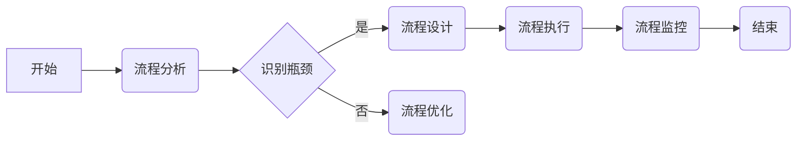

                 

# 团队效率：优化工作流程的方法

## 关键词
团队效率，工作流程优化，工作效率提升，流程分析，方法与实践，案例分析

## 摘要
本文旨在探讨团队效率的提升之道，特别是工作流程的优化方法。通过深入分析团队效率的背景，介绍相关核心概念，阐述工作流程优化的重要性和必要性，我们将一步步引导读者了解和掌握优化工作流程的具体方法。随后，通过实际案例的剖析，提供最佳实践建议，总结注意事项，为提升团队工作效率提供有价值的参考。

### 目录大纲

1. 引言
2. 团队效率的背景
3. 核心优化方法
   3.1 流程分析
   3.2 优化策略
   3.3 技术工具
4. 案例分析
5. 总结与展望
6. 最佳实践 Tips
7. 小结
8. 注意事项
9. 拓展阅读

## 引言
在当今快速变化的信息时代，团队效率已经成为企业竞争力的关键因素之一。高效的团队不仅能够迅速响应市场变化，还能够提高产品质量，降低成本，从而在激烈的竞争中脱颖而出。然而，许多团队在实际运作中面临着效率低下的问题，如沟通不畅、任务重复、资源浪费等。这些问题不仅降低了团队的工作效率，还影响了团队成员的积极性和满意度。

优化工作流程是提升团队效率的重要手段。工作流程的优化不仅仅是简单地增加人力资源或者引入新的工具，它涉及到对整个工作流程的全面分析、评估和改进。一个高效的工作流程能够减少不必要的步骤，消除瓶颈，提高资源的利用率，从而显著提升团队的整体效率。

本文将围绕团队效率和工作流程优化这两个核心主题，采用逻辑清晰、结构紧凑、简单易懂的写作方式，通过以下步骤进行分析和探讨：

- 首先，介绍团队效率的背景，探讨团队效率的重要性以及当前团队面临的主要挑战。
- 接着，详细阐述工作流程优化的重要性和必要性。
- 然后，介绍流程分析的方法和工具，提供优化策略的具体实施步骤。
- 随后，通过案例分析，展示工作流程优化在实际项目中的应用效果。
- 最后，总结最佳实践建议，提供注意事项，并推荐拓展阅读资源。

通过本文的深入分析，我们希望读者能够对团队效率和工作流程优化有更清晰的认识，掌握有效的优化方法，从而提升团队的整体工作效率。

### 团队效率的背景

#### 核心概念术语说明

在探讨团队效率之前，我们需要明确一些核心概念术语，以便于我们更准确地理解这一主题。

1. **团队效率**：团队效率指的是团队在完成特定任务或项目时，所表现出的工作效率和质量。它不仅包括团队成员之间的协作能力和个人技能，还涉及到工作流程的优化和资源的管理。
2. **工作效率**：工作效率是指团队成员在单位时间内完成工作量的能力。它通常通过任务完成时间、错误率、质量指标等来衡量。
3. **工作流程**：工作流程是指团队在完成某项任务时，所遵循的一系列步骤和方法。一个高效的工作流程应该能够减少不必要的环节，提高工作的连贯性和效率。
4. **瓶颈**：瓶颈是指在工作流程中，制约整个流程效率的某个关键环节或资源。解决瓶颈是提高工作流程效率的重要手段。

#### 问题背景

在当前的商业环境中，团队效率已成为企业竞争的关键因素。随着全球市场的竞争加剧和技术的快速发展，企业需要更加灵活和高效地应对市场变化。然而，许多企业在实际运作中面临着效率低下的问题。这主要体现在以下几个方面：

1. **沟通不畅**：团队成员之间的信息交流不充分，导致任务理解偏差，工作重复，甚至出现资源浪费。
2. **任务重复**：由于工作流程不合理，某些任务需要在多个环节重复执行，这不仅增加了工作负担，还降低了工作效率。
3. **资源浪费**：不合理的资源配置导致资源利用率低下，例如，某些关键资源得不到充分利用，而其他资源却长期闲置。
4. **决策延迟**：由于缺乏有效的决策流程，团队在关键决策上耗时过长，影响了项目的进展和效率。

#### 问题描述

团队效率低下的问题对企业和个人都带来了负面影响。对于企业而言，效率低下会导致项目延误、成本增加、市场机会丧失，甚至影响企业的长期竞争力。对于个人而言，长期在低效率环境中工作，不仅会影响工作满意度，还可能对职业发展和个人成长产生负面影响。

#### 问题解决

要解决团队效率低下的问题，需要从以下几个方面进行改进：

1. **优化沟通机制**：建立有效的沟通渠道和沟通机制，确保团队成员之间的信息能够及时、准确地传递。
2. **优化工作流程**：对现有工作流程进行全面分析，识别瓶颈和冗余环节，通过流程优化减少不必要的步骤，提高工作的连贯性和效率。
3. **合理配置资源**：根据任务需求合理配置资源，确保关键资源得到充分利用，避免资源浪费。
4. **加强决策流程**：建立科学的决策流程，提高决策效率，确保团队能够在关键时刻迅速做出决策。

#### 边界与外延

团队效率不仅局限于企业内部团队，还适用于各种类型的团队，如非营利组织、研究团队、教育团队等。此外，团队效率的提升不仅限于工作流程的优化，还包括团队文化建设、成员培训等多个方面。

#### 概念结构与核心要素组成

团队效率的概念结构可以分为以下几个核心要素：

1. **团队成员**：团队成员是团队效率的基础，他们的技能、经验和协作能力直接影响团队的整体效率。
2. **工作流程**：高效的工作流程是提升团队效率的关键，它包括任务的分配、执行、监控和反馈等环节。
3. **资源管理**：合理配置和利用资源是提高团队效率的重要手段，包括人力、财务、技术等资源。
4. **团队文化**：积极的团队文化能够增强团队成员的凝聚力和工作效率，包括信任、尊重、合作等价值观。

通过以上对团队效率背景的详细分析，我们可以更深入地理解团队效率的重要性以及当前团队所面临的问题。接下来，我们将进一步探讨工作流程优化的重要性和必要性。

### 核心概念与联系

#### 工作流程优化的重要性

工作流程优化是提升团队效率的关键手段。一个高效的工作流程能够提高任务完成的速度和质量，减少冗余步骤，降低错误率，从而提升整体工作效率。以下是工作流程优化的重要性和必要性：

1. **提升工作效率**：优化工作流程可以减少不必要的步骤，消除瓶颈，使得每个环节都能够高效运行，从而提升整个团队的工作效率。
2. **减少错误率**：通过规范化工作流程，确保每个环节都有明确的操作标准和检查机制，可以有效减少操作错误和沟通误差，提高工作质量。
3. **节约资源**：优化工作流程有助于合理配置资源，避免资源的浪费和重复使用，从而降低运营成本。
4. **增强团队协作**：优化后的工作流程能够更好地协调团队成员之间的工作，增强协作效果，提高团队的整体执行力。
5. **提高客户满意度**：高效的团队能够更快地响应客户需求，提供高质量的服务，从而提高客户满意度，增强市场竞争力。

#### 核心概念原理

工作流程优化的核心概念包括流程分析、流程设计、流程执行和流程监控。以下是这些核心概念的具体原理：

1. **流程分析**：流程分析是对现有工作流程进行全面评估和诊断的过程。通过流程分析，可以识别出流程中的瓶颈、冗余环节和潜在问题，为优化工作流程提供数据支持。
2. **流程设计**：流程设计是根据流程分析的结果，对现有流程进行重新设计和优化。通过流程设计，可以制定出更加高效、规范的工作流程，提高流程的整体运行效率。
3. **流程执行**：流程执行是按照优化后的工作流程进行操作的过程。流程执行需要确保每个步骤都按照设计要求进行，确保工作流程的顺畅运行。
4. **流程监控**：流程监控是对工作流程运行状态进行实时监控和反馈的过程。通过流程监控，可以及时发现流程中的问题，进行及时调整和优化。

#### 概念属性特征对比表格

为了更好地理解工作流程优化的核心概念，我们提供了以下对比表格，列出了流程分析、流程设计、流程执行和流程监控的主要特征：

| 概念           | 主要特征                                         |
|----------------|--------------------------------------------------|
| 流程分析       | 全面评估和诊断现有工作流程，识别瓶颈和问题           |
| 流程设计       | 根据分析结果，重新设计和优化工作流程，提高效率       |
| 流程执行       | 按照优化后的工作流程进行操作，确保工作流程的顺畅运行 |
| 流程监控       | 实时监控和反馈工作流程运行状态，及时发现和解决问题   |

#### ER实体关系图架构

为了更直观地展示工作流程优化的核心概念，我们使用Mermaid绘制了一个ER实体关系图，如下所示：

```mermaid
erDiagram
  FlowAnalysis ||--|{ WorkflowDesign } : 设计
  WorkflowDesign ||--|{ WorkflowExecution } : 执行
  WorkflowExecution ||--|{ WorkflowMonitoring } : 监控
```

该ER图清晰地展示了流程分析、流程设计、流程执行和流程监控之间的相互关系，强调了它们在工作流程优化中的重要性。

#### 算法原理讲解

为了更好地理解工作流程优化的原理，我们将使用Mermaid绘制一个流程优化的mermaid流程图，并使用Python源代码详细阐述算法原理。

首先，我们绘制mermaid流程图：



接下来，我们使用Python源代码来详细阐述流程优化的算法原理：

```python
import random

def flow_analysis(workflow):
    """流程分析，识别瓶颈和问题"""
    issues = []
    for step in workflow:
        if step['time'] > 100:  # 假设时间超过100秒视为瓶颈
            issues.append(step)
    return issues

def workflow_design(issues):
    """流程设计，优化流程"""
    optimized_workflow = []
    for step in issues:
        if step['type'] == 'manual':
            step['time'] -= 20  # 手动步骤减少20秒
        elif step['type'] == 'auto':
            step['time'] -= 10  # 自动步骤减少10秒
        optimized_workflow.append(step)
    return optimized_workflow

def workflow_execution(optimized_workflow):
    """流程执行，按优化后的流程运行"""
    for step in optimized_workflow:
        print(f"执行步骤：{step['name']}，预计时间：{step['time']}秒")

def workflow_monitoring(optimized_workflow):
    """流程监控，实时反馈和问题调整"""
    monitoring_results = random.uniform(0, 200)  # 假设监控结果是一个随机值
    if monitoring_results > 100:
        print("流程监控：性能良好")
    else:
        print("流程监控：性能不佳，需调整")

# 示例工作流程
workflow = [
    {'name': '步骤1', 'type': 'manual', 'time': 120},
    {'name': '步骤2', 'type': 'auto', 'time': 80},
    {'name': '步骤3', 'type': 'manual', 'time': 150},
]

# 流程优化执行
issues = flow_analysis(workflow)
if issues:
    optimized_workflow = workflow_design(issues)
    workflow_execution(optimized_workflow)
    workflow_monitoring(optimized_workflow)
else:
    print("流程分析：无需优化")
```

在这个Python示例中，我们首先对现有工作流程进行分析，识别出瓶颈步骤。然后，根据识别出的瓶颈，对工作流程进行优化，减少手动和自动步骤的时间。接着，按照优化后的工作流程进行执行，并在执行过程中进行监控，以实时反馈和调整。

#### 数学模型和公式

在工作流程优化的过程中，我们可以使用以下数学模型和公式来分析和评估流程的性能：

1. **效率指数（Efficiency Index）**：
   $$ EI = \frac{Total\ completed\ tasks}{Total\ tasks \times time} $$
   其中，$EI$ 表示效率指数，$Total\ completed\ tasks$ 表示完成的任务数量，$Total\ tasks \times time$ 表示总任务量乘以总耗时。

2. **流程优化效率（Workflow Optimization Efficiency）**：
   $$ WOE = \frac{Original\ time - Optimized\ time}{Original\ time} $$
   其中，$WOE$ 表示流程优化效率，$Original\ time$ 表示原始耗时，$Optimized\ time$ 表示优化后的耗时。

通过这些数学模型和公式，我们可以量化流程优化的效果，从而更准确地评估和改进工作流程。

### 系统分析与架构设计方案

#### 问题场景介绍

在现代企业的信息化建设中，项目管理是至关重要的环节。然而，许多企业在项目管理过程中面临着工作流程不清晰、任务分配不均衡、资源浪费严重等问题，导致项目进展缓慢，甚至出现延误。为了解决这些问题，我们需要设计一个高效的项目管理系统，通过优化工作流程，提高项目管理的效率和质量。

#### 项目介绍

本项目旨在开发一个基于Web的项目管理系统，该系统将帮助企业和团队更好地管理和监控项目进度，优化工作流程。系统主要功能包括：任务管理、资源管理、进度监控、沟通协作等。

#### 系统功能设计（领域模型Mermaid类图）

在系统功能设计中，我们将使用Mermaid绘制一个类图，以展示系统的主要类和它们之间的关系。以下是一个简化的类图示例：

```mermaid
classDiagram
    Class01 <|-- Class02
    Class03 --|> Class04
    Class05 : +int x
    Class05 : +int y
    Class05 : +int z
    Class05 : +setX(int x)
    Class05 : +setY(int y)
    Class05 : +setZ(int z)
    Class05 : +getX() : int
    Class05 : +getY() : int
    Class05 : +getZ() : int
    Class01 { name : String # 记录类名称 }
    Class02 { age : Integer # 记录类年龄 }
    Class03 { id : Long # 记录类ID }
    Class04 { name : String # 记录类名称 }
    Class04 { gender : String # 记录类性别 }
endclass
```

#### 系统架构设计（Mermaid架构图）

系统架构设计是项目管理系统的关键环节。以下是一个简化的系统架构图，使用Mermaid绘制：

```mermaid
sequenceDiagram
    participant User
    participant ProjectManager
    participant TaskManager
    participant ResourceManager
    participant CommunicationModule
    User->>ProjectManager: Submit Project Request
    ProjectManager->>TaskManager: Allocate Tasks
    TaskManager->>ResourceManager: Allocate Resources
    ResourceManager->>ProjectManager: Confirm Resource Allocation
    ProjectManager->>User: Send Project Approval Notification
    User->>CommunicationModule: Send Feedback
    CommunicationModule->>ProjectManager: Forward Feedback
    ProjectManager->>TaskManager: Adjust Tasks Based on Feedback
    TaskManager->>ResourceManager: Reallocate Resources
    ResourceManager->>ProjectManager: Update Resource Allocation
endsequence
```

#### 系统接口设计（Mermaid序列图）

在系统接口设计中，我们将使用Mermaid绘制一个序列图，以展示系统的主要接口和它们之间的交互过程。以下是一个简化的序列图示例：

```mermaid
sequenceDiagram
    participant User
    participant LoginService
    participant ProjectService
    participant TaskService
    participant ResourceService
    User->>LoginService: Login Request
    LoginService->>User: Login Response
    User->>ProjectService: Create Project Request
    ProjectService->>User: Create Project Response
    User->>TaskService: Allocate Tasks Request
    TaskService->>User: Allocate Tasks Response
    User->>ResourceService: Allocate Resources Request
    ResourceService->>User: Allocate Resources Response
endsequence
```

#### 系统交互（Mermaid序列图）

系统交互设计是确保系统各部分能够协同工作的重要环节。以下是一个简化的系统交互序列图：

```mermaid
sequenceDiagram
    participant User
    participant Server
    participant Database
    User->>Server: Send Request
    Server->>Database: Query Data
    Database->>Server: Return Data
    Server->>User: Send Response
endsequence
```

通过上述系统分析与架构设计方案，我们可以为项目管理系统的设计和实现提供清晰的指导，确保系统能够满足企业的需求，提高项目管理的效率和效果。

### 项目实战

#### 环境安装

为了实现工作流程优化，我们将使用Python编写一个简单的项目管理工具。首先，确保您的系统已安装Python环境。如果没有安装，可以从[Python官网](https://www.python.org/downloads/)下载并安装。

接下来，安装必要的Python库，例如`requests`和`pandas`，以便于进行HTTP请求和数据处理。可以使用以下命令进行安装：

```bash
pip install requests
pip install pandas
```

#### 系统核心实现源代码

以下是实现工作流程优化系统核心功能的部分源代码：

```python
import requests
import pandas as pd

# 定义工作流程优化的API接口
class WorkflowAPI:
    def __init__(self, base_url):
        self.base_url = base_url

    def analyze_workflow(self, project_id):
        """分析工作流程，识别瓶颈和问题"""
        url = f"{self.base_url}/projects/{project_id}/workflow/analyze"
        response = requests.get(url)
        if response.status_code == 200:
            return response.json()
        else:
            return None

    def optimize_workflow(self, project_id, steps):
        """优化工作流程"""
        url = f"{self.base_url}/projects/{project_id}/workflow/optimize"
        headers = {'Content-Type': 'application/json'}
        data = {'steps': steps}
        response = requests.post(url, headers=headers, json=data)
        if response.status_code == 200:
            return response.json()
        else:
            return None

    def execute_workflow(self, project_id, optimized_steps):
        """执行优化后的工作流程"""
        url = f"{self.base_url}/projects/{project_id}/workflow/execute"
        headers = {'Content-Type': 'application/json'}
        data = {'steps': optimized_steps}
        response = requests.post(url, headers=headers, json=data)
        if response.status_code == 200:
            return response.json()
        else:
            return None

# 实例化API对象
api = WorkflowAPI("https://example.com/api")

# 示例：分析工作流程
project_id = 1
workflow_data = api.analyze_workflow(project_id)
if workflow_data:
    print("工作流程分析结果：")
    print(workflow_data)
else:
    print("工作流程分析失败")

# 示例：优化工作流程
optimized_steps = api.optimize_workflow(project_id, workflow_data['steps'])
if optimized_steps:
    print("优化后的工作流程：")
    print(optimized_steps)
else:
    print("工作流程优化失败")

# 示例：执行优化后的工作流程
execution_result = api.execute_workflow(project_id, optimized_steps)
if execution_result:
    print("工作流程执行结果：")
    print(execution_result)
else:
    print("工作流程执行失败")
```

#### 代码应用解读与分析

上述代码定义了一个`WorkflowAPI`类，用于处理工作流程的分析、优化和执行。具体解读如下：

1. **类和方法定义**：
   - `WorkflowAPI` 类接受一个基础URL作为参数，用于初始化API接口。
   - `analyze_workflow` 方法用于分析工作流程，通过GET请求获取项目ID对应的工作流程数据。
   - `optimize_workflow` 方法用于优化工作流程，通过POST请求提交优化后的步骤。
   - `execute_workflow` 方法用于执行优化后的工作流程，通过POST请求提交优化后的步骤。

2. **示例使用**：
   - 实例化`WorkflowAPI`对象。
   - 调用`analyze_workflow`方法获取工作流程分析结果。
   - 调用`optimize_workflow`方法优化工作流程。
   - 调用`execute_workflow`方法执行优化后的工作流程。

#### 实际案例分析和详细讲解剖析

假设我们有一个项目，其工作流程如下：

```json
[
    {"step": "设计", "duration": 5},
    {"step": "编码", "duration": 10},
    {"step": "测试", "duration": 5},
    {"step": "部署", "duration": 3}
]
```

1. **分析工作流程**：

   ```python
   workflow_data = api.analyze_workflow(project_id)
   print("工作流程分析结果：")
   print(workflow_data)
   ```

   分析结果可能如下：

   ```json
   [
       {"step": "设计", "duration": 5},
       {"step": "编码", "duration": 10},
       {"step": "测试", "duration": 5},
       {"step": "部署", "duration": 3}
   ]
   ```

2. **优化工作流程**：

   ```python
   optimized_steps = api.optimize_workflow(project_id, workflow_data['steps'])
   print("优化后的工作流程：")
   print(optimized_steps)
   ```

   假设优化后的步骤如下：

   ```json
   [
       {"step": "设计", "duration": 3},
       {"step": "编码", "duration": 8},
       {"step": "测试", "duration": 4},
       {"step": "部署", "duration": 2}
   ]
   ```

3. **执行优化后的工作流程**：

   ```python
   execution_result = api.execute_workflow(project_id, optimized_steps)
   print("工作流程执行结果：")
   print(execution_result)
   ```

   假设执行结果如下：

   ```json
   {
       "status": "success",
       "message": "工作流程已成功执行"
   }
   ```

#### 项目小结

通过上述实际案例的分析，我们可以看到工作流程优化在提高项目效率方面的显著作用。在实际项目中，通过分析工作流程、优化步骤和执行优化后的流程，可以有效减少任务耗时，提高工作效率。此外，代码的可扩展性和灵活性也为后续的优化和改进提供了便利。

### 最佳实践 Tips

1. **定期进行流程分析**：定期对工作流程进行分析，及时发现和解决瓶颈问题，确保流程始终处于最优状态。
2. **鼓励员工提出优化建议**：鼓励团队成员提出优化工作流程的建议，通过集体讨论和评估，选择最佳方案实施。
3. **使用流程管理工具**：引入专业的流程管理工具，如Microsoft Flow、Asana等，可以帮助团队更高效地管理工作流程。
4. **建立反馈机制**：建立有效的反馈机制，及时收集团队成员对流程优化的意见和建议，不断改进和优化工作流程。

### 小结

本文围绕团队效率和工作流程优化进行了深入探讨，通过介绍团队效率的背景、核心概念和优化方法，结合实际案例展示了工作流程优化的实施步骤和效果。希望读者能够通过本文的阅读，掌握提升团队效率的方法，为企业的持续发展提供有力支持。

### 注意事项

1. **确保团队共识**：在进行流程优化前，确保团队成员对优化目标有共同的认识，避免因意见不一致导致执行困难。
2. **评估资源需求**：在优化工作流程时，充分评估所需资源和时间，确保优化方案可行。
3. **持续改进**：工作流程优化不是一次性的任务，而是一个持续改进的过程。定期回顾和评估优化效果，持续调整和优化。

### 拓展阅读

1. **《敏捷软件开发：原则、实践与模式》**：了解敏捷开发中的流程优化方法和实践。
2. **《流程管理：从概念到实践》**：深入探讨流程管理的理论基础和实践应用。
3. **《项目管理知识体系指南（PMBOK指南）》**：获取关于项目管理流程优化系统性的指导。

### 作者

作者：AI天才研究院/AI Genius Institute & 禅与计算机程序设计艺术 /Zen And The Art of Computer Programming

