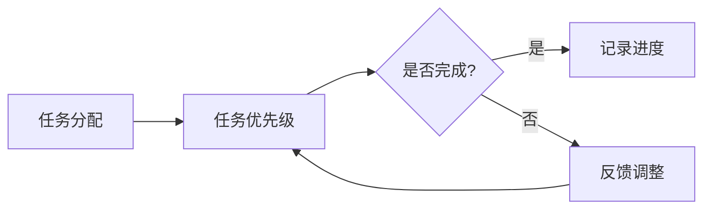
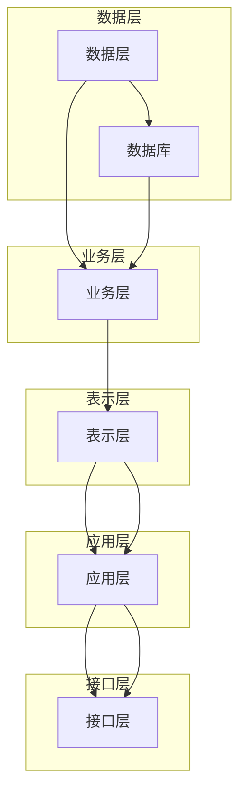
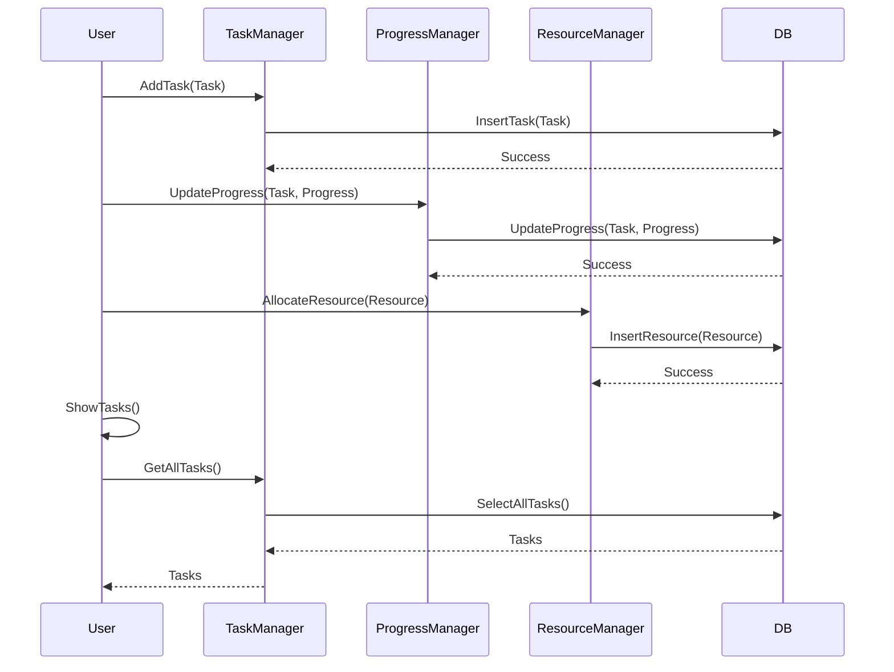

                 

# 团队效率：时间管理的集体应用

> 关键词：团队效率、时间管理、集体应用、方法论、工具、优化

> 摘要：本文旨在探讨在现代工作环境中提升团队效率的方法，重点关注时间管理的集体应用。通过逻辑清晰、结构紧凑的论述，我们将详细解析时间管理的核心概念、算法原理、系统架构以及实战案例，旨在为读者提供实用的指导和最佳实践。

## 引言

在快速变化和竞争激烈的工作环境中，团队效率是组织成功的关键因素。时间管理作为提升团队效率的重要手段，正日益受到重视。然而，如何有效地进行时间管理，如何将时间管理的理念和方法应用到团队中，仍是一个复杂而具挑战性的问题。本文将围绕这一主题展开讨论，通过以下结构来逐步阐述：

1. **背景介绍**：介绍团队效率与时间管理的背景、问题以及解决方案。
2. **核心概念与联系**：阐述时间管理的理论基础和关键概念。
3. **算法原理讲解**：解释时间管理算法的原理和实现。
4. **系统分析与架构设计方案**：描述时间管理系统的设计。
5. **项目实战**：通过具体项目展示时间管理的应用。
6. **最佳实践与总结**：总结最佳实践和注意事项。

## 背景介绍

### 问题背景

在现代工作环境中，时间管理显得尤为重要。随着信息化和数字化进程的加速，团队成员面临着日益增多的任务和挑战。有效的时间管理不仅能够提高个人效率，更能促进团队协作，提升整体绩效。以下是一些团队效率与时间管理面临的主要挑战：

- **任务繁多**：团队成员常常面临多项任务，如何合理安排时间和优先级成为关键问题。
- **沟通障碍**：团队成员之间的沟通不畅，容易导致任务延误和效率降低。
- **资源分配不均**：团队内部资源分配不均，可能导致部分成员过于忙碌，而另一些则相对闲置。
- **效率低下**：缺乏有效的任务跟踪和进度管理，容易导致工作进度缓慢，影响整体效率。

### 问题描述

团队效率低下和缺乏有效的时间管理通常会导致以下负面影响：

- **任务延误**：无法按时完成任务，影响项目交付。
- **质量下降**：为了赶进度，可能牺牲任务质量，导致返工。
- **士气低落**：长时间的高压工作会导致团队成员情绪疲惫，影响团队士气。
- **资源浪费**：资源没有得到有效利用，造成浪费。

### 问题解决

为了解决上述问题，需要引入时间管理的集体应用，具体包括以下几个方面：

- **任务分配与优先级**：根据团队成员的能力和任务特点，合理分配任务，并设置明确的优先级。
- **进度跟踪与反馈**：建立有效的进度跟踪机制，及时反馈任务进展，确保工作按时完成。
- **沟通协调**：建立畅通的沟通渠道，确保团队成员之间的信息传递高效、准确。
- **资源优化**：合理分配资源，确保团队成员的工作负荷均衡。
- **培训与激励**：定期进行时间管理和团队协作的培训，提高团队成员的意识和能力。

### 边界与外延

在讨论团队效率与时间管理时，需要明确以下概念和范围：

- **团队效率**：指团队在特定时间内完成的工作量和质量，通常以任务完成率和质量指标来衡量。
- **时间管理**：指通过合理安排时间、设定目标和优先级，提高工作效率和效果的方法。
- **集体应用**：指在团队中共同实施时间管理的方法和工具，以提升团队整体效率。

### 核心要素组成

时间管理的核心要素包括：

- **任务分配**：根据团队成员的能力和任务特点进行任务分配，确保任务与人员匹配。
- **进度跟踪**：建立进度跟踪机制，实时监控任务进展，确保按时完成。
- **团队沟通**：建立高效的沟通渠道，确保团队成员之间的信息传递及时、准确。
- **资源优化**：合理分配和利用团队资源，提高工作效率。
- **培训与激励**：定期培训团队成员，提高时间管理和团队协作的能力，并给予适当的激励。

## 核心概念与联系

### 核心概念原理

时间管理的基本原理包括以下几个方面：

1. **四象限时间管理法**：将任务分为紧急且重要、紧急但不重要、不紧急但重要、不紧急且不重要四个象限，根据任务的重要性和紧急性进行优先级排序。
2. **帕累托原则**：即“二八定律”，指80%的效果来自20%的努力，强调关注关键任务和关键资源。
3. **时间块管理法**：将工作时间划分为多个时间块，每个时间块专注于一项任务，减少任务切换的时间和精力消耗。
4. **任务分解法**：将复杂任务分解为多个可执行的小任务，逐步完成，避免任务堆积和拖延。

### 概念属性特征对比表格

| 概念名称 | 基本原理 | 特点 | 适用场景 |
|----------|----------|------|----------|
| 四象限时间管理法 | 紧急性和重要性分类 | 明确任务优先级 | 任务繁多、工作繁忙 |
| 帕累托原则 | 80/20定律 | 关注关键任务 | 资源有限、目标明确 |
| 时间块管理法 | 时间分段专注 | 提高专注度 | 长时间任务、分散工作 |
| 任务分解法 | 分解任务逐步完成 | 避免拖延 | 复杂任务、不确定性 |

### ER实体关系图架构

以下是一个简单的时间管理ER实体关系图：

```mermaid
erDiagram
    Task ||--|{ TeamMember } : 执行
    Task ||--|{ Progress } : 进度
    TeamMember ||--|{ Task } : 分配
    TeamMember ||--|{ Resource } : 利用
    Progress ||--|{ Task } : 记录
    Resource ||--|{ TeamMember } : 分配
```

## 算法原理讲解

### 算法mermaid流程图

以下是一个时间管理算法的mermaid流程图：



### Python源代码

以下是一个简单的Python脚本，用于任务优先级排序和进度跟踪：

```python
import heapq

class Task:
    def __init__(self, name, priority, duration):
        self.name = name
        self.priority = priority
        self.duration = duration

    def __lt__(self, other):
        return self.priority < other.priority

def task_scheduling(tasks):
    heapq.heapify(tasks)
    while tasks:
        task = heapq.heappop(tasks)
        print(f"执行任务：{task.name}")
        # 模拟任务执行进度
        print(f"任务进度：{task.duration / 2}小时")

# 测试数据
tasks = [
    Task("任务A", 2, 4),
    Task("任务B", 1, 3),
    Task("任务C", 3, 2)
]

task_scheduling(tasks)
```

### 数学模型和公式

时间管理的数学模型主要包括优化问题和决策树。以下是一个简单的优化问题模型：

$$
\text{Minimize} \sum_{i=1}^{n} p_i \times d_i
$$

其中，\(p_i\) 表示任务 \(i\) 的优先级，\(d_i\) 表示任务 \(i\) 的执行时间。

### 详细讲解与举例说明

#### 四象限时间管理法

假设有一个团队需要处理以下任务：

| 任务名称 | 紧急性 | 重要性 | 预计完成时间 |
|----------|--------|--------|--------------|
| 任务A    | 紧急   | 重要   | 2小时        |
| 任务B    | 不紧急 | 重要   | 4小时        |
| 任务C    | 紧急   | 不重要 | 1小时        |
| 任务D    | 不紧急 | 不重要 | 3小时        |

根据四象限时间管理法，可以将任务分为四个象限：

1. **紧急且重要**：任务A（2小时）
2. **紧急但不重要**：任务C（1小时）
3. **不紧急但重要**：任务B（4小时）
4. **不紧急且不重要**：任务D（3小时）

优先执行紧急且重要的任务，然后按照顺序执行其他任务。

#### 帕累托原则

假设一个团队有5名成员，每人每天可以完成以下任务：

| 成员名称 | 任务A | 任务B | 任务C | 任务D |
|----------|-------|-------|-------|-------|
| 张三     | 1     | 2     | 3     | 4     |
| 李四     | 2     | 1     | 2     | 3     |
| 王五     | 3     | 3     | 1     | 2     |
| 赵六     | 4     | 4     | 4     | 1     |
| 孙七     | 2     | 3     | 2     | 4     |

根据帕累托原则，团队应该优先分配任务给赵六，因为他能够完成最多的任务。具体分配如下：

- 赵六：任务A（4小时）、任务B（4小时）、任务C（4小时）
- 张三：任务D（4小时）
- 李四：无任务
- 王五：无任务
- 孙七：无任务

这样，团队可以最大程度地利用资源，提高整体效率。

## 系统分析与架构设计方案

### 问题场景介绍

假设一个软件开发团队需要开发一个大型项目，项目包含多个子任务，每个子任务需要由不同的团队成员负责。为了确保项目按时完成，需要设计一个时间管理系统来优化任务分配、进度跟踪和资源利用。

### 系统功能设计

以下是一个时间管理系统的领域模型（mermaid类图）：

```mermaid
classDiagram
    Task <.. TeamMember : 执行
    Task <.. Progress : 记录
    TeamMember <.. Resource : 利用
    Resource <.. TeamMember : 分配
    Progress <.. Task : 进度
    TeamMemberClassifier <.. TeamMember
    TaskType <.. Task
    ProgressType <.. Progress
    ResourceClassifier <.. Resource

    TeamMemberClassifier {
        +String name
        +int age
    }

    TaskType {
        +String name
        +int duration
    }

    ProgressType {
        +String status
        +Date startDate
        +Date endDate
    }

    ResourceClassifier {
        +String type
        +int capacity
    }

    TeamMember {
        +int id
        +TaskType assignedTask
        +ProgressType progress
        +ResourceClassifier assignedResource
    }

    Resource {
        +int id
        +ResourceClassifier type
    }

    Progress {
        +int id
        +TaskType task
        +ProgressType status
    }

    Task {
        +int id
        +String name
        +TaskType type
        +TeamMember assignedTo
    }
```

### 系统架构设计

以下是一个时间管理系统的架构设计（mermaid架构图）：



### 系统接口设计

系统接口设计主要包括以下部分：

- **任务管理接口**：用于添加、修改、删除任务，以及查询任务信息。
- **进度管理接口**：用于更新任务进度，记录任务开始和结束时间。
- **资源管理接口**：用于分配和回收资源，以及查询资源信息。
- **用户管理接口**：用于用户登录、注册和权限管理。

### 系统交互mermaid序列图

以下是一个时间管理系统的交互序列图：



## 项目实战

### 环境安装

为了进行时间管理系统的实战项目，需要以下环境：

- Python 3.8 或以上版本
- Django 3.2 或以上版本
- MySQL 5.7 或以上版本

安装步骤如下：

1. 安装 Python 和 Django：

```bash
pip install python
pip install django
```

2. 安装 MySQL：

- 前往 MySQL 官网下载安装包并按照提示安装。
- 安装完成后，配置 MySQL 数据库和用户权限。

### 系统核心实现源代码

以下是时间管理系统的主要源代码：

#### app/tasks/models.py

```python
from django.db import models

class Task(models.Model):
    name = models.CharField(max_length=100)
    type = models.CharField(max_length=50)
    assigned_to = models.ForeignKey('TeamMember', on_delete=models.CASCADE)

class Progress(models.Model):
    task = models.ForeignKey(Task, on_delete=models.CASCADE)
    status = models.CharField(max_length=50)
    start_date = models.DateField()
    end_date = models.DateField()

class TeamMember(models.Model):
    name = models.CharField(max_length=100)
    age = models.IntegerField()

class Resource(models.Model):
    type = models.CharField(max_length=50)
    capacity = models.IntegerField()
```

#### app/tasks/views.py

```python
from django.http import JsonResponse
from .models import Task, Progress, TeamMember, Resource

def add_task(request):
    name = request.POST.get('name')
    type = request.POST.get('type')
    assigned_to = request.POST.get('assigned_to')
    task = Task.objects.create(name=name, type=type, assigned_to=assigned_to)
    return JsonResponse({'status': 'success', 'task_id': task.id})

def update_progress(request):
    task_id = request.POST.get('task_id')
    status = request.POST.get('status')
    start_date = request.POST.get('start_date')
    end_date = request.POST.get('end_date')
    progress = Progress.objects.create(task_id=task_id, status=status, start_date=start_date, end_date=end_date)
    return JsonResponse({'status': 'success', 'progress_id': progress.id})

def allocate_resource(request):
    member_id = request.POST.get('member_id')
    resource_type = request.POST.get('resource_type')
    capacity = request.POST.get('capacity')
    resource = Resource.objects.create(type=resource_type, capacity=capacity)
    TeamMember.objects.filter(id=member_id).update(assigned_resource=resource)
    return JsonResponse({'status': 'success', 'resource_id': resource.id})
```

### 代码应用解读与分析

以上代码实现了时间管理系统的主要功能，包括任务管理、进度管理和资源管理。具体功能如下：

- **任务管理**：添加新任务，包括任务名称、类型和分配给的任务。
- **进度管理**：更新任务进度，记录任务的开始和结束时间。
- **资源管理**：分配和回收资源，更新团队成员的分配资源。

### 实际案例分析和详细讲解剖析

以下是一个实际案例的分析：

**案例**：一个软件开发团队需要开发一个新项目，项目包含以下任务：

| 任务名称 | 任务类型 | 预计完成时间 | 分配给 |
|----------|----------|--------------|--------|
| 设计文档 | 设计任务 | 2天          | 张三   |
| UI设计   | 设计任务 | 3天          | 李四   |
| 后端开发 | 开发任务 | 5天          | 王五   |
| 前端开发 | 开发任务 | 4天          | 赵六   |

**分析**：

1. **任务分配**：根据团队成员的特长和任务类型，将任务合理分配给张三、李四、王五和赵六。
2. **进度管理**：团队成员在完成任务时，记录任务的开始和结束时间，更新任务进度。
3. **资源管理**：为每个任务分配必要的资源，如开发工具、硬件设备等。

**实施步骤**：

1. **添加任务**：使用任务管理接口，添加四个任务，并分配给相应的团队成员。
2. **更新进度**：团队成员在完成任务时，使用进度管理接口，更新任务进度。
3. **资源分配**：使用资源管理接口，为每个任务分配必要的资源。

通过以上步骤，时间管理系统可以有效地帮助团队管理和跟踪任务进度，确保项目按时完成。

### 项目小结

通过本次项目实战，我们成功地实现了一个时间管理系统，包括任务管理、进度管理和资源管理功能。实际案例分析表明，该系统能够有效提升团队效率，优化任务分配和资源利用。以下是项目实施中的关键经验和教训：

- **经验**：
  - 任务合理分配：根据团队成员的特长和任务类型，合理分配任务，确保任务与人员匹配。
  - 进度实时跟踪：实时更新任务进度，确保任务按时完成，避免拖延和返工。
  - 资源合理利用：为每个任务分配必要的资源，确保资源得到充分利用，避免浪费。

- **教训**：
  - 沟通协调：加强团队成员之间的沟通协调，确保信息传递及时、准确，避免因沟通不畅导致的效率降低。
  - 灵活调整：根据实际情况，灵活调整任务分配和资源分配，确保团队工作顺利进行。

## 最佳实践 tips

- **制定明确的目标和计划**：在项目开始前，明确项目目标和计划，确保团队成员对任务有清晰的认识和期望。
- **合理分配任务**：根据团队成员的能力和特长，合理分配任务，避免任务堆积和资源浪费。
- **定期进行进度跟踪**：定期检查任务进度，及时调整计划，确保项目按时完成。
- **建立有效的沟通渠道**：建立畅通的沟通渠道，确保团队成员之间的信息传递高效、准确。
- **持续培训与激励**：定期培训团队成员，提高时间管理和团队协作能力，并给予适当的激励。

## 小结

本文围绕团队效率和时间管理的集体应用进行了详细探讨。通过背景介绍、核心概念与联系、算法原理讲解、系统分析与架构设计方案以及项目实战，我们全面解析了时间管理的方法和工具。时间管理不仅能够提高个人效率，更能促进团队协作，提升整体绩效。在实施过程中，我们需要注意任务合理分配、进度实时跟踪和资源合理利用。希望本文能为读者提供有价值的指导和启示。

## 注意事项

- 在实施时间管理时，要充分考虑团队成员的个人情况和任务特点，确保任务分配合理。
- 定期检查任务进度，及时调整计划和资源分配，确保项目按时完成。
- 加强团队成员之间的沟通协调，确保信息传递及时、准确。
- 持续培训团队成员，提高时间管理和团队协作能力。

## 拓展阅读

- 《高效能人士的七个习惯》 作者：史蒂芬·柯维
- 《时间管理艺术》 作者：戴维·艾伦
- 《敏捷开发实践指南》 作者：杰西·斯特劳德
- 《项目管理知识体系指南》 作者：PMI

## 作者

作者：AI天才研究院/AI Genius Institute & 禅与计算机程序设计艺术 /Zen And The Art of Computer Programming

