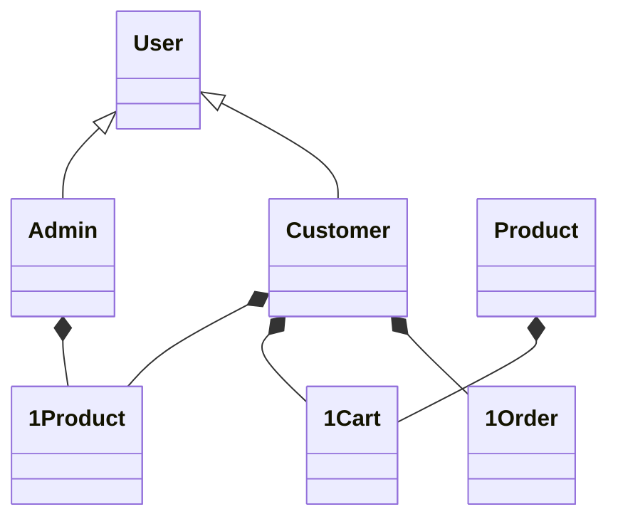

                 

# 团队效能优化：最大化团队潜力的策略

> 关键词：团队效能、组织结构、沟通协作、激励机制、技能培养、团队文化

> 摘要：本文将探讨如何通过优化团队效能来最大化团队潜力。我们将分析团队效能的核心概念、优化策略和具体实施方法，提供实际案例和最佳实践，帮助企业和团队提升工作效率、创新能力和市场竞争力。

### 第一部分：背景介绍

#### 问题背景

在现代企业中，团队效能成为影响企业竞争力的重要因素。团队效能优化不仅关乎个体成员的表现，更关系到整个团队的协作效率、创新能力和市场响应速度。随着业务复杂度和市场竞争的加剧，企业亟需寻找提升团队效能的有效策略。

#### 问题描述

团队效能优化涉及到多个层面的因素，包括团队组织结构、成员技能匹配、沟通协作机制、激励制度等。企业普遍面临着以下问题：

1. **团队成员之间的沟通不畅，信息传递效率低下。**
2. **组织结构不合理，职责划分不清，导致资源浪费。**
3. **缺乏有效的激励机制，导致团队成员积极性不高。**
4. **团队成员技能单一，缺乏跨领域的知识储备，影响创新能力。**

#### 问题解决

团队效能优化需要系统性的策略和措施，通过以下几个方面来实现：

1. **优化组织结构，明确职责划分，提高资源利用效率。**
2. **建立良好的沟通协作机制，促进团队成员之间的信息共享和协同工作。**
3. **设计有效的激励机制，激发团队成员的积极性和创造力。**
4. **培养团队成员的跨领域技能，提升团队整体的创新能力。**

#### 边界与外延

团队效能优化不仅限于企业内部团队，也可以应用于其他类型的团队，如公益组织、学术团队等。同时，优化策略需要根据不同行业、企业规模和团队特点进行定制化调整。

#### 概念结构与核心要素组成

团队效能优化包含以下几个核心要素：

1. **组织结构**：团队的组织形式、职责划分和资源分配。
2. **沟通协作**：团队成员之间的信息交流、协作方式和共同决策过程。
3. **激励机制**：对团队成员工作表现的评价、奖励和激励措施。
4. **技能培养**：提升团队成员的技能水平和跨领域知识储备。
5. **团队文化**：共同的价值观、行为准则和工作氛围。

## 第二部分：核心概念与联系

### 核心概念

#### 团队效能

团队效能是指团队在完成特定任务或项目时所表现出的综合能力和绩效水平。它包括以下几个方面：

1. **协作效率**：团队成员之间沟通顺畅，资源利用率高，任务分工明确。
2. **创新能力**：团队成员具备跨领域的知识储备和技能，能够提出创新的解决方案。
3. **执行能力**：团队成员能够按时、高质量地完成工作任务。
4. **满意度**：团队成员对团队工作的满意度和归属感。

#### 团队效能优化的目的

团队效能优化的主要目的是提高团队的绩效水平，实现以下几个目标：

1. **提升工作效率**：通过优化组织结构和沟通协作机制，减少工作中的重复劳动和资源浪费。
2. **激发创新能力**：通过培养团队成员的跨领域技能，提供更多创新的机会和平台。
3. **提高团队满意度**：通过有效的激励机制，增强团队成员的积极性和归属感。
4. **增强市场竞争力**：通过提升团队的整体效能，增强企业在市场中的竞争力。

### 概念属性特征对比表格

| 特征          | 团队效能       | 团队效能优化        |
| ------------- | -------------- | ------------------- |
| 定义          | 团队完成任务的绩效水平 | 提升团队绩效水平的策略和方法 |
| 主要因素      | 协作效率、创新能力、执行能力、满意度 | 组织结构、沟通协作、激励机制、技能培养、团队文化 |
| 目标          | 提高绩效水平     | 实现团队效能最大化   |
| 适用范围      | 各类团队       | 企业内部团队       |
| 影响因素      | 团队成员、任务难度、资源分配 | 组织结构、领导力、企业文化、外部环境 |

### ER实体关系图架构

```mermaid
erDiagram
  Team ||--|{ Member } : has
  Team ||--|{ Project } : manages
  Member ||--|{ Skill } : has
  Project ||--|{ Task } : includes
  Member ||--|{ Evaluation } : evaluated_by
```

- **Team（团队）**：包含多个成员和多个项目，负责管理这些项目和成员。
- **Member（成员）**：拥有多个技能，参与多个项目和评价。
- **Project（项目）**：包括多个任务，由团队管理，成员参与。
- **Skill（技能）**：成员拥有的技能。
- **Task（任务）**：项目的组成部分，由成员执行。
- **Evaluation（评价）**：对成员在项目中的工作表现进行评价。

### 第三部分：优化策略与实施方法

#### 1. 优化组织结构

优化组织结构是提升团队效能的重要步骤。以下是一些建议：

1. **明确职责划分**：确保每个团队成员都清楚自己的职责范围，避免职责重叠或缺失。
2. **扁平化管理**：减少管理层次，缩短信息传递路径，提高决策效率。
3. **灵活调整**：根据项目特点和需求，灵活调整组织结构，实现资源最优配置。

#### 2. 建立良好的沟通协作机制

沟通协作是团队效能优化的关键。以下是一些具体策略：

1. **定期会议**：设立固定时间举行团队会议，确保团队成员了解项目进展和需求变化。
2. **信息共享**：建立信息共享平台，方便团队成员随时获取相关资料和资源。
3. **鼓励反馈**：鼓励团队成员提出意见和建议，促进团队内部的知识共享和协同工作。

#### 3. 设计有效的激励机制

有效的激励机制可以激发团队成员的积极性和创造力。以下是一些建议：

1. **绩效评估**：建立科学的绩效评估体系，公正评价团队成员的工作表现。
2. **奖励制度**：根据绩效评估结果，给予优秀团队成员相应的奖励，如奖金、晋升机会等。
3. **鼓励创新**：设立创新奖励，鼓励团队成员提出和实施创新方案。

#### 4. 培养团队成员的跨领域技能

跨领域技能有助于提高团队的创新能力。以下是一些建议：

1. **培训计划**：制定系统的培训计划，为团队成员提供跨领域知识和技能培训。
2. **内部交流**：鼓励团队成员参加内部交流和研讨会，分享知识和经验。
3. **项目实践**：通过实际项目锻炼团队成员的跨领域技能，提高团队整体能力。

#### 5. 塑造良好的团队文化

团队文化对团队效能具有重要影响。以下是一些建议：

1. **价值观共识**：明确团队价值观，确保团队成员共同追求卓越、创新和协作。
2. **鼓励合作**：营造积极向上的团队氛围，鼓励团队成员互相支持、互相学习。
3. **关注团队成员成长**：关注团队成员的个人成长，为他们的职业发展提供支持和机会。

### 第四部分：实际案例与最佳实践

#### 案例一：互联网公司团队效能优化

某互联网公司通过以下措施提升团队效能：

1. **优化组织结构**：将原来的层级式组织结构调整为扁平化管理模式，减少管理层次，提高决策效率。
2. **建立沟通协作机制**：设立固定的周会和月会，确保团队成员了解项目进展和需求变化，促进信息共享和协同工作。
3. **设计激励机制**：设立绩效评估体系，根据评估结果给予优秀团队成员相应的奖励，如奖金、晋升机会等。
4. **培养跨领域技能**：为团队成员提供跨领域知识和技能培训，提高团队整体创新能力。
5. **塑造团队文化**：明确团队价值观，鼓励团队成员互相支持、互相学习，营造积极向上的团队氛围。

通过这些措施，该公司的团队效能得到显著提升，项目完成质量和效率大幅提高，市场竞争力得到增强。

#### 最佳实践

1. **定期反馈和评估**：定期组织团队成员进行反馈和评估，及时发现和解决问题，确保团队效能持续优化。
2. **注重团队成员个人成长**：关注团队成员的个人成长，提供职业发展支持和指导，增强团队成员的归属感和满意度。
3. **合理分配任务**：根据团队成员的技能和兴趣，合理分配任务，提高团队成员的工作积极性和满意度。
4. **鼓励创新**：鼓励团队成员提出创新方案，并为创新提供支持和资源，激发团队的创新能力。

### 第五部分：项目实战与代码实现

在本部分，我们将通过一个实际项目来展示团队效能优化的具体应用。

#### 项目介绍

假设我们正在开发一个电商平台，需要实现用户注册、商品浏览、购物车管理、订单处理等功能。以下是我们项目的核心模块和实现方法：

1. **用户注册模块**：实现用户注册功能，包括用户信息收集、验证和存储。
2. **商品浏览模块**：实现商品信息的展示、搜索和排序功能。
3. **购物车管理模块**：实现购物车添加、删除、修改数量等功能。
4. **订单处理模块**：实现订单创建、支付、发货等功能。

#### 系统功能设计

为了实现上述功能，我们可以设计以下领域模型：



- **Customer（客户）**：普通用户，可以浏览商品、下单和查看订单。
- **Admin（管理员）**：系统管理员，可以管理商品信息和订单状态。
- **Product（商品）**：商品信息，包括名称、价格、库存等。
- **Order（订单）**：订单信息，包括订单号、用户、订单状态等。
- **Cart（购物车）**：购物车信息，包括用户、商品、数量等。

#### 系统架构设计

我们的系统架构采用前后端分离的方式，前端使用React框架，后端使用Spring Boot框架，数据库使用MySQL。以下是系统架构图：

```mermaid
sequenceDiagram
  Customer ->>|访问前端| Frontend
  Frontend ->>|请求API| Backend
  Backend ->>|查询数据库| Database
  Database ->>|返回数据| Backend
  Backend ->>|响应前端| Frontend
```

- **Frontend（前端）**：负责展示用户界面，接收用户输入和发送请求。
- **Backend（后端）**：负责处理业务逻辑，与数据库交互，并返回结果。
- **Database（数据库）**：存储用户、商品、订单等数据。

#### 系统接口设计和系统交互

以下是系统接口设计和系统交互序列图：

```mermaid
sequenceDiagram
  Customer ->>|POST /api/users/register| Backend
  Backend ->>|响应注册结果| Customer
  Customer ->>|GET /api/products| Backend
  Backend ->>|响应商品列表| Customer
  Customer ->>|POST /api/carts| Backend
  Backend ->>|响应购物车添加结果| Customer
  Customer ->>|POST /api/orders| Backend
  Backend ->>|响应订单创建结果| Customer
```

- **注册接口**：用户提交注册信息，后端验证信息并创建用户。
- **商品列表接口**：用户请求商品列表，后端查询数据库并返回结果。
- **购物车接口**：用户添加商品到购物车，后端更新购物车信息。
- **订单接口**：用户创建订单，后端处理订单并返回结果。

### 第六部分：代码应用解读与分析

在本部分，我们将通过具体代码实现来分析项目中的关键算法和逻辑。

#### 用户注册模块

用户注册模块的核心功能是验证用户输入的有效性，并创建用户记录。以下是一个简单的用户注册模块实现：

```python
def register_user(username, password, email):
    if not username or not password or not email:
        return "请填写完整信息"
    
    if not is_valid_email(email):
        return "邮箱格式不正确"
    
    if not is_username_taken(username):
        user = User(username=username, password=hash_password(password), email=email)
        save_user_to_db(user)
        return "注册成功"
    else:
        return "用户名已被占用"
```

- `is_valid_email()`：检查邮箱格式是否正确。
- `hash_password()`：对密码进行加密处理。
- `is_username_taken()`：检查用户名是否已被占用。
- `save_user_to_db()`：将用户信息保存到数据库。

#### 商品浏览模块

商品浏览模块的核心功能是查询商品列表并返回结果。以下是一个简单的商品查询实现：

```python
def get_product_list():
    products = get_products_from_db()
    return format_products_for_display(products)
```

- `get_products_from_db()`：从数据库中查询商品信息。
- `format_products_for_display()`：将商品信息格式化为前端可展示的格式。

#### 购物车管理模块

购物车管理模块的核心功能是添加、删除和修改购物车中的商品数量。以下是一个简单的购物车操作实现：

```python
def add_to_cart(user_id, product_id, quantity):
    cart_item = CartItem(user_id=user_id, product_id=product_id, quantity=quantity)
    save_cart_item_to_db(cart_item)
    return "商品已添加到购物车"

def delete_from_cart(user_id, product_id):
    delete_cart_item_from_db(user_id, product_id)
    return "商品已从购物车删除"

def update_cart_quantity(user_id, product_id, quantity):
    update_cart_item_quantity_in_db(user_id, product_id, quantity)
    return "购物车商品数量已更新"
```

- `save_cart_item_to_db()`：将购物车商品信息保存到数据库。
- `delete_cart_item_from_db()`：从数据库中删除购物车商品信息。
- `update_cart_item_quantity_in_db()`：更新购物车商品数量。

#### 订单处理模块

订单处理模块的核心功能是创建订单并处理订单。以下是一个简单的订单创建实现：

```python
def create_order(user_id, cart_id):
    cart_items = get_cart_items_from_db(cart_id)
    order = Order(user_id=user_id, cart_id=cart_id, status="待支付")
    save_order_to_db(order)
    for item in cart_items:
        order_item = OrderItem(order_id=order.order_id, product_id=item.product_id, quantity=item.quantity)
        save_order_item_to_db(order_item)
    clear_cart(cart_id)
    return "订单已创建"
```

- `get_cart_items_from_db()`：从数据库中查询购物车商品信息。
- `save_order_to_db()`：将订单信息保存到数据库。
- `save_order_item_to_db()`：将订单商品信息保存到数据库。
- `clear_cart()`：清空购物车。

### 第七部分：实际案例分析

在本部分，我们将通过一个实际案例来分析团队效能优化的效果。

#### 案例背景

某互联网公司正在开发一款社交应用，项目团队成员包括前端开发、后端开发、测试工程师、UI设计师等。在项目初期，团队成员之间的沟通不畅，导致项目进度缓慢，质量不高。公司决定通过优化团队效能来提升项目效率。

#### 案例分析

1. **优化组织结构**：公司将原来的层级式组织结构调整为扁平化管理模式，减少管理层次，提高决策效率。团队成员直接向项目负责人汇报，避免了过多的中间环节。

2. **建立沟通协作机制**：公司设立固定的周会和月会，确保团队成员了解项目进展和需求变化。同时，建立线上沟通平台，方便团队成员随时交流和协作。

3. **设计激励机制**：公司建立绩效评估体系，根据评估结果给予优秀团队成员相应的奖励，如奖金、晋升机会等。同时，鼓励团队成员提出创新方案，并设立创新奖励。

4. **培养跨领域技能**：公司为团队成员提供跨领域知识和技能培训，提高团队整体创新能力。例如，前端开发人员学习后端开发知识，测试工程师学习UI设计等。

5. **塑造团队文化**：公司明确团队价值观，鼓励团队成员互相支持、互相学习，营造积极向上的团队氛围。同时，关注团队成员的个人成长，提供职业发展支持和指导。

通过这些措施，公司的团队效能得到显著提升，项目完成质量和效率大幅提高，市场竞争力得到增强。团队成员的满意度和归属感也得到提升。

### 第八部分：小结与展望

通过本文的探讨，我们可以得出以下结论：

1. **团队效能优化对于企业和团队的重要性**：团队效能优化能够提升团队的工作效率、创新能力和市场竞争力，对企业发展具有重要意义。

2. **团队效能优化的核心要素**：包括组织结构、沟通协作、激励机制、技能培养和团队文化等。

3. **团队效能优化的策略和方法**：通过优化组织结构、建立良好的沟通协作机制、设计有效的激励机制、培养团队成员的跨领域技能和塑造良好的团队文化来实现团队效能优化。

4. **实际案例与最佳实践**：通过实际案例展示团队效能优化的效果，并提供最佳实践建议。

展望未来，随着科技的不断进步和市场竞争的加剧，团队效能优化将成为企业和团队持续发展的关键。我们需要不断探索和实践新的优化策略和方法，以适应不断变化的环境和需求。

### 第九部分：注意事项与拓展阅读

#### 注意事项

1. **充分调研**：在制定团队效能优化策略时，要充分了解团队成员的需求和项目特点，确保策略具有针对性和可操作性。

2. **持续改进**：团队效能优化不是一次性的任务，而是一个持续改进的过程。需要定期评估和调整优化策略，以适应团队和项目的变化。

3. **平衡利益**：在优化团队效能时，要充分考虑团队成员的个体需求和利益，避免因追求团队效能而损害成员的个人发展。

4. **关注反馈**：及时关注团队成员的反馈和建议，了解优化策略的实施效果，为后续改进提供依据。

#### 拓展阅读

1. **《团队管理艺术》**：该书籍详细介绍了团队管理的理论和方法，有助于提升团队效能。

2. **《敏捷开发实践指南》**：该书籍介绍了敏捷开发的方法和原则，对于优化团队协作和沟通具有指导意义。

3. **《团队沟通技巧》**：该书籍提供了丰富的沟通技巧和实践方法，有助于提升团队内部的沟通效果。

### 第十部分：作者信息

作者：AI天才研究院/AI Genius Institute & 禅与计算机程序设计艺术 /Zen And The Art of Computer Programming

感谢您的阅读，希望本文对您在团队效能优化方面有所启发和帮助。如果您有任何疑问或建议，欢迎随时与我们交流。祝您工作顺利！

