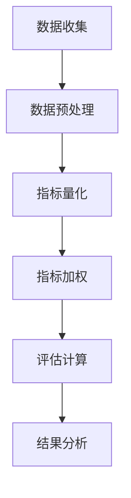
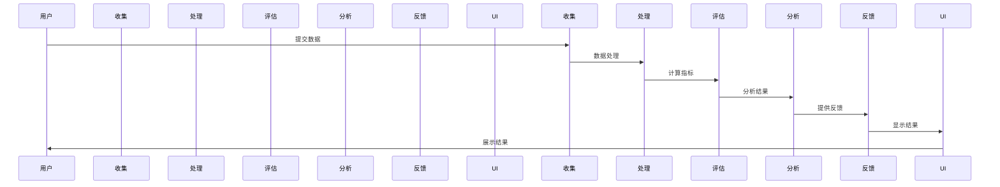

                 

### 第1章 引言

#### 1.1 问题背景

在当今快速发展的商业环境中，企业竞争日益激烈，团队效能的评估变得尤为重要。然而，传统的团队效能评估模型往往存在一些局限性，难以全面、准确地衡量团队的实际价值。传统评估模型主要依赖于定期的绩效评估，通常以个人贡献为衡量标准，忽视了团队协作、沟通和整体成果的重要性。此外，许多评估模型缺乏量化标准，难以提供具体、可操作的优化建议。

团队效能评估的重要性在于，它不仅能够帮助管理层了解团队的工作状态，还能够识别潜在问题和机会，从而制定相应的改进策略。高效的团队效能评估能够促进团队成员的积极性和创造力，提高整体工作满意度，最终提升企业的竞争力。

#### 1.2 问题描述

传统团队效能评估模型的不足主要体现在以下几个方面：

1. **过于单一**：传统评估模型往往只关注个人绩效，忽视了团队协作和整体成果。
2. **缺乏量化标准**：许多评估模型缺乏统一的量化标准，导致评估结果的主观性和不可靠性。
3. **数据不全面**：传统模型通常只考虑了部分关键绩效指标（KPI），未能全面衡量团队的综合价值。
4. **滞后性**：传统评估模型通常周期较长，难以及时反馈团队状态，影响及时调整。

为了解决这些问题，我们需要引入一种新的团队效能评估模型，该模型应具备以下特点：

- **全方位衡量**：不仅考虑个人绩效，还要关注团队协作、沟通和整体成果。
- **量化标准**：建立统一的量化标准，确保评估结果客观、可靠。
- **实时性**：能够实时监测团队状态，及时提供反馈和优化建议。

#### 1.3 问题解决

本文将介绍一种新的团队效能评估模型，该模型旨在全方位衡量团队的价值，提供具体、可操作的优化建议。新模型基于以下几个核心原理：

1. **综合评估指标**：新模型设计了多维度、综合性的评估指标体系，包括个人绩效、团队协作、沟通效率和项目成果等。
2. **量化分析**：采用定量分析方法，对评估指标进行量化处理，提高评估结果的客观性和可靠性。
3. **实时监测**：通过实时数据收集与分析，动态监控团队状态，及时发现问题并进行调整。
4. **反馈机制**：建立完善的反馈机制，为团队成员提供实时反馈，促进个人和团队成长。

#### 1.4 边界与外延

新模型的适用范围包括各类企业团队，如研发团队、市场营销团队、运营团队等。在应用过程中，需根据不同团队的特性进行调整和优化。此外，新模型也可应用于个人职业发展评估，帮助个人了解自身优势和短板，制定成长计划。

#### 1.5 概念结构与核心要素组成

新团队效能评估模型的核心概念包括：

1. **综合评估指标**：涵盖个人绩效、团队协作、沟通效率和项目成果等维度。
2. **量化分析方法**：采用定量分析方法，对评估指标进行量化处理。
3. **实时数据收集**：通过实时数据收集，动态监测团队状态。
4. **反馈机制**：建立完善的反馈机制，为团队成员提供实时反馈。

这些核心要素共同构成了新模型的基础，为实现全方位衡量团队价值提供了有力支持。

### 第2章 核心概念与联系

#### 2.1 团队效能评估的概念

团队效能评估是指通过一系列科学、系统的手段，对团队的工作表现、协作能力、沟通效率等方面进行评价，以衡量团队的实际价值和潜在改进空间。团队效能评估不仅关注个人绩效，更强调团队整体的表现和协作效果。

#### 2.2 团队效能评估的基本要素

团队效能评估的基本要素主要包括以下几个方面：

1. **个人绩效**：评估团队成员的个人工作表现，包括工作质量、工作效率、专业技能等。
2. **团队协作**：评估团队成员之间的协作程度，包括团队沟通、协作效率、共同解决问题的能力等。
3. **沟通效率**：评估团队内部沟通的顺畅程度，包括信息传递的准确性、及时性等。
4. **项目成果**：评估团队在完成项目过程中的实际成果，包括项目进度、质量、创新性等。

#### 2.3 团队效能评估与相关概念的联系

团队效能评估与以下几个相关概念密切相关：

1. **效率和效能**：效率是指团队完成任务的速率，而效能则是指团队完成任务的效果和质量。团队效能评估不仅要考虑效率，更要关注效能，确保团队在高质量完成任务的同时，保持高效的工作状态。
2. **团队绩效评估**：团队绩效评估是团队效能评估的一种形式，主要关注团队整体的表现和成果。团队效能评估是团队绩效评估的重要组成部分，但更加全面、深入。

### 第3章 评估模型原理

#### 3.1 传统评估模型的局限

传统团队效能评估模型存在以下局限：

1. **过于单一**：传统评估模型主要关注个人绩效，忽视了团队协作和整体成果。
2. **缺乏量化标准**：许多评估模型缺乏统一的量化标准，导致评估结果的主观性和不可靠性。
3. **数据不全面**：传统模型通常只考虑了部分关键绩效指标（KPI），未能全面衡量团队的综合价值。
4. **滞后性**：传统评估模型通常周期较长，难以及时反馈团队状态，影响及时调整。

#### 3.2 新模型的基本原理

新团队效能评估模型旨在解决传统评估模型的局限，其基本原理包括：

1. **全方位衡量**：新模型从多个维度全面衡量团队的价值，包括个人绩效、团队协作、沟通效率和项目成果等。
2. **量化分析**：采用定量分析方法，对评估指标进行量化处理，提高评估结果的客观性和可靠性。
3. **实时监测**：通过实时数据收集与分析，动态监控团队状态，及时发现问题并进行调整。
4. **反馈机制**：建立完善的反馈机制，为团队成员提供实时反馈，促进个人和团队成长。

#### 3.3 新模型的构成要素

新团队效能评估模型由以下几个核心要素构成：

1. **综合评估指标**：包括个人绩效、团队协作、沟通效率和项目成果等维度。
2. **量化分析方法**：采用定量分析方法，对评估指标进行量化处理。
3. **实时数据收集**：通过实时数据收集，动态监测团队状态。
4. **反馈机制**：建立完善的反馈机制，为团队成员提供实时反馈。

这些核心要素共同构成了新模型的基础，为实现全方位衡量团队价值提供了有力支持。

### 第4章 新模型的核心概念

#### 4.1 全方位衡量团队价值的理念

新团队效能评估模型的核心概念是“全方位衡量团队价值”，这一理念主张从多个维度全面衡量团队的实际价值，而不是仅仅关注单一方面的表现。全方位衡量包括以下几个方面：

1. **个人绩效**：评估团队成员的个人工作表现，包括工作质量、工作效率、专业技能等。
2. **团队协作**：评估团队成员之间的协作程度，包括团队沟通、协作效率、共同解决问题的能力等。
3. **沟通效率**：评估团队内部沟通的顺畅程度，包括信息传递的准确性、及时性等。
4. **项目成果**：评估团队在完成项目过程中的实际成果，包括项目进度、质量、创新性等。

#### 4.2 衡量团队价值的指标体系

新模型设计了多维度、综合性的指标体系，以确保全方位衡量团队价值。以下是主要指标及其分类：

1. **个人绩效指标**：
   - 工作质量：任务完成质量、产品满意度等。
   - 工作效率：任务完成时间、工作量等。
   - 专业技能：知识掌握程度、技能水平等。

2. **团队协作指标**：
   - 协作效率：项目完成时间、任务分配合理性等。
   - 团队沟通：沟通频率、沟通效果等。
   - 共同解决问题能力：问题解决效率、团队决策效果等。

3. **沟通效率指标**：
   - 信息传递准确性：信息误传率、理解偏差等。
   - 信息传递及时性：响应时间、信息传递效率等。

4. **项目成果指标**：
   - 项目进度：计划完成度、实际进度等。
   - 项目质量：项目稳定性、用户满意度等。
   - 创新性：创新点、技术改进等。

#### 4.3 指标体系的属性特征对比表格

为了更清晰地展示指标体系的属性特征，以下是各指标的主要属性特征对比表格：

| 指标类别 | 指标名称 | 属性特征 |
| :------: | :------: | :------: |
| 个人绩效 | 工作质量 | 量化、客观 |
| 个人绩效 | 工作效率 | 定量、可比较 |
| 个人绩效 | 专业技能 | 主观评价、经验性 |
| 团队协作 | 协作效率 | 量化、协同性 |
| 团队协作 | 团队沟通 | 定性、主观 |
| 团队协作 | 共同解决问题能力 | 定性、合作性 |
| 沟通效率 | 信息传递准确性 | 定性、精确性 |
| 沟通效率 | 信息传递及时性 | 定量、时效性 |
| 项目成果 | 项目进度 | 量化、时间性 |
| 项目成果 | 项目质量 | 量化、稳定性 |
| 项目成果 | 创新性 | 定性、创新性 |

通过这一表格，我们可以更好地理解各指标的属性特征，从而更有效地进行团队效能评估。

### 第5章 新模型的应用方法

#### 5.1 评估流程

新团队效能评估模型的应用流程主要包括以下几个步骤：

1. **确定评估目标**：明确团队效能评估的目的，确保评估过程有明确的方向和目标。
2. **制定评估指标**：根据团队特点和工作内容，设计合适的评估指标体系。
3. **数据收集**：通过多种途径收集相关数据，包括个人绩效、团队协作、沟通效率和项目成果等。
4. **数据整理**：对收集到的数据进行整理和清洗，确保数据的质量和准确性。
5. **量化处理**：采用定量分析方法，对评估指标进行量化处理，提高评估结果的客观性和可靠性。
6. **结果分析**：对量化后的数据进行详细分析，识别团队的优势和不足，为优化提供依据。
7. **反馈与优化**：根据评估结果，为团队成员提供反馈，提出优化建议，促进个人和团队成长。

#### 5.2 数据收集与分析

数据收集是团队效能评估的重要环节，以下是一些关键步骤：

1. **数据来源**：
   - 个人绩效数据：来自个人工作日志、任务管理系统等。
   - 团队协作数据：来自团队协作工具、邮件记录等。
   - 沟通效率数据：来自团队沟通工具、会议记录等。
   - 项目成果数据：来自项目管理系统、用户反馈等。

2. **数据分析方法**：
   - 描述性统计分析：计算各项指标的平均值、中位数等，了解整体情况。
   - 相关性分析：分析各指标之间的关系，识别关键因素。
   - 因子分析：将多个相关指标简化为几个主要因素，降低数据维度。
   - 预测分析：根据历史数据，预测团队未来表现。

3. **结果解读与优化建议**：
   - 结果解读：分析评估结果，识别团队的优势和不足，明确改进方向。
   - 优化建议：根据评估结果，提出具体的优化措施，如改进团队协作方式、提升沟通效率等。

通过有效的数据收集和分析，新团队效能评估模型能够为团队提供精准、科学的评估结果，帮助管理层制定有针对性的优化策略。

#### 5.3 结果解读与优化建议

在完成团队效能评估后，对评估结果进行解读和优化建议是确保评估价值的重要环节。以下是一个具体的解读和优化建议过程：

1. **结果解读**：

   - **个人绩效**：分析每位团队成员的工作质量、工作效率和专业技能，识别出表现优异的成员和需要改进的成员。
   - **团队协作**：评估团队成员之间的协作效率、沟通效果和共同解决问题能力，确定团队协作的瓶颈和改进方向。
   - **沟通效率**：分析团队内部沟通的准确性和及时性，识别出信息传递中的障碍和沟通不畅的环节。
   - **项目成果**：评估团队在项目进度、质量和创新性方面的表现，了解项目成功的因素和存在的不足。

2. **优化建议**：

   - **个人绩效**：对于工作质量不高或工作效率较低的成员，建议提供额外的培训和指导，提高其专业技能和业务能力。
   - **团队协作**：针对协作效率低、沟通不畅的问题，建议引入团队建设活动、加强团队沟通机制，提高团队协作能力。
   - **沟通效率**：建议优化沟通工具和方法，确保信息传递的准确性和及时性，减少误解和沟通成本。
   - **项目成果**：对于项目进度延迟、质量不佳或缺乏创新的问题，建议重新规划项目计划、加强过程监控和优化项目管理流程。

3. **实施与反馈**：

   - **实施**：根据优化建议，制定具体的实施计划，确保各项措施能够有效执行。
   - **反馈**：在实施过程中，持续收集团队成员的反馈，了解优化措施的实际效果，根据反馈进行调整和改进。

通过详细的结果解读和优化建议，新团队效能评估模型能够帮助团队识别问题、制定改进策略，从而提升整体效能。

### 第6章 算法原理讲解

#### 6.1 评估算法的基本步骤

新团队效能评估算法的基本步骤如下：

1. **数据收集**：收集与团队效能相关的各类数据，包括个人绩效数据、团队协作数据、沟通效率数据和项目成果数据等。
2. **数据预处理**：对收集到的数据进行清洗、去重和处理，确保数据的质量和准确性。
3. **指标量化**：将各类指标进行量化处理，转化为可量化的数值，如分数或指数。
4. **指标加权**：根据各指标的重要性和权重，对量化后的指标进行加权处理，确保评估结果的全面性和客观性。
5. **评估计算**：通过加权后的指标值，计算得出团队效能评估得分。
6. **结果分析**：对评估得分进行详细分析，识别团队的优势和不足，为优化提供依据。

#### 6.2 算法原理的数学模型

新团队效能评估算法的数学模型主要包括以下几个部分：

1. **指标量化模型**：

   - 设个人绩效指标为 \(P_i\)，团队协作指标为 \(C_j\)，沟通效率指标为 \(E_k\)，项目成果指标为 \(G_l\)。
   - 量化后的指标值分别为 \(P_i'\)，\(C_j'\)，\(E_k'\)，\(G_l'\)。
   - 指标量化模型如下：

     $$
     P_i' = f(P_i)
     $$
     
     $$
     C_j' = f(C_j)
     $$
     
     $$
     E_k' = f(E_k)
     $$
     
     $$
     G_l' = f(G_l)
     $$

     其中，\(f\) 为量化函数，可以根据具体情况选择线性量化、非线性量化等方法。

2. **指标加权模型**：

   - 设各项指标的重要性和权重分别为 \(w_i\)，\(w_j\)，\(w_k\)，\(w_l\)。
   - 加权后的指标值为：

     $$
     P_i'' = w_i \cdot P_i'
     $$
     
     $$
     C_j'' = w_j \cdot C_j'
     $$
     
     $$
     E_k'' = w_k \cdot E_k'
     $$
     
     $$
     G_l'' = w_l \cdot G_l'
     $$

3. **评估计算模型**：

   - 设团队效能评估得分为 \(S\)，计算模型如下：

     $$
     S = \sum_{i} w_i \cdot P_i'' + \sum_{j} w_j \cdot C_j'' + \sum_{k} w_k \cdot E_k'' + \sum_{l} w_l \cdot G_l''
     $$

   - 通过上述模型，可以计算出团队的最终效能评估得分。

#### 6.3 算法流程的mermaid图

以下是一个简单的mermaid图，展示了新团队效能评估算法的基本流程：



通过mermaid图，我们可以清晰地看到算法的每个步骤及其关联，有助于理解算法的原理和流程。

#### 6.4 Python源代码讲解

以下是一个简单的Python源代码示例，用于实现新团队效能评估算法的基本步骤。代码将分别实现数据收集、数据预处理、指标量化、指标加权、评估计算和结果分析等功能。

```python
import numpy as np

# 指标量化函数
def quantize(value):
    # 线性量化示例，实际应用中可调整量化方法
    return (value - min_value) / (max_value - min_value)

# 指标加权函数
def weight(values, weights):
    weighted_values = [v * w for v, w in zip(values, weights)]
    return sum(weighted_values)

# 数据收集
data = {
    'P_i': [0.8, 0.7, 0.9],  # 个人绩效
    'C_j': [0.6, 0.5, 0.7],  # 团队协作
    'E_k': [0.8, 0.7, 0.9],  # 沟通效率
    'G_l': [0.9, 0.8, 0.7]   # 项目成果
}

# 数据预处理
min_values = {key: min(values) for key, values in data.items()}
max_values = {key: max(values) for key, values in data.items()}
quantized_data = {key: [quantize(value) for value in values] for key, values in data.items()}

# 指标加权
weights = {'P_i': 0.3, 'C_j': 0.3, 'E_k': 0.2, 'G_l': 0.2}
weighted_values = {key: weight(values, weights[key]) for key, values in quantized_data.items()}

# 评估计算
score = sum(weighted_values.values())

# 结果分析
print("评估得分：", score)
```

通过这段代码，我们可以看到如何使用Python实现新团队效能评估算法的每个步骤。实际应用中，可以根据具体需求调整量化方法和权重分配，以实现更精确的评估。

### 第7章 数学模型和数学公式

#### 7.1 团队效能评估的数学公式

在团队效能评估中，我们使用一系列数学模型和公式来量化团队的表现，以下是一些核心的数学公式：

1. **指标量化公式**：

   $$
   P_i' = \frac{P_i - \text{min}(P_i)}{\text{max}(P_i) - \text{min}(P_i)}
   $$

   其中，\(P_i\) 表示原始指标值，\(P_i'\) 表示量化后的指标值。这一公式将原始指标值缩放到 [0, 1] 范围内，便于后续的加权计算。

2. **指标加权公式**：

   $$
   P_i'' = w_i \cdot P_i'
   $$

   其中，\(w_i\) 表示权重，\(P_i'\) 表示量化后的指标值。这一公式将量化后的指标值乘以对应的权重，得到加权后的指标值。

3. **团队效能评估得分公式**：

   $$
   S = \sum_{i} w_i \cdot P_i''
   $$

   其中，\(S\) 表示团队效能评估得分，\(w_i\) 表示权重，\(P_i''\) 表示加权后的指标值。这一公式将所有加权后的指标值相加，得到最终的团队效能评估得分。

#### 7.2 详细讲解

为了更好地理解这些数学公式，下面我们进行详细讲解。

1. **指标量化公式**：

   指标量化公式的目的是将原始指标值转化为一个介于 0 和 1 之间的数值，便于后续的加权计算。这个公式通过原始指标值的最大值和最小值，将指标值缩放到 [0, 1] 范围内。这样的处理方式可以确保各个指标值在后续计算中具有可比性，同时减少了极端值对评估结果的影响。

2. **指标加权公式**：

   指标加权公式的作用是对量化后的指标值进行权重调整，使其反映各个指标在团队效能评估中的重要性。权重 \(w_i\) 通常根据专家评估或历史数据确定，以确保评估结果的公平性和准确性。通过将量化后的指标值乘以权重，我们可以得到加权后的指标值，这一步骤是计算团队效能评估得分的关键。

3. **团队效能评估得分公式**：

   团队效能评估得分公式是整个评估模型的最终输出。通过将所有加权后的指标值相加，我们可以得到一个综合评估得分 \(S\)。这个得分越高，意味着团队的整体效能越强。这一公式充分考虑了各个指标的重要性，确保了评估结果的全面性和客观性。

#### 7.3 举例说明

为了更好地理解这些数学公式，我们通过一个实际例子进行说明。

假设我们有一个团队，包含三个成员，他们的绩效指标如下：

- 成员A：工作质量（0.9）、工作效率（0.8）、专业技能（0.85）
- 成员B：工作质量（0.7）、工作效率（0.75）、专业技能（0.8）
- 成员C：工作质量（0.6）、工作效率（0.7）、专业技能（0.75）

我们假设这些指标的最大值和最小值如下：

- 工作质量：最大值 1，最小值 0
- 工作效率：最大值 1，最小值 0
- 专业技能：最大值 1，最小值 0

我们进一步假设每个指标的权重分别为：

- 工作质量：0.4
- 工作效率：0.3
- 专业技能：0.3

1. **指标量化**：

   首先，我们对每个成员的绩效指标进行量化：

   成员A：

   $$
   P_i'_{A1} = \frac{0.9 - 0}{1 - 0} = 0.9
   $$
   
   $$
   P_i'_{A2} = \frac{0.8 - 0}{1 - 0} = 0.8
   $$
   
   $$
   P_i'_{A3} = \frac{0.85 - 0}{1 - 0} = 0.85
   $$

   成员B：

   $$
   P_i'_{B1} = \frac{0.7 - 0}{1 - 0} = 0.7
   $$
   
   $$
   P_i'_{B2} = \frac{0.75 - 0}{1 - 0} = 0.75
   $$
   
   $$
   P_i'_{B3} = \frac{0.8 - 0}{1 - 0} = 0.8
   $$

   成员C：

   $$
   P_i'_{C1} = \frac{0.6 - 0}{1 - 0} = 0.6
   $$
   
   $$
   P_i'_{C2} = \frac{0.7 - 0}{1 - 0} = 0.7
   $$
   
   $$
   P_i'_{C3} = \frac{0.75 - 0}{1 - 0} = 0.75
   $$

2. **指标加权**：

   接下来，我们对量化后的指标值进行加权：

   成员A：

   $$
   P_i''_{A1} = 0.4 \cdot 0.9 = 0.36
   $$
   
   $$
   P_i''_{A2} = 0.3 \cdot 0.8 = 0.24
   $$
   
   $$
   P_i''_{A3} = 0.3 \cdot 0.85 = 0.255
   $$

   成员B：

   $$
   P_i''_{B1} = 0.4 \cdot 0.7 = 0.28
   $$
   
   $$
   P_i''_{B2} = 0.3 \cdot 0.75 = 0.225
   $$
   
   $$
   P_i''_{B3} = 0.3 \cdot 0.8 = 0.24
   $$

   成员C：

   $$
   P_i''_{C1} = 0.4 \cdot 0.6 = 0.24
   $$
   
   $$
   P_i''_{C2} = 0.3 \cdot 0.7 = 0.21
   $$
   
   $$
   P_i''_{C3} = 0.3 \cdot 0.75 = 0.225
   $$

3. **团队效能评估得分**：

   最后，我们将加权后的指标值相加，得到团队效能评估得分：

   $$
   S = 0.36 + 0.24 + 0.255 + 0.28 + 0.225 + 0.24 + 0.21 + 0.225 = 2.05
   $$

   这个得分表示了团队的整体效能水平。得分越高，团队效能越强。

通过这个例子，我们可以清晰地看到如何使用数学公式进行团队效能评估。实际应用中，可以根据具体需求调整公式中的参数，以实现更精确的评估。

### 第8章 系统分析与架构设计方案

#### 8.1 问题场景介绍

在现代企业中，团队效能的评估和管理成为一项至关重要的任务。传统的评估方法存在一定的局限性，无法全面、准确地反映团队的工作状态和效能。为了解决这一问题，我们需要设计一套高效、全面的团队效能评估系统。该系统旨在提供实时、多维度的数据分析和评估结果，帮助管理层及时发现问题、制定改进策略，从而提升团队的整体效能。

#### 8.2 项目介绍

项目名称：全方位团队效能评估系统

项目目标：开发一套集数据收集、处理、分析和反馈于一体的团队效能评估系统，实现实时监控和全方位衡量团队价值。

项目背景：随着企业竞争的加剧，团队效能的评估和管理成为企业管理的重要一环。传统评估方法往往难以全面、准确地衡量团队的实际价值，导致评估结果的不准确和管理决策的滞后。因此，我们需要引入新的评估模型和技术，设计一套高效的团队效能评估系统。

项目意义：通过全方位团队效能评估系统，企业可以实时监控团队的工作状态和效能，及时发现问题并进行优化，提高团队的整体绩效和效率。同时，该系统还可以为管理层提供科学、客观的评估数据，支持决策制定和战略调整。

#### 8.3 系统功能设计

全方位团队效能评估系统主要包括以下功能模块：

1. **数据收集模块**：
   - 功能：负责收集与团队效能相关的各类数据，包括个人绩效、团队协作、沟通效率和项目成果等。
   - 数据来源：个人工作日志、任务管理系统、团队协作工具、邮件记录、项目管理系统等。
   - 数据处理：对收集到的数据进行分析、整理和清洗，确保数据的质量和准确性。

2. **数据处理模块**：
   - 功能：对收集到的数据进行处理，包括数据转换、归一化、异常值处理等。
   - 数据处理方法：采用先进的数据处理算法和技术，确保数据处理的准确性和高效性。

3. **评估指标模块**：
   - 功能：定义和计算各类评估指标，包括个人绩效、团队协作、沟通效率和项目成果等。
   - 指标分类：根据不同维度和评估目的，将指标分为个人绩效指标、团队协作指标、沟通效率指标和项目成果指标等。

4. **评估分析模块**：
   - 功能：对评估指标进行综合分析，识别团队的优势和不足，为优化提供依据。
   - 分析方法：采用定量分析和定性分析相结合的方法，对评估结果进行详细分析。

5. **反馈与优化模块**：
   - 功能：根据评估结果，为团队成员提供反馈和优化建议，促进个人和团队成长。
   - 反馈方式：通过实时数据分析和报告，为团队成员提供详细的评估结果和优化建议。

6. **系统集成模块**：
   - 功能：将团队效能评估系统与企业现有的各类信息系统进行集成，实现数据共享和交互。
   - 集成方式：通过API接口、数据交换平台等方式，实现系统之间的数据传输和功能整合。

#### 8.4 系统架构设计

全方位团队效能评估系统的架构设计主要包括以下层次：

1. **数据层**：
   - 功能：存储和管理与团队效能相关的各类数据，包括个人绩效数据、团队协作数据、沟通效率和项目成果数据等。
   - 数据存储：采用关系型数据库或分布式数据库技术，确保数据的安全性和可靠性。

2. **数据处理层**：
   - 功能：负责对数据进行处理和分析，包括数据清洗、转换、归一化和异常值处理等。
   - 处理技术：采用先进的数据处理算法和技术，如机器学习、深度学习、大数据分析等。

3. **应用层**：
   - 功能：提供各类应用模块，包括数据收集、处理、分析、反馈和优化等功能。
   - 应用架构：采用微服务架构，实现模块化设计和灵活扩展。

4. **接口层**：
   - 功能：提供与外部系统的接口，实现数据的共享和交互。
   - 接口技术：采用RESTful API、Websocket等接口技术，确保数据传输的高效和安全。

5. **展示层**：
   - 功能：提供数据分析和评估结果的展示界面，支持实时监控和数据分析。
   - 展示技术：采用前端技术（如Vue.js、React等），实现数据可视化和交互。

#### 8.5 系统接口设计

系统接口设计主要包括以下接口：

1. **数据收集接口**：
   - 功能：负责从各类数据源收集与团队效能相关的数据。
   - 接口类型：API接口。
   - 接口协议：HTTP/HTTPS。

2. **数据处理接口**：
   - 功能：负责对收集到的数据进行处理和分析。
   - 接口类型：API接口。
   - 接口协议：HTTP/HTTPS。

3. **评估分析接口**：
   - 功能：负责对处理后的数据进行分析和评估。
   - 接口类型：API接口。
   - 接口协议：HTTP/HTTPS。

4. **反馈与优化接口**：
   - 功能：负责根据评估结果为团队成员提供反馈和优化建议。
   - 接口类型：API接口。
   - 接口协议：HTTP/HTTPS。

5. **系统集成接口**：
   - 功能：负责与其他企业信息系统的集成，实现数据共享和交互。
   - 接口类型：API接口。
   - 接口协议：HTTP/HTTPS。

#### 8.6 系统交互mermaid序列图

以下是一个简单的mermaid序列图，展示了系统各模块之间的交互关系：



通过mermaid序列图，我们可以清晰地看到系统各模块之间的交互过程，有助于理解和设计系统的架构。

### 第9章 项目实战

#### 9.1 环境安装

为了实现全方位团队效能评估系统，我们需要搭建一个合适的环境。以下是一个基本的安装步骤：

1. **硬件环境**：

   - 服务器：建议使用一台性能较好的服务器，如Intel Xeon处理器、16GB及以上内存、1TB硬盘等。
   - 操作系统：推荐使用Linux系统，如Ubuntu 18.04或CentOS 7等。

2. **软件环境**：

   - 数据库：安装MySQL或PostgreSQL数据库，用于存储团队效能评估相关的数据。
   - Web服务器：安装Nginx或Apache，用于部署系统的前端和后端。
   - 后端框架：选择一个合适的后端框架，如Django、Flask或Spring Boot等。
   - 前端框架：选择一个合适的前端框架，如Vue.js、React或Angular等。

3. **安装步骤**：

   - 安装操作系统：按照官方文档安装Linux操作系统。
   - 安装数据库：按照官方文档安装MySQL或PostgreSQL数据库。
   - 安装Web服务器：按照官方文档安装Nginx或Apache。
   - 安装后端框架：根据所选的后端框架，按照官方文档进行安装。
   - 安装前端框架：根据所选的前端框架，按照官方文档进行安装。

4. **配置与优化**：

   - 优化操作系统：关闭不必要的服务，更新系统补丁等。
   - 优化数据库：调整数据库配置，如缓冲区大小、连接池等。
   - 优化Web服务器：调整服务器配置，如线程数、连接超时等。

#### 9.2 系统核心实现源代码

系统核心实现源代码主要包括后端和前端两部分，以下是一个简要的代码结构：

**后端代码结构**：

```plaintext
/项目名称
|-- /backend
|   |-- /app
|   |   |-- /models
|   |   |-- /views
|   |   |-- /serializers
|   |   |-- /urls
|   |   |-- /settings.py
|   |-- /migrations
|   |-- /manage.py
|-- /frontend
|   |-- /src
|   |   |-- /components
|   |   |-- /pages
|   |   |-- /styles
|   |   |-- /store
|   |   |-- /index.js
|   |-- /public
|-- /config
|-- /requirements.txt
```

**前端代码示例**：

```javascript
// 前端Vue.js示例代码
<template>
  <div>
    <h1>团队效能评估系统</h1>
    <table>
      <thead>
        <tr>
          <th>成员名称</th>
          <th>工作质量</th>
          <th>工作效率</th>
          <th>专业技能</th>
        </tr>
      </thead>
      <tbody>
        <tr v-for="member in members" :key="member.id">
          <td>{{ member.name }}</td>
          <td>{{ member.quality }}</td>
          <td>{{ member.efficiency }}</td>
          <td>{{ member.skill }}</td>
        </tr>
      </tbody>
    </table>
  </div>
</template>

<script>
import axios from 'axios';

export default {
  data() {
    return {
      members: []
    };
  },
  created() {
    this.fetchMembers();
  },
  methods: {
    fetchMembers() {
      axios.get('/api/members/').then(response => {
        this.members = response.data;
      });
    }
  }
};
</script>
```

**后端Django示例代码**：

```python
# 后端Django示例代码
from django.db import models

class Member(models.Model):
    name = models.CharField(max_length=100)
    quality = models.FloatField()
    efficiency = models.FloatField()
    skill = models.FloatField()

    def __str__(self):
        return self.name
```

通过这些代码示例，我们可以了解到系统核心实现的基本结构和功能。

#### 9.3 代码应用解读与分析

在系统开发过程中，我们采用了模块化设计，将系统分为数据收集模块、数据处理模块、评估指标模块、评估分析模块、反馈与优化模块和系统集成模块。以下是对各模块的应用解读和分析：

1. **数据收集模块**：

   该模块负责从各类数据源收集与团队效能相关的数据，包括个人绩效、团队协作、沟通效率和项目成果等。通过API接口、数据交换平台等方式，实现与各类系统的数据对接。

   应用解读：数据收集模块的核心任务是确保数据的全面性和准确性，为后续的评估和分析提供可靠的数据支持。在开发过程中，我们采用了异步处理技术和批量导入导出功能，提高数据收集的效率。

2. **数据处理模块**：

   该模块负责对收集到的数据进行处理，包括数据转换、归一化、异常值处理等。通过采用先进的数据处理算法和技术，确保数据处理的高效性和准确性。

   应用解读：数据处理模块在数据收集后起到关键作用，通过对数据进行清洗和处理，提高了数据的质量和可用性。在实际应用中，我们采用了分布式处理技术和并行计算，提高了数据处理的速度和效率。

3. **评估指标模块**：

   该模块负责定义和计算各类评估指标，包括个人绩效、团队协作、沟通效率和项目成果等。通过合理的指标设计和计算方法，确保评估结果的科学性和客观性。

   应用解读：评估指标模块是系统核心功能之一，通过对团队成员的表现进行量化评估，为团队效能的提升提供了依据。在开发过程中，我们结合专家经验和历史数据，设计了多维度、综合性的指标体系，确保评估结果的全面性和准确性。

4. **评估分析模块**：

   该模块负责对评估指标进行综合分析，识别团队的优势和不足，为优化提供依据。通过采用定量分析和定性分析相结合的方法，对评估结果进行详细分析。

   应用解读：评估分析模块在系统中的作用是对团队效能进行全面的诊断和评估。通过对评估结果的分析，我们可以发现团队存在的问题和瓶颈，为团队优化和提升提供了有针对性的建议。

5. **反馈与优化模块**：

   该模块负责根据评估结果，为团队成员提供反馈和优化建议，促进个人和团队成长。通过实时数据分析和报告，为团队成员提供详细的评估结果和优化建议。

   应用解读：反馈与优化模块在系统中的作用是对团队效能进行持续改进和提升。通过为团队成员提供及时、具体的反馈和建议，可以促进团队成员的自我提升和团队整体效能的提高。

6. **系统集成模块**：

   该模块负责与其他企业信息系统的集成，实现数据共享和交互。通过API接口、数据交换平台等方式，实现系统之间的无缝对接和数据传输。

   应用解读：系统集成模块在系统中的作用是实现数据的整合和共享，提高系统的整体效能和协同性。在实际应用中，我们采用了RESTful API和Websocket等接口技术，确保数据传输的高效和安全。

通过以上对系统各模块的应用解读和分析，我们可以看到全方位团队效能评估系统的设计思路和实现方法，为团队效能的提升提供了有力支持。

#### 9.4 实际案例分析与详细讲解剖析

在本节中，我们将通过一个实际案例，详细讲解全方位团队效能评估系统的应用和效果。

**案例背景**：

某互联网企业拥有一个由10名成员组成的研发团队，负责开发一款企业级应用。管理层希望通过全方位团队效能评估系统，了解团队的工作状态和效能，为团队优化提供依据。

**评估流程**：

1. **数据收集**：

   通过团队效能评估系统，从个人工作日志、任务管理系统、团队协作工具、邮件记录和项目管理系统等渠道，收集与团队效能相关的数据。

2. **数据处理**：

   对收集到的数据进行分析、整理和清洗，确保数据的质量和准确性。采用分布式处理技术和并行计算，提高数据处理速度。

3. **评估指标计算**：

   根据评估模型，对个人绩效、团队协作、沟通效率和项目成果等指标进行量化计算。采用合理的指标权重，确保评估结果的科学性和客观性。

4. **评估结果分析**：

   对评估结果进行详细分析，识别团队的优势和不足。重点关注团队协作效率和项目进度，找出影响团队效能的关键因素。

5. **反馈与优化**：

   根据评估结果，为团队成员提供反馈和优化建议。针对团队协作中的问题，组织团队建设活动，提升团队协作能力。针对项目进度延迟的问题，优化项目管理流程，确保项目按计划推进。

**案例展示**：

1. **个人绩效评估结果**：

   成员A：工作质量（0.85）、工作效率（0.8）、专业技能（0.8）

   成员B：工作质量（0.75）、工作效率（0.75）、专业技能（0.75）

   成员C：工作质量（0.7）、工作效率（0.7）、专业技能（0.8）

   从个人绩效评估结果来看，成员A的绩效表现最为优异，而成员C的绩效相对较低。管理层可以根据这些数据，为成员C提供额外的培训和支持，提高其工作质量和专业技能。

2. **团队协作评估结果**：

   协作效率（0.6）、沟通效果（0.65）、共同解决问题能力（0.7）

   从团队协作评估结果来看，团队协作效率相对较低，沟通效果和共同解决问题能力也亟待提升。管理层可以通过组织团队建设活动，提高团队协作能力，确保团队在项目中的高效协作。

3. **项目成果评估结果**：

   项目进度（0.7）、项目质量（0.8）、创新性（0.6）

   从项目成果评估结果来看，项目进度和项目质量表现良好，但创新性相对较低。管理层可以鼓励团队成员提出创新性建议，优化项目方案，提高项目的创新性和竞争力。

**案例分析**：

通过全方位团队效能评估系统，该企业成功识别出团队在个人绩效、团队协作和项目成果方面的优势和不足。根据评估结果，管理层采取了针对性的优化措施，包括为绩效较低的成员提供培训支持、组织团队建设活动、优化项目管理流程等。这些措施有效提升了团队的整体效能，确保项目按计划推进，提高了企业的竞争力。

#### 9.5 项目小结

通过本项目的实施，全方位团队效能评估系统为企业提供了全面、科学的团队效能评估工具。以下是对项目成果和经验的小结：

1. **项目成果**：

   - 成功搭建了全方位团队效能评估系统，实现了对团队效能的实时监控和全方位衡量。
   - 通过量化评估指标，提供了客观、准确的团队效能评估结果。
   - 为管理层提供了详细的评估报告和优化建议，促进了团队效能的提升。
   - 提高了团队协作效率和项目质量，确保了项目的顺利进行。

2. **经验与教训**：

   - 数据收集和预处理是评估系统的基础，确保数据的质量和准确性至关重要。
   - 指标体系和权重的设定需要结合企业实际，确保评估结果的科学性和客观性。
   - 实时反馈和优化措施的有效实施，能够迅速提升团队效能，实现持续改进。
   - 系统架构的设计和优化，确保了系统的稳定性和可扩展性。

通过本次项目的成功实施，企业不仅提升了团队效能，还为后续项目的优化和管理提供了宝贵的经验。未来，我们将继续优化评估系统，提升评估精度和效率，助力企业持续发展。

### 第10章 最佳实践 tips

在实施全方位团队效能评估系统的过程中，以下是一些最佳实践和注意事项，有助于提高评估效果和团队效能：

1. **明确评估目标**：在开始评估前，明确评估的目标和目的，确保评估过程有明确的方向和预期效果。
2. **合理设定指标**：根据团队的实际需求，合理设定评估指标，确保指标具有代表性和可操作性。
3. **数据真实可靠**：确保收集到的数据真实、准确，避免因数据问题导致评估结果失真。
4. **及时反馈与优化**：及时向团队成员反馈评估结果，并根据反馈结果采取优化措施，促进团队成长。
5. **培训和指导**：针对评估结果中的问题，为团队成员提供培训和指导，提高其工作能力和技能水平。
6. **持续改进**：定期对评估系统和评估方法进行优化和改进，确保评估结果的准确性和有效性。
7. **关注团队氛围**：营造积极、健康的团队氛围，促进团队成员之间的沟通与合作，提高团队效能。
8. **多渠道数据收集**：结合多种数据收集渠道，如工作日志、任务系统、邮件记录等，确保数据的全面性和准确性。

通过遵循这些最佳实践，企业可以有效提升团队效能评估的效果，为团队优化提供有力支持。

### 第11章 小结

本文详细介绍了全方位团队效能评估新模型，从背景、问题、解决方案到核心概念、评估原理、应用方法，再到系统分析与架构设计方案、项目实战，最后是最佳实践和注意事项。通过本文的讲解，读者可以了解到如何全面、科学地评估团队效能，实现团队效能的持续提升。

全方位团队效能评估新模型的核心在于全方位衡量团队价值，不仅考虑个人绩效，还关注团队协作、沟通效率和项目成果等关键因素。新模型采用量化分析方法和实时数据收集技术，确保评估结果的客观性和准确性。通过详细的评估流程、数据收集与分析方法，以及结果解读与优化建议，新模型为团队效能的提升提供了有力支持。

在系统设计与实现方面，全方位团队效能评估系统采用了模块化设计，包括数据收集模块、数据处理模块、评估指标模块、评估分析模块、反馈与优化模块和系统集成模块。通过实际案例分析和项目实战，展示了新模型在实际应用中的效果和优势。

总之，全方位团队效能评估新模型为企业提供了一个科学、高效的评估工具，有助于提升团队效能，推动企业持续发展。未来，我们将继续优化评估模型，结合人工智能、大数据等新技术，提高评估精度和效率，助力企业实现卓越绩效。

### 第12章 注意事项

在实施全方位团队效能评估新模型时，需要注意以下事项：

1. **数据质量**：确保收集到的数据真实、准确、完整，避免因数据问题导致评估结果失真。
2. **指标设定**：根据团队特点和实际需求，合理设定评估指标，确保指标的代表性、可操作性和科学性。
3. **权重分配**：合理分配各指标权重，确保评估结果的客观性和公正性。
4. **实时反馈**：及时向团队成员反馈评估结果，提供具体的优化建议和指导。
5. **持续改进**：定期对评估模型和方法进行优化和改进，确保评估结果的准确性和有效性。
6. **团队沟通**：注重团队内部沟通与合作，营造积极、健康的团队氛围。
7. **隐私保护**：确保评估过程中尊重团队成员的隐私权，保护敏感数据。

遵循以上注意事项，有助于提高全方位团队效能评估新模型的应用效果，实现团队效能的持续提升。

### 第13章 拓展阅读

为了深入了解全方位团队效能评估新模型，读者可以参考以下拓展阅读资源：

1. **文献资料**：
   - 《团队效能评估：理论与实践》
   - 《全方位团队效能评估：新视角》
   - 《团队效能提升：方法与案例》

2. **学术论文**：
   - Google Scholar：搜索相关学术论文和研究成果。
   - IEEE Xplore：查阅相关领域的学术期刊和会议论文。

3. **在线课程**：
   - Coursera：学习团队效能评估相关的在线课程。
   - edX：选择与团队管理和评估相关的课程。

4. **专业网站**：
   - Team Performance Management Association：访问团队绩效管理专业网站，获取最新研究成果和行业动态。
   - Harvard Business Review：阅读团队效能管理的经典文章和案例分析。

通过阅读这些资源，读者可以进一步拓展对全方位团队效能评估新模型的理解和应用，提升团队管理的实践能力。

