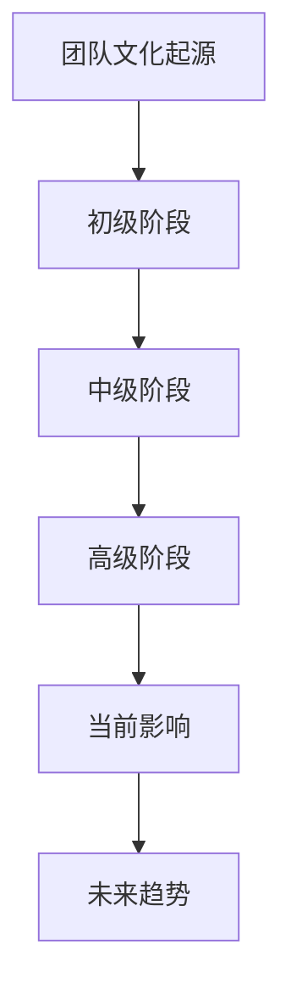
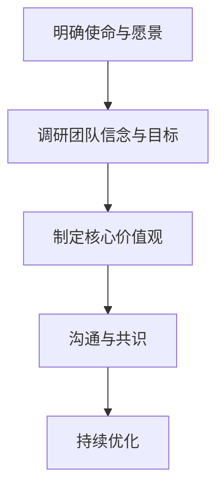
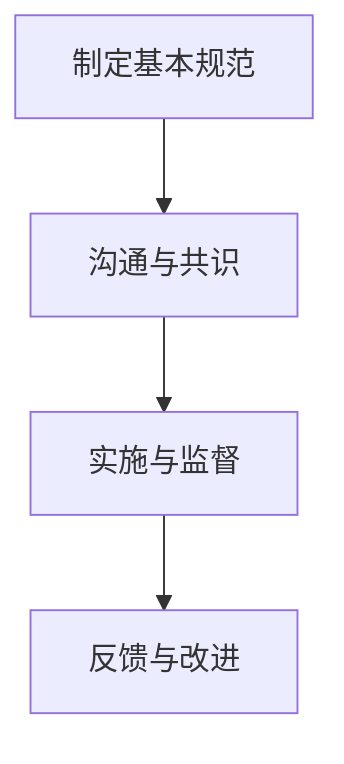
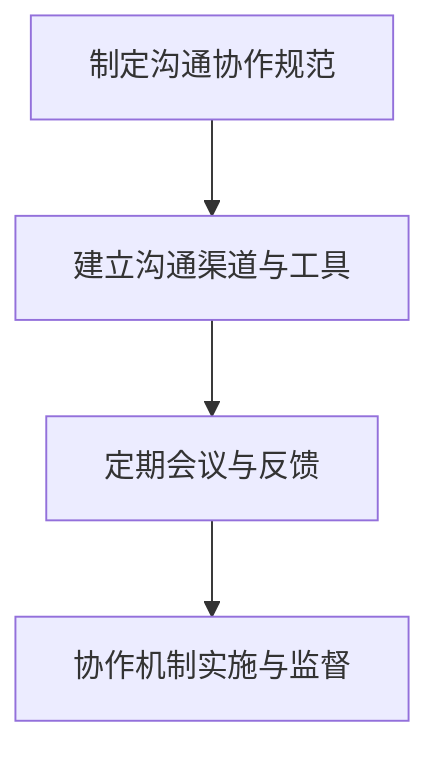
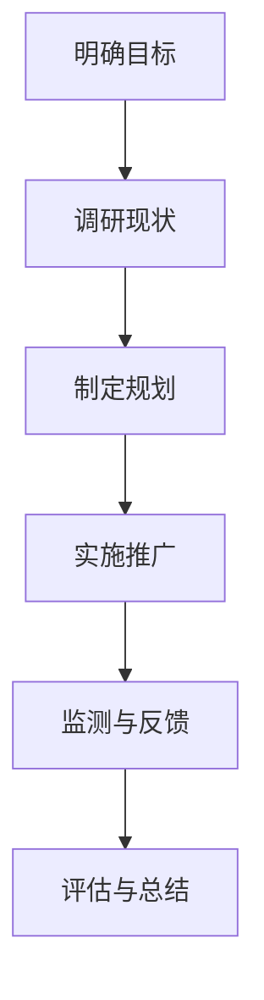
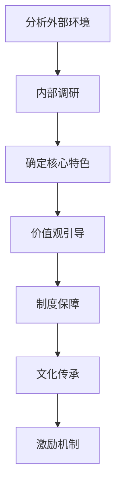

                 

### 1.4 团队文化的历史与发展

#### 1.4.1 团队文化的起源

**历史背景：**
团队文化（Team Culture）的概念起源于20世纪中叶，尤其是在第二次世界大战后的管理理论与实践。当时，随着企业规模的扩大和复杂性的增加，管理者开始意识到团队内部凝聚力和合作效率的重要性。

**关键事件与人物：**
- **霍桑实验**：由埃尔顿·梅奥（Elton Mayo）领导的一系列实验，揭示了工作环境对员工行为和生产力的影响。
- **管理学派**：以道格拉斯·麦格雷戈（Douglas McGregor）的X理论和Y理论为代表，探讨了管理者对员工动机和行为的不同看法。

#### 1.4.2 团队文化的发展历程

**发展阶段：**
1. **初级阶段**（20世纪50-60年代）：以泰勒（Frederick Taylor）的科学管理和法约尔（Henri Fayol）的组织理论为基础，强调管理和效率。
2. **中级阶段**（20世纪70-80年代）：随着组织行为学的兴起，管理者开始关注团队内部的人际关系和员工满意度。
3. **高级阶段**（20世纪90年代至今）：以学习型组织和知识管理为特征，强调团队的学习能力和创新能力。

**重要理论：**
- **企业文化理论**：由彼得·德鲁克（Peter Drucker）等人提出，强调企业文化在组织发展中的作用。
- **团队建设理论**：包括Tuckman的团队发展阶段理论、Lencioni的五项团队效能要素等。

#### 1.4.3 团队文化在当今社会的地位

**当前影响：**
- **企业竞争力**：良好的团队文化能够提升企业的核心竞争力，增强企业的适应能力和创新能力。
- **员工满意度**：团队文化对员工的满意度和忠诚度有显著影响，有助于留住优秀人才。
- **组织变革**：团队文化在组织变革过程中起到关键作用，有助于推动变革的顺利进行。

**未来趋势：**
- **个性化团队文化**：随着员工个性化需求的增加，团队文化将更加注重满足员工多样化的需求。
- **数字化团队文化**：数字化转型将推动团队文化向更高效、更灵活的方向发展。

### 结论

团队文化是一个复杂但关键的概念，它在组织管理和团队运作中起着至关重要的作用。了解团队文化的起源和发展历程，有助于我们更好地理解和塑造团队文化，从而提升团队的整体效能。

**Mermaid流程图：**

通过上述内容，我们不仅了解了团队文化的定义和重要性，还探讨了团队文化的历史与发展，为后续章节的深入探讨奠定了基础。

## 第2章：团队文化的核心要素

### 2.1 团队价值观

#### 2.1.1 团队价值观的定义与作用

**核心概念与联系：**
- 团队价值观（Team Values）是团队内部共同认同并遵循的基本信念和原则，是团队文化的核心要素之一。

**定义与作用：**
- **定义**：团队价值观是指团队成员在行为和决策过程中所遵循的基本信念和原则，是团队的灵魂和导向。
- **作用**：
  - **导向作用**：明确团队的发展方向和行为准则。
  - **凝聚作用**：增强团队成员的归属感和团队凝聚力。
  - **决策基础**：为团队成员提供共同的决策框架和标准。

#### 2.1.2 团队价值观的要素

**概念属性特征对比表格：**
| 要素       | 特征                                                         | 对比           |
| ---------- | ------------------------------------------------------------ | ------------- |
| **使命**   | 明确团队存在的目的和意义                                     | 团队愿景的基础 |
| **愿景**   | 描述团队未来期望达到的状态和目标                             | 团队方向的指南 |
| **信念**   | 团队成员共同认可的基本理念                                  | 行为指导原则  |
| **目标**   | 团队短期内需要实现的具体目标                               | 实施的具体任务 |
| **原则**   | 团队在运作过程中必须遵循的基本准则                          | 行为规范依据  |

#### 2.1.3 团队价值观的塑造方法

**Mermaid流程图：**

**详细讲解与举例说明：**
- **明确使命与愿景**：团队需要明确其存在的目的和未来期望达到的状态，这为团队提供了清晰的发展方向。
- **调研团队信念与目标**：通过调研了解团队成员的共同信念和目标，以确保制定的价值观具有广泛认同性。
- **制定核心价值观**：将调研结果转化为具体的价值观表述，确保团队成员在行为和决策中有一致的标准。
- **沟通与共识**：通过团队会议和讨论，确保所有成员对核心价值观的理解和认同。
- **持续优化**：团队价值观需要根据团队发展进行调整和优化，以适应不断变化的外部环境。

### 2.2 团队行为规范

#### 2.2.1 团队行为规范的定义与作用

**核心概念与联系：**
- 团队行为规范（Team Behavioral Norms）是指团队成员在团队中应遵循的行为准则和规范，是团队文化的具体体现。

**定义与作用：**
- **定义**：团队行为规范是指团队内部规定的行为准则，包括工作方式、沟通方式和团队规范等。
- **作用**：
  - **规范行为**：确保团队成员的行为符合团队要求，避免行为偏差。
  - **提升效率**：通过明确的行为规范，提高团队工作的效率和协作性。
  - **维护秩序**：保持团队内部的和谐与稳定，减少冲突和误解。

#### 2.2.2 团队行为规范的要素

**概念属性特征对比表格：**
| 要素           | 特征                                                         | 对比                   |
| -------------- | ------------------------------------------------------------ | --------------------- |
| **工作方式**   | 团队成员在完成工作时应遵循的方法和流程                     | 团队运作的基础        |
| **沟通方式**   | 团队成员之间的沟通方式、沟通频率和沟通渠道                 | 信息传递的保障       |
| **团队规范**   | 团队内部制定的行为准则和纪律要求                           | 团队秩序的维护者      |

#### 2.2.3 团队行为规范的塑造方法

**Mermaid流程图：**

**详细讲解与举例说明：**
- **制定基本规范**：团队需要根据自身的特点和发展需求，制定符合实际的基本行为规范。
- **沟通与共识**：通过团队会议和讨论，确保所有成员对行为规范的理解和认同。
- **实施与监督**：团队需要建立监督机制，确保行为规范在日常工作中的落实。
- **反馈与改进**：定期收集成员的反馈，对行为规范进行评估和改进，以适应团队的发展。

### 2.3 团队沟通与协作

#### 2.3.1 团队沟通与协作的定义与作用

**核心概念与联系：**
- 团队沟通与协作（Team Communication and Collaboration）是指团队成员之间通过信息交流和工作配合来共同完成任务的过程。

**定义与作用：**
- **定义**：团队沟通与协作是指团队成员之间通过语言、文字、符号等多种方式进行的信息交流和协作过程。
- **作用**：
  - **信息交流**：确保团队成员之间信息的畅通，减少误解和冲突。
  - **协同工作**：通过协作，提高团队的工作效率和成果质量。
  - **知识共享**：促进团队成员间的知识交流，提升团队的整体智力水平。

#### 2.3.2 团队沟通与协作的要素

**概念属性特征对比表格：**
| 要素       | 特征                                                         | 对比                   |
| ---------- | ------------------------------------------------------------ | --------------------- |
| **沟通渠道** | 团队内部沟通的途径，如面对面交流、电话会议、电子邮件等      | 信息传递的方式        |
| **沟通频率** | 团队成员之间的交流频率                                     | 信息流通的速度       |
| **协作机制** | 团队成员协同工作的方法和流程                               | 工作配合的保障       |
| **协作工具** | 团队协作使用的工具，如项目管理系统、即时通讯工具、共享文档等 | 工作效率的提升者     |

#### 2.3.3 团队沟通与协作的塑造方法

**Mermaid流程图：**

**详细讲解与举例说明：**
- **制定沟通协作规范**：团队需要根据实际需求，制定沟通协作的基本规范，明确沟通方式和协作流程。
- **建立沟通渠道与工具**：选择适合团队的沟通渠道和工具，如项目管理系统、即时通讯工具等，确保信息传递的效率和效果。
- **定期会议与反馈**：定期召开团队会议，收集成员的意见和建议，及时调整沟通协作方式和流程。
- **协作机制实施与监督**：建立协作机制，确保团队成员按照规范进行工作配合，同时实施监督，及时发现并解决问题。

### 结论

团队文化的核心要素包括团队价值观、团队行为规范和团队沟通与协作，这些要素相互关联、相互支撑，共同构成了团队文化的核心框架。通过明确和塑造这些核心要素，团队可以形成强大的内在动力，推动团队的发展和进步。

## 第3章：团队文化的评估与诊断

### 3.1 团队文化评估的方法

#### 3.1.1 自我评估问卷法

**核心概念与联系：**
- 自我评估问卷法是一种通过团队成员自行填写问卷来评估团队文化的方法，它能够快速获取团队成员对团队文化的认知和感受。

**优点：**
- **直观性**：通过问卷的形式，可以直接了解团队成员对团队文化的认知和满意度。
- **灵活性**：可以根据团队的具体情况设计问卷，涵盖不同的文化维度。

**缺点：**
- **主观性**：团队成员的反馈可能受到个人情感和偏见的影响，结果可能存在偏差。

**应用场景：**
- **团队初期建设**：用于了解团队成员对团队文化的期望和认知，为后续的团队文化建设提供参考。
- **团队绩效评估**：用于评估团队文化对团队绩效的影响，发现问题并进行改进。

#### 3.1.2 深度访谈法

**核心概念与联系：**
- 深度访谈法是一种通过与团队成员进行深入访谈来了解团队文化的方法，它能够挖掘团队成员的真实感受和看法。

**优点：**
- **深入性**：通过深入访谈，可以获取团队成员对团队文化的深度理解和真实感受。
- **准确性**：访谈过程可以确保信息的准确性和真实性，减少主观偏见。

**缺点：**
- **耗时较长**：深度访谈需要花费较长时间，对访谈者的技能要求较高。

**应用场景：**
- **团队文化建设**：用于深入了解团队成员对现有团队文化的看法和建议，为团队文化建设提供依据。
- **团队诊断**：用于诊断团队文化中存在的问题，找到改进的方向。

#### 3.1.3 360度评估法

**核心概念与联系：**
- 360度评估法是一种通过团队成员、上级、同事和下属等多方反馈来评估团队文化的方法，它能够全面了解团队文化的各个方面。

**优点：**
- **全面性**：通过多方位的反馈，可以全面了解团队文化的各个方面，减少单一视角的偏差。
- **客观性**：多方反馈可以相互验证，提高评估的客观性。

**缺点：**
- **协调困难**：需要协调不同反馈者的时间和意见，可能影响评估的效率。

**应用场景：**
- **团队绩效评估**：用于评估团队文化对团队绩效的影响，发现优势和不足。
- **团队发展计划**：用于制定团队发展计划，为团队提供改进方向。

### 3.2 团队文化诊断工具

#### 3.2.1 文化诊断量表

**核心概念与联系：**
- 文化诊断量表是一种通过量表形式对团队文化进行评估的工具，它包含一系列与团队文化相关的指标和问题。

**优点：**
- **标准化**：量表设计标准化，便于对比和分析不同团队的差异。
- **量化**：可以通过量化指标来衡量团队文化的各个方面，便于数据分析和决策。

**缺点：**
- **主观性**：量表结果可能受到设计者和使用者主观因素的影响。

**应用场景：**
- **团队文化评估**：用于对团队文化进行全面的量化评估，为团队文化建设提供数据支持。
- **员工培训**：用于了解员工的团队文化认知和培训需求，制定针对性的培训计划。

#### 3.2.2 文化扫描工具

**核心概念与联系：**
- 文化扫描工具是一种通过信息化手段对团队文化进行快速诊断的工具，它能够自动收集和分析团队成员的行为数据。

**优点：**
- **效率高**：通过自动化收集和分析数据，提高诊断的效率。
- **实时性**：能够实时监测团队文化的变化，及时发现问题。

**缺点：**
- **数据偏差**：数据收集过程可能存在偏差，影响诊断结果的准确性。

**应用场景：**
- **团队文化监测**：用于实时监测团队文化的变化，及时发现潜在问题。
- **团队管理**：用于分析团队运作中的文化问题，为团队管理提供依据。

#### 3.2.3 文化氛围分析工具

**核心概念与联系：**
- 文化氛围分析工具是一种通过分析团队成员的工作环境、工作氛围和行为表现来评估团队文化的工具。

**优点：**
- **全面性**：通过多维度分析，可以全面了解团队文化的各个方面。
- **直观性**：通过图表和报告形式，直观展示团队文化的现状和问题。

**缺点：**
- **复杂度**：分析过程较为复杂，对工具的依赖性较高。

**应用场景：**
- **团队文化建设**：用于评估团队文化建设的效果，为改进团队文化提供依据。
- **团队诊断**：用于诊断团队文化中的具体问题，制定改进措施。

### 结论

团队文化的评估与诊断是团队文化建设的重要环节，通过多种评估和诊断方法，可以全面了解团队文化的现状和问题，为团队文化建设提供数据支持和改进方向。选择适合的方法和工具，有助于提高评估和诊断的准确性和有效性，为团队的发展奠定坚实基础。

## 第4章：团队文化塑造的策略

### 4.1 团队文化塑造的目标

**核心概念与联系：**
- 团队文化塑造的目标是指团队在文化建设过程中所追求的具体结果和标准，是指导团队文化塑造工作的重要依据。

**定义与目标：**
- **定义**：团队文化塑造的目标是指团队在文化建设过程中所期望达到的具体状态和标准。
- **目标**：
  - **提升团队凝聚力**：通过共同的文化价值观和行为规范，增强团队成员之间的联系和信任，提升团队的凝聚力。
  - **提高团队效能**：通过优化团队沟通与协作机制，提升团队的工作效率和成果质量。
  - **促进个人成长**：为团队成员提供良好的文化环境，促进其个人能力和职业发展的提升。

**具体目标示例：**
- **提高员工满意度**：通过营造积极向上的团队氛围，提升员工的工作满意度和归属感。
- **强化团队创新能力**：通过鼓励创新和知识分享，提升团队的创新能力和竞争力。
- **建立良好的工作流程**：通过明确的工作规范和流程，提高团队的工作效率和协作效率。

### 4.2 团队文化塑造的方法

**核心概念与联系：**
- 团队文化塑造的方法是指为实现团队文化塑造目标所采取的具体行动和措施，是团队文化建设的实践手段。

**常见方法：**
1. **领导倡导**：领导者通过身体力行和宣传倡导，树立正确的文化价值观和行为规范。
2. **教育培训**：通过培训和研讨会等形式，向团队成员传授文化价值观和行为规范，提高其文化素养。
3. **制度规范**：通过制定和执行相关的规章制度，确保文化价值观和行为规范在日常工作中的落实。
4. **激励机制**：通过奖励和表彰等方式，激励团队成员积极践行文化价值观和行为规范。
5. **沟通互动**：通过团队会议、团队建设活动等，增强团队成员之间的沟通与互动，促进文化认同。

### 4.3 团队文化塑造的步骤

**核心概念与联系：**
- 团队文化塑造的步骤是指实现团队文化塑造目标的具体流程和环节，是团队文化塑造工作的具体操作指南。

**详细步骤：**
1. **明确目标**：明确团队文化塑造的目标，确保团队全体成员对文化建设有共同的认识和期待。
2. **调研现状**：通过调研了解团队的现状，包括文化现状、团队成员的认知和行为习惯等，为文化建设提供基础数据。
3. **制定规划**：根据调研结果，制定具体的团队文化建设规划，包括文化价值观的确定、行为规范的制定、教育培训的计划等。
4. **实施推广**：按照规划实施文化建设措施，通过领导倡导、教育培训、制度规范、激励机制等方式，逐步推广和落实文化价值观和行为规范。
5. **监测与反馈**：建立文化监测机制，定期收集团队成员的反馈，监测文化建设的效果，及时调整和优化文化建设方案。
6. **评估与总结**：在文化建设完成后，进行全面的评估和总结，评估文化建设的效果和不足，总结经验教训，为后续的文化建设提供参考。

**Mermaid流程图：**

### 结论

团队文化塑造是一个系统性、持续性的过程，需要明确目标、科学规划、有效实施和持续优化。通过制定合理的策略和步骤，团队可以逐步建立起符合自身特点和文化价值观的团队文化，为团队的发展提供强大的内在动力。

## 第5章：团队特色与文化建设

### 5.1 建立团队特色的必要性

**核心概念与联系：**
- 团队特色（Team Distinctiveness）是指团队在文化、行为、风格等方面与其他团队显著不同的特征，它是团队在激烈竞争中脱颖而出的重要因素。

**必要性分析：**
1. **差异化竞争**：在竞争激烈的商业环境中，团队特色可以帮助团队在众多相似团队中脱颖而出，形成独特的竞争优势。
2. **增强团队凝聚力**：团队特色有助于团队成员建立共同的身份认同，增强团队凝聚力和归属感，提高团队的整体效能。
3. **提升品牌价值**：团队特色可以成为企业品牌的重要组成部分，提升企业的品牌价值和市场影响力。
4. **促进创新与发展**：独特的团队文化可以激发团队成员的创新思维和创造力，推动团队不断进步和发展。

**具体案例：**
- **谷歌（Google）**：谷歌以其开放、创新和以人为本的文化而闻名，这种特色使其在科技行业中独树一帜，吸引了全球顶尖人才。
- **阿玛尼（Armani）**：阿玛尼公司以其独特的时尚品味和设计风格，建立了强大的品牌形象，成为奢侈品行业的领军者。

### 5.2 团队特色的定位与塑造

**核心概念与联系：**
- 团队特色的定位与塑造是指确定团队独特的文化特征并将其融入团队运作中的过程，是团队文化建设的重要组成部分。

**定位过程：**
1. **分析外部环境**：了解市场需求、行业趋势和竞争对手的文化特色，为团队特色的定位提供外部参考。
2. **内部调研**：通过调研了解团队成员的个人偏好、价值观和行为习惯，为团队特色的内部定位提供数据支持。
3. **确定核心特色**：根据外部环境和内部调研结果，确定团队的核心特色，如创新、协作、客户导向等。

**塑造方法：**
1. **价值观引导**：通过确立明确的价值观，引导团队成员在行为和决策中体现团队特色。
2. **制度保障**：通过制定相关的规章制度，确保团队特色在日常工作中的落实。
3. **文化传承**：通过团队活动、培训和文化传承机制，将团队特色内化为团队成员的自觉行为。
4. **激励机制**：通过奖励和激励措施，鼓励团队成员积极践行团队特色，强化团队文化的认同感。

**Mermaid流程图：**

### 5.3 团队特色文化的传播与维护

**核心概念与联系：**
- 团队特色文化的传播与维护是指确保团队特色文化在团队内外得到有效传播和长期保持的过程。

**传播方法：**
1. **内部传播**：
   - **团队会议**：在团队会议中，强调团队特色的重要性和具体表现。
   - **团队培训**：通过培训课程，向团队成员传授团队特色的相关知识和技能。
   - **内部宣传**：利用内部通讯工具和渠道，宣传和展示团队特色的故事和案例。

2. **外部传播**：
   - **媒体报道**：通过媒体报道，向外界展示团队特色和文化。
   - **社交网络**：利用社交媒体平台，宣传团队特色，吸引潜在合作伙伴和人才。
   - **合作伙伴**：与合作伙伴分享团队特色，建立良好的合作关系，共同推广团队文化。

**维护措施：**
1. **持续沟通**：通过定期沟通和交流，确保团队成员对团队特色有持续的认识和认同。
2. **文化传承**：通过故事讲述、榜样示范等方式，传承和弘扬团队特色文化。
3. **反馈机制**：建立反馈机制，及时收集成员的意见和建议，对团队特色进行持续优化。
4. **激励与表彰**：通过激励和表彰措施，鼓励团队成员积极践行团队特色文化。

### 结论

团队特色是团队文化的重要组成部分，建立和传播团队特色文化有助于提升团队的核心竞争力和品牌价值。通过科学的定位和有效的传播与维护，团队特色文化可以成为团队发展的重要驱动力，推动团队在竞争中获得持续成功。

## 第6章：团队文化塑造的案例研究

### 6.1 案例一：企业A的团队文化建设

**背景介绍：**
企业A是一家高科技企业，致力于创新科技的研发和应用。在快速发展的过程中，企业A意识到团队文化对其成功至关重要。为了提高团队的整体效能和凝聚力，企业A启动了团队文化建设项目。

**团队文化评估：**
- **自我评估问卷法**：通过问卷调查，企业A了解了团队成员对现有文化的认知和满意度，发现存在沟通不畅和协作不足的问题。
- **深度访谈法**：通过与团队成员的深度访谈，企业A进一步挖掘了团队文化中的具体问题，包括工作氛围不佳和价值观不统一。

**文化建设策略：**
1. **明确核心价值观**：企业A通过内部讨论，确定了“创新、协作、客户至上”的核心价值观。
2. **制定行为规范**：企业A制定了明确的工作方式和行为规范，包括高效的沟通机制、明确的任务分工和共享的决策流程。
3. **实施教育培训**：企业A定期举办文化培训，向全体员工传达核心价值观和行为规范，并鼓励员工积极践行。

**文化建设成效：**
- **提高员工满意度**：通过文化建设，企业A的员工满意度显著提升，员工之间的沟通和协作更加顺畅。
- **增强团队凝聚力**：团队成员对企业的认同感和归属感增强，团队的凝聚力得到了显著提升。
- **促进创新与发展**：企业A的创新能力和竞争力显著提高，成功推出了一系列具有市场影响力的新产品。

**案例启示：**
- **明确核心价值观**：明确的核心价值观是团队文化的基石，有助于统一团队成员的思想和行为。
- **持续教育培训**：通过持续的教育培训，可以确保团队成员对文化价值观的理解和认同。
- **关注员工反馈**：及时关注员工的反馈，有助于发现问题并及时调整文化建设策略。

### 6.2 案例二：团队B的成功实践

**背景介绍：**
团队B是一家跨国咨询公司的内部团队，主要负责为客户提供咨询和解决方案。在项目实施过程中，团队B意识到团队文化对其工作效率和客户满意度有显著影响。

**文化建设策略：**
1. **建立开放沟通机制**：团队B通过定期团队会议和开放沟通渠道，鼓励团队成员分享想法和反馈，确保信息的畅通和透明。
2. **制定明确的团队规范**：团队B制定了详细的团队规范，包括工作流程、沟通方式和行为准则，确保团队成员在日常工作中有章可循。
3. **实施跨文化培训**：团队B考虑到团队成员来自不同文化背景，定期举办跨文化培训，提高团队成员的文化适应能力和团队协作能力。

**文化建设成效：**
- **提升工作效率**：通过明确的沟通机制和规范，团队B的工作效率显著提高，项目交付周期缩短。
- **增强客户满意度**：团队成员的协作和沟通能力增强，客户对团队的服务质量和解决方案满意度提高。
- **促进跨文化理解**：团队成员通过跨文化培训，对其他文化有了更深入的了解和尊重，团队的文化包容性显著提升。

**案例启示：**
- **建立开放沟通机制**：开放沟通机制有助于提高团队的协作效率和创新能力。
- **制定明确的规范**：明确的团队规范有助于统一团队成员的行为和价值观。
- **跨文化培训**：跨文化培训有助于增强团队的文化适应能力和团队合作能力。

### 6.3 案例分析与启示

**共性分析：**
- **重视文化建设**：两个案例的企业和团队都认识到团队文化的重要性，并采取了积极的文化建设措施。
- **明确核心价值观**：案例一和案例二都通过明确的核心价值观来统一团队成员的思想和行为。
- **实施教育培训**：两个案例都通过持续的教育培训来提高团队成员的文化素养和认同感。

**差异分析：**
- **企业文化与团队文化**：案例一是企业层面的文化建设，案例二是团队层面的文化建设，两者在实施策略和效果上有一定差异。
- **文化特点**：案例一的核心价值观是“创新、协作、客户至上”，案例二的核心价值观是“开放沟通、规范运作、跨文化理解”。

**总结与启示：**
- **文化建设的系统性**：团队文化建设需要综合考虑内部和外部环境，制定系统的文化建设策略。
- **持续性与适应性**：文化建设不是一蹴而就的过程，需要持续投入和调整，以适应团队发展的变化。
- **文化建设的个性化**：每个团队都有其独特的文化需求和特点，需要根据实际情况制定个性化的文化建设方案。

### 结论

通过案例研究，我们可以看到团队文化塑造的重要性和成功实践的方法。明确核心价值观、持续教育培训和关注员工反馈是团队文化建设的核心要素。不同类型的团队在文化建设过程中应充分考虑其特点和需求，制定适合的文化建设方案，以提升团队的整体效能和竞争力。

## 第7章：团队文化塑造的挑战与应对

### 7.1 团队文化塑造的挑战

**挑战一：文化冲突**

**核心概念与联系：**
- 文化冲突是指团队成员在价值观、行为规范和沟通方式等方面的差异导致的冲突，它可能阻碍团队文化的塑造。

**挑战分析：**
- **多样性挑战**：团队成员可能来自不同的文化背景，拥有不同的价值观和行为习惯，这可能导致团队内部的冲突。
- **融合难度**：不同文化之间的融合需要时间和努力，如果处理不当，可能影响团队的凝聚力和工作效率。

**应对策略：**
- **建立多元文化意识**：通过培训和宣传活动，增强团队成员对多元文化的认识和尊重。
- **制定包容性政策**：制定包容性的政策和规范，确保不同文化背景的成员都能在团队中找到归属感。
- **建立沟通平台**：建立开放的沟通渠道，鼓励团队成员表达观点和反馈，减少误解和冲突。

**挑战二：变革阻力**

**核心概念与联系：**
- 变革阻力是指团队成员对文化变革的抵触和抗拒，它可能影响文化塑造的推进。

**挑战分析：**
- **惯性思维**：团队成员可能习惯了现有的工作方式和文化环境，对新文化的接受度较低。
- **利益相关者影响**：变革可能会影响某些团队成员的利益，他们可能会通过各种方式抵制变革。

**应对策略：**
- **强化领导力**：领导者需要通过示范和引导，推动团队成员接受新文化。
- **沟通与共识**：通过透明的沟通和充分的讨论，确保团队成员理解变革的必要性和好处。
- **激励与奖励**：通过奖励和激励措施，鼓励团队成员积极参与文化变革，降低变革阻力。

**挑战三：资源限制**

**核心概念与联系：**
- 资源限制是指团队在文化塑造过程中面临的人力、物力和时间等方面的不足，它可能影响文化塑造的进展。

**挑战分析：**
- **人力有限**：团队成员可能需要处理大量的日常工作，缺乏时间和精力参与文化塑造活动。
- **资金不足**：文化塑造需要投入一定的资源和资金，如果预算有限，可能影响文化塑造的深度和广度。

**应对策略：**
- **优化资源配置**：合理分配资源，确保文化塑造活动得到充分的支持。
- **借助外部资源**：利用外部咨询机构或专业培训资源，提高文化塑造的效果。
- **分阶段推进**：将文化塑造活动分阶段进行，逐步推进，避免资源过度集中。

**挑战四：外部环境变化**

**核心概念与联系：**
- 外部环境变化是指团队面临的外部市场、技术、政策等环境的变化，它可能对团队文化产生冲击。

**挑战分析：**
- **市场变化**：市场环境的变化可能要求团队调整其文化特征，以适应新的市场需求。
- **技术进步**：技术的快速发展可能带来新的工作方式和协作模式，影响团队文化的稳定性。

**应对策略：**
- **保持灵活性**：团队需要保持灵活性和适应性，及时调整文化特征以应对外部环境的变化。
- **持续学习与更新**：鼓励团队成员持续学习和更新知识，适应新技术和新环境。
- **文化适应性评估**：定期评估团队文化的适应性，及时识别和解决文化冲突和问题。

### 7.2 挑战的应对策略

**核心概念与联系：**
- 应对策略是指团队在面对文化塑造过程中的各种挑战时采取的具体行动和措施，它是确保文化塑造成功的关键。

**综合应对策略：**
1. **领导支持**：领导者的支持和示范作用对文化塑造至关重要，他们需要积极参与并推动文化建设。
2. **全员参与**：鼓励全体团队成员参与文化塑造，提高文化认同感和参与度。
3. **持续沟通**：通过定期的沟通和反馈，确保团队成员对文化塑造的过程和目标有清晰的理解。
4. **灵活调整**：根据实际情况和文化塑造的进展，灵活调整策略和方法，确保文化塑造的有效性。
5. **资源保障**：确保文化塑造活动得到足够的资源支持，包括人力、物力和资金。

### 7.3 团队文化塑造的长期影响

**核心概念与联系：**
- 团队文化塑造的长期影响是指文化塑造对团队长期发展产生的深远的、持续的影响，它是团队文化价值的最终体现。

**长期影响分析：**
1. **团队效能提升**：良好的团队文化可以提高团队的工作效率、协作能力和创新能力，从而推动团队的长期发展。
2. **员工满意度提升**：团队文化对员工的满意度和忠诚度有显著影响，有助于留住优秀人才，提高员工的长期生产力。
3. **组织竞争力增强**：团队文化是组织竞争力的重要组成部分，良好的团队文化可以提升组织的整体竞争力，使其在市场中保持优势。
4. **企业文化传承**：团队文化的塑造不仅影响当前团队，还会对后续团队产生影响，形成持续的文化传承。

**实践建议：**
- **建立长效机制**：通过建立长效的文化建设机制，确保文化塑造的持续性和稳定性。
- **持续评估与改进**：定期对团队文化进行评估和改进，确保文化始终与团队和外部环境相适应。
- **培养文化领袖**：培养一批具有文化领导力的人才，确保团队文化能够得到有效的传承和推广。

### 结论

团队文化塑造过程中面临多种挑战，但通过有效的应对策略，可以克服这些挑战，实现团队文化的成功塑造。长期来看，良好的团队文化对团队和组织的长远发展具有深远的影响，是团队持续成功的关键因素。

## 第8章：团队文化塑造的最佳实践

### 8.1 团队文化塑造的最佳实践

**核心概念与联系：**
- 最佳实践是指团队在文化塑造过程中总结出的成功经验和有效方法，它是团队文化塑造的重要参考和借鉴。

**最佳实践示例：**
1. **案例一：谷歌的文化建设**
   - **实践方法**：谷歌通过明确的价值观和行为规范，如“不作恶”（Don't Be Evil），来引导团队成员的行为和决策。
   - **成功原因**：谷歌的文化建设注重员工福利和创新，这吸引了全球顶尖人才，并推动了公司的持续创新。

2. **案例二：丰田的精益文化**
   - **实践方法**：丰田通过精益生产和管理方法，培养团队成员的协作精神和问题解决能力。
   - **成功原因**：丰田的文化强调持续改进和团队合作，使其在全球汽车行业中保持了竞争优势。

### 8.2 小结与建议

**核心概念与联系：**
- 小结与建议是团队文化塑造过程中的总结和展望，它为团队提供文化建设的方向和改进建议。

**小结：**
- 团队文化塑造是一个持续的过程，需要明确目标、科学规划、有效实施和持续优化。
- 成功的团队文化塑造依赖于领导的支持、全员参与和持续的沟通。

**建议：**
- **明确核心价值观**：团队应明确核心价值观，确保团队成员对文化有共同的理解和认同。
- **实施有效的教育培训**：通过定期培训和文化活动，提高团队成员的文化素养和认同感。
- **建立反馈机制**：建立有效的反馈机制，及时收集和分析团队成员的反馈，持续改进文化建设策略。
- **重视文化传承**：通过故事讲述、榜样示范等方式，传承和弘扬团队特色文化。

### 8.3 注意事项与拓展阅读

**核心概念与联系：**
- 注意事项与拓展阅读是团队文化塑造过程中的重要补充，它为团队提供实践中的注意事项和相关资源，帮助团队更好地理解和实施文化建设。

**注意事项：**
- **尊重多样性**：在文化塑造过程中，应尊重团队成员的多样性，避免文化单一化。
- **避免过度规范化**：在制定行为规范时，应避免过度规范化，以免限制团队成员的创造力和灵活性。
- **持续关注外部环境**：团队文化塑造应考虑外部环境的变化，及时调整文化建设策略。

**拓展阅读：**
- **书籍推荐**：
  - 《团队协作工具》作者：唐纳德·J·科里（Donald J. Cohen）
  - 《变革之舞》作者：约翰·P·科特（John P. Kotter）
- **文章推荐**：
  - “如何建立高绩效团队”作者：迈克尔·马奇（Michael Marquardt）
  - “团队文化：塑造卓越团队的关键”作者：马克·米洛（Mark Milio）

### 结论

通过最佳实践的总结和拓展阅读的推荐，团队可以更好地理解和实施文化建设。明确核心价值观、有效教育培训和持续反馈是团队文化塑造的关键，而注意事项和拓展阅读则为团队提供了实践中的指导和支持。

## 总结与展望

### 总结

本文以《团队文化塑造：建立独特团队特色的方法》为题，详细探讨了团队文化的概念、核心要素、评估与诊断方法、塑造策略、特色文化建设、案例研究、挑战与应对以及最佳实践。通过系统的分析，我们明确了团队文化在组织管理中的关键作用，以及如何通过科学的方法和步骤来塑造和维护团队文化。

**核心结论：**
- 团队文化是团队运作的基石，对团队效能、员工满意度和组织竞争力具有深远影响。
- 明确核心价值观、实施有效的教育培训和建立反馈机制是团队文化塑造的关键。
- 建立独特的团队特色有助于增强团队凝聚力和市场竞争力。
- 团队文化塑造需要考虑多样性、变革阻力和外部环境变化等挑战，并采取相应的应对策略。

### 展望

在未来，团队文化将面临更多的挑战和机遇。随着技术的不断进步和全球化的发展，团队将变得更加多元化和动态化，这要求团队文化更加灵活和适应性。以下是团队文化塑造的几个展望方向：

1. **数字化转型**：数字化转型将推动团队文化向数字化、智能化和灵活性的方向发展，通过新技术提高团队沟通和协作的效率。

2. **个性化文化**：随着员工个性化需求的增加，团队文化将更加注重满足员工的多样化需求，实现个性化文化管理。

3. **文化传承与创新**：团队文化不仅需要传承，还需要不断创新，以适应不断变化的外部环境，保持团队的活力和竞争力。

4. **跨文化融合**：全球化趋势要求团队文化能够融合多元文化，培养团队成员的跨文化适应能力和沟通能力。

5. **持续学习与成长**：团队文化将更加注重持续学习和个人成长，通过不断的学习和培训，提升团队整体素质和创新能力。

### 结论

团队文化塑造是一个持续的过程，需要团队领导者和成员共同努力。通过科学的方法和策略，团队可以建立起具有独特特色和强大凝聚力的文化，推动团队和组织实现持续成功。未来，团队文化将继续在组织管理中发挥重要作用，成为团队发展的重要驱动力。

---

# 团队文化塑造：建立独特团队特色的方法

> 关键词：团队文化、文化建设、特色、价值观、挑战、应对

> 摘要：本文深入探讨了团队文化的概念、核心要素、评估与诊断方法、塑造策略、特色文化建设、案例分析以及挑战与应对。通过系统分析和实际案例，文章揭示了团队文化塑造的重要性和方法，为团队和组织管理者提供了有价值的实践指导。

---

## 文章关键词解析

### 团队文化

**核心概念**：团队文化是指团队内部共有的价值观、信念、行为规范和习惯，它是团队精神和共同行为的体现。

**作用与影响**：团队文化不仅影响团队成员的行为和决策，还决定团队的凝聚力和效能，对组织的整体竞争力具有深远影响。

### 文化建设

**核心概念**：文化建设是指通过一系列有计划、有系统的措施和活动，培养和维护团队的文化价值观和特色。

**作用与影响**：文化建设有助于统一团队成员的思想和行动，增强团队的凝聚力和认同感，提高团队的工作效率和创新能力。

### 特色

**核心概念**：特色是指团队在文化、行为、风格等方面与其他团队显著不同的特征，它是团队在激烈竞争中脱颖而出的关键。

**作用与影响**：团队特色有助于增强团队的竞争力、品牌价值和市场影响力，成为团队在市场竞争中的重要优势。

### 价值观

**核心概念**：价值观是团队文化的基础，是团队成员共同认同的基本信念和目标，是指导团队行为和决策的核心要素。

**作用与影响**：明确的价值观有助于统一团队成员的思想和行为，提高团队的凝聚力和工作效率，推动团队持续发展。

### 挑战

**核心概念**：挑战是指在团队文化塑造过程中遇到的各种困难和问题，如文化冲突、变革阻力和资源限制等。

**作用与影响**：有效应对挑战是团队文化塑造成功的关键，它决定了文化建设的进程和效果。

### 应对

**核心概念**：应对是指团队在面对文化挑战时采取的具体措施和行动，通过这些措施，团队可以克服挑战，实现文化塑造的目标。

**作用与影响**：有效的应对策略有助于确保团队文化建设的顺利进行，提高团队的文化素养和整体效能。

### 文章结构解析

本文分为八个章节，结构如下：

1. **引言**：介绍团队文化塑造的重要性，提出文章的核心问题和目标。
2. **团队文化的概念与理解**：探讨团队文化的定义、核心要素、历史与发展。
3. **团队文化的评估与诊断**：介绍评估与诊断的方法和工具。
4. **团队文化塑造的策略**：讨论团队文化塑造的目标、方法和步骤。
5. **团队特色与文化建设**：分析团队特色的重要性、定位与塑造、传播与维护。
6. **案例研究**：通过实际案例探讨团队文化塑造的实践方法。
7. **挑战与应对**：分析团队文化塑造过程中面临的挑战及应对策略。
8. **最佳实践**：总结最佳实践、小结与建议、注意事项与拓展阅读。
9. **总结与展望**：总结全文内容，提出未来团队文化塑造的展望。

### 引导读者深入思考

**问题引导：**
- 团队文化对团队绩效的影响如何？
- 如何有效评估和诊断团队文化？
- 团队特色对团队竞争力有何影响？
- 团队在塑造文化时面临哪些挑战？
- 如何应对团队文化塑造过程中的挑战？

**思考方向：**
- 团队文化如何通过价值观和行为规范影响团队成员的行为和决策？
- 团队文化的评估与诊断工具如何帮助团队识别和解决文化问题？
- 团队特色如何帮助团队在市场中脱颖而出？
- 团队面临的挑战有哪些，如何有效应对？
- 团队文化塑造的最佳实践有哪些，如何应用到实际工作中？

通过上述问题和思考方向，读者可以更加深入地理解团队文化塑造的重要性，掌握有效的文化塑造方法，从而在组织和团队管理中取得更好的成效。同时，文章的结构和内容设计也为读者提供了一个清晰、系统的学习路径，便于读者逐步掌握相关知识和技能。

