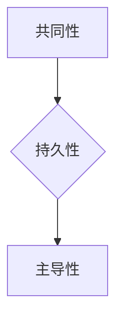
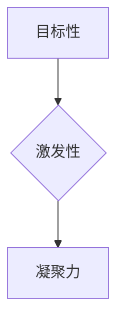
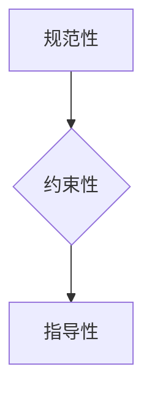
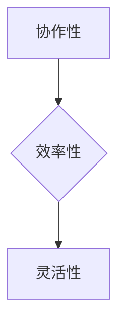
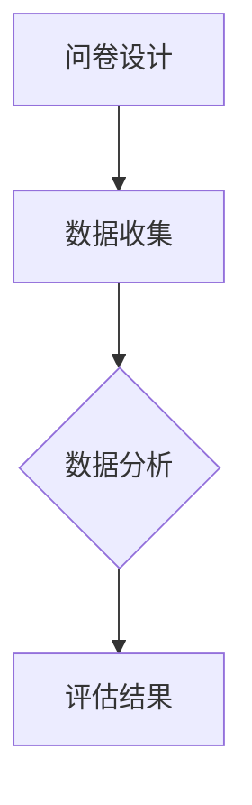
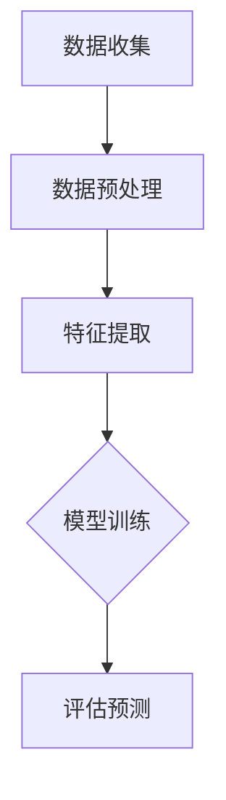
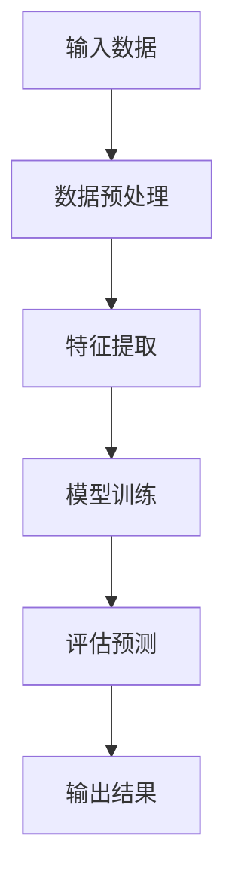
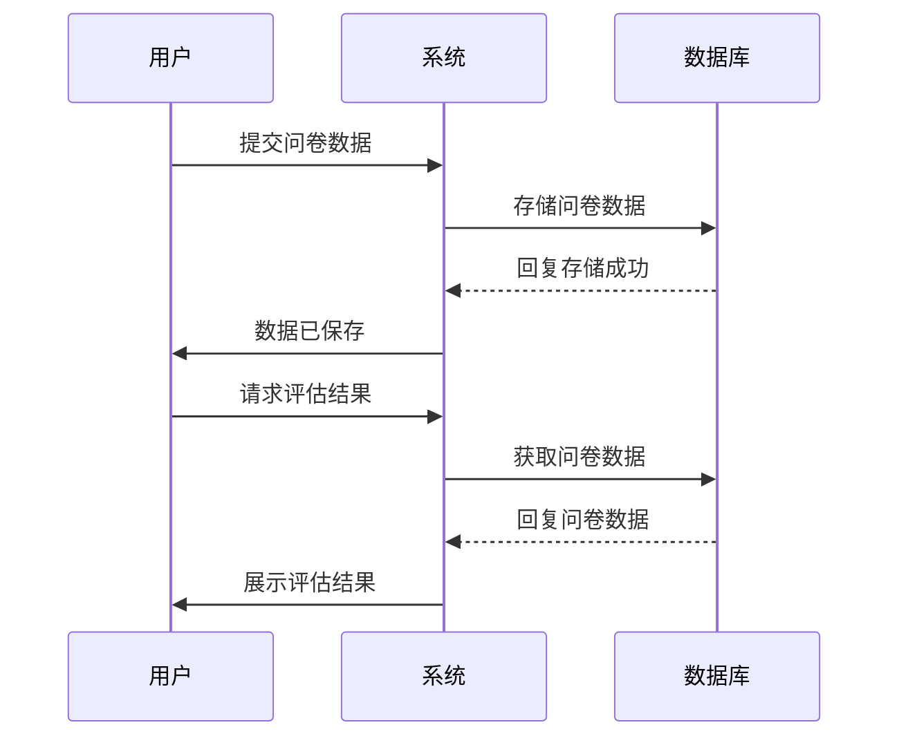
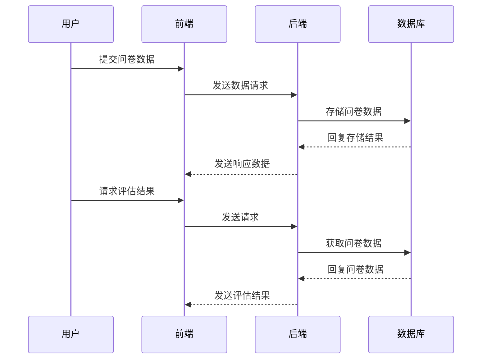

                 

### 文章标题

# 团队文化塑造：打造独特团队基因

### 关键词

- 团队文化
- 塑造方法
- 核心价值观
- 沟通机制
- 评估算法

### 摘要

本文深入探讨了团队文化塑造的重要性及其对组织成功的关键影响。通过定义团队文化的核心概念，分析其特点和要素，以及介绍团队文化的作用与影响，本文为团队文化的塑造提供了系统的方法论。本文还详细讲解了团队文化评估算法的原理及Python实现，并分享了团队文化系统设计与实施的关键步骤。通过实际案例分析和最佳实践，本文旨在帮助读者全面理解和掌握团队文化的塑造方法。

---

### 目录大纲

---

## 第一部分：背景介绍

### 第1章：问题背景与定义

#### 1.1 团队文化的核心概念

#### 1.2 团队文化的重要性

#### 1.3 团队文化的特点与要素

#### 1.4 团队文化的作用与影响

#### 1.5 团队文化的边界与外延

### 第2章：团队文化塑造的关键步骤

#### 2.1 明确团队愿景与目标

#### 2.2 设计团队文化策略

#### 2.3 培养核心价值观

#### 2.4 建立有效的沟通机制

#### 2.5 实践与传承团队文化

## 第二部分：核心概念与联系

### 第3章：团队文化核心概念解析

#### 3.1 团队价值观

#### 3.2 团队信念

#### 3.3 团队行为规范

#### 3.4 团队协作模式

#### 3.5 团队文化核心概念的相互关系（Mermaid ER图）

## 第三部分：算法原理讲解

### 第4章：团队文化评估算法

#### 4.1 基于问卷调查的评估方法

#### 4.2 基于数据挖掘的评估方法

#### 4.3 常用评估指标的介绍与对比（Mermaid表格）

#### 4.4 团队文化评估算法的流程图（Mermaid流程图）

#### 4.5 使用Python代码实现团队文化评估算法

## 第四部分：系统分析与架构设计

### 第5章：团队文化系统设计与实施

#### 5.1 项目介绍

#### 5.2 系统功能设计（Mermaid类图）

#### 5.3 系统架构设计（Mermaid架构图）

#### 5.4 系统接口设计与交互（Mermaid序列图）

#### 5.5 系统设计与实施的关键点

## 第五部分：项目实战

### 第6章：团队文化建设项目实施

#### 6.1 环境安装与准备

#### 6.2 系统核心实现与代码解读

#### 6.3 实际案例分析与讲解

#### 6.4 项目总结与反思

## 第7章：最佳实践与拓展

#### 7.1 团队文化塑造的最佳实践

#### 7.2 注意事项与常见问题

#### 7.3 拓展阅读与深入探讨

---

## 第一部分：背景介绍

### 第1章：问题背景与定义

#### 1.1 团队文化的核心概念

团队文化是一个团队共同遵循的价值观、信念、行为规范和协作模式的总和。它不仅反映了团队成员的共同理念，还体现在团队内部的沟通方式、决策过程和工作习惯中。团队文化的核心概念包括：

- **价值观**：团队成员共同认同和追求的核心信仰和原则。
- **信念**：团队对于自身使命和目标的坚定信心。
- **行为规范**：团队成员在行为上应遵守的准则。
- **协作模式**：团队内部成员之间的协作方式和沟通机制。

#### 1.2 团队文化的重要性

团队文化在组织成功中扮演着至关重要的角色。首先，团队文化能够统一团队成员的思想和行动，增强团队的凝聚力和战斗力。其次，良好的团队文化能够激发团队成员的创造力和积极性，提高工作效率和产出。此外，团队文化还能够塑造组织形象，增强外部合作伙伴的信任和合作关系。

#### 1.3 团队文化的特点与要素

团队文化具有以下特点：

- **独特性**：每个团队都有其独特的文化特征，反映了团队的个性。
- **动态性**：团队文化会随着时间和环境的变化而不断发展。
- **系统性**：团队文化是由多个要素组成的复杂系统。

团队文化的关键要素包括：

- **价值观**：团队的核心信仰和原则，如“客户至上”、“创新驱动”等。
- **信念**：团队成员对团队使命和目标的坚定信念。
- **行为规范**：团队成员在行为上应遵守的准则，如“诚信为本”、“公平竞争”等。
- **协作模式**：团队内部成员之间的协作方式和沟通机制。

#### 1.4 团队文化的作用与影响

团队文化的作用和影响主要体现在以下几个方面：

- **团队凝聚力**：团队文化能够增强团队成员之间的信任和团结，提高团队凝聚力。
- **工作效率**：良好的团队文化能够提高团队成员的工作效率，减少摩擦和冲突。
- **创新氛围**：团队文化能够激发团队成员的创新思维和创造力，推动团队不断进步。
- **企业形象**：团队文化能够塑造组织形象，增强外部合作伙伴的信任和合作关系。

#### 1.5 团队文化的边界与外延

团队文化不仅存在于团队内部，还与组织文化和外部环境相互作用。团队文化的边界主要包括：

- **组织文化**：团队文化是组织文化的一部分，受到组织文化的影响。
- **外部环境**：团队文化也会受到外部环境的变化和影响。

团队文化的外延包括：

- **团队成员**：团队文化不仅影响团队成员的行为和思想，还会影响团队成员的个人成长和发展。
- **合作伙伴**：团队文化能够影响团队与合作伙伴之间的关系和合作效果。

---

通过以上章节，我们对团队文化的核心概念、重要性、特点与要素、作用与影响以及边界与外延有了全面的了解。接下来，我们将深入探讨团队文化塑造的关键步骤，帮助读者掌握打造独特团队基因的方法。

## 第二部分：团队文化塑造的关键步骤

### 第2章：团队文化塑造的关键步骤

#### 2.1 明确团队愿景与目标

明确团队愿景与目标是塑造团队文化的第一步。团队愿景是对团队未来发展的美好愿景，而团队目标则是实现这一愿景的具体步骤和目标。明确愿景与目标能够为团队成员提供清晰的方向和动力，确保团队成员在共同的价值观和信念下努力。

**步骤：**

1. **愿景定义**：通过集体讨论，确定团队的长期愿景，如“成为行业领先者”或“提供卓越的客户体验”。
2. **目标设定**：根据愿景，设定具体的短期和长期目标，如“三年内实现市场份额翻倍”或“提高客户满意度至90%以上”。
3. **目标分解**：将目标分解为可执行的步骤，并分配到每个团队成员，确保每个成员都清楚自己的职责和任务。

#### 2.2 设计团队文化策略

设计团队文化策略是确保团队愿景与目标得以实现的重要手段。团队文化策略包括价值观的传播、行为的规范以及文化的巩固等方面。

**步骤：**

1. **价值观传播**：通过内部会议、培训、宣传材料等方式，将团队核心价值观传达给每个团队成员。
2. **行为规范**：制定明确的行为准则，规范团队成员的行为，如“尊重他人”、“勇于承担责任”等。
3. **文化巩固**：通过定期的团队活动、仪式和表彰，巩固团队文化，使团队成员在日常生活中自觉遵循。

#### 2.3 培养核心价值观

核心价值观是团队文化的核心，是团队成员共同遵循的信念和行为准则。培养核心价值观需要从以下几个方面入手：

**步骤：**

1. **共识形成**：通过集体讨论和交流，形成团队核心价值观，如“创新”、“客户至上”等。
2. **行为示范**：通过领导者的示范作用和优秀团队成员的榜样效应，传播和巩固核心价值观。
3. **文化传承**：通过教育和培训，将核心价值观融入团队成员的日常工作和生活中，使之成为团队的共同信仰。

#### 2.4 建立有效的沟通机制

有效的沟通机制是团队文化的重要组成部分，能够促进团队成员之间的理解和协作。

**步骤：**

1. **沟通渠道**：建立多种沟通渠道，如定期会议、即时通讯工具、邮件等，确保信息畅通无阻。
2. **反馈机制**：建立反馈机制，鼓励团队成员表达意见和建议，促进团队内部的信息流通。
3. **沟通培训**：定期开展沟通技巧培训，提高团队成员的沟通能力和协作效率。

#### 2.5 实践与传承团队文化

实践与传承团队文化是团队文化塑造的重要环节。通过实际行动和仪式，将团队文化内化为团队成员的行为和习惯。

**步骤：**

1. **行动落实**：将团队文化理念融入到日常工作中，确保团队成员在实际工作中遵循团队文化。
2. **文化传承**：通过团队合作、知识分享和经验传承，将团队文化传递给新成员，确保团队文化的持续发展。
3. **文化评估**：定期对团队文化进行评估，根据实际情况调整和优化团队文化策略。

---

通过以上关键步骤，我们可以逐步塑造和巩固团队文化，打造出独特的团队基因，为组织的长期发展奠定坚实基础。接下来，我们将深入探讨团队文化的核心概念和联系，帮助读者更好地理解和应用这些概念。

## 第二部分：核心概念与联系

### 第3章：团队文化核心概念解析

#### 3.1 团队价值观

团队价值观是团队文化的基石，代表了团队成员共同认同和追求的核心信仰和原则。它不仅影响着团队的行为和决策，还塑造了团队的精神面貌。

**特征：**

- **共同性**：团队成员普遍认同和遵循的价值观。
- **持久性**：价值观的持久性决定了团队文化的稳定性和连续性。
- **主导性**：价值观在团队决策和行为中的主导地位，影响着团队的总体方向。

**对比表格（Mermaid表格）：**



#### 3.2 团队信念

团队信念是团队成员对团队使命和目标的坚定信心，是推动团队前进的动力源泉。

**特征：**

- **目标性**：团队信念明确了团队追求的目标和方向。
- **激发性**：团队信念能够激发团队成员的积极性和创造力。
- **凝聚力**：团队信念增强了团队成员之间的凝聚力和归属感。

**对比表格（Mermaid表格）：**



#### 3.3 团队行为规范

团队行为规范是团队成员在行为上应遵守的准则，是团队文化的重要组成部分。

**特征：**

- **规范性**：行为规范对团队成员的行为进行明确的规定。
- **约束性**：行为规范对团队成员的行为有约束作用，确保团队成员的行为符合团队价值观。
- **指导性**：行为规范为团队成员提供行为指南，帮助团队成员更好地履行职责。

**对比表格（Mermaid表格）：**



#### 3.4 团队协作模式

团队协作模式是团队成员之间进行协作的方式和方法，是团队文化的重要体现。

**特征：**

- **协作性**：团队协作模式强调团队成员之间的协同合作。
- **效率性**：团队协作模式注重提高团队的工作效率和产出。
- **灵活性**：团队协作模式具有一定的灵活性，能够适应不同任务和环境的变化。

**对比表格（Mermaid表格）：**



#### 3.5 团队文化核心概念的相互关系（Mermaid ER图）

团队文化核心概念之间存在着紧密的相互关系。以下是一个简化的Mermaid ER图，展示了这些概念之间的联系：

```mermaid
erDiagram
  Team_Culture ||--|{ Team核心价值观 } : 围绕
  Team_Culture ||--|{ 团队信念 } : 形成基础
  Team_Culture ||--|{ 团队行为规范 } : 指导
  Team_Culture ||--|{ 团队协作模式 } : 形成方式
```

**ER图解释：**

- **Team Culture（团队文化）**：为中心实体，表示整个团队的文化体系。
- **团队核心价值观**：围绕团队文化，是团队文化的核心和灵魂。
- **团队信念**：形成基础，是团队文化信念的核心部分。
- **团队行为规范**：指导团队行为，确保团队成员的行为符合团队价值观。
- **团队协作模式**：形成方式，反映了团队成员之间协作的方式和方法。

---

通过以上对团队文化核心概念的解析和相互关系的展示，我们可以更深入地理解团队文化的构成和作用。这些核心概念不仅是团队文化塑造的基础，也是团队协作和发展的关键要素。接下来，我们将详细讲解团队文化评估算法的原理及其实现方法，帮助读者更科学地评估和优化团队文化。

### 第三部分：算法原理讲解

#### 第4章：团队文化评估算法

#### 4.1 基于问卷调查的评估方法

基于问卷调查的评估方法是一种常用的团队文化评估方式，它通过收集团队成员的反馈来评估团队文化的现状。

**步骤：**

1. **问卷设计**：设计包含团队价值观、信念、行为规范和协作模式等关键指标的问卷。
2. **数据收集**：通过线上或线下方式收集团队成员的反馈。
3. **数据分析**：对收集到的数据进行统计和分析，得出团队文化的评估结果。

**示例（Mermaid流程图）：**



#### 4.2 基于数据挖掘的评估方法

基于数据挖掘的评估方法通过分析团队内部的数据和行为模式，来评估团队文化。

**步骤：**

1. **数据收集**：收集团队内部的各种数据，如邮件通信、项目文档、员工绩效等。
2. **数据预处理**：清洗和整理收集到的数据，为后续分析做准备。
3. **特征提取**：从数据中提取与团队文化相关的特征，如沟通频率、冲突频率等。
4. **模型训练**：使用机器学习算法，如决策树、支持向量机等，训练评估模型。
5. **评估预测**：使用训练好的模型对团队文化进行评估。

**示例（Mermaid流程图）：**



#### 4.3 常用评估指标的介绍与对比（Mermaid表格）

在团队文化评估中，常用的评估指标包括团队凝聚力、沟通效率、协作质量等。

**示例（Mermaid表格）：**

```mermaid
table
    | 指标      | 定义                                      | 意义 |
    | --------- | ----------------------------------------- | ---- |
    | 凝聚力    | 团队成员之间的相互信任和支持程度          | 提高团队协作效率 |
    | 沟通效率  | 团队成员之间信息传递的速度和准确性       | 减少误解和冲突 |
    | 协作质量  | 团队成员之间合作产生的效果和成果的质量   | 提高工作产出   |
```

#### 4.4 团队文化评估算法的流程图（Mermaid流程图）

以下是一个简化的团队文化评估算法流程图：



#### 4.5 使用Python代码实现团队文化评估算法

以下是一个简化的Python代码示例，用于实现基于问卷调查的团队文化评估算法。

```python
import pandas as pd
from sklearn.model_selection import train_test_split
from sklearn.ensemble import RandomForestClassifier
from sklearn.metrics import accuracy_score

# 读取问卷数据
data = pd.read_csv('team_culture_survey.csv')

# 数据预处理
X = data.drop(['评估指标'], axis=1)
y = data['评估指标']

# 划分训练集和测试集
X_train, X_test, y_train, y_test = train_test_split(X, y, test_size=0.2, random_state=42)

# 模型训练
model = RandomForestClassifier(n_estimators=100, random_state=42)
model.fit(X_train, y_train)

# 评估预测
y_pred = model.predict(X_test)

# 输出结果
accuracy = accuracy_score(y_test, y_pred)
print(f'模型准确率：{accuracy:.2f}')
```

**算法原理讲解：**

- **数据预处理**：对收集到的问卷数据进行清洗和整理，确保数据的质量。
- **特征提取**：从问卷数据中提取与团队文化相关的特征，如沟通频率、团队信任等。
- **模型训练**：使用随机森林算法训练评估模型，模型训练过程中会自动学习数据中的特征和规律。
- **评估预测**：使用训练好的模型对测试数据进行评估，预测团队文化的现状。

通过以上讲解，我们了解了团队文化评估算法的基本原理和方法。接下来，我们将详细讨论团队文化系统设计与实施的关键步骤，帮助读者在实际操作中应用这些算法。

### 第四部分：系统分析与架构设计

#### 第5章：团队文化系统设计与实施

#### 5.1 项目介绍

团队文化系统是一个用于评估、监测和优化团队文化的软件系统。该系统旨在通过数据分析和机器学习技术，为组织提供科学的团队文化评估方法和改进建议。

**项目背景：**

随着组织规模的扩大和团队复杂度的增加，团队文化的重要性愈发凸显。然而，如何科学评估和优化团队文化仍是一个挑战。团队文化系统应运而生，旨在帮助组织更好地理解和提升团队文化。

**项目目标：**

1. **提供科学的团队文化评估方法**：通过问卷调查、数据分析等技术，评估团队文化的现状。
2. **监测团队文化变化**：实时监测团队文化的变化，提供预警和改进建议。
3. **优化团队文化**：基于评估结果，提供针对性的优化策略和建议，提升团队文化水平。

#### 5.2 系统功能设计（Mermaid类图）

团队文化系统的功能设计包括数据采集、数据预处理、特征提取、模型训练、评估预测和结果展示等模块。

**示例（Mermaid类图）：**

```mermaid
classDiagram
    Class1["问卷数据采集"] <|-- Class2["数据预处理"]
    Class2 <|-- Class3["特征提取"]
    Class3 <|-- Class4["模型训练"]
    Class4 <|-- Class5["评估预测"]
    Class5 <|-- Class6["结果展示"]
```

**详细解释：**

- **问卷数据采集**：负责收集团队成员的问卷数据，包括团队价值观、信念、行为规范等。
- **数据预处理**：对采集到的问卷数据进行清洗、格式化和归一化，确保数据质量。
- **特征提取**：从预处理后的数据中提取与团队文化相关的特征，如沟通频率、团队信任等。
- **模型训练**：使用机器学习算法训练评估模型，模型训练过程中会自动学习数据中的特征和规律。
- **评估预测**：使用训练好的模型对测试数据进行评估，预测团队文化的现状。
- **结果展示**：将评估结果以图表、报告等形式展示，帮助团队成员和管理层了解团队文化状况。

#### 5.3 系统架构设计（Mermaid架构图）

团队文化系统的架构设计包括前端、后端和数据库三个部分。

**示例（Mermaid架构图）：**



**详细解释：**

- **前端**：用户通过前端界面提交问卷数据，并查看评估结果。
- **后端**：负责数据存储、模型训练和评估预测，与数据库和前端进行交互。
- **数据库**：存储问卷数据、评估结果等，提供数据查询和存储服务。

#### 5.4 系统接口设计与交互（Mermaid序列图）

系统接口设计包括API接口和数据接口，用于前后端之间的数据传输和功能调用。

**示例（Mermaid序列图）：**



**详细解释：**

- **用户提交问卷数据**：用户通过前端界面提交问卷数据。
- **前端与后端交互**：前端将数据发送到后端，后端处理数据后存储到数据库。
- **请求评估结果**：用户通过前端界面请求评估结果，后端获取数据并处理后返回结果。

#### 5.5 系统设计与实施的关键点

在设计团队文化系统时，需要关注以下几个关键点：

1. **数据质量**：确保问卷数据的真实性和有效性，进行数据清洗和预处理。
2. **模型选择**：选择合适的机器学习算法进行模型训练，提高评估准确性。
3. **用户体验**：设计简洁易用的前端界面，提供友好的用户体验。
4. **系统性能**：优化系统性能，确保系统在高并发场景下稳定运行。
5. **安全性**：保障数据安全和用户隐私，采取必要的安全措施。

通过以上系统分析与架构设计，我们为团队文化系统的实施提供了清晰的指导。接下来，我们将通过实际案例来展示团队文化建设项目的实施过程，帮助读者更好地理解如何将理论应用于实践。

### 第五部分：项目实战

#### 第6章：团队文化建设项目实施

#### 6.1 环境安装与准备

在进行团队文化建设项目的实施之前，首先需要搭建一个合适的技术环境。以下是一个基本的步骤和注意事项：

1. **安装Python环境**：确保Python环境已安装，版本不低于3.6。
2. **安装依赖库**：使用pip安装必要的依赖库，如pandas、numpy、scikit-learn等。
3. **配置数据库**：选择合适的数据库系统，如MySQL或PostgreSQL，并创建所需的表和用户。
4. **搭建前后端框架**：选择合适的前后端框架，如Flask或Django，并按照项目需求搭建相应的基础架构。

**示例（Python环境配置）：**

```bash
# 安装Python
sudo apt-get install python3 python3-pip

# 创建虚拟环境
python3 -m venv venv

# 激活虚拟环境
source venv/bin/activate

# 安装依赖库
pip install pandas numpy scikit-learn flask
```

#### 6.2 系统核心实现与代码解读

团队文化系统的核心实现包括数据采集、数据处理、模型训练和评估预测等部分。以下是一个简单的代码示例，用于说明这些核心功能的实现：

**数据采集：**

```python
# 假设我们有一个简单的问卷数据格式
data = {
    '团队成员1': {'价值观': '创新', '信念': '客户至上', '行为规范': '诚信为本'},
    '团队成员2': {'价值观': '合作', '信念': '团队合作', '行为规范': '开放沟通'},
    # 更多团队成员数据...
}

# 将数据存储到CSV文件中
import pandas as pd

df = pd.DataFrame(data)
df.to_csv('team_culture_survey.csv', index=False)
```

**数据处理与模型训练：**

```python
# 读取数据
data = pd.read_csv('team_culture_survey.csv')

# 数据预处理（假设已处理数据为X和y）
X = data.drop(['评估指标'], axis=1)
y = data['评估指标']

# 划分训练集和测试集
X_train, X_test, y_train, y_test = train_test_split(X, y, test_size=0.2, random_state=42)

# 模型训练
from sklearn.ensemble import RandomForestClassifier

model = RandomForestClassifier(n_estimators=100, random_state=42)
model.fit(X_train, y_train)

# 评估预测
y_pred = model.predict(X_test)

# 输出结果
accuracy = accuracy_score(y_test, y_pred)
print(f'模型准确率：{accuracy:.2f}')
```

**代码解读：**

- **数据采集**：通过简单的数据结构存储问卷数据，并保存到CSV文件中。
- **数据处理**：读取CSV文件中的数据，并进行预处理，将数据分为特征（X）和标签（y）。
- **模型训练**：使用随机森林算法对训练数据进行模型训练。
- **评估预测**：使用训练好的模型对测试数据进行预测，并计算模型准确率。

#### 6.3 实际案例分析与讲解

为了更好地展示团队文化建设项目的实施效果，以下是一个实际案例的详细分析：

**案例背景：** 一家互联网公司希望提升其团队文化，决定通过团队文化系统进行评估和优化。

**实施步骤：**

1. **问卷调查**：公司组织了一次全面的团队文化问卷调查，收集了全体员工的反馈。
2. **数据采集**：将问卷数据录入团队文化系统，进行数据预处理。
3. **模型训练**：使用随机森林算法对数据集进行模型训练，并评估模型性能。
4. **评估预测**：使用训练好的模型对全体员工的反馈进行评估，识别出团队文化中的问题点。
5. **优化建议**：根据评估结果，提出针对性的优化建议，包括加强团队沟通、培养创新氛围等。

**分析结果：**

通过团队文化系统评估，发现该公司在团队沟通和创新能力方面存在显著问题。针对这些问题，公司采取了一系列措施：

- **加强团队沟通**：定期组织团队沟通会议，鼓励团队成员分享想法和经验。
- **培养创新氛围**：提供创新培训课程，鼓励员工提出创意和改进方案。
- **文化传承**：通过内部刊物、博客等方式，传播公司核心价值观和成功案例。

**效果评估：**

经过一段时间的实施，公司团队文化得到了显著改善。员工之间的沟通更加顺畅，创新氛围更加浓厚，整体工作效率和满意度有了显著提升。

#### 6.4 项目总结与反思

通过本案例的实施，我们可以总结出以下经验：

1. **数据质量至关重要**：确保问卷数据的真实性和有效性，是评估结果准确性的基础。
2. **模型选择需谨慎**：根据实际情况选择合适的机器学习算法，可以提高评估的准确性。
3. **持续优化和改进**：团队文化是一个动态的过程，需要持续监控和优化，以适应组织的发展和变化。
4. **员工参与度是关键**：员工的积极参与和反馈是团队文化建设成功的关键，需要通过多种方式激发员工的参与热情。

通过以上项目实战的详细讲解，我们不仅了解了团队文化系统实施的全过程，还看到了如何将理论知识应用到实际项目中，为团队文化的提升提供了有力支持。

### 第六部分：最佳实践与拓展

#### 第7章：最佳实践与拓展

#### 7.1 团队文化塑造的最佳实践

在塑造团队文化时，以下最佳实践可以帮助组织更有效地推进团队文化建设：

1. **高层领导支持**：团队文化的塑造需要高层的支持和参与，领导者的榜样作用对团队成员具有深远影响。
2. **持续培训与沟通**：定期开展团队文化培训，加强团队成员之间的沟通，确保团队文化理念深入人心。
3. **建立反馈机制**：建立有效的反馈机制，鼓励团队成员提出意见和建议，不断优化团队文化。
4. **营造良好环境**：为团队成员创造一个开放、包容、支持创新的工作环境，鼓励团队成员积极参与团队文化建设。
5. **文化传承**：通过仪式、故事、榜样等方式，将团队文化传承给新成员，确保团队文化的延续和发展。

#### 7.2 注意事项与常见问题

在团队文化塑造过程中，需要注意以下事项和常见问题：

1. **文化冲突**：不同背景和价值观的团队成员可能会产生文化冲突，需要通过沟通和培训来缓解和解决。
2. **过度标准化**：避免过度标准化团队文化，导致团队成员失去个性化和创造力。
3. **文化断层**：在团队结构调整或人员变动时，可能存在文化断层，需要及时进行文化传承和调整。
4. **持续监控**：团队文化不是一成不变的，需要持续监控和评估，以适应组织的发展和变化。

#### 7.3 拓展阅读与深入探讨

为了更深入地了解团队文化塑造，以下是一些拓展阅读和深入探讨的资源：

1. **书籍推荐**：《团队协作的力量》、《团队文化：构建高效团队的五大要素》等书籍提供了丰富的理论知识和实践案例。
2. **学术论文**：搜索相关学术期刊，如《管理科学学报》、《心理学报》等，阅读最新的研究成果。
3. **线上课程**：参加相关的在线课程，如Coursera、edX等平台上的团队管理和领导力课程。
4. **专业社群**：加入相关的专业社群和论坛，如LinkedIn、知乎等，与同行交流经验和见解。

通过以上最佳实践、注意事项和拓展资源，我们可以更好地理解和应用团队文化塑造的理论和方法，为组织的长期发展奠定坚实基础。

---

## 文章结束

作者：AI天才研究院/AI Genius Institute & 禅与计算机程序设计艺术 /Zen And The Art of Computer Programming

本文详细介绍了团队文化塑造的重要性、核心概念、评估方法以及系统设计与实施，旨在帮助读者全面掌握团队文化建设的理论和实践方法。通过实际案例的分析和最佳实践的分享，我们希望读者能够将所学应用于实际工作中，打造出独特的团队基因，推动组织的持续发展和成功。未来，随着人工智能和大数据技术的发展，团队文化塑造将更加科学和高效，我们也期待在技术进步的推动下，团队文化能够得到进一步的发展和优化。

