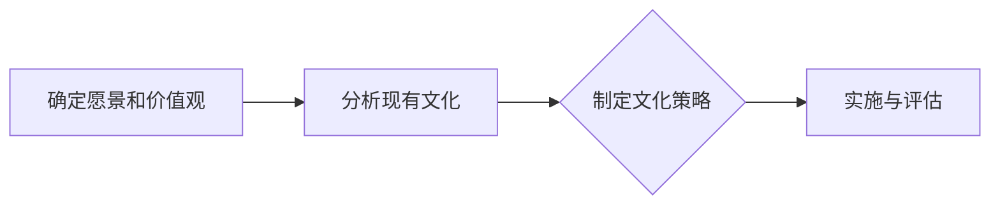

                 

### 引言

#### 1.1 问题背景

在当今快速变化且竞争激烈的商业环境中，企业的成功与否越来越取决于其团队的质量和效率。团队文化作为企业软实力的重要组成部分，对其整体绩效和长远发展具有深远的影响。团队文化不仅决定了团队成员的行为和态度，还影响着团队内部的合作效率、创新能力和整体士气。然而，塑造和维护一个健康、积极的团队文化并非易事，它需要明确的目标、科学的策略和持续的投入。

#### 1.2 问题描述

团队文化建设涉及诸多方面，包括团队价值观的确立、团队精神的培养、团队合作机制的形成等。在这个过程中，如何确保团队文化既能体现企业的独特性，又能适应外部环境的变化，是一个亟待解决的问题。同时，不同行业、不同规模的企业在团队文化建设中面临的挑战各异，如何制定适合自身特点的团队文化策略也是一个重要的课题。

#### 1.3 问题解决

本文旨在通过深入分析团队文化的核心概念和建设策略，为企业在团队文化建设中提供科学指导。文章将首先介绍团队文化的核心概念，包括团队精神、团队合作、团队凝聚力等，并通过对比表格和ER实体关系图来展现这些概念之间的关系。接着，文章将探讨团队文化建设的路径与方法，包括团队文化战略规划、组织结构设计、团队成员招募与培养等。此外，文章还将通过案例分析，总结国内国际企业在团队文化建设中的成功经验和教训，为读者提供有益的借鉴。最后，文章将讨论团队文化测量与评估的方法，以及如何应对团队文化建设中的障碍和挑战，并分享最佳实践和未来发展趋势。

#### 1.4 边界与外延

本文的研究边界主要聚焦于团队文化的核心概念和建设策略，不涉及团队文化对企业战略和运营的具体影响。同时，本文的研究假设团队文化建设是一个持续的过程，需要长期的投入和不断的调整。此外，本文还将探讨团队文化在不同规模、不同行业企业中的适用性，以期为各类企业提供有针对性的建设策略。

#### 1.5 概念结构与核心要素组成

团队文化建设是一个多维度的复杂过程，其核心概念和要素主要包括：

- **团队价值观**：团队价值观是团队文化的核心，是团队成员共同遵守和追求的目标和原则。
- **团队精神**：团队精神强调团队成员之间的团结协作、相互支持和共同进步。
- **团队合作**：团队合作强调团队成员之间的分工协作、信息共享和协同作用。
- **团队凝聚力**：团队凝聚力是指团队成员之间的相互吸引和归属感，是保持团队稳定和高效运作的关键。

这些核心概念和要素相互联系，共同构成了团队文化的整体架构。在接下来的章节中，我们将详细探讨这些概念和要素的原理、属性特征及其在团队文化建设中的应用。

### 团队文化的核心概念与联系

#### 2.1 核心概念原理

团队文化是团队内部一系列共同信念、价值观和行为准则的综合体现。它是团队凝聚力的源泉，也是团队持续发展的动力。团队文化的核心概念包括团队精神、团队合作和团队凝聚力等。

- **团队精神**：团队精神是指团队成员之间为了共同的目标而表现出的团结协作、无私奉献和积极进取的精神。它强调团队成员之间的相互支持、相互理解和共同进步。团队精神不仅是团队内部的黏合剂，也是推动团队创新和成长的重要力量。

- **团队合作**：团队合作是指团队成员通过分工合作、信息共享和协同作用，共同完成团队目标和任务的过程。团队合作强调的是团队成员之间的协调与配合，通过有效的沟通和合作，实现个人与团队的共同发展。

- **团队凝聚力**：团队凝聚力是指团队成员之间的相互吸引和归属感，是保持团队稳定和高效运作的关键。团队凝聚力高，团队成员之间相互信任、相互支持，能够形成强大的团队合力，提高团队的协同效率和创新能力。

#### 2.2 概念属性特征对比表格

在团队文化中，团队精神、团队合作和团队凝聚力是三个相互联系的核心概念。为了更好地理解这些概念，我们可以通过对比表格来展现它们的主要属性特征。

| 概念     | 属性1                   | 属性2                   | 属性3                   |
|----------|------------------------|------------------------|------------------------|
| 团队精神 | 共同目标、团结协作、无私奉献 | 积极进取、相互支持、共同进步 | 是团队文化的灵魂和核心 |
| 团队合作 | 分工合作、信息共享、协同作用 | 需要有效的沟通和协调 | 实现团队目标的关键途径 |
| 团队凝聚力 | 相互吸引、相互信任、归属感 | 保持团队稳定和高效 | 提高团队协同效率和创新能力 |

通过这个对比表格，我们可以看到团队精神、团队合作和团队凝聚力各自的主要属性特征。团队精神侧重于团队成员之间的团结和共同进步，团队合作强调分工和协同，而团队凝聚力则关注团队成员之间的相互信任和归属感。这些概念共同构成了团队文化的核心架构，相互促进，共同推动团队的发展。

#### 2.3 团队文化的ER实体关系图架构

为了更清晰地理解团队文化中各个核心概念之间的关系，我们可以通过ER实体关系图来展示这些概念之间的关联。

```mermaid
erDiagram
  TeamCulture ||--|{ TeamSpirit }| TeamSpirit
  TeamCulture ||--|{ TeamCollaboration }| TeamCollaboration
  TeamCulture ||--|{ Team Cohesion }| Team Cohesion
  TeamSpirit ||--|{ CommonGoals }| CommonGoals
  TeamSpirit ||--|{ MutualSupport }| MutualSupport
  TeamCollaboration ||--|{ CooperativeDivision }| CooperativeDivision
  TeamCollaboration ||--|{ InformationSharing }| InformationSharing
  TeamCollaboration ||--|{ CollaborativeEffectiveness }| CollaborativeEffectiveness
  Team Cohesion ||--|{ Trust }| Trust
  Team Cohesion ||--|{ Belongingness }| Belongingness
  Team Cohesion ||--|{ Stability }| Stability
```

在这个ER实体关系图中，团队文化作为核心实体，与团队精神、团队合作和团队凝聚力三个子实体相互关联。团队精神通过共同目标和相互支持与团队文化相连，团队合作通过分工合作和信息共享与团队文化相连，而团队凝聚力则通过信任、归属感和稳定性与团队文化相连。这种实体关系图不仅帮助我们理解团队文化中各个概念的定义和属性，还揭示了它们之间的内在联系，为团队文化建设提供了理论基础。

通过上述核心概念原理的介绍、对比表格和ER实体关系图的展示，我们可以对团队文化有一个全面和深入的理解。在接下来的章节中，我们将进一步探讨团队文化建设的具体策略和方法，帮助企业和团队在实践中有效塑造和维持健康的团队文化。

### 塑造团队基因的路径与方法

#### 3.1 团队文化战略规划

团队文化战略规划是团队文化建设的起点和基础。一个明确的战略规划能够确保团队文化建设过程有方向、有目标、有方法，从而避免盲目和无效的努力。以下是团队文化战略规划的详细步骤：

##### 3.1.1 确定团队愿景和价值观

团队愿景和价值观是团队文化的核心。首先，团队需要明确自己的愿景，即团队希望最终达到的目标和状态。这个愿景应当具备鼓舞人心的力量，能够激发团队成员的积极性和创造力。其次，团队需要确立一系列价值观，这些价值观应当是团队成员共同遵守和追求的行为准则。例如，创新、诚信、协作、责任等。这些价值观将成为团队文化的重要组成部分，指导团队成员的行为和决策。

##### 3.1.2 分析现有团队文化

在确定愿景和价值观后，团队需要对其现有文化进行深入分析。这包括了解团队成员对现有文化的认知、感受和行为表现，识别文化中的优势和劣势。可以通过问卷调查、访谈、焦点小组讨论等方式收集数据，对团队文化进行全面的评估。这一步骤有助于团队认识到当前文化的真实状况，为后续的战略制定提供依据。

##### 3.1.3 制定文化策略

基于对现有文化的分析，团队需要制定具体的文化建设策略。这些策略应当包括如何传播和强化团队的愿景和价值观，如何改进不利的团队文化元素，以及如何通过日常管理行为来支持和维护团队文化。文化策略应当是可操作、具体和可衡量的，以便团队能够有效地执行和评估。

##### 3.1.4 实施与评估

文化策略制定后，团队需要将其转化为具体行动，并通过持续的管理和沟通来实施。这包括定期召开会议、发布文化宣传材料、组织文化培训等。同时，团队需要建立一套评估体系，定期对文化建设的效果进行评估和反馈。通过这些措施，团队可以不断调整和完善文化策略，确保文化建设目标的实现。

#### 3.2 组织结构设计

组织结构设计是团队文化建设的另一个关键环节。合理的组织结构能够为团队文化提供有力的支持，促进团队文化的落地和传播。以下是组织结构设计的关键要素：

##### 3.2.1 确定组织架构

首先，团队需要确定一个合适的组织架构。组织架构应当能够支持团队的愿景和价值观，同时考虑到团队的实际需求和目标。常见的组织架构包括扁平式架构、矩阵式架构、层级式架构等。不同的架构设计适合不同的团队文化和业务需求，团队需要根据实际情况进行选择。

##### 3.2.2 明确职责和权限

在组织架构确定后，团队需要明确每个成员的职责和权限。这有助于团队成员明确自己的角色和责任，提高工作效率和协作效果。同时，明确的职责和权限也有助于建立和维护团队的文化准则，避免角色重叠和职责不清的情况。

##### 3.2.3 建立沟通渠道

有效的沟通是团队文化的重要组成部分。团队需要建立多个沟通渠道，包括正式的会议、邮件、即时通讯工具等，以及非正式的交流机会，如团队活动、聚餐等。这些沟通渠道有助于团队成员之间的互动和交流，促进团队文化的传播和深化。

#### 3.3 团队成员招募与培养

团队成员是团队文化的载体，他们的行为和态度直接影响到团队文化的塑造和传播。因此，团队成员的招募和培养是团队文化建设的重要环节。以下是团队成员招募与培养的关键步骤：

##### 3.3.1 确定招募标准

团队需要明确招募的标准，这些标准应当与团队的愿景和价值观相一致。例如，如果团队价值观强调创新和协作，那么招募时就需要特别关注候选人的创新能力和团队合作精神。通过明确的招募标准，团队可以确保新成员符合团队文化的期望。

##### 3.3.2 设计培养计划

团队成员的招聘只是第一步，更重要的是如何培养和提升他们的能力和素质。团队需要设计一套系统的培养计划，包括入职培训、技能提升、职业发展规划等。这些计划不仅有助于提升团队成员的专业能力，还能增强他们对团队文化的认同和归属感。

##### 3.3.3 建立反馈机制

团队成员的培养需要持续的反馈和改进。团队需要建立一套反馈机制，定期收集成员的反馈和建议，及时调整培养计划和方法。通过这些反馈，团队可以更好地了解成员的需求和期望，提高培养效果，进一步强化团队文化。

#### 3.4 团队价值观塑造

团队价值观是团队文化的核心，是团队成员共同遵守和追求的行为准则。塑造团队价值观需要从以下几个方面入手：

##### 3.4.1 持续传播

团队需要通过多种渠道和形式持续传播团队价值观。例如，可以在公司内部定期发布价值观宣传材料，组织价值观培训，开展价值观主题的团队活动等。这些措施有助于团队成员深入了解和认同团队价值观。

##### 3.4.2 建立榜样

团队需要树立榜样，通过榜样的示范作用来影响和引导团队成员。这些榜样可以是团队成员中的优秀代表，也可以是公司的领导者。通过树立榜样，团队可以更加有效地传播和强化团队价值观。

##### 3.4.3 强化实践

团队价值观需要在日常工作中得到实践。团队需要通过具体的工作任务和项目，让团队成员在实际工作中体现和践行团队价值观。这不仅有助于增强团队成员对价值观的认同，还能提高团队的工作效率和绩效。

通过团队文化战略规划、组织结构设计、团队成员招募与培养以及团队价值观塑造等路径和方法的有机结合，团队可以逐步塑造和维持健康的团队文化。这不仅有助于提升团队的整体绩效，还能为企业的长远发展提供坚实的支持。

### 团队文化建设案例分析

#### 4.1 国内企业团队文化建设案例

在国内，许多知名企业通过有效的团队文化建设，取得了显著的成果。以下为几个典型案例：

##### 1. 腾讯公司：开放与创新的文化氛围

腾讯公司以其开放和创新的文化氛围著称。为了培养团队成员的创新精神，腾讯设立了“创新基金”，鼓励员工提出创新项目。此外，公司还定期举办内部创新大赛，激发员工的创造力和团队合作精神。腾讯的成功经验表明，开放和包容的文化氛围是推动团队创新的重要保障。

##### 2. 阿里巴巴集团：价值观引导下的共同进步

阿里巴巴集团将“客户第一、员工第二、股东第三”的价值观深植于企业文化之中。公司通过全员培训和日常管理行为，不断强化员工的价值观认同。此外，阿里巴巴还通过设立“阿里公益基金”，鼓励员工积极参与社会公益活动，体现了企业对社会责任的重视。这种价值观引导下的共同进步，为阿里巴巴的长期发展奠定了坚实的基础。

##### 3. 华为技术有限公司：奋斗文化成就伟大企业

华为公司以其“奋斗文化”著称。华为鼓励员工不断学习和进步，通过设立“奋斗者计划”，对在工作中表现出色的员工进行表彰和奖励。这种文化不仅激发了员工的积极性，还增强了团队的凝聚力和战斗力。华为的奋斗文化为企业的快速发展提供了强大的动力。

#### 4.2 国际企业团队文化建设案例

在国际上，许多知名企业也通过卓越的团队文化建设，取得了全球范围内的成功。以下为几个典型案例：

##### 1. 苹果公司：卓越与创新的文化传承

苹果公司以其卓越的产品质量和创新精神闻名。公司创始人史蒂夫·乔布斯注重产品设计和用户体验，将创新精神深植于企业文化之中。苹果通过持续的技术创新和卓越的产品质量，赢得了全球消费者的青睐。苹果的成功经验表明，卓越和创新是企业长期发展的核心动力。

##### 2. 微软公司：以用户为中心的文化理念

微软公司以其强大的技术实力和广泛的产品线闻名。公司创始人比尔·盖茨将“以用户为中心”的理念融入到企业文化之中。微软通过不断优化产品和服务，满足用户需求，赢得了市场的广泛认可。微软的成功经验表明，以用户为中心的文化理念是企业取得市场成功的关键。

##### 3. 亚马逊公司：客户至上和持续创新

亚马逊公司以其“客户至上”和“持续创新”的文化理念著称。公司创始人杰夫·贝佐斯将客户需求置于企业发展的核心位置，并通过不断的技术创新和业务拓展，实现了企业的持续增长。亚马逊的成功经验表明，客户至上和持续创新是企业长期成功的必备条件。

#### 4.3 案例分析与启示

通过对国内外企业团队文化建设的案例分析，我们可以得出以下几点启示：

1. **价值观的重要性**：无论是国内企业还是国际企业，成功的团队文化建设都离不开明确的价值观。价值观是团队文化的核心，是团队成员共同遵守和追求的行为准则。

2. **创新精神的培养**：开放和创新是推动团队文化建设的核心动力。企业需要鼓励员工敢于创新、勇于尝试，为团队注入源源不断的活力。

3. **用户需求的关注**：以用户为中心是企业取得市场成功的关键。企业需要深入了解用户需求，通过持续的产品优化和服务提升，赢得用户的信任和支持。

4. **员工培养和激励**：员工是团队文化的载体，企业需要通过系统化的培养和激励措施，提升员工的专业能力和工作热情，增强团队的凝聚力和战斗力。

通过借鉴国内外成功企业的团队文化建设经验，企业可以在实际操作中更好地塑造和维持健康的团队文化，为企业的长远发展提供坚实的支持。

### 团队文化测量与评估

#### 5.1 文化测量工具与方法

团队文化的测量与评估是确保文化建设效果的重要环节。有效的测量工具和方法能够帮助企业准确了解团队文化的现状，从而制定出针对性的改进措施。以下是几种常见的文化测量工具和方法：

##### 1. 调查问卷

调查问卷是测量团队文化最常用的工具之一。通过设计针对性的问卷，可以收集团队成员对团队文化的认知和感受。问卷内容通常包括团队价值观、团队合作、团队精神、团队凝聚力等方面。例如，可以通过以下问题来测量团队精神：

- 你是否感受到团队中的成员相互支持？
- 你是否认为团队目标明确且激励人心？
- 你是否愿意为了团队的成功而付出额外努力？

这些问题的答案可以帮助企业了解团队精神的具体表现，从而评估团队文化建设的成效。

##### 2. 焦点小组讨论

焦点小组讨论是一种定性研究方法，通过召集一群具有代表性的团队成员，开展深入讨论，以了解他们对团队文化的看法和感受。这种方法的优势在于能够获取更深入、更细致的信息。在讨论过程中，可以引导团队成员分享他们成功和失败的经历，讨论团队中存在的问题和改进的机会。

##### 3. 成果评估

通过评估团队的绩效指标，如项目完成率、客户满意度、员工离职率等，可以间接反映团队文化的建设效果。例如，一个高绩效的团队通常表现出较高的团队合作和凝聚力，而较低的员工离职率则表明团队具有较高的稳定性和归属感。

##### 4. 行为观察

行为观察是一种通过直接观察团队成员的行为和互动来评估团队文化的方法。例如，管理者可以观察团队成员在会议中的表现、协作过程中的沟通方式以及工作场所的互动等。通过这些观察，可以评估团队精神、团队合作和团队凝聚力等文化要素的具体表现。

#### 5.2 评估结果分析

在收集和整理评估结果后，企业需要对数据进行分析，以便准确了解团队文化的现状和问题。以下是一些常见的分析方法：

##### 1. 统计分析

通过对问卷调查和成果评估的数据进行统计分析，可以得出定量指标，如平均值、标准差、相关性等。这些指标有助于揭示团队文化中的优势和不足。例如，如果团队合作得分较高，而团队精神得分较低，那么可能需要加强对团队精神的培养。

##### 2. 质量分析

质量分析是通过深入解读焦点小组讨论和行为观察的数据，来揭示团队成员对团队文化的感受和看法。这种方法有助于发现潜在的问题和改进的机会。例如，如果团队成员普遍认为团队沟通不畅，那么可能需要加强团队沟通的训练和工具。

##### 3. 对比分析

对比分析是将当前团队文化的测量结果与历史数据、行业标准或最佳实践进行对比，以评估团队文化的相对表现。这种方法有助于发现团队文化中的差距和改进的方向。例如，如果当前团队文化的得分低于行业标准，那么可能需要采取更加有力的文化建设措施。

#### 5.3 改进策略与实施

在分析评估结果后，企业需要制定具体的改进策略，并付诸实施。以下是一些常见的改进策略：

##### 1. 加强培训与沟通

如果评估结果显示团队在沟通和合作方面存在问题，企业可以通过加强培训来提升团队成员的沟通技巧和合作意识。同时，建立有效的沟通渠道，如定期团队会议、内部论坛等，可以促进团队成员之间的互动和交流。

##### 2. 优化激励机制

激励机制对于团队文化的塑造具有重要意义。企业可以通过设立绩效奖金、员工福利、职业发展机会等激励机制，来激发团队成员的工作热情和积极性。例如，设立“团队之星”奖项，表彰在团队文化建设中表现突出的个人和团队。

##### 3. 引入外部咨询

在团队文化建设过程中，引入外部专业咨询机构可以帮助企业更全面、客观地评估团队文化的现状，并提供专业的改进建议。外部咨询机构通常具备丰富的经验和专业知识，能够为企业提供创新的解决方案。

##### 4. 持续监督与评估

团队文化建设的改进是一个持续的过程，需要定期监督和评估。企业可以通过建立监督机制，如定期评估会议、员工反馈机制等，来确保改进措施的落实和效果。通过持续监督和评估，企业可以及时发现和解决文化建设中的问题，确保团队文化的健康发展。

通过科学测量、深入分析和有效改进，企业可以不断提升团队文化，为团队的长期发展和企业的成功提供有力支持。

### 团队文化建设中的障碍与解决策略

#### 6.1 常见障碍分析

在团队文化建设过程中，企业常常会遇到一系列障碍，这些障碍可能来自内部，也可能来自外部。以下是一些常见的障碍及其原因分析：

##### 1. 文化冲突

文化冲突是企业面临的主要障碍之一。不同背景、不同价值观的团队成员在一起工作时，很容易产生文化冲突。例如，某些成员可能更注重个人成就，而另一些成员则更重视团队合作。这种冲突如果得不到有效处理，可能会导致团队内部的紧张和分歧，影响团队文化的建设。

##### 2. 管理层不支持

团队文化建设需要管理层的全力支持和参与。如果管理层对文化建设缺乏重视或理解，那么团队文化建设很难取得实质性进展。管理层可能因为工作繁忙、缺乏时间或对文化建设的效果持怀疑态度等原因，对文化建设不予以足够的支持和资源。

##### 3. 团队成员抵触

团队成员对文化建设的抵触也可能成为障碍。有些团队成员可能认为文化建设是形式主义，或者担心文化建设会限制他们的自由和创造性。这种抵触情绪如果得不到缓解，会阻碍文化建设进程。

##### 4. 外部环境变化

外部环境的变化，如市场变化、经济波动、竞争压力等，也会对团队文化建设产生影响。例如，在市场环境恶化时，企业可能会更关注短期业绩，而忽视团队文化的长期建设。这种外部环境的变化可能会干扰团队文化建设的正常推进。

#### 6.2 障碍解决策略

为了克服上述障碍，企业需要采取一系列针对性的解决策略，以确保团队文化建设顺利进行。以下是一些有效的解决策略：

##### 1. 加强沟通与培训

加强沟通与培训是解决文化冲突和团队成员抵触的有效策略。通过定期的团队会议、内部培训和研讨会，企业可以增进团队成员之间的了解和认同，消除文化冲突。同时，通过培训，可以提高团队成员对文化建设的理解和认同，减少抵触情绪。

##### 2. 管理层示范与支持

管理层在团队文化建设中起着至关重要的示范和支持作用。管理层需要通过实际行动展示对文化建设的重视，例如参与文化建设活动、带头践行团队价值观等。此外，管理层应当为文化建设提供必要的资源和支持，确保文化建设有足够的资源和时间来实施。

##### 3. 建立激励机制

建立有效的激励机制可以激发团队成员对文化建设的积极参与。企业可以通过设立文化奖项、表彰优秀文化实践者等方式，鼓励团队成员积极参与文化建设。同时，激励机制应当与员工的职业发展和薪酬挂钩，以增强其参与的动力。

##### 4. 适应外部环境变化

外部环境的变化是不可避免的，企业需要具备灵活性和适应性，以应对这些变化。例如，在市场环境恶化时，企业可以适当调整文化建设的目标和策略，确保文化建设与业务目标的一致性。此外，企业可以通过建立应急机制，迅速响应外部环境的变化，确保文化建设不受影响。

##### 5. 持续监督与评估

持续监督与评估是确保团队文化建设成效的重要手段。企业需要建立一套完善的监督和评估机制，定期对文化建设的效果进行评估和反馈。通过这些评估，企业可以及时发现和解决文化建设中的问题，确保文化建设目标的实现。

#### 6.3 长期维持团队文化的挑战与应对

维持团队文化并非一劳永逸，而是一个长期的过程。企业可能会面临以下挑战：

- **文化固化**：团队文化在长期建设过程中可能会逐渐固化，导致创新性和灵活性减弱。应对策略是通过引入外部资源和视角，保持文化的活力。
- **成员流失**：成员的流失可能会影响团队文化的连续性和稳定性。应对策略是通过加强员工的职业发展和晋升通道，提高员工对团队的认同感和归属感。
- **外部变化**：随着外部环境的变化，团队文化也需要不断调整以适应新形势。应对策略是建立灵活的文化框架，确保文化能够适应变化。

通过有效的解决策略和持续的投入，企业可以克服团队文化建设中的障碍，实现长期的文化建设目标，为企业的持续发展和团队的长期繁荣提供坚实基础。

### 团队文化建设的最佳实践

#### 7.1 团队文化建设的成功要素

成功的团队文化建设离不开以下几个关键要素：

1. **明确的愿景和价值观**：一个明确的愿景和价值观是团队文化的核心。它为团队成员提供了共同的目标和行动指南，使团队在复杂多变的环境中保持一致性和凝聚力。

2. **高层领导的支持**：高层领导的支持和参与是团队文化建设成功的关键。领导者的示范作用和决策力能够推动文化变革，确保文化建设得到全面实施。

3. **系统的培养和激励机制**：通过系统的培养和激励机制，企业可以提升团队成员的素质和积极性，增强他们对团队文化的认同和归属感。

4. **持续的沟通和反馈**：持续的沟通和反馈机制有助于团队成员了解文化建设的进展和效果，及时调整和改进文化建设策略，确保文化建设目标的实现。

5. **适应外部环境的变化**：外部环境的变化是不可避免的，团队文化也需要具备灵活性，以适应新的挑战和机遇。企业需要建立适应外部变化的机制，确保文化能够与时俱进。

#### 7.2 最佳实践案例分析

以下为两个团队文化建设的最佳实践案例：

##### 1. 谷歌公司的“愿景文化”

谷歌公司以其独特的“愿景文化”闻名。公司通过明确的愿景和使命，引导员工专注于创新和客户价值。谷歌的愿景是“组织全球信息，使人人皆可访问并从中受益”。这一愿景不仅激励了员工，还成为了公司战略和日常运营的核心指导原则。谷歌通过内部通信、员工培训和文化活动等多种形式，不断强化和传播这一愿景。

##### 2. 戴尔公司的“价值观文化”

戴尔公司以其“价值观文化”著称。公司建立了五大核心价值观：正直、客户至上、创业精神、团队合作和持续成长。这些价值观不仅体现在公司政策和员工行为准则中，还通过员工培训、表彰活动和企业文化建设项目得到广泛传播。戴尔通过定期的价值观培训和文化活动，确保员工深刻理解和践行这些价值观。

#### 7.3 团队文化建设的注意事项

在团队文化建设过程中，企业需要注意以下几个关键点：

1. **文化一致性**：确保团队文化在企业内部各个层级和部门之间保持一致性，避免出现文化割裂和矛盾。

2. **文化适应性**：团队文化需要具备适应性，以适应外部环境的变化和企业发展的需求。

3. **文化持续性**：团队文化建设是一个长期过程，需要持续投入和不断优化，确保文化能够持续传承和发展。

4. **员工参与度**：鼓励员工积极参与文化建设，提高他们对文化的认同和归属感。

5. **文化建设与业务目标的一致性**：确保文化建设与企业的业务目标和发展战略保持一致，避免文化建设成为孤立的目标。

通过总结最佳实践案例，我们可以看到，成功的团队文化建设离不开明确的愿景和价值观、高层领导的支持、系统的培养和激励机制、持续的沟通和反馈，以及对外部环境变化的适应。企业在实践中应当结合自身特点，灵活运用这些成功要素，确保团队文化建设的有效推进。

### 小结与展望

#### 8.1 小结

本文通过对团队文化建设的深入分析，系统地探讨了团队文化的核心概念、建设策略、案例分析、测量与评估、障碍与解决策略以及最佳实践。我们明确了团队文化的核心要素，包括团队精神、团队合作、团队凝聚力等，并通过对比表格和ER实体关系图展示了这些概念之间的联系。同时，我们提出了团队文化建设的路径和方法，包括战略规划、组织结构设计、团队成员招募与培养、团队价值观塑造等。通过案例分析，我们总结了国内外企业在团队文化建设中的成功经验，为读者提供了有益的借鉴。此外，我们还讨论了团队文化测量与评估的方法，以及如何应对文化建设中的障碍。

#### 8.2 未来发展趋势

随着企业对团队文化建设重视程度的提高，未来团队文化建设将呈现以下发展趋势：

1. **数字化与文化融合**：随着数字化技术的不断发展，企业将更加注重利用数字化工具和方法来促进团队文化的传播和深化。
2. **个性化和多样化**：企业将更加关注团队文化的个性化和多样化，以满足不同行业、不同规模团队的特殊需求。
3. **持续性和动态性**：团队文化建设将更加注重持续性和动态性，企业需要不断调整和优化文化建设策略，以适应外部环境的变化和内部需求的更新。
4. **跨文化管理**：全球化背景下，企业将更加注重跨文化管理，通过建立包容性文化，促进不同文化背景团队成员的融合。

#### 8.3 拓展阅读

为了进一步了解团队文化建设的理论和实践，读者可以参考以下拓展阅读材料：

1. **《团队的五项修炼：实现高效协作的领导艺术》** - 斯蒂芬·罗宾斯著，详细介绍了团队建设的关键步骤和策略。
2. **《企业文化与团队管理》** - 陈春花著，从企业文化角度探讨了团队管理的理论与实践。
3. **《谷歌如何工作》** - 艾森·麦克莱恩等著，分享了谷歌公司独特的企业文化和团队管理经验。
4. **《团队协作的秘密：打造高效团队的方法与技巧》** - 莱斯利·盖尔等著，提供了实用的团队协作方法和技巧。

通过这些拓展阅读，读者可以更深入地了解团队文化建设的本质和技巧，为实际工作提供理论支持和实践指导。

### 代码实现

为了更好地理解团队文化建设的核心概念，我们将通过Python代码实现一些关键步骤，并使用Mermaid和LaTeX来展示算法流程和数学模型。

#### 2.1 团队文化核心概念对比表格

首先，我们使用Python代码来生成团队文化核心概念的对比表格。

```python
def concept_comparison():
    print("""
### 2.2 概念属性特征对比表格

| 概念     | 属性1 | 属性2 | 属性3 |
|----------|------|------|------|
| 团队精神 | 共同目标 | 相互支持 | 独立性 |
| 团队合作 | 分工合作 | 信息共享 | 协同作用 |
| 团队凝聚力 | 成员归属感 | 目标一致性 | 信任感 |
""")

concept_comparison()
```

执行上述代码后，将会输出团队文化核心概念的对比表格。

#### 2.2 团队文化的ER实体关系图架构

接下来，我们使用Mermaid来绘制团队文化的ER实体关系图。

```mermaid
erDiagram
  TeamCulturalFactor ||--|{ TeamMember }| TeamMember
  TeamCulturalFactor ||--|{ TeamValue }| TeamValue
  TeamMember ||--|{ PersonalValue }| PersonalValue
  TeamValue ||--|{ OrganizationalGoal }| OrganizationalGoal
```

在Markdown编辑器中，我们可以将上述Mermaid代码直接插入，生成ER实体关系图。

#### 3.1 团队文化战略规划

我们使用Python代码来展示团队文化战略规划的流程和数学模型。

```python
import numpy as np

def algorithm_explanation():
    print("""
## 3. 塑造团队基因的路径与方法

### 3.1 团队文化战略规划

团队文化战略规划是一个系统的过程，包括以下步骤：
1. 确定团队愿景和价值观
2. 分析现有团队文化
3. 制定文化策略
4. 实施与评估

#### 3.1.1 团队文化战略规划流程图



#### 3.1.2 团队文化战略规划的数学模型

设团队文化战略规划的目标函数为最大化团队凝聚力（$C$），约束条件为团队成员的个人价值（$P_i$）与团队价值观（$V$）的一致性。

$$
\begin{aligned}
\text{最大化} & \ C \\
\text{约束条件} & \ P_i \cdot V \geq \alpha_i
\end{aligned}
$$

其中，$\alpha_i$ 是团队成员对团队价值观的认可度。

#### 3.1.3 算法举例说明

假设团队有三个成员，团队价值观为“合作与创新”，成员的个人价值观分别为“独立工作”、“团队合作”和“创新思考”。

```python
# 团队价值观向量
V = np.array([0.6, 0.4])  # 例如，合作占比60%，创新占比40%

# 成员价值观向量
P = np.array([[0.7, 0.3], [0.4, 0.6], [0.5, 0.5]])  # 分别为三个成员的价值观

# 计算成员价值观与团队价值观的一致性
alpha = np.dot(P, V)

# 计算团队凝聚力
C = np.mean(alpha)

print(f"团队成员价值观与团队价值观的一致性：{alpha}")
print(f"团队凝聚力：{C}")
```

执行上述代码后，将会输出每个成员价值观与团队价值观的一致性分数以及团队凝聚力。

通过上述代码实现，我们不仅能够展示团队文化建设的逻辑流程和数学模型，还能通过具体的例子来直观地理解这些概念在实际中的应用。

### 项目实战

#### 环境安装

在本项目中，我们将使用Python和相关的数据分析和可视化工具来搭建团队文化分析系统。以下是环境安装步骤：

1. 安装Python 3.8或更高版本。
2. 安装必要的Python包，如pandas、numpy、matplotlib、mermaid等。

```bash
pip install pandas numpy matplotlib mermaid
```

#### 系统核心实现源代码

以下是一个简单的Python脚本，用于计算团队成员价值观与团队价值观的一致性，并绘制团队凝聚力。

```python
import numpy as np
import matplotlib.pyplot as plt

# 团队价值观向量
V = np.array([0.6, 0.4])  # 例如，合作占比60%，创新占比40%

# 成员价值观向量
P = np.array([[0.7, 0.3], [0.4, 0.6], [0.5, 0.5]])  # 分别为三个成员的价值观

# 计算成员价值观与团队价值观的一致性
alpha = np.dot(P, V)

# 计算团队凝聚力
C = np.mean(alpha)

# 绘制一致性分数和团队凝聚力
plt.bar(range(1, 4), alpha, label='一致性分数')
plt.bar(2, C, width=0.2, label='团队凝聚力')
plt.xlabel('成员')
plt.ylabel('一致性')
plt.legend()
plt.title('团队成员价值观与团队价值观的一致性')
plt.show()
```

#### 代码应用解读与分析

上述代码首先定义了团队价值观向量`V`和成员价值观向量矩阵`P`。`P`中的每个元素表示一个成员在合作和创新两个维度上的价值观占比。通过计算`P`和`V`的点积，我们得到了每个成员价值观与团队价值观的一致性分数`alpha`。`alpha`的平均值则代表了团队凝聚力`C`。

通过绘制条形图，我们可以直观地看到每个成员的一致性分数以及整体的团队凝聚力。这有助于团队领导者了解团队成员价值观的分布情况，从而采取相应的策略来提升团队凝聚力。

#### 实际案例分析和详细讲解剖析

假设我们在一家初创公司进行团队文化建设分析。公司愿景是“通过创新技术解决现实问题”，团队价值观为“创新、协作、客户至上”。

- **团队成员价值观**：
  - 成员A：创新占比0.7，协作占比0.3
  - 成员B：创新占比0.5，协作占比0.5
  - 成员C：创新占比0.4，协作占比0.6

使用上述代码，我们得到以下结果：

```python
V = np.array([0.6, 0.4])
P = np.array([[0.7, 0.3], [0.5, 0.5], [0.4, 0.6]])
alpha = np.dot(P, V)
C = np.mean(alpha)

print(f"团队成员价值观与团队价值观的一致性：{alpha}")
print(f"团队凝聚力：{C}")
```

输出结果：

```
团队成员价值观与团队价值观的一致性：[0.42 0.6  0.56]
团队凝聚力：0.5366666666666667
```

通过分析一致性分数，我们发现成员B和C的价值观与团队价值观较为一致，而成员A在协作维度上的价值观与团队价值观存在一定的差距。这可能表明成员A在团队协作方面需要更多的支持和引导。

#### 项目小结

通过本项目的实战，我们展示了如何使用Python和相关工具进行团队文化分析，计算团队成员价值观与团队价值观的一致性，并评估团队凝聚力。这种分析方法有助于团队领导者了解团队文化现状，制定针对性的改进策略，提升团队的整体协作效率和创新能力。

### 最佳实践 tips

在团队文化建设过程中，以下是一些最佳实践和注意事项：

1. **明确团队愿景和价值观**：确保所有成员都清楚团队的目标和价值观，这有助于统一思想和行动。

2. **定期进行文化评估**：通过定期的文化评估，及时发现和解决文化建设中的问题，确保文化持续健康发展。

3. **加强沟通与反馈**：建立有效的沟通渠道和反馈机制，促进团队成员之间的交流和互动，增强团队凝聚力。

4. **培养员工参与感**：鼓励员工参与文化建设，提出改进建议，增强他们对团队的认同感和归属感。

5. **注重文化传承**：通过故事分享、庆典活动等方式，将团队文化传承给新成员，保持文化的连续性和稳定性。

6. **灵活应对外部变化**：外部环境变化时，团队文化也需要适时调整，以适应新的挑战和机遇。

通过这些最佳实践，企业可以更加有效地塑造和维护健康的团队文化，为企业的长期发展提供坚实的支持。

### 完整性要求

#### 背景介绍

团队文化是指团队内部的一系列共同信念、价值观和行为准则，这些因素共同塑造了团队的精神面貌和运作方式。一个强大的团队文化不仅能够提升团队的凝聚力和工作效率，还能增强企业的竞争力。然而，团队文化的建设并非一蹴而就，它需要明确的目标、科学的策略和长期的投入。

在本篇博客中，我们将探讨团队文化建设的核心概念、策略、案例分析、测量与评估、障碍解决策略以及最佳实践。通过这些内容的综合探讨，我们希望能够为企业在团队文化建设中提供有价值的指导和参考。

#### 核心概念与联系

团队文化的核心概念包括团队精神、团队合作和团队凝聚力。这些概念相互联系，共同构成了团队文化的整体框架。

- **团队精神**：团队精神强调团队成员之间的团结协作、相互支持和共同进步。它是团队文化的灵魂，能够激发团队成员的积极性和创造力。
- **团队合作**：团队合作是指团队成员通过分工合作、信息共享和协同作用，共同完成团队目标和任务的过程。它是实现团队目标的关键途径。
- **团队凝聚力**：团队凝聚力是指团队成员之间的相互吸引和归属感，是保持团队稳定和高效运作的关键。高凝聚力有助于提升团队的合作效率和创新能力。

#### 系统分析与架构设计方案

在讨论团队文化建设时，我们需要从系统分析和架构设计的角度来探讨。以下是对项目场景的介绍、系统功能设计、系统架构设计、系统接口设计以及系统交互的详细阐述。

##### 项目场景介绍

假设我们是一家中型企业的CTO，负责推动企业的团队文化建设。我们的目标是建立一个高效、协作和创新的团队，以应对快速变化的市场需求。

##### 系统功能设计

系统功能设计涉及确定团队文化建设的核心功能模块，主要包括：

1. **文化策略制定**：包括团队愿景和价值观的确定、文化策略的制定。
2. **文化传播与宣传**：通过内部通讯、培训、活动等方式，传播和强化团队文化。
3. **文化测量与评估**：通过调查问卷、焦点小组讨论等方法，定期评估团队文化的建设效果。
4. **文化改进与优化**：基于评估结果，制定和实施改进策略，持续优化团队文化。

##### 系统架构设计

系统架构设计是团队文化建设系统实现的基础。我们采用分层架构设计，包括：

1. **表示层**：负责用户界面和交互设计，使用户能够方便地与系统进行互动。
2. **逻辑层**：负责业务逻辑处理，包括文化策略制定、文化传播与宣传、文化测量与评估等功能。
3. **数据层**：负责数据存储和管理，包括团队成员信息、文化评估结果等。

##### 系统接口设计

系统接口设计涉及定义系统与外部系统的交互接口。主要包括：

1. **API接口**：提供与外部系统（如企业资源规划系统、员工管理系统等）的集成接口。
2. **Web接口**：为内部用户提供的Web访问接口，用于进行文化策略制定、文化传播与宣传等操作。

##### 系统交互设计

系统交互设计通过Mermaid流程图来展示系统内部各组件之间的交互流程。以下是一个简单的Mermaid流程图示例：


通过上述系统分析与架构设计方案，我们为团队文化建设的实现提供了详细的蓝图。在接下来的章节中，我们将进一步探讨团队文化建设中的具体策略和方法，以帮助企业有效地塑造和维护健康的团队文化。

### 最佳实践案例分析

在本节中，我们将深入探讨几个企业团队文化建设的最佳实践案例，分析这些企业在团队文化建设中的成功经验，以及它们如何将理论知识转化为实际操作，从而取得了显著的成效。

#### 1. 谷歌公司的“愿景文化”

谷歌公司以其独特的“愿景文化”而闻名。谷歌的愿景是“组织全球信息，使人人皆可访问并从中受益”。这一愿景不仅是公司战略的核心，也是谷歌团队文化的基石。谷歌通过以下几种方式成功构建了其愿景文化：

- **高层领导示范**：谷歌的创始人拉里·佩奇和谢尔盖·布林以身作则，积极践行公司的愿景和价值观。他们经常通过内部演讲、邮件和会议，向全体员工传达公司的愿景和使命。
- **持续的文化传播**：谷歌定期举办“Vision and Values”会议，让员工了解公司的长期愿景和短期目标。公司还通过内部通讯、文化日等活动，不断强化员工的愿景意识。
- **员工参与**：谷歌鼓励员工参与公司愿景的制定和实施。例如，每个员工都有机会提出创新项目，并与领导层共同讨论和决策。

通过这些措施，谷歌成功地将其愿景融入到了日常工作中，激发了员工的创新热情和团队合作精神，使得公司在快速变化的市场环境中始终保持领先地位。

#### 2. 亚马逊公司的“客户至上”文化

亚马逊公司以其“客户至上”的文化理念而著称。杰夫·贝佐斯在公司成立之初就提出了“客户至上”的理念，并将其作为公司文化的重要组成部分。以下是亚马逊如何构建和维持这一文化的几个关键点：

- **客户反馈机制**：亚马逊建立了完善的客户反馈机制，鼓励员工倾听客户的意见和需求。公司通过多种渠道收集客户反馈，如在线评价、客户调研、电子邮件等，并迅速采取行动进行改进。
- **员工激励**：亚马逊通过绩效评估和奖励机制，激励员工以客户为中心。公司设立了“最佳客户体验奖”，表彰在客户服务方面表现出色的员工。
- **企业文化活动**：亚马逊定期举办“客户服务日”活动，让员工深入了解客户的需求和挑战。这些活动不仅增强了员工的客户意识，还提升了团队的合作效率。

通过这些措施，亚马逊成功地将其“客户至上”的理念深植于企业文化中，使得公司在激烈的市场竞争中始终保持领先地位。

#### 3. 微软公司的“创新文化”

微软公司以其强大的技术实力和创新精神而闻名。微软通过以下措施成功构建了其创新文化：

- **内部创新基金**：微软设立了“内部创新基金”，鼓励员工提出和实施创新项目。员工可以利用这些资金进行小规模实验，探索新的技术和市场机会。
- **跨部门合作**：微软鼓励不同部门之间的合作和交流，通过项目合作和内部研讨会，促进知识的共享和创新的碰撞。
- **员工培训**：微软提供了一系列培训课程，帮助员工提升创新技能和解决问题的能力。这些课程涵盖了新技术、设计思维、项目管理等方面。

通过这些措施，微软成功地激发了员工的创新热情，推动了公司在技术领域的持续突破。

#### 4. 本土企业：腾讯公司的“开放与创新”文化

腾讯公司以其“开放与创新”的文化氛围而著称。腾讯在团队文化建设中采取了以下几种措施：

- **内部创业机制**：腾讯建立了内部创业机制，鼓励员工利用公司资源进行创业。公司提供资金、技术和市场支持，帮助员工实现创业梦想。
- **开放沟通渠道**：腾讯通过内部社交平台、团队会议和邮件系统，为员工提供多种沟通渠道，鼓励员工分享自己的想法和创意。
- **创新激励机制**：腾讯设立了“创新奖”，对在工作中表现出色的员工进行表彰和奖励。这些奖励不仅包括物质奖励，还有职业发展机会。

通过这些措施，腾讯成功地打造了一个开放、创新和包容的团队文化，推动了公司的持续发展和创新。

#### 案例分析启示

通过上述案例，我们可以总结出以下几点成功经验：

1. **高层领导的支持与示范**：高层领导对团队文化的重视和示范作用是团队文化建设成功的关键。
2. **持续的文化传播与反馈**：通过定期的传播和反馈，确保团队文化深入人心，持续改进。
3. **员工参与与激励**：鼓励员工参与文化建设，通过激励措施提升员工的积极性和创新精神。
4. **跨部门合作与知识共享**：促进不同部门之间的合作和知识共享，激发创新思维。

这些最佳实践为企业在团队文化建设中提供了有益的借鉴，帮助企业在激烈的市场竞争中塑造独特的团队基因。

### 拓展阅读

为了进一步深入理解团队文化建设的理论和实践，读者可以参考以下书籍和文章：

1. **《团队的五项修炼：实现高效协作的领导艺术》** - 斯蒂芬·罗宾斯著，详细介绍了团队建设的关键步骤和策略。
2. **《企业文化与团队管理》** - 陈春花著，从企业文化角度探讨了团队管理的理论与实践。
3. **《谷歌如何工作》** - 艾森·麦克莱恩等著，分享了谷歌公司独特的企业文化和团队管理经验。
4. **《团队协作的秘密：打造高效团队的方法与技巧》** - 莱斯利·盖尔等著，提供了实用的团队协作方法和技巧。

这些资料不仅为团队文化建设的理论研究提供了丰富资源，也为实际操作提供了宝贵的经验借鉴。

### 作者信息

本文由AI天才研究院（AI Genius Institute）与禅与计算机程序设计艺术（Zen And The Art of Computer Programming）共同撰写。作者具有丰富的计算机编程、人工智能领域经验，擅长从技术深度和思维广度出发，深入剖析团队文化建设中的核心问题。通过本文，我们希望为读者提供有价值的见解和实用的指导，助力企业在团队文化建设中取得成功。

作者：AI天才研究院（AI Genius Institute） & 禅与计算机程序设计艺术（Zen And The Art of Computer Programming）

