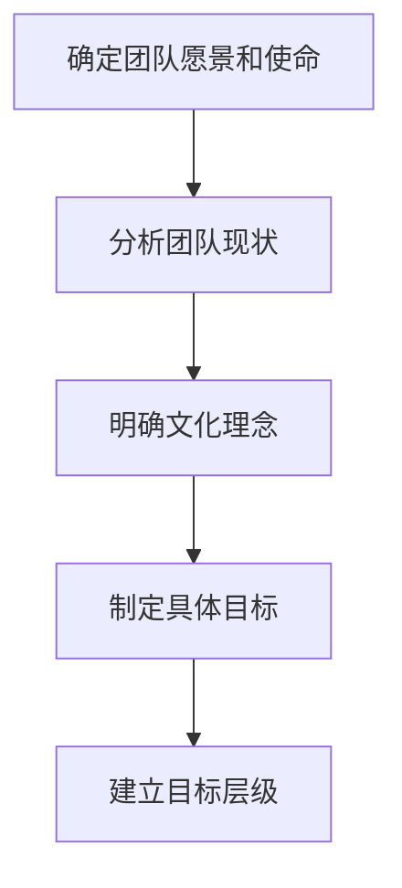
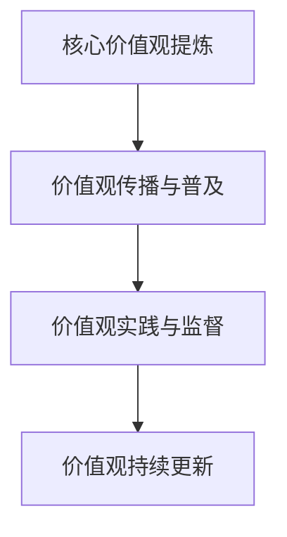
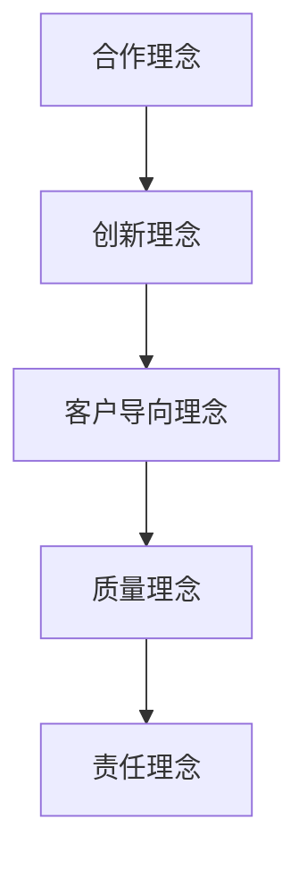
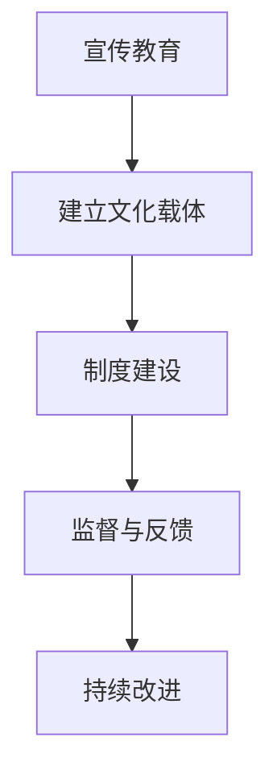
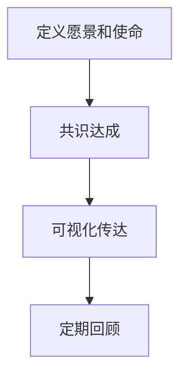
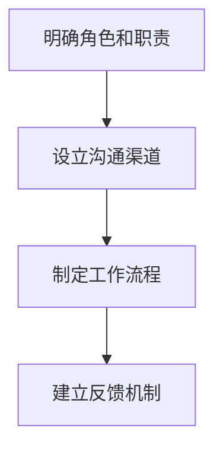

                 

### 文章标题

《团队文化建设：塑造独特的团队基因》

### 关键词

团队文化、文化建设、团队基因、成长型思维、价值观

### 摘要

本文旨在深入探讨团队文化建设的理论基础和实践方法，以塑造独特的团队基因为核心，提供一套系统化的团队文化建设策略。通过分析团队文化的概念、影响因素、评估与诊断、建设策略、传播与维护等方面，结合实际案例，本文旨在为团队管理者提供具有操作性的指导，帮助他们在复杂多变的环境中塑造具有竞争力和持续发展能力的团队。

## 目录

1. **团队文化概述**
   - 1.1 团队的定义与类型
   - 1.2 团队文化的概念
   - 1.3 团队文化的结构与要素

2. **团队文化理论**
   - 2.1 成长型思维与固定型思维
   - 2.2 价值观与团队文化
   - 2.3 团队文化的核心原则

3. **团队文化的影响因素**
   - 3.1 组织结构
   - 3.2 领导风格
   - 3.3 内部沟通
   - 3.4 外部环境

4. **团队文化的评估与诊断**
   - 4.1 团队文化评估的方法
   - 4.2 团队文化诊断工具
   - 4.3 团队文化评估结果的分析与解读

5. **团队文化建设策略**
   - 5.1 制定团队文化建设目标
   - 5.2 设计团队文化价值观
   - 5.3 选择合适的团队文化理念
   - 5.4 团队文化建设的关键步骤

6. **团队文化的传播与维护**
   - 6.1 团队文化宣传策略
   - 6.2 团队文化认同感培养
   - 6.3 团队文化氛围营造
   - 6.4 团队文化持续维护

7. **团队文化建设案例分析**
   - 7.1 案例一：谷歌的团队文化建设
   - 7.2 案例二：阿里巴巴的团队文化建设
   - 7.3 案例三：华为的团队文化建设

8. **塑造独特的团队基因**
   - 8.1 团队基因的概念与特征
   - 8.2 塑造团队基因的方法
   - 8.3 团队基因与团队绩效的关系

9. **实践中的团队基因塑造**
   - 9.1 团队基因塑造的挑战
   - 9.2 团队基因塑造的实践策略
   - 9.3 团队基因塑造的案例分析

10. **团队文化建设与个人成长**
    - 10.1 团队文化建设对个人成长的影响
    - 10.2 个人在团队文化建设中的角色
    - 10.3 如何在团队文化中实现个人成长

11. **总结与展望**
    - 11.1 团队文化建设的重要意义
    - 11.2 团队文化建设的未来发展趋势
    - 11.3 团队文化建设中的持续改进

接下来，我们将一步一步地深入探讨团队文化建设的各个方面，以期为团队管理者提供有价值的参考和指导。让我们开始这段思考之旅吧。

---

### 第1章：团队文化概述

#### 1.1 团队的定义与类型

在探讨团队文化之前，我们首先需要明确团队的定义及其类型。团队（Team）是由多个个体组成，共同完成特定任务的组织形式。团队的核心特征在于成员之间的高效协作和协同工作，而不是简单的个体集合。根据不同的分类标准，团队可以划分为多种类型：

1. **按功能分类**：
   - **项目型团队**：针对特定项目而组建，任务完成后团队可能解散。
   - **职能型团队**：根据组织内部职能划分，如研发团队、市场团队等。
   - **跨职能团队**：由不同职能部门成员组成，旨在解决跨部门问题。

2. **按目标分类**：
   - **目标导向型团队**：以实现特定目标为主要任务。
   - **过程导向型团队**：注重团队内部流程和协作方式。

3. **按结构分类**：
   - **松散型团队**：成员之间协作较少，相对独立。
   - **紧密型团队**：成员之间紧密协作，高度依赖。

#### 1.2 团队文化的概念

团队文化（Team Culture）是指团队在长期发展过程中形成的共同价值观、行为规范和工作方式的总和。它不仅包括团队内部成员的共享价值观，还涵盖了团队如何处理内外部关系、如何解决冲突、如何推动创新等方面的内容。

1. **团队文化的层次**：
   - **显性文化**：包括团队标志、工作环境、规章制度等外在表现。
   - **隐性文化**：包括团队成员的共同信仰、价值观、工作态度等内在特征。

2. **团队文化的作用**：
   - **增强凝聚力**：团队文化能够将成员紧密团结在一起，形成共同的目标和价值观。
   - **提高工作效率**：通过共同的工作方式和价值观，团队成员能够更加高效地协作。
   - **促进创新**：健康的团队文化鼓励创新和尝试，减少失败的风险。

#### 1.3 团队文化的结构与要素

团队文化由多个要素构成，这些要素相互关联，共同塑造团队的独特气质。以下是团队文化的关键结构要素：

1. **价值观**：团队文化的基础，是团队成员共同认同和追求的核心信念。

2. **行为规范**：包括团队成员在工作中的行为准则和道德规范。

3. **工作方式**：团队成员在协作过程中形成的工作方法和习惯。

4. **激励机制**：团队内部的奖励和惩罚机制，影响成员的行为。

5. **沟通机制**：团队成员之间的沟通方式和渠道，影响信息的传递和共享。

#### 1.4 团队文化的重要性

团队文化对于团队的长期成功至关重要。它不仅能够提升团队的凝聚力和工作效率，还能为团队带来以下好处：

1. **增强团队凝聚力**：共同的文化价值观和行为规范能够增强团队成员之间的信任和合作，形成强大的团队凝聚力。

2. **提高团队效率**：明确的团队文化有助于减少沟通成本，提高工作流程的效率。

3. **促进创新**：健康的团队文化鼓励创新思维和实践，激发团队成员的创造力和主动性。

4. **塑造品牌形象**：团队文化直接影响企业的品牌形象，有助于提升企业的市场竞争力。

#### 1.5 团队文化面临的挑战

尽管团队文化的重要性显而易见，但在实际建设过程中，团队文化仍面临诸多挑战：

1. **组织变革的阻力**：团队文化变革往往涉及利益和权力的重新分配，容易遇到阻力和反对。

2. **文化多样性**：团队成员来自不同的背景和文化，如何融合多样性的文化是一个挑战。

3. **持续性的维护**：团队文化需要长期的维护和更新，否则容易陷入形式化和僵化的困境。

在接下来的章节中，我们将进一步探讨团队文化理论、影响因素、评估与诊断、建设策略、传播与维护以及团队基因的塑造，帮助团队管理者更好地应对这些挑战，打造具有竞争力的团队文化。

### 第2章：团队文化理论

#### 2.1 成长型思维与固定型思维

团队文化的一个重要组成部分是团队成员的思维模式。成长型思维（Growth Mindset）和固定型思维（Fixed Mindset）是两种截然不同的思维模式，对团队文化有着深远的影响。

1. **成长型思维**：成长型思维者认为能力是可以通过努力和经验积累不断发展的。他们乐于接受挑战，从失败中学习，并将其视为成长的机会。这种思维模式鼓励创新和持续改进，有助于团队在面对复杂问题和挑战时保持灵活性和适应性。

2. **固定型思维**：固定型思维者则认为能力是固定的，无法改变。他们倾向于避免挑战，害怕失败，往往更容易放弃。这种思维模式可能导致团队成员缺乏创新精神，影响团队的长期发展。

**对比表格**：

| 特征 | 成长型思维 | 固定型思维 |
| --- | --- | --- |
| 对挑战的态度 | 接受挑战，视失败为学习机会 | 避免挑战，害怕失败 |
| 对学习的态度 | 享受学习过程，持续寻求知识 | 对学习持保守态度，拒绝新知识 |
| 对成功的定义 | 成功是不断进步和成长 | 成功是达成既定目标 |
| 对失败的反应 | 从失败中学习，改进方法 | 对失败感到沮丧，避免再次失败 |

**ER实体关系图**：

```mermaid
erDiagram
  TeamMember ||--|{ GrowthMindset } GrowthMindset
  TeamMember ||--|{ FixedMindset } FixedMindset
```

在团队文化中，鼓励成长型思维至关重要。管理者可以通过以下方式来培养成长型思维：

1. **提供反馈**：及时、具体的反馈可以帮助团队成员认识到自己的成长和进步。
2. **创造挑战**：为团队成员设置具有挑战性的目标，鼓励他们不断超越自我。
3. **强调过程**：注重团队成员的努力和进步，而不是仅仅关注结果。

通过培养成长型思维，团队能够更好地应对变化，持续提升团队绩效。

#### 2.2 价值观与团队文化

价值观（Values）是团队文化的核心，是团队成员共同认同和遵循的行为准则。价值观不仅影响着团队成员的个人行为，也决定了团队的整体行为方式。以下是一些重要的团队价值观：

1. **合作**：团队合作是实现团队目标的关键。强调团队成员之间的相互依赖和协作，鼓励开放沟通和共同决策。

2. **诚信**：诚信是团队文化的基石，包括诚实、正直和透明。团队成员应当坚守诚信原则，避免欺骗和隐瞒。

3. **创新**：创新是团队持续发展的动力。鼓励团队成员提出新的想法和解决方案，不断推动团队向前发展。

4. **责任**：团队成员应当对自己的工作和团队的目标负责，积极承担责任，确保任务得到有效执行。

5. **学习**：持续学习是团队成员成长和团队进步的保障。鼓励团队成员不断提升自己的知识和技能。

**价值观对比表格**：

| 价值观 | 合作 | 诚信 | 创新 | 责任 | 学习 |
| --- | --- | --- | --- | --- | --- |
| 定义 | 团队合作是实现团队目标的关键 | 诚信是团队文化的基石，包括诚实、正直和透明 | 创新是团队持续发展的动力 | 团队成员应当对自己的工作和团队的目标负责 | 持续学习是团队成员成长和团队进步的保障 |
| 目标 | 提高团队协作效率 | 增强团队信任和忠诚度 | 推动团队创新和变革 | 提高团队责任感和执行力 | 提升团队整体知识水平 |

**ER实体关系图**：

```mermaid
erDiagram
  TeamValue ||--|{ Collaboration } Collaboration
  TeamValue ||--|{ Integrity } Integrity
  TeamValue ||--|{ Innovation } Innovation
  TeamValue ||--|{ Responsibility } Responsibility
  TeamValue ||--|{ Learning } Learning
```

价值观的建立需要时间和努力，管理者可以通过以下方式来强化团队价值观：

1. **明确价值观**：在团队成立之初，明确并沟通团队的价值观，确保所有成员都了解并认同。
2. **树立榜样**：通过管理者的行为来树立榜样，让团队成员看到价值观的实践。
3. **奖励机制**：将价值观的实践与奖励机制相结合，鼓励团队成员遵循和践行团队价值观。

通过建立和强化团队价值观，团队能够形成一致的行为准则，提升团队凝聚力和工作效率。

#### 2.3 团队文化的核心原则

团队文化的核心原则是团队长期稳定发展的基石，是团队行为的指导方针。以下是一些关键的团队文化核心原则：

1. **开放沟通**：开放沟通是团队协作的基础。团队成员应当能够自由地表达意见和想法，分享信息和知识。这有助于减少误解和冲突，提高团队的决策质量和执行效率。

2. **共享责任**：在共享责任的文化中，团队成员认识到团队目标的实现需要每个人的贡献。每个人都应当对自己的工作负责，同时也应当支持其他成员的工作。这种文化能够增强团队的凝聚力，提高团队的整体绩效。

3. **尊重多样**：尊重多样性意味着团队成员应该尊重彼此的不同观点和背景。多样性不仅带来了不同的思维方式和技能，还有助于团队在面对复杂问题时提供更多的解决方案。尊重多样能够促进创新，提高团队的适应性。

4. **持续学习**：持续学习是团队进步的动力。团队应当鼓励成员不断学习新知识、新技能，并将其应用于实际工作中。这有助于团队不断提升自身的竞争力，适应快速变化的市场环境。

5. **积极进取**：积极进取的团队文化鼓励团队成员勇于面对挑战，积极追求卓越。团队成员应当具有强烈的责任感和使命感，不断追求更高的目标和更好的结果。

**核心原则对比表格**：

| 核心原则 | 开放沟通 | 共享责任 | 尊重多样 | 持续学习 | 积极进取 |
| --- | --- | --- | --- | --- | --- |
| 定义 | 团队成员自由表达意见和想法，分享信息和知识 | 团队成员认识到团队目标的实现需要每个人的贡献 | 团队成员尊重彼此的不同观点和背景 | 团队成员不断学习新知识、新技能，并将其应用于实际工作中 | 团队成员勇于面对挑战，积极追求卓越 |
| 目标 | 提高决策质量和执行效率 | 增强团队凝聚力，提高整体绩效 | 促进创新，提高团队适应性 | 提升团队竞争力，适应市场变化 | 实现更高的目标和更好的结果 |

**ER实体关系图**：

```mermaid
erDiagram
  CorePrinciple ||--|{ OpenCommunication } OpenCommunication
  CorePrinciple ||--|{ SharedResponsibility } SharedResponsibility
  CorePrinciple ||--|{ RespectDiversity } RespectDiversity
  CorePrinciple ||--|{ ContinuousLearning } ContinuousLearning
  CorePrinciple ||--|{ PositiveProgress } PositiveProgress
```

在团队文化建设过程中，管理者应当注重核心原则的实践和传承。以下是一些具体的实践策略：

1. **建立沟通机制**：设立定期的团队会议和沟通渠道，鼓励团队成员开放地交流和分享。
2. **推动责任共享**：通过明确的角色和职责分配，确保每个人都能在自己的岗位上发挥最大价值。
3. **尊重多样性**：鼓励团队成员提出不同意见，并尊重和倾听这些意见。
4. **提供学习资源**：为团队成员提供学习机会和资源，支持他们的持续学习和成长。
5. **设立激励机制**：设立奖励机制，激励团队成员积极进取，追求卓越。

通过坚持和践行团队文化的核心原则，团队能够形成一致的行为规范，提升团队的凝聚力和工作效率，实现持续发展。

### 第3章：团队文化的影响因素

#### 3.1 组织结构

组织结构是团队文化形成和发展的基础，它直接影响团队的工作方式、沟通模式和决策过程。不同的组织结构会对团队文化产生不同的影响。

1. **职能型组织结构**：在职能型组织结构中，团队成员通常按照职能划分，如研发、市场、财务等。这种结构有助于专业化的分工和提高效率，但可能导致部门间的沟通障碍和协作困难。

2. **矩阵型组织结构**：矩阵型组织结构将职能和项目相结合，团队成员既属于特定部门，又参与跨部门项目。这种结构有助于促进跨部门协作和资源整合，但可能会导致角色冲突和职责模糊。

3. **网络型组织结构**：网络型组织结构强调灵活性和快速响应，团队成员可以根据项目需求灵活调配。这种结构有助于快速适应市场变化，但需要高效的沟通和协调机制。

**对比表格**：

| 组织结构 | 职能型组织结构 | 矩阵型组织结构 | 网络型组织结构 |
| --- | --- | --- | --- |
| 特点 | 专业化分工，效率高 | 职能和项目结合，跨部门协作 | 灵活调配，快速响应市场变化 |
| 对团队文化的影响 | 促进专业化，可能导致沟通障碍 | 促进协作，角色冲突和职责模糊 | 促进灵活性，需要高效的沟通和协调机制 |
| 适用场景 | 稳定、成熟的业务 | 需要跨部门协作的项目 | 快速变化的市场环境 |

**ER实体关系图**：

```mermaid
erDiagram
  OrganizationalStructure ||--|{ FunctionalOrganization } FunctionalOrganization
  OrganizationalStructure ||--|{ MatrixOrganization } MatrixOrganization
  OrganizationalStructure ||--|{ NetworkOrganization } NetworkOrganization
```

#### 3.2 领导风格

领导风格对团队文化有着深远的影响，不同的领导风格会塑造不同的团队氛围和工作方式。

1. **指令型领导风格**：指令型领导风格强调权威和控制，领导者制定明确的目标和计划，并对团队成员进行严格的监督和指导。这种风格有助于提高团队的执行力，但可能导致团队成员缺乏自主性和创造力。

2. **支持型领导风格**：支持型领导风格注重团队成员的需求和感受，提供鼓励和资源支持，鼓励团队成员自主决策和承担责任。这种风格有助于增强团队的凝聚力和创新能力，但可能需要更多的时间和资源来培养团队成员。

3. **参与型领导风格**：参与型领导风格强调团队成员的参与和决策，领导者与团队成员共同讨论和决策。这种风格有助于提高团队成员的参与感和责任感，但需要有效的沟通和协调机制。

**对比表格**：

| 领导风格 | 指令型领导风格 | 支持型领导风格 | 参与型领导风格 |
| --- | --- | --- | --- |
| 特点 | 强调权威和控制 | 注重团队成员需求和感受 | 强调团队成员参与和决策 |
| 对团队文化的影响 | 提高执行力，可能导致自主性不足 | 增强团队凝聚力和创新能力 | 提高团队参与感和责任感，需要有效沟通 |
| 适用场景 | 需要高度执行力的项目 | 需要培养团队创新能力的项目 | 需要团队成员高度参与的项目 |

**ER实体关系图**：

```mermaid
erDiagram
  LeadershipStyle ||--|{ DirectiveLeadership } DirectiveLeadership
  LeadershipStyle ||--|{ SupportiveLeadership } SupportiveLeadership
  LeadershipStyle ||--|{ ParticipativeLeadership } ParticipativeLeadership
```

#### 3.3 内部沟通

内部沟通是团队文化的重要组成部分，它直接影响团队的信息传递、协作效率和决策质量。良好的内部沟通有助于形成积极的团队文化，提高团队的凝聚力和工作效率。

1. **正式沟通**：正式沟通通常通过会议、报告、邮件等形式进行，是团队内部信息传递的重要渠道。良好的正式沟通有助于确保信息的准确传递和及时反馈，提高团队的协作效率。

2. **非正式沟通**：非正式沟通通常通过团队聚会、私下交流等形式进行，有助于团队成员建立信任和友谊，增强团队凝聚力。非正式沟通还能够提供更多的信息交流机会，促进团队成员之间的相互理解和合作。

**对比表格**：

| 沟通类型 | 正式沟通 | 非正式沟通 |
| --- | --- | --- |
| 特点 | 通过会议、报告、邮件等形式进行 | 通过团队聚会、私下交流等形式进行 |
| 对团队文化的影响 | 提高信息传递的准确性，增强协作效率 | 增强团队凝聚力，促进团队成员之间的相互理解 |
| 适用场景 | 信息需要准确传递和反馈的场景 | 建立团队成员信任和友谊的场景 |

**ER实体关系图**：

```mermaid
erDiagram
  CommunicationType ||--|{ FormalCommunication } FormalCommunication
  CommunicationType ||--|{ InformalCommunication } InformalCommunication
```

#### 3.4 外部环境

外部环境对团队文化的影响同样不可忽视，包括市场环境、竞争压力、行业趋势等。外部环境的变化会直接影响团队的目标、策略和文化。

1. **市场环境**：市场环境的波动会影响团队的目标和策略。例如，市场需求的变化可能导致团队需要调整产品方向或工作重心。

2. **竞争压力**：竞争压力会促使团队提高效率和创新能力，以保持市场竞争力。这种压力可能会激发团队的创新精神，但也可能导致团队过度紧张和焦虑。

3. **行业趋势**：行业趋势的变化会直接影响团队的发展方向和技术选择。例如，新兴技术的出现可能要求团队迅速调整技术栈和学习新的技能。

**对比表格**：

| 外部环境因素 | 市场环境 | 竞争压力 | 行业趋势 |
| --- | --- | --- | --- |
| 特点 | 市场需求的变化影响团队目标 | 竞争压力促使团队提高效率和创新能力 | 新兴技术的出现影响团队的发展方向 |
| 对团队文化的影响 | 需求变化导致团队策略调整 | 竞争压力激发创新精神，可能导致紧张和焦虑 | 技术变革要求团队快速适应和学习新技能 |
| 适用场景 | 需要市场导向的团队决策 | 需要创新和快速响应的团队 | 需要技术导向的团队发展 |

**ER实体关系图**：

```mermaid
erDiagram
  ExternalEnvironment ||--|{ MarketEnvironment } MarketEnvironment
  ExternalEnvironment ||--|{ CompetitivePressure } CompetitivePressure
  ExternalEnvironment ||--|{ IndustryTrends } IndustryTrends
```

通过理解组织结构、领导风格、内部沟通和外部环境等因素对团队文化的影响，团队管理者可以更好地设计和优化团队文化，提高团队的凝聚力和工作效率。在下一章中，我们将探讨团队文化的评估与诊断，帮助团队管理者了解团队文化现状，为文化建设提供依据。

### 第4章：团队文化的评估与诊断

#### 4.1 团队文化评估的方法

团队文化的评估是团队管理者了解团队文化现状、发现问题并制定改进策略的重要步骤。以下是一些常用的团队文化评估方法：

1. **问卷调查**：问卷调查是最常用的评估方法之一，可以通过设计针对性的问卷，收集团队成员对团队文化的看法和感受。问卷可以包括开放式和封闭式问题，涵盖团队价值观、沟通效果、工作满意度等多个方面。

2. **员工访谈**：员工访谈是一种深入了解团队成员观点和感受的方法。通过面对面或电话访谈，管理者可以与团队成员进行深入交流，了解他们对团队文化的真实感受和建议。

3. **360度评估**：360度评估是一种全面的评估方法，通过收集团队成员、上级、同事和下属对某个团队成员的评价，从多个角度了解该成员的行为和表现。这种方法有助于全面了解团队成员的团队文化适应性和影响力。

4. **行为观察**：行为观察是通过直接观察团队成员的行为和互动，了解团队文化是否得到有效实践。这种方法有助于发现团队文化中的潜在问题和矛盾。

**评估方法对比表格**：

| 评估方法 | 问卷调查 | 员工访谈 | 360度评估 | 行为观察 |
| --- | --- | --- | --- | --- |
| 特点 | 大规模收集数据，覆盖面广 | 深入了解团队成员观点 | 全面了解成员行为和表现 | 直观了解团队文化实践 |
| 优点 | 数据丰富，成本低 | 深入了解，针对性强 | 全面评估，发现潜在问题 | 实时反馈，发现问题及时 |
| 缺点 | 主观性较强，可能受影响 | 成本较高，时间较长 | 隐私问题，数据真实性难保证 | 受限于观察者视角，可能存在偏差 |

**ER实体关系图**：

```mermaid
erDiagram
  EvaluationMethod ||--|{ Survey } Survey
  EvaluationMethod ||--|{ Interview } Interview
  EvaluationMethod ||--|{ 360Assessment } 360Assessment
  EvaluationMethod ||--|{ BehavioralObservation } BehavioralObservation
```

#### 4.2 团队文化诊断工具

团队文化诊断工具是评估团队文化现状、识别问题和制定改进方案的重要工具。以下是一些常用的团队文化诊断工具：

1. **团队文化诊断问卷**：团队文化诊断问卷是一套标准化的问卷，用于评估团队文化的各个方面，如团队价值观、沟通效果、工作满意度等。问卷通常包括多个选择题和开放式问题，能够全面了解团队文化的现状。

2. **团队文化量表**：团队文化量表是一种标准化的评估工具，通过量化指标评估团队文化的健康程度。量表通常包括一系列描述团队文化特征的条目，评估结果可以直观地反映团队文化的优劣。

3. **团队文化模型**：团队文化模型是一种理论框架，用于分析团队文化的构成和影响因素。通过团队文化模型，管理者可以系统地了解团队文化的各个方面，为诊断和改进提供理论依据。

4. **SWOT分析**：SWOT分析是一种常用的战略规划工具，用于评估团队文化的优势、劣势、机会和威胁。通过SWOT分析，管理者可以全面了解团队文化的现状，为制定改进策略提供依据。

**诊断工具对比表格**：

| 诊断工具 | 团队文化诊断问卷 | 团队文化量表 | 团队文化模型 | SWOT分析 |
| --- | --- | --- | --- | --- |
| 特点 | 标准化问卷，全面评估 | 量化指标，直观反映 | 理论框架，系统分析 | 战略规划工具，全面评估 |
| 优点 | 易于操作，数据全面 | 量化结果，直观易懂 | 系统分析，全面评估 | 全面评估，战略规划 |
| 缺点 | 主观性较强，可能受影响 | 数据量较大，分析复杂 | 需要理论支撑，操作难度大 | 需要战略思维，难以具体操作 |

**ER实体关系图**：

```mermaid
erDiagram
  CultureDiagnosisTool ||--|{ CultureDiagnosisQuestionnaire } CultureDiagnosisQuestionnaire
  CultureDiagnosisTool ||--|{ CultureScale } CultureScale
  CultureDiagnosisTool ||--|{ CultureModel } CultureModel
  CultureDiagnosisTool ||--|{ SWOTAnalysis } SWOTAnalysis
```

#### 4.3 团队文化评估结果的分析与解读

团队文化评估结果的分析与解读是团队文化诊断的关键步骤，它有助于管理者了解团队文化的现状、识别问题和制定改进方案。以下是一些关键的步骤和注意事项：

1. **数据整理与初步分析**：首先，需要对评估结果进行数据整理和初步分析，了解各评估指标的平均值、标准差等统计指标。这有助于初步判断团队文化的整体状况。

2. **识别问题**：通过对比分析，可以识别团队文化中存在的问题。例如，如果团队成员对沟通效果的满意度较低，那么沟通问题可能是需要优先解决的关键点。

3. **归类与优先级排序**：将识别出的问题进行归类，并按照重要性和紧迫性进行优先级排序。这有助于管理者明确改进的重点和顺序。

4. **制定改进方案**：根据识别出的问题和优先级排序，制定具体的改进方案。改进方案应当包括具体的行动步骤、责任人、时间和资源安排等。

5. **反馈与沟通**：在制定改进方案后，需要与团队成员进行反馈和沟通，确保他们对改进方案的理解和支持。这有助于提高改进方案的实施效果。

**分析与解读步骤对比表格**：

| 步骤 | 数据整理与初步分析 | 识别问题 | 归类与优先级排序 | 制定改进方案 | 反馈与沟通 |
| --- | --- | --- | --- | --- | --- |
| 特点 | 数据收集、整理和初步分析 | 对比分析，识别问题 | 分类和排序，明确重点 | 行动计划、责任和资源安排 | 改进方案理解和支持 |
| 优点 | 快速了解团队文化现状 | 系统识别问题点 | 明确改进优先级 | 实施计划具体、可行 | 提高实施效果 |
| 缺点 | 主观性较强，数据解读需谨慎 | 可能忽略细节问题 | 需要充分沟通和确认 | 实施难度大，需要持续监督 | 需要时间和精力 |

**ER实体关系图**：

```mermaid
erDiagram
  AnalysisAndInterpretationProcess ||--|{ DataOrganizationAndInitialAnalysis } DataOrganizationAndInitialAnalysis
  AnalysisAndInterpretationProcess ||--|{ ProblemIdentification } ProblemIdentification
  AnalysisAndInterpretationProcess ||--|{ CategorizationAndPrioritySorting } CategorizationAndPrioritySorting
  AnalysisAndInterpretationProcess ||--|{ ImprovementPlanDevelopment } ImprovementPlanDevelopment
  AnalysisAndInterpretationProcess ||--|{ FeedbackAndCommunication } FeedbackAndCommunication
```

通过系统化的团队文化评估与诊断，团队管理者可以深入了解团队文化的现状，识别问题并制定改进方案，从而提升团队的凝聚力和工作效率。在下一章中，我们将探讨团队文化建设的策略，帮助团队管理者有效地塑造和优化团队文化。

### 第5章：团队文化建设策略

#### 5.1 制定团队文化建设目标

制定团队文化建设目标是团队文化建设的第一步，明确的目标有助于指导整个建设过程，确保团队文化朝着正确的方向发展和改进。以下是制定团队文化建设目标的关键步骤：

1. **确定团队愿景和使命**：团队愿景和使命是团队文化的基石，它们明确了团队的未来方向和核心任务。团队愿景应当具有吸引力和激励性，使命则应当具体明确团队在社会或市场中的角色和价值。

2. **分析团队现状**：在制定目标之前，需要全面了解团队的现状，包括团队的结构、流程、成员的特点和行为等。通过分析现状，可以发现团队文化中存在的问题和不足，为制定目标提供依据。

3. **明确文化理念**：团队文化理念是团队文化的核心价值，是团队成员共同追求的目标和行为准则。明确文化理念有助于形成一致的文化认同，增强团队的凝聚力和向心力。

4. **制定具体目标**：具体目标是实现团队文化建设目标的具体步骤和行动方案。这些目标应当是可量化、可实现的，并且要具有明确的时间节点。例如，提高团队成员的沟通效率、增强团队的创新精神、提升团队成员的工作满意度等。

5. **建立目标层级**：团队文化建设目标应当分为长期目标和短期目标，长期目标通常是指一年或更长时间内要实现的目标，短期目标则是在一个季度或半年内要实现的目标。通过建立目标层级，可以确保团队文化建设既有远大的目标，也有具体的行动计划。

**制定团队文化建设目标流程图**：



#### 5.2 设计团队文化价值观

团队文化价值观是团队文化的核心，是团队成员共同遵循的行为准则和信仰。设计团队文化价值观需要考虑以下几个方面：

1. **核心价值观的提炼**：核心价值观应当是团队长期发展过程中形成的，能够反映团队的独特性和核心价值。通过访谈、问卷调查等方式，可以收集团队成员的意见和建议，提炼出具有代表性的核心价值观。

2. **价值观的传播与普及**：设计出核心价值观后，需要通过多种渠道进行传播和普及，确保所有团队成员都了解并认同这些价值观。可以通过团队会议、内部培训、海报、宣传册等形式，让团队成员深入了解和接受核心价值观。

3. **价值观的实践与监督**：价值观的实践和监督是团队文化建设的核心环节。团队管理者应当通过日常管理行为和监督机制，确保团队成员在实际工作中践行核心价值观。例如，通过设立奖惩机制，鼓励团队成员遵循核心价值观。

4. **价值观的持续更新**：团队文化价值观不是一成不变的，应当根据团队的发展和外部环境的变化进行持续更新。通过定期评估和反馈，可以发现核心价值观中存在的问题和不足，并进行相应的调整和优化。

**设计团队文化价值观流程图**：



#### 5.3 选择合适的团队文化理念

选择合适的团队文化理念是团队文化建设的重要环节，不同的团队文化理念会对团队的工作方式、决策过程和团队绩效产生深远的影响。以下是一些常见的团队文化理念及其特点：

1. **合作理念**：合作理念强调团队内部的高效协作和资源共享，鼓励团队成员共同面对挑战和解决问题。这种理念有助于提升团队的凝聚力和执行力，但需要建立良好的沟通机制和协作平台。

2. **创新理念**：创新理念鼓励团队成员敢于尝试新思路和新方法，追求卓越和创新。这种理念有助于推动团队的技术进步和业务发展，但需要提供相应的创新资源和容错机制。

3. **客户导向理念**：客户导向理念强调以客户需求为导向，关注客户的满意度和体验。这种理念有助于提升客户满意度和市场竞争力，但需要建立高效的客户反馈机制和服务流程。

4. **质量理念**：质量理念强调对工作质量的追求和重视，注重细节和过程的控制。这种理念有助于提升产品和服务的质量，但需要建立严格的质量标准和监控机制。

5. **责任理念**：责任理念强调团队成员对自己的工作负责，对团队的目标和任务负责。这种理念有助于提升团队成员的责任感和执行力，但需要建立明确的责任分配和监督机制。

**团队文化理念对比表格**：

| 团队文化理念 | 合作理念 | 创新理念 | 客户导向理念 | 质量理念 | 责任理念 |
| --- | --- | --- | --- | --- | --- |
| 特点 | 高效协作，资源共享 | 敢于尝试，追求创新 | 以客户需求为导向，关注客户体验 | 注重质量，细节控制 | 对工作负责，对团队负责 |
| 适用场景 | 需要协作完成复杂任务 | 需要技术创新和业务发展 | 需要提升客户满意度和市场竞争力 | 需要高质量产品和服务的团队 | 需要提升团队成员责任感和执行力 |
| 影响 | 提升团队凝聚力和执行力 | 推动技术进步和业务发展 | 提高客户满意度和市场竞争力 | 提升产品和服务的质量 | 提升团队成员的责任感和执行力 |

**选择团队文化理念流程图**：



#### 5.4 团队文化建设的关键步骤

团队文化建设的成功需要系统化和持续的努力，以下是团队文化建设的关键步骤：

1. **宣传教育**：通过多种渠道和形式，对团队成员进行团队文化宣传教育，让每个人都了解和认同团队文化。例如，可以通过内部培训、团队活动、海报宣传等方式，让团队成员深入了解团队文化。

2. **建立文化载体**：建立文化载体是团队文化建设的核心，如团队价值观手册、文化墙、团队文化标识等。这些载体能够直观地展示团队文化，帮助团队成员在实际工作中践行文化理念。

3. **制度建设**：通过制度建设来规范团队行为，确保团队文化得到有效实践。例如，建立激励机制、考核制度、沟通机制等，使团队文化成为团队运营的核心要素。

4. **监督与反馈**：定期对团队文化进行监督和反馈，了解团队成员对文化建设的满意度和实际效果。通过调查问卷、员工访谈等方式，收集团队成员的意见和建议，及时调整和优化文化建设策略。

5. **持续改进**：团队文化建设是一个持续的过程，需要不断进行改进和优化。通过定期评估和反馈，发现文化建设中存在的问题和不足，及时进行调整和改进，确保团队文化始终保持活力和适应性。

**团队文化建设关键步骤流程图**：



通过以上关键步骤，团队管理者可以系统地推动团队文化建设，塑造具有竞争力和持续发展能力的团队文化。

### 第6章：团队文化的传播与维护

#### 6.1 团队文化宣传策略

团队文化的传播是团队文化建设的关键环节，有效的宣传策略能够确保团队文化深入人心，成为团队成员日常行为和决策的指南。以下是几种常见的团队文化宣传策略：

1. **内部会议**：通过定期的内部会议，将团队文化的核心价值观和理念传达给所有成员。会议可以是正式的，如全员大会，也可以是非正式的，如团队例会。通过演讲、视频、PPT等形式，让团队成员了解和认同团队文化。

2. **内部刊物**：创办内部刊物，如团队杂志、文化手册等，定期发布团队动态、文化故事、成员心得等内容。内部刊物不仅能够传播团队文化，还能提升团队成员的归属感和自豪感。

3. **培训与讲座**：定期组织团队文化培训与讲座，邀请内部或外部的专家进行授课。这些培训和讲座可以帮助团队成员更深入地了解团队文化，掌握相关的技能和知识。

4. **文化活动**：组织丰富多彩的文化活动，如团队建设活动、文化节、运动会等，通过实际体验和互动，增强团队成员对团队文化的认同感。

5. **领导示范**：领导者的行为对团队成员具有示范作用，领导者应当通过自己的言行践行团队文化，成为团队文化的标杆。通过领导者的示范，可以更有效地传播和推广团队文化。

**团队文化宣传策略对比表格**：

| 宣传策略 | 内部会议 | 内部刊物 | 培训与讲座 | 文化活动 | 领导示范 |
| --- | --- | --- | --- | --- | --- |
| 特点 | 定期传达，覆盖面广 | 定期发布，内容丰富 | 专业培训，提升知识 | 丰富多样，增强互动 | 行为示范，影响力大 |
| 优点 | 及时传达，互动性强 | 持续宣传，针对性强 | 系统培训，提高技能 | 提升团队凝聚力，增强归属感 | 提升文化认同，树立榜样 |
| 缺点 | 需要组织和协调 | 成本较高，受众较窄 | 需要专业资源，效果有限 | 需要组织，效果难以量化 | 可能存在个人偏见，影响力有限 |

**ER实体关系图**：

```mermaid
erDiagram
  CommunicationStrategy ||--|{ InternalMeeting } InternalMeeting
  CommunicationStrategy ||--|{ InternalJournal } InternalJournal
  CommunicationStrategy ||--|{ TrainingAndLectures } TrainingAndLectures
  CommunicationStrategy ||--|{ CulturalActivities } CulturalActivities
  CommunicationStrategy ||--|{ LeadershipExample } LeadershipExample
```

#### 6.2 团队文化认同感培养

培养团队文化认同感是团队文化建设的重要目标，只有当团队成员对团队文化有强烈的认同感时，团队文化才能真正发挥作用。以下是几种培养团队文化认同感的方法：

1. **加强团队凝聚力**：通过团队建设活动、团队旅行、团队竞赛等形式，增强团队成员之间的信任和合作，提升团队的凝聚力。高凝聚力的团队更容易形成对文化的认同感。

2. **个性化激励**：为团队成员提供个性化的激励措施，如荣誉称号、奖金、晋升机会等，让每个成员都感受到团队文化对他们的重视和认可。个性化的激励能够增强团队成员对文化的认同感。

3. **认可与表彰**：及时认可和表彰在团队文化实践中表现突出的成员，通过公开表扬、表彰仪式等形式，让团队成员感受到自己的价值和贡献。这种认可和表彰能够提升团队成员对文化的认同感。

4. **内部沟通**：建立高效的内部沟通机制，鼓励团队成员分享自己的心得和感受，倾听他们的意见和建议。通过内部沟通，增强团队成员之间的了解和信任，提升对文化的认同感。

5. **文化符号**：设计具有象征意义的文化符号，如团队标志、文化口号等，这些符号能够直观地传达团队文化的核心价值，帮助团队成员在日常生活中践行文化理念。

**培养团队文化认同感方法对比表格**：

| 方法 | 加强团队凝聚力 | 个性化激励 | 认可与表彰 | 内部沟通 | 文化符号 |
| --- | --- | --- | --- | --- | --- |
| 特点 | 通过活动增强信任与合作 | 提供个性化激励措施 | 公开表扬和表彰 | 高效内部沟通 | 具有象征意义的文化符号 |
| 优点 | 提升团队凝聚力，增强认同感 | 提升成员价值感，增加动力 | 增强认同，提升士气 | 增强信任和合作，减少误解 | 直观传达文化理念，易于记忆 |
| 缺点 | 活动组织成本高，需定期进行 | 需要资源支持，效果因人而异 | 可能存在偏好，认可不够公平 | 需要时间和精力，效果难以量化 | 设计需有意义，否则易被忽视 |

**ER实体关系图**：

```mermaid
erDiagram
  CultureIdentificationMethod ||--|{ EnhanceTeamCohesion } EnhanceTeamCohesion
  CultureIdentificationMethod ||--|{ PersonalizedIncentive } PersonalizedIncentive
  CultureIdentificationMethod ||--|{ RecognitionAndReward } RecognitionAndReward
  CultureIdentificationMethod ||--|{ InternalCommunication } InternalCommunication
  CultureIdentificationMethod ||--|{ CulturalSymbols } CulturalSymbols
```

#### 6.3 团队文化氛围营造

团队文化氛围是团队文化的体现，是团队成员在日常工作中的感受和体验。营造积极的团队文化氛围能够增强团队成员的归属感和满意度，促进团队文化的传播和认同。以下是几种营造团队文化氛围的方法：

1. **建立共享的工作环境**：提供一个舒适、安全、高效的工作环境，让团队成员感受到被尊重和关注。共享的工作环境能够促进团队成员之间的互动和合作，营造积极的文化氛围。

2. **营造开放和包容的氛围**：鼓励团队成员自由表达意见和想法，尊重不同的观点和文化。开放和包容的氛围能够激发团队成员的创新思维，减少冲突和误解。

3. **建立团队目标**：明确团队的目标和愿景，让团队成员明确自己的工作方向和价值。团队目标的实现能够增强团队成员的成就感和归属感，营造积极的文化氛围。

4. **提供学习和成长的机会**：为团队成员提供学习和成长的机会，鼓励他们不断提升自己的知识和技能。学习和成长的机会能够提升团队成员的自我价值感和对团队文化的认同。

5. **奖励和认可**：通过奖励和认可来激励团队成员，让他们感受到自己的努力和贡献被认可和尊重。奖励和认可能够增强团队成员的积极性和归属感，营造积极的文化氛围。

**营造团队文化氛围方法对比表格**：

| 方法 | 建立共享的工作环境 | 营造开放和包容的氛围 | 建立团队目标 | 提供学习和成长的机会 | 奖励和认可 |
| --- | --- | --- | --- | --- | --- |
| 特点 | 提供舒适、安全、高效的工作环境 | 鼓励自由表达和尊重不同观点 | 明确团队目标和愿景 | 提供学习和成长的机会 | 激励团队成员的积极性和归属感 |
| 优点 | 提升团队成员的归属感，增强互动和合作 | 激发创新思维，减少冲突 | 增强团队凝聚力，明确工作方向 | 提升自我价值感，促进成长 | 增强积极性和归属感 |
| 缺点 | 需要资源投入，维护成本高 | 需要时间和耐心，效果难以量化 | 需要明确的目标和愿景，实施难度大 | 需要提供有效的学习资源和机会，成本较高 | 需要公正的评估和认可标准 |

**ER实体关系图**：

```mermaid
erDiagram
  CultureAtmosphereMethod ||--|{ EstablishSharedWorkEnvironment } EstablishSharedWorkEnvironment
  CultureAtmosphereMethod ||--|{ CreateOpenAndInclusiveAtmosphere } CreateOpenAndInclusiveAtmosphere
  CultureAtmosphereMethod ||--|{ EstablishTeamGoals } EstablishTeamGoals
  CultureAtmosphereMethod ||--|{ ProvideLearningAndGrowthOpportunities } ProvideLearningAndGrowthOpportunities
  CultureAtmosphereMethod ||--|{ RewardAndRecognition } RewardAndRecognition
```

通过以上方法，团队管理者可以有效地营造积极的团队文化氛围，提升团队成员的归属感和满意度，促进团队文化的传播和认同。

#### 6.4 团队文化持续维护

团队文化的建设不是一蹴而就的，它需要持续的维护和更新，以适应团队和外部环境的变化。以下是一些关键的策略和措施：

1. **定期评估**：定期对团队文化进行评估，了解文化现状和团队成员的反馈。通过问卷调查、员工访谈、360度评估等方法，可以全面了解团队文化的优势和不足。

2. **反馈机制**：建立有效的反馈机制，鼓励团队成员提出意见和建议。反馈机制可以是定期的团队会议、员工论坛或者匿名反馈渠道。通过收集团队成员的意见，可以及时调整和优化团队文化。

3. **文化传承**：确保团队文化得以传承，让新成员能够快速融入团队文化。可以通过导师制度、文化手册、文化故事等形式，将团队文化的核心价值和行为规范传递给新成员。

4. **持续培训**：定期组织团队文化培训，帮助团队成员理解和践行文化理念。通过培训，可以提升团队成员的文化素养，增强对文化的认同感。

5. **激励机制**：建立激励机制，鼓励团队成员在日常生活中践行团队文化。可以通过奖励、晋升、表彰等方式，激励团队成员积极参与文化建设和传播。

6. **领导引领**：领导者是团队文化的引领者和实践者，他们应当通过自己的言行来示范和推动团队文化。领导者的积极参与和领导力对于团队文化的持续维护至关重要。

**团队文化持续维护策略对比表格**：

| 维护策略 | 定期评估 | 反馈机制 | 文化传承 | 持续培训 | 激励机制 | 领导引领 |
| --- | --- | --- | --- | --- | --- | --- |
| 特点 | 定期了解文化现状 | 鼓励员工提建议 | 传递文化给新成员 | 提升文化素养 | 激励参与文化建设 | 通过言行示范文化 |
| 优点 | 及时发现问题，调整文化 | 增强员工参与感，提高反馈质量 | 新成员快速融入文化 | 提升团队成员的文化认同感 | 增强文化执行力 | 增强文化影响力 |
| 缺点 | 需要资源和时间，评估复杂 | 需要建立信任，反馈真实性难保证 | 需要有效的文化传承机制 | 需要持续的组织和支持 | 需要公正的激励机制 | 可能存在领导个人偏见 |

**ER实体关系图**：

```mermaid
erDiagram
  CultureMaintenanceStrategy ||--|{ RegularAssessment } RegularAssessment
  CultureMaintenanceStrategy ||--|{ FeedbackMechanism } FeedbackMechanism
  CultureMaintenanceStrategy ||--|{ CultureTransmission } CultureTransmission
  CultureMaintenanceStrategy ||--|{ ContinuousTraining } ContinuousTraining
  CultureMaintenanceStrategy ||--|{ IncentiveMechanism } IncentiveMechanism
  CultureMaintenanceStrategy ||--|{ LeadershipLeading } LeadershipLeading
```

通过这些策略和措施，团队管理者可以确保团队文化得到持续的维护和更新，为团队的长期发展提供坚实的基础。

### 第7章：团队文化建设案例分析

#### 7.1 案例一：谷歌的团队文化建设

谷歌作为全球知名的科技公司，以其独特的团队文化而著称。谷歌的团队文化强调创新、自由、开放和多元化，这些价值观贯穿于公司的方方面面，并取得了显著的成功。

1. **创新文化**：谷歌鼓励员工大胆创新，提出新的想法和解决方案。公司设立了“20%时间”项目，允许员工在工作时间的20%自由探索自己的兴趣项目。这一举措不仅激发了员工的工作热情，还推动了公司的技术创新。

2. **自由文化**：谷歌为员工提供宽松的工作环境，鼓励他们自主决策和自我管理。员工可以自由选择工作地点和时间，这种灵活性提高了员工的工作满意度和效率。

3. **开放文化**：谷歌倡导开放沟通，鼓励员工之间自由交流和分享知识。公司定期举办内部交流会、黑客马拉松等活动，促进员工之间的互动和协作。

4. **多元化文化**：谷歌重视多元化，认为多样性是创新和成功的关键。公司致力于吸引和保留来自不同背景和文化的人才，为员工提供平等的发展机会。

**案例解析**：

谷歌的团队文化建设以其独特的创新和自由文化为核心，这些价值观不仅提高了员工的满意度，还推动了公司的持续创新和成功。通过“20%时间”项目，谷歌培养了一批具有创造力的员工，这些员工为公司带来了许多革命性的产品和服务，如Gmail、Google Maps等。同时，谷歌的开放文化和多元化文化也为公司吸引了全球顶尖人才，增强了公司的竞争力。

#### 7.2 案例二：阿里巴巴的团队文化建设

阿里巴巴是中国领先的互联网公司之一，其团队文化以“客户第一、员工第二、股东第三”为核心价值观。阿里巴巴的团队文化强调团结协作、积极进取和持续创新。

1. **团结协作文化**：阿里巴巴强调团队协作，认为成功离不开团队成员的共同努力。公司通过设立跨部门项目小组，促进各部门之间的协作和沟通。

2. **积极进取文化**：阿里巴巴鼓励员工积极进取，追求卓越。公司设立了“阿里学院”，为员工提供丰富的培训和学习机会，提升他们的专业能力和创新能力。

3. **持续创新文化**：阿里巴巴注重持续创新，认为创新是企业发展的动力。公司鼓励员工提出新的想法和改进方案，并通过内部创业机制，支持员工将自己的创意变为现实。

4. **客户第一文化**：阿里巴巴将客户需求放在首位，认为客户是公司最重要的资源。公司通过设立“客户体验部门”，确保客户的声音能够及时传达给公司高层，指导公司的战略决策。

**案例解析**：

阿里巴巴的团队文化建设以其团结协作、积极进取和持续创新为核心，这些价值观不仅增强了团队的凝聚力，还推动了公司的快速发展和市场竞争力。通过跨部门项目小组，阿里巴巴提高了各部门之间的协作效率，促进了信息的共享和资源的整合。同时，公司通过“阿里学院”和内部创业机制，培养了员工的创新能力和创业精神，为公司带来了持续的创新动力。客户第一的文化理念则确保了公司始终以客户需求为导向，保持了良好的市场口碑。

#### 7.3 案例三：华为的团队文化建设

华为是全球领先的通信技术解决方案提供商，其团队文化以“客户至上、奋斗者为本、长期坚持创新”为核心价值观。华为的团队文化建设以其独特的“狼性文化”而闻名。

1. **客户至上文化**：华为始终坚持客户至上，认为客户的需求是公司发展的驱动力。公司通过设立客户体验部门，确保客户的反馈能够及时转化为公司的改进措施。

2. **奋斗者为本文化**：华为强调奋斗者为本，认为只有那些勇于担当、积极进取的员工才能成为公司的核心力量。公司通过设立绩效考核体系和激励机制，激励员工不断提升自己的能力和业绩。

3. **长期坚持创新文化**：华为注重长期坚持创新，认为创新是企业持续发展的关键。公司设立了创新研究部门，投入大量资源进行前沿技术的研发和创新。

4. **狼性文化**：华为的“狼性文化”体现在其对竞争的敏锐感和进攻性。公司鼓励员工勇于面对挑战，积极争取市场机会，不断提升公司的市场份额。

**案例解析**：

华为的团队文化建设以其客户至上、奋斗者为本和长期坚持创新为核心，这些价值观不仅增强了团队的凝聚力和战斗力，还推动了公司的全球扩张和市场领先。客户至上的文化理念确保了公司始终以客户需求为导向，持续提升产品和服务质量。奋斗者为本的文化理念激励了员工的积极性和创造性，为公司培养了大量的优秀人才。长期坚持创新的文化理念则使公司始终保持技术领先，为公司的持续发展提供了强大的动力。

通过以上案例分析，我们可以看到不同公司在团队文化建设方面的独特做法和成功经验。这些案例为其他企业提供了有价值的参考和借鉴，帮助他们更好地塑造和优化团队文化，提升团队的绩效和竞争力。

### 第8章：团队基因的概念与特征

#### 8.1 团队基因的概念

团队基因（Team Genes）是团队文化的核心要素，它是团队长期发展中形成的独特特质和价值观，对团队的运作和绩效有着深远的影响。团队基因不仅决定了团队的个性，还影响了团队在应对挑战和机遇时的表现。

1. **定义**：团队基因可以被定义为团队在共同价值观、行为规范、工作方式等方面的固有特质，这些特质通过团队成员的互动和实践不断传承和强化。

2. **来源**：团队基因来源于团队成员的共同经历、文化背景、领导风格和组织环境等多种因素。它们在团队的历史和发展过程中逐渐形成，并成为团队文化的重要组成部分。

3. **影响**：团队基因对团队的运作和绩效有着重要影响。健康的团队基因能够促进团队的凝聚力、协作效率和创新能力，从而提升团队的整体绩效。反之，不健康的团队基因可能导致团队内部矛盾、沟通不畅和绩效低下。

#### 8.2 团队基因的特征

团队基因具有以下特征：

1. **独特性**：每个团队都有其独特的基因，反映了团队的历史和文化背景。这些独特性包括团队的价值观、工作方式、决策风格等。

2. **稳定性**：团队基因在团队长期发展中保持相对稳定，不易受外部环境变化的影响。这有助于团队在应对挑战时保持一致的行为和态度。

3. **传承性**：团队基因通过团队成员的互动和实践不断传承和强化。新成员在加入团队后，会通过观察和模仿现有成员的行为和价值观，逐渐融入团队基因。

4. **适应性**：团队基因具有一定的适应性，能够根据外部环境的变化进行调整和优化。这种适应性有助于团队在动态环境中保持竞争力。

#### 8.3 团队基因与团队文化的关系

团队基因与团队文化之间存在密切的关系：

1. **基因构成文化**：团队基因是团队文化的核心构成要素，决定了团队文化的独特性和稳定性。

2. **文化传承基因**：团队文化通过传承和弘扬团队基因，使其成为团队共同价值观和行为规范的一部分。

3. **基因影响文化**：团队基因对团队文化的形成和发展具有决定性影响，健康的基因能够促进团队文化的健康发展。

4. **文化塑造基因**：团队文化通过实践和传播，不断塑造和优化团队基因，使其更适应团队的发展和外部环境。

通过了解团队基因的概念和特征，团队管理者可以更好地把握团队文化的核心要素，制定相应的策略和措施，提升团队的绩效和竞争力。

### 第9章：塑造团队基因的方法

#### 9.1 明确团队愿景和使命

明确团队愿景和使命是塑造团队基因的首要步骤，它们为团队的发展提供了明确的方向和目标。以下是具体的方法和步骤：

1. **定义愿景和使命**：首先，团队需要明确其愿景和使命。愿景是指团队所追求的长期目标，是团队存在的根本理由；使命则是团队实现愿景的核心任务。例如，一个科技团队的愿景可能是“成为行业领先的创新者”，使命则是“通过技术创新，为用户提供优质的产品和服务”。

2. **共识达成**：在定义愿景和使命后，团队需要确保所有成员都认同这些目标和价值观。可以通过团队会议、讨论会等形式，让每个成员参与讨论，提出意见和建议，达成共识。

3. **可视化传达**：将愿景和使命可视化，通过海报、PPT、视频等形式，让团队成员能够直观地了解和记住这些目标和价值观。

4. **定期回顾**：定期回顾和讨论愿景和使命，确保团队成员始终保持对目标和价值观的关注。可以通过定期的团队会议或年度回顾活动，讨论愿景和使命的实践情况和调整方向。

**具体步骤流程图**：



#### 9.2 建立高效的团队机制

建立高效的团队机制是塑造团队基因的关键环节，它有助于确保团队在实现愿景和使命的过程中保持高效和协作。以下是具体的方法和步骤：

1. **明确角色和职责**：首先，明确每个团队成员的角色和职责，确保每个人都清楚自己的工作内容和任务。可以通过制定岗位职责说明书或角色分配图，明确团队成员的职责范围。

2. **设立沟通渠道**：建立畅通的沟通渠道，确保团队成员能够及时交流信息和反馈。可以通过定期的团队会议、即时通讯工具、邮件等手段，促进团队内部的沟通和协作。

3. **制定工作流程**：制定明确的工作流程，确保团队在执行任务时能够高效、有序地进行。可以通过流程图或工作手册等形式，详细描述每个步骤的操作流程和注意事项。

4. **建立反馈机制**：建立有效的反馈机制，鼓励团队成员提出改进意见和建议。可以通过定期的绩效评估、员工满意度调查等形式，收集团队成员的反馈，及时调整和优化工作流程。

**具体步骤流程图**：



#### 9.3 培养团队创新精神

创新精神是团队基因的重要组成部分，它能够激发团队的创造力，推动团队在激烈的市场竞争中保持领先地位。以下是具体的方法和步骤：

1. **鼓励创新思维**：鼓励团队成员敢于提出新想法和新方案，打破固有的思维模式。可以通过设立创新奖励机制、举办创新比赛等形式，激发团队成员的创新热情。

2. **提供创新资源**：为团队成员提供必要的创新资源，如培训、工具、资金等，支持他们的创新实践。可以通过内部培训、外部专家讲座、创新实验室等形式，提升团队成员的创新能力和技能。

3. **营造创新氛围**：营造鼓励创新的文化氛围，减少对失败的恐惧和惩罚。可以通过开放讨论、实验空间、创新论坛等形式，创造一个自由、开放、包容的创新环境。

4. **建立创新机制**：建立创新机制，确保创新项目能够得到有效的管理和支持。可以通过项目立项、创新评审、创新孵化等环节，确保创新项目得到充分的支持和资源。

**具体步骤流程图**：

```mermaid
graph TB
    A[鼓励创新思维] --> B[提供创新资源]
    B --> C[营造创新氛围]
    C --> D[建立创新机制]
```

#### 9.4 强化团队凝聚力

团队凝聚力是团队基因的重要组成部分，它能够增强团队成员之间的信任和合作，提高团队的绩效。以下是具体的方法和步骤：

1. **增强团队信任**：通过共同经历和团队活动，增强团队成员之间的信任。可以通过团队建设活动、团队合作任务等形式，让团队成员在合作中建立信任。

2. **建立共同目标**：明确团队的共同目标，确保所有成员都朝着同一个方向努力。可以通过共同制定目标、设定共同挑战等形式，增强团队成员的凝聚力和向心力。

3. **强化团队认同**：通过文化宣传和价值观传递，强化团队成员对团队的认同感和归属感。可以通过团队标志、团队口号、团队活动等形式，传递团队文化，增强团队认同。

4. **定期团队活动**：定期组织团队活动，增强团队成员之间的交流和互动。可以通过团队聚餐、团队旅行、团队运动会等形式，增强团队成员的凝聚力。

**具体步骤流程图**：

```mermaid
graph TB
    A[增强团队信任] --> B[建立共同目标]
    B --> C[强化团队认同]
    C --> D[定期团队活动]
```

通过以上方法，团队管理者可以有效地塑造和强化团队基因，提升团队的凝聚力和创新能力，为团队的长期发展奠定坚实的基础。

### 第10章：团队基因与团队绩效的关系

#### 10.1 团队基因对团队绩效的影响

团队基因是团队文化的核心组成部分，它对团队的绩效有着深远的影响。健康的团队基因能够提升团队的绩效，而病态的团队基因则可能拖累团队的表现。

1. **团队凝聚力和协作效率**：健康的团队基因，如共同价值观、信任和认同感，能够增强团队的凝聚力，提高协作效率。团队成员在共同的目标和价值观下，更愿意相互协作，共同面对挑战，从而提高团队的整体绩效。

2. **创新能力和市场竞争力**：团队基因中的创新精神、持续学习和适应变化的能力，能够推动团队在技术、产品和市场策略上的创新。这种创新能力是团队保持市场竞争力的重要因素，有助于团队在竞争激烈的市场中脱颖而出。

3. **员工满意度和留存率**：健康的团队基因能够提升员工的工作满意度，增强员工的归属感和忠诚度。当员工感受到团队文化对他们的重视和支持时，他们更愿意长期留在团队，从而减少人员流失，提升团队稳定性。

**团队基因对团队绩效的影响**：

| 影响因素 | 具体表现 |
| --- | --- |
| 凝聚力 | 提高协作效率，减少内部冲突 |
| 创新能力 | 推动技术创新，提升市场竞争力 |
| 员工满意度 | 提高工作满意度，降低人员流失率 |

#### 10.2 提高团队基因质量的策略

为了提高团队基因质量，团队管理者需要采取一系列策略，确保团队基因能够持续提升团队绩效。以下是具体的方法和步骤：

1. **明确团队愿景和使命**：首先，团队需要明确其愿景和使命，为团队的发展提供明确的方向和目标。这有助于团队成员在共同的目标下，形成一致的文化价值观，提高团队的凝聚力。

2. **建立高效的团队机制**：建立高效的团队机制，确保团队成员能够高效协作，共同实现团队目标。这包括明确角色和职责、设立沟通渠道、制定工作流程等。

3. **培养团队创新精神**：鼓励团队成员勇于提出新想法和解决方案，培养团队的创新能力。这可以通过设立创新奖励机制、提供创新资源、营造创新氛围等方式实现。

4. **强化团队凝聚力**：通过团队建设活动、共同目标、团队认同等方式，强化团队的凝聚力。这有助于团队成员之间建立信任，提高协作效率。

5. **持续学习和成长**：鼓励团队成员不断学习和成长，提升团队的整体素质。这可以通过定期培训、内部学习平台、外部学习机会等方式实现。

**提高团队基因质量策略**：

| 策略 | 具体措施 |
| --- | --- |
| 明确愿景和使命 | 定期讨论和回顾团队愿景和使命 |
| 建立高效的团队机制 | 制定明确的工作流程和沟通渠道 |
| 培养团队创新精神 | 设立创新奖励机制，提供创新资源 |
| 强化团队凝聚力 | 组织团队建设活动，建立共同目标 |
| 持续学习和成长 | 提供培训和学习机会，鼓励自我提升 |

通过以上策略，团队管理者可以有效地提升团队基因质量，从而提高团队的绩效和竞争力。

### 第11章：实践中的团队基因塑造

#### 11.1 团队基因塑造的挑战

在实践团队基因塑造的过程中，团队管理者常常面临一系列挑战，这些挑战可能来自于内部和外部环境，需要通过有效的策略和措施来解决。

1. **文化多样性**：团队成员来自不同的背景和文化，如何将多样性转化为团队优势，是一个重大挑战。不同文化和价值观的碰撞可能会导致冲突和误解，影响团队凝聚力和合作效率。

2. **组织变革的阻力**：团队基因塑造往往涉及到组织结构的调整、工作方式的改变和价值观的重塑，这些变革可能会遇到团队成员的抵制和阻力。特别是在变革初期，团队成员可能会对新的文化价值观和机制产生疑虑和不满。

3. **资源限制**：团队基因塑造需要投入大量的时间和资源，包括培训、沟通和激励等。在资源有限的情况下，如何确保团队基因塑造的有效性和持续性，是一个挑战。

4. **持续性的问题**：团队基因塑造不是一蹴而就的，它需要长期的维护和更新，以适应团队和外部环境的变化。如何保持团队基因的活力和适应性，是一个持续性的问题。

**挑战解析**：

- **文化多样性**：通过建立包容性的文化，鼓励团队成员尊重和欣赏不同的文化背景，可以减少冲突和误解。例如，可以通过跨部门团队项目、文化交流活动等形式，促进团队成员之间的理解和合作。
- **组织变革的阻力**：通过有效的沟通和参与机制，让团队成员了解变革的必要性和目标，并让他们参与到变革的过程中。这可以通过定期的沟通会议、员工参与计划等方式实现。
- **资源限制**：在资源有限的情况下，可以通过优先规划和有效分配，确保资源用于最关键的方面。例如，可以将资源集中在关键的文化建设和创新项目上，提高资源利用效率。
- **持续性的问题**：建立持续的团队基因维护机制，如定期评估、反馈和改进，确保团队基因能够不断适应新的挑战和环境。例如，可以通过建立团队文化档案、定期文化研讨会等方式，保持团队基因的持续更新和活力。

#### 11.2 团队基因塑造的实践策略

为了在实践中有效地塑造团队基因，团队管理者可以采取以下策略：

1. **制定明确的文化价值观**：首先，团队需要明确其文化价值观，确保所有成员都认同和遵循。这可以通过全员讨论、投票等方式，让团队成员参与文化价值观的制定，增强他们的认同感和参与感。

2. **建立有效的沟通机制**：建立畅通的沟通渠道，确保团队成员能够及时交流信息和反馈。这可以通过定期团队会议、即时通讯工具、电子邮件等方式实现。有效的沟通有助于减少误解和冲突，提高团队协作效率。

3. **提供持续的学习和培训机会**：鼓励团队成员不断学习和成长，提供必要的培训和学习资源。这可以通过内部培训、外部专家讲座、在线学习平台等方式实现。持续的学习和成长有助于提升团队成员的技能和知识，增强团队的竞争力。

4. **实施激励机制**：建立激励机制，鼓励团队成员在日常生活中践行团队文化价值观。这可以通过奖励、晋升、表彰等方式实现。激励机制有助于提高团队成员的积极性和主动性，推动团队文化的传播和认同。

5. **定期评估和反馈**：定期对团队基因进行评估和反馈，了解团队成员对文化价值观和机制的认同度和实际效果。这可以通过问卷调查、员工访谈、360度评估等方式实现。定期评估和反馈有助于发现团队基因塑造中的问题和不足，及时进行调整和改进。

**实践策略流程图**：

```mermaid
graph TB
    A[制定文化价值观] --> B[建立沟通机制]
    B --> C[提供学习机会]
    C --> D[实施激励机制]
    D --> E[定期评估和反馈]
```

通过以上实践策略，团队管理者可以有效地塑造团队基因，提升团队的凝聚力和绩效，为团队的长期发展奠定坚实的基础。

#### 11.3 团队基因塑造的案例分析

在团队基因塑造的实践中，许多公司都取得了显著的成果。以下是几个典型的案例，通过分析这些案例，我们可以看到团队基因塑造的具体实践和成功经验。

1. **谷歌**：谷歌以其独特的创新文化和开放氛围而闻名。谷歌通过“20%时间”项目，鼓励员工在工作时间的20%自由探索自己的兴趣项目。这一举措不仅激发了员工的工作热情，还推动了公司的技术创新。谷歌的成功经验在于其明确的创新文化和灵活的工作机制，这些基因有效地促进了团队的绩效和竞争力。

2. **阿里巴巴**：阿里巴巴以其“客户第一、员工第二、股东第三”的价值观而著称。公司通过设立跨部门项目小组，促进各部门之间的协作和沟通。阿里巴巴还重视员工的成长和发展，通过“阿里学院”提供丰富的培训和学习机会。阿里巴巴的成功经验在于其团结协作和持续创新的文化基因，这些基因帮助公司保持了快速发展和市场领先地位。

3. **华为**：华为以其“客户至上、奋斗者为本、长期坚持创新”的核心价值观而闻名。公司通过设立客户体验部门，确保客户的反馈能够及时转化为公司的改进措施。华为还通过“奋斗者计划”，激励员工勇于担当和积极进取。华为的成功经验在于其客户导向和奋斗精神的文化基因，这些基因帮助公司在全球市场中取得了显著成就。

**案例解析**：

- **谷歌**：谷歌的成功在于其创新文化和开放氛围，这些基因使得公司能够在激烈的市场竞争中保持领先。通过“20%时间”项目，谷歌培养了员工的创新能力和自主性，推动了公司的技术创新。
- **阿里巴巴**：阿里巴巴的成功在于其团结协作和持续创新的文化基因。公司通过跨部门项目小组和员工培训，提升了团队的协作效率和创新能力，保持了市场竞争力。
- **华为**：华为的成功在于其客户导向和奋斗精神的文化基因。公司通过客户体验部门和奋斗者计划，确保了客户满意度和员工积极性，推动了公司的全球扩张和持续发展。

通过以上案例分析，我们可以看到团队基因塑造在实践中的重要性。成功的团队基因塑造不仅有助于提升团队绩效和竞争力，还能为企业的长期发展提供坚实的基础。

### 第12章：团队文化建设与个人成长

#### 12.1 团队文化建设对个人成长的影响

团队文化建设不仅是提升团队绩效的关键，也是促进个人成长的重要途径。健康的团队文化能够为个人提供良好的成长环境，帮助他们在职业发展中取得更大的成就。

1. **共同价值观的塑造**：团队文化中的共同价值观能够为个人提供行为和决策的指导，帮助他们明确职业目标和方向。通过共同价值观的塑造，个人能够更好地理解团队的目标，与团队共同成长。

2. **协作能力的提升**：在团队文化中，协作和合作是核心要素。通过参与团队项目和工作，个人能够提升协作能力，学会与他人有效沟通和协作，这对于个人的职业发展至关重要。

3. **持续学习的环境**：健康的团队文化鼓励学习和创新，为个人提供不断学习新知识和技能的机会。在一个持续学习的环境中，个人能够不断提升自己的专业能力和素质，保持竞争力。

4. **职业发展的平台**：团队文化建设为个人提供了职业发展的平台。通过明确的职业规划和发展路径，个人能够清晰地看到自己在团队中的角色和未来的发展机会，有助于他们制定长期的职业规划。

#### 12.2 个人在团队文化建设中的角色

个人在团队文化建设中扮演着重要的角色，他们的行为和态度直接影响到团队文化的形成和发展。以下是个人在团队文化建设中的几个关键角色：

1. **积极参与**：个人应当积极参与团队文化的建设过程，主动提出建设性的意见和建议。通过参与讨论和决策，个人能够为团队文化的形成贡献自己的智慧和力量。

2. **践行价值观**：个人应当通过自己的言行践行团队文化的核心价值观，成为团队文化的示范者。只有当个人能够身体力行，团队文化才能真正深入人心。

3. **促进沟通**：个人应当积极参与团队内部的沟通，建立良好的沟通机制。通过有效的沟通，个人能够减少误解和冲突，增强团队凝聚力。

4. **持续学习**：个人应当持续学习和提升自己的能力，以适应团队文化的发展。通过不断学习和成长，个人能够为团队文化的创新和发展贡献自己的智慧和经验。

#### 12.3 如何在团队文化中实现个人成长

在团队文化中实现个人成长需要个人与团队共同努力。以下是一些具体的方法和策略：

1. **明确职业目标**：个人应当明确自己的职业目标，并与团队的目标相结合。通过明确的目标，个人能够更好地规划自己的职业发展路径，实现个人成长。

2. **积极参与团队项目**：通过参与团队项目，个人能够提升自己的协作能力和解决问题的能力。在团队项目中，个人能够学习到更多的实践经验和技能。

3. **寻求反馈和指导**：个人应当主动寻求反馈和指导，通过听取他人的意见和建议，发现自己的不足之处，并不断改进。反馈和指导是个人成长的重要动力。

4. **参与培训和自我提升**：个人应当积极参与培训和自我提升活动，通过学习新的知识和技能，提升自己的专业能力和素质。持续的学习是个人成长的关键。

5. **建立良好的工作关系**：个人应当与团队成员建立良好的工作关系，通过相互支持和协作，共同实现团队目标。良好的工作关系有助于个人在团队文化中实现个人成长。

通过以上方法和策略，个人和团队可以共同推动团队文化建设，实现个人和团队的共同成长。

### 第13章：总结与展望

#### 13.1 团队文化建设的重要意义

团队文化建设在组织的成功中起着至关重要的作用。它不仅有助于提升团队的绩效和竞争力，还能为个人提供良好的成长环境。以下是一些关键意义：

1. **提升团队凝聚力**：通过共同价值观和行为规范的建立，团队文化能够增强团队成员之间的信任和合作，提升团队的凝聚力。

2. **提高工作效率**：健康的团队文化能够减少内部冲突，提高团队的协作效率，从而提升整体工作效率。

3. **促进创新**：团队文化中的创新精神鼓励团队成员不断尝试新思路和方法，推动技术创新和业务发展。

4. **增强员工满意度**：良好的团队文化能够提高员工的工作满意度，降低人员流失率，增强员工的忠诚度和归属感。

5. **提升企业竞争力**：团队文化的建设有助于企业在激烈的市场竞争中脱颖而出，提升企业的品牌形象和市场地位。

#### 13.2 团队文化建设的未来发展趋势

随着全球化和数字化的发展，团队文化建设也在不断演变，以下是一些未来发展趋势：

1. **数字化团队文化**：随着数字化工具的普及，团队文化将更加依赖于数字平台和工具，实现高效、透明的沟通和协作。

2. **个性化文化**：团队文化将更加注重个性化，根据不同团队的特点和需求，定制适合的文化价值观和行为规范。

3. **可持续发展文化**：随着社会责任意识的增强，团队文化将更加关注可持续发展和社会责任，推动企业和社会的共同进步。

4. **混合工作模式**：远程工作和混合工作模式将成为常态，团队文化建设需要适应这种新的工作方式，确保团队的凝聚力和工作效率。

5. **跨文化融合**：全球化背景下，团队文化将更加多元化，如何实现跨文化融合将成为团队文化建设的重要课题。

#### 13.3 团队文化建设中的持续改进

团队文化建设不是一成不变的，它需要持续的改进和优化，以适应不断变化的环境和需求。以下是一些持续改进的建议：

1. **定期评估**：通过定期的团队文化评估，了解团队文化的现状和团队成员的反馈，及时发现问题并进行改进。

2. **反馈机制**：建立有效的反馈机制，鼓励团队成员提出意见和建议，确保团队文化能够根据实际情况进行调整。

3. **持续学习**：鼓励团队成员持续学习和成长，提升团队的整体素质和竞争力，为团队文化的发展提供持续的动力。

4. **文化传承**：确保团队文化得以传承，新成员能够快速融入团队文化，保持团队文化的连续性和活力。

5. **领导引领**：领导者的行为对团队文化有着重要影响，领导者应当通过自己的言行践行团队文化，成为团队文化的引领者和实践者。

通过持续改进，团队文化能够保持活力和适应性，为团队的长期成功提供坚实的基础。

---

### 结束语

团队文化建设是一项长期而复杂的任务，它不仅需要管理者的深思熟虑和持续努力，还需要团队成员的积极参与和共同践行。本文通过深入探讨团队文化的概念、影响因素、评估与诊断、建设策略、传播与维护以及团队基因的塑造等方面，提供了一套系统化的团队文化建设框架。希望本文能为团队管理者提供有价值的参考和指导，帮助他们塑造具有竞争力和持续发展能力的团队。

作者：AI天才研究院/AI Genius Institute & 禅与计算机程序设计艺术 /Zen And The Art of Computer Programming

---

### 拓展阅读

为了进一步深化对团队文化建设的理解，以下是几篇相关领域的拓展阅读推荐：

1. **《变革之舞：领导者的文化修炼》**：作者Warren Bennis和Burt Nanus，该书详细探讨了领导者如何通过文化变革来推动组织的成功。

2. **《团队协作的艺术》**：作者Barnett C.årö，本书提供了关于团队协作的最佳实践，包括沟通技巧、冲突解决和团队建设策略。

3. **《文化致胜：如何构建可持续的组织文化》**：作者Mike Goetz，书中探讨了组织文化的关键要素和构建可持续文化的策略。

4. **《领导力与团队文化》**：作者John P. Kotter，本书分析了领导力与团队文化之间的关系，并提供了一些实用的领导力培养方法。

通过阅读这些拓展内容，您将能够更全面地了解团队文化建设的重要性和实践方法，为自己的团队带来更多的启示和帮助。

