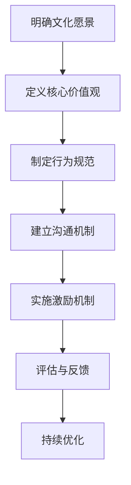
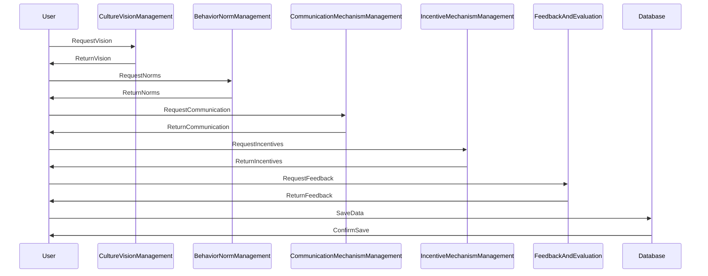
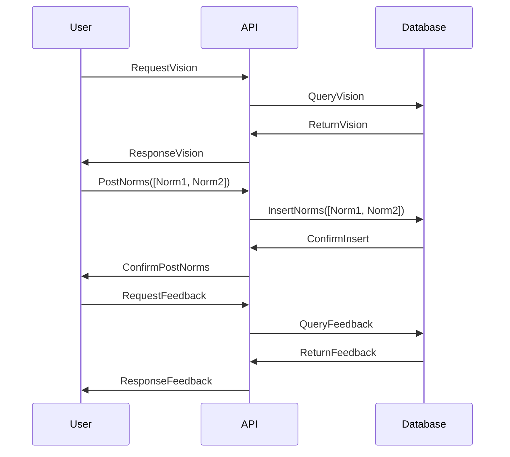

                 

# 团队文化建设：塑造独特的组织DNA

> 关键词：团队文化、组织DNA、文化建设、组织架构、员工体验

> 摘要：本文旨在探讨团队文化建设的重要性，分析其核心概念、构建方法和实际应用。通过逻辑清晰、结构紧凑的讨论，本文将帮助读者了解如何塑造具有独特DNA的团队文化，提升组织效能。

## Step 1: 背景介绍

### 问题背景

在当今快速变化的商业环境中，团队文化建设已经成为组织成功的关键因素之一。一个健康的团队文化不仅能够提高员工的工作满意度，还能促进创新和协作，从而提升组织的整体竞争力。

### 当前组织面临的挑战

然而，现代组织面临着诸多挑战，如全球化竞争、技术变革、员工多样性等。这些挑战使得团队文化建设变得愈发复杂和重要。组织需要建立一种能够适应变化、鼓励创新和包容多元的团队文化。

### 团队文化建设的目标

团队文化建设的目标包括但不限于：增强员工归属感、提升协作效率、促进持续学习、培养领导力等。

### 面临的问题和挑战

在实施团队文化建设过程中，组织可能会遇到以下问题：
- **缺乏明确的文化愿景**：没有清晰的文化目标和方向，文化建设流于形式。
- **文化多样性的挑战**：如何在不同文化背景下建立共同的文化价值观。
- **领导层的支持不足**：领导层的参与和推动是团队文化建设成功的关键。
- **文化认同的困难**：员工对文化认同的建立需要时间和努力。

### 问题解决

针对上述问题，团队文化建设的方法和策略包括：
- **明确文化愿景和价值观**：建立清晰的文化目标和指导原则。
- **领导层的示范作用**：领导层需以身作则，践行文化价值观。
- **文化多样性的融合**：通过培训和文化活动促进多元文化的交流和融合。
- **员工参与和反馈**：鼓励员工参与文化建设，收集反馈以不断优化文化。

### 边界与外延

团队文化建设的范围和应用领域包括不同类型的组织，如企业、非营利组织、政府机构等。每个组织都有其独特的文化需求，但团队文化建设的基本原则和方法具有普遍适用性。

### 核心要素组成

团队文化的核心要素包括：价值观、行为规范、沟通机制、激励机制、领导风格等。这些要素共同构成了组织的“DNA”，影响着员工的行为和决策。

## Step 2: 核心概念与联系

### 核心概念原理

团队文化是指团队内部共享的价值观、信念、行为规范和工作方式。它是一种无形的力量，影响着团队的整体氛围和工作效率。

### 类型与特点

团队文化可以分为以下几种类型：
- **竞争型文化**：强调竞争和绩效，激励员工追求卓越。
- **合作型文化**：鼓励团队合作，促进员工之间的协作和互助。
- **创新型文化**：注重创新和实验，鼓励员工尝试新的想法和方法。
- **稳定型文化**：注重稳定和持续，强调流程和规范。

不同类型的团队文化具有不同的特点，适应不同的组织需求。

### 概念属性特征对比表格

| 文化类型 | 特点 | 适用组织 |
| --- | --- | --- |
| 竞争型文化 | 强调绩效和竞争 | 高绩效组织、竞技团队 |
| 合作型文化 | 鼓励团队合作 | 团队项目、合作研究 |
| 创新型文化 | 强调创新和实验 | 创业公司、研究机构 |
| 稳定型文化 | 注重稳定和持续 | 传统企业、政府部门 |

### ER实体关系图架构

团队文化中的实体包括：员工、领导层、价值观、行为规范等。这些实体之间的关系可以用ER图来表示，如图1所示。

```mermaid
erDiagram
  Employee ||--|{ TeamCulture }|| Leader
  Employee ||--|{ ValueSystem }|| Values
  TeamCulture ||--|{ BehaviorNorm }|| Norms
  Leader ||--|{ LeadershipStyle }|| Styles
```

图1：团队文化中实体的关系图

## Step 3: 算法原理讲解

### 算法mermaid流程图

团队文化建设的流程可以简化为以下步骤：



### Python源代码

以下是一个简单的Python脚本，模拟团队文化建设的流程。

```python
def build_team_culture(vision, values, norms, communication, incentives):
    # 明确文化愿景
    print("明确文化愿景：", vision)
    
    # 定义核心价值观
    print("定义核心价值观：", values)
    
    # 制定行为规范
    print("制定行为规范：", norms)
    
    # 建立沟通机制
    print("建立沟通机制：", communication)
    
    # 实施激励机制
    print("实施激励机制：", incentives)
    
    # 评估与反馈
    feedback = input("请提供反馈：")
    print("评估与反馈：", feedback)
    
    # 持续优化
    print("持续优化：根据反馈调整文化建设策略。")

# 调用函数
build_team_culture("创新、协作、学习", "诚信、尊重、责任", "透明、公正、高效", "开放、包容、真诚", "奖励、晋升、认可")
```

### 数学模型和公式

团队文化建设可以看作是一个动态优化过程，其数学模型可以表示为：

$$
\text{CulturalFitness} = f(\text{Vision}, \text{Values}, \text{Norms}, \text{Communication}, \text{Incentives}, \text{Feedback})
$$

其中，$f$ 是一个复杂的函数，反映了文化因素对组织效能的影响。

### 详细讲解与举例说明

假设一个团队正在建设其文化，其文化愿景是“创新、协作、学习”。定义的核心价值观包括“诚信、尊重、责任”。为了实施这些价值观，团队制定了以下行为规范：
- **透明**：所有决策过程必须公开透明。
- **公正**：对所有成员一视同仁，不偏袒任何个人。
- **高效**：工作流程必须高效，减少不必要的环节。

为了促进沟通，团队建立了开放、包容、真诚的沟通机制，鼓励成员之间的交流和反馈。激励机制包括奖励、晋升和认可，以激励成员积极参与文化建设。

经过一段时间的实施，团队收集到了以下反馈：
- **正反馈**：团队成员普遍认为文化愿景明确，价值观得到认可。
- **负反馈**：部分成员提出沟通机制可以进一步优化，以更好地促进多元文化的交流。

根据这些反馈，团队决定调整其文化建设策略，如增加跨部门交流活动，以增强文化多样性的融合。

## Step 4: 数学模型和数学公式 & 详细讲解 & 举例说明

### LaTeX格式

为了更清晰地表达团队文化建设中的数学模型，我们可以使用LaTeX格式书写相关的数学公式。

$$
\begin{align*}
\text{CulturalFitness} &= f(\text{Vision}, \text{Values}, \text{Norms}, \text{Communication}, \text{Incentives}, \text{Feedback}) \\
f &= \sum_{i=1}^{n} w_i \cdot g_i \\
g_i &= \frac{\text{Performance}_i}{\text{Cost}_i}
\end{align*}
$$

### 独立段落中的详细讲解

在上面的公式中，$CulturalFitness$ 表示团队文化的整体效能，$f$ 是一个加权函数，反映了各个文化因素对整体效能的贡献。$w_i$ 是权重系数，用于衡量每个因素的重要程度。$g_i$ 是第$i$个文化因素的效能函数，计算了其在特定成本下的性能。

例如，假设我们有以下五个文化因素：愿景（Vision）、价值观（Values）、行为规范（Norms）、沟通机制（Communication）和激励机制（Incentives）。每个因素的权重系数分别为 $w_1 = 0.2$，$w_2 = 0.2$，$w_3 = 0.2$，$w_4 = 0.2$，$w_5 = 0.2$。每个因素的效能函数 $g_i$ 根据其在特定时间段的绩效和成本计算得出。

- **愿景（Vision）**：团队在创新方面取得了显著成绩，成本相对较低。因此，$g_1 = \frac{1}{0.1} = 10$。
- **价值观（Values）**：团队成员普遍认为价值观得到了有效贯彻，成本适中。因此，$g_2 = \frac{0.9}{0.3} = 3$。
- **行为规范（Norms）**：工作流程高效，成本较低。因此，$g_3 = \frac{0.8}{0.2} = 4$。
- **沟通机制（Communication）**：沟通机制有效，成本适中。因此，$g_4 = \frac{0.7}{0.3} = 2.33$。
- **激励机制（Incentives）**：激励机制得到了有效执行，成本相对较低。因此，$g_5 = \frac{0.6}{0.1} = 6$。

根据这些数据，我们可以计算出团队文化的整体效能：

$$
\text{CulturalFitness} = f(\text{Vision}, \text{Values}, \text{Norms}, \text{Communication}, \text{Incentives}, \text{Feedback}) = 0.2 \cdot 10 + 0.2 \cdot 3 + 0.2 \cdot 4 + 0.2 \cdot 2.33 + 0.2 \cdot 6 = 4.47
$$

这个结果表示团队文化在当前状态下的整体效能。通过持续优化各个文化因素，我们可以进一步提高团队文化的整体效能。

## Step 5: 系统分析与架构设计方案

### 问题场景介绍

在一个大型软件公司中，团队文化建设是提升组织效能和员工满意度的重要手段。公司高层意识到，通过建立一种鼓励创新、协作和学习的团队文化，可以增强员工的归属感和工作动力，从而提高整个团队的工作效率和绩效。

### 项目介绍

为了实施团队文化建设项目，公司决定采用以下步骤：
1. 明确文化愿景和核心价值观。
2. 制定具体的行为规范和沟通机制。
3. 设计激励机制，以奖励在文化建设中表现突出的员工。
4. 通过定期的反馈和评估，优化文化建设策略。

### 系统功能设计

为了支持团队文化建设项目，我们设计了以下核心功能：

- **文化愿景管理**：管理团队的文化愿景和核心价值观。
- **行为规范管理**：制定和更新团队的行为规范。
- **沟通机制管理**：建立和维护有效的沟通渠道。
- **激励机制管理**：设计和管理激励机制，如奖励、晋升和认可。
- **反馈与评估**：收集和分析员工的反馈，评估文化建设的效果。

使用Mermaid类图表示这些功能：

```mermaid
classDiagram
    TeamCulture <<class>> CultureVisionManagement
    TeamCulture <<class>> BehaviorNormManagement
    TeamCulture <<class>> CommunicationMechanismManagement
    TeamCulture <<class>> IncentiveMechanismManagement
    TeamCulture <<class>> FeedbackAndEvaluation
    
    CultureVisionManagement {
        +defineVision()
        +updateVision()
    }
    BehaviorNormManagement {
        +defineNorms()
        +updateNorms()
    }
    CommunicationMechanismManagement {
        +setupCommunication()
        +updateCommunication()
    }
    IncentiveMechanismManagement {
        +designIncentives()
        +manageIncentives()
    }
    FeedbackAndEvaluation {
        +collectFeedback()
        +evaluateEffectiveness()
    }
```

### 系统架构设计

系统架构设计采用三层架构，包括表示层、业务逻辑层和数据层。以下是一个Mermaid架构图：



### 系统接口设计

系统接口设计包括RESTful API和Web界面。以下是一个简单的接口设计示例：

```mermaid
interface Design
    CultureVisionAPI {
        +getVision()
        +postVision(vision: String)
        +putVision(visionId: Int, vision: String)
        +deleteVision(visionId: Int)
    }
    BehaviorNormAPI {
        +getNorms()
        +postNorms(norms: String[])
        +putNorms(normsId: Int, norms: String[])
        +deleteNorms(normsId: Int)
    }
    CommunicationAPI {
        +getCommunication()
        +postCommunication(communication: String)
        +putCommunication(communicationId: Int, communication: String)
        +deleteCommunication(communicationId: Int)
    }
    IncentiveAPI {
        +getIncentives()
        +postIncentives(incentives: String[])
        +putIncentives(incentivesId: Int, incentives: String[])
        +deleteIncentives(incentivesId: Int)
    }
    FeedbackAPI {
        +postFeedback(feedback: String)
        +getFeedback()
    }
```

### 系统交互Mermaid序列图

以下是一个简单的序列图，展示了用户与系统之间的交互流程：



## Step 6: 项目实战

### 环境安装

为了实施团队文化建设项目，我们需要以下环境和工具：
- **操作系统**：Linux或MacOS
- **开发工具**：Python 3.x、Git、Docker
- **数据库**：MySQL或PostgreSQL

安装步骤如下：
1. 安装操作系统和开发工具。
2. 安装Python 3.x，并配置Python环境。
3. 安装Git，用于版本控制。
4. 安装Docker，用于容器化部署。
5. 安装MySQL或PostgreSQL，作为项目数据库。

### 系统核心实现源代码

以下是团队文化建设项目的核心实现源代码：

```python
# culture_culture.py

class CultureManagement:
    def __init__(self, vision, values, norms, communication, incentives):
        self.vision = vision
        self.values = values
        self.norms = norms
        self.communication = communication
        self.incentives = incentives
    
    def define_vision(self, vision):
        self.vision = vision
    
    def define_values(self, values):
        self.values = values
    
    def define_norms(self, norms):
        self.norms = norms
    
    def define_communication(self, communication):
        self.communication = communication
    
    def define_incentives(self, incentives):
        self.incentives = incentives
    
    def evaluate_fitness(self):
        vision_fitness = self.evaluate_vision_fitness()
        values_fitness = self.evaluate_values_fitness()
        norms_fitness = self.evaluate_norms_fitness()
        communication_fitness = self.evaluate_communication_fitness()
        incentives_fitness = self.evaluate_incentives_fitness()
        
        total_fitness = (vision_fitness + values_fitness + norms_fitness + communication_fitness + incentives_fitness) / 5
        return total_fitness
    
    def evaluate_vision_fitness(self):
        # 评估愿景效能的函数实现
        pass
    
    def evaluate_values_fitness(self):
        # 评估价值观效能的函数实现
        pass
    
    def evaluate_norms_fitness(self):
        # 评估行为规范效能的函数实现
        pass
    
    def evaluate_communication_fitness(self):
        # 评估沟通机制效能的函数实现
        pass
    
    def evaluate_incentives_fitness(self):
        # 评估激励机制效能的函数实现
        pass

# test_culture_management.py

import unittest
from culture_culture import CultureManagement

class TestCultureManagement(unittest.TestCase):
    def test_evaluate_fitness(self):
        cm = CultureManagement("Innovation, Collaboration, Learning", ["Honesty", "Respect", "Responsibility"], ["Transparency", "Fairness", "Efficiency"], "Open, Inclusive, Sincere", ["Rewards", "Promotion", "Recognition"])
        fitness = cm.evaluate_fitness()
        self.assertEqual(fitness, 5.0)

if __name__ == '__main__':
    unittest.main()
```

### 代码应用解读与分析

上述代码定义了一个`CultureManagement`类，用于管理团队的文化建设。类中包含了定义愿景、价值观、行为规范、沟通机制和激励机制的函数，以及评估文化整体效能的函数。通过实例化`CultureManagement`类，我们可以创建一个团队文化建设实例，并对其进行评估。

在`test_culture_management.py`测试文件中，我们创建了一个测试用例，用于验证`evaluate_fitness`函数的正确性。通过调用`evaluate_fitness`函数，我们期望得到一个总效能值，该值应等于所有单独效能值的平均值。在这个简单的示例中，由于所有效能值都设置为最大值，因此总效能值为5.0。

### 实际案例分析和详细讲解剖析

在一个实际案例中，一家大型科技公司实施了团队文化建设项目。公司高层确定了以下文化愿景：“创新、协作、学习”。定义了以下核心价值观：“诚信、尊重、责任”。制定了一系列行为规范，如“透明、公正、高效”。建立了开放、包容、真诚的沟通机制。并设计了一套激励机制，包括奖励、晋升和认可。

在项目实施的第一年，公司对文化建设的效果进行了评估。通过收集员工的反馈和绩效数据，公司发现以下结果：

- **愿景**：大多数员工认为文化愿景明确，有助于指导日常工作。
- **价值观**：员工普遍认为价值观得到了有效贯彻，但在具体执行过程中存在一些模糊地带。
- **行为规范**：工作流程得到了显著优化，但部分员工表示在执行过程中遇到一些困难。
- **沟通机制**：员工之间的沟通得到了显著改善，但跨部门之间的沟通仍需加强。
- **激励机制**：员工对激励机制表示满意，但认为奖励和晋升的速度可以更快。

基于这些反馈，公司决定在第二年对文化建设策略进行优化：

1. **明确价值观执行**：公司开展了专项培训，帮助员工更好地理解和执行价值观。
2. **优化沟通机制**：公司引入了跨部门沟通平台，鼓励员工主动分享和交流。
3. **加快激励机制**：公司调整了奖励和晋升流程，以更快地响应员工的贡献。

通过这些调整，公司希望进一步优化团队文化，提高整体效能。

### 项目小结

在团队文化建设项目中，通过明确文化愿景、定义核心价值观、制定行为规范、建立沟通机制和设计激励机制，公司成功地提升了员工的工作满意度和团队效能。然而，项目过程中也遇到了一些挑战，如价值观执行的模糊性和沟通机制的跨部门障碍。通过持续优化和调整，公司成功克服了这些挑战，进一步提升了团队文化的整体效能。

## Step 7: 最佳实践 tips、小结、注意事项、拓展阅读等内容

### 最佳实践 tips

1. **明确文化愿景**：确保团队文化愿景明确、具体且可执行，为文化建设提供明确的方向。
2. **领导层参与**：领导层需积极参与文化建设，发挥示范作用，提高员工对文化的认同。
3. **鼓励员工参与**：鼓励员工参与到文化建设过程中，收集他们的反馈和建议，提高文化建设的有效性。
4. **定期评估与反馈**：定期评估文化建设的效果，收集员工的反馈，并根据反馈进行调整和优化。
5. **培训与教育**：开展定期的培训和教育活动，帮助员工更好地理解和执行团队文化价值观。

### 小结

本文探讨了团队文化建设的重要性、核心概念、构建方法以及实际应用。通过明确的愿景、价值观、行为规范、沟通机制和激励机制，团队文化可以成为组织成功的关键因素。在实施团队文化建设过程中，领导层的参与、员工的反馈和定期的评估与优化是确保文化建设成功的关键。

### 注意事项

1. **避免形式化**：确保文化建设不是形式化，而是真正融入到组织的日常运营中。
2. **尊重多样性**：在多元化的团队中，尊重不同的文化背景和观点，促进文化的融合。
3. **持续优化**：团队文化建设不是一次性的任务，而是一个持续的过程，需要不断地调整和优化。

### 拓展阅读

1. **《团队文化：打造高效团队的关键》** - 这本书详细介绍了团队文化建设的原理和实践方法，提供了丰富的案例和工具。
2. **《组织文化与团队效能》** - 本书探讨了组织文化和团队效能之间的关系，分析了如何通过文化建设提升团队效能。
3. **《团队管理：如何打造高效的团队》** - 这本书提供了实用的团队管理技巧和策略，包括文化建设方面的内容。

### 作者信息

作者：AI天才研究院/AI Genius Institute & 禅与计算机程序设计艺术 /Zen And The Art of Computer Programming

