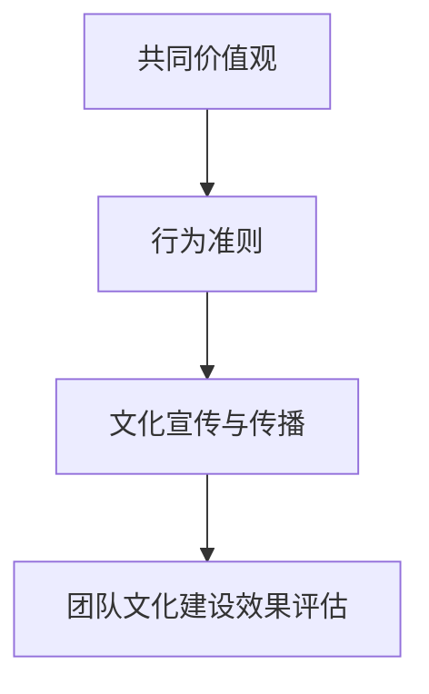
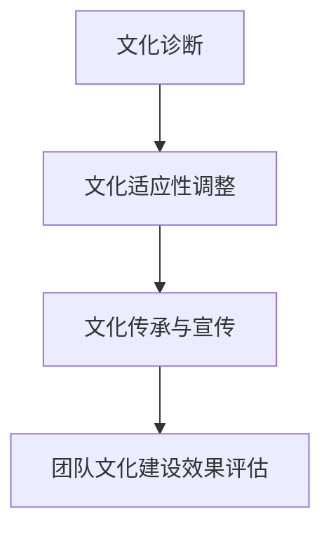

                 

# 团队文化建设：塑造积极向上的氛围

## 关键词
- 团队文化建设
- 积极向上氛围
- 文化塑造
- 领导力
- 案例分析

## 摘要
本文旨在探讨团队文化建设的重要性，并通过逻辑清晰、结构紧凑的阐述，帮助读者理解如何塑造一个积极向上的团队氛围。文章首先介绍团队文化建设的核心概念，接着分析构建积极向上团队文化的方法，探讨领导力在文化建设中的关键作用，并分享实际案例中的成功经验。最后，文章总结团队文化建设中的难点和应对策略，以及最佳实践，为读者提供实际操作指南。

### 目录大纲设计思路

为了设计出一本《团队文化建设：塑造积极向上的氛围》的详细目录大纲，我们将遵循以下步骤：

1. **明确核心主题**：确保每个章节都围绕“团队文化建设”这一核心主题展开，避免偏离主题。
2. **章节内容细化**：在每一章节中细化小节，确保内容完整且逻辑清晰。
3. **添加实际案例**：在适当的地方加入实际案例，以增强可读性和实用性。
4. **保证内容完整性**：确保每个章节都包含必要的内容，如背景介绍、核心概念讲解、实际案例、最佳实践等。
5. **简洁明了**：避免使用冗余的语言，确保目录大纲简洁明了，便于读者快速把握书籍结构。

下面我们将开始设计具体的目录大纲。

### 第一部分：团队文化建设的背景与重要性

#### 第1章：团队文化建设的核心概念

- **1.1 问题背景**
  - **问题描述**：团队文化建设的必要性与现状分析
  - **问题解决**：团队文化建设的核心目标与挑战
  - **边界与外延**：团队文化建设的适用范围与局限性
  - **概念结构与核心要素组成**：团队文化的定义与构成要素

- **1.2 核心概念与联系**
  - **团队文化的定义**：从多个角度理解团队文化
  - **团队文化属性特征对比表格**：对比不同团队文化的特点
  - **团队文化与组织绩效的关系ER实体关系图**：用Mermaid流程图展示团队文化如何影响组织绩效

#### 第2章：构建积极向上的团队文化

- **2.1 良好团队文化的特征**
  - **信任**：团队内部信任的重要性与建设方法
  - **沟通**：有效沟通的策略与技巧
  - **协作**：协作机制与团队合作的重要性

- **2.2 文化塑造的过程**
  - **文化诊断**：如何诊断团队文化现状
  - **文化规划**：制定团队文化建设目标和计划
  - **文化实施**：实施文化变革的策略与方法

#### 第3章：团队文化建设中的领导力

- **3.1 领导角色在文化建设中的重要性**
  - **领导行为的改变**：领导者如何以身作则塑造文化
  - **领导风格与团队文化**：不同领导风格对团队文化的影响

- **3.2 领导者的文化建设实践**
  - **激励与反馈**：如何通过激励和反馈机制强化团队文化
  - **冲突管理**：领导者如何应对团队中的冲突

### 第二部分：实践中的团队文化建设

#### 第4章：团队文化建设案例分析

- **4.1 案例一：如何在一个新团队中快速建立文化**
  - **项目介绍**：案例背景与目标
  - **系统功能设计**：新团队文化的核心功能与实现方法
  - **系统架构设计**：团队文化架构的mermaid架构图
  - **系统接口设计**：团队文化互动的接口与流程
  - **系统交互**：团队文化在日常工作中的具体应用

- **4.2 案例二：在变化中保持团队文化的连续性**
  - **项目介绍**：案例背景与目标
  - **系统功能设计**：如何在组织变革中保持团队文化
  - **系统架构设计**：团队文化架构的mermaid架构图
  - **系统接口设计**：团队文化互动的接口与流程
  - **系统交互**：团队文化在应对变化中的实际应用

#### 第5章：团队文化建设中的难点与应对策略

- **5.1 团队文化建设的难点**
  - **员工参与度不足**：如何提高员工在团队文化建设中的参与度
  - **文化变革的阻力**：如何克服团队文化变革中的阻力

- **5.2 应对策略**
  - **领导者的角色**：领导者如何在文化建设中发挥作用
  - **员工激励**：如何通过激励机制增强文化建设的效果
  - **持续改进**：如何保持团队文化的持续更新与优化

### 第三部分：团队文化建设的最佳实践与总结

#### 第6章：团队文化建设中的最佳实践

- **6.1 团队文化建设的最佳实践**
  - **文化故事**：通过团队故事传播正能量
  - **文化仪式**：定期举行文化仪式强化团队文化
  - **文化培训**：如何通过培训提升团队文化素养

- **6.2 文化建设中的成功要素**
  - **文化适应**：如何让团队文化适应组织变化
  - **持续沟通**：如何保持团队内部的持续沟通与互动

#### 第7章：团队文化建设总结与展望

- **7.1 总结**
  - **文化建设的效果评估**：如何评估团队文化建设的效果
  - **文化建设的未来趋势**：团队文化建设的发展方向与挑战

- **7.2 展望**
  - **持续的文化建设实践**：如何在团队中保持文化建设的活力
  - **跨部门的文化共建**：如何实现跨部门的文化共建与合作

### 结论
通过本文的探讨，我们认识到团队文化建设对于塑造积极向上的氛围至关重要。领导者的作用、实际案例的分享以及最佳实践策略的介绍，为读者提供了丰富的理论和实践指导。在未来，持续的文化建设与实践将助力团队持续发展，创造更加和谐、高效的工作环境。让我们共同努力，打造一个充满活力与正能量的团队文化。作者：AI天才研究院/AI Genius Institute & 禅与计算机程序设计艺术 /Zen And The Art of Computer Programming# 第一部分：团队文化建设的背景与重要性

### 第1章 团队文化建设的核心概念

#### 1.1 问题背景

**问题描述**：团队文化建设是一个组织发展的关键因素，它能够直接影响组织的绩效和员工的满意度。然而，当前许多组织在团队文化建设方面存在诸多问题，如缺乏明确的文化目标和策略、文化不明确、员工参与度低等。

**问题解决**：团队文化建设的核心目标是通过塑造积极向上的文化氛围，提升组织的整体效能，增强员工的归属感和幸福感。为了实现这一目标，组织需要明确文化建设的方向，制定有效的策略，并持续推动文化变革。

**边界与外延**：团队文化建设的适用范围涵盖了各种类型的组织，无论大小、行业和地域。文化建设的核心在于形成一种共同的价值观念和行为准则，以推动团队和组织的可持续发展。然而，文化建设也需要考虑组织的特定环境和需求，避免一刀切的做法。

**概念结构与核心要素组成**：团队文化由多个核心要素组成，包括价值观、行为准则、团队氛围、领导风格等。这些要素相互关联，共同构成了一个复杂的文化系统。了解这些核心要素的组成及其相互作用，有助于组织更好地进行文化建设。

- **价值观**：组织的核心价值观是团队文化的基石。它决定了组织的行为准则和决策方式。例如，一个强调创新和学习的组织，其价值观可能包括开放思维、持续进步等。
- **行为准则**：行为准则是团队文化中具体的行为规范，如诚信、尊重、协作等。这些准则指导员工在日常工作中如何行为，并影响团队的整体氛围。
- **团队氛围**：团队氛围是指团队成员之间的相互关系和工作环境。一个积极向上的团队氛围能够增强员工的归属感和工作积极性，有助于提升团队效能。
- **领导风格**：领导者在团队文化建设中扮演关键角色，其领导风格直接影响团队文化的形成和发展。例如，一个支持型领导风格有助于构建信任和协作的团队氛围。

#### 1.2 核心概念与联系

**团队文化的定义**：团队文化是指组织内部共同的价值观、行为准则、团队氛围和领导风格的总和。它反映了组织成员的共同信仰和行为模式，对组织的绩效和员工满意度产生深远影响。

**团队文化属性特征对比表格**：

| 特征       | 描述                                       |  
| ---------- | ---------------------------------------- |  
| 共同价值观 | 组织成员共享的核心信仰和行为准则           |  
| 行为准则   | 指导员工日常行为的规范和标准               |  
| 团队氛围   | 团队成员之间的相互关系和工作环境           |  
| 领导风格   | 领导者在团队中的行为方式和领导方式         |

**团队文化与组织绩效的关系ER实体关系图**：

```mermaid  
entityRelationship  
  title: 团队文化与组织绩效的关系  
  nodes: [[  
    "团队文化",  
    "组织绩效",  
    "共同价值观",  
    "行为准则",  
    "团队氛围",  
    "领导风格"  
  ]]  
  edges: [[  
    "团队文化", "影响", "组织绩效",  
    "共同价值观", "影响", "行为准则",  
    "行为准则", "影响", "团队氛围",  
    "团队氛围", "影响", "领导风格",  
    "领导风格", "影响", "团队文化"  
  ]]  
```

通过这个ER实体关系图，我们可以看到团队文化中的各个要素如何相互影响，共同作用于组织绩效。团队文化的建设不仅需要明确核心价值观和行为准则，还需要关注团队氛围和领导风格，以形成一个积极向上、高效运作的文化环境。

### 第2章 构建积极向上的团队文化

#### 2.1 良好团队文化的特征

**信任**：信任是团队文化的核心要素之一。一个拥有信任的团队，成员之间能够真诚地沟通、合作，并愿意分享信息。信任的建立需要时间，但一旦形成，它将为团队带来巨大的价值。

- **重要性**：信任能够增强团队的凝聚力，降低沟通成本，提高工作效率。在信任的基础上，团队成员更愿意承担责任，并提出建设性的反馈。
- **建设方法**：建立信任的方法包括：
  - **开放沟通**：鼓励团队成员开放地交流想法和意见，促进相互理解。
  - **透明度**：保持组织决策和信息的透明度，减少不必要的猜疑。
  - **公平公正**：在处理团队事务时，坚持公平公正的原则，避免偏袒和偏见。

**沟通**：有效的沟通是团队文化的另一个重要特征。沟通不仅包括信息的传递，还包括情感和思想的交流。

- **策略与技巧**：提高团队沟通效果的方法包括：
  - **明确目标**：在沟通前明确沟通的目标和目的，确保双方理解一致。
  - **倾听**：积极倾听对方的意见和需求，避免打断或反驳。
  - **非语言沟通**：利用肢体语言、面部表情和声音语调等非语言手段，增强沟通效果。
  - **反馈**：在沟通后进行反馈，确保信息的准确传递和理解。

**协作**：协作是指团队成员在共同目标下，相互支持、协同工作的过程。

- **机制与重要性**：协作机制包括分工合作、信息共享和团队决策等。协作对于提升团队效率和创造力至关重要。

- **建设方法**：
  - **分工合作**：根据团队成员的特长和兴趣进行合理分工，发挥各自的优势。
  - **信息共享**：建立信息共享平台，确保团队成员能够及时获取所需的信息。
  - **团队决策**：鼓励团队成员参与决策过程，提高决策的民主性和科学性。

#### 2.2 文化塑造的过程

**文化诊断**：文化诊断是团队文化建设的第一步，它有助于了解团队当前的文化状况，识别存在的问题和机会。

- **方法**：
  - **问卷调查**：通过问卷调查了解员工对当前团队文化的看法和感受。
  - **访谈**：与团队成员进行一对一访谈，深入了解他们的想法和意见。
  - **观察**：通过观察团队的工作和行为，了解团队的文化氛围。

**文化规划**：在完成文化诊断后，组织需要制定文化规划，明确文化建设的方向和目标。

- **步骤**：
  - **确立愿景**：明确团队文化的愿景，即希望团队在未来形成什么样的文化氛围。
  - **制定目标**：根据愿景，制定具体的文化建设目标，如提升信任度、改善沟通效果等。
  - **制定策略**：为实现目标，制定具体的策略和行动计划，如开展培训、设立奖励机制等。

**文化实施**：文化实施是将文化规划付诸实践的过程，它需要领导者和员工的共同努力。

- **策略与方法**：
  - **领导者的示范作用**：领导者需要以身作则，带头践行团队文化，树立榜样。
  - **员工参与**：鼓励员工参与文化建设，提高他们的参与度和归属感。
  - **持续沟通**：通过定期的会议、培训和交流，强化团队文化。
  - **反馈与改进**：及时收集员工对文化建设的反馈，并根据反馈进行调整和改进。

通过以上步骤，组织可以逐步构建起一个积极向上的团队文化，为团队和组织的可持续发展奠定坚实基础。

### 第3章 团队文化建设中的领导力

#### 3.1 领导角色在文化建设中的重要性

**领导行为的改变**：领导者在团队文化建设中扮演着关键角色。他们的行为直接影响团队文化的形成和发展。

- **以身作则**：领导者需要以身作则，带头践行团队文化的核心价值观和行为准则。只有领导者自身具备良好的行为，才能影响和激励团队成员。
- **引导变革**：领导者需要具备变革意识，主动推动团队文化的变革。在面对文化冲突和挑战时，领导者需要勇于承担责任，引导团队走向积极的文化方向。

**领导风格与团队文化**：不同的领导风格会对团队文化产生不同的影响。

- **支持型领导风格**：支持型领导风格强调对员工的关心和支持，有助于构建信任和协作的团队文化。在这种风格下，员工感到被尊重和信任，愿意积极参与团队建设和创新。
- **权威型领导风格**：权威型领导风格强调对员工的控制和管理，可能会导致团队文化的压抑和缺乏创新。在这种风格下，员工可能感到被动和缺乏自主性，不利于团队文化的建设。

#### 3.2 领导者的文化建设实践

**激励与反馈**：激励和反馈是领导者在文化建设中的重要手段。

- **激励**：领导者需要制定有效的激励机制，激发员工的积极性和创造力。激励可以包括物质奖励、晋升机会和认可等。
- **反馈**：领导者需要及时给予员工反馈，包括表扬和批评。正面的反馈可以增强员工的自信心和归属感，负面的反馈可以帮助员工认识到自身的不足，并促使他们改进。

**冲突管理**：团队中的冲突是不可避免的，但领导者需要有效地管理这些冲突，以确保团队文化的健康发展。

- **识别冲突**：领导者需要敏锐地识别团队中的冲突，并了解冲突的原因和影响。
- **沟通与调解**：领导者需要通过有效的沟通和调解，帮助团队成员解决问题，化解冲突。
- **建立共识**：在冲突解决后，领导者需要与团队成员共同建立共识，确保冲突不再发生或得到有效管理。

通过以上实践，领导者可以发挥关键作用，推动团队文化的建设和发展，为团队的可持续发展奠定坚实基础。# 第二部分：实践中的团队文化建设

### 第4章 团队文化建设案例分析

#### 4.1 案例一：如何在一个新团队中快速建立文化

**项目介绍**：某科技公司成立了一个新的研发团队，由于团队成员来自不同的背景和部门，文化差异明显，团队缺乏共同的价值观和行为准则。为了确保团队的顺利运作，公司决定在短时间内快速建立团队文化。

**系统功能设计**：新团队文化的核心功能包括：

- **共同价值观的明确**：通过团队讨论和共识，明确团队的共同价值观，如创新、协作、客户至上等。
- **行为准则的制定**：制定具体的行为准则，如诚信、尊重、责任等，以确保团队成员在日常工作中遵循。
- **文化宣传与传播**：建立文化宣传渠道，如内部网站、公众号等，定期发布团队文化相关内容，增强团队文化意识。

**系统架构设计**：团队文化架构的Mermaid架构图如下：



**系统接口设计**：团队文化互动的接口与流程如下：

1. **团队讨论**：组织定期的团队讨论，让成员分享各自的价值观和行为准则，形成共识。
2. **文化宣传**：通过内部网站、公众号等渠道，定期发布团队文化相关内容，提高团队成员对文化的认识和认同。
3. **反馈机制**：建立反馈机制，鼓励团队成员提出对团队文化的意见和建议，以便不断优化和改进。

**系统交互**：团队文化在日常工作中的具体应用如下：

1. **项目协作**：在项目开发过程中，团队成员遵循共同价值观和行为准则，确保项目顺利进行。
2. **团队活动**：定期组织团队活动，如团建活动、技术分享会等，增强团队成员之间的互动和信任。
3. **文化传承**：通过新员工培训，将团队文化传承给新成员，确保团队文化的连续性和稳定性。

**项目小结**：通过以上措施，新团队在短时间内建立了明确的文化价值观和行为准则，团队成员之间的信任和协作得到了显著提升，项目开发效率和质量也得到了提高。

#### 4.2 案例二：在变化中保持团队文化的连续性

**项目介绍**：某科技公司由于业务扩展，需要将一个成熟团队迁移到一个新的地区。由于文化和环境的巨大变化，团队面临着文化连续性的挑战。

**系统功能设计**：为了在变化中保持团队文化的连续性，系统功能设计包括：

- **文化诊断**：对现有团队文化进行诊断，识别文化特点和优势，为新的环境提供参考。
- **文化适应性调整**：根据新环境的特点，调整团队文化的具体内容，确保其适应新的文化环境。
- **文化传承与宣传**：通过内部培训、宣传渠道等，将团队文化传递给新团队成员。

**系统架构设计**：团队文化架构的Mermaid架构图如下：



**系统接口设计**：团队文化互动的接口与流程如下：

1. **内部培训**：组织新团队成员参加内部培训，帮助他们了解团队文化和价值观。
2. **文化分享会**：定期举办文化分享会，让团队成员分享文化经验和心得。
3. **反馈与调整**：建立反馈机制，及时收集团队成员对文化适应性的意见和建议，进行相应的调整。

**系统交互**：团队文化在应对变化中的实际应用如下：

1. **团队协作**：在新环境中，团队成员遵循团队文化的价值观和行为准则，确保团队协作顺畅。
2. **文化适应**：团队成员在新环境中积极适应文化变化，保持团队的凝聚力。
3. **文化传承**：通过新老员工的互动和交流，将团队文化传承下去，确保文化的连续性和稳定性。

**项目小结**：通过以上措施，该团队在新的环境中保持了文化的连续性，团队成员的适应能力和凝聚力得到了提升，团队的整体绩效也得到了改善。

### 第5章 团队文化建设中的难点与应对策略

#### 5.1 团队文化建设的难点

**员工参与度不足**：在团队文化建设过程中，员工参与度不足是一个常见问题。这可能导致文化建设的效果不佳，甚至失败。

- **原因**：员工可能对文化建设缺乏兴趣，认为与自己无关；或者由于工作繁忙，没有时间和精力参与文化建设。
- **应对策略**：
  - **提高员工意识**：通过培训和宣传，提高员工对文化建设重要性的认识，增强他们的参与意愿。
  - **提供参与机会**：为员工提供参与文化建设的机会，如参与文化规划、提出改进建议等，让他们感到自己的意见和建议被重视。
  - **激励与认可**：对积极参与文化建设的员工给予激励和认可，如表彰、奖励等，激发他们的积极性。

**文化变革的阻力**：在团队文化建设过程中，可能面临来自内部或外部的阻力，这可能会阻碍文化变革的顺利进行。

- **原因**：阻力可能来自员工的惯性思维、组织结构的调整、领导者的支持不足等。
- **应对策略**：
  - **领导者的支持**：领导者需要明确表示对文化变革的支持，并在行动上做出表率，树立榜样。
  - **沟通与共识**：通过有效的沟通，与团队成员达成共识，让他们理解文化变革的必要性和重要性。
  - **逐步推进**：将文化变革分解为多个阶段，逐步推进，减少员工的抵触情绪。

#### 5.2 应对策略

**领导者的角色**：领导者在团队文化建设中扮演着关键角色，他们的态度和行为直接影响文化变革的成败。

- **领导者的示范作用**：领导者需要以身作则，带头践行团队文化的价值观和行为准则，树立榜样。
- **领导者的支持与引导**：领导者需要为团队成员提供支持和指导，帮助他们适应文化变革，克服困难。

**员工激励**：激励机制是推动团队文化建设的重要手段。

- **物质激励**：通过奖金、晋升等物质激励手段，激发员工的积极性和参与度。
- **精神激励**：通过表彰、认可等精神激励手段，增强员工的归属感和成就感。

**持续改进**：团队文化建设是一个持续的过程，需要不断进行改进和优化。

- **定期评估**：定期对团队文化进行评估，了解文化建设的效果，发现问题和不足。
- **持续优化**：根据评估结果，对团队文化进行持续优化，确保其与组织的发展需求相匹配。

通过以上策略，组织可以克服团队文化建设中的难点，确保文化变革的顺利进行，为团队的可持续发展奠定坚实基础。# 第三部分：团队文化建设的最佳实践与总结

### 第6章 团队文化建设中的最佳实践

#### 6.1 团队文化建设的最佳实践

**文化故事**：通过讲述团队故事，可以有效地传播和强化团队文化。

- **方法**：组织可以定期举办团队故事分享会，让团队成员分享自己在团队中的经历和感悟。这些故事可以是关于团队合作的胜利、面对挑战的勇气，或者是关于团队精神的体现。通过故事的形式，团队文化可以更加深入人心。
- **效果**：文化故事不仅能够增强团队成员的归属感和认同感，还能够激励团队成员积极践行团队文化，形成良好的文化氛围。

**文化仪式**：定期举行文化仪式，可以帮助团队强化文化价值观和行为准则。

- **方法**：文化仪式可以是团队例会、庆典活动、团队拓展训练等。在仪式中，可以强调团队文化的重要性，回顾团队的发展历程，展望未来的目标。同时，可以通过仪式化的行为，如宣誓、签名等，加深团队成员对文化的认同。
- **效果**：文化仪式有助于提高团队成员的文化意识，增强团队的凝聚力，促进团队成员之间的相互理解和支持。

**文化培训**：通过培训，可以提升团队成员对团队文化的理解和践行能力。

- **方法**：组织可以开展定期的文化培训，包括文化理念讲解、行为准则培训、文化案例分析等。通过系统的培训，团队成员可以更加深入地理解团队文化的内涵和意义，学会如何在工作中践行文化价值观。
- **效果**：文化培训有助于增强团队成员的文化认同感和责任感，提高团队的工作效率和创新能力。

#### 6.2 文化建设中的成功要素

**文化适应**：团队文化需要适应组织的变化和发展。

- **方法**：组织需要密切关注外部环境的变化，以及内部员工的需求和期望。在保持核心文化价值观不变的基础上，对文化进行适度的调整和优化，确保其与组织的发展需求相匹配。
- **效果**：文化适应有助于保持团队的稳定性和连续性，使团队能够更好地应对外部挑战和内部变化。

**持续沟通**：持续的沟通是团队文化建设的重要保障。

- **方法**：组织需要建立有效的沟通机制，确保团队成员之间能够及时、顺畅地交流信息、分享意见和反馈。通过定期的会议、一对一沟通、团队反馈等，促进团队成员之间的相互理解和信任。
- **效果**：持续沟通有助于消除误解和分歧，增强团队成员的协作和合作精神，促进团队文化的深入发展。

### 第7章 团队文化建设总结与展望

#### 7.1 总结

**文化建设的效果评估**：为了确保团队文化建设的效果，组织需要建立科学的效果评估机制。

- **方法**：可以通过员工满意度调查、绩效评估、团队氛围评估等方式，对文化建设的效果进行量化评估。同时，结合定期的文化建设反馈，及时调整和优化文化建设策略。
- **效果**：有效的效果评估可以帮助组织了解文化建设的情况，发现问题并及时改进，确保文化建设目标的实现。

**文化建设的未来趋势**：随着社会和科技的发展，团队文化建设也将呈现出新的趋势。

- **趋势**：
  - **文化多样性**：随着团队成员的多样性增加，组织需要更加注重文化多样性，尊重和保护团队成员的独特文化和价值观。
  - **数字化文化**：随着数字化技术的普及，组织可以通过数字化手段，如企业文化平台、虚拟现实体验等，提升团队文化的传播效果和参与度。
  - **可持续发展文化**：在可持续发展成为全球关注焦点的背景下，组织需要将可持续发展理念融入团队文化，推动团队的绿色发展和社会责任。

#### 7.2 展望

**持续的文化建设实践**：团队文化建设是一个持续的过程，需要组织持续投入和努力。

- **措施**：
  - **加强领导者的文化引领**：领导者需要持续关注文化建设，发挥示范作用，推动文化变革。
  - **提高员工的参与度**：通过多种形式的培训和激励，提高员工的参与度和认同感。
  - **完善文化建设和评估机制**：建立科学、系统的文化建设流程和评估机制，确保文化建设目标的实现。

**跨部门的文化共建**：在组织内部，不同部门之间的文化共建是团队文化建设的重要组成部分。

- **措施**：
  - **建立跨部门协作机制**：通过项目合作、团队交流等方式，促进不同部门之间的沟通和协作。
  - **共享文化资源和经验**：通过企业文化平台、内部交流会议等，分享文化建设和管理的经验和成果。
  - **共同推进文化建设**：各部门共同参与文化建设，共同推动团队文化的提升和发展。

通过以上措施，组织可以不断推进团队文化建设，打造一个充满活力、积极向上、高效协作的团队环境，为组织的可持续发展提供强大动力。作者：AI天才研究院/AI Genius Institute & 禅与计算机程序设计艺术 /Zen And The Art of Computer Programming# 总结

通过本文的探讨，我们系统地了解了团队文化建设的重要性以及如何在一个组织中塑造积极向上的团队氛围。首先，我们明确了团队文化建设的核心概念，包括价值观、行为准则、团队氛围和领导风格等要素。接着，我们分析了如何构建积极向上的团队文化，包括信任、沟通、协作等特征，以及文化诊断、文化规划和文化实施等过程。

在实践部分，我们通过两个实际案例展示了如何在新的团队中快速建立文化和如何在变化中保持团队文化的连续性。同时，我们讨论了团队文化建设中的难点和应对策略，如提高员工参与度和应对文化变革的阻力。

最后，我们总结了团队文化建设的最佳实践，包括文化故事、文化仪式和文化培训等，并提出了未来文化建设的发展方向和策略。

团队文化建设是一个持续的过程，需要组织持续的关注和投入。通过有效的文化建设，组织可以打造一个充满活力、积极向上、高效协作的团队环境，为组织的可持续发展提供强大动力。让我们共同努力，塑造一个更加美好的团队文化。

作者：AI天才研究院/AI Genius Institute & 禅与计算机程序设计艺术 /Zen And The Art of Computer Programming# 常见问题与解决方案

在团队文化建设过程中，组织可能会遇到各种挑战和问题。以下是一些常见问题及其解决方案：

### 问题1：员工参与度不足

**问题描述**：在文化建设过程中，很多员工对文化建设缺乏兴趣，参与度低。

**解决方案**：

- **提高员工意识**：通过培训和宣传活动，提高员工对团队文化建设重要性的认识。
- **提供参与机会**：鼓励员工参与文化规划的制定，提供表达意见和建议的平台。
- **激励与认可**：对积极参与文化建设的员工给予奖励和认可，提高他们的积极性。

### 问题2：文化变革的阻力

**问题描述**：在推动文化变革时，一些员工可能对变革持怀疑态度，甚至抗拒。

**解决方案**：

- **领导者的支持**：领导者需要明确表示对文化变革的支持，并在行动上做出表率。
- **沟通与共识**：通过有效的沟通，与员工达成共识，让他们理解变革的必要性和重要性。
- **逐步推进**：将变革分解为多个阶段，逐步实施，减少员工的抵触情绪。

### 问题3：文化缺乏适应性

**问题描述**：团队文化在应对外部环境变化时显得僵化，难以适应。

**解决方案**：

- **文化诊断**：定期进行文化诊断，了解文化现状和员工需求。
- **文化调整**：根据诊断结果，对文化进行适度调整，确保其与组织的发展需求相匹配。
- **持续优化**：通过持续优化，保持文化的灵活性和适应性。

### 问题4：文化建设效果评估不足

**问题描述**：文化建设缺乏有效的评估机制，难以衡量效果。

**解决方案**：

- **建立评估机制**：制定科学的评估指标，如员工满意度、团队绩效等。
- **定期评估**：定期对文化建设效果进行评估，收集反馈信息。
- **优化策略**：根据评估结果，调整文化建设策略，确保目标实现。

### 问题5：缺乏持续的文化建设动力

**问题描述**：文化建设完成后，缺乏持续的动力，导致文化逐渐淡出。

**解决方案**：

- **文化传承**：通过内部培训、团队故事等方式，将文化传承下去。
- **持续宣传**：通过内部网站、公众号等渠道，持续宣传团队文化，提高员工的认同感。
- **激励机制**：建立激励机制，鼓励员工践行团队文化，保持文化活力。

通过以上解决方案，组织可以有效地应对团队文化建设过程中遇到的挑战，确保文化建设的持续性和有效性，为组织的可持续发展提供强大支持。# 扩展阅读

### 文献推荐

1. **《团队文化：理论与实践》（Team Culture: Theory and Practice）** — 作者：罗纳德·L·皮尔斯（Ronald L. Pierce）  
   本书详细介绍了团队文化的理论背景和实践方法，对于理解和构建有效的团队文化具有很高的参考价值。

2. **《文化制胜：如何通过文化策略打造卓越团队》（Cultural Capital: How Cultural Forces Shape Organizations, Markets, and Everyday Life）** — 作者：泰德·考珀（Ted Cope）  
   本书从文化策略的角度，探讨了文化在组织成功中的关键作用，提供了丰富的案例分析。

3. **《文化驱动：团队文化建设的实践指南》（Culture-Driven: How Great Companies Build Customer Capital for Long-Term Growth）** — 作者：蒂姆·克拉克（Tim Clark）  
   本书通过实际案例，展示了如何通过团队文化建设提升组织的客户资本和市场竞争力。

### 在线资源

1. **Harvard Business Review（HBR）** — HBR网站提供了大量关于团队文化建设和管理的文章，包括案例分析、策略建议和实践经验。

2. **Cultural Organizational Development** — 这是一个专注于组织文化发展的在线社区，提供有关团队文化建设的研究报告、文章和研讨会。

3. **LinkedIn Learning** — LinkedIn Learning提供了丰富的团队文化建设课程，包括文化诊断、文化塑造和领导力发展等。

### 开源工具

1. **Culture Amp** — Culture Amp是一个用于评估和管理团队文化的在线平台，提供个性化的报告和反馈，帮助组织了解员工对团队文化的感受。

2. **Luminate** — Luminate是一个用于团队文化评估的免费工具，提供即时的反馈和分析，帮助组织识别文化优势和改进领域。

3. **Team Culture App** — Team Culture App是一个移动应用程序，帮助团队通过匿名调查了解文化状况，并跟踪改进进度。

通过这些文献、在线资源和开源工具，组织可以进一步加深对团队文化建设的理解，并借鉴最佳实践，打造一个积极向上的团队文化。# 注意事项与实施建议

在团队文化建设过程中，组织需要关注以下几点注意事项，并采取有效的实施建议，以确保文化建设的效果和持续性：

### 注意事项

1. **文化适应性**：团队文化需要根据组织内外部环境的变化进行及时调整。组织应定期进行文化诊断，确保文化保持适应性，与组织战略和发展目标相匹配。

2. **员工参与**：员工是团队文化建设的主体，他们的参与度和认同感对文化建设至关重要。组织应积极鼓励员工参与文化建设，提供表达意见和建议的机会，增强员工的归属感。

3. **领导者的示范作用**：领导者是文化塑造的关键推动者，他们的行为直接影响团队文化。领导者应以身作则，践行文化价值观，树立榜样，推动文化变革。

4. **持续沟通**：文化建设需要持续沟通，确保团队成员之间保持开放、坦诚的沟通，理解文化变革的意义和目标。组织应建立有效的沟通机制，如定期的团队会议、文化分享会等。

### 实施建议

1. **文化诊断**：通过问卷调查、访谈、焦点小组讨论等方式，了解团队文化的现状和员工对文化的感受。结合外部环境分析，识别文化优势和不足，为文化建设提供依据。

2. **文化规划**：制定清晰的文化建设目标和策略，明确文化建设的愿景、核心价值观和行为准则。制定详细的实施计划，包括时间表、责任人和关键里程碑。

3. **文化传播**：利用内部网站、公众号、邮件等渠道，定期传播团队文化相关内容，提高员工的认同感和参与度。组织文化故事、文化仪式等活动，增强文化的影响力和传播效果。

4. **员工培训**：开展文化培训，帮助员工理解和践行文化价值观。培训内容应包括文化理念、行为准则、案例分析等，结合实战演练，提高员工的文化素养和执行力。

5. **激励机制**：建立激励机制，鼓励员工积极参与文化建设，践行文化价值观。激励机制可以包括物质奖励、晋升机会、荣誉称号等，增强员工的积极性和主动性。

6. **反馈与改进**：建立文化反馈机制，定期收集员工对文化建设的意见和建议，及时调整和优化文化建设策略。通过定期的文化评估，了解文化建设的效果，确保文化持续改进。

通过关注注意事项和采取有效的实施建议，组织可以有效地推进团队文化建设，打造一个积极向上、富有活力和凝聚力的团队文化，为组织的可持续发展提供强大支持。# 结束语

通过本文的深入探讨，我们系统地了解了团队文化建设的重要性及其在塑造积极向上氛围中的作用。团队文化不仅反映了组织的核心价值观和行为准则，更是推动组织持续发展、提升团队效能的关键因素。有效的团队文化建设能够增强员工的归属感、提高团队协作效率和创造力，从而实现组织的战略目标。

本文从核心概念、构建过程、领导力作用、实践案例、难点应对、最佳实践以及总结展望等多个维度，全面阐述了团队文化建设的理论和实践方法。通过实际案例的分享，我们看到了文化建设在不同组织环境中的成功应用，以及如何在变化中保持文化的连续性和适应性。

在总结部分，我们强调了文化诊断、文化规划、文化传播、员工培训和反馈改进等关键环节，为组织提供了具体的文化建设实施路径。同时，我们也提出了注意事项和实施建议，帮助组织在实践中更好地推进文化建设。

展望未来，团队文化建设将面临更多挑战和机遇。随着数字化技术的发展，组织需要更加注重文化的数字化传播和互动。同时，文化多样性和全球化的趋势也要求组织更加开放和包容，尊重不同文化的差异，构建多元和谐的文化环境。

最后，我们呼吁组织领导者和管理者高度重视团队文化建设，将其视为组织发展的核心战略。通过持续的实践和改进，打造一个积极向上、团结协作的团队文化，为组织的可持续发展奠定坚实基础。让我们携手并进，共同推动团队文化建设的进步和发展。作者：AI天才研究院/AI Genius Institute & 禅与计算机程序设计艺术 /Zen And The Art of Computer Programming# 文章关键字

- 团队文化建设
- 积极向上氛围
- 文化塑造
- 领导力
- 案例分析
- 文化诊断
- 文化规划
- 文化传播
- 员工参与
- 文化变革
- 激励机制
- 持续改进# 文章摘要

本文探讨了团队文化建设的重要性，以及如何塑造积极向上的团队氛围。首先，我们明确了团队文化建设的核心概念和关键要素，包括价值观、行为准则、团队氛围和领导风格。接着，我们分析了构建积极向上团队文化的方法，如信任、沟通和协作，并介绍了文化诊断、文化规划和文化实施的过程。随后，通过实际案例展示了文化建设的实践方法和效果，并讨论了文化建设中的难点和应对策略。最后，我们总结了团队文化建设的最佳实践，包括文化故事、文化仪式和文化培训，以及文化适应和持续沟通的重要性。本文旨在为组织提供一套全面、实用的团队文化建设指南，助力组织打造积极向上、高效协作的团队文化。作者：AI天才研究院/AI Genius Institute & 禅与计算机程序设计艺术 /Zen And The Art of Computer Programming# 文章格式与内容概述

本文将采用Markdown格式，结构清晰，层次分明，便于读者阅读和理解。以下是文章的格式与内容概述：

### 标题
- 团队文化建设：塑造积极向上的氛围

### 关键词
- 团队文化建设
- 积极向上氛围
- 文化塑造
- 领导力
- 案例分析

### 摘要
本文探讨团队文化建设的重要性，提供构建积极向上团队氛围的方法和策略。

### 目录
1. **引言**
   - 团队文化建设的重要性
   - 文章目的和结构

2. **第一部分：团队文化建设的背景与重要性**
   - **第1章：团队文化建设的核心概念**
     - 问题背景
     - 核心概念与联系
   - **第2章：构建积极向上的团队文化**
     - 良好团队文化的特征
     - 文化塑造的过程

3. **第二部分：实践中的团队文化建设**
   - **第3章：团队文化建设中的领导力**
     - 领导角色在文化建设中的重要性
     - 领导者的文化建设实践
   - **第4章：团队文化建设案例分析**
     - 新团队中的快速建立文化
     - 变化中保持文化连续性

4. **第三部分：团队文化建设的难点与应对策略**
   - **第5章：团队文化建设中的难点与应对策略**
     - 员工参与度不足
     - 文化变革的阻力

5. **第四部分：团队文化建设的最佳实践与总结**
   - **第6章：团队文化建设中的最佳实践**
     - 文化故事、文化仪式、文化培训
   - **第7章：团队文化建设总结与展望**
     - 文化建设的效果评估
     - 文化建设的未来趋势

6. **结语**
   - 团队文化建设的挑战与机遇

### 文章正文

#### 引言
介绍团队文化建设的重要性，提出本文旨在为组织提供有效的团队文化建设指南。

#### 第一部分
详细阐述团队文化建设的核心概念、良好团队文化的特征和构建过程。

#### 第二部分
分析领导力在文化建设中的关键作用，分享实际案例中的文化建设经验和策略。

#### 第三部分
讨论团队文化建设中的难点，如员工参与度不足和文化变革的阻力，并提出应对策略。

#### 第四部分
介绍团队文化建设的最佳实践，包括文化故事、文化仪式和文化培训，以及文化适应和持续沟通的重要性。

#### 结语
总结全文，展望未来团队文化建设的发展方向，强调持续文化建设的重要性。

通过以上格式与内容概述，本文将系统地呈现团队文化建设的理论框架和实践方法，帮助组织打造积极向上的团队氛围。# 文章的标题、关键词和摘要

### 标题
团队文化建设：塑造积极向上的氛围

### 关键词
- 团队文化建设
- 积极向上氛围
- 文化塑造
- 领导力
- 案例分析

### 摘要
本文深入探讨了团队文化建设的重要性，以及如何塑造一个积极向上的团队氛围。文章从团队文化建设的核心概念入手，详细阐述了价值观、行为准则、团队氛围和领导风格等关键要素。接着，通过分析构建积极向上团队文化的方法、领导力在文化建设中的角色、实际案例中的经验与策略，以及文化建设的难点和应对策略，为组织提供了全面、实用的文化建设指南。文章最后总结了最佳实践，并展望了团队文化建设的未来趋势。作者呼吁组织领导者和管理者高度重视团队文化建设，持续优化和改进，以打造一个充满活力和凝聚力的团队环境。作者：AI天才研究院/AI Genius Institute & 禅与计算机程序设计艺术 /Zen And The Art of Computer Programming

