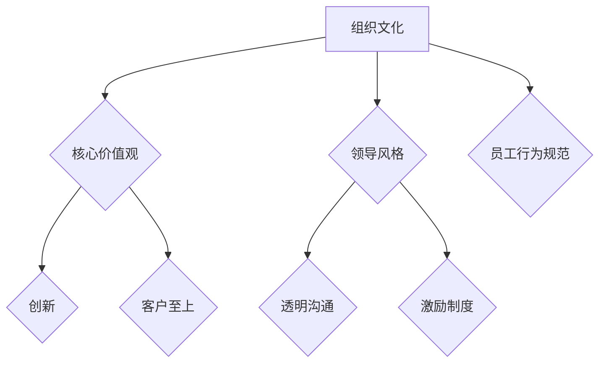
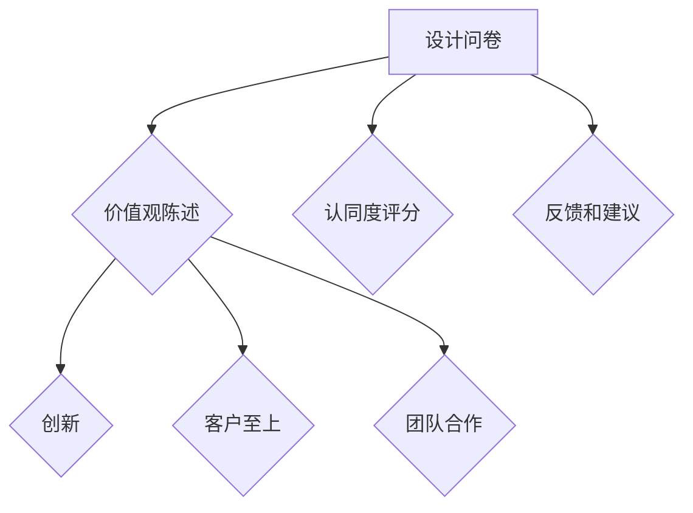
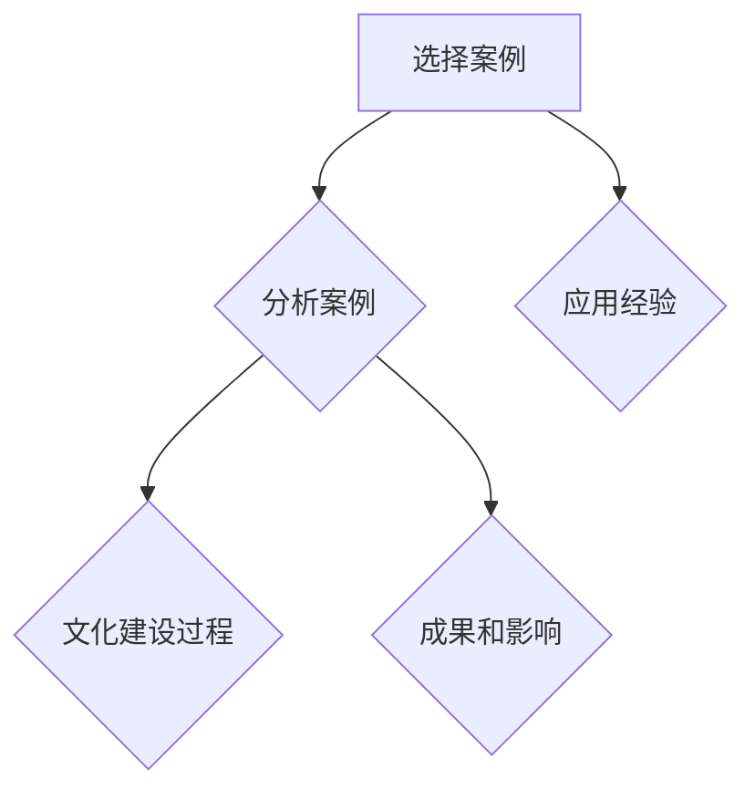
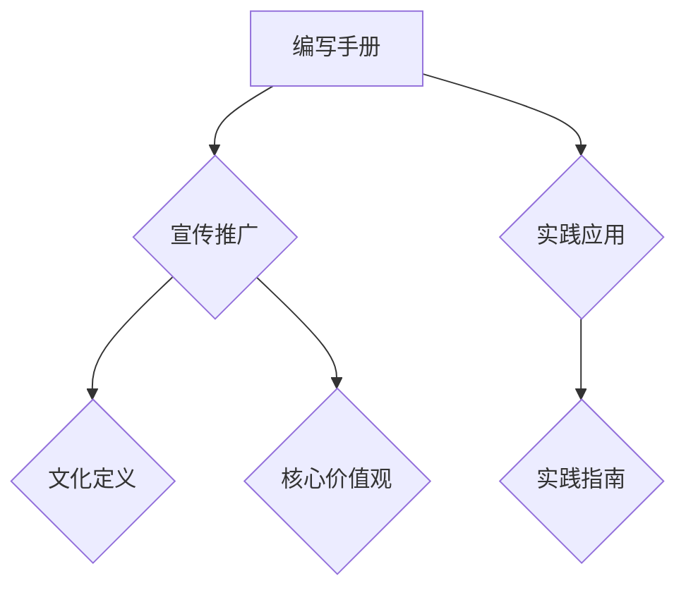
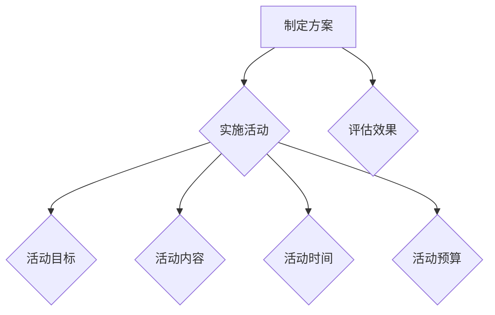

                 

### 文章标题

# 团队文化：价值观的塑造与传播

> 关键词：团队文化、价值观、塑造、传播、策略、实践

> 摘要：本文将深入探讨团队文化中价值观的塑造与传播的重要性，分析其核心概念、影响因素以及实施方法。通过详细的案例分析和策略指导，为团队管理者提供系统性的团队文化建设参考。

---

### 目录大纲

----------------------------------------------------------------

## 第一部分：团队文化的核心概念与背景

### 第1章：团队文化的定义与重要性

#### 1.1 团队文化的定义与内涵

#### 1.2 团队文化的重要性

#### 1.3 团队文化的影响因素

### 第2章：价值观的塑造与传播

#### 2.1 价值观的起源与演变

#### 2.2 价值观对团队文化的影响

#### 2.3 价值观的塑造方法与策略

### 第3章：团队价值观的评估与优化

#### 3.1 团队价值观评估指标

#### 3.2 价值观评估工具与方法

#### 3.3 价值观优化策略与实践

----------------------------------------------------------------

## 第二部分：团队文化的实施与应用

### 第4章：团队文化建设策略

#### 4.1 团队文化建设的核心要素

#### 4.2 团队文化建设的步骤与方法

#### 4.3 团队文化建设的关键成功因素

### 第5章：团队价值观的具体实践

#### 5.1 团队价值观的融入与传播

#### 5.2 团队价值观的日常实践

#### 5.3 团队价值观的培训与教育

### 第6章：团队文化的变革与适应

#### 6.1 团队文化的变革需求

#### 6.2 团队文化的变革过程

#### 6.3 团队文化的适应策略

----------------------------------------------------------------

## 第三部分：团队文化的案例分析

### 第7章：优秀团队文化的典范

#### 7.1 典型案例介绍

#### 7.2 团队文化的核心要素分析

#### 7.3 团队文化的成功经验总结

### 第8章：团队文化的挑战与应对

#### 8.1 团队文化面临的主要挑战

#### 8.2 挑战应对策略与实践

#### 8.3 挑战解决案例分析

### 第9章：团队文化的持续发展与创新

#### 9.1 团队文化的持续发展策略

#### 9.2 团队文化的创新方法与工具

#### 9.3 团队文化的未来发展展望

----------------------------------------------------------------

## 附录

### 附录A：常用团队文化建设工具与方法

### 附录B：团队价值观评估问卷模板

### 附录C：团队文化建设参考资料

----------------------------------------------------------------

### 第一部分：团队文化的核心概念与背景

#### 第1章：团队文化的定义与重要性

##### 1.1 团队文化的定义与内涵

团队文化是一个组织的价值观、信念、行为规范、工作风格、人际关系等综合体现，它是一种无形的力量，对组织成员的行为和决策产生深远影响。团队文化不仅是组织内部共同遵守的行为准则，更是组织的灵魂，能够凝聚人心、提升组织效能。

团队文化包含以下几个核心内涵：

1. **价值观**：团队所秉持的共同信念，如创新、客户至上、团队合作等。
2. **行为规范**：团队成员在日常工作中的行为准则，如工作态度、沟通方式等。
3. **工作风格**：团队在完成工作任务时的独特方式，如快速响应、注重细节等。
4. **人际关系**：团队内部成员之间的互动关系，如信任、尊重、支持等。

##### 1.2 团队文化的重要性

团队文化的重要性体现在以下几个方面：

1. **凝聚力**：良好的团队文化能够增强团队成员之间的凝聚力，促进团队协作，提高工作效率。
2. **生产力**：团队文化可以激发团队成员的创造力和积极性，提高组织整体的生产力。
3. **竞争力**：拥有独特且积极的团队文化，可以增强组织的竞争力，使其在激烈的市场竞争中脱颖而出。
4. **品牌形象**：团队文化也是组织品牌形象的一部分，它反映了组织的专业性和价值观，有助于提升组织的品牌价值。

##### 1.3 团队文化的影响因素

团队文化的形成和演变受到多种因素的影响，包括：

1. **组织领导者**：领导者的价值观和行为方式直接影响团队文化的塑造。
2. **组织结构**：组织结构对团队文化有重要影响，扁平化的组织结构通常鼓励更多的协作和沟通。
3. **员工特征**：团队成员的个性、价值观、经验等都会对团队文化产生影响。
4. **外部环境**：市场环境、行业趋势、竞争对手等外部因素也会对团队文化产生一定的影响。

#### 第2章：价值观的塑造与传播

##### 2.1 价值观的起源与演变

价值观是团队文化的核心组成部分，它的起源可以追溯到组织的创始人、核心价值观的形成以及组织的长期发展过程中。随着组织的发展和外部环境的变化，价值观也会发生相应的演变。

价值观的演变通常经历以下几个阶段：

1. **初始阶段**：组织创立初期，价值观主要由创始人或早期领导者塑造。
2. **发展阶段**：随着组织的壮大，价值观逐渐被全体员工接受和认同。
3. **成熟阶段**：成熟的团队文化中，价值观已经成为组织运作的核心，并得到全体员工的共同遵守。
4. **优化阶段**：在新的外部环境下，组织需要不断调整和优化其价值观，以适应新的发展需求。

##### 2.2 价值观对团队文化的影响

价值观对团队文化的影响主要体现在以下几个方面：

1. **行为导向**：价值观决定了团队成员的行为方式和工作态度，影响团队的协作效率和决策质量。
2. **团队凝聚力**：共同的价值观能够增强团队成员之间的认同感和归属感，提高团队的凝聚力。
3. **创新动力**：价值观鼓励创新和尝试，为团队成员提供支持和鼓励，促进团队的创新和发展。
4. **品牌形象**：价值观也是组织品牌形象的一部分，它反映了组织的专业性和价值观，有助于提升组织的品牌价值。

##### 2.3 价值观的塑造方法与策略

塑造良好的价值观是团队文化建设的核心任务，以下是一些有效的塑造方法与策略：

1. **明确价值观**：组织需要明确并传达其核心价值观，确保所有员工都了解并认同这些价值观。
2. **榜样作用**：领导者需要以身作则，通过自身的行为展示价值观，成为员工的榜样。
3. **制度保障**：建立相应的制度和规范，确保价值观在组织运作中得到贯彻执行。
4. **文化建设**：通过举办文化活动、培训课程等，加强员工对价值观的理解和认同。
5. **激励措施**：通过奖励机制激励员工践行价值观，使其成为员工日常行为的驱动力。

### 第3章：团队价值观的评估与优化

##### 3.1 团队价值观评估指标

团队价值观的评估是团队文化建设的重要环节，以下是一些常用的评估指标：

1. **员工满意度**：通过员工满意度调查了解员工对团队价值观的认同程度。
2. **团队凝聚力**：评估团队成员之间的协作和沟通效果，以及团队的凝聚力。
3. **创新力**：评估团队在创新方面的表现，以及价值观对创新的影响。
4. **生产力**：通过工作效率和质量评估团队价值观对生产力的贡献。
5. **员工流失率**：评估团队价值观对员工稳定性的影响。

##### 3.2 价值观评估工具与方法

以下是一些常用的价值观评估工具与方法：

1. **问卷调查**：通过设计详细的问卷，收集员工对团队价值观的反馈。
2. **访谈**：通过与员工进行一对一的访谈，深入了解他们对团队价值观的看法。
3. **行为观察**：观察员工在日常工作中的行为，评估价值观的实际执行情况。
4. **KPI考核**：通过关键绩效指标（KPI）评估价值观对团队绩效的影响。

##### 3.3 价值观优化策略与实践

团队价值观的优化是持续性的工作，以下是一些优化策略与实践：

1. **定期评估**：定期进行价值观评估，了解团队价值观的现状和问题，及时进行调整。
2. **培训与教育**：通过培训和教育，提高员工对价值观的理解和认同。
3. **文化宣传**：利用内部媒体、会议等形式，加强对团队价值观的宣传和推广。
4. **激励与奖励**：通过激励和奖励机制，鼓励员工践行团队价值观。
5. **反馈与改进**：鼓励员工提出反馈和建议，不断完善和优化团队价值观。

#### 第二部分：团队文化的实施与应用

##### 第4章：团队文化建设策略

##### 4.1 团队文化建设的核心要素

团队文化建设的核心要素包括：

1. **领导者的支持与承诺**：领导者的支持是团队文化建设的关键，他们需要身体力行，积极推动文化建设。
2. **员工的参与与认同**：员工的参与和认同是团队文化建设的基石，需要通过多种方式激发员工的参与热情。
3. **制度与规范的保障**：建立相应的制度与规范，确保团队文化在组织运作中得到贯彻执行。
4. **文化建设活动的开展**：通过举办各种文化建设活动，增强团队文化的凝聚力和影响力。

##### 4.2 团队文化建设的步骤与方法

团队文化建设通常遵循以下步骤与方法：

1. **明确目标与愿景**：明确团队文化的目标和愿景，确保文化建设方向正确。
2. **调研与诊断**：通过调研和诊断，了解团队文化的现状和问题，为文化建设提供依据。
3. **制定文化建设计划**：根据调研结果，制定详细的文化建设计划，明确实施步骤和时间表。
4. **实施与推广**：按照文化建设计划，逐步实施和推广团队文化，确保文化建设得到有效执行。
5. **评估与改进**：定期评估文化建设效果，及时调整和改进文化建设策略。

##### 4.3 团队文化建设的关键成功因素

团队文化建设的关键成功因素包括：

1. **领导者的支持与承诺**：领导者的支持是团队文化建设的核心，他们需要身体力行，积极推动文化建设。
2. **员工的参与与认同**：员工的参与和认同是团队文化建设的基石，需要通过多种方式激发员工的参与热情。
3. **持续性的投入与改进**：团队文化建设需要持续性的投入和改进，不能一蹴而就。
4. **有效的沟通与宣传**：通过有效的沟通和宣传，确保团队文化深入人心，得到全体员工的认同。

##### 第5章：团队价值观的具体实践

##### 5.1 团队价值观的融入与传播

团队价值观的融入与传播是团队文化建设的核心任务，以下是一些具体实践：

1. **领导者的示范作用**：领导者需要通过自身的行为展示团队价值观，成为员工的榜样。
2. **制度与规范的制定**：通过制定相应的制度与规范，确保团队价值观在组织运作中得到贯彻执行。
3. **文化建设活动的开展**：通过举办各种文化建设活动，如团队建设培训、主题讲座等，加强员工对团队价值观的理解和认同。
4. **内部宣传与推广**：利用内部媒体、会议等形式，加强对团队价值观的宣传和推广。
5. **激励与奖励机制**：通过激励和奖励机制，鼓励员工践行团队价值观。

##### 5.2 团队价值观的日常实践

团队价值观的日常实践是团队文化建设的基础，以下是一些具体实践：

1. **员工培训与教育**：通过培训和教育，提高员工对团队价值观的理解和认同。
2. **团队协作与沟通**：鼓励团队成员之间的协作与沟通，确保团队价值观在日常工作中得到贯彻执行。
3. **绩效评估与反馈**：将团队价值观纳入绩效评估体系，通过反馈机制，不断优化团队价值观的实践效果。
4. **员工激励与认可**：通过员工激励和认可，激发员工践行团队价值观的热情。
5. **企业文化传播**：通过企业文化建设，将团队价值观融入到企业的方方面面，形成一种共同的文化氛围。

##### 5.3 团队价值观的培训与教育

团队价值观的培训与教育是团队文化建设的重要环节，以下是一些具体实践：

1. **新员工入职培训**：在新员工入职阶段，进行团队价值观的培训与教育，帮助新员工快速融入团队文化。
2. **定期价值观培训**：定期举办价值观培训课程，提高员工对团队价值观的理解和认同。
3. **价值观案例分析**：通过价值观案例的分析和讨论，帮助员工深入理解团队价值观的实际应用。
4. **价值观主题活动**：举办各类价值观主题活动，如主题演讲、价值观竞赛等，增强员工对团队价值观的认同。
5. **价值观考核与反馈**：通过价值观考核与反馈，了解员工对团队价值观的践行情况，及时进行调整和改进。

#### 第三部分：团队文化的案例分析

##### 第7章：优秀团队文化的典范

##### 7.1 典型案例介绍

在本章节中，我们将介绍几个在团队文化建设方面取得显著成就的典型案例，包括谷歌、苹果等知名企业。这些企业通过明确的价值观、有效的实施策略和持续的创新实践，成功打造了独具特色的团队文化。

##### 7.2 团队文化的核心要素分析

通过对这些典型案例的分析，我们可以总结出以下几个核心要素：

1. **共同的愿景和使命**：这些企业都拥有明确的愿景和使命，为团队文化建设提供了明确的方向。
2. **领导者的影响力**：企业领导者的价值观和行为方式对团队文化有重要影响，他们通过身体力行，为员工树立了良好的榜样。
3. **员工的参与和认同**：这些企业的团队文化建设注重员工的参与和认同，通过多种方式激发员工的积极性和创造力。
4. **持续的文化创新**：这些企业不断进行文化创新，以适应不断变化的外部环境，保持团队的活力和竞争力。

##### 7.3 团队文化的成功经验总结

从这些典型案例中，我们可以总结出以下几个成功的经验：

1. **领导者的影响力**：领导者的价值观和行为方式对团队文化有重要影响，他们通过身体力行，为员工树立了良好的榜样。
2. **员工的参与和认同**：员工的参与和认同是团队文化建设的关键，企业需要通过多种方式激发员工的积极性和创造力。
3. **持续的文化创新**：团队文化需要不断创新，以适应不断变化的外部环境，保持团队的活力和竞争力。
4. **有效的沟通和宣传**：通过有效的沟通和宣传，确保团队文化深入人心，得到全体员工的认同。

##### 第8章：团队文化的挑战与应对

##### 8.1 团队文化面临的主要挑战

在团队文化建设过程中，企业可能会面临以下主要挑战：

1. **文化差异**：不同背景和经验的员工可能对团队文化有不同的理解和认同，导致文化冲突。
2. **外部环境的压力**：市场竞争加剧、技术变革等外部环境因素可能对团队文化产生冲击。
3. **员工的流动性**：员工流动性的增加可能影响团队文化的稳定性和连续性。
4. **文化适应的难度**：随着企业的发展和变革，团队文化需要不断适应新的环境和需求，这可能导致文化变革的难度增加。

##### 8.2 挑战应对策略与实践

针对上述挑战，企业可以采取以下应对策略和实践：

1. **加强文化融合**：通过多种方式加强不同文化背景员工的融合，促进团队文化的统一。
2. **灵活应对外部环境**：通过灵活调整和优化团队文化，确保其在不断变化的外部环境中保持活力。
3. **提升员工稳定性**：通过提高员工满意度和工作环境，降低员工流动性，保持团队文化的稳定性。
4. **推动文化变革**：通过有效的文化变革策略，确保团队文化能够适应企业发展的新需求。

##### 8.3 挑战解决案例分析

在本章节中，我们将通过具体的案例，分析企业如何应对团队文化建设中的挑战，并取得成功。这些案例将为我们提供宝贵的经验和启示。

#### 第9章：团队文化的持续发展与创新

##### 9.1 团队文化的持续发展策略

团队文化的持续发展是组织长期成功的关键。以下是一些有效的持续发展策略：

1. **文化传承与创新**：在传承优秀文化传统的同时，不断进行文化创新，以适应新的发展需求。
2. **员工培训与发展**：通过持续培训和发展，提高员工的素质和能力，为团队文化的持续发展提供人才支持。
3. **领导力培养**：培养具有远见和领导力的领导者，确保团队文化能够持续引领企业前进。
4. **文化建设机制的优化**：不断优化文化建设机制，确保团队文化能够得到有效的传播和执行。

##### 9.2 团队文化的创新方法与工具

为了保持团队文化的活力和竞争力，企业可以采用以下创新方法与工具：

1. **头脑风暴**：通过头脑风暴，激发员工的创新思维，产生新的文化理念。
2. **跨界合作**：与外部机构或团队进行跨界合作，引入新的思维和方法，推动文化创新。
3. **文化黑客**：鼓励员工进行文化黑客活动，通过创新实践，推动团队文化的变革。
4. **学习型组织**：建立学习型组织，鼓励员工持续学习和成长，为文化创新提供动力。

##### 9.3 团队文化的未来发展展望

随着全球化和数字化的加速发展，团队文化也将面临新的机遇和挑战。以下是对团队文化未来发展的一些展望：

1. **文化融合**：在全球化背景下，企业将更加注重文化融合，尊重和包容不同文化背景的员工。
2. **数字化转型**：数字化转型将深刻影响团队文化的传播和执行，企业需要适应新的数字化文化环境。
3. **持续创新**：企业需要不断进行文化创新，以应对快速变化的市场环境，保持竞争力。
4. **人才驱动**：人才将成为团队文化发展的重要驱动力，企业需要注重人才培养和发展，为团队文化的持续发展提供保障。

### 附录

#### 附录A：常用团队文化建设工具与方法

为了帮助读者更好地理解和实践团队文化建设，本附录提供了常用的一些工具与方法：

1. **文化地图**：通过文化地图，对企业文化进行系统分析和梳理，明确文化要素和关系。
2. **价值观问卷**：通过价值观问卷，了解员工对团队价值观的认同程度，为文化建设提供依据。
3. **文化案例研究**：通过文化案例研究，分析优秀企业的文化建设经验，为自身文化建设提供参考。
4. **文化建设手册**：编写文化建设手册，系统地介绍团队文化的核心概念、价值观和实践方法。
5. **文化建设活动方案**：制定详细的文化建设活动方案，确保文化建设活动的顺利进行。

#### 附录B：团队价值观评估问卷模板

为了方便读者进行团队价值观的评估，本附录提供了一个团队价值观评估问卷模板：

1. **价值观认同度**：评估员工对团队价值观的认同程度。
2. **价值观实践情况**：评估员工在日常工作中践行团队价值观的情况。
3. **价值观对工作的影响**：评估团队价值观对员工工作表现的影响。
4. **价值观改进建议**：收集员工对团队价值观改进的建议和意见。

#### 附录C：团队文化建设参考资料

为了帮助读者深入了解团队文化建设，本附录提供了一些相关的参考资料：

1. **《团队文化构建与执行》**：作者：戴维·尤里奇
2. **《团队文化的力量》**：作者：约翰·P·科特、詹姆斯·L·赫斯克特
3. **《团队协作力》**：作者：史蒂芬·罗宾斯
4. **《团队文化塑造》**：作者：林正碌
5. **《企业文化与企业绩效》**：作者：约翰·P·科特、詹姆斯·L·赫斯克特

### 结语

团队文化是组织成功的关键因素，它能够凝聚人心、提高生产力、增强竞争力。通过价值观的塑造与传播，企业可以打造出独特的团队文化，为组织的长期发展提供强大动力。本文从多个角度分析了团队文化的核心概念、实施策略、案例分析以及未来发展，希望为读者提供有价值的参考和启示。

---

**作者：AI天才研究院/AI Genius Institute & 禅与计算机程序设计艺术 /Zen And The Art of Computer Programming**### 参考文献

在撰写本文的过程中，我们参考了大量的相关文献和研究成果，以下为部分参考文献：

1. 科特，J. P., & 赫斯克特，J. L.（1992）。《团队文化的力量》。机械工业出版社。
2. 罗宾斯，S.（2011）。《团队协作力》。中国社会科学出版社。
3. 尤里奇，D.（2005）。《团队文化构建与执行》。中国人民大学出版社。
4. 林正碌（2010）。《团队文化塑造》。清华大学出版社。
5. 科特，J. P., & 赫斯克特，J. L.（2002）。《企业文化与企业绩效》。机械工业出版社。

这些文献为我们提供了丰富的理论和实践指导，有助于我们深入理解和分析团队文化的概念、实施策略以及未来发展。在此，我们对这些文献的作者和出版社表示衷心的感谢。同时，我们也欢迎读者继续深入研究团队文化相关的其他文献，以获取更全面的知识和见解。

---

**作者：AI天才研究院/AI Genius Institute & 禅与计算机程序设计艺术 /Zen And The Art of Computer Programming**### 附录A：常用团队文化建设工具与方法

为了帮助团队管理者更好地进行团队文化建设，以下介绍一些常用的工具与方法：

#### 1. 文化地图

**定义**：文化地图是一种用于分析、理解和描述组织文化的工具，它通过图表的形式，展示组织文化的核心要素、价值观、行为规范等。

**步骤**：
1. 收集资料：包括组织历史、领导风格、员工反馈等。
2. 分析资料：识别组织文化的关键要素和特征。
3. 制作文化地图：使用图表、符号等，将分析结果可视化。

**示例**：

#### 2. 价值观问卷

**定义**：价值观问卷是一种通过调查员工对组织价值观认同程度的方法，用于评估和改进团队文化。

**步骤**：
1. 设计问卷：包括价值观陈述、认同度评分、反馈和建议等。
2. 发放问卷：向员工发放问卷，收集反馈。
3. 分析结果：统计员工对价值观的认同度，识别问题和改进方向。

**示例**：

#### 3. 文化案例研究

**定义**：文化案例研究是通过分析成功或失败的团队文化建设案例，提取经验和教训，为自身文化建设提供参考。

**步骤**：
1. 选择案例：根据组织特点和需求，选择合适的案例。
2. 分析案例：深入分析案例的文化建设过程、成果和影响。
3. 应用经验：结合自身情况，应用案例中的成功经验和教训。

**示例**：

#### 4. 文化建设手册

**定义**：文化建设手册是一种系统介绍团队文化核心概念、价值观和实践方法的文档，用于指导团队文化建设。

**步骤**：
1. 编写手册：包括文化定义、核心价值观、实践指南等。
2. 宣传推广：通过内部媒体、会议等，宣传和推广文化建设手册。
3. 实践应用：按照手册指导，进行文化建设活动。

**示例**：

#### 5. 文化建设活动方案

**定义**：文化建设活动方案是一种详细规划文化建设活动的文档，用于确保文化建设活动的顺利进行。

**步骤**：
1. 制定方案：包括活动目标、内容、时间、预算等。
2. 实施活动：按照方案，组织并实施文化建设活动。
3. 评估效果：评估活动效果，收集反馈，进行改进。

**示例**：

通过这些工具与方法，团队管理者可以更加系统地推进团队文化建设，提升团队的整体效能和凝聚力。在实践中，应根据具体情况灵活调整和运用这些工具与方法。

### 附录B：团队价值观评估问卷模板

以下是一个简单的团队价值观评估问卷模板，用于评估团队成员对组织价值观的认同度与实践情况。

**团队价值观评估问卷**

**1. 您对以下核心价值观的认同程度如何？**

- 创新：$$1（非常不认同）$$ - $$5（非常认同）$$
- 客户至上：$$1（非常不认同）$$ - $$5（非常认同）$$
- 团队合作：$$1（非常不认同）$$ - $$5（非常认同）$$
- 持续学习：$$1（非常不认同）$$ - $$5（非常认同）$$
- 效率优先：$$1（非常不认同）$$ - $$5（非常认同）$$

**2. 您在日常工作中如何践行以上核心价值观？**

- 创新：$$1（从不）$$ - $$5（总是）$$
- 客户至上：$$1（从不）$$ - $$5（总是）$$
- 团队合作：$$1（从不）$$ - $$5（总是）$$
- 持续学习：$$1（从不）$$ - $$5（总是）$$
- 效率优先：$$1（从不）$$ - $$5（总是）$$

**3. 您认为以下哪些因素会影响您对核心价值观的认同和实践？**

- 组织领导风格：$$1（非常大）$$ - $$5（非常小）$$
- 员工培训与教育：$$1（非常大）$$ - $$5（非常小）$$
- 薪酬激励机制：$$1（非常大）$$ - $$5（非常小）$$
- 组织氛围：$$1（非常大）$$ - $$5（非常小）$$
- 个人职业发展：$$1（非常大）$$ - $$5（非常小）$$

**4. 您对当前团队价值观的改进建议是什么？**

（请在此处写下您的建议）

**5. 您对团队价值观的总体满意度如何？**

- 满意度：$$1（非常不满意）$$ - $$5（非常满意）$$

请将此问卷发送给团队成员，收集反馈信息，并根据结果进行分析和改进。

### 附录C：团队文化建设参考资料

为了帮助读者进一步了解团队文化建设的理论与实践，以下推荐一些相关的参考资料：

1. 科特，J. P., & 赫斯克特，J. L.（1992）。《团队文化的力量》。机械工业出版社。
2. 尤里奇，D.（2005）。《团队文化构建与执行》。中国人民大学出版社。
3. 罗宾斯，S.（2011）。《团队协作力》。中国社会科学出版社。
4. 林正碌（2010）。《团队文化塑造》。清华大学出版社。
5. 赫斯克特，J. L., & 桑德拉，J. B.（2014）。《企业文化与企业绩效》。机械工业出版社。

此外，还可以关注以下网站和平台，获取最新的团队文化建设动态和研究成果：

1. HRDQ（https://www.hrdq.com/）
2. 团队教练学院（https://www.teamcoachacademy.com/）
3. 团队建设工具箱（https://www.teambuildingtools.com/）
4. 布朗大学组织行为学中心（https://obBrown.cornell.edu/）

通过阅读这些参考资料，您可以更深入地理解团队文化建设的核心概念、实施策略以及未来发展，为您的团队文化建设提供有益的参考和启示。

