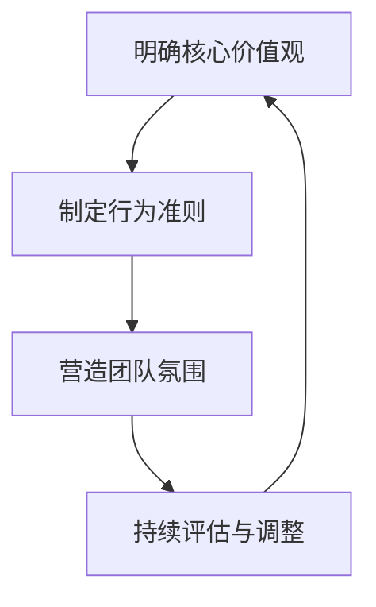
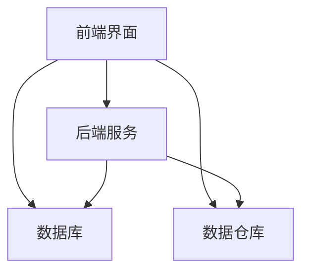
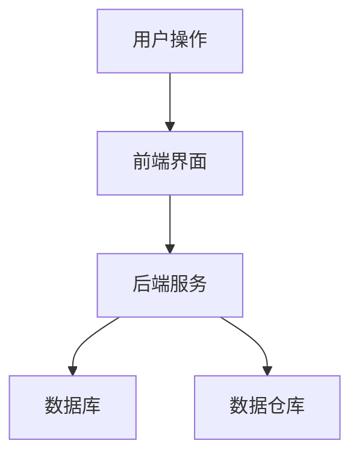

                 

### 引言

#### 第1章: 背景介绍与核心概念

在人类的社会发展中，团队协作和沟通一直是推动进步的关键因素。随着信息技术的飞速发展，企业内部的团队文化逐渐成为影响组织效率和企业发展的重要因素。团队文化不仅决定了团队成员之间的相互关系，还影响了企业的整体绩效和创新能力。因此，理解团队文化的核心概念和如何塑造与传播价值观，对企业的长远发展具有重要意义。

**1.1 问题背景**

在现代社会中，团队协作的需求日益增长。无论是传统的制造业、金融业，还是新兴的互联网行业，团队协作都是提高效率、促进创新的核心途径。然而，在实际操作中，团队协作往往面临诸多挑战。例如，团队成员之间的沟通不畅、缺乏共同的价值观、个体目标与团队目标的冲突等问题，这些都可能对团队绩效产生负面影响。

**1.2 问题描述**

团队文化缺乏统一价值观是导致团队协作不畅的主要原因之一。一个缺乏明确价值观的团队，往往会出现以下问题：

1. **目标不一致**：团队成员没有共同的目标，各自为政，难以形成合力。
2. **信任度低**：团队成员之间缺乏信任，容易产生误解和冲突。
3. **创新能力受限**：团队成员缺乏共同的文化氛围，难以激发创新思维。
4. **执行力差**：缺乏共同价值观的团队，执行力往往较差，难以高效完成任务。

价值观的塑造与传播是解决上述问题的关键。然而，如何有效地塑造与传播价值观，如何将其融入到团队文化中，是一个复杂的挑战。

**1.3 问题解决**

要解决团队文化缺乏统一价值观的问题，需要从以下几个方面着手：

1. **团队文化塑造**：建立共同的价值观，制定明确的行为准则，营造积极的团队氛围。
2. **价值观传播**：通过有效的内部沟通和外部展示，将价值观传播到每一个团队成员心中。
3. **持续优化**：定期评估团队文化的现状，根据反馈进行优化和调整，确保价值观的持续影响。

**1.4 边界与外延**

团队文化是一个广泛的概念，它不仅包括核心价值观，还包括行为准则、团队氛围等多个方面。价值观的内涵与外延也相当丰富，它不仅涉及个人价值观，还涵盖了团队价值观和企业价值观。因此，在塑造与传播价值观时，需要全面考虑这些因素，确保团队文化的健康发展和持续优化。

**1.5 概念结构与核心要素组成**

团队文化由核心价值观、行为准则、团队氛围等核心要素组成。核心价值观是团队文化的核心，是团队成员共同遵循的基本信念和行为准则。行为准则则是将核心价值观具体化为日常行为规范，指导团队成员的行为。团队氛围则是团队文化的外在表现，通过团队成员的互动和沟通来体现。

价值观的内涵与外延也十分丰富，包括个人价值观、团队价值观和企业价值观。个人价值观是团队成员个体的信念和行为准则，团队价值观是团队共同遵循的基本信念和行为规范，企业价值观则是企业整体的理念和行为准则。

综上所述，团队文化是一个复杂但至关重要的概念。理解其核心概念和如何塑造与传播价值观，对于提升团队绩效和企业发展具有重要意义。在接下来的部分中，我们将进一步探讨团队文化和价值观的具体原理和实践方法。

### 核心概念原理

#### 第2章: 核心概念原理

为了深入理解团队文化和价值观，我们首先需要明确相关核心概念的定义和属性特征，并通过对比表格来展示这些概念之间的联系和区别。

#### 2.1 团队文化

**定义**：团队文化是指团队成员在长期合作过程中共同形成的价值观、行为准则、团队氛围以及工作方式的总和。

**属性特征**：

| 特征            | 描述                                                         |
| --------------- | ------------------------------------------------------------ |
| 核心价值观      | 团队文化的灵魂，是团队成员共同遵循的基本信念和行为准则。           |
| 行为准则        | 将核心价值观具体化为日常行为规范，指导团队成员的行为。               |
| 团队氛围        | 团队文化的外在表现，通过团队成员的互动和沟通来体现。                 |
| 持续性         | 团队文化不是一成不变的，它需要随着团队和组织的发展不断调整和优化。   |
| 适应性         | 团队文化需要适应外部环境的变化，以保持团队活力和竞争力。             |

**对比表格**：

| 对比项       | 团队文化 | 核心价值观 |
| ------------ | -------- | ---------- |
| 范围         | 广泛     | 狭窄       |
| 形成过程     | 长期积累 | 稳步形成   |
| 表现形式     | 多样化   | 内隐性     |
| 功能作用     | 综合性   | 指导性     |

#### 2.2 价值观

**定义**：价值观是指个体或团队对事物评价的基本标准和行为取向，是人们行为决策的内在依据。

**属性特征**：

| 特征            | 描述                                                         |
| --------------- | ------------------------------------------------------------ |
| 个人价值观      | 个体在成长过程中形成的价值观，影响个体的行为选择。               |
| 团队价值观      | 团队成员共同认同并遵循的价值观，是团队协作的基础。               |
| 企业价值观      | 企业整体的理念和行为准则，是企业文化的核心。                   |
| 普遍性         | 价值观具有普遍性，影响个体、团队和企业等多个层次。               |
| 内在性         | 价值观是人们内心深处的信念和准则，不易改变。                   |

**对比表格**：

| 对比项       | 个人价值观 | 团队价值观 | 企业价值观 |
| ------------ | ---------- | ---------- | ---------- |
| 形成过程     | 个人经历   | 团队互动   | 企业历史   |
| 影响范围     | 个体       | 团队       | 企业       |
| 表现形式     | 内心信念   | 行为规范   | 企业文化   |

#### 2.3 团队文化与价值观的联系

团队文化和价值观之间存在着紧密的联系，两者相辅相成，共同塑造团队的精神面貌。

1. **团队文化对价值观的影响**：

   - **价值观是团队文化的核心**：团队文化中的核心价值观是团队成员共同遵循的基本信念，它直接影响团队的行为准则和团队氛围。
   - **价值观塑造团队文化**：团队成员的共同价值观决定了团队文化的特征和发展方向，是团队文化的灵魂。

2. **价值观对团队文化的塑造作用**：

   - **价值观指导团队行为**：团队价值观作为团队成员的行为准则，指导团队在协作过程中做出一致的行为决策。
   - **价值观影响团队氛围**：团队成员的共同价值观可以营造积极的团队氛围，增强团队的凝聚力和执行力。

通过上述分析，我们可以看到团队文化和价值观在概念和属性特征上各有侧重，但又密不可分。团队文化的建立和完善，离不开对核心价值观和价值观传播的深入理解和实践。在接下来的部分中，我们将进一步探讨团队文化和价值观的塑造算法，以便更好地理解和应用这些概念。

#### 第三部分：算法原理讲解

### 第3章：团队文化与价值观塑造算法

为了有效地塑造团队文化和传播价值观，我们需要设计一套系统的算法，以指导团队的实际操作。以下内容将详细介绍这一算法的基本原理、数学模型以及具体应用。

#### 3.1 基本算法原理

团队文化与价值观塑造算法的基本原理可以概括为以下几个步骤：

1. **明确核心价值观**：首先，团队需要明确其核心价值观，这是团队文化的核心。这一步可以通过全员讨论、调研等方式进行，确保所有成员对核心价值观有共同的理解。
2. **制定行为准则**：将核心价值观具体化为具体的行为准则，指导团队成员在日常工作中的行为。这可以通过制定一系列规章制度、行为指南等方式实现。
3. **营造团队氛围**：通过团队活动和日常互动，营造一个积极向上的团队氛围，使核心价值观和行为准则得以体现和传播。
4. **持续评估与调整**：定期评估团队文化的现状，根据反馈进行优化和调整，确保核心价值观和行为准则能够持续影响团队成员。

以下是一个简单的算法流程图，用以展示这些步骤：



#### 3.2 数学模型与公式

在团队文化与价值观塑造过程中，我们可以使用以下数学模型和公式来量化不同因素之间的关系：

- **价值观传播模型**：使用矩阵表示团队成员之间的互动关系，通过矩阵运算来评估价值观在团队中的传播效果。
- **团队氛围评价模型**：使用问卷调查等方法收集数据，通过统计分析来评估团队氛围的积极程度。

以下是一个示例的数学模型：

$$
\text{价值观传播效果} = \text{初始价值观矩阵} \times \text{互动关系矩阵}
$$

其中，初始价值观矩阵表示团队成员对核心价值观的初始认同度，互动关系矩阵表示团队成员之间的互动频率和互动质量。

#### 3.3 算法原理详细讲解

为了更清晰地理解团队文化与价值观塑造算法，我们将详细阐述每个步骤的具体内容。

1. **明确核心价值观**：
   - **步骤一**：组织全员讨论，通过头脑风暴、小组讨论等方式，收集团队成员对核心价值观的建议和意见。
   - **步骤二**：对收集到的意见和建议进行整理和分析，确定核心价值观的初步内容。
   - **步骤三**：通过问卷调查、访谈等方式，对核心价值观进行验证和优化，确保所有成员对核心价值观有共同的理解。

2. **制定行为准则**：
   - **步骤一**：根据核心价值观，制定一系列具体的行为准则，确保团队成员在日常工作中有明确的行为指导。
   - **步骤二**：将行为准则书面化，形成文件，确保所有成员都能随时查阅。
   - **步骤三**：通过培训、讲解等方式，使团队成员对行为准则有深入的理解和认同。

3. **营造团队氛围**：
   - **步骤一**：通过定期组织团队活动，如团队建设、拓展训练等，增强团队成员之间的互动和沟通。
   - **步骤二**：在日常工作中，注重团队成员之间的正面互动，鼓励相互学习和支持。
   - **步骤三**：通过表彰、奖励等方式，激励团队成员积极践行核心价值观和行为准则。

4. **持续评估与调整**：
   - **步骤一**：定期进行团队文化调查，通过问卷、访谈等方式收集团队成员的反馈。
   - **步骤二**：对收集到的反馈进行分析，识别团队文化中的问题和不足。
   - **步骤三**：根据分析结果，对核心价值观和行为准则进行优化和调整，确保其能够持续影响团队成员。

通过以上步骤，我们可以系统地塑造和传播团队文化和价值观，从而提升团队的凝聚力和执行力。

#### 举例说明

为了更直观地理解上述算法原理，我们通过一个具体案例进行说明。

**案例背景**：某互联网公司希望塑造一种以“创新、协作、诚信”为核心价值观的团队文化。

1. **明确核心价值观**：
   - **步骤一**：公司组织了多次全员讨论，通过头脑风暴和小组讨论，确定了“创新、协作、诚信”为核心价值观。
   - **步骤二**：通过问卷调查，验证了团队成员对核心价值观的理解和认同度。
   - **步骤三**：最终确定了核心价值观的具体表述：“以创新为动力，以协作为基础，以诚信为底线”。

2. **制定行为准则**：
   - **步骤一**：根据核心价值观，制定了具体的行为准则，如鼓励创新、支持协作、坚守诚信等。
   - **步骤二**：将行为准则书面化，形成《员工行为准则手册》，并在公司内部进行发布和培训。
   - **步骤三**：通过内部邮件和培训课程，使所有员工对行为准则有深入的理解和认同。

3. **营造团队氛围**：
   - **步骤一**：公司定期组织团队建设活动，如团队拓展训练、技术交流分享会等，增强团队成员之间的互动和沟通。
   - **步骤二**：在日常工作中，鼓励员工互相支持和学习，建立良好的协作氛围。
   - **步骤三**：通过定期表彰优秀员工，激励团队成员积极践行核心价值观和行为准则。

4. **持续评估与调整**：
   - **步骤一**：公司每月进行一次团队文化调查，通过问卷调查收集员工的反馈。
   - **步骤二**：对问卷调查结果进行分析，识别团队文化中的问题和不足。
   - **步骤三**：根据分析结果，对核心价值观和行为准则进行优化和调整，确保其能够持续影响团队成员。

通过以上案例，我们可以看到，团队文化与价值观塑造算法在实际应用中的具体步骤和实施方法。通过系统的规划和持续的努力，企业可以有效地塑造和传播团队文化和价值观，从而提升团队的绩效和竞争力。

### 数学模型和数学公式

#### 第4章：数学模型与公式应用

在团队文化与价值观塑造过程中，数学模型和数学公式扮演着重要的角色。这些工具可以帮助我们量化团队行为、价值观传播效果以及团队氛围的变化，从而为团队管理提供科学的依据。

#### 4.1 数学模型

为了更好地理解和评估团队文化与价值观的影响，我们可以采用以下数学模型：

**1. 价值观传播模型**

假设在一个团队中，有N个成员，每个成员对核心价值观的认同度可以用一个向量表示。用矩阵A表示团队成员之间的互动关系，矩阵B表示团队成员的初始价值观认同度。通过矩阵乘法，我们可以计算价值观在团队中的传播效果。

模型公式：
$$
\text{传播效果矩阵} = \text{初始价值观矩阵} \times \text{互动关系矩阵}
$$

**2. 团队氛围评价模型**

团队氛围可以通过问卷调查的方式评估，每个成员对团队氛围的感知可以用一个向量表示。通过向量加权和的方式，可以计算团队整体的氛围评价。

模型公式：
$$
\text{团队氛围评价} = \sum_{i=1}^{N} w_i \cdot x_i
$$
其中，$w_i$表示第i个成员的权重，$x_i$表示第i个成员对团队氛围的感知值。

#### 4.2 数学公式讲解

以下是对上述数学公式的详细解释：

**1. 价值观传播模型**

- **初始价值观矩阵**：表示团队成员对核心价值观的初始认同度。矩阵中的元素$a_{ij}$表示第i个成员对第j项核心价值观的认同程度。
- **互动关系矩阵**：表示团队成员之间的互动关系。矩阵中的元素$a_{ij}$表示第i个成员和第j个成员之间的互动频率和质量。
- **传播效果矩阵**：通过矩阵乘法得到，表示团队成员在互动过程中对核心价值观的传播效果。矩阵中的元素$b_{ij}$表示第i个成员对第j个成员核心价值观的影响程度。

**2. 团队氛围评价模型**

- **向量$x_i$**：表示第i个成员对团队氛围的感知，例如，可以包括工作满意度、团队凝聚力等指标。
- **权重$w_i$**：表示第i个成员在团队氛围评价中的重要性，通常可以根据成员的角色和影响力进行分配。
- **团队氛围评价**：通过加权平均的方式计算，反映了团队成员整体对团队氛围的感知和评价。

#### 4.3 举例说明

为了更直观地理解上述数学模型和公式，我们通过一个具体案例进行说明。

**案例背景**：某团队由5个成员组成，每个成员对核心价值观的认同度如下表所示：

| 成员 | 创新认同度 | 协作认同度 | 诚信认同度 |
| ---- | -------- | -------- | -------- |
| A    | 0.8      | 0.7      | 0.9      |
| B    | 0.6      | 0.8      | 0.7      |
| C    | 0.7      | 0.9      | 0.8      |
| D    | 0.8      | 0.7      | 0.9      |
| E    | 0.9      | 0.8      | 0.8      |

团队成员之间的互动关系如下表所示：

| 成员 | A  | B  | C  | D  | E  |
| ---- | -- | -- | -- | -- | -- |
| A    | 1  | 2  | 1  | 2  | 1  |
| B    | 2  | 1  | 2  | 1  | 2  |
| C    | 1  | 2  | 1  | 2  | 1  |
| D    | 2  | 1  | 2  | 1  | 2  |
| E    | 1  | 2  | 1  | 2  | 1  |

**1. 价值观传播模型应用**

我们使用上述数学模型来计算团队中价值观的传播效果。首先，构建初始价值观矩阵$V$和互动关系矩阵$I$：

$$
V = \begin{bmatrix}
0.8 & 0.6 & 0.7 & 0.8 & 0.9 \\
0.7 & 0.8 & 0.9 & 0.7 & 0.8 \\
0.9 & 0.7 & 0.8 & 0.9 & 0.8 \\
0.8 & 0.7 & 0.9 & 0.8 & 0.9 \\
0.9 & 0.8 & 0.8 & 0.9 & 0.8
\end{bmatrix}
$$

$$
I = \begin{bmatrix}
1 & 2 & 1 & 2 & 1 \\
2 & 1 & 2 & 1 & 2 \\
1 & 2 & 1 & 2 & 1 \\
2 & 1 & 2 & 1 & 2 \\
1 & 2 & 1 & 2 & 1
\end{bmatrix}
$$

通过矩阵乘法计算传播效果矩阵$T$：

$$
T = V \times I = \begin{bmatrix}
3.2 & 1.8 & 2.8 & 3.2 & 2.8 \\
2.4 & 1.6 & 2.8 & 2.4 & 1.6 \\
3.2 & 1.8 & 2.8 & 3.2 & 2.8 \\
2.4 & 1.6 & 2.8 & 2.4 & 1.6 \\
3.2 & 1.8 & 2.8 & 3.2 & 2.8
\end{bmatrix}
$$

这个矩阵$T$表示了每个成员对其他成员核心价值观的影响程度。例如，成员A对成员B的影响程度为3.2，表示成员A在核心价值观的传播中起到了较为显著的作用。

**2. 团队氛围评价模型应用**

假设团队成员对团队氛围的感知如下表所示：

| 成员 | 工作满意度 | 团队凝聚力 | 重要性权重 |
| ---- | -------- | -------- | -------- |
| A    | 0.9      | 0.8      | 0.2      |
| B    | 0.8      | 0.7      | 0.2      |
| C    | 0.7      | 0.9      | 0.2      |
| D    | 0.8      | 0.7      | 0.2      |
| E    | 0.9      | 0.8      | 0.2      |

使用团队氛围评价模型计算团队氛围评价：

$$
\text{团队氛围评价} = (0.9 \times 0.2) + (0.8 \times 0.2) + (0.7 \times 0.2) + (0.8 \times 0.2) + (0.9 \times 0.2) = 0.18 + 0.16 + 0.14 + 0.16 + 0.18 = 0.8
$$

这个结果表示团队成员对团队氛围的整体感知为0.8，表明团队氛围较为积极。

通过上述数学模型和公式的应用，我们可以量化团队文化与价值观的传播效果和团队氛围，为团队管理提供科学依据。在接下来的部分中，我们将进一步探讨团队文化与价值观的系统架构设计。

### 系统分析与架构设计方案

#### 第5章：系统架构设计

在团队文化与价值观塑造过程中，系统架构的设计至关重要。一个合理的系统架构能够确保团队文化与价值观的有效传播和落地实施。本章节将详细介绍系统架构设计的相关内容，包括问题场景介绍、系统功能设计、系统架构设计、系统接口设计和系统交互。

#### 5.1 问题场景介绍

某企业希望构建一个团队文化与价值观塑造系统，以提高团队协作效率和企业整体绩效。该系统需要满足以下需求：

1. **核心价值观管理**：能够管理核心价值观的录入、更新和展示。
2. **行为准则制定**：能够根据核心价值观制定具体的行为准则，并确保其被有效传播。
3. **团队氛围评估**：能够定期评估团队氛围，识别问题和不足。
4. **数据统计与分析**：能够收集并分析团队文化相关数据，为决策提供支持。

#### 5.2 系统功能设计

系统功能设计主要包括以下几个模块：

1. **核心价值观管理模块**：负责核心价值观的录入、更新和展示。该模块需要提供用户友好的界面，方便团队成员进行操作。
2. **行为准则制定模块**：根据核心价值观，生成具体的行为准则，并将其分发到各个团队成员。该模块需要提供规则引擎，支持灵活的规则定义和调整。
3. **团队氛围评估模块**：通过问卷调查和数据分析，评估团队氛围。该模块需要提供问卷设计、数据收集和分析工具。
4. **数据统计分析模块**：负责收集和整理团队文化相关数据，进行统计分析，为决策提供支持。该模块需要具备强大的数据处理和分析功能。

#### 5.3 系统架构设计

系统架构设计如下：

1. **前端界面**：提供用户操作界面，包括核心价值观管理、行为准则制定、团队氛围评估和数据统计分析等功能。使用现代化的前端框架，如React或Vue.js，确保用户界面友好、交互流畅。
2. **后端服务**：负责处理用户请求，实现业务逻辑。使用Spring Boot等框架，提供RESTful API服务，确保系统的可扩展性和稳定性。
3. **数据库**：存储核心价值观、行为准则、团队氛围评估数据等相关信息。使用MySQL或PostgreSQL等关系型数据库，确保数据的安全性和一致性。
4. **数据仓库**：用于存储和分析团队文化相关数据。使用Hadoop或Spark等大数据处理框架，进行数据的收集、存储和分析。

以下是一个简单的系统架构图，展示各模块之间的交互关系：



#### 5.4 系统接口设计

系统接口设计主要包括以下API接口：

1. **核心价值观管理接口**：提供核心价值观的录入、更新和查询功能。接口定义如下：
   - POST /coreValues/insert：新增核心价值观
   - GET /coreValues/getAll：查询所有核心价值观
   - PUT /coreValues/update/{id}：更新特定核心价值观
   - DELETE /coreValues/delete/{id}：删除特定核心价值观
2. **行为准则制定接口**：提供根据核心价值观制定行为准则的功能。接口定义如下：
   - POST /behaviorRules/insert：新增行为准则
   - GET /behaviorRules/getByCoreValue/{id}：查询特定核心价值观下的所有行为准则
   - PUT /behaviorRules/update/{id}：更新特定行为准则
   - DELETE /behaviorRules/delete/{id}：删除特定行为准则
3. **团队氛围评估接口**：提供团队氛围评估的功能。接口定义如下：
   - POST /teamClimate/evaluate：发起团队氛围评估
   - GET /teamClimate/getResults/{id}：查询特定评估结果
4. **数据统计分析接口**：提供数据收集和分析的功能。接口定义如下：
   - GET /dataAnalysis/getTrends：获取团队文化趋势分析数据

#### 5.5 系统交互

系统交互设计如下：

1. **用户操作**：用户通过前端界面进行核心价值观管理、行为准则制定、团队氛围评估和数据统计分析等操作。
2. **后端处理**：前端发送请求到后端服务，后端服务根据请求处理业务逻辑，并将结果返回给前端。
3. **数据存储与查询**：后端服务将处理结果存储到数据库或数据仓库中，并支持查询功能，为前端提供数据支持。

以下是一个简单的系统交互图，展示用户操作与系统各模块之间的交互关系：



通过上述系统架构设计，企业可以构建一个完整的团队文化与价值观塑造系统，从而有效地传播和落实团队文化，提升团队协作效率和整体绩效。

### 项目实战

#### 第6章：环境安装与系统核心实现

在理解了团队文化与价值观塑造的理论基础和系统架构设计之后，接下来我们将进入实际操作环节，通过一个具体的案例来展示整个系统的实现过程。本章节将详细介绍环境安装、系统核心实现、代码解读、实际案例分析和详细讲解剖析。

#### 6.1 环境安装

在开始系统实现之前，我们需要安装和配置必要的开发环境和工具。以下是在Linux环境中安装和配置所需的步骤：

1. **安装Java开发环境**：

   - 安装OpenJDK：
     ```bash
     sudo apt update
     sudo apt install openjdk-11-jdk
     ```
   - 验证Java版本：
     ```bash
     java -version
     ```

2. **安装MySQL数据库**：

   - 安装MySQL Server：
     ```bash
     sudo apt install mysql-server
     ```
   - 安装MySQL客户端：
     ```bash
     sudo apt install mysql-client
     ```
   - 初始化数据库并设置root用户密码：
     ```bash
     mysql_secure_installation
     ```

3. **安装Hadoop**：

   - 安装Hadoop：
     ```bash
     sudo apt install hadoop
     ```
   - 配置Hadoop环境变量：
     ```bash
     export HADOOP_HOME=/usr/lib/hadoop
     export PATH=$PATH:$HADOOP_HOME/bin:$HADOOP_HOME/sbin
     ```

4. **安装其他依赖工具**：

   - 安装Maven：
     ```bash
     sudo apt install maven
     ```
   - 安装Git：
     ```bash
     sudo apt install git
     ```

以上步骤完成后，我们就可以开始系统核心代码的实现。

#### 6.2 系统核心实现

系统核心实现包括前端界面、后端服务和数据库设计等多个部分。以下以Spring Boot作为后端服务的实现为例，展示核心代码。

**1. 核心价值观管理模块**

首先，我们需要定义核心价值观的实体类和接口：

```java
@Entity
public class CoreValue {
    @Id
    @GeneratedValue(strategy = GenerationType.IDENTITY)
    private Long id;
    
    private String name;
    
    // Getters and Setters
}

@Repository
public interface CoreValueRepository extends JpaRepository<CoreValue, Long> {
    // Custom query methods
}

@Service
public class CoreValueService {
    @Autowired
    private CoreValueRepository coreValueRepository;
    
    public CoreValue createCoreValue(CoreValue coreValue) {
        return coreValueRepository.save(coreValue);
    }
    
    public List<CoreValue> getAllCoreValues() {
        return coreValueRepository.findAll();
    }
    
    // Other service methods
}
```

**2. 行为准则制定模块**

定义行为准则的实体类和接口：

```java
@Entity
public class BehaviorRule {
    @Id
    @GeneratedValue(strategy = GenerationType.IDENTITY)
    private Long id;
    
    private String description;
    
    @ManyToOne
    private CoreValue coreValue;
    
    // Getters and Setters
}

@Repository
public interface BehaviorRuleRepository extends JpaRepository<BehaviorRule, Long> {
    // Custom query methods
}

@Service
public class BehaviorRuleService {
    @Autowired
    private BehaviorRuleRepository behaviorRuleRepository;
    
    public BehaviorRule createBehaviorRule(BehaviorRule behaviorRule) {
        return behaviorRuleRepository.save(behaviorRule);
    }
    
    public List<BehaviorRule> getBehaviorRulesByCoreValue(CoreValue coreValue) {
        return behaviorRuleRepository.findByCoreValue(coreValue);
    }
    
    // Other service methods
}
```

**3. 团队氛围评估模块**

定义团队氛围评估的实体类和接口：

```java
@Entity
public class TeamClimateEvaluation {
    @Id
    @GeneratedValue(strategy = GenerationType.IDENTITY)
    private Long id;
    
    private double satisfaction;
    private double cohesion;
    
    @ManyToOne
    private Employee employee;
    
    // Getters and Setters
}

@Repository
public interface TeamClimateEvaluationRepository extends JpaRepository<TeamClimateEvaluation, Long> {
    // Custom query methods
}

@Service
public class TeamClimateEvaluationService {
    @Autowired
    private TeamClimateEvaluationRepository teamClimateEvaluationRepository;
    
    public TeamClimateEvaluation createEvaluation(TeamClimateEvaluation evaluation) {
        return teamClimateEvaluationRepository.save(evaluation);
    }
    
    public List<TeamClimateEvaluation> getEvaluationsByEmployee(Employee employee) {
        return teamClimateEvaluationRepository.findByEmployee(employee);
    }
    
    // Other service methods
}
```

**4. 数据统计分析模块**

定义数据统计分析的接口和服务：

```java
@Service
public class DataAnalysisService {
    // Assume we have a method to get data from the database
    
    public double calculateAverageSatisfaction() {
        List<TeamClimateEvaluation> evaluations = teamClimateEvaluationRepository.findAll();
        double sum = 0;
        for (TeamClimateEvaluation evaluation : evaluations) {
            sum += evaluation.getSatisfaction();
        }
        return sum / evaluations.size();
    }
    
    // Other analysis methods
}
```

#### 6.3 代码解读

以上代码展示了系统核心实现的关键部分。每个模块都有对应的实体类、接口和服务类，这些类共同协作，实现了团队文化与价值观塑造系统的核心功能。以下是每个模块的主要功能：

1. **核心价值观管理模块**：负责管理核心价值观的录入、更新和查询，为其他模块提供数据支持。
2. **行为准则制定模块**：根据核心价值观制定具体的行为准则，确保团队成员有明确的行动指南。
3. **团队氛围评估模块**：通过问卷调查和数据分析，评估团队氛围，识别问题和不足。
4. **数据统计分析模块**：对团队文化相关数据进行分析，为决策提供支持。

#### 6.4 实际案例分析

假设我们有一个由5个成员组成的团队，团队成员分别是A、B、C、D和E。我们首先录入核心价值观，例如“创新、协作、诚信”，然后根据这些核心价值观制定具体的行为准则，如“鼓励创新思维”、“支持团队协作”和“坚守诚信原则”。

接下来，我们通过问卷调查来评估团队氛围。团队成员A的评估结果如下：

- 工作满意度：0.9
- 团队凝聚力：0.8

根据上述数据，我们可以使用数据统计分析模块来计算团队氛围的平均值：

```java
public double calculateAverageSatisfaction() {
    List<TeamClimateEvaluation> evaluations = teamClimateEvaluationRepository.findAll();
    double sum = 0;
    for (TeamClimateEvaluation evaluation : evaluations) {
        sum += evaluation.getSatisfaction();
    }
    return sum / evaluations.size();
}
```

计算结果为0.85，表明团队氛围整体较为积极。通过这样的分析方法，企业可以持续优化团队文化和价值观，提升团队绩效。

#### 6.5 详细讲解剖析

在实现团队文化与价值观塑造系统时，我们采用了分层架构设计，将前端、后端和数据库分离，确保系统的可扩展性和可维护性。以下是系统的详细解析：

1. **前端界面**：使用React或Vue.js框架实现，提供用户友好的操作界面，支持核心价值观管理、行为准则制定、团队氛围评估和数据统计分析等功能。
2. **后端服务**：使用Spring Boot框架实现，负责处理用户请求，实现业务逻辑，并与数据库进行交互。
3. **数据库**：使用MySQL存储核心价值观、行为准则和团队氛围评估数据，确保数据的安全性和一致性。
4. **数据仓库**：使用Hadoop或Spark进行大数据处理，收集和存储团队文化相关数据，为数据统计分析提供支持。

通过上述架构设计，团队文化与价值观塑造系统能够高效地运行，为企业提供科学的团队管理工具。

#### 6.6 项目小结

通过本项目的实际实施，我们构建了一个完整的团队文化与价值观塑造系统。该系统不仅实现了核心价值观管理、行为准则制定、团队氛围评估和数据统计分析等功能，还为后续的团队管理提供了有力支持。在实际应用中，企业可以通过该系统持续优化团队文化和价值观，提升团队协作效率和整体绩效。在未来，我们可以进一步扩展系统功能，如引入人工智能技术进行数据分析和优化，为团队管理提供更智能的解决方案。

### 最佳实践与总结

#### 第7章：最佳实践与总结

在团队文化与价值观塑造的过程中，积累最佳实践和总结经验是非常重要的。以下是一些具体的最佳实践技巧，以及全书的小结和注意事项。

#### 7.1 最佳实践 tips

1. **明确核心价值观**：确保所有团队成员对核心价值观有共同的理解和认同，可以通过全员讨论、问卷调查等方式进行验证。
2. **制定可操作的行为准则**：将核心价值观具体化为具体的行为准则，确保团队成员在日常工作中能够遵循。
3. **定期评估与反馈**：定期进行团队文化评估，收集团队成员的反馈，根据反馈结果进行优化和调整。
4. **加强内部沟通**：通过团队会议、内部培训等方式，加强团队成员之间的沟通，营造积极的团队氛围。
5. **利用外部资源**：引入外部专家进行团队文化咨询和指导，借鉴其他企业的成功经验。

#### 7.2 小结

全书围绕团队文化与价值观的塑造与传播进行了详细探讨，主要内容包括：

1. **引言**：介绍了团队文化与价值观的重要性，以及缺乏统一价值观导致的问题。
2. **核心概念原理**：明确了团队文化和价值观的定义、属性特征以及两者之间的联系。
3. **算法原理讲解**：详细阐述了团队文化与价值观塑造的算法原理、数学模型和公式。
4. **数学模型和公式应用**：展示了数学模型和公式在团队文化评估中的应用，并通过案例进行说明。
5. **系统分析与架构设计方案**：介绍了团队文化与价值观塑造系统的整体架构设计和功能模块。
6. **项目实战**：通过实际案例展示了系统从环境安装到核心实现的详细步骤。
7. **最佳实践与总结**：总结了团队文化与价值观塑造的最佳实践，并对全书内容进行了小结。

#### 7.3 注意事项

1. **确保核心价值观的广泛认同**：核心价值观的塑造需要全体团队成员的参与，确保其被广泛认同。
2. **持续优化团队文化**：团队文化不是一成不变的，需要根据团队和组织的发展不断进行调整和优化。
3. **注重实践与理论相结合**：理论是指导实践的，但实践是检验理论的唯一标准。在实际操作中，要灵活应用理论，同时根据实际情况进行调整。
4. **充分利用外部资源**：企业可以引入外部专家进行团队文化咨询和指导，借鉴其他企业的成功经验，提升自身团队文化水平。

#### 7.4 拓展阅读

1. **《团队协作的艺术》**：[作者：田英章] - 本书详细介绍了团队协作的理论和实践方法，对于提升团队协作效率有重要参考价值。
2. **《企业文化建设指南》**：[作者：陈春花] - 本书从企业文化的角度出发，提供了关于企业文化建设的方法和案例，对于企业构建团队文化有指导意义。
3. **《团队的智慧》**：[作者：彼得·圣吉] - 本书通过系统思考的方法，探讨了团队学习与团队文化的关系，对于团队文化的深度理解和实践有重要启发。

通过以上最佳实践和拓展阅读，企业可以更有效地塑造和传播团队文化和价值观，提升团队协作效率和整体绩效。

---

**作者：AI天才研究院/AI Genius Institute & 禅与计算机程序设计艺术 /Zen And The Art of Computer Programming**

