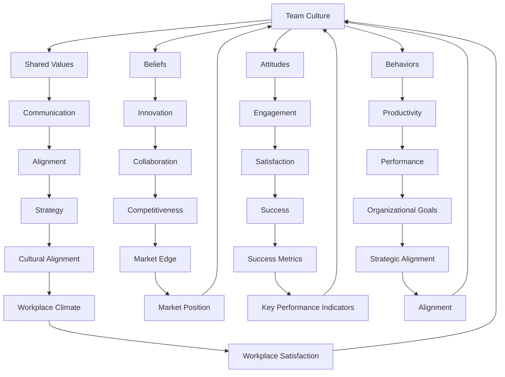

                 

## Introduction and Background

### Article Title: Team Culture: Building a Positive Work Environment

### Keywords:
- Team Culture
- Positive Work Environment
- Employee Engagement
- Leadership
- Organizational Performance

### Abstract:
This comprehensive guide explores the significance of team culture in shaping a positive work environment. It delves into core concepts and principles of team culture, essential strategies for building and maintaining a healthy culture, and the role of leaders in fostering an inclusive and engaging workplace. Through detailed analysis and practical insights, the article aims to provide actionable strategies for enhancing team performance and organizational success.

## Understanding Team Culture

### Chapter 1: Introduction to Team Culture

### 1.1 Problem Background

Team culture is a fundamental aspect of any organization. It refers to the shared values, beliefs, attitudes, and behaviors that shape the working environment and influence the way employees interact with one another. A strong team culture can lead to increased employee engagement, higher productivity, and improved organizational performance. However, understanding and nurturing a positive team culture can be challenging, especially in diverse and rapidly changing work environments.

### 1.2 Problem Description

The problem with team culture lies in its complexity and the lack of a clear framework for understanding and developing it. Organizations often struggle to define their team culture and communicate it effectively to employees. This can result in a lack of alignment, confusion, and even conflict within the team. Without a strong team culture, organizations may find it difficult to achieve their strategic goals and maintain a competitive edge in the market.

### 1.3 Problem Solution

The solution to this problem lies in developing a deep understanding of team culture, its core concepts, and principles. By defining and communicating the organization's values and beliefs, fostering open and transparent communication, and actively shaping the team's behavior, organizations can create a positive work environment that promotes collaboration, innovation, and employee satisfaction.

### 1.4 Boundaries and Extensions

While team culture is a critical component of organizational success, it is essential to recognize its boundaries. Team culture is not a monolithic concept but rather a collection of interrelated elements that interact and influence each other. It extends beyond the immediate team to encompass the broader organizational culture, employee engagement, and leadership practices.

### 1.5 Concept Structure and Core Elements Composition

To understand team culture, it is important to recognize its key components and how they interact with each other. The following diagram provides a visual representation of the concept structure and core elements of team culture:

In this diagram, we can see that team culture is composed of several interrelated elements, including shared values, beliefs, attitudes, and behaviors. These elements interact with each other to shape the overall team culture and influence key outcomes such as communication, innovation, engagement, productivity, alignment, collaboration, satisfaction, performance, strategy, competitiveness, success, and workplace climate.

### Summary

In summary, understanding team culture is crucial for building a positive work environment. By recognizing the core concepts and principles of team culture, organizations can develop effective strategies for fostering a culture of collaboration, innovation, and employee satisfaction. This, in turn, can lead to improved organizational performance and long-term success.

## Core Concepts and Principles

### Chapter 2: Understanding Team Culture

### 2.1 Definition and Characteristics of Team Culture

Team culture can be defined as the collective values, beliefs, attitudes, and behaviors that shape the working environment and influence the way employees interact with one another. It is the "personality" of the team and reflects the organization's values and beliefs. A strong team culture is characterized by the following key attributes:

- **Consistency:** The team's values and beliefs are consistently demonstrated in the day-to-day interactions and behaviors of its members.
- **Inclusivity:** The team culture is inclusive and embraces diversity, creating an environment where all employees feel valued and respected.
- **Alignment:** The team's values and beliefs are aligned with the organization's overall goals and strategic direction.
- **Transparency:** The team's communication is open, honest, and transparent, fostering trust and collaboration.
- **Respect:** Team members treat each other with respect, valuing their contributions and opinions.
- **Continuous Learning:** The team encourages continuous learning and personal growth, fostering a culture of innovation and improvement.

### 2.2 Importance of Team Culture

Team culture plays a crucial role in shaping the working environment and influencing employee behavior and performance. Here are some key reasons why team culture is important:

- **Employee Engagement:** A positive team culture fosters employee engagement, leading to higher job satisfaction and improved performance.
- **Organizational Performance:** A strong team culture aligns employees with the organization's goals, resulting in improved performance and increased productivity.
- **Retention:** A positive work environment and strong team culture can help reduce employee turnover, retaining top talent.
- **Innovation and Creativity:** A collaborative and inclusive team culture encourages innovation and creativity, fostering a culture of continuous improvement.
- **Workplace Satisfaction:** A positive team culture promotes a healthy work-life balance, leading to higher workplace satisfaction and well-being.

### 2.3 Basic Principles of Team Culture

To build a strong team culture, organizations should focus on the following basic principles:

- **Clarity:** Clearly define and communicate the team's values, beliefs, and expectations to ensure a shared understanding among all members.
- **Consistency:** Consistently demonstrate and reinforce the team's values and beliefs in all aspects of the working environment.
- **Inclusivity:** Embrace diversity and ensure that all team members feel valued and included.
- **Leadership:** Strong leadership is essential in shaping and maintaining a positive team culture. Leaders should set the example and actively promote the team's values and beliefs.
- **Communication:** Foster open and transparent communication to build trust and encourage collaboration.
- **Recognition:** Recognize and reward team members for their contributions and behaviors that align with the team's values and beliefs.
- **Feedback:** Provide regular feedback and opportunities for personal growth and development.
- **Flexibility:** Be willing to adapt and evolve the team culture as needed to respond to changing circumstances and new challenges.

### 2.4 Relationship Between Team Culture and Organizational Performance

The relationship between team culture and organizational performance is well-documented. A positive team culture can have a significant impact on key performance indicators such as:

- **Employee Engagement:** Higher employee engagement leads to increased productivity, job satisfaction, and retention.
- **Innovation:** A collaborative and inclusive team culture fosters innovation and creativity, driving continuous improvement and competitive advantage.
- **Customer Satisfaction:** A positive team culture can enhance customer satisfaction by promoting a high level of service and responsiveness.
- **Financial Performance:** Strong team culture has been shown to positively impact financial performance, with organizations with positive team cultures experiencing higher revenue growth and profitability.

### Summary

In summary, understanding the core concepts and principles of team culture is essential for building a positive work environment. By defining and communicating the team's values, fostering open and transparent communication, and actively shaping the team's behavior, organizations can create a culture that promotes collaboration, innovation, and employee satisfaction. This, in turn, can lead to improved organizational performance and long-term success.

## Building a Positive Culture

### Chapter 3: Key Elements for a Healthy Culture

### 3.1 Transparent Communication

Transparent communication is a cornerstone of a healthy team culture. It involves open, honest, and timely exchange of information among team members. Here are the key attributes and benefits of transparent communication:

- **Openness:** Encourages the free flow of ideas, suggestions, and feedback.
- **Honesty:** Fosters trust and builds strong relationships based on authenticity.
- **Timeliness:** Ensures that information is shared promptly, reducing misunderstandings and conflicts.
- **Two-way Communication:** Encourages active participation and engagement from all team members.

The benefits of transparent communication include:

- **Increased Collaboration:** When team members are informed and engaged, they are more likely to collaborate effectively and work towards common goals.
- **Better Decision-making:** Transparent communication ensures that decisions are made based on accurate and complete information, leading to better outcomes.
- **Improved Employee Engagement:** When employees feel included and informed, they are more engaged and motivated to contribute to the organization's success.

### 3.2 Trust Building

Trust is the foundation of a positive team culture. It involves confidence in the integrity, reliability, and competence of team members. Here are the key attributes and benefits of building trust:

- **Integrity:** Team members act ethically and consistently demonstrate honesty and fairness.
- **Reliability:** Team members can be counted on to deliver on their commitments and promises.
- **Competence:** Team members possess the skills, knowledge, and experience necessary to perform their roles effectively.

The benefits of building trust include:

- **Stronger Relationships:** Trust fosters positive relationships and encourages teamwork.
- **Increased Collaboration:** When team members trust each other, they are more willing to collaborate and share ideas.
- **Reduced Conflict:** Trust minimizes conflicts and misunderstandings, creating a more harmonious work environment.

### 3.3 Common Values

Common values are the shared beliefs and principles that guide the behavior and decision-making of team members. Here are the key attributes and benefits of having common values:

- **Clarity:** Common values provide a clear direction and purpose for the team.
- **Alignment:** They align individual goals with the overall organizational objectives.
- **Consistency:** Common values ensure that the team behaves in a consistent and predictable manner.
- **Inclusivity:** They embrace diversity and foster a sense of belonging among team members.

The benefits of having common values include:

- **Increased Collaboration:** When team members share common values, they are more likely to collaborate effectively and work towards shared goals.
- **Improved Decision-making:** Common values simplify decision-making by providing a clear framework for evaluating options.
- **Enhanced Performance:** A team with common values is more focused and motivated, leading to improved performance.

### 3.4 Reward and Recognition

Reward and recognition are powerful tools for building a positive team culture. They involve acknowledging and celebrating the achievements and contributions of team members. Here are the key attributes and benefits of reward and recognition:

- **Timely:** Recognition should be provided promptly to reinforce positive behavior.
- **Specific:** Rewards and recognition should be specific and tailored to the individual's achievements or contributions.
- **Equitable:** They should be distributed fairly and consistently to maintain trust and credibility.

The benefits of reward and recognition include:

- **Increased Motivation:** When team members are acknowledged and rewarded for their efforts, they are more motivated to perform at their best.
- **Enhanced Engagement:** Recognized employees feel valued and engaged, leading to higher job satisfaction and reduced turnover.
- **Positive Reinforcement:** Rewards and recognition reinforce positive behaviors and encourage employees to continue demonstrating them.

### 3.5 Personal Development and Growth

Personal development and growth are essential components of a positive team culture. They involve providing opportunities for team members to learn, develop their skills, and achieve their career goals. Here are the key attributes and benefits of personal development and growth:

- **Continuous Learning:** Encourages team members to seek new knowledge and skills to enhance their performance.
- **Skill Development:** Provides opportunities for team members to develop and improve their competencies.
- **Career Progression:** Supports team members in achieving their career goals and advancing within the organization.

The benefits of personal development and growth include:

- **Increased Engagement:** When team members feel that their personal growth is valued and supported, they are more engaged and motivated.
- **Improved Performance:** Skill development and continuous learning enhance individual and team performance.
- **Retention:** A culture that invests in personal development and growth helps retain top talent.

### Summary

Building a positive team culture requires a focus on key elements such as transparent communication, trust building, common values, reward and recognition, and personal development and growth. By fostering these elements, organizations can create a healthy work environment that promotes collaboration, innovation, and employee satisfaction. This, in turn, can lead to improved organizational performance and long-term success.

## Strategies for Change

### Chapter 4: Initiating Cultural Transformation

### 4.1 Cultural Assessment and Diagnosis

Before initiating a cultural transformation, it is crucial to conduct a thorough cultural assessment and diagnosis. This process involves identifying the current state of the team culture, understanding its strengths and weaknesses, and identifying areas for improvement. Here are the key steps in conducting a cultural assessment:

1. **Data Collection:** Gather data through various methods such as surveys, interviews, focus groups, and observational research.
2. **Data Analysis:** Analyze the collected data to identify patterns, trends, and areas of concern.
3. **Identify Strengths and Weaknesses:** Determine the organization's cultural strengths and weaknesses by comparing the current state with the desired state.
4. **Develop a Cultural Profile:** Create a comprehensive profile of the team culture, highlighting its key characteristics and areas for improvement.

### 4.2 Developing a Cultural Transformation Plan

Once the cultural assessment is complete, the next step is to develop a cultural transformation plan. This plan should outline the specific steps and actions required to move from the current state to the desired state. Here are the key components of a cultural transformation plan:

1. **Define the Vision:** Clearly articulate the desired team culture and the benefits it will bring to the organization.
2. **Set Objectives:** Establish specific, measurable, achievable, relevant, and time-bound (SMART) objectives for the cultural transformation.
3. **Develop Strategies:** Identify the strategies and actions that will be used to implement the cultural transformation.
4. **Assign Responsibilities:** Assign specific responsibilities to individuals or teams for executing the strategies and actions.
5. **Create a Timeline:** Develop a timeline for the cultural transformation, including key milestones and deadlines.
6. **Communicate the Plan:** Clearly communicate the cultural transformation plan to all team members, ensuring they understand their roles and responsibilities.

### 4.3 Cultivating Cultural Leaders

Leaders play a critical role in shaping and maintaining team culture. To initiate a cultural transformation, it is essential to cultivate cultural leaders who can champion the change and lead by example. Here are the key steps in cultivating cultural leaders:

1. **Identify Potential Leaders:** Identify individuals within the organization who possess the potential to become cultural leaders.
2. **Provide Training and Development:** Offer training and development programs to equip potential leaders with the skills and knowledge needed to shape and maintain the team culture.
3. **Empower Leaders:** Provide cultural leaders with the authority and resources needed to drive the cultural transformation.
4. **Foster Collaboration:** Encourage cultural leaders to collaborate and share best practices with each other.
5. **Recognize and Reward:** Recognize and reward cultural leaders for their contributions to the cultural transformation.

### 4.4 Enhancing Employee Engagement

Employee engagement is a key factor in successful cultural transformation. To enhance employee engagement, organizations should focus on:

1. **Involvement:** Involve employees in the cultural transformation process by seeking their input and feedback.
2. **Communication:** Maintain open and transparent communication channels to keep employees informed of progress and changes.
3. **Inclusion:** Ensure that all employees feel included and valued in the cultural transformation.
4. **Recognition:** Recognize and reward employees for their contributions to the cultural transformation.
5. **Feedback:** Provide regular feedback and opportunities for employees to voice their concerns and suggestions.

### 4.5 Overcoming Resistance to Change

Resistance to change is a common challenge in cultural transformation. To overcome resistance, organizations should:

1. **Communicate the Why:** Clearly communicate the reasons for the cultural transformation and its benefits to all team members.
2. **Involve Employees:** Involve employees in the planning and decision-making process to increase their buy-in and commitment.
3. **Provide Support:** Offer support and resources to help employees adapt to the changes.
4. **Address Concerns:** Listen to and address the concerns of employees, providing reassurance and guidance as needed.
5. **Lead by Example:** Leaders should lead by example, demonstrating the desired behaviors and attitudes.

### Summary

Initiating a cultural transformation requires a comprehensive approach that includes cultural assessment and diagnosis, developing a transformation plan, cultivating cultural leaders, enhancing employee engagement, and overcoming resistance to change. By following these strategies, organizations can successfully build a positive team culture that promotes collaboration, innovation, and employee satisfaction, ultimately leading to improved organizational performance and long-term success.

## Leadership Role in Shaping Culture

### Chapter 5: Leading by Example

### 5.1 Leadership Styles and Culture Shaping

Leadership styles play a crucial role in shaping the culture of a team or organization. Different leadership styles can have varying impacts on the development of a positive team culture. Here, we will explore the impact of transformational, democratic, and authoritarian leadership styles on team culture.

#### Transformational Leadership

Transformational leadership is characterized by leaders who inspire and motivate their team members to achieve their full potential. These leaders focus on personal growth, values, and ethical conduct. The key attributes of transformational leadership include:

- **Inspiration:** Transformational leaders inspire their team members to pursue higher goals and reach their full potential.
- **Motivation:** They motivate team members through a shared vision and by recognizing their contributions.
- **Development:** Transformational leaders invest in the personal and professional development of their team members.
- **Ethics and Values:** They embody and promote ethical behavior and values within the team.

The impact of transformational leadership on team culture is profound. It fosters a positive work environment where team members feel valued, motivated, and empowered. This culture promotes collaboration, innovation, and a strong sense of purpose.

#### Democratic Leadership

Democratic leadership involves sharing decision-making power with team members. This style encourages participation, collaboration, and open communication. The key attributes of democratic leadership include:

- **Participation:** Democratic leaders involve team members in decision-making processes, promoting a sense of ownership and commitment.
- **Communication:** They encourage open and honest communication, fostering trust and transparency.
- **Empowerment:** Democratic leaders empower team members, giving them the autonomy to make decisions and contribute to the team's success.

The impact of democratic leadership on team culture is the development of an inclusive and collaborative environment. This culture promotes a sense of belonging, trust, and respect among team members, leading to higher engagement and performance.

#### Authoritarian Leadership

Authoritarian leadership is characterized by leaders who make decisions without input from team members. These leaders focus on control and compliance. The key attributes of authoritarian leadership include:

- **Control:** Authoritarian leaders maintain strict control over their team members, enforcing rules and regulations.
- **Compliance:** They expect compliance from their team members, often emphasizing discipline and adherence to procedures.
- **Directive:** Authoritarian leaders are directive and may not encourage open communication or participation.

The impact of authoritarian leadership on team culture can be detrimental. It can create a culture of fear, compliance, and lack of innovation. This environment may stifle creativity and collaboration, leading to lower employee engagement and performance.

### 5.2 Communicating Values and Beliefs

Leaders play a critical role in communicating the values and beliefs that shape the team culture. By consistently demonstrating and promoting these values, leaders can influence the behavior and attitudes of their team members. Here are some strategies for communicating values and beliefs:

1. **Set Clear Expectations:** Clearly define the organization's values and communicate them to all team members. Ensure that these values are aligned with the organization's mission and vision.
2. **Lead by Example:** As a leader, consistently demonstrate the values you expect from your team members. Your actions will speak louder than words, and your behavior will set the tone for the team culture.
3. **Integrate Values into Daily Practices:** Embed the organization's values into daily practices and decision-making processes. This will help reinforce the importance of these values and ensure they are consistently upheld.
4. **Recognize and Reward Alignment:** Recognize and reward team members who consistently demonstrate the organization's values. This will encourage others to follow suit and reinforce the positive team culture.
5. **Foster Open Communication:** Encourage open and honest communication about values and beliefs. This will help address any misunderstandings or conflicts and ensure that everyone is on the same page.

### 5.3 The Power of Example

As the leader, your behavior sets the standard for the entire team. The concept of "leading by example" is crucial in shaping the team culture. When leaders embody the values and beliefs they expect from their team members, they create a positive example that others can follow. Here are some ways to lead by example:

1. **Honesty and Integrity:** Always act with honesty and integrity, demonstrating a commitment to ethical behavior.
2. **Communication:** Communicate openly and transparently, actively listening to team members and encouraging their input.
3. **Respect and Inclusion:** Treat all team members with respect and consideration, valuing their contributions and perspectives.
4. **Adaptability and Learning:** Embrace change and be open to learning and growth, demonstrating a willingness to adapt to new situations.
5. **Empathy and Support:** Show empathy and support for team members, recognizing their individual needs and challenges.

### 5.4 Handling Cultural Conflicts

Conflicts are inevitable in any team, and they can arise from differences in values, beliefs, or behaviors. As a leader, it is your responsibility to address and resolve these conflicts to maintain a positive team culture. Here are some strategies for handling cultural conflicts:

1. **Listen and Understand:** Listen actively to both sides of the conflict, seeking to understand the underlying issues and concerns.
2. **Facilitate Dialogue:** Encourage open and respectful dialogue between the conflicting parties, allowing them to express their views and find common ground.
3. **Mediate and Resolve:** Act as a mediator to help the parties involved reach a mutually acceptable resolution.
4. **Provide Guidance and Support:** Offer guidance and support to help the team members navigate the conflict and learn from the experience.
5. **Reaffirm Values and Beliefs:** Use the opportunity to reaffirm the organization's values and beliefs, emphasizing the importance of maintaining a positive team culture.

### Summary

Leaders play a critical role in shaping the team culture by communicating values and beliefs, leading by example, and addressing cultural conflicts. Through transformational, democratic, or authoritarian leadership styles, leaders can influence the behavior and attitudes of their team members. By consistently demonstrating the organization's values and addressing conflicts in a constructive manner, leaders can build a positive team culture that promotes collaboration, innovation, and employee satisfaction. This culture, in turn, can drive organizational success and long-term growth.

## Employee Engagement and Inclusion

### Chapter 6: Promoting Diversity and Inclusion in Team Culture

### 6.1 The Importance of Diversity

Diversity in the workplace is crucial for fostering innovation, creativity, and problem-solving. A diverse team brings together individuals with different backgrounds, perspectives, and experiences. This diversity of thought and approach can lead to more innovative solutions and a better understanding of the needs and preferences of diverse customer segments. Here are the key benefits of diversity:

1. **Innovation and Creativity:** A diverse team is more likely to generate innovative ideas and approaches by leveraging the unique perspectives and experiences of its members.
2. **Improved Decision-making:** Diverse teams can make better decisions by considering a broader range of perspectives and insights.
3. **Increased Market Understanding:** A diverse team can better understand and cater to the needs of a diverse customer base, leading to improved customer satisfaction and loyalty.
4. **Enhanced Problem-solving:** Diverse teams are more effective at identifying and addressing complex problems by leveraging their collective knowledge and expertise.

### 6.2 Inclusion: A Key Ingredient for Success

While diversity brings a wealth of perspectives and ideas, inclusion ensures that all team members feel valued, respected, and empowered to contribute their best. Inclusion is about creating an environment where everyone has the opportunity to thrive and where diverse perspectives are genuinely welcomed and integrated. Here are the key aspects of inclusion:

1. **Valued Contributions:** Inclusive teams ensure that all members feel their contributions are valued and acknowledged.
2. **Equitable Opportunities:** Inclusive teams provide equal opportunities for growth, development, and advancement to all members, regardless of their background or identity.
3. **Open Communication:** Inclusion fosters open and respectful communication, where all team members feel comfortable sharing their ideas and concerns.
4. **Supportive Environment:** An inclusive environment provides support to all members, helping them navigate challenges and thrive in their roles.

### 6.3 Strategies for Promoting Diversity and Inclusion

To promote diversity and inclusion in team culture, organizations can adopt several strategies. Here are some practical steps:

1. **Recruitment and Hiring:** Implement inclusive recruitment practices that attract a diverse pool of candidates. This can include using diverse sourcing channels, advertising job openings broadly, and using diverse interview panels.
2. **Training and Education:** Provide diversity and inclusion training for all employees. This training can help raise awareness of diversity issues and promote a culture of respect and inclusivity.
3. **Leadership Support:** Ensure that leaders actively champion diversity and inclusion by setting an example and holding others accountable.
4. **Flexible Work Policies:** Offer flexible work arrangements, such as remote work, flexible hours, and job sharing, to accommodate the diverse needs of employees.
5. **Inclusive Language:** Use inclusive language in communications and meetings to ensure that all team members feel respected and included.
6. **Mentorship and Sponsorship Programs:** Implement mentorship and sponsorship programs to support the development and advancement of diverse employees.
7. **Employee Resource Groups (ERGs):** Establish ERGs to provide a platform for employees to connect, support each other, and contribute to the organization's diversity and inclusion initiatives.

### 6.4 Measuring and Enhancing Employee Engagement and Inclusion

Measuring employee engagement and inclusion is essential to understand the effectiveness of diversity and inclusion initiatives. Here are some metrics and strategies for measuring and enhancing these aspects:

1. **Engagement Surveys:** Conduct regular employee engagement surveys to gauge the level of engagement and identify areas for improvement.
2. **Inclusion Index:** Develop an inclusion index that measures the extent to which employees feel included and valued in the workplace.
3. **Diversity Metrics:** Track diversity metrics, such as the representation of diverse groups at all levels of the organization, to monitor progress over time.
4. **Employee Feedback:** Regularly collect employee feedback through surveys, focus groups, and one-on-one discussions to gain insights into their experiences and suggestions for improvement.
5. **Continuous Improvement:** Use the data and feedback to continuously improve diversity and inclusion initiatives, ensuring that they align with the organization's goals and values.

### Summary

Promoting diversity and inclusion is crucial for building a positive team culture that fosters engagement, innovation, and organizational success. By adopting strategies for recruitment, training, leadership support, and measuring engagement, organizations can create an inclusive environment where all employees feel valued and empowered to contribute their best. This, in turn, can lead to improved employee satisfaction, retention, and overall organizational performance.

## Culture and Performance

### Chapter 7: Measuring and Enhancing Team Performance

### 7.1 The Impact of Culture on Performance

The culture of a team or organization has a profound impact on its performance. A positive team culture can enhance individual and team performance, leading to improved organizational outcomes. Conversely, a negative or toxic culture can hinder performance and create challenges for the organization. Here's how culture influences performance:

1. **Engagement:** A positive team culture fosters high levels of employee engagement, which is closely linked to performance. Engaged employees are more motivated, committed, and productive.
2. **Collaboration:** A culture that encourages collaboration and teamwork can lead to better problem-solving, innovation, and decision-making. Collaborative teams are often more effective and efficient.
3. **Resilience:** A positive culture can enhance the resilience of the team, helping them navigate challenges and setbacks more effectively. Resilient teams are more likely to recover from failures and continue to perform well.
4. **Communication:** Effective communication is a cornerstone of a positive team culture. Clear and open communication helps prevent misunderstandings and conflicts, ensuring that everyone is aligned and working towards common goals.
5. **Employee Well-being:** A positive culture that values employee well-being can improve job satisfaction, reduce stress, and enhance overall health and productivity.

### 7.2 Measuring Team Performance

To effectively measure team performance, organizations should use a combination of quantitative and qualitative metrics. Here are some key metrics to consider:

1. **Key Performance Indicators (KPIs):** KPIs are specific, measurable metrics that reflect the team's performance in achieving its goals. Examples include sales revenue, customer satisfaction scores, and project completion rates.
2. **Productivity Metrics:** Productivity metrics measure how efficiently the team is working. Examples include the number of tasks completed per day, the time it takes to complete tasks, and the cost of goods sold.
3. **Employee Engagement Scores:** Employee engagement scores provide insight into the level of commitment, motivation, and satisfaction among team members. Surveys and assessments can help gauge engagement levels.
4. **Quality Metrics:** Quality metrics measure the quality of the team's work, such as defect rates, error rates, and customer complaints.
5. **Feedback and Surveys:** Regular feedback and surveys can provide qualitative insights into the team's performance and areas for improvement.

### 7.3 Enhancing Team Performance

To enhance team performance, organizations should focus on fostering a positive team culture and implementing strategies that support continuous improvement. Here are some key strategies:

1. **Clear Goals and Expectations:** Ensure that team members have a clear understanding of their goals and expectations. This helps align their efforts and encourages accountability.
2. **Training and Development:** Invest in training and development programs to help team members build the skills and knowledge they need to perform effectively. This can include technical training, leadership development, and soft skills training.
3. **Effective Communication:** Foster open and transparent communication within the team. This helps prevent misunderstandings, promotes collaboration, and ensures that everyone is aligned and working towards common goals.
4. **Performance Feedback:** Provide regular and constructive feedback to help team members understand their strengths and areas for improvement. This feedback should be specific, actionable, and focused on development.
5. **Incentives and Recognition:** Use incentives and recognition programs to reward and motivate team members for their contributions and achievements. This can include financial rewards, public recognition, and opportunities for career growth.
6. **Team Building Activities:** Organize team-building activities and events to help team members build strong relationships and improve collaboration. These activities can include team retreats, workshops, and social events.
7. **Continuous Improvement:** Encourage a culture of continuous improvement by regularly reviewing and evaluating team performance. This can help identify areas for improvement and ensure that the team is always striving to get better.

### Summary

The relationship between team culture and performance is clear: a positive team culture can enhance performance, while a negative culture can hinder it. By measuring performance using a combination of quantitative and qualitative metrics and implementing strategies to foster a positive culture, organizations can improve team performance and achieve their goals. A strong team culture that promotes engagement, collaboration, and continuous improvement is key to long-term success.

## Case Studies and Best Practices

### Chapter 8: Practical Insights from Successful Teams

### 8.1 Case Study 1: Google's Culture of Innovation

Google has become a poster child for successful team culture. Their focus on innovation, collaboration, and employee well-being has led to remarkable success and a highly respected brand. Here are some key insights from Google's approach:

- **Innovation Culture:** Google encourages a culture of innovation by providing employees with the freedom to experiment and explore new ideas. This is reflected in their famous "20% time" policy, which allows employees to spend 20% of their work time on personal projects.
- **Employee Development:** Google invests heavily in employee development through training, workshops, and conferences. They also offer mentorship programs to help employees grow professionally.
- **Work-Life Balance:** Google emphasizes work-life balance by offering flexible work arrangements, on-site fitness centers, and wellness programs.
- **Transparent Communication:** Google has a culture of open communication, where employees are encouraged to share ideas, feedback, and suggestions. This transparency helps maintain a sense of trust and collaboration.

### 8.2 Case Study 2: Zappos' Customer-Centric Culture

Zappos, the online shoe and clothing retailer, is known for its exceptional customer service and employee-centric culture. Here are some key insights from Zappos' approach:

- **Customer Service Excellence:** Zappos places a high emphasis on customer service, going above and beyond to ensure customer satisfaction. Their customer service team is empowered to make decisions and resolve issues swiftly.
- **Employee Culture:** Zappos focuses on building a positive and inclusive employee culture. They have a unique hiring process that ensures new employees align with the company's core values.
- **Employee Benefits:** Zappos offers attractive benefits, including unlimited paid time off, stock options, and profit-sharing. These benefits are designed to attract and retain top talent.
- **Continuous Improvement:** Zappos encourages a culture of continuous improvement, where employees are encouraged to identify and implement ways to enhance the customer experience and internal processes.

### 8.3 Case Study 3: Patagonia's Sustainability Culture

Patagonia, an outdoor clothing and gear company, is recognized for its commitment to sustainability and ethical business practices. Here are some key insights from Patagonia's approach:

- **Sustainability Focus:** Patagonia has made sustainability a core part of its business model, from using recycled materials to reducing carbon emissions. They also support environmental initiatives and promote sustainable living.
- **Ethical Practices:** Patagonia emphasizes ethical practices in all aspects of its business, from supply chain management to employee treatment. They prioritize ethical sourcing and fair labor practices.
- **Employee Engagement:** Patagonia fosters a culture of employee engagement by promoting a sense of purpose and shared values. Employees are encouraged to contribute to environmental and social initiatives.
- **透明沟通:** Patagonia maintains transparent communication with its employees and customers, sharing its sustainability goals and progress. This transparency helps build trust and credibility.

### 8.4 Best Practices for Building a Positive Team Culture

Based on the insights from these case studies, here are some best practices for building a positive team culture:

1. **Encourage Innovation:** Provide employees with the freedom to explore new ideas and experiment with innovative approaches.
2. **Invest in Employee Development:** Offer training, mentorship, and career development opportunities to help employees grow professionally and personally.
3. **Foster a Positive Work-Life Balance:** Support employees in achieving a healthy work-life balance through flexible work arrangements and benefits.
4. **Emphasize Customer or Stakeholder Focus:** Prioritize the needs and satisfaction of customers or other stakeholders to create a culture of service excellence.
5. **Promote Ethical Practices:** Encourage ethical behavior and practices throughout the organization, from leadership to frontline employees.
6. **Maintain Open Communication:** Foster a culture of open and transparent communication to build trust and collaboration.
7. **Recognize and Reward Contributions:** Recognize and reward employees for their contributions and achievements to foster a positive and motivating work environment.

### Summary

By learning from successful teams like Google, Zappos, and Patagonia, organizations can gain valuable insights into building a positive team culture. These case studies highlight the importance of innovation, employee development, work-life balance, customer focus, ethical practices, open communication, and recognition. By adopting these best practices, organizations can create a culture that promotes engagement, collaboration, and long-term success.

## Overcoming Challenges

### Chapter 9: Handling Cultural Difficulties

### 9.1 Identifying and Addressing Cultural Issues

Building a positive team culture is not without its challenges. Organizations may encounter various cultural difficulties that can hinder progress. Identifying and addressing these issues is crucial for maintaining a healthy team environment. Here are some common cultural difficulties and strategies for overcoming them:

#### 9.1.1 Lack of Clarity

A lack of clarity in the organization's values, goals, and expectations can lead to confusion and misalignment among team members. To address this issue:

- **Clarify Values and Goals:** Clearly define the organization's values, vision, and mission. Communicate these to all team members, ensuring a shared understanding.
- **Establish Clear Expectations:** Set clear expectations for behavior, performance, and communication. Provide guidelines and resources to help team members meet these expectations.
- **Regular Check-ins:** Conduct regular team meetings or check-ins to discuss progress, address concerns, and ensure alignment.

#### 9.1.2 Communication Barriers

Communication barriers, such as language differences or lack of transparency, can impede effective collaboration. To overcome this challenge:

- **Promote Inclusive Communication:** Encourage open and respectful communication. Use inclusive language and be mindful of cultural differences when communicating with team members.
- **Utilize Technology:** Leverage communication tools and platforms to facilitate communication, especially in remote or distributed teams.
- **Provide Training:** Offer communication skills training to help team members develop effective communication strategies.

#### 9.1.3 Resistance to Change

Resistance to change can be a significant obstacle in cultural transformation. To address resistance:

- **Communicate the Why:** Clearly explain the reasons behind the change and the benefits it will bring to the organization and individual team members.
- **Involve Employees:** Involve team members in the change process by seeking their input and feedback. This can help increase their buy-in and commitment to the change.
- **Provide Support:** Offer support and resources to help team members navigate the change. This may include training, coaching, and mentoring.

#### 9.1.4 Cultural Conflict

Cultural conflict can arise from differences in values, beliefs, or communication styles. To handle cultural conflict:

- **Active Listening:** Listen actively to both parties involved in the conflict. Understand their perspectives and concerns.
- **Mediation:** Act as a mediator to help the conflicting parties find a mutually acceptable resolution.
- **Reaffirm Values and Beliefs:** Use the opportunity to reaffirm the organization's values and beliefs, emphasizing the importance of maintaining a positive culture.

### 9.2 Building Resilience and Adaptability

In addition to addressing specific cultural difficulties, it's important for teams to build resilience and adaptability. Here are some strategies for fostering resilience and adaptability:

- **Continuous Learning:** Encourage a culture of continuous learning and personal growth. Provide opportunities for team members to develop new skills and stay updated on industry trends.
- **Flexibility:** Be open to adapting plans and approaches as needed. This can help the team navigate changes and challenges more effectively.
- **Emotional Intelligence:** Develop emotional intelligence skills to help team members better understand and manage their emotions, as well as those of others.
- **Team Building:** Engage in team-building activities and exercises that promote trust, collaboration, and communication.

### 9.3 Monitoring and Evaluating Progress

To ensure that cultural initiatives are effective, it's important to monitor and evaluate progress regularly. Here are some steps for monitoring and evaluating cultural improvements:

- **Set Metrics:** Define key performance indicators (KPIs) to measure the success of cultural initiatives. These could include metrics such as employee engagement scores, turnover rates, and customer satisfaction.
- **Collect Data:** Regularly collect data on the selected KPIs to assess progress.
- **Review and Adjust:** Review the data and assess whether the cultural initiatives are achieving the desired outcomes. Make adjustments as needed to improve effectiveness.
- **Seek Feedback:** Seek feedback from team members on the effectiveness of cultural initiatives. Use this feedback to make improvements and address any concerns.

### Summary

Building a positive team culture requires addressing cultural difficulties and fostering resilience and adaptability. By clearly defining values, improving communication, involving employees in change processes, and handling conflicts constructively, organizations can create a healthy and thriving team environment. Regular monitoring and evaluation of cultural initiatives can help ensure ongoing success and continuous improvement.

## Continuous Improvement

### Chapter 10: Sustaining and Evolving Team Culture

### 10.1 The Importance of Continuous Improvement

Maintaining a positive team culture is an ongoing process that requires continuous effort and adaptation. As the organization and its environment evolve, the team culture must also change to remain relevant and effective. Continuous improvement is essential for sustaining and evolving team culture. Here's why it's important:

1. **Adapting to Change:** Continuous improvement allows teams to adapt to changes in the market, technology, and organizational strategies.
2. **Enhancing Performance:** Regularly assessing and refining team culture helps improve performance and achieve organizational goals more effectively.
3. **Promoting Innovation:** A culture of continuous improvement fosters innovation and creativity by encouraging team members to explore new ideas and approaches.
4. **Engaging Employees:** By continuously seeking feedback and involving employees in the improvement process, organizations can enhance employee engagement and satisfaction.
5. **Building Resilience:** Continuous improvement helps build resilience and adaptability, enabling teams to navigate challenges and setbacks more effectively.

### 10.2 Strategies for Sustaining and Evolving Team Culture

To sustain and evolve team culture, organizations should adopt a proactive approach and implement strategies that foster continuous improvement. Here are some key strategies:

1. **Regular Assessments:** Conduct regular assessments of the team culture to identify areas for improvement. This can involve surveys, interviews, and focus groups to gather feedback from team members.
2. **Establish Metrics:** Define key performance indicators (KPIs) to measure the success of cultural initiatives and track progress over time. Examples of KPIs include employee engagement scores, turnover rates, and customer satisfaction.
3. **Seek Employee Feedback:** Continuously seek feedback from employees to understand their perspectives, concerns, and suggestions for improvement. This feedback can be collected through surveys, one-on-one discussions, and team meetings.
4. **Incorporate Feedback into Decision-Making:** Use employee feedback to inform decision-making and make data-driven improvements to the team culture. Ensure that employees see the impact of their input and feel valued.
5. **Develop and Implement Action Plans:** Create action plans based on the feedback and assessment results. Assign responsibilities to team members or cross-functional teams to implement the action plans and monitor progress.
6. **Provide Training and Support:** Offer training and support to help team members develop the skills and knowledge needed to sustain and evolve the team culture. This can include workshops, seminars, and coaching sessions.
7. **Celebrate Successes:** Recognize and celebrate successes and milestones achieved through continuous improvement initiatives. This helps maintain momentum and motivation for ongoing efforts.

### 10.3 Fostering a Culture of Continuous Improvement

Fostering a culture of continuous improvement requires commitment from leadership and active participation from all team members. Here are some strategies for fostering such a culture:

1. **Leadership Support:** Leaders should demonstrate their commitment to continuous improvement by setting an example and actively participating in initiatives. They should also communicate the importance of continuous improvement and provide the necessary resources and support.
2. **Encourage Innovation:** Encourage team members to think creatively and take calculated risks. Create a safe environment where it's okay to fail and learn from mistakes.
3. **Promote Collaboration:** Foster collaboration and knowledge-sharing among team members. Encourage the exchange of ideas, perspectives, and best practices.
4. **Recognize and Reward Contributions:** Recognize and reward team members who contribute to continuous improvement initiatives. This can include public recognition, incentives, and opportunities for career growth.
5. **Create a Vision for the Future:** Develop a clear vision for the future and communicate it to team members. This vision should outline the desired cultural outcomes and the steps needed to achieve them.
6. **Celebrate Milestones:** Celebrate milestones and progress achieved through continuous improvement initiatives. This helps maintain momentum and motivation.

### Summary

Sustaining and evolving team culture requires a commitment to continuous improvement. By regularly assessing the team culture, seeking feedback, incorporating feedback into decision-making, and fostering a culture of innovation and collaboration, organizations can maintain a positive and thriving team environment. Continuous improvement is key to adapting to change, enhancing performance, and achieving long-term success.

## Conclusion and Future Directions

### Chapter 11: Reflections and Perspectives on Team Culture

### 11.1 Recap of Key Insights

In this comprehensive guide, we have explored the importance of team culture in shaping a positive work environment. We discussed the core concepts and principles of team culture, the key elements required to build a healthy culture, and the strategies for initiating cultural transformation. We also examined the role of leadership in shaping culture, the significance of employee engagement and inclusion, and the impact of culture on team performance. Through practical insights from successful case studies, we learned about best practices for building a positive team culture and overcoming challenges along the way.

### 11.2 Future Directions

As we look to the future, several key areas merit further attention in the context of team culture:

1. **Technology Integration:** The integration of emerging technologies, such as artificial intelligence and automation, will continue to shape the work environment. Organizations must consider how these technologies can be used to enhance team culture and employee experience.
2. **Globalization and Diversity:** With the increasing globalization of the workforce, organizations will need to navigate cultural differences and foster inclusive environments that embrace diversity. This will require a deeper understanding of cultural dynamics and effective strategies for managing a diverse workforce.
3. **Well-being and Mental Health:** The importance of employee well-being and mental health will continue to grow. Organizations must prioritize the well-being of their employees and provide support for mental health challenges to maintain a positive team culture.
4. **Sustainability and Social Responsibility:** As societal expectations for corporate responsibility increase, organizations will need to integrate sustainability and social responsibility into their team culture. This includes promoting ethical practices, reducing environmental impact, and contributing to social causes.
5. **Continuous Learning and Development:** The pace of technological and industry change will require organizations to invest in continuous learning and development for their employees. This will involve creating learning cultures that encourage skill-building and personal growth.

### 11.3 Conclusion

In conclusion, team culture is a critical factor in the success of any organization. A positive team culture can enhance employee engagement, promote collaboration, and drive performance. By understanding the core concepts and principles of team culture, adopting best practices, and addressing challenges proactively, organizations can build a thriving team environment that fosters innovation, growth, and long-term success. As we navigate the future, it is essential to remain adaptable and focused on fostering a positive team culture that aligns with the evolving needs of employees and the organization.

