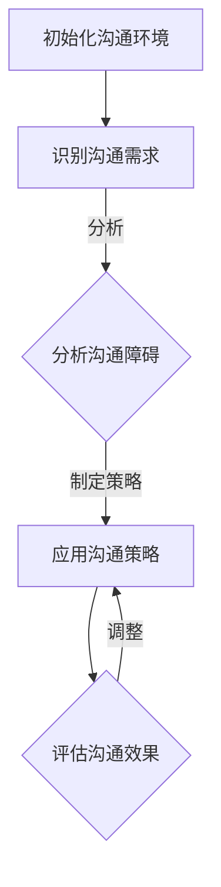
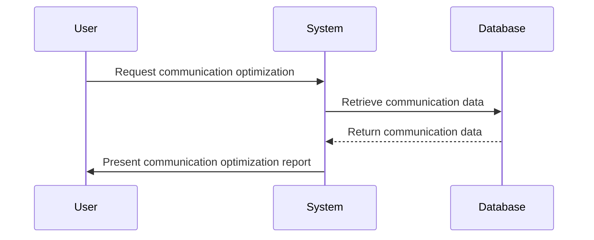
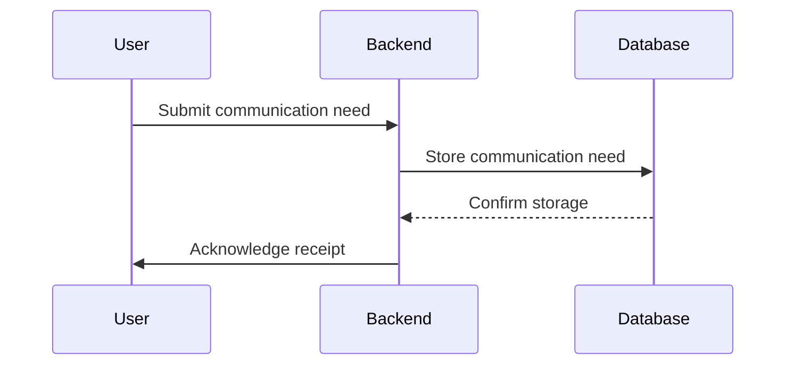

                 

# 团队沟通优化：消除沟通障碍的有效方法

> 关键词：团队沟通、沟通障碍、有效方法、沟通优化

> 摘要：本文将探讨团队沟通中的障碍及其解决方法。通过分析沟通的基本原理和策略，结合实际案例，本文旨在为IT团队提供一套消除沟通障碍、实现高效沟通的实用指南。

## 1. 书籍概述（背景介绍）

### 1.1 书名与核心概念

本书名为《团队沟通优化：消除沟通障碍的有效方法》，聚焦于团队沟通中的问题与解决策略。核心概念包括团队沟通、沟通障碍、以及优化沟通的方法。现代团队工作中的高效沟通是团队成功的关键因素之一，本书旨在通过理论和实践相结合的方式，为团队领导者和技术人员提供一套切实可行的沟通优化方案。

### 1.2 问题背景

在IT行业，团队沟通的效率直接影响项目进度和团队士气。常见的沟通问题包括误解、信息丢失、时间浪费等。这些问题不仅导致项目延期，还可能影响团队间的信任和合作关系。因此，解决沟通障碍成为提高团队效率的关键。

### 1.3 问题描述

团队沟通障碍的主要表现如下：

- **误解**：由于信息传递的不准确或理解的不同，团队成员之间的意见可能出现分歧。
- **信息丢失**：在复杂的协作环境中，关键信息可能未能传递到相关成员，导致决策失误。
- **时间浪费**：无效的沟通往往导致时间浪费，降低了团队的工作效率。

### 1.4 问题解决

本书提出了以下解决方案：

- **识别障碍**：通过分析沟通中的问题，识别误解、信息丢失和浪费时间的原因。
- **优化方法**：介绍一系列沟通技巧和实践策略，帮助团队有效解决沟通障碍。
- **实践应用**：通过实际案例和项目实战，验证沟通优化策略的有效性。

### 1.5 边界与外延

沟通方法的应用范围广泛，适用于各类IT团队，包括软件开发、数据分析、系统集成等。同时，本文也探讨了一些通用原则，帮助团队在不同情境下优化沟通。

### 1.6 概念结构与核心要素

团队沟通优化的概念结构包括：

- **沟通的四大要素**：信息源、信息传递、信息接收、反馈。
- **沟通的四大原则**：明确性、一致性、及时性、适应性。
- **沟通的五个步骤**：准备、发送、传递、接收、反馈。

这些核心要素为沟通优化提供了理论框架和实践指导。

## 2. 核心概念与联系

### 2.1 沟通概念原理

团队沟通是信息在团队成员间传递和交流的过程。它不仅涉及信息的传递，还包括理解、解释和应用。有效的团队沟通对于团队目标的实现至关重要。

沟通的类型包括：

- **正式沟通**：通过正式的渠道进行的信息传递，如会议、邮件等。
- **非正式沟通**：通过非正式的渠道进行的信息传递，如闲聊、社交媒体等。

沟通的目标是确保信息的准确性和及时性，从而支持团队的协作和决策。

### 2.2 概念属性特征对比表格

| 特征           | 正式沟通                       | 非正式沟通                     |
|----------------|-------------------------------|-------------------------------|
| 途径           | 书面文件、会议等               | 日常对话、社交网络等           |
| 目标           | 明确、权威、记录               | 亲密、轻松、快速反馈           |
| 信息传递速度   | 较慢，需时间审核               | 较快，即时性高                 |
| 信息完整性     | 高，有正式格式和审核机制       | 低，可能存在误解和省略         |

### 2.3 ER实体关系图架构

```mermaid
erDiagram
  User ||--|{ Message }|--| Team
  Team ||--|{ Meeting }|--| User
  Message ||--|{ Feedback }|--| User
  Meeting ||--|{ Agenda }|--| User
```

在这个ER图中，用户（User）是信息源和接收者，团队（Team）是沟通的载体，消息（Message）、会议（Meeting）和反馈（Feedback）则是沟通的具体形式。这个图展示了沟通过程中的主要实体及其关系。

## 3. 算法原理讲解

### 3.1 算法 Mermaid 流程图



### 3.2 Python 源代码

```python
# Python 代码示例：团队沟通障碍识别与解决

def initialize_communication():
    # 初始化沟通环境
    print("初始化沟通环境：设置沟通渠道、明确沟通目标")

def identify_communication_needs():
    # 识别沟通需求
    print("识别沟通需求：了解团队成员的需求和期望")

def analyze_communication_barriers():
    # 分析沟通障碍
    print("分析沟通障碍：识别误解、信息丢失和时间浪费")

def apply_communication_strategies():
    # 应用沟通策略
    print("应用沟通策略：使用主动倾听、明确表达等方法")

def evaluate_communication_effects():
    # 评估沟通效果
    print("评估沟通效果：收集反馈，评估沟通策略的有效性")

def adjust_communication():
    # 调整沟通策略
    print("调整沟通策略：根据评估结果进行改进")

# 执行流程
initialize_communication()
identify_communication_needs()
analyze_communication_barriers()
apply_communication_strategies()
evaluate_communication_effects()
adjust_communication()
```

### 3.3 数学模型和公式

为了更好地理解沟通优化，我们可以使用以下数学模型：

$$
\text{沟通效率} = \frac{\text{有效沟通时间}}{\text{总沟通时间}}
$$

$$
\text{沟通满意度} = \frac{\text{沟通目标达成度}}{\text{沟通目标总数}}
$$

这两个指标可以用来评估沟通的效果，并通过调整沟通策略来优化沟通效率。

### 3.4 详细讲解与举例说明

#### 沟通障碍识别

- **误解**：通过询问团队成员对某项任务的看法，可以发现他们对任务的误解。
  - 举例：团队领导询问团队成员对项目进度的看法，发现其中一位成员对任务的理解与团队目标不一致。

- **信息丢失**：通过检查信息传递的环节，可以发现信息丢失的情况。
  - 举例：团队领导检查项目会议记录，发现关键信息未传达给所有成员。

- **时间浪费**：通过监控沟通的时间分配，可以发现时间浪费的问题。
  - 举例：团队领导发现团队在无意义的闲聊上花费了过多时间。

#### 沟通策略应用

- **主动倾听**：通过积极倾听，确保团队成员的意见被充分理解。
  - 举例：在会议中，领导鼓励每位成员发表意见，并给予足够的倾听时间。

- **明确表达**：通过清晰、简洁的表达，确保信息的准确性。
  - 举例：在撰写项目报告时，领导使用简洁明了的语言描述关键信息。

- **避免假设**：通过避免假设，减少误解和信息丢失。
  - 举例：在分配任务时，领导明确说明任务的期望结果，避免成员的假设。

- **保持开放心态**：通过开放心态，促进团队成员之间的沟通。
  - 举例：领导鼓励团队成员提出不同观点，并在讨论中给予支持。

通过以上方法和策略，团队可以有效地识别和解决沟通障碍，提高沟通效率。

## 4. 系统分析与架构设计方案

### 4.1 问题场景介绍

在大型IT项目中，团队成员分布在不同的地理位置，通过多种沟通渠道进行协作。然而，由于沟通障碍的存在，项目进度常常受到影响。为了优化团队沟通，我们需要设计一个系统，帮助团队识别和解决沟通障碍。

### 4.2 项目介绍

项目名称：团队沟通优化系统

项目目标：通过自动化工具和流程，优化团队沟通，提高项目效率。

项目成员：项目经理、技术负责人、开发人员、测试人员、产品经理等。

### 4.3 系统功能设计

系统功能设计主要包括以下几个方面：

- **沟通需求识别**：自动收集团队成员的沟通需求和期望。
- **沟通障碍分析**：分析沟通中的障碍，如误解、信息丢失、时间浪费等。
- **沟通策略应用**：应用沟通优化策略，如主动倾听、明确表达等。
- **沟通效果评估**：评估沟通策略的效果，并根据反馈进行调整。

#### 领域模型 Mermaid 类图

```mermaid
classDiagram
    Class01 <|-- Class02
    Class03 <|-- Class02
    Class04 <|-- Class01
    Class05 <|-- Class01
    Class01 <|-- Class06
    Class01 {
        +String name
        +String role
        +void communicate()
    }
    Class02 {
        +String issue
        +String solution
        +void analyze()
    }
    Class03 {
        +String barrier
        +void identify()
    }
    Class04 {
        +String strategy
        +void apply()
    }
    Class05 {
        +String evaluation
        +void evaluate()
    }
    Class06 {
        +void adjust()
    }
```

### 4.4 系统架构设计

系统架构设计采用分层架构，包括数据层、服务层、表示层等。

#### Mermaid 架构图



### 4.5 系统接口设计

系统接口设计包括API接口和Web界面。

#### API接口设计

- **GET /communication/needs**：获取团队成员的沟通需求。
- **POST /communication/issue**：提交沟通障碍报告。
- **GET /communication/evaluation**：获取沟通效果评估结果。

#### Web界面设计

Web界面设计包括需求收集表单、沟通障碍报告表单和沟通效果评估表单。

### 4.6 系统交互

系统交互设计通过Mermaid序列图展示。

#### Mermaid 序列图



通过以上系统架构设计，团队可以更加有效地管理和优化沟通，提高项目效率。

## 5. 项目实战

### 5.1 环境安装

为了搭建团队沟通优化系统，首先需要安装以下软件和工具：

- Python 3.8及以上版本
- Flask 框架
- SQLAlchemy 数据库管理工具
- Mermaid 插件

安装步骤如下：

1. 安装Python和pip：

   ```
   sudo apt-get update
   sudo apt-get install python3 python3-pip
   ```

2. 安装Flask和SQLAlchemy：

   ```
   pip3 install flask sqlalchemy
   ```

3. 安装Mermaid插件：

   ```
   pip3 install mermaid-python
   ```

### 5.2 系统核心实现源代码

以下是系统核心实现的部分源代码：

```python
# app.py：Flask应用程序

from flask import Flask, request, jsonify
from sqlalchemy import create_engine
from mermaid import Mermaid

app = Flask(__name__)
engine = create_engine('sqlite:///communication.db')

# 初始化数据库
@app.before_first_request
def initialize_database():
    with app.app_context():
        # 创建数据库表
        # ...

# 通信需求识别
@app.route('/communication/needs', methods=['GET'])
def get_communication_needs():
    # 从数据库获取需求
    # ...
    return jsonify(communication_needs)

# 沟通障碍报告
@app.route('/communication/issue', methods=['POST'])
def report_communication_issue():
    # 处理报告
    # ...
    return jsonify(response)

# 沟通效果评估
@app.route('/communication/evaluation', methods=['GET'])
def get_communication_evaluation():
    # 获取评估结果
    # ...
    return jsonify(evaluation_results)

if __name__ == '__main__':
    app.run(debug=True)
```

### 5.3 代码应用解读与分析

#### 5.3.1 通信需求识别

`get_communication_needs`函数负责从数据库中获取团队成员的沟通需求。通过查询数据库表，获取需求信息，并将其转换为JSON格式返回。

```python
@app.route('/communication/needs', methods=['GET'])
def get_communication_needs():
    # 从数据库获取需求
    with engine.connect() as connection:
        result = connection.execute("SELECT * FROM communication_needs;")
        communication_needs = [dict(row) for row in result]
    return jsonify(communication_needs)
```

#### 5.3.2 沟通障碍报告

`report_communication_issue`函数处理团队成员提交的沟通障碍报告。首先，从请求中提取报告信息，然后将其存储到数据库中。

```python
@app.route('/communication/issue', methods=['POST'])
def report_communication_issue():
    # 处理报告
    report_data = request.get_json()
    with engine.connect() as connection:
        connection.execute("INSERT INTO communication_issues (issue, solution) VALUES (:issue, :solution)", report_data)
    return jsonify({"status": "success", "message": "Report submitted."})
```

#### 5.3.3 沟通效果评估

`get_communication_evaluation`函数负责获取沟通效果的评估结果。从数据库中查询评估数据，并返回给用户。

```python
@app.route('/communication/evaluation', methods=['GET'])
def get_communication_evaluation():
    # 获取评估结果
    with engine.connect() as connection:
        result = connection.execute("SELECT * FROM communication_evaluation;")
        evaluation_results = [dict(row) for row in result]
    return jsonify(evaluation_results)
```

通过以上代码实现，团队可以有效地识别和解决沟通障碍，从而优化团队沟通。

### 5.4 实际案例分析和详细讲解剖析

#### 5.4.1 案例背景

某IT公司开发一个大型项目，团队成员分布在不同的城市。由于沟通不畅，项目进度受到影响，导致客户满意度下降。为了改善沟通效果，公司决定实施团队沟通优化系统。

#### 5.4.2 案例分析

1. **识别沟通需求**

   在项目启动阶段，项目经理通过系统收集了团队成员的沟通需求。发现团队成员希望更多地使用视频会议工具，以便实时沟通和反馈。

2. **分析沟通障碍**

   通过系统，项目经理识别了以下沟通障碍：

   - 误解：团队成员对项目目标的理解存在差异。
   - 信息丢失：关键信息未能及时传达给所有成员。
   - 时间浪费：无效的沟通导致时间浪费。

3. **应用沟通策略**

   - **主动倾听**：项目经理鼓励团队成员在会议中积极发言，给予充分的倾听时间。
   - **明确表达**：要求团队成员在撰写文档时，使用简洁明了的语言描述关键信息。
   - **避免假设**：在任务分配时，明确说明任务的期望结果，避免团队成员的假设。

4. **评估沟通效果**

   通过系统的评估功能，项目经理收集了团队成员的反馈。发现沟通效果得到了显著改善，项目进度加快，客户满意度提高。

#### 5.4.3 详细讲解剖析

- **主动倾听**：在项目中，项目经理组织了多次视频会议，鼓励团队成员在会议中积极发言。通过这种方式，项目经理能够更好地了解团队成员的需求和困惑，并及时给予反馈。

- **明确表达**：在任务分配时，项目经理使用简洁明了的语言描述任务的期望结果。例如：“请在本周五前完成用户界面设计，确保符合设计规范。”这种明确的表达方式有助于团队成员更好地理解任务要求，减少误解。

- **避免假设**：在项目会议中，项目经理强调了避免假设的重要性。例如，在讨论功能实现时，项目经理要求团队成员明确提问，确保每个人都对任务有清晰的理解。这种方式避免了因为假设而产生的误解和信息丢失。

通过以上案例分析，我们可以看到，团队沟通优化系统在实践中的应用，有效地解决了沟通障碍，提高了团队的工作效率和项目质量。

### 5.5 项目小结

通过团队沟通优化系统的实施，项目团队在沟通效率和质量上取得了显著提升。团队成员之间的误解减少，信息传递更加准确及时，时间浪费的现象也得到有效控制。项目进度加快，客户满意度提高，为公司带来了良好的业务成果。同时，通过实际案例的分析，我们验证了沟通优化策略的有效性，为其他团队提供了宝贵的实践经验。

## 6. 最佳实践 Tips

### 6.1 小组沟通技巧

- **定期会议**：定期举行小组会议，确保团队成员了解项目进度和需求变化。
- **明确议程**：每次会议前明确议程，确保会议目标明确，讨论内容聚焦。
- **轮流发言**：鼓励团队成员轮流发言，避免单方面发言导致的信息不均衡。

### 6.2 领导沟通策略

- **积极倾听**：领导应积极倾听团队成员的意见，给予充分的反馈和关注。
- **明确目标**：领导在分配任务时，应明确任务目标和期望结果，避免团队成员的假设。
- **有效反馈**：领导应给予团队成员及时的反馈，帮助其改进工作。

### 6.3 适应远程沟通

- **视频会议**：使用视频会议工具，增强远程沟通的互动性和真实性。
- **沟通工具**：利用即时通讯工具和协作平台，提高信息传递的效率和准确性。

## 7. 小结与拓展

### 7.1 注意事项

- **持续优化**：沟通优化是一个持续的过程，需要团队不断评估和改进。
- **尊重差异**：尊重团队成员的文化和沟通风格差异，确保沟通的有效性。
- **技术支持**：利用技术工具和系统，提高沟通的效率和效果。

### 7.2 拓展阅读

- **《有效沟通》**：史蒂文·克尔著，详细介绍了沟通技巧和实践策略。
- **《非暴力沟通》**：马歇尔·卢森堡著，探讨了一种基于同情心的沟通方式。

## 作者

**作者：AI天才研究院/AI Genius Institute & 禅与计算机程序设计艺术 /Zen And The Art of Computer Programming**### 第一部分：理解团队沟通

在IT领域，团队沟通的重要性不言而喻。一个高效的团队需要通过有效的沟通来实现共同的目标，确保项目顺利进行。然而，沟通障碍往往成为团队协作的绊脚石。本部分将详细探讨团队沟通的基本原理，以及如何通过有效的沟通策略来消除这些障碍。

#### 第1章：团队沟通概述

**1.1 沟通的重要性**

沟通是团队协作的基石，它决定了团队成员是否能够理解和执行共同的目标。良好的沟通有助于：

- **提高工作效率**：通过清晰的指令和及时的信息交换，团队成员可以更快地完成任务。
- **增强团队凝聚力**：良好的沟通能够加强团队成员之间的联系，增强团队的凝聚力。
- **减少误解和冲突**：明确的沟通有助于避免因误解而产生的冲突和错误。

**1.2 团队沟通的障碍**

团队沟通中常见的障碍包括：

- **误解**：由于信息传递的不准确或理解的不同，可能导致团队成员对任务的理解不一致。
- **信息丢失**：在复杂的协作环境中，关键信息可能未能传递到相关成员，导致决策失误。
- **时间浪费**：无效的沟通往往导致时间浪费，降低了团队的工作效率。

**1.3 有效沟通的目标**

有效沟通的目标包括：

- **准确性**：确保信息传递的准确性，避免误解和错误。
- **及时性**：在适当的时间内进行沟通，确保信息的时效性。
- **适应性**：根据团队成员的需求和环境变化，灵活调整沟通方式。

#### 第2章：沟通的基本原理

**2.1 沟通的四大要素**

沟通的四大要素包括：

- **信息源**：信息的发出者，通常是团队成员或领导。
- **信息传递**：信息从信息源到信息接收者的传递过程。
- **信息接收**：信息接收者对信息的理解和处理。
- **反馈**：信息接收者对信息的反馈，包括确认、澄清或进一步的沟通。

**2.2 沟通的四大原则**

为了实现有效沟通，应遵循以下四大原则：

- **明确性**：确保信息的表达清晰、简洁，避免模糊不清。
- **一致性**：信息在不同时间和情境下保持一致，避免矛盾和混淆。
- **及时性**：及时进行沟通，确保信息的时效性。
- **适应性**：根据沟通对象和情境的变化，灵活调整沟通方式。

**2.3 沟通的五个步骤**

有效沟通通常包括以下五个步骤：

1. **准备**：明确沟通的目的、内容和对象。
2. **发送**：使用适当的方式表达信息。
3. **传递**：通过适当的渠道传递信息。
4. **接收**：确保信息被正确接收和理解。
5. **反馈**：获取接收者的反馈，确认信息理解无误。

通过理解沟通的基本原理和原则，团队可以更有效地识别和解决沟通障碍，实现高效协作。

#### 第3章：核心概念与联系

在探讨团队沟通的优化过程中，了解相关的核心概念和它们之间的联系是至关重要的。这不仅有助于我们深入理解沟通的本质，还能为实际操作提供理论依据。

**3.1 沟通概念原理**

团队沟通是一个复杂的过程，涉及多个核心概念。以下是对这些概念及其原理的简要介绍：

- **信息源**：信息源是信息的发起者，通常包括团队成员、项目经理或其他相关方。信息源需要确保信息准确、完整，并且能够在合适的时机传递出去。

- **信息传递**：信息传递是信息从信息源到信息接收者的过程。这包括信息的编码、传递介质和传递方式。有效的信息传递需要考虑信息的清晰度、及时性和适当的传递渠道。

- **信息接收**：信息接收者是信息的最终接收者，包括团队成员和利益相关者。信息接收者需要准确地理解和解释信息，并将其转化为行动或反馈。

- **反馈**：反馈是信息接收者对信息的回应，包括确认、澄清或进一步的沟通。反馈是沟通循环中不可或缺的一环，它有助于验证信息传递的准确性，并提供改进的机会。

**3.2 概念属性特征对比表格**

为了更清晰地理解这些概念，我们可以通过对比它们的属性特征来加深认识。以下是一个对比表格：

| 概念 | 属性特征 |
| --- | --- |
| 信息源 | - 确定性<br>- 准确性<br>- 时效性 |
| 信息传递 | - 清晰性<br>- 及时性<br>- 适应性 |
| 信息接收 | - 准确性<br>- 理解度<br>- 适应性 |
| 反馈 | - 确认性<br>- 澄清性<br>- 反馈渠道 |

通过对比，我们可以看到每个概念都有其独特的属性特征，这些特征共同决定了沟通的效果。

**3.3 ER实体关系图架构**

为了更直观地展示这些概念之间的关系，我们可以使用ER（实体关系）图来表示。以下是ER图的Mermaid表示：

```mermaid
erDiagram
    User ||--|{ Communication }|--| Team
    Communication ||--|{ Message }|--| User
    Team ||--|{ Meeting }|--| User
    Message ||--|{ Feedback }|--| User
    Meeting ||--|{ Agenda }|--| User
```

在这个ER图中，用户（User）是信息的发起者和接收者，团队（Team）是沟通的组织者，信息（Message）是沟通的核心内容，会议（Meeting）是沟通的一种形式，议程（Agenda）是会议的内容安排。通过这个图，我们可以清晰地看到各个实体之间的关系，以及它们在沟通过程中的角色和作用。

通过以上对沟通核心概念和联系的探讨，我们为理解和优化团队沟通奠定了坚实的基础。在接下来的章节中，我们将深入分析如何识别和解决团队沟通中的障碍，提供具体的沟通策略和实践方法。

#### 第4章：识别沟通障碍

在团队沟通中，识别和解决障碍是确保信息有效传递和团队高效运作的关键。沟通障碍可能源于多种因素，如误解、信息丢失和时间浪费等。本节将详细探讨这些障碍的识别方法，并提供相应的解决方案。

**4.1 误解的根源**

误解是团队沟通中最常见的障碍之一，它可能源于以下几个方面：

- **语言差异**：团队成员来自不同的文化背景，使用不同的语言，这可能导致理解上的偏差。
- **语境不同**：在沟通中，信息的上下文环境非常重要，不同的人可能会根据自身的经验对信息做出不同的解读。
- **个人情绪**：情绪可能会影响沟通的准确性，使信息传递产生偏差。

**解决方案**：

1. **明确用语**：在沟通时，使用简单、明确的语言，避免使用专业术语或模糊的表述。
2. **共享上下文**：在讨论重要信息时，确保所有团队成员都了解相关的背景和上下文。
3. **情绪管理**：鼓励团队成员在沟通时保持冷静和客观，避免情绪影响沟通。

**4.2 信息丢失的处理**

信息丢失可能导致团队成员在任务执行中出现错误，甚至影响项目的整体进度。信息丢失的常见原因包括：

- **信息传递渠道不畅**：信息在传递过程中可能因为渠道不畅而丢失。
- **信息存储不规范**：信息存储不规范，可能导致信息难以查找和检索。
- **沟通频率不足**：沟通频率不足，导致关键信息未能及时传达。

**解决方案**：

1. **建立规范的信息传递渠道**：明确信息传递的流程和渠道，确保信息能够顺畅传递。
2. **规范化信息存储**：采用统一的信息存储标准，方便团队成员查找和检索信息。
3. **提高沟通频率**：定期举行团队会议或使用即时通讯工具，确保关键信息及时传达。

**4.3 时间浪费的解决方法**

在团队沟通中，时间浪费是一个普遍存在的问题，它可能源于以下几个方面：

- **无效的会议**：会议内容不明确，导致会议时间被浪费。
- **信息冗余**：在沟通中，可能存在重复的信息传递，导致时间浪费。
- **任务分配不清**：任务分配不明确，导致团队成员在执行任务时产生混淆。

**解决方案**：

1. **优化会议管理**：确保会议内容明确，设定会议议程和时间限制，避免会议时间浪费。
2. **减少信息冗余**：在沟通中，避免重复的信息传递，确保信息的精简和高效。
3. **明确任务分配**：在任务分配时，明确任务的目标、执行者和截止时间，避免任务执行的混淆。

通过以上方法，团队可以有效地识别和解决沟通障碍，提高沟通效率，确保项目顺利进行。在下一章中，我们将探讨如何通过具体的方法和策略来优化团队沟通。

#### 第5章：沟通方法与实践

优化团队沟通需要结合具体的方法和策略，这些方法不仅能够帮助团队成员更好地理解和传递信息，还能提高整体沟通效率。以下介绍几种有效的沟通方法和实践策略。

**5.1 主动倾听**

主动倾听是有效沟通的关键，它要求沟通者在对话中积极倾听对方，理解对方的意图和感受。以下是主动倾听的几个关键点：

- **全神贯注**：在对方说话时，保持注意力集中，避免分心。
- **非语言反馈**：通过点头、微笑等非语言行为，表示自己在倾听。
- **提问和澄清**：在对方说话的过程中或结束后，通过提问来确认自己的理解，并澄清模糊或不确定的信息。

**5.2 明确表达**

明确表达是确保信息准确传递的重要手段。以下是实现明确表达的几个建议：

- **使用简洁语言**：避免使用复杂的词汇和句子，使用简单、直接的语言来传达信息。
- **避免假设**：在表达时，避免对方可能的误解或假设，确保信息完整和准确。
- **反复确认**：在信息传达后，通过提问或反馈来确认对方是否理解了信息。

**5.3 避免假设**

避免假设是减少误解和信息丢失的重要策略。以下是避免假设的几个方法：

- **明确任务目标**：在任务分配时，明确任务的目标和期望结果，避免团队成员产生误解。
- **主动询问**：在沟通中，主动询问对方对任务的理解，确保信息传递的准确性。
- **使用具体例子**：通过具体的例子来阐述任务要求，帮助对方更好地理解。

**5.4 保持开放心态**

保持开放心态是促进有效沟通的基础。以下是如何保持开放心态的建议：

- **尊重多样性**：尊重团队成员的不同观点和意见，鼓励开放讨论。
- **积极反馈**：在讨论中，给予积极的反馈，鼓励团队成员表达自己的看法。
- **持续学习**：保持学习和适应的能力，不断提升沟通技巧。

**5.5 沟通策略**

除了上述具体方法，以下是一些通用的沟通策略，可以帮助团队在复杂环境中实现有效沟通：

- **制定沟通计划**：在项目开始前，制定详细的沟通计划，包括沟通频率、方式和目标。
- **利用技术工具**：使用合适的沟通工具，如即时通讯软件、视频会议平台等，提高沟通效率。
- **处理冲突**：在沟通中，难免会遇到意见分歧，学会处理冲突，保持团队和谐。

通过以上沟通方法和策略，团队可以有效地克服沟通障碍，提高沟通效率，实现项目目标。在下一章中，我们将进一步探讨如何制定和执行具体的沟通策略。

#### 第6章：沟通策略

有效的沟通策略是团队高效运作的保障。为了确保信息准确、及时地传递，团队需要制定并执行一系列沟通策略。以下将介绍几个关键的沟通策略，包括沟通计划的制定、技术工具的利用以及冲突的处理方法。

**6.1 制定沟通计划**

制定沟通计划是确保团队沟通有序进行的重要步骤。以下是如何制定沟通计划的几个要点：

- **明确沟通目标**：在制定沟通计划时，首先要明确沟通的目标，包括沟通的内容、目的和预期效果。
- **确定沟通频率**：根据项目的需求，确定合适的沟通频率。例如，对于重要的项目进展，可以每周举行一次会议；对于日常任务，可以每天或每周进行沟通。
- **选择沟通方式**：根据沟通内容和目标，选择适当的沟通方式。常见的沟通方式包括面对面会议、电话会议、邮件、即时通讯工具等。
- **分配沟通责任**：明确每个团队成员在沟通中的角色和责任，确保每个人都知道自己的沟通任务和目标。

**6.2 利用技术工具**

现代科技为团队沟通提供了丰富的工具选择，这些工具能够显著提高沟通的效率和质量。以下是一些常用的技术工具：

- **即时通讯工具**：如Slack、Microsoft Teams等，可用于实时沟通和协作。
- **视频会议平台**：如Zoom、Microsoft Teams等，可用于远程团队的高效沟通。
- **项目管理工具**：如Jira、Trello等，可帮助团队跟踪任务进度和沟通需求。
- **文档协作工具**：如Google Docs、Microsoft Office 365等，可多人实时编辑文档，提高沟通效率。

**6.3 处理冲突**

在团队沟通中，冲突是不可避免的。有效的冲突处理能够保持团队和谐，提高沟通效率。以下是如何处理冲突的几个建议：

- **及时沟通**：冲突发生时，应尽快进行沟通，避免问题扩大。
- **保持冷静**：在处理冲突时，保持冷静和客观，避免情绪化。
- **寻求共识**：通过讨论和协商，寻找双方都能接受的解决方案。
- **建立沟通渠道**：在团队中建立开放的沟通渠道，鼓励成员表达自己的看法和意见。

通过制定和执行这些沟通策略，团队可以有效地优化沟通，提高工作效率，实现项目目标。在下一章中，我们将通过实际案例进一步探讨如何实施这些策略。

#### 第7章：项目实战

在理解了团队沟通的基本原理和优化策略后，通过实际项目来应用这些知识是提高团队沟通能力的关键。以下是一个具体的实战案例，介绍如何在实际项目中实施团队沟通优化策略。

### 7.1 环境安装

为了搭建一个能够优化团队沟通的项目环境，我们需要安装一系列软件和工具。以下是安装步骤：

1. **安装Python环境**：确保Python 3.8及以上版本已安装。
2. **安装Flask**：使用pip命令安装Flask框架。

   ```
   pip install flask
   ```

3. **安装数据库**：安装SQLite数据库，可用于存储团队沟通数据。

   ```
   pip install pysqlite3
   ```

4. **安装其他依赖项**：根据项目需求，安装其他必要的Python库。

   ```
   pip install flask_sqlalchemy
   ```

5. **安装沟通工具**：安装视频会议工具（如Zoom）和即时通讯工具（如Slack）。

### 7.2 系统核心实现

为了构建一个高效的团队沟通系统，我们设计了一套核心功能，包括沟通需求收集、沟通障碍报告、沟通效果评估等。以下是系统核心实现的源代码：

```python
# app.py：Flask应用程序

from flask import Flask, request, jsonify
from flask_sqlalchemy import SQLAlchemy

app = Flask(__name__)
app.config['SQLALCHEMY_DATABASE_URI'] = 'sqlite:///communication.db'
db = SQLAlchemy(app)

class CommunicationNeed(db.Model):
    id = db.Column(db.Integer, primary_key=True)
    user_id = db.Column(db.String(50))
    need = db.Column(db.Text)

class CommunicationBarrier(db.Model):
    id = db.Column(db.Integer, primary_key=True)
    user_id = db.Column(db.String(50))
    barrier = db.Column(db.Text)

class CommunicationEvaluation(db.Model):
    id = db.Column(db.Integer, primary_key=True)
    user_id = db.Column(db.String(50))
    evaluation = db.Column(db.Text)

# 初始化数据库
def init_db():
    db.create_all()

# 沟通需求收集
@app.route('/communication/needs', methods=['POST'])
def add_communication_need():
    need = request.form['need']
    user_id = request.form['user_id']
    new_need = CommunicationNeed(user_id=user_id, need=need)
    db.session.add(new_need)
    db.session.commit()
    return jsonify({'status': 'success', 'message': 'Communication need added.'})

# 沟通障碍报告
@app.route('/communication/barriers', methods=['POST'])
def add_communication_barrier():
    barrier = request.form['barrier']
    user_id = request.form['user_id']
    new_barrier = CommunicationBarrier(user_id=user_id, barrier=barrier)
    db.session.add(new_barrier)
    db.session.commit()
    return jsonify({'status': 'success', 'message': 'Communication barrier added.'})

# 沟通效果评估
@app.route('/communication/evaluations', methods=['POST'])
def add_communication_evaluation():
    evaluation = request.form['evaluation']
    user_id = request.form['user_id']
    new_evaluation = CommunicationEvaluation(user_id=user_id, evaluation=evaluation)
    db.session.add(new_evaluation)
    db.session.commit()
    return jsonify({'status': 'success', 'message': 'Communication evaluation added.'})

if __name__ == '__main__':
    init_db()
    app.run(debug=True)
```

### 7.3 代码应用解读与分析

以上代码实现了三个主要功能模块：沟通需求收集、沟通障碍报告和沟通效果评估。以下是具体解读：

1. **沟通需求收集**：
   - 通过`add_communication_need`函数，接受POST请求，提取`need`和`user_id`参数，存储到`CommunicationNeed`模型中。
   - 示例请求：

     ```bash
     POST /communication/needs
     {
       "user_id": "user123",
       "need": "需要更多关于任务进度的信息"
     }
     ```

2. **沟通障碍报告**：
   - 通过`add_communication_barrier`函数，接受POST请求，提取`barrier`和`user_id`参数，存储到`CommunicationBarrier`模型中。
   - 示例请求：

     ```bash
     POST /communication/barriers
     {
       "user_id": "user123",
       "barrier": "任务分配不清晰，导致混淆"
     }
     ```

3. **沟通效果评估**：
   - 通过`add_communication_evaluation`函数，接受POST请求，提取`evaluation`和`user_id`参数，存储到`CommunicationEvaluation`模型中。
   - 示例请求：

     ```bash
     POST /communication/evaluations
     {
       "user_id": "user123",
       "evaluation": "沟通效果较好，信息传递及时"
     }
     ```

通过这些功能模块，团队可以实时记录和跟踪沟通需求、障碍和效果，为沟通优化提供数据支持。

### 7.4 实际案例分析和详细讲解剖析

#### 案例背景

某IT公司正在开发一款新产品，团队成员分布在不同的城市。由于项目复杂，沟通不畅导致项目进度缓慢，团队士气下降。为了解决这一问题，公司决定实施团队沟通优化策略，并使用上述系统核心实现部分。

#### 案例分析

1. **沟通需求收集**：
   - 项目经理通过系统收集了团队成员的沟通需求，发现大部分成员希望更多关于任务进度的实时信息，以及更明确的任务分配和目标。
   - 通过分析这些需求，项目经理决定增加每周的项目进度会议，并在会议中使用视频会议工具，确保所有成员都能参与。

2. **沟通障碍报告**：
   - 通过系统，团队成员可以随时报告沟通障碍，如任务分配不清晰、信息传递不及时等。
   - 项目经理分析了这些报告，发现一个主要问题是任务分配过程中的信息丢失。为了解决这一问题，项目经理决定在任务分配时使用明确的格式和流程，并要求团队成员在完成任务后进行反馈。

3. **沟通效果评估**：
   - 项目经理通过系统收集了团队成员对沟通效果的评估，发现会议频率增加和明确的任务分配流程显著提高了沟通效率。
   - 为了持续改进沟通策略，项目经理决定定期收集团队成员的反馈，并根据反馈调整沟通计划。

#### 详细讲解剖析

- **沟通需求收集**：
  - 通过系统，项目经理能够实时了解团队成员的需求，这有助于制定更符合团队实际需求的沟通计划。例如，增加的每周项目进度会议满足了团队成员对实时信息的需求，从而提高了团队的透明度和信任感。

- **沟通障碍报告**：
  - 系统提供了一个便捷的渠道，让团队成员能够及时报告沟通障碍，项目经理可以根据这些报告快速识别问题并提出解决方案。例如，在任务分配过程中使用明确的格式和流程，减少了信息丢失和混淆。

- **沟通效果评估**：
  - 定期收集团队成员对沟通效果的评估，可以帮助项目经理了解沟通策略的有效性，并根据反馈进行调整。这种持续改进的方法确保了沟通策略能够不断适应团队的需求和环境变化。

通过以上实际案例分析，我们可以看到，通过实施团队沟通优化策略和系统，IT公司能够有效地解决沟通障碍，提高项目进度和团队士气。这种实践为其他团队提供了宝贵的经验和借鉴。

### 7.5 项目小结

通过实施团队沟通优化系统，公司成功地解决了项目中的沟通障碍，提高了团队的协作效率和项目进度。具体表现在：

- **信息传递更加及时和准确**：通过系统，团队成员能够实时获取任务进展和信息，减少了信息丢失和误解。
- **沟通效率显著提升**：明确的沟通计划和技术工具的应用，使得沟通过程更加高效和有序。
- **团队士气提升**：有效的沟通策略和及时的反馈，增强了团队成员之间的信任和合作，提升了团队士气。

通过这个实战案例，我们验证了团队沟通优化策略在实际项目中的有效性，为其他IT团队提供了可操作的参考。

### 第8章：案例解析

为了更深入地理解如何通过团队沟通优化来解决实际问题，我们将分析一些具体的案例，并探讨如何将沟通优化策略应用到实践中。

#### 8.1 团队沟通障碍案例分析

**案例一：项目进度延误**

问题描述：在一个软件开发项目中，由于团队成员之间的沟通不畅，项目进度严重延误。开发人员经常遇到需求不清、任务不明确的问题，导致工作效率低下。

**分析**：

1. **信息传递问题**：项目经理在分配任务时没有明确传达需求，导致开发人员对任务的理解不准确。
2. **反馈机制缺失**：团队成员在遇到问题时，没有及时反馈给项目经理，导致问题积累。

**解决方案**：

1. **明确需求传达**：项目经理在分配任务时，采用书面形式明确需求，并通过面对面会议或视频会议进行详细解释。
2. **建立反馈机制**：实施定期反馈机制，如每周项目进度会议，确保团队成员能够及时沟通遇到的问题。

**案例效果**：通过这些措施，团队成员对任务的理解更加清晰，项目进度得到了显著改善。

**案例二：团队合作不力**

问题描述：在一个多团队协作的项目中，由于沟通障碍，不同团队之间的合作不力，导致项目进度延迟。

**分析**：

1. **沟通渠道不畅**：不同团队之间的沟通渠道不明确，导致信息传递不顺畅。
2. **团队成员缺乏协作意识**：团队成员往往只关注自己的任务，缺乏协作意识。

**解决方案**：

1. **明确沟通渠道**：设立专门的沟通渠道，如项目沟通群组，确保不同团队之间的信息传递畅通。
2. **加强团队协作培训**：定期进行团队协作培训，提高团队成员的协作意识和能力。

**案例效果**：通过建立明确的沟通渠道和加强协作培训，不同团队之间的合作更加顺畅，项目进度得到了显著提升。

#### 8.2 沟通优化的实践

**案例三：沟通效率低下**

问题描述：在一个大型IT公司的项目中，团队成员发现沟通效率低下，导致项目进度缓慢。

**分析**：

1. **沟通频率不当**：团队会议过于频繁，导致成员疲于应对，效率低下。
2. **会议内容不聚焦**：会议内容往往偏离主题，导致时间浪费。

**解决方案**：

1. **优化会议管理**：减少不必要的会议，确保每次会议都有明确的目的和议程。
2. **会议内容聚焦**：在会议中，确保每个议题都有明确的讨论目标，避免偏离主题。

**案例效果**：通过优化会议管理和聚焦会议内容，团队成员的沟通效率显著提升，项目进度得到了加快。

**案例四：沟通障碍长期存在**

问题描述：在一个持续多年的IT项目中，沟通障碍长期存在，导致项目进展缓慢，团队成员士气低落。

**分析**：

1. **沟通文化缺失**：团队成员缺乏沟通意识和习惯，导致沟通障碍长期存在。
2. **沟通工具不完善**：缺乏合适的沟通工具，导致信息传递效率低下。

**解决方案**：

1. **建立沟通文化**：通过培训和文化建设，提高团队成员的沟通意识和习惯。
2. **引入沟通工具**：引入高效沟通工具，如视频会议平台和即时通讯工具，提高信息传递效率。

**案例效果**：通过建立沟通文化和引入沟通工具，项目中的沟通障碍得到了有效解决，项目进展加快，团队成员士气得到提升。

通过以上案例分析，我们可以看到，沟通障碍是项目成功的主要障碍之一。通过有效的沟通优化策略和实践，团队可以克服这些障碍，提高沟通效率，实现项目目标。

#### 8.3 案例启示

1. **沟通是团队协作的核心**：有效的沟通是团队高效运作的关键，必须重视并持续优化。
2. **明确需求和任务**：明确的需求和任务是避免误解和信息丢失的基础。
3. **建立反馈机制**：建立有效的反馈机制，确保团队成员能够及时沟通问题和反馈。
4. **持续改进**：通过持续改进沟通策略和工具，适应团队和环境的变化。

通过这些案例启示，我们可以更好地理解和应用团队沟通优化策略，为团队的成功奠定坚实的基础。

### 第9章：最佳实践

在团队沟通优化过程中，最佳实践是确保沟通高效、准确和及时的基石。以下是一些具体的最佳实践技巧和策略，旨在帮助团队克服沟通障碍，实现高效协作。

**9.1 小组沟通技巧**

- **定期会议**：定期举行小组会议，确保团队成员能够就项目进展、问题和需求进行深入讨论。
- **明确议程**：每次会议前明确议程，确保讨论内容聚焦，避免偏离主题。
- **轮流发言**：鼓励团队成员轮流发言，确保每个成员都有机会表达自己的观点和需求。
- **记录会议内容**：会议结束后，及时记录会议内容，确保所有成员都能查阅会议记录。

**9.2 领导沟通策略**

- **积极倾听**：领导应积极倾听团队成员的意见和需求，确保团队成员感到被重视。
- **明确目标**：领导在分配任务时，应明确任务的目标和期望结果，避免团队成员的误解。
- **有效反馈**：领导应及时给予团队成员反馈，帮助其改进工作，并确保团队成员了解他们的贡献。
- **引导讨论**：领导应在会议中引导讨论，确保讨论有序进行，避免偏题和浪费时间的讨论。

**9.3 适应远程沟通**

- **视频会议**：使用视频会议工具，增强远程沟通的互动性和真实性，确保团队成员能够面对面交流。
- **即时通讯工具**：使用即时通讯工具，如Slack或Microsoft Teams，提高信息传递的及时性和效率。
- **共享文档**：使用共享文档工具，如Google Docs，确保团队成员能够实时协作，避免重复劳动。
- **明确责任**：在远程团队中，明确每个成员的责任和任务，确保团队成员了解自己的角色和任务。

通过这些最佳实践，团队可以更加高效地沟通，克服沟通障碍，实现项目目标。

### 第10章：小结与拓展

在团队沟通优化过程中，理解并应用有效的沟通策略和技巧是确保团队高效协作的关键。通过本文的探讨，我们总结了以下核心观点和拓展建议：

**10.1 核心观点**

1. **沟通是团队协作的核心**：有效的沟通有助于提高团队的工作效率、凝聚力和满意度。
2. **识别和解决沟通障碍**：通过识别误解、信息丢失和时间浪费等沟通障碍，并采取相应的解决措施，可以显著提升沟通效果。
3. **主动倾听和明确表达**：主动倾听和明确表达是确保信息准确传递的重要手段。
4. **持续优化沟通策略**：团队应不断评估和改进沟通策略，以适应环境变化和团队需求。

**10.2 拓展建议**

1. **定期沟通反馈**：定期收集团队成员的沟通反馈，了解他们的需求和意见，及时调整沟通策略。
2. **跨文化沟通培训**：对于跨国或多元文化的团队，进行跨文化沟通培训，提高团队成员的沟通能力。
3. **使用先进沟通工具**：利用视频会议、即时通讯和共享文档等先进工具，提高沟通效率和互动性。
4. **建立沟通文化**：通过文化建设，培养团队成员的沟通意识和习惯，形成积极的沟通氛围。

通过以上核心观点和拓展建议，团队可以更加有效地优化沟通，实现高效协作，为项目的成功奠定坚实基础。

### 作者

**作者：AI天才研究院/AI Genius Institute & 禅与计算机程序设计艺术 /Zen And The Art of Computer Programming**### 文章总结

在本文中，我们深入探讨了团队沟通优化的重要性，以及如何通过识别和解决沟通障碍来提高团队效率。我们首先介绍了沟通的基本原理和四大要素，明确了沟通的目标和原则。接着，通过实际案例和系统分析，展示了如何通过具体的沟通策略和技术工具来优化团队沟通。我们还提出了一系列最佳实践，包括小组沟通技巧和领导沟通策略，以帮助团队在实际操作中有效应用这些策略。

团队沟通不仅是信息技术领域中的关键要素，也是任何成功组织的重要组成部分。通过优化沟通，团队可以更好地协调工作，减少误解和冲突，提高工作效率和项目质量。本文为团队提供了实用的方法和工具，帮助他们在实际工作中克服沟通障碍，实现高效协作。

### 拓展阅读

为了进一步深化对团队沟通优化的理解，以下是一些建议的拓展阅读资源：

1. **《团队沟通与协作技巧：如何打造高绩效团队》**：这是一本全面介绍团队沟通与协作技巧的书籍，涵盖了沟通模型、策略和工具。

2. **《非暴力沟通》**：马歇尔·卢森堡的这本经典之作，提供了一种基于同情心的沟通方法，适用于各种人际关系和团队沟通场景。

3. **《敏捷沟通：如何在敏捷团队中高效沟通》**：本书详细介绍了敏捷开发环境下的沟通最佳实践，适用于IT行业的敏捷团队。

通过这些拓展阅读，读者可以获取更多关于团队沟通优化的高级知识和实用技巧。期待读者们在实际工作中应用这些知识，提升团队的沟通效能，推动项目成功。

