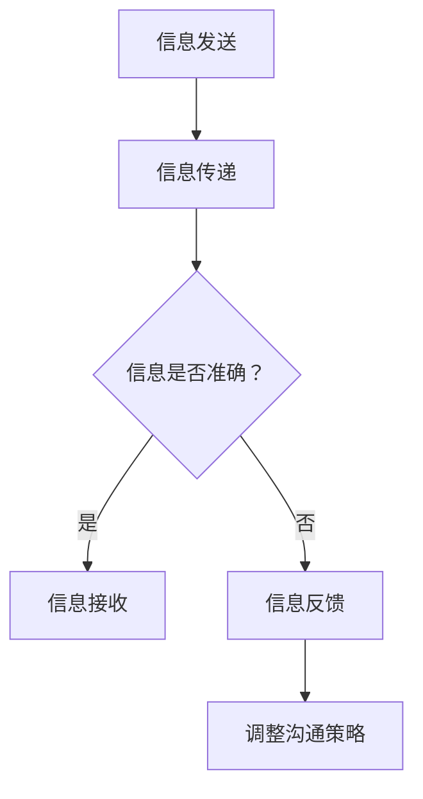
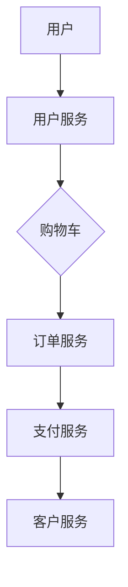
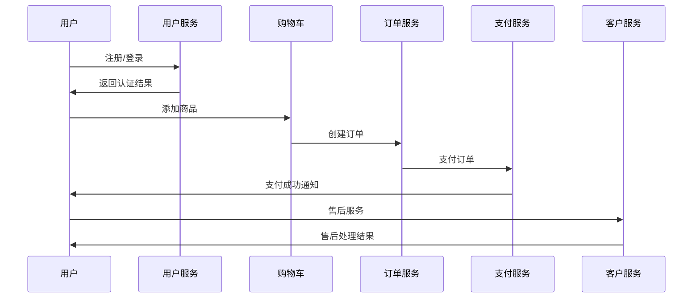

                 

# 团队沟通技巧：提升信息传递效率

关键词：团队沟通、信息传递效率、沟通障碍、技巧

摘要：本文将深入探讨团队沟通中存在的各种障碍，并详细解析提升信息传递效率的实用技巧，帮助读者在实际工作中更好地进行团队协作。

## 引言

在当今快速发展的信息技术时代，团队沟通的重要性不言而喻。无论是软件开发、项目管理，还是市场营销，团队间的有效沟通都是保证项目成功的关键因素。然而，在实际工作中，我们经常遇到沟通障碍，导致信息传递效率低下，甚至产生误解和冲突。本文将围绕团队沟通技巧，逐步探讨如何提升信息传递效率。

### 背景介绍

#### 核心概念术语说明

1. **沟通**：信息在个人、团队和组织间的交换过程。
2. **信息传递效率**：信息从发送者到接收者的准确度和速度。
3. **沟通障碍**：影响信息有效传递的各种因素。

#### 问题背景

在复杂的团队环境中，沟通障碍常常表现为：

1. **信息误解**：由于语言、文化或表达不清导致的信息偏差。
2. **信息遗漏**：信息在传递过程中被无意中省略或误传。
3. **沟通不畅**：团队内部或跨部门间的信息传递不畅。

#### 问题描述

如何在实际工作中识别并解决沟通障碍，提高信息传递效率，是一个亟待解决的问题。

#### 问题解决

通过以下方法，我们可以有效解决沟通障碍：

1. **明确沟通目标**：确保每次沟通都有明确的目的和预期结果。
2. **加强倾听**：积极倾听对方意见，避免中断或打断。
3. **提高表达能力**：清晰、简洁地表达自己的观点和需求。

#### 边界与外延

团队沟通不仅限于组织内部，还涉及到与客户、供应商和其他利益相关者的互动。因此，沟通技巧的边界和范围非常广泛。

#### 概念结构与核心要素组成

1. **沟通模型**：了解沟通的基本模型和流程，如SCQA（情境-问题-回答-行动）模型。
2. **沟通渠道**：熟悉不同的沟通渠道，包括口头、书面和非语言沟通。
3. **沟通技巧**：掌握有效的沟通策略，如积极倾听、清晰表达和冲突管理。

### 核心概念与联系

#### 核心概念原理

沟通的类型与渠道是团队沟通的基础。以下是几个关键概念：

1. **沟通类型**：分为单向沟通和双向沟通，其中双向沟通更利于信息传递。
2. **沟通渠道**：包括正式渠道（如会议、报告）和非正式渠道（如小道消息、非正式讨论）。

#### 概念属性特征对比表格

| 概念       | 特征                                       |
| ---------- | ------------------------------------------ |
| 单向沟通   | 信息传递方向单一，无反馈                     |
| 双向沟通   | 信息传递双向，有反馈和互动                   |
| 正式渠道   | 有明确组织和规则，正式且结构化               |
| 非正式渠道 | 无特定规则和组织，自由且灵活               |

#### ER实体关系图架构

```mermaid
erDiagram
  Customer ||--|{ Order }|--| Customer
  Product ||--|{ Order }|--| Product
  Customer ||--|{ Payment }|--| Customer
```

### 算法原理讲解

为了提高信息传递效率，我们可以采用以下算法模型：

1. **沟通效率评估模型**：通过统计信息传递的准确度和速度来评估沟通效率。
2. **优化沟通策略模型**：根据评估结果调整沟通策略，提高效率。

以下是沟通效率评估模型的Mermaid流程图：



### 数学公式

沟通效率可以用以下公式表示：

$$
效率 = \frac{准确度 \times 速度}{时间}
$$

#### 算法原理示例

假设在一个团队项目中，项目组长向开发人员传达了一个任务。沟通效率可以通过以下步骤进行评估：

1. **准确度**：信息传达无误，开发人员完全理解任务。
2. **速度**：信息在短时间内传递，无需反复确认。
3. **时间**：从信息发出到接收的总时间。

根据以上假设，沟通效率为：

$$
效率 = \frac{1 \times 1}{1} = 1
$$

这意味着沟通非常高效。

### 系统分析与架构设计方案

#### 问题场景介绍

在一个大型软件开发项目中，团队需要高效沟通以协调各个开发小组的工作。

#### 项目介绍

项目名称：企业级电商平台
项目目标：构建一个功能完善、性能卓越的电商平台。

#### 系统功能设计

1. 用户注册与登录
2. 商品浏览与搜索
3. 购物车与订单管理
4. 支付与结算
5. 客户服务与支持

#### 系统架构设计

以下是系统架构的Mermaid图：



#### 系统接口设计与系统交互

以下是系统接口设计和交互的Mermaid序列图：



### 项目实战

#### 环境安装

1. 安装Python环境
2. 安装相关依赖库（如Django、Flask等）

#### 系统核心实现源代码

以下是用户注册功能的Python代码示例：

```python
# 用户注册功能实现
def register(username, password):
    # 验证用户名和密码
    if not username or not password:
        return "用户名或密码不能为空"

    # 保存用户信息到数据库
    user = User(username=username, password=password)
    db.session.add(user)
    db.session.commit()

    return "注册成功"
```

#### 代码应用解读与分析

该代码实现了一个简单的用户注册功能，包括用户名和密码的验证以及用户信息的保存。通过Django ORM（对象关系映射），将用户信息保存到数据库中。

#### 实际案例分析与详细讲解剖析

在一个电商项目中，用户注册功能的实现对于系统的安全性至关重要。以下是一个实际案例的分析：

1. **用户名和密码验证**：确保用户名和密码的合法性，防止恶意注册。
2. **密码加密存储**：为了安全起见，密码应该加密存储，避免泄露。
3. **数据库连接**：使用ORM进行数据库连接，简化开发过程。

#### 项目小结

通过实际案例，我们可以看到，团队沟通在项目开发中的重要性。有效的沟通不仅能够提高项目开发效率，还能保证系统的安全性和稳定性。

### 最佳实践 tips

1. **定期团队会议**：确保团队内的信息传递畅通。
2. **明确沟通目标**：每次沟通前明确目标和预期结果。
3. **积极倾听与反馈**：倾听他人意见，及时给予反馈。

### 小结

团队沟通是确保项目成功的关键因素。通过明确沟通目标、加强倾听、提高表达能力，我们可以有效解决沟通障碍，提高信息传递效率。在实际工作中，不断实践和总结，将有助于我们不断提升团队沟通技巧。

### 注意事项

1. **避免过度沟通**：避免不必要的会议和信息传递，确保效率。
2. **尊重文化差异**：在全球化的团队中，尊重文化差异，采用适当的沟通方式。

### 拓展阅读

1. [《高效能人士的七个习惯》](链接)
2. [《非暴力沟通》](链接)
3. [《沟通的艺术》](链接)

作者：AI天才研究院/AI Genius Institute & 禅与计算机程序设计艺术 /Zen And The Art of Computer Programming

----------------------------------------------------------------

