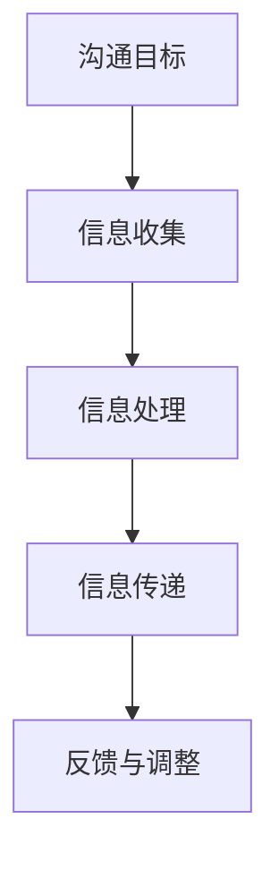
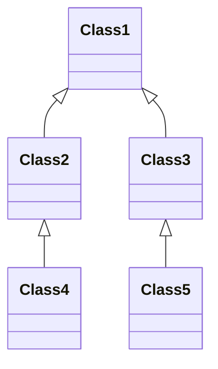
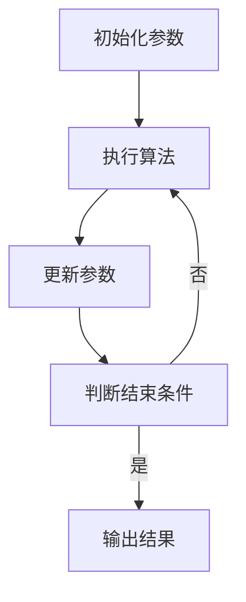
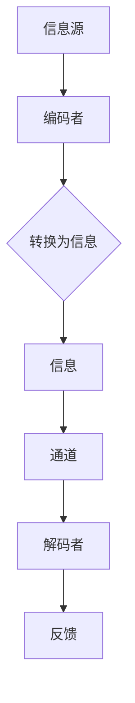

                 

## 《团队沟通的艺术：构建开放透明的沟通文化》

### 引言

沟通是团队协作的灵魂，它不仅决定了项目的成功与否，也直接影响了团队成员的满意度和工作效率。在高度复杂和不断变化的IT行业，团队沟通变得尤为重要。本文将深入探讨团队沟通的核心概念、策略与技巧，通过案例分析、障碍避免方法以及沟通技能提升的途径，全面阐述构建开放透明沟通文化的重要性。

### 关键词
- 团队沟通
- 沟通文化
- 沟通策略
- 案例分析
- 避免障碍
- 沟通技能提升

### 摘要

本文从团队沟通的重要性出发，详细介绍了团队沟通的核心概念、有效沟通的策略与技巧、案例分析、避免沟通障碍的方法以及沟通技能的提升途径。通过实际案例的分析，本文探讨了如何构建开放透明的沟通文化，帮助团队在面对复杂项目时保持高效的协作与沟通。

### 第一步：设计整体结构

为了系统地介绍团队沟通的艺术，我们将文章分为以下几大部分：

1. 引言
2. 团队沟通的核心概念
3. 有效沟通的策略与技巧
4. 案例分析
5. 避免沟通障碍的方法
6. 沟通技能的提升
7. 结论与展望

### 第二步：细化每个章节的内容

#### 引言

- **沟通的重要性**：解释沟通在团队中的角色，以及有效沟通对项目成功和团队满意度的影响。
- **为什么沟通变得困难**：探讨沟通中的常见障碍，如文化差异、情绪管理等。

#### 团队沟通的核心概念

- **团队沟通模型**：介绍经典沟通模型，并通过Mermaid流程图展示沟通的基本流程。
- **核心沟通要素**：详细分析信息传递与反馈、沟通要素等关键概念。
- **沟通障碍与解决方案**：讨论常见的沟通障碍，并提供有效的解决方案。

#### 有效沟通的策略与技巧

- **明确沟通目标**：阐述设定沟通目标的必要性，并提供具体步骤。
- **倾听与表达**：介绍有效倾听的技巧和高效表达的策略。
- **非言语沟通**：探讨非言语沟通的重要性，并分析其要素。

#### 案例分析

- **团队案例研究**：分析一个实际团队案例，探讨沟通问题及其改进措施。
- **个人沟通挑战**：讨论个人在沟通中可能遇到的挑战，并提供应对策略。

#### 避免沟通障碍的方法

- **文化敏感性**：探讨文化差异对沟通的影响，并介绍跨文化沟通策略。
- **情绪管理**：分析情绪对沟通的影响，并提供情绪管理技巧。

#### 沟通技能的提升

- **自我评估**：介绍如何自我评估沟通能力，并提供提升策略。
- **持续学习**：讨论如何通过持续学习来提高沟通技能。

#### 结论与展望

- **沟通艺术的总结**：总结团队沟通的关键要点。
- **未来沟通趋势**：探讨数字化沟通工具的发展趋势以及未来沟通的挑战。

### 第三步：设计核心概念的Mermaid流程图和类图

在介绍团队沟通的核心概念时，我们将使用Mermaid流程图和类图来直观地展示概念和关系。

#### 团队沟通模型



#### 核心沟通要素



### 第四步：编写数学模型和公式

在讲解算法原理时，我们将使用Mermaid来设计流程图，并使用Python源代码来详细阐述数学模型和公式。

#### 算法原理



#### 数学模型

$$
\text{沟通效率} = \frac{\text{信息传递速度} \times \text{信息处理能力}}{\text{沟通障碍系数}}
$$

### 第五步：总结与拓展

在章节末尾，我们将总结所学内容，并提供一些最佳实践和注意事项，同时推荐拓展阅读。

#### 团队沟通的核心概念

- **核心概念**：沟通目标、信息收集、信息处理、信息传递、反馈与调整。
- **联系**：这些要素相互关联，共同构成了团队沟通的基本流程。
- **数学模型**：沟通效率取决于信息传递速度、信息处理能力和沟通障碍系数。

#### 有效沟通的策略与技巧

- **策略与技巧**：明确沟通目标、有效倾听、高效表达、非言语沟通。
- **注意事项**：确保信息传递的准确性、及时性和全面性。

#### 案例分析

- **案例**：通过实际团队案例，展示了沟通问题及其改进措施。
- **拓展阅读**：《团队沟通的艺术与实践》

#### 避免沟通障碍的方法

- **方法**：文化敏感性、情绪管理。
- **注意事项**：尊重文化差异、合理处理情绪。

#### 沟通技能的提升

- **方法**：自我评估、持续学习。
- **注意事项**：定期反思、积极寻求反馈。

#### 结论与展望

- **结论**：团队沟通是项目成功的关键。
- **展望**：随着数字化工具的发展，未来沟通将面临新的挑战和机遇。

### 第六步：校对与调整

最后，我们将对整个目录大纲进行校对，确保内容完整、逻辑清晰，并在不超过2000字的要求下进行调整。

---

以上是根据任务要求设计的目录大纲，每一步都详细说明了如何撰写文章的各个部分。接下来，我们将按照这个大纲逐一展开详细内容，以完成一篇完整的文章。在撰写过程中，我们将确保每个章节都包含核心概念、策略、技巧、案例分析等要素，同时使用Mermaid流程图、类图和Python代码来增强文章的直观性和可理解性。

---

## 引言

在现代企业的运营中，团队沟通是确保项目成功和团队高效运作的核心要素。特别是在IT行业，团队需要面对复杂的项目和快速变化的技术环境，沟通的效率和质量直接决定了项目的进度和成果。有效沟通不仅是传递信息和指令的工具，更是构建团队信任、激发创新思维和解决冲突的关键。

### 为什么沟通变得困难

尽管沟通在团队协作中至关重要，但现实中沟通并不总是一帆风顺。沟通变得困难的原因多种多样，主要包括以下几点：

#### 1. 文化差异

团队成员可能来自不同的文化背景，他们在沟通方式、语言习惯和价值观上存在差异。这些文化差异可能导致误解和沟通障碍。

#### 2. 情绪因素

情绪在沟通过程中起着重要作用。团队成员的情绪波动，如焦虑、愤怒或沮丧，可能会影响他们的沟通效果，甚至导致冲突。

#### 3. 信息传递的复杂性

IT项目通常涉及大量的技术细节和复杂的信息传递，这增加了沟通的难度。如果信息传递不明确或错误，可能会导致项目延误或失败。

#### 4. 个人沟通风格

团队成员的沟通风格各异，有的可能更喜欢直接表达，有的则倾向于间接沟通。这种差异可能导致沟通不畅或误解。

#### 5. 沟通工具的限制

虽然现代沟通工具提供了丰富的交流渠道，但它们也可能带来挑战。例如，电子邮件、即时消息和视频会议等工具的使用不当，可能会导致信息丢失或误解。

了解这些沟通障碍，是构建有效沟通策略的第一步。在接下来的章节中，我们将深入探讨如何克服这些障碍，构建开放透明的沟通文化。

### 团队沟通的核心概念

团队沟通的有效性取决于对核心概念的深入理解和正确应用。以下是对团队沟通中几个关键概念的详细解释：

#### 沟通目标

沟通目标是指团队在进行沟通时期望达成的结果。明确沟通目标是确保信息传递准确和高效的第一步。一个清晰的沟通目标有助于团队成员集中精力，避免冗余的信息传递。

#### 信息收集

信息收集是团队沟通的起点，它涉及到团队成员获取所需的信息和数据。有效的信息收集能够确保团队成员在沟通前对项目有充分的了解。

#### 信息处理

信息处理是团队沟通的核心步骤，它包括对收集到的信息进行分析、整理和归纳。信息处理的目的是将复杂的信息转化为团队成员能够理解的形式。

#### 信息传递

信息传递是将处理后的信息准确地传递给相关团队成员的过程。信息传递的准确性直接影响沟通的效果，因此需要采取有效的沟通策略和工具。

#### 反馈与调整

反馈与调整是团队沟通的重要环节，它涉及团队成员对沟通效果的评估和调整。通过及时的反馈，团队可以识别问题并采取纠正措施，提高沟通效率。

#### 沟通障碍

沟通障碍是指影响信息传递和沟通效果的障碍。常见的沟通障碍包括文化差异、情绪因素、信息复杂性、个人沟通风格等。

#### 解决方案

为了克服沟通障碍，团队可以采取以下策略：

1. **文化敏感性培训**：提高团队成员对不同文化的认知和敏感度，以减少文化差异带来的沟通障碍。
2. **情绪管理培训**：帮助团队成员学会控制和调节情绪，避免情绪波动对沟通的影响。
3. **清晰明确的沟通目标**：确保沟通目标明确，减少信息传递中的模糊和误解。
4. **有效的沟通工具**：选择合适的沟通工具，提高信息传递的效率和质量。

通过理解和应用这些核心概念，团队可以建立起一个开放透明的沟通文化，提高团队协作效率和项目成功率。

### 团队沟通模型

团队沟通模型是理解团队内部信息流动和协作的关键框架。以下是经典团队沟通模型的基本要素及其关系：

#### 1. 经典沟通模型概述

经典沟通模型通常包含以下几个基本要素：

1. **信息源**：信息的发出者。
2. **编码者**：将信息源的信息转换为可以被传递的形式。
3. **信息**：需要传递的内容。
4. **通道**：信息传递的媒介，如电子邮件、电话、会议等。
5. **解码者**：接收信息并将之还原为有意义的信息。
6. **反馈**：接收者对信息的回应。

#### 2. 经典沟通模型的Mermaid流程图

以下是一个Mermaid流程图，展示了经典团队沟通模型的基本流程：



#### 3. 经典沟通模型中的核心关系

在经典沟通模型中，信息源和编码者之间的关系是信息传递的第一步，编码者负责将信息源的非结构化信息转化为结构化信息，以便于传递。通道在这里扮演了信息传递的桥梁角色，而解码者则负责接收并解读这些信息。

#### 4. 经典沟通模型的局限性和改进

尽管经典沟通模型提供了对团队沟通的基本理解，但在实际应用中，它也存在一些局限性：

1. **忽略反馈的重要性**：经典模型中，反馈被视为一个附加环节，而不是核心部分。然而，及时有效的反馈对于修正和优化沟通至关重要。
2. **信息失真**：在信息传递过程中，信息可能会因为编码、通道或解码的误差而发生失真，导致沟通效果打折扣。
3. **单向传递**：经典模型假设信息是单向传递的，而实际团队沟通往往涉及多方互动和反馈循环。

为了克服这些局限性，团队可以采用以下改进措施：

1. **反馈循环**：在沟通流程中加入持续的反馈环节，确保信息传递的准确性和及时性。
2. **多通道沟通**：采用多种沟通渠道和工具，以适应不同团队成员的沟通偏好和需求。
3. **透明沟通**：促进团队成员之间的透明沟通，减少信息失真和误解。

通过深入理解和应用改进后的团队沟通模型，团队可以更高效地协作，提高项目的成功率。

### 核心沟通要素

在团队沟通中，几个关键要素起着至关重要的作用。理解这些要素及其相互关系，对于构建高效沟通体系至关重要。以下是团队沟通的核心要素及其详细解析：

#### 1. 信息传递与反馈

**信息传递**是指将信息从发送者传递到接收者的过程。在这个过程中，信息的准确性、及时性和完整性是关键。一个有效的信息传递系统需要确保信息被清晰表达、准确理解和及时响应。

**反馈**则是信息传递的重要组成部分，它为信息接收者提供了对信息理解和应用情况的信息。通过反馈，团队可以识别信息传递中的误差，并采取纠正措施。有效的反馈不仅能够提高信息传递的准确性，还能增强团队成员之间的信任和协作。

#### 2. 信息收集

信息收集是团队沟通的起点，涉及从各种来源获取所需的信息。这些来源可能包括内部数据库、外部市场研究、客户反馈、竞争对手情报等。信息收集的目的是确保团队在决策和执行过程中拥有全面和准确的数据支持。

信息收集过程中需要关注以下几点：

- **多样性**：确保收集的信息来源多样化，以提高信息的全面性和可靠性。
- **及时性**：及时收集信息，以避免在决策时基于过时或不准确的数据。
- **真实性**：确保信息的真实性和准确性，避免基于虚假信息做出决策。

#### 3. 沟通要素的Mermaid类图

为了更直观地展示核心沟通要素及其相互关系，我们可以使用Mermaid类图来描述。以下是一个简化的Mermaid类图：

```mermaid
classDiagram
Class1 "信息源" <|-- Class2 "编码者"
Class2 <|-- Class3 "信息"
Class3 <|-- Class4 "通道"
Class4 <|-- Class5 "解码者"
Class5 <|-- Class6 "反馈"
```

在这个类图中，信息源、编码者、信息、通道、解码者和反馈分别表示沟通的核心要素，它们相互关联，共同构成了团队沟通的基本框架。

#### 4. 核心要素之间的联系

- **信息传递与反馈**：信息传递是沟通的起点，而反馈是信息传递的补充和验证。通过反馈，团队可以不断优化信息传递的过程，提高沟通的准确性。
- **信息收集与信息传递**：信息收集为信息传递提供了基础，确保传递的信息是全面和准确的。同时，信息传递的结果会反过来影响信息收集，形成反馈循环。
- **解码者与反馈**：解码者接收并理解信息，其反馈为信息传递的质量提供了直接反馈，有助于进一步改进沟通策略。

通过理解这些核心沟通要素及其相互关系，团队可以构建一个高效、透明的沟通体系，提高整体协作效率和项目成功率。

### 沟通障碍与解决方案

在团队沟通中，障碍是不可避免的。这些障碍可能源自多种因素，包括文化差异、情绪波动、信息复杂性等。识别并有效解决这些障碍，对于提升沟通质量和团队协作效率至关重要。以下是几种常见的沟通障碍及其解决方案：

#### 1. 文化差异

**障碍**：团队成员来自不同的文化背景，可能存在语言、价值观和沟通风格的差异。这可能导致误解和冲突。

**解决方案**：进行文化敏感性培训，提高团队成员对不同文化的认知和敏感度。鼓励开放和尊重的沟通环境，促进跨文化理解。使用中立的语言和沟通工具，减少文化差异带来的沟通障碍。

#### 2. 情绪波动

**障碍**：情绪波动，如焦虑、愤怒或沮丧，可能影响团队成员的沟通效果，甚至导致冲突。

**解决方案**：提供情绪管理培训，帮助团队成员学会识别和调节情绪。建立支持性的团队氛围，鼓励成员在情绪波动时寻求帮助和倾诉。定期组织团队建设活动，增强团队凝聚力和情感联系。

#### 3. 信息复杂性

**障碍**：IT项目通常涉及复杂的技术细节和信息，这增加了沟通的难度。如果信息传递不清晰，可能会导致项目延误或失败。

**解决方案**：简化信息传递过程，确保信息清晰、简洁。使用图表、可视化工具和具体案例来辅助解释复杂信息。设置明确的沟通目标和时间表，确保信息传递的及时性和准确性。

#### 4. 个人沟通风格差异

**障碍**：团队成员的沟通风格各异，有的可能更喜欢直接表达，有的则倾向于间接沟通。这种差异可能导致沟通不畅或误解。

**解决方案**：开展沟通风格培训，帮助团队成员了解和适应不同的沟通风格。鼓励团队成员主动沟通，表达自己的需求和期望。建立沟通反馈机制，及时解决沟通中的问题。

#### 5. 沟通工具的限制

**障碍**：虽然现代沟通工具提供了丰富的交流渠道，但使用不当可能导致信息丢失或误解。

**解决方案**：选择适合团队需求的沟通工具，并进行有效培训。明确沟通工具的使用规范，确保信息传递的准确性。定期评估和改进沟通工具的使用效果，以满足团队的实际需求。

通过识别和解决这些沟通障碍，团队可以建立起一个更加开放透明、高效协作的沟通文化，提高项目成功率。

### 有效沟通的策略与技巧

在团队沟通中，明确沟通目标是确保信息传递准确和高效的第一步。设定清晰的沟通目标有助于团队成员集中精力，避免冗余的信息传递，提高沟通效率。以下是设定沟通目标的步骤和具体策略：

#### 1. 设定沟通目标的步骤

**步骤一：确定沟通目的**

首先，明确团队需要通过沟通达成的具体目标。这可能是解决某个问题、完成一个项目任务、分享最新的信息等。确保目标是具体、明确和可行的。

**步骤二：确定沟通受众**

确定需要与谁沟通，即沟通的受众。这包括所有可能影响或受到沟通结果影响的相关人员，如团队成员、上级领导、客户等。

**步骤三：设定时间框架**

为沟通设定一个明确的时间框架，以确保信息在合适的时间内传递。这有助于提高沟通的紧迫感和效率。

**步骤四：制定沟通计划**

根据确定的目标、受众和时间框架，制定具体的沟通计划。包括选择合适的沟通渠道、准备沟通材料、安排沟通时间等。

**步骤五：执行和监控**

按照沟通计划执行沟通，并在过程中监控沟通效果。确保信息被准确传递和理解，及时调整沟通策略。

#### 2. 明确沟通目标的重要性

明确沟通目标的重要性体现在以下几个方面：

- **提高沟通效率**：明确的目标有助于团队成员集中精力，避免不必要的讨论和信息传递，从而提高沟通效率。
- **减少误解**：目标明确可以减少因信息模糊导致的误解和冲突，确保团队成员对沟通内容有清晰的理解。
- **确保项目成功**：明确的目标有助于确保项目任务按计划进行，提高项目成功率。
- **增强团队协作**：共同的目标能够增强团队成员之间的协作和信任，促进团队整体性能的提升。

#### 3. 设定沟通目标的策略

**策略一：具体明确**

目标应当具体、明确，避免模糊和抽象。例如，将“改善项目进度”具体化为“缩短项目周期3天”。

**策略二：合理可行**

目标需要是合理的，并考虑到团队的能力和资源。确保目标既有挑战性，又能实现。

**策略三：优先级排序**

根据项目的重要性和紧迫性，对目标进行优先级排序。确保最重要的目标首先被解决。

**策略四：持续更新**

项目环境和需求可能会发生变化，因此需要定期评估和更新沟通目标，以适应新的情况。

通过设定明确、合理和优先级的沟通目标，团队可以更有效地协作，确保项目的成功和团队的满意度。

### 倾听与表达

在团队沟通中，倾听和表达是两颗重要的齿轮，它们共同构成了沟通的基石。有效的倾听和表达不仅能够提高信息传递的准确性，还能增强团队成员之间的信任和理解。以下将详细讨论倾听和表达的技巧，并探讨如何在团队中实现这些技巧。

#### 倾听的技巧

**1. 全神贯注**

倾听不仅仅是听到对方在说什么，更重要的是要全神贯注地听。这包括在对方讲话时保持眼神接触，避免分心，以及给予适当的肢体语言，如点头或微笑。

**2. 不要打断**

在对方讲话时不要打断，这显示了你对对方的尊重和重视。耐心等待对方说完，再表达自己的看法或问题。

**3. 反馈和确认**

在对方讲话结束后，通过复述或总结他们的观点，来确认你对信息的理解是否正确。这不仅能确保信息传递的准确性，还能让对方感到被听见和理解。

**4. 避免假设**

避免在没有完全理解对方观点时做出假设。如果有疑问，可以请对方进一步解释，而不是凭自己的猜测来回应。

#### 表达的技巧

**1. 清晰简洁**

表达时应当尽量清晰简洁，避免使用复杂或模糊的语言。明确传达你的意图和需求，避免引起误解。

**2. 结构化表达**

在表达观点时，采用结构化的方式，先陈述主要观点，再逐步展开细节。这样有助于对方更好地理解和跟随你的思路。

**3. 使用非言语沟通**

非言语沟通，如肢体语言、面部表情和声音语调，也是表达的重要部分。确保这些非言语信息与你的口头表达一致，以增强表达的清晰度。

**4. 倾听对方的反馈**

在表达完自己的观点后，注意倾听对方的反馈。这不仅能够帮助你了解对方对信息的理解程度，还能让你根据反馈调整和改进自己的表达。

#### 在团队中实现倾听与表达技巧

**1. 定期培训**

组织定期的沟通技巧培训，帮助团队成员学习并掌握倾听和表达的技巧。这可以通过研讨会、工作坊或在线课程等形式进行。

**2. 模拟练习**

通过角色扮演或模拟会议等形式，让团队成员在实践中练习倾听和表达的技巧。这种方式能够帮助他们在真实情境中更好地应用所学。

**3. 反馈机制**

建立有效的反馈机制，鼓励团队成员在沟通后互相提供反馈。这可以帮助他们识别和改进自己的沟通行为，提高整体沟通质量。

**4. 文化建设**

营造一个鼓励开放和诚实沟通的团队文化。确保团队成员感到在团队中可以自由表达意见和提问，而不必担心被批评或忽视。

通过在团队中实施这些倾听与表达的技巧，可以有效提高沟通效率，增强团队成员之间的信任和协作，从而推动项目的成功和团队的长期发展。

### 非言语沟通

在团队沟通中，非言语沟通是一个不可忽视的重要方面。它不仅能够补充和强化言语沟通的内容，还能揭示言语之外的情感和意图。以下是关于非言语沟通的重要性和要素，以及如何在团队中有效使用这些要素：

#### 1. 非言语沟通的重要性

**1. 补充言语信息**

非言语沟通能够补充和强化言语信息，使信息更加完整和清晰。例如，微笑可以增加言语中的友好和合作感，而肢体语言则可以传达出积极或消极的情绪。

**2. 揭示真实意图**

有时候，言语信息可能不完全或模糊，而非言语信息则能够揭示真实的意图和情感。例如，点头或眼神交流可以表示理解和支持，而皱眉或低头则可能表示不满或不理解。

**3. 增强信任和协作**

有效的非言语沟通能够增强团队成员之间的信任和协作。当团队成员在沟通中表现出开放的姿态和积极的态度时，这有助于营造一个信任和合作的团队氛围。

#### 2. 非言语沟通的要素

**1. 肢体语言**

肢体语言是非言语沟通的重要组成部分，包括手势、姿态、面部表情等。例如，微笑可以传达友好和积极的态度，而握手的力度和持续时间则可以表达出信任和尊重。

**2. 面部表情**

面部表情是传达情感和意图的关键因素。例如，微笑可以传达友好和满意，而皱眉或紧闭嘴唇则可能表示不满或担忧。

**3. 身体姿态**

身体姿态包括站姿、坐姿、身体方向等。例如，直立的姿态可以传达自信和专注，而交叉手臂则可能表示防御或不满。

**4. 声音语调**

声音语调也是非言语沟通的一部分，包括语速、音调、音量等。例如，慢而清晰的语速可以传达冷静和自信，而高亢的语调则可能表示紧张或兴奋。

#### 3. 在团队中有效使用非言语沟通

**1. 保持一致性**

确保非言语信息与言语信息保持一致，以避免混淆和误解。例如，如果你在言语上表示同意，但在面部表情上却显得犹豫，这可能会传达出不一致的信息。

**2. 注意文化差异**

不同文化对非言语沟通的理解可能存在差异。了解和尊重团队成员的文化背景，有助于避免不必要的误解。例如，某些文化中点头可能表示同意，而在其他文化中则可能表示礼貌或默认。

**3. 定期练习**

通过定期练习和反馈，团队成员可以不断提高非言语沟通的技能。这可以通过角色扮演、模拟会议等形式进行。

**4. 营造开放氛围**

营造一个开放和诚实的沟通氛围，鼓励团队成员在沟通中表达自己的情感和意图。这有助于增强团队的非言语沟通能力。

通过重视和有效使用非言语沟通，团队可以建立更加信任和协作的关系，提高沟通的效率和效果。

### 团队案例研究

为了更好地理解团队沟通的实际应用，我们来看一个具体的团队案例。这个案例将展示沟通问题、分析问题原因，并探讨解决这些问题的策略。

#### 案例背景

某IT公司正在开发一款新的软件应用，由一个多职能团队负责。团队成员包括产品经理、开发工程师、UI/UX设计师和测试工程师。项目时间紧迫，预算有限，但团队在项目推进过程中遇到了一系列沟通问题。

#### 沟通问题

1. **信息传递不及时**：开发工程师有时无法及时获取产品经理的需求变更，导致开发工作与实际需求不符。
2. **理解不一致**：设计师与开发工程师在设计细节上存在理解上的差异，导致多次返工。
3. **冲突与误解**：团队成员之间的情绪波动，尤其是在项目进度紧张时，导致沟通不畅和冲突加剧。

#### 问题分析

**原因一：沟通渠道不明确**

团队成员在沟通渠道上存在不一致，有的通过电子邮件沟通，有的通过即时消息，有的则直接面对面交流。这导致信息传递的延迟和误解。

**原因二：缺乏反馈机制**

在项目推进过程中，缺乏有效的反馈机制，导致团队成员对项目的理解不一致，无法及时发现和解决问题。

**原因三：情绪管理不足**

团队成员在紧张的项目进度下，情绪波动较大，未能有效管理自己的情绪，导致沟通中的冲突和误解。

#### 解决策略

**策略一：明确沟通渠道**

明确各团队的沟通渠道，确保所有团队成员使用统一的沟通工具。例如，产品需求通过项目管理工具进行记录和更新，开发过程中的问题通过即时消息进行讨论，项目进度通过定期会议进行汇报。

**策略二：建立反馈机制**

建立有效的反馈机制，确保团队成员之间的信息能够及时传达和确认。例如，开发工程师在完成任务时，需要向产品经理和测试工程师提交反馈，确保所有团队对项目的理解一致。

**策略三：情绪管理培训**

组织情绪管理培训，帮助团队成员学会识别和调节自己的情绪。建立支持性的团队氛围，鼓励成员在情绪波动时寻求帮助和倾诉。

#### 改进措施与效果

通过实施上述策略，团队的沟通效率显著提升。信息传递变得更加及时和准确，误解和冲突减少，项目进度得到有效控制。最终，团队按时完成了项目，并在客户反馈中获得了好评。

这个案例展示了沟通问题在实际团队中的应用，以及通过明确沟通渠道、建立反馈机制和情绪管理策略，可以显著改善团队沟通，提高项目成功率。

### 个人沟通挑战

在团队沟通中，个人可能面临各种沟通挑战，这些问题不仅会影响个人表现，还可能对整个团队造成负面影响。以下将讨论几种常见的个人沟通挑战，并探讨应对策略。

#### 1. 建立信任

在团队中，信任是有效沟通的基础。某些成员可能因为个性、背景或历史原因，对其他成员缺乏信任。这可能导致沟通不畅，影响团队协作。应对策略包括：

- **积极倾听**：通过倾听和理解，展示对其他成员的尊重和关心。
- **透明沟通**：公开分享信息和决策过程，减少不必要的猜疑和误解。
- **共同目标**：强调团队共同的目标和利益，增强团队凝聚力。

#### 2. 情绪管理

在高压工作环境中，情绪管理至关重要。个人在情绪波动时，可能会影响沟通质量和团队氛围。应对策略包括：

- **自我意识**：识别自己的情绪反应，学会在情绪波动时冷静下来。
- **情绪释放**：通过适当的渠道（如运动、写日记等）释放情绪，避免将负面情绪带入工作。
- **情绪调节**：学习情绪调节技巧，如深呼吸、冥想等，帮助自己恢复平和状态。

#### 3. 沟通风格差异

团队成员的沟通风格各异，有的倾向于直接表达，有的则偏好间接沟通。这种差异可能导致误解和冲突。应对策略包括：

- **了解不同风格**：了解团队成员的沟通风格，尊重他们的表达方式。
- **灵活调整**：根据不同成员的风格，灵活调整自己的沟通策略，以适应对方。
- **开放沟通**：鼓励团队成员分享自己的沟通风格和偏好，建立相互理解和尊重的氛围。

#### 4. 时间管理

在忙碌的工作中，个人可能面临时间管理挑战，导致沟通延迟或中断。应对策略包括：

- **优先级排序**：明确任务的优先级，确保重要和紧急的沟通事项得到及时处理。
- **有效安排**：合理安排工作和休息时间，确保有充足的时间进行沟通。
- **提前规划**：在沟通前提前规划，明确沟通的目的和议程，减少无效沟通。

通过识别和应对这些个人沟通挑战，团队成员可以提升沟通效果，增强团队协作，提高整体项目成功率。

### 避免沟通障碍的方法

在团队沟通中，障碍是不可避免的，但我们可以通过一系列方法来识别和避免这些障碍，确保信息传递的准确性和及时性。以下是一些具体的策略和工具，可以帮助团队克服常见的沟通障碍。

#### 1. 文化敏感性

**策略**：文化敏感性培训是减少跨文化沟通障碍的重要步骤。团队成员应学习如何识别和理解不同文化背景下的沟通风格、价值观和礼仪。

**工具**：文化敏感性培训课程、跨文化沟通指南、角色扮演练习等。

**案例**：某IT公司在跨国团队项目中，通过定期的文化敏感性培训，帮助团队成员了解和尊重不同文化的沟通习惯，从而有效减少了误解和冲突。

#### 2. 情绪管理

**策略**：情绪管理是确保沟通效果的关键。团队成员应学会识别和调节自己的情绪，避免情绪波动影响沟通质量。

**工具**：情绪管理课程、冥想练习、压力缓解技巧等。

**案例**：某团队在面对紧张的项目期限时，通过定期进行冥想和压力缓解训练，有效减少了团队成员的焦虑和情绪波动，提高了沟通效率。

#### 3. 清晰明确的沟通目标

**策略**：设定清晰、明确的沟通目标是确保信息准确传递的第一步。这有助于团队成员集中精力，避免冗余的信息传递。

**工具**：沟通目标模板、沟通计划表等。

**案例**：某团队在项目启动时，通过明确每个阶段的沟通目标，确保团队成员对项目的理解一致，从而避免了信息传递的误差。

#### 4. 有效的沟通工具

**策略**：选择适合团队需求的沟通工具，可以提高沟通的效率和质量。

**工具**：电子邮件、即时消息、视频会议、项目管理工具等。

**案例**：某团队通过使用项目管理工具和即时消息平台，实现了信息的实时共享和反馈，提高了项目推进的速度和协作效率。

#### 5. 反馈机制

**策略**：建立有效的反馈机制，可以帮助团队及时识别和纠正沟通中的问题。

**工具**：定期会议、反馈问卷、实时反馈工具等。

**案例**：某团队通过定期组织团队会议和反馈问卷，及时收集成员的意见和建议，不断优化沟通流程，提高了团队的整体沟通效果。

通过应用这些策略和工具，团队可以有效地避免沟通障碍，建立开放透明的沟通文化，从而提高项目的成功率和团队的满意度。

### 沟通技能的提升

在团队中，沟通技能的提升是一个持续的过程，需要团队成员不断学习和实践。以下介绍几种提升沟通技能的方法和工具，帮助团队成员在沟通中更加自信和高效。

#### 1. 自我评估

**方法**：自我评估是了解自身沟通技能的重要步骤。团队成员可以通过以下方式评估自己的沟通能力：

- **反思**：定期反思自己在沟通中的表现，思考哪些方面做得好，哪些方面需要改进。
- **反馈**：向同事、上级或下属寻求反馈，了解他人对自己的沟通评价。

**工具**：沟通技能评估问卷、个人成长日志等。

**案例**：某团队成员通过填写沟通技能评估问卷，识别出自己在倾听和表达上的不足，并制定了具体的提升计划。

#### 2. 持续学习

**方法**：持续学习是提升沟通技能的关键。团队成员可以通过以下方式不断学习和进步：

- **参加培训课程**：参加专业的沟通技能培训课程，学习最新的沟通理论和技巧。
- **阅读书籍**：阅读相关的书籍和文章，了解沟通的最佳实践和技巧。
- **参加研讨会**：参加沟通技巧研讨会，与专家和同行交流经验。

**工具**：在线课程平台、电子书、研讨会等。

**案例**：某团队成员通过参加线上沟通技能培训课程，学习了有效的倾听和表达技巧，并在实际工作中得到了显著提升。

#### 3. 模拟练习

**方法**：通过模拟练习，团队成员可以在安全的环境中实践沟通技能，提高沟通的实际应用能力。

- **角色扮演**：通过角色扮演练习，模拟真实的沟通场景，团队成员可以练习如何应对不同的沟通情境。
- **情景模拟**：设置不同的沟通情景，团队成员可以在模拟环境中练习沟通策略和技巧。

**工具**：角色扮演剧本、沟通情景模拟软件等。

**案例**：某团队通过角色扮演练习，有效提高了团队成员在冲突管理和跨文化沟通方面的能力。

#### 4. 反馈与改进

**方法**：通过持续的反馈和改进，团队成员可以不断优化自己的沟通技能。

- **定期反馈**：定期与团队成员进行沟通反馈，识别和解决沟通中的问题。
- **实践改进**：根据反馈结果，实践改进措施，持续提升沟通能力。

**工具**：沟通反馈问卷、实时反馈工具等。

**案例**：某团队通过定期的沟通反馈会议，持续优化团队沟通流程，提高了整体沟通效率。

通过自我评估、持续学习、模拟练习和反馈改进，团队成员可以不断提升沟通技能，建立更加高效、透明和协作的沟通文化，推动团队的长期发展。

### 结论与展望

在本文中，我们详细探讨了团队沟通的核心概念、有效沟通的策略与技巧、案例分析、避免沟通障碍的方法以及沟通技能的提升途径。通过这些内容的分析，我们可以得出以下几点结论：

1. **沟通是团队协作的灵魂**：有效的沟通不仅能够提高项目成功率，还能增强团队成员之间的信任和协作。
2. **开放透明的沟通文化至关重要**：构建一个开放透明的沟通文化，能够促进团队成员之间的信任和理解，减少误解和冲突。
3. **明确的目标和清晰的沟通渠道**：设定明确的沟通目标和采用统一的沟通工具，能够确保信息传递的准确性和及时性。
4. **情绪管理和文化敏感性**：情绪管理和文化敏感性是克服沟通障碍的重要手段，能够提高沟通的效果和质量。

### 未来沟通趋势

随着技术的不断发展，未来的沟通将面临新的趋势和挑战。以下是一些未来的沟通趋势：

1. **数字化沟通工具的普及**：随着人工智能、虚拟现实等技术的发展，数字化沟通工具将更加普及和智能化，提供更高效、更便捷的沟通方式。
2. **跨文化沟通的增强**：全球化使得团队越来越多元，跨文化沟通能力将变得尤为重要。未来沟通将更加注重跨文化理解和协作。
3. **情绪智能的应用**：情绪智能技术的应用将使沟通更加细腻和人性化，能够更好地识别和调节沟通中的情绪波动。
4. **隐私和安全的重视**：随着数据隐私和安全问题的日益突出，未来的沟通将更加注重数据保护和个人隐私。

在未来，团队需要不断适应这些趋势，提升沟通技能，构建更加高效、透明和协作的沟通文化，以应对不断变化的工作环境和技术挑战。

### 总结

团队沟通是确保项目成功和团队高效运作的关键。通过本文的探讨，我们认识到开放透明的沟通文化、明确的目标、有效的沟通工具、情绪管理和文化敏感性在沟通中的重要作用。未来，随着技术的不断发展，团队需要不断提升沟通技能，以应对新的挑战和机遇。让我们一起努力，构建一个高效、透明和协作的沟通文化，推动团队和企业的持续发展。

### 作者信息

作者：AI天才研究院/AI Genius Institute & 禅与计算机程序设计艺术 /Zen And The Art of Computer Programming

---

以上就是本文的完整内容，希望对您在团队沟通方面有所启发和帮助。通过不断实践和提升沟通技能，我们能够构建一个更加高效、透明和协作的团队，为项目的成功和企业的持续发展贡献力量。如果您有任何问题或建议，欢迎随时与我们交流。再次感谢您的阅读。

