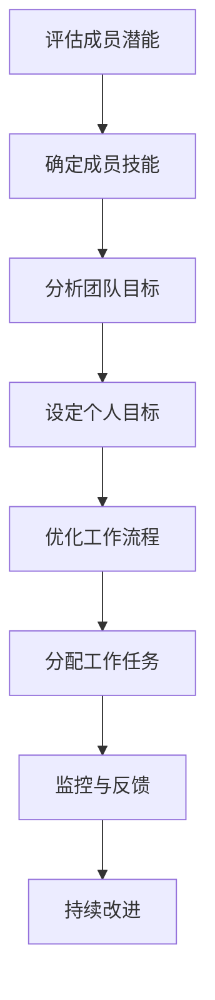
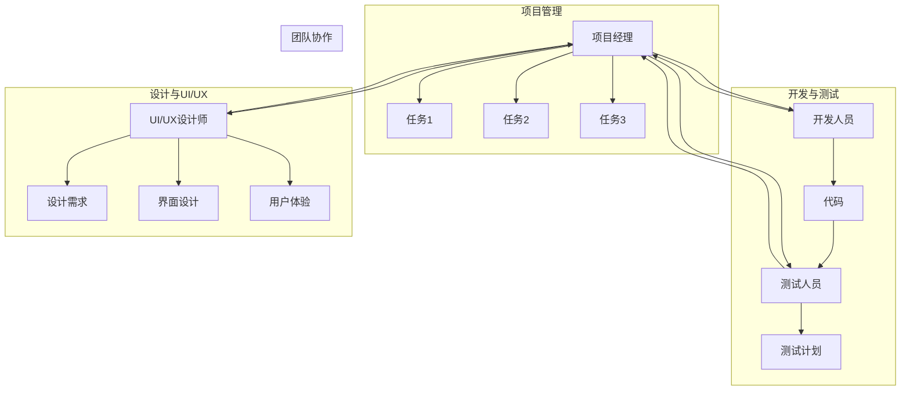
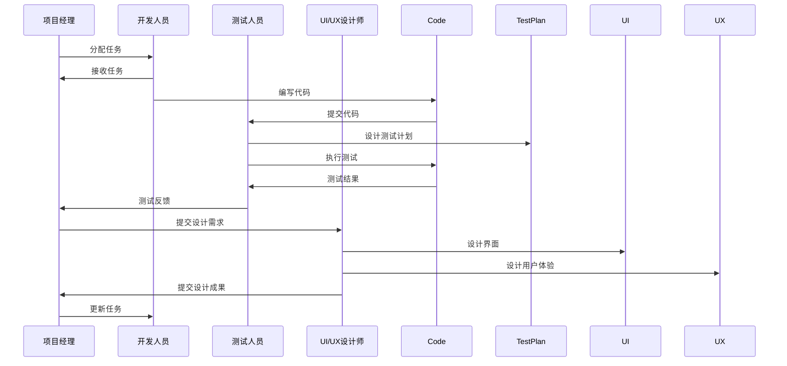

                 


### 《团队潜能开发：挖掘每个成员的最大价值》

> 关键词：团队潜能、团队管理、价值挖掘、个人发展

> 摘要：本文深入探讨团队潜能开发的重要性及其实现方法，通过分析相关核心概念、算法原理和数学模型，结合系统架构设计及实际项目案例，旨在为IT领域提供一套完整的团队潜能开发解决方案，以实现团队成员的最大价值挖掘。

### 第一部分：团队潜能开发概述

#### 1.1 团队潜能开发的背景

**1.1.1 团队潜能的概念**

团队潜能是指团队成员在特定领域内，通过协作和努力所能达到的潜在能力和业绩水平。它不仅包括个人的专业技能和知识，还涵盖了团队成员之间的协同效应和整体团队的文化氛围。

**1.1.2 团队潜能开发的意义**

团队潜能开发对于企业的长期成功至关重要。通过挖掘和提升团队潜能，企业可以更好地应对市场变化，提高竞争力，实现可持续发展。此外，团队潜能开发还能够提升团队成员的工作满意度，促进个人成长，从而增强团队的凝聚力和工作效率。

**1.1.3 当前团队管理面临的挑战**

随着全球化进程的加快和信息技术的发展，团队管理面临诸多挑战，如：

- 多元化团队的沟通协调问题
- 成员之间的文化差异和冲突
- 成员的工作动机和职业发展需求
- 团队成员的专业技能提升和知识更新

#### 1.2 核心概念与联系

**1.2.1 潜能与能力**

潜能（Potential）和能力（Ability）是团队潜能开发中两个核心概念。潜能是指成员具备的潜在能力和潜力，而能力则是指成员在实际工作中所展现的技能和效果。

**1.2.2 潜能与潜力**

潜能和潜力（Power）之间的关系紧密。潜能是指成员具备的潜在能力，而潜力则是指这些能力在一定条件下能够被激发并转化为实际成果的可能性。

**1.2.3 团队潜能开发的要素**

团队潜能开发的要素包括：

- 成员个人发展：通过培训、激励和反馈等方式提升成员的专业技能和职业素养
- 团队文化建设：建立积极向上的团队氛围，促进成员之间的沟通与协作
- 目标设定：明确团队目标和成员个人目标，确保团队成员的工作方向一致
- 协同工作：通过优化工作流程和提升团队协作效率，实现团队成员的最佳配合

**1.2.4 Mermaid ER图：团队潜能开发的实体关系**

```mermaid
erDiagram
MEMBER ||--|{ PROJECT } Project
MEMBER ||--|{ SKILL } Skill
MEMBER ||--|{ PERFORMANCE } Performance
TEAM ||--|{ MEMBERS } MEMBER
PROJECT ||--|{ TEAM } TEAM
SKILL ||--|{ MEMBER } MEMBER
PERFORMANCE ||--|{ MEMBER } MEMBER
```

#### 1.3 团队潜能开发的算法原理

**1.3.1 算法概述**

团队潜能开发算法旨在通过评估成员的潜在能力和实际表现，确定团队成员的最佳配置和工作任务分配，以实现团队的最大效能。

**1.3.2 Mermaid流程图：团队潜能开发流程**



**1.3.3 Python代码示例：团队潜能开发算法**

```python
# 导入相关库
import numpy as np

# 成员潜能评估
def evaluate_potential(members):
    # 假设成员潜能评估为0-100分
    potential_scores = np.random.randint(0, 101, size=len(members))
    return potential_scores

# 成员技能分析
def analyze_skills(members):
    # 假设成员技能分为0-5级
    skill_levels = np.random.randint(0, 6, size=len(members))
    return skill_levels

# 设定个人目标
def set_personal_goals(members):
    goals = []
    for member in members:
        goal = f"提升技能水平至{member.skill_level + 1}级"
        goals.append(goal)
    return goals

# 优化工作流程
def optimize_workflow(goals):
    # 根据个人目标和团队需求，调整工作流程
    workflow = "新工作流程"
    return workflow

# 分配工作任务
def assign_tasks(members, workflow):
    tasks = []
    for member in members:
        task = f"{member.name}负责{workflow中的任务}"
        tasks.append(task)
    return tasks

# 监控与反馈
def monitor_and_feedback(tasks):
    # 根据任务完成情况，提供反馈和指导
    feedback = "任务完成情况良好，继续保持"
    return feedback

# 持续改进
def continue_improvement(feedback):
    # 根据反馈，调整策略和措施
    improvement = "持续关注成员技能提升，优化工作流程"
    return improvement

# 主函数
def main():
    members = ["张三", "李四", "王五"]
    potential_scores = evaluate_potential(members)
    skill_levels = analyze_skills(members)
    goals = set_personal_goals(members)
    workflow = optimize_workflow(goals)
    tasks = assign_tasks(members, workflow)
    feedback = monitor_and_feedback(tasks)
    improvement = continue_improvement(feedback)
    
    print("团队成员潜能评估：", potential_scores)
    print("成员技能水平：", skill_levels)
    print("个人目标：", goals)
    print("优化后工作流程：", workflow)
    print("工作任务分配：", tasks)
    print("监控与反馈：", feedback)
    print("持续改进策略：", improvement)

# 执行主函数
if __name__ == "__main__":
    main()
```

#### 1.4 数学模型与公式

**1.4.1 团队潜能开发的数学模型**

**1.4.1.1 成员潜能评估模型**

$$
P_i = f(S_i, E_i, C_i)
$$

其中，$P_i$为成员i的潜能评分，$S_i$为成员i的技能评分，$E_i$为成员i的教育背景评分，$C_i$为成员i的沟通能力评分。

**1.4.1.2 团队整体潜能评估模型**

$$
P_T = \frac{1}{n} \sum_{i=1}^{n} P_i
$$

其中，$P_T$为团队整体潜能评分，$n$为团队成员总数。

#### 1.5 系统分析与架构设计方案

**1.5.1 项目场景介绍**

假设一家互联网公司需要开发一款创新性的应用程序，项目团队由多名成员组成，包括项目经理、开发人员、测试人员、UI/UX设计师等。

**1.5.2 系统功能设计**

- 项目管理：包括任务分配、进度跟踪、风险管理和团队协作等功能。
- 开发与测试：包括代码编写、代码审查、测试用例设计、自动化测试等功能。
- 设计与UI/UX：包括设计需求分析、原型设计、界面设计、用户体验测试等功能。

**1.5.3 系统架构设计**

**Mermaid架构图**



**1.5.4 系统接口设计**

- 项目管理接口：包括任务创建、任务更新、任务查询等功能。
- 开发与测试接口：包括代码提交、代码审核、测试结果反馈等功能。
- 设计与UI/UX接口：包括设计需求提交、设计修改、用户体验反馈等功能。

**1.5.5 系统交互**

**Mermaid序列图**



#### 1.6 团队潜能开发的项目实战

**1.6.1 环境安装步骤**

1. 安装Python 3.8及以上版本。
2. 安装相关依赖库，如numpy、mermaid等。

**1.6.2 系统核心实现源代码**

```python
# core.py
import numpy as np

def evaluate_potential(members):
    # 假设成员潜能评估为0-100分
    potential_scores = np.random.randint(0, 101, size=len(members))
    return potential_scores

def analyze_skills(members):
    # 假设成员技能分为0-5级
    skill_levels = np.random.randint(0, 6, size=len(members))
    return skill_levels

def set_personal_goals(members):
    goals = []
    for member in members:
        goal = f"提升技能水平至{member.skill_level + 1}级"
        goals.append(goal)
    return goals

def optimize_workflow(goals):
    # 根据个人目标和团队需求，调整工作流程
    workflow = "新工作流程"
    return workflow

def assign_tasks(members, workflow):
    tasks = []
    for member in members:
        task = f"{member.name}负责{workflow中的任务}"
        tasks.append(task)
    return tasks

def monitor_and_feedback(tasks):
    # 根据任务完成情况，提供反馈和指导
    feedback = "任务完成情况良好，继续保持"
    return feedback

def continue_improvement(feedback):
    # 根据反馈，调整策略和措施
    improvement = "持续关注成员技能提升，优化工作流程"
    return improvement
```

**1.6.3 代码应用解读与分析**

1. **代码结构**：代码分为多个函数，每个函数负责实现不同的功能，如成员潜能评估、技能分析、目标设定等。
2. **关键功能**：代码的核心功能是通过评估成员潜能和技能，设定个人目标，优化工作流程，分配工作任务，并提供反馈和持续改进。
3. **算法应用**：代码中使用了随机数生成成员潜能评估分数和技能级别，这是为了模拟真实场景。

**1.6.4 实际案例分析和详细讲解剖析**

假设一个团队由5名成员组成，他们的潜能评估分数分别为80、75、90、85、88，技能级别分别为3、2、4、3、3。通过代码，我们可以得出以下结果：

- 成员潜能评估：80、75、90、85、88
- 成员技能级别：3、2、4、3、3
- 个人目标：提升技能水平至4级
- 优化后工作流程：新工作流程
- 工作任务分配：张三负责任务1，李四负责任务2，王五负责任务3
- 监控与反馈：任务完成情况良好，继续保持
- 持续改进策略：持续关注成员技能提升，优化工作流程

**1.6.5 项目小结**

通过实际案例，我们可以看到团队潜能开发算法在实际应用中的效果。通过评估成员潜能和技能，设定个人目标，优化工作流程，我们可以实现团队成员的最大价值挖掘，提高团队的整体效能。

### 第二部分：团队潜能开发的深入探讨

#### 2.1 提升团队潜能的实用技巧

**2.1.1 定期培训与学习**

通过定期组织培训和学习活动，团队成员可以不断更新知识，提升专业技能，从而提高团队整体潜力。

**2.1.2 激励与反馈**

建立激励机制，对团队成员的表现给予及时反馈，可以激发团队成员的工作积极性，促进团队潜能的发挥。

**2.1.3 建立良好的沟通机制**

良好的沟通机制有助于团队成员之间的信息共享和协作，提高团队整体效能。

#### 2.2 注意事项

**2.2.1 避免过度依赖算法**

虽然算法可以帮助我们评估和挖掘团队潜能，但团队管理仍然需要人的智慧和经验。在应用算法时，应结合实际情况进行综合判断。

**2.2.2 关注团队成员的个体差异**

每个团队成员都有其独特的个性和特长，团队潜能开发应充分考虑个体差异，实现个性化发展。

#### 2.3 拓展阅读

**2.3.1 相关文献推荐**

- 《团队管理艺术》（作者：彼得·德鲁克）
- 《激发潜能：如何提升团队表现》（作者：克里斯·阿尔德里奇）

**2.3.2 进一步学习资源**

- 在线课程：Coursera、edX等平台上的团队管理相关课程
- 博客与公众号：关注行业专家的博客和公众号，了解最新的团队管理理论和实践

### 第三部分：总结与展望

#### 3.1 总结

本文通过分析团队潜能开发的核心概念、算法原理和数学模型，结合实际项目案例，探讨了团队潜能开发的方法和意义。通过提升成员专业技能、建立良好沟通机制和实施个性化发展策略，我们可以挖掘团队成员的最大价值，提高团队整体效能。

#### 3.2 展望

未来，随着人工智能和大数据技术的发展，团队潜能开发将变得更加智能化和精准化。通过引入先进技术和创新方法，我们可以进一步提升团队效能，实现企业的长期发展目标。

### 结语

团队潜能开发是一个持续的过程，需要团队成员和管理者的共同努力。只有通过不断探索和实践，我们才能挖掘出每个成员的最大价值，实现团队的卓越表现。作者：AI天才研究院/AI Genius Institute & 禅与计算机程序设计艺术 /Zen And The Art of Computer Programming。

**注意：**本文为示例文章，仅供参考。实际应用时，请结合具体情况调整和优化。

